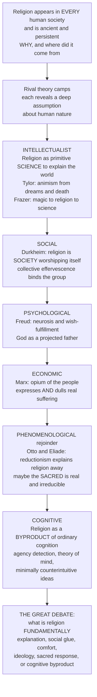

# 🕉️ Theories of the Origin of Religion

> [!abstract] TL;DR
> Religion appears in *every* known human society and reaches deep into prehistory, and for over a century thinkers have asked not "which religion is true?" but "why is there religion at all?" — the **intellectualist** theories (Tylor, Frazer) cast it as primitive science explaining a baffling world through animism; **Durkheim's** social theory reframed it as *society worshipping itself*, ritual generating a collective effervescence that binds the group; the **psychological** theories (Freud) located it in the mind as a projected father-figure and wish-fulfillment; **Marx's** economic critique named it the *opium of the people* that both expresses and dulls suffering under oppression; the **phenomenological** rejoinder (Otto, Eliade) warned that all such reductionism *explains religion away* and misses a genuine, irreducible experience of the sacred; and the contemporary **cognitive science of religion** argues that belief arises as a natural *byproduct* of ordinary mental machinery like hyperactive agency detection — so that this one debate over what religion *fundamentally is* still frames everything else.

---

## Intuition

**Analogy:** Imagine six detectives called to the same scene — a phenomenon found at every address in the world, in every century, leaving traces as old as the first deliberate burials, the painted caves, and the little carved figurines. The phenomenon is *religion*. Each detective is brilliant, each is certain, and each files a completely different report on where it came from and what it really is.

The first detective (the **intellectualist**) says: this is early humans doing *science*. Puzzled by dreams, death, and shadows, our ancestors reasoned their way to invisible souls and spirits behind the world — religion is a first, wrong draft of physics. The second detective (the **sociologist**) laughs: it was never about explaining nature. Watch what happens when a group gathers and chants and dances until the air itself feels charged — that transcendent power people call "god" is really *the group experiencing itself*, and religion's job is to hold the tribe together. The third (the **psychologist**) points inward: religion is the mind comforting itself, a cosmic father invented to protect frightened children from a universe that does not care. The fourth (the **economist**) is colder still: religion is a painkiller handed out by the powerful — it makes the exploited accept their suffering by promising justice in a heaven that never comes. The fifth detective (the **phenomenologist**) objects to all four: you are each *explaining religion away* by reducing it to something else — society, mind, money. What if it responds to something *real* and irreducible, an encounter with the sacred that your instruments simply cannot measure? And the sixth, newest detective (the **cognitive scientist**) offers a twist: nobody *invented* religion — it falls out of ordinary brain wiring. We are built to see agents in every rustling bush and to attribute minds to unseen beings; supernatural belief is a near-inevitable *byproduct* of how human cognition already works.

That is the whole field in miniature. To learn the theories of the origin of religion is to sit in that room and weigh six rival verdicts on the same universal, ancient, stubborn phenomenon — and to notice that each verdict smuggles in a deep assumption about what human beings fundamentally are.

---

## How It Works

The theories divide into a small number of great camps, arranged here roughly in the order they entered the debate. Notice the movement: from religion-as-explanation, to religion-as-social-force, to religion-as-psychology, to religion-as-ideology, to a defence of religion-as-irreducible, and finally to religion-as-cognitive-byproduct.



**Core mechanics of the debate:**

1. **The question shifts.** Before the nineteenth century, the live question was theological — *which* religion is true. The comparative and evolutionary sciences reframed it into a naturalistic one: given that religion is universal, ancient, and persistent, *why is there religion at all*, and what function or cause sustains it?
2. **Most classic answers are "reductive."** They explain religion in *non-religious* terms — as failed science, as society, as psychology, as economics. To call a theory reductive is not automatically an insult; it means it accounts for the religious in terms of something the theorist takes to be more basic.
3. **The camps disagree about the fundamental substrate.** Is the true object of religion *nature* (intellectualist), *the group* (Durkheim), *the psyche* (Freud/Jung), *class relations* (Marx), *the sacred itself* (Otto/Eliade), or *evolved cognitive architecture* (the cognitive scientists)?
4. **The anti-reductionist counter-move.** Phenomenologists insist that reduction commits a category error — that studying religion *as* religion requires bracketing the question of cause and describing the experience of the sacred on its own terms.
5. **The cognitive synthesis reopens everything.** By grounding belief in universal mental mechanisms, the cognitive science of religion explains the *recurrence* the classic theories only asserted, and reframes the old function debate as: is religion an evolutionary *adaptation*, a *byproduct*, or both?

---

## Key Concepts

### Secondary Level

**The puzzle in one line:** No society has ever been found without something we would recognise as religion, and the traces go back tens of thousands of years — deliberate burials with grave goods, cave paintings, carved figurines. Something so universal and so old demands an explanation.

**The six camps at a glance:**

| Camp | What religion *really is* | Signature figure | Slogan |
|---|---|---|---|
| **Intellectualist** | Primitive science — an attempt to explain the world | E. B. Tylor, J. G. Frazer | "Animism from dreams and death" |
| **Sociological** | Society worshipping itself | Émile Durkheim | "Collective effervescence" |
| **Psychological** | The mind comforting itself | Sigmund Freud | "God as projected father" |
| **Economic** | A tool of the powerful | Karl Marx | "Opium of the people" |
| **Phenomenological** | A real, irreducible encounter with the sacred | Otto, Eliade | "Do not explain it away" |
| **Cognitive** | A byproduct of ordinary brain wiring | Guthrie, Boyer, Barrett | "We see agents everywhere" |

**Reductive vs. sui generis:** The first four camps are *reductive* — they explain religion as *something else*. The fifth camp says religion is *sui generis* (Latin: "of its own kind") — it cannot be reduced without being destroyed. This clash is the single deepest fault line in the study of religion.

---

### Undergraduate Level

#### The Intellectualist / Evolutionist theories — religion as proto-science

The nineteenth-century "armchair anthropologists" treated religion as an early, rational attempt to *understand* a baffling world.

- **E. B. Tylor — Animism.** In *Primitive Culture* (1871) Tylor proposed that religion begins in the mind of a "primitive philosopher" reflecting on two experiences: **dreams** (in which one seems to travel and meet the dead) and **death** (the difference between a living body and a corpse). From these, early humans inferred a detachable animating principle — a **soul** — and then generalised it: if humans have souls, so might animals, plants, rivers, mountains. This projection of souls onto all of nature is **animism**, which Tylor offered as the "minimum definition" of religion and the seed from which spirits, ancestor cults, and gods later grew.
- **Max Müller — a "disease of language."** Müller derived religion from early peoples *personifying* natural forces (the dawn, the sky, the storm) and then, as the original meaning of their nature-words faded, mistaking the personifications for real deities — myth as a pathology of language.
- **J. G. Frazer — the evolutionary sequence.** In *The Golden Bough* (1890) Frazer proposed a unilinear progression of human thought: **magic → religion → science**. Magic tries to *coerce* nature by false causal laws (like produces like; contact transfers properties); when magic visibly fails, humans switch to *supplicating* superhuman persons — religion; when supplication also disappoints, science emerges to find the genuine laws.
- **Pre-animism / animatism.** R. R. Marett argued that *before* belief in discrete souls came a vaguer sense of impersonal sacred power — **mana** — a diffuse awe that animism later personified.

**The critique of the intellectualists** was devastating and is now standard: they were guilty of an *intellectualist bias* (assuming religion is primarily about explanation, as a philosopher might reason), of *unilinear evolutionism* (ranking living societies as "survivals" of Europe's own past), and of *armchair speculation* (theorising about "the savage mind" from library reports rather than fieldwork). Magic and religion demonstrably coexist in every society; neither vanishes as technology advances.

#### The Sociological / Functionalist theory — Durkheim

Émile Durkheim's *The Elementary Forms of Religious Life* (1912) turned the intellectualists on their head: religion is not about *nature* and not about the *individual* — it is fundamentally **social**.

- **The sacred and the profane.** The most elementary feature of all religion, for Durkheim, is the division of the world into two absolutely opposed classes: the **sacred** (set apart, hedged with prohibitions, approached with awe) and the **profane** (the ordinary, the everyday). What makes a thing sacred is not any physical property but the *social act* of setting it apart.
- **Totemism as the elementary form.** Studying Australian Aboriginal totemism as (he believed) the simplest surviving religion, Durkheim asked what the clan's totemic emblem *really* represents. Not the animal — too ordinary to inspire such intensity. The real referent is **society itself**: the impersonal force greater than any individual that compels, sustains, and outlives its members. *The totem is society's unconscious portrait of itself.*
- **Collective effervescence.** The mechanism is the heightened emotional energy generated when a group assembles for ritual — the synchronised chanting, dancing, and shared arousal produce a feeling of being lifted out of oneself, connected to a power that does not feel self-generated. Participants attribute this force to the sacred object before them, but its true source is the *social interaction*. Religion is therefore, in the famous phrase, **society worshipping itself**.
- **Function.** Religion's role is the production and periodic renewal of **social solidarity** and the **collective conscience** — it reproduces society by making individuals feel part of something greater (which, Durkheim insists, is not an illusion: society *is* greater than the individual).

Durkheim's functionalism founded the sociology of religion (see the cross-vault note **[[Religion_Sacred_and_Secular]]** and, in anthropology, **[[Religion_Magic_and_Ritual]]**), and its legacy runs through Robert Bellah's "civil religion" and every analysis of secular ritual. Its standard critique is an *over-emphasis on integration* — it struggles to account for religion as a source of *conflict* and division.

#### The Psychological theories — Freud, James, Jung

- **Sigmund Freud.** For Freud religion is a **collective obsessional neurosis** and a **wish-fulfillment**. In *The Future of an Illusion* (1927) God is a **projected, exalted father-figure**: as helpless children we depend on a protecting father, and religion re-creates that protection on a cosmic scale to console us against a frightening, indifferent universe. In *Totem and Taboo* (1913) he traced religion's origin to a mythic **primal horde** — sons killing and then, out of **Oedipal guilt**, deifying the father. (See the psychoanalytic tradition in **[[Psychodynamic_Theories]]**.)
- **William James** offered a warmer, empirical alternative in *The Varieties of Religious Experience* (1902): religion is rooted in **personal experience**, and should be judged pragmatically by its **fruits** in a life rather than explained away by its origins.
- **Carl Jung** located religion in the **archetypes** of the **collective unconscious** — universal symbolic forms (the self, the shadow, the divine child) that surface in myth and dream as a route to psychological wholeness.

Across this camp, religion answers a *psychological* need: consolation, meaning, and defence against the terror of mortality — a lineage that runs forward into modern terror-management theory.

#### The Economic / Ideological critique — Marx

For Karl Marx, religion is neither science nor psychology but **ideology**. His famous formulation calls religion the **"opium of the people"** — and the fuller passage is more sympathetic than the slogan: religion is "the *sigh of the oppressed creature*, the heart of a heartless world... the soul of soulless conditions." It is at once a genuine *expression of and protest against* real suffering **and** an *illusion that consoles and pacifies* — it makes exploitation bearable, legitimates the ruling order as divinely sanctioned, and defers justice to heaven, producing a **false consciousness** that dulls the will to change this world. Religion will disappear, Marx thought, only when the material conditions that require such consolation are abolished. (See the critical-theory lineage in **[[Marx_and_Critical_Theory]]**.)

---

### Graduate Level

#### The Phenomenological / anti-reductionist response — Otto and Eliade

Against the entire reductive project, a phenomenological tradition insists that religion is **sui generis** — an irreducible response to the **sacred** that cannot be *explained* as *really* being society, psychology, or economics without destroying the very thing to be studied.

- **Rudolf Otto**, in *The Idea of the Holy* (1917), named the core religious experience the **numinous**: an encounter with a *mysterium tremendum et fascinans* — a mystery that is simultaneously overwhelming/dreadful and irresistibly fascinating. This is a *non-rational* datum of consciousness, not a bad inference and not a social product.
- **Mircea Eliade**, in *The Sacred and the Profane* (1957), built a comparative phenomenology around the **hierophany** (a manifestation of the sacred), sacred space organised around an **axis mundi**, and sacred time renewed through the ritual repetition of myth. For Eliade, *homo religiosus* lives in a qualitatively different world, and the scholar's task is to describe that world *as experienced*, not to reduce it.

This is the field's defining methodological quarrel — **reductionism vs. sui generis** — a debate about whether religion can be a genuine object of causal explanation at all, or whether explanation is always secretly *explaining away*.

#### The Cognitive Science of Religion — the contemporary turn

The most active current program treats religion as a natural **byproduct of ordinary, evolved cognition** — no special "religion instinct" required. It uniquely explains the *recurrence* that classical theories merely asserted.

- **Hyperactive Agency Detection Device (HADD).** Stewart Guthrie (*Faces in the Clouds*, 1993) and Justin Barrett argued that humans possess an over-sensitive detector for **agents** (intentional beings). Because the survival cost of *missing* a real predator vastly exceeds the cost of a *false alarm*, selection favoured a trigger-happy detector — which spontaneously over-attributes agency to ambiguous events (rustling grass, illness, thunder), seeding belief in unseen agents like spirits and gods (modelled in the Python demo below).
- **Theory of mind.** Our default machinery for attributing beliefs, desires, and intentions to others (see **[[Social_Cognition_and_Theory_of_Mind]]**) can be aimed at *unseen* agents just as readily as at visible ones — letting us represent gods with full mental lives, watching and judging.
- **Minimally counterintuitive (MCI) concepts.** Pascal Boyer (*Religion Explained*, 2001) and Scott Atran showed that concepts violating *exactly one* intuitive expectation — a person who is invisible, a statue that hears prayers, a being that knows your thoughts — are recalled and transmitted better than either fully mundane concepts or maximally bizarre ones. The result is an *inverted-U* transmission advantage that predicts *which* supernatural ideas spread (also modelled below).
- **Promiscuous teleology.** Deborah Kelemen's work shows children (and adults under load) are intuitive purpose-seekers — biased to assume things exist "for" a reason — greasing the slide toward design and creator concepts.
- **Dual-inheritance and evolutionary accounts.** Ara Norenzayan's *Big Gods* argues that morally concerned, watchful "Big Gods" scaled up prosocial cooperation as societies grew, while **costly-signaling** and synchronised **ritual** theories treat religion as a solution to the free-rider problem — binding groups that out-cooperate and out-persist rivals. This revives Durkheim's function question in Darwinian form and frames the field's live dispute: is religion an **adaptation**, a **byproduct**, or **both**?

#### Why it matters

The theories of the origin of religion are not a museum of superseded guesses; they are the *conceptual scaffolding* of the entire field. Because religion appears in every known human society and is ancient and persistent, thinkers have long asked why it is so universal, and their rival answers reveal deep assumptions about human nature. The intellectualist theories cast religion as primitive science, an attempt to explain a baffling world through animism and the inference of spirits; Durkheim's social theory reframed it as society worshipping itself, with ritual generating a collective effervescence experienced as sacred and functioning to bind the group; the psychological theories located it in the mind as Freud's projected father-figure and wish-fulfillment; Marx's economic critique named it the opium of the people that both expresses and dulls real suffering under oppression; the phenomenological rejoinder of Otto and Eliade warned that all such reductionism explains religion away and that it may respond to a genuine, irreducible experience of the sacred; and the contemporary cognitive science of religion argues that religious belief arises naturally as a byproduct of ordinary mental machinery like hyperactive agency detection and minimally counterintuitive ideas — so that understanding these competing accounts of explanation, social glue, psychological comfort, ideology, sacred response, and cognitive byproduct is understanding the foundational question that still shapes how we think about religion throughout this vault. Every later topic — the very *definition* of religion, the *phenomenology of the sacred*, the *cognitive science* program, and the study of *religion and social order* — inherits its central assumptions from a stance taken in this debate.

---

## Python Demo

Two computational sketches of *why* religious belief recurs so reliably. Part (a) models the cognitive **agency-detection tradeoff** that biases us toward perceiving invisible agents; part (b) models the **minimally-counterintuitive recall** curve that predicts which supernatural ideas spread. Requires only `numpy` and `matplotlib`.

```python
"""
Origins of religion: two computational sketches of WHY religious belief
recurs across human societies.

(a) HADD  - under ASYMMETRIC costs, a trigger-happy agent detector is optimal,
            producing a standing bias to perceive invisible agents (spirits, gods).
(b) MCI   - concepts violating EXACTLY ONE intuitive expectation are remembered
            and transmitted best: an inverted-U that predicts which ideas spread.
"""

import numpy as np
import matplotlib.pyplot as plt

# ----------------------------------------------------------------------
# (a) HYPERACTIVE AGENCY DETECTION DEVICE  (signal-detection model)
# ----------------------------------------------------------------------
rng      = np.random.default_rng(42)
N        = 400_000     # ambiguous cues faced over a lifetime
p_agent  = 0.15        # a real agent (predator) is behind the cue 15% of the time
mu_agent = 2.0         # mean cue strength when an agent IS present
sigma    = 1.0         # sensory noise
C_miss   = 100.0       # cost of a FALSE NEGATIVE: missing a real predator = death
C_alarm  = 1.0         # cost of a FALSE POSITIVE: fleeing the wind = wasted energy

# Simulate cues: agent-present cues centred on mu_agent, absent cues on 0.
is_agent = rng.random(N) < p_agent
cue      = rng.normal(np.where(is_agent, mu_agent, 0.0), sigma)

thresholds = np.linspace(-3.0, 6.0, 400)     # "respond AGENT if cue > threshold"

def expected_cost(c_miss, c_alarm):
    costs = np.empty_like(thresholds)
    for i, theta in enumerate(thresholds):
        respond = cue > theta
        fn = np.mean(is_agent & ~respond)    # predator present, NO response  -> miss
        fp = np.mean(~is_agent & respond)    # no predator, panic             -> false alarm
        costs[i] = c_miss * fn + c_alarm * fp
    return costs

cost_asym = expected_cost(C_miss, C_alarm)   # realistic predator asymmetry
cost_sym  = expected_cost(1.0, 1.0)          # hypothetical symmetric costs

theta_asym = thresholds[np.argmin(cost_asym)]
theta_sym  = thresholds[np.argmin(cost_sym)]
print(f"Optimal threshold, symmetric costs   : {theta_sym:+.2f}")
print(f"Optimal threshold, predator asymmetry: {theta_asym:+.2f}  (far lower = OVER-detect)")

# ----------------------------------------------------------------------
# (b) MINIMALLY COUNTERINTUITIVE RECALL  (inverted-U transmission curve)
# ----------------------------------------------------------------------
# recall(n) = (base + gain*n) * exp(-decay*n)
#   distinctiveness RISES with the number of violations n;
#   integration/processing cost DECAYS it -> a single-violation optimum.
n_violations       = np.arange(0, 7)
base, gain, decay  = 0.30, 1.00, 0.80
recall = (base + gain * n_violations) * np.exp(-decay * n_violations)
recall = recall / recall.max()               # normalise to relative transmission
peak   = n_violations[np.argmax(recall)]
print(f"Peak transmission at {peak} violation(s): minimally counterintuitive")

# ----------------------------------------------------------------------
# PLOTS
# ----------------------------------------------------------------------
fig, (ax1, ax2) = plt.subplots(1, 2, figsize=(13, 5))

ax1.plot(thresholds, cost_asym, color="crimson", lw=2,
         label="predator asymmetry  (miss=100, alarm=1)")
ax1.plot(thresholds, cost_sym, color="steelblue", lw=2, ls="--",
         label="symmetric costs  (miss=1, alarm=1)")
ax1.axvline(theta_asym, color="crimson", ls=":", lw=1.5)
ax1.axvline(theta_sym, color="steelblue", ls=":", lw=1.5)
ax1.annotate("optimum shifts LEFT\n= over-detect agents",
             xy=(theta_asym, cost_asym.min()),
             xytext=(theta_asym - 3.2, cost_asym.min() + 0.55 * cost_asym.ptp()),
             arrowprops=dict(arrowstyle="->"))
ax1.set_xlabel("detection threshold  (respond AGENT if cue > threshold)")
ax1.set_ylabel("expected lifetime cost")
ax1.set_title("(a) Hyperactive Agency Detection\nasymmetric costs favour a trigger-happy detector")
ax1.legend()

labels = ["0\nmundane", "1\nMCI", "2", "3", "4", "5", "6\nbizarre"]
colors = ["gray", "seagreen"] + ["gray"] * 5
ax2.bar(n_violations, recall, color=colors, edgecolor="black")
ax2.set_xticks(n_violations)
ax2.set_xticklabels(labels)
ax2.set_xlabel("number of counterintuitive violations")
ax2.set_ylabel("relative recall / transmission")
ax2.set_title("(b) Minimally Counterintuitive concepts\none violation is remembered best -> spreads")

plt.tight_layout()
plt.savefig("origins_of_religion.png", dpi=120)
plt.show()
```

**What the output shows.** Panel (a): with symmetric costs the optimal threshold sits near the statistically "fair" point, but once *missing a predator* costs far more than a *false alarm*, the cost-minimising threshold slides sharply left — the organism is selected to *shout "agent!" on flimsy evidence*. That standing over-detection bias is exactly the substrate on which belief in unseen spirits and gods is built. Panel (b): recall peaks not at the mundane (nothing to remember) nor at the maximally bizarre (too costly to encode) but at **one** violation — the minimally counterintuitive sweet spot that explains why "an invisible person who hears you" is a stickier idea than either "a person" or "a floating, time-travelling, seven-headed committee."

---

## Real-World Applications

- **The comparative study of religion itself.** Every introductory course and reference work organises the field around exactly these camps; which theory you adopt determines what counts as *data* (doctrines? rituals? neural mechanisms? class relations?) and what counts as an *explanation*.
- **Cognitive experiments and computational modelling.** MCI recall is a *testable* prediction — Barrett, Boyer, and Atran ran memory experiments on invented god-concepts and folktales, and agent-detection biases are probed in the lab with ambiguous motion displays, directly turning a theory of origins into empirical psychology.
- **Public policy and secularization forecasting.** Durkheimian and economic theories underwrite competing predictions about religion's future — will modernity dissolve the "opium" (Marx) or will pluralistic markets and the enduring need for solidarity keep religion vigorous (Durkheim/Stark)?
- **The science-and-religion conversation.** Whether the cognitive science of religion *explains away* faith or merely describes its natural mechanisms is a live application of the reductionism-vs-sui-generis debate, shaping theology, apologetics, and the New Atheist critique alike.
- **Cultural evolution and cooperation research.** "Big Gods," costly signaling, and synchronised ritual are used by economists and evolutionary anthropologists to model how large-scale human cooperation became possible at all.

---

## Common Pitfalls

- **Treating the theories as mutually exclusive.** They often answer *different questions* — Tylor asks about *cognitive origin*, Durkheim about *social function*, the cognitive scientists about *recurrence mechanisms*. A theory of function does not refute a theory of origin; many scholars now hold layered, complementary views.
- **The genetic fallacy.** Showing that religion *originated* in agency-detection, wish-fulfillment, or social bonding says nothing, by itself, about whether religious claims are *true* — origin and truth are logically independent. Both militant reducers and defensive believers routinely confuse the two.
- **Smuggling in unilinear evolutionism.** The Frazerian ladder "magic → religion → science" and the Tylorian ranking of "primitive" peoples are empirically false and ethnocentric; magic, religion, and science coexist everywhere. Beware any framing that treats living societies as fossils of the European past.
- **Assuming Durkheim thought religion was "false."** Durkheim insisted the transcendent power people feel is *real* — it is society. His theory is functional and social, not a debunking; misreading it as mere illusion-talk loses its whole point.
- **Confusing byproduct with adaptation.** "Religion is a cognitive byproduct" (belief falls out of machinery evolved for other things) is a *different* claim from "religion is an adaptation" (selected *for* its group-binding benefits). Blurring them muddles the field's central contemporary dispute.
- **Reductionism vs. explaining-away.** Assuming that *any* naturalistic account automatically dissolves the sacred begs the very question phenomenologists raise; conversely, declaring religion simply "irreducible" can become a way of exempting it from inquiry. Hold the tension rather than collapsing it.

---

## Related Concepts

- **[[Religion_Sacred_and_Secular]]** — the Sociology vault's treatment of Durkheim, Weber, and Marx on religion; the direct sociological companion to this note's "social" and "economic" camps.
- **[[Religion_Magic_and_Ritual]]** — the Anthropology vault's account of animism, magic, totemism, and collective effervescence; supplies the ethnographic detail behind the intellectualist and Durkheimian theories.
- **[[Psychodynamic_Theories]]** — the Psychology vault's exposition of Freud and the psychoanalytic tradition that grounds the "religion as neurosis and wish-fulfillment" camp.
- **[[Marx_and_Critical_Theory]]** — the Philosophy vault's account of ideology and false consciousness, the intellectual home of "religion as the opium of the people."
- **[[Social_Cognition_and_Theory_of_Mind]]** — the Cognitive Science vault's mechanism for attributing minds to others, repurposed by the cognitive science of religion to represent unseen watchful agents.

This note is the foundation stone for its sibling notes in this vault (referenced here in prose while they are being written): a *Religious Studies and Comparative Religion Overview* mapping the whole discipline; *Defining Religion and the Sacred*, which asks what the object of all these theories even is; *Phenomenology of Religion*, which develops the Otto–Eliade anti-reductionist program; *The Cognitive Science of Religion*, which expands the byproduct-vs-adaptation debate sketched above; and *Religion and Social Order*, which extends Durkheim's functionalist and Marx's ideological accounts into the study of society.

---

## Review Questions

1. **(Secondary)** Religion is found in every known human society and reaches deep into prehistory. State the core claim each of the six camps makes about *what religion fundamentally is*, and give the signature figure for each.
2. **(Undergraduate)** Explain how Durkheim's concept of *collective effervescence* leads to his conclusion that religion is "society worshipping itself." How does this reframing differ from Tylor's claim that religion originated as an attempt to *explain* nature?
3. **(Undergraduate)** Freud and Marx both call religion an *illusion*, yet their theories are usually placed in different camps. What distinct human reality does each say religion is *really* about, and why does that difference matter?
4. **(Graduate)** The cognitive science of religion claims belief is a *byproduct* of hyperactive agency detection and minimally counterintuitive concepts. Using the two models in the Python demo, explain *why* these mechanisms would make religious belief recurrent — and then assess whether this explanation *explains religion away* or is compatible with Otto and Eliade's sui-generis view of the sacred.
5. **(Graduate)** "A theory of religion's *function* and a theory of its *cognitive origin* are not rivals." Argue for or against this claim, using Durkheim, HADD, and the adaptation-vs-byproduct debate, and identify what would count as evidence for each position.

---

## Sources

- Tylor, E. B. *Primitive Culture* (1871) — the founding statement of animism and the intellectualist theory of religion's origin.
- Durkheim, É. *The Elementary Forms of Religious Life* (1912) — the sociological theory: the sacred, totemism, and collective effervescence.
- Freud, S. *The Future of an Illusion* (1927) — religion as wish-fulfillment and the projected father-figure.
- Boyer, P. *Religion Explained: The Evolutionary Origins of Religious Thought* (2001) — the cognitive byproduct account and minimally counterintuitive concepts.
- Guthrie, S. *Faces in the Clouds: A New Theory of Religion* (1993) — anthropomorphism and hyperactive agency detection.

---

#religious-studies #origins-of-religion #animism #durkheim #cognitive-science-of-religion
