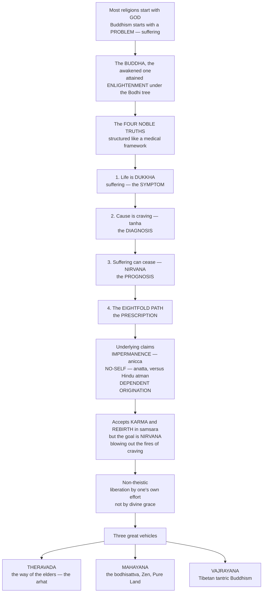

# ☸️ Buddhism and the Path to Liberation

> [!abstract] TL;DR
> Where most religions begin with **God**, Buddhism begins with a **problem** — *dukkha*, the pervasive unsatisfactoriness of existence — and offers a practical method to end it, more like a **physician's diagnosis** than a theology. Its founder, **Siddhartha Gautama** (the **Buddha**, "the awakened one," ~5th c. BCE), a prince who confronted old age, sickness, and death, attained **enlightenment** under the Bodhi tree and taught the diagnostic **Four Noble Truths**: life involves suffering; its cause is craving (*tanha*); suffering can cease (*nirvana*); and the cure is the **Eightfold Path**. Underlying this are radical claims — everything is **impermanent** (*anicca*), there is **no permanent self** (*anatta*, in stark contrast to the Hindu *atman*), and all things arise in **dependent origination**. Buddhism accepts **karma** and **rebirth** in *samsara* but aims at **nirvana**, the "blowing out" of craving, won through one's **own effort** rather than divine grace — a largely **non-theistic** framework. From this root grew three great vehicles: **Theravada**, **Mahayana** (with its compassionate *bodhisattva*, Zen, and Pure Land), and **Vajrayana** — making Buddhism at once a religion, a philosophy, and a practical technology of the mind.

---

## Intuition

**Analogy:** Imagine you go to a doctor, not a priest. A priest might tell you about God, sin, and salvation; a good physician does something more concrete — she *diagnoses*. She names your symptom, identifies its cause, tells you whether a cure exists, and writes a prescription. Symptom, diagnosis, prognosis, prescription: four steps, and you walk out with a plan rather than a doctrine.

This is precisely the shape of the Buddha's central teaching. He was, by his own framing, less a theologian than a **physician of the mind**. The Buddha — Siddhartha Gautama, a sheltered prince who slipped out of his palace and was shattered by his first encounters with **old age, sickness, and death** — spent years searching for the source of human anguish and, under the **Bodhi tree**, "woke up." What he taught is stunningly diagnostic: (1) life involves **dukkha** — suffering, unsatisfactoriness, the nagging sense that things are never quite right (*the symptom*); (2) the **cause** of that suffering is **craving**, thirst, clinging — *tanha* (*the diagnosis*); (3) there is a **cure** — suffering can cease, and that cessation is **nirvana** (*the prognosis*); and (4) the way to that cure is the **Eightfold Path** (*the prescription*). Notice what is *missing* from this framework: there is no creator God to petition, no sin to be forgiven, no grace to be granted. The Buddha is not a savior but a doctor who shows you the treatment — and, crucially, you have to take the medicine yourself. "Be a lamp unto yourselves," he is said to have told his followers as he died. That physician's stance, applied to the deepest problem of existence, is the door into all of Buddhism.

---

## How It Works

The teaching (the **Dharma**) is built as an interlocking logic: a diagnostic framework (the Four Noble Truths) resting on a metaphysics (impermanence, no-self, dependent origination), issuing in a goal (nirvana) and a distinctive stance (non-theism, self-effort), which historically branched into three great vehicles. The diagram traces that logic from the founding problem to the living traditions.



**The core mechanics:**

1. **Start with the problem, not the deity.** The entry point is empirical and psychological — the observable fact that conditioned existence is shot through with *dukkha*. This diagnostic posture, not any creed about God, is what makes Buddhism feel to many like a religion, a philosophy, and a practical therapy at once.
2. **Diagnose the cause as craving.** *Dukkha* is not a punishment; it is *caused* — by *tanha* (thirst, craving, clinging) rooted in *avidya* (ignorance), especially the ignorant clinging to a permanent self that does not exist.
3. **Assert that the cause can be removed.** Because suffering is *caused*, it is *conditioned*, and what is conditioned can be un-conditioned. Remove craving and ignorance and suffering ceases — this cessation is **nirvana**.
4. **Prescribe a practicable path.** The **Noble Eightfold Path** — right view, intention, speech, action, livelihood, effort, mindfulness, and concentration — is grouped into three trainings: **wisdom** (*prajna*), **ethics** (*sila*), and **meditation** (*samadhi*). It is deliberately a **Middle Way** between self-indulgence and harsh asceticism.
5. **Ground it all in a radical metaphysics.** The **Three Marks of Existence** — *anicca* (impermanence), *dukkha* (unsatisfactoriness), and *anatta* (no-self) — plus **dependent origination** (*pratityasamutpada*: everything arises in dependence on conditions) explain *why* clinging produces suffering: we grasp at what cannot last and imagine a fixed "I" where there is only flux.

---

## Key Concepts

### 🟢 Secondary — the essentials

- **The Buddha.** Siddhartha Gautama (~563–483 BCE, though some scholars favor a later dating), born to a ruling family on the India–Nepal border. Confronted by the **Four Sights** — an old man, a sick man, a corpse, and a serene ascetic — he renounced his palace (the **Great Renunciation**), tried extreme asceticism, rejected it for the **Middle Way**, and awakened under the Bodhi tree. He is a **teacher and example, not a god**.
- **The Four Noble Truths.** (1) *Dukkha* — life is unsatisfactory; (2) *Samudaya* — its cause is craving; (3) *Nirodha* — craving and suffering can cease; (4) *Magga* — the Eightfold Path is the way. The single most important thing to know about Buddhism.
- **Nirvana.** Literally "blowing out" — extinguishing the "three fires" of greed, hatred, and delusion. It is the end of suffering and of the cycle of rebirth, not a heaven you are sent to.
- **Karma and rebirth.** Actions have consequences that shape future existence; beings are reborn in *samsara* (the wheel of rebirth) until they attain liberation. Buddhism shares this framework with the other **dharmic traditions** but reinterprets it (see below).
- **The Three Jewels.** What a Buddhist "takes refuge" in: the **Buddha** (the teacher), the **Dharma** (the teaching), and the **Sangha** (the community of practitioners). Roughly 500+ million adherents today, concentrated across Asia.

### 🟡 Undergraduate — the doctrines that make it distinctive

- **Anatta (no-self) versus the Hindu atman.** This is Buddhism's sharpest philosophical edge. Hinduism teaches an eternal, unchanging **atman** (self/soul) identical with **Brahman**. Buddhism *denies* it: what you call "I" is only the **five aggregates** (*skandhas*) — form, sensation, perception, mental formations, and consciousness — bundled together and constantly changing, with **no permanent core**. The self is a process, like a flame or a whirlpool, not a substance.
- **Anicca (impermanence) and dukkha.** All conditioned things are transient; clinging to the impermanent as if it were permanent is the engine of suffering. The **Three Marks of Existence** (anicca, dukkha, anatta) are the diagnostic lens through which a Buddhist sees any object of attachment.
- **Dependent origination (*pratityasamutpada*).** Nothing exists independently; everything arises in dependence on conditions, classically the **twelve-link causal chain** running from ignorance through craving to suffering, aging, and death. The path works by *reversing* the chain — remove ignorance and craving, and the whole edifice of suffering unwinds.
- **How rebirth works without a soul.** If there is no permanent self, *what* is reborn? The Buddhist answer is: **not a soul, but a causal continuity** — like one candle lighting another, the flame is neither the same nor entirely different. Karmic momentum, not a transmigrating essence, links one life to the next.
- **The Eightfold Path as three trainings.** **Wisdom** (right view, right intention), **ethics** (right speech, action, livelihood — including the **Five Precepts**: refrain from killing, stealing, sexual misconduct, false speech, and intoxicants), and **meditation** (right effort, mindfulness/*sati*, concentration/*samadhi*, cultivated through *samatha* calm and *vipassana* insight practice).
- **Non-theistic character.** There is **no creator God**; the Buddha neither created the world nor grants salvation. Yet "non-theistic" does not mean "atheistic" in the Western sense — popular Buddhism is rich with celestial buddhas, bodhisattvas, devotion, merit-making, and cosmology. The point is that **liberation comes through insight and effort, not grace**.

### 🔴 Graduate — the vehicles, the debates, the frontier

- **Buddhism as a *shramana* movement.** Buddhism arose within the *shramana* (wandering-renouncer) currents of ancient India that questioned Vedic **Brahmanism** — its priestly sacrifice, caste, and scriptural authority. Understanding Buddhism means seeing it partly as a **reform of, and departure from, the Vedic world** it shares much vocabulary with (karma, dharma, samsara, moksha/nirvana), even as it rejects the atman and the authority of the Vedas.
- **Theravada — "the way of the elders."** Dominant in Sri Lanka and Southeast Asia; preserves the **Pali Canon**; emphasizes monastic discipline (*vinaya*) and the ideal of the **arhat**, the individual who attains nirvana. Generally regarded as closer to the earliest teaching.
- **Mahayana — "the great vehicle."** Dominant in East Asia; centers the **bodhisattva** ideal — one who, out of universal compassion (*karuna*), *delays* their own final nirvana to help liberate all beings. Develops the doctrine of **emptiness** (*sunyata*) systematized by **Nagarjuna** (Madhyamaka), plus **buddha-nature** and vast pantheons of celestial buddhas and bodhisattvas. Its schools include **Zen/Chan** (meditative, direct insight), **Pure Land** (devotion to Amitabha Buddha), Nichiren, and Tiantai.
- **Vajrayana — "the diamond/thunderbolt vehicle."** Tantric Buddhism of Tibet and the Himalayas; adds **mantra, deity yoga, and esoteric initiation** as accelerated means, transmitted through lineages of reincarnating teachers (**tulkus**, e.g. the **Dalai Lama**). Often treated as a specialized development within Mahayana.
- **Is Buddhism a "religion"?** A live scholarly debate. It has ritual, community, cosmology, and devotion (religion), a rigorous metaphysics and epistemology (philosophy), and a contemplative training program (a "technology of the mind"). Modern **"Buddhist modernism"** — especially in the West — often strips the cosmology to present a rationalized, meditation-centered, science-friendly Buddhism, which itself is a contested historical construction, not the timeless "real" Buddhism.
- **The science-and-therapy interface.** Buddhist *vipassana* practice, secularized as **mindfulness**, now saturates clinical psychology (MBSR, MBCT) and neuroscience of attention and wellbeing — a striking case of a 2,500-year-old contemplative technology being tested in the lab, and a reminder that Buddhism's psychological sophistication is not a modern projection.

---

## Python Demo

```python
# Two Buddhist ideas made visual with numpy + matplotlib:
#   (a) ANATTA / dependent origination: the "self" is NOT a fixed essence
#       but a constantly shifting BUNDLE of processes (the five skandhas),
#       held together only by continuity-without-substance.
#   (b) CRAVING -> SUFFERING and the PATH TO CESSATION: dukkha tracks the
#       GAP between craving and reality; the Eightfold-Path practice cools
#       craving so suffering decays toward nirvana ("blowing out").
# Figures are teaching heuristics, not empirical measurements.

import numpy as np
import matplotlib.pyplot as plt

rng = np.random.default_rng(2)

# ======================================================================
# (a) THE SELF AS FLUX (anatta). Each of the five skandhas is a
#     conditioned process: an oscillation + a random walk + slow drift.
#     The felt "self" is their running bundle; the intuitive "fixed soul"
#     would be a flat constant line -- which the data never is.
# ======================================================================
T = 400
t = np.arange(T)

def process(freq, phase, drift):
    osc  = np.sin(2 * np.pi * freq * t / T + phase)
    walk = 0.5 * rng.standard_normal(T).cumsum() / np.sqrt(T)   # random walk
    return osc + walk + drift * t / T

skandhas = {
    "Form (rupa)":                  process(3.0, 0.0,  0.2),
    "Sensation (vedana)":           process(7.0, 1.0, -0.1),
    "Perception (sanna)":           process(5.0, 2.0,  0.0),
    "Formations (sankhara)":        process(2.0, 0.5,  0.3),
    "Consciousness (vinnana)":      process(9.0, 3.0, -0.2),
}
S = np.array(list(skandhas.values()))         # 5 x T : the aggregates
self_signal   = S.mean(axis=0)                # the felt "self" = the bundle
fixed_essence = np.full(T, self_signal[0])    # the INTUITIVE fixed-soul model

# Continuity WITHOUT substance: how similar is the whole 5-D "person state"
# now versus 'lag' steps later? High at short lags (continuity), decaying
# at long lags (no invariant core) -- a flame, not a stone.
V = S.T                                        # T x 5 : the person each moment
lags = np.arange(0, 140)
cont = np.ones_like(lags, dtype=float)
for i, L in enumerate(lags):
    if L == 0:
        continue
    a, b = V[:-L], V[L:]
    num = (a * b).sum(axis=1)
    den = np.linalg.norm(a, axis=1) * np.linalg.norm(b, axis=1) + 1e-9
    cont[i] = (num / den).mean()

# ======================================================================
# (b) CRAVING -> SUFFERING -> CESSATION.
#     dukkha ~ max(craving - reality, 0), the unmet-craving gap.
#     Agent A: attachment grows (hedonic treadmill) -> chronic suffering.
#     Agent B: Eightfold-Path practice cools craving -> suffering decays
#     toward nirvana.
# ======================================================================
T2 = 300
tau = np.arange(T2)
reality  = 1.0 + 0.15 * np.sin(2 * np.pi * tau / 40)     # life's ups & downs

cravingA = 1.0 + 0.9 * (1 - np.exp(-tau / 60))           # craving climbs
sufferingA = np.maximum(cravingA - reality, 0.0)         # unmet craving = dukkha

cravingB = 1.0 + 1.0 * np.exp(-tau / 55)                 # craving cools ~2 -> ~1
sufferingB = np.maximum(cravingB - reality, 0.0)         # decays toward nirvana

# ======================================================================
# Plot
# ======================================================================
fig, ax = plt.subplots(2, 2, figsize=(14, 9))

# (a1) the five skandhas + the bundled "self" + the fictional fixed essence
for name, sig in skandhas.items():
    ax[0, 0].plot(t, sig, lw=0.8, alpha=0.55, label=name)
ax[0, 0].plot(t, self_signal, color="black", lw=2.2, label='felt "self" (bundle)')
ax[0, 0].plot(t, fixed_essence, color="crimson", ls="--", lw=2,
              label='imagined fixed "soul"')
ax[0, 0].set_title("(a1) Anatta: the self is a flux of aggregates, not a fixed essence")
ax[0, 0].set_xlabel("time"); ax[0, 0].set_ylabel("state")
ax[0, 0].legend(fontsize=7, loc="upper left")

# (a2) continuity-without-substance
ax[0, 1].plot(lags, cont, color="#2a7", lw=2.2)
ax[0, 1].axhline(1.0, color="crimson", ls="--", lw=1.5,
                 label="what a fixed soul would predict")
ax[0, 1].set_title("(a2) Continuity WITHOUT substance:\nnear moments are similar, distant ones drift")
ax[0, 1].set_xlabel("lag (time apart)")
ax[0, 1].set_ylabel("self-state similarity")
ax[0, 1].set_ylim(0, 1.05); ax[0, 1].legend(fontsize=8)

# (b1) craving vs reality for both agents
ax[1, 0].plot(tau, reality,   color="gray", lw=1.5, label="reality")
ax[1, 0].plot(tau, cravingA,  color="#c33", lw=2, label="craving A (attachment grows)")
ax[1, 0].plot(tau, cravingB,  color="#36c", lw=2, label="craving B (path cools craving)")
ax[1, 0].set_title("(b1) Craving vs reality")
ax[1, 0].set_xlabel("time"); ax[1, 0].set_ylabel("level"); ax[1, 0].legend(fontsize=8)

# (b2) resulting suffering -> cessation
ax[1, 1].fill_between(tau, sufferingA, color="#c33", alpha=0.25)
ax[1, 1].plot(tau, sufferingA, color="#c33", lw=2, label="dukkha A: chronic (treadmill)")
ax[1, 1].plot(tau, sufferingB, color="#36c", lw=2, label="dukkha B: decays -> nirvana")
ax[1, 1].set_title("(b2) Suffering = unmet-craving gap; the path extinguishes it")
ax[1, 1].set_xlabel("time"); ax[1, 1].set_ylabel("dukkha"); ax[1, 1].legend(fontsize=8)

plt.tight_layout()
plt.savefig("buddhism_path_to_liberation.png", dpi=130, bbox_inches="tight")
plt.show()

# Console summary
print(f"Agent A mean suffering: {sufferingA.mean():.3f}  (attachment / hedonic treadmill)")
print(f"Agent B mean suffering: {sufferingB.mean():.3f}  (Eightfold-Path craving reduction)")
print(f"B final suffering approaches nirvana: {sufferingB[-1]:.3f}")
```

**What the figure teaches.** Panels (a1)–(a2) dramatize **anatta**: the five aggregates each wander on their own, the "self" you feel is just their moving bundle (black), and the intuitive **fixed soul** (dashed red) is a line the data never actually traces. Panel (a2) shows why the self *feels* continuous anyway — nearby moments are highly similar, so there is real **continuity**, but that similarity decays with distance, revealing **no invariant core**: a flame lighting a flame, not a stone. Panels (b1)–(b2) dramatize the **Four Noble Truths**: suffering is the *gap* between craving and reality. Agent A's craving climbs to meet every gain — the **hedonic treadmill** — so *dukkha* becomes chronic; Agent B's contemplative practice **cools craving** toward the level of reality, and suffering decays toward **nirvana**. The cure is not getting more of what you want, but wanting less.

---

## Real-World Applications

- **The global mindfulness movement.** *Vipassana* and *sati* (mindfulness) practice, secularized and stripped of cosmology, underpin **MBSR** and **MBCT** in clinical psychology and now saturate corporate wellness, education, and apps — one of the most consequential exports of any religious tradition into modern secular life.
- **Psychotherapy and neuroscience.** Buddhist analyses of craving, aversion, and non-attachment map closely onto **cognitive-behavioral** models of rumination and reappraisal, and contemplative-neuroscience labs study long-term meditators to probe attention, emotion regulation, and the sense of self.
- **Ethics of compassion and non-violence.** The bodhisattva ideal, *karuna* (compassion), and *ahimsa* (non-harming) shape engaged-Buddhist activism, environmental ethics, and figures such as the Dalai Lama and Thich Nhat Hanh in global peace and human-rights discourse.
- **Comparative religion and interfaith dialogue.** As a large, non-theistic tradition centered on practice and insight rather than a creator God, Buddhism is the crucial test case that forces the field to rethink Western, belief-first, God-centered definitions of "religion."
- **Art, culture, and soft power.** Zen aesthetics (wabi-sabi, the tea ceremony, gardens, calligraphy), Tibetan iconography, and pan-Asian festival and pilgrimage cultures are deeply woven into the art and identity of much of Asia — and increasingly of the West.

---

## Common Pitfalls

- **"Buddhism is just meditation / a self-help philosophy."** Modernist Buddhism foregrounds meditation and downplays devotion, ritual, karma, rebirth, and cosmology — but for the vast majority of Buddhists across history, merit-making, devotion to buddhas and bodhisattvas, and monastic support have been central. The rationalized, therapy-friendly "Buddhism" of the West is a recent construction, not the whole tradition.
- **Confusing anatta with "you don't exist."** No-self does not deny that there is experience, agency, or a functioning person; it denies a *permanent, unchanging, independent* self behind that person. The self is real *as a process*, unreal *as an essence*.
- **Assuming a soul is reborn.** A frequent error is to treat Buddhist rebirth like Hindu reincarnation of an atman. Buddhism explicitly rejects a transmigrating soul: rebirth is **causal continuity** (karmic momentum), not the travel of a fixed essence — one flame lighting the next.
- **Reading nirvana as annihilation or as a heaven.** Nirvana is neither a place you go nor simple non-existence; it is the **extinction of the fires of craving, hatred, and delusion** and the end of suffering. The Buddha treated speculative metaphysical questions about its "what" as unhelpful distractions from practice.
- **Flattening the three vehicles into one "Buddhism."** Theravada's arhat, Mahayana's bodhisattva and emptiness, and Vajrayana's tantric methods differ substantially in ideal, practice, and canon. Treating any one as "real Buddhism" and the others as deviations imports a sectarian bias into what should be a comparative description.
- **Calling it "atheistic" in the modern polemical sense.** Buddhism is **non-theistic** — it dispenses with a *creator* God and with salvation by grace — but it is populated with gods, celestial buddhas, and devotion. The move is to relocate liberation from divine grace to human insight, not to deny the supernatural wholesale.

---

## Related Concepts

- [[Buddhist_Philosophy]] — the philosophical companion to this religious-studies note: *anicca*, *anatta*, *pratityasamutpada*, Nagarjuna's emptiness, and the Madhyamaka "middle way" developed as rigorous metaphysics rather than tradition.
- [[Hindu_Philosophy_and_Vedanta]] — the **atman/Brahman** doctrine that Buddhism's *anatta* directly negates; essential for seeing Buddhism as both heir to and rebel against the Vedic world.
- [[Personal_Identity]] — the Western philosophical problem of what makes you the same person over time; Buddhist no-self is a striking reductionist/bundle answer, close to Hume and Parfit.
- [[Happiness_and_Wellbeing]] — the psychology of the **hedonic treadmill** and adaptation, which mirrors the Buddhist diagnosis that craving perpetually resets and chronic satisfaction is elusive.
- [[States_of_Consciousness]] — the neuroscience and psychology of **meditation** and altered states, the empirical counterpart to Buddhist *samatha* and *vipassana* practice.
- [[Avatars_Yugas_and_Cosmic_Cycles]] — the shared dharmic cosmology of **karma, samsara, and cyclical time** that Buddhism inherits from and reinterprets against its Indian background.

Within this vault, this note sits beside its prose-only siblings *Religious_Studies_and_Comparative_Religion_Overview* (the field's stance and method), *Hinduism_and_the_Dharmic_Traditions* (the atman-affirming sibling tradition), *East_Asian_and_Indigenous_Religions* (where Mahayana and Vajrayana took root and fused with local practice), *Religious_Experience_and_Mysticism* (meditation and awakening as religious experience), *Salvation_Liberation_and_the_Afterlife* (nirvana among the world's models of ultimate release), and *Ethics_and_Religious_Law* (the precepts and the ethics of compassion).

---

## Review Questions

**🟢 Secondary.** Name the Four Noble Truths in order and explain why the Buddha's teaching is often compared to a physician's diagnosis rather than to a theology.

**🟡 Undergraduate.** Buddhism denies the permanent self (*anatta*) yet accepts rebirth and karma. If there is no soul, what — according to Buddhism — is "reborn," and how does the candle-flame image resolve the apparent contradiction? Contrast this explicitly with the Hindu *atman*.

**🔴 Graduate.** Scholars debate whether Buddhism is best classified as a "religion," a "philosophy," or a contemplative "technology of the mind," and whether the meditation-centered "Buddhist modernism" popular in the West is faithful to the tradition. Take a position: what does the case of Buddhism reveal about the limits of Western, theistic, belief-first definitions of religion, and what is gained or lost when its cosmology of karma and rebirth is stripped away?

---

## Sources

- Walpola Rahula, *What the Buddha Taught* (rev. ed., 1974) — the classic concise introduction from within the Theravada tradition.
- Rupert Gethin, *The Foundations of Buddhism* (Oxford, 1998) — the standard scholarly overview of doctrine and history.
- Donald S. Lopez Jr., *The Story of Buddhism: A Concise Guide to Its History and Teachings* (2001).
- *The Dhammapada*, trans. Gil Fronsdal (2005) — a scholarly translation of the canonical verse anthology.
- Damien Keown, *Buddhism: A Very Short Introduction* (2nd ed., 2013).

---

#religious-studies #buddhism #four-noble-truths #nirvana #anatta
