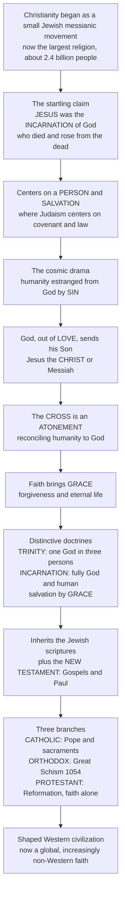

# ✝️ Christianity and the Christian Traditions

> [!abstract] TL;DR
> Christianity is the **incarnational, salvation-centered** faith built on the person of **Jesus of Nazareth** — an Abrahamic monotheism that began as a tiny Jewish messianic movement in a Roman backwater around 30 CE and grew into the **largest religion in human history** (~2.4 billion people, roughly a third of humanity). Where Judaism centers on **covenant and law**, Christianity centers on a *person* and an *event of salvation*: its startling claim is that Jesus was not merely a prophet but **God become human** — the **Incarnation** — whose death on the **cross** was an **atonement** reconciling humanity to God, and whose **resurrection** conquered death itself. Through **faith** the believer receives **grace**, forgiveness, and eternal life. Over two millennia it elaborated the hard-won doctrines of the **Trinity** and the Incarnation, inherited Judaism's scriptures while adding the **New Testament**, and splintered into three great branches — **Roman Catholic**, **Eastern Orthodox** (Great Schism, 1054), and **Protestant** (the 16th-century Reformation) — profoundly shaping Western civilization before becoming today a global, increasingly non-Western religion.

---

## Intuition

**Analogy:** Imagine a small band of followers gathered around a single executed teacher in an occupied province of an empire that will barely notice his death — and then imagine that within three centuries their movement has captured that very empire, and within two thousand years it is the most widespread faith on Earth, claiming a third of all living humans. That improbable trajectory is the outer shell of the story. Its inner engine is one audacious claim, and if you grasp the claim you grasp Christianity.

The claim is this: the executed teacher, **Jesus**, was not merely a prophet *pointing to* God — he *was* God, walked into human history in person, and let himself be killed **on purpose**, as a rescue. Judaism gives you a covenant and a law — a relationship structured by *what you do*. Christianity shifts the center of gravity onto a *who* and a *what-happened*: a **person** (Jesus, the Christ) and an **event** (his death and resurrection) that, Christians say, fixes something broken in the human condition itself. The plot is a cosmic rescue drama — humanity is estranged from God by **sin**; God, out of **love**, sends his Son; the Son's death on the **cross** pays the debt and **reconciles** us; and by trusting him (**faith**) we receive unearned favor (**grace**), forgiveness, and unending life (**salvation**). Everything distinctive about Christianity — the strange, centuries-forged formulas of the **Trinity** (one God in three "persons") and the **Incarnation** (Jesus as fully God *and* fully human) — is the intellectual machinery built to make sense of that single rescue.

---

## How It Works

### Core mechanics

1. **The founder and the founding event.** Jesus of Nazareth (~4 BCE – ~30 CE) was a Jewish teacher, healer, and apocalyptic preacher of the coming "Kingdom of God." He was crucified under Roman authority around 30 CE. What turned a failed messianic movement into a world religion was the disciples' proclamation of his **resurrection** — the foundational Christian claim that God raised him from the dead.
2. **From Jesus's message to the church's proclamation.** Jesus preached the Kingdom of God *to Israel*; the early church preached *Jesus himself* — crucified, risen, "Son of God," the **Christ** (Greek for the Hebrew *Messiah*). The pivotal figure is **Paul of Tarsus**, whose mission carried the movement to non-Jews (Gentiles), argued that faith in Christ — not observance of the Jewish law — makes one right with God, and thereby set Christianity on its universalizing, world-religion course.
3. **The salvation drama.** Creation → the **Fall** into **sin** (humanity's estrangement from God; Augustine's **original sin**) → God's **love** and initiative → the **Incarnation** ("the Word became flesh") → the **atonement** (Jesus's death on the cross as sacrifice/redemption) → the **resurrection** (victory over sin and death) → **grace** received through **faith** ("justification") → **salvation** and eternal life (heaven, the Kingdom, the Second Coming).
4. **The hard-won doctrines.** Over four centuries of fierce debate the church hammered out its creeds: the **Trinity** — one God in three persons, Father, Son, and Holy Spirit (councils of **Nicaea**, 325, and **Constantinople**, 381) — and the **two natures of Christ**, fully God and fully human (**Chalcedon**, 451). Rival positions (e.g., **Arianism**, which made the Son a lesser creature) were ruled heresies.
5. **Scripture and practice.** Christians kept the Jewish scriptures as the **Old Testament** and added the **New Testament** — the four **Gospels** (Matthew, Mark, Luke, John), Acts, the **Pauline and other epistles**, and Revelation. Worship centers on the **sacraments** (above all **baptism** and the **Eucharist**), the liturgical year (Advent, Christmas, Lent, **Easter** — the central feast of the resurrection — Pentecost), and an ethic of love of God and neighbor.
6. **The branching.** After the Christianization of the Roman Empire under **Constantine**, the church split East from West in the **Great Schism of 1054** (Roman **Catholic** vs. Eastern **Orthodox**), and the West split again in the **Protestant Reformation** (Luther, Calvin), producing the three great families that persist today.

### Flow / Architecture



---

## Key Concepts

### 🟢 Secondary — the story in plain terms

- **Who Jesus is for Christians.** A Jewish teacher, crucified around 30 CE, whom Christians believe to be **God become human** and to have **risen from the dead**. Christianity is built on *him*, not just on his teachings.
- **The rescue plot.** Humanity is separated from God by **sin**; out of **love** God sends his Son; Jesus's death on the **cross** repairs the breach; trusting him (**faith**) brings **forgiveness** and **eternal life** (**salvation**). This good news is called the *gospel*.
- **The Bible.** Two parts: the **Old Testament** (the Jewish scriptures Christianity inherited) and the **New Testament** (the four **Gospels** about Jesus, plus letters, especially Paul's).
- **The three big branches.** **Catholic** (largest, led by the **Pope**), **Orthodox** (the ancient churches of the East), and **Protestant** (born in the **Reformation**, now thousands of denominations).
- **Core practices.** **Baptism** and the **Eucharist** (communion), prayer, and a calendar of feasts — above all **Christmas** (Jesus's birth) and **Easter** (his resurrection).

### 🟡 Undergraduate — doctrine, scripture, and history

- **Historical Jesus vs. the Christ of faith.** Scholars distinguish the *historical* Jesus (reconstructed from the Gospels and other sources by critical methods) from the *Christ of faith* (the risen, divine Lord proclaimed by the church). The two are related but not identical, and the gap between them is a central problem of New Testament study.
- **Paul and the break from the Law.** Paul's insistence that Gentiles need not keep the Jewish law to be saved — that **faith** in Christ suffices — is the hinge on which Christianity swung from a Jewish sect to a universal religion.
- **The atonement — competing theories.** *Why* does the cross save? **Ransom/*Christus Victor*** (Christ defeats the powers of sin and death), **satisfaction** (Anselm: the debt of human sin is repaid), **penal substitution** (Christ bears the punishment we deserve), and **moral influence** (the cross transforms us by revealing God's love) are rival, historically layered answers.
- **The Trinity and the two natures.** The creedal grammar: God is **one substance in three persons** (Nicaea/Constantinople), and Christ is **one person in two natures**, fully divine and fully human (Chalcedon). These were forged against alternatives — **Arianism**, Nestorianism, monophysitism — in the great christological controversies.
- **Grace, faith, and works.** How is a person "justified" (made right with God)? By **grace** through **faith**, but the balance of faith, works, and the **sacraments** became the central fault line of the Reformation.
- **The New Testament canon.** The 27 books were not handed down complete; the **canon** formed over the first four centuries, and its interpretation is the ground of all later theology.
- **The Great Schism (1054).** East and West split over **papal authority** (the universal jurisdiction of the Pope) and the ***filioque*** clause (whether the Holy Spirit proceeds from the Father "and the Son"), among other cultural and political fractures — producing Roman **Catholicism** and Eastern **Orthodoxy**.

### 🔴 Graduate — controversies, criticism, and the frontier

- **The Reformation's theological core.** Luther's *sola scriptura* (scripture alone as authority), *sola fide* (justification by **faith alone**), and the **priesthood of all believers** dismantled the medieval sacramental-clerical system; Calvin systematized it (predestination, the sovereignty of grace). The **Catholic Counter-Reformation** (Council of Trent, the Jesuits) answered. See [[The_Protestant_Reformation]].
- **Scholasticism and faith–reason.** Medieval Christendom's intellectual peak — **Aquinas**'s synthesis of Aristotle with Christian doctrine — set the terms for the perennial negotiation of revelation and reason. See [[Aquinas_and_Scholasticism]] and [[Faith_and_Reason]].
- **Augustine's long shadow.** Original sin, the bondage of the will, predestination, the two cities, and the inward turn of the *Confessions* shaped Western theology for a millennium and reverberate through both Reformation and modern thought. See [[Augustine_and_Early_Christian_Thought]].
- **The comparative-religion lens.** Studied academically (not confessionally), Christianity is one Abrahamic monotheism among others — its **dying-and-rising** motif, its sacrificial atonement, and its incarnational theology invite comparison with Near-Eastern and Mediterranean patterns *without* reducing the tradition to them (the decontextualization/essentialism risk of naive comparison).
- **Secularization and the Global South.** The dominant twenty-first-century story is a double one: **secularization** in the historic Christian heartland (Europe, and increasingly North America) alongside **explosive growth** in the Global South — Africa, Latin America, and parts of Asia — driven heavily by **Pentecostal** and evangelical movements. Christianity's demographic center of gravity has already shifted south.
- **Contemporary fault lines.** Science and faith, biblical authority and historical criticism, the political entanglements of religion, and debates over gender and sexuality now cut *across* the three branches rather than neatly between them.

---

## Python Demo

```python
# Christianity, two quantitative stories:
#   (a) EARLY SPREAD -- Rodney Stark's model of exponential growth
#       (~40% per decade) from a tiny group into a majority of the
#       Roman Empire in ~300 years; exponential vs. logistic saturation.
#   (b) GLOBAL SHIFT -- Christianity's demographic center of gravity
#       moving from the Global North/West toward the Global South
#       (Africa, Latin America, Asia) across the 20th-21st centuries.
# Figures are illustrative teaching heuristics, not exact demography.

import numpy as np
import matplotlib.pyplot as plt

# ----------------------------------------------------------------------
# (a) STARK'S EXPONENTIAL RISE OF EARLY CHRISTIANITY
#   N0 = 1,000 Christians in 40 CE; growth 40% per decade (x1.4/decade).
#   Roman Empire population capped near ~60 million.
# ----------------------------------------------------------------------
years   = np.arange(40, 401, 1)                 # 40 CE .. 400 CE
decades = (years - 40) / 10.0
N0      = 1_000.0
rate    = 1.40                                  # x1.4 per decade (Stark)
empire  = 60_000_000.0                          # Roman Empire population

exp_growth = N0 * rate**decades                 # pure exponential

# logistic: same early growth, but saturates at the empire's population
r_yr = np.log(rate) / 10.0                       # per-year intrinsic rate
logistic = empire / (1 + (empire/N0 - 1) * np.exp(-r_yr * (years - 40)))

# Stark's canonical checkpoints (his projected table)
mk_years = np.array([100, 150, 200, 250, 300, 350])
mk_vals  = np.array([7_530, 40_496, 217_795, 1_171_356,
                     6_299_832, 33_882_008], dtype=float)

# ----------------------------------------------------------------------
# (b) GLOBAL SHIFT: share of the world's Christians, North vs. South
#   Global North  = Europe + North America
#   Global South  = Africa + Latin America + Asia-Pacific
# ----------------------------------------------------------------------
shift_years  = np.array([1900, 1950, 1970, 2000, 2020, 2050])
north_share  = np.array([82.0, 72.0, 57.0, 41.0, 33.0, 23.0])   # percent
south_share  = 100.0 - north_share

# regional detail for 1900 vs 2020 (approx. % of all Christians)
regions      = ["Europe", "N. America", "Lat. America", "Africa", "Asia-Pac."]
share_1900   = np.array([66.0, 16.0, 11.0,  2.0,  5.0])
share_2020   = np.array([22.0, 11.0, 24.0, 27.0, 16.0])

# ----------------------------------------------------------------------
# Plot
# ----------------------------------------------------------------------
fig = plt.figure(figsize=(14, 10))

# (a) exponential vs logistic on a log scale
ax1 = fig.add_subplot(2, 2, 1)
ax1.semilogy(years, exp_growth, color="#c44e52", lw=2, label="Exponential (x1.4/decade)")
ax1.semilogy(years, logistic,   color="#4c72b0", lw=2, ls="--", label="Logistic (cap = empire)")
ax1.scatter(mk_years, mk_vals, color="#000000", zorder=5, s=30, label="Stark's checkpoints")
ax1.axhline(empire, color="gray", ls=":", lw=1)
ax1.text(45, empire*1.1, "Roman Empire ~60M", fontsize=8, color="gray")
ax1.axvline(313, color="#55a868", ls=":", lw=1)
ax1.text(316, 5e2, "Edict of Milan\n313 CE", fontsize=8, color="#55a868")
ax1.set_xlabel("Year (CE)"); ax1.set_ylabel("Number of Christians (log scale)")
ax1.set_title("(a) Stark's rise of early Christianity")
ax1.legend(fontsize=8, loc="lower right")

# (a2) Christians as a share of the empire (the S-curve to majority)
ax2 = fig.add_subplot(2, 2, 2)
pct_empire = 100.0 * np.minimum(exp_growth, empire) / empire
ax2.plot(years, pct_empire, color="#c44e52", lw=2)
ax2.fill_between(years, pct_empire, color="#c44e52", alpha=0.12)
ax2.axhline(50, color="gray", ls=":", lw=1); ax2.text(45, 52, "majority", fontsize=8, color="gray")
ax2.set_xlabel("Year (CE)"); ax2.set_ylabel("% of Roman Empire")
ax2.set_title("(a2) From tiny sect to imperial majority")
ax2.set_ylim(0, 100)

# (b) global North vs South share -- stacked area (the southward shift)
ax3 = fig.add_subplot(2, 2, 3)
ax3.stackplot(shift_years, north_share, south_share,
              labels=["Global North\n(Europe + N. America)",
                      "Global South\n(Africa, Lat. Am., Asia)"],
              colors=["#4c72b0", "#dd8452"], alpha=0.85)
ax3.axhline(50, color="white", ls="--", lw=1)
ax3.set_xlabel("Year"); ax3.set_ylabel("Share of world's Christians (%)")
ax3.set_title("(b) The center of gravity moves South")
ax3.set_ylim(0, 100); ax3.legend(fontsize=8, loc="center left")

# (b2) regional composition 1900 vs 2020
ax4 = fig.add_subplot(2, 2, 4)
x = np.arange(len(regions)); w = 0.38
ax4.bar(x - w/2, share_1900, w, label="1900", color="#8172b3")
ax4.bar(x + w/2, share_2020, w, label="2020", color="#937860")
ax4.set_xticks(x); ax4.set_xticklabels(regions, rotation=30, ha="right", fontsize=8)
ax4.set_ylabel("% of all Christians")
ax4.set_title("(b2) Where Christians live: 1900 vs 2020")
ax4.legend(fontsize=8)

plt.tight_layout()
plt.savefig("christianity_growth_and_shift.png", dpi=130, bbox_inches="tight")
plt.show()

# Console summary
print(f"Modeled Christians in 350 CE : {exp_growth[years==350][0]:,.0f} "
      f"({pct_empire[years==350][0]:.1f}% of empire)")
print(f"Global South share of Christians  1900 -> 2020 : "
      f"{south_share[0]:.0f}% -> {south_share[shift_years==2020][0]:.0f}%")
```

**What the figure teaches.** Panel (a) shows the counter-intuitive punchline of Rodney Stark's demography: a *modest, sustained* growth of about 40% per decade — the kind of rate an enthusiastic social network can produce through ordinary conversion of friends and family — compounds over three centuries into tens of millions, matching his checkpoint estimates almost exactly. No mass miracles required; exponential arithmetic did the heavy lifting. Panel (a2) recasts the same numbers as a **share of the empire**, revealing the familiar S-curve: negligible for two centuries, then a rapid climb to a majority around the mid-fourth century, right as imperial policy flips from persecution (before) to endorsement (after Constantine's 313 Edict of Milan). Panel (b) and (b2) tell the *modern* story: in 1900 more than 80% of the world's Christians lived in the Global North (mostly Europe); by 2020 that had inverted, with two-thirds now in the Global South — Africa and Latin America especially — the largest geographic redistribution in the religion's history.

---

## Real-World Applications

- **Reading Western civilization.** Christianity is the substrate of European and Euro-American art, music, ethics, law, the university, hospital, and calendar (the very AD/BC — now CE/BCE — reckoning is dated from the traditional birth of Jesus). Much of the Western canon is illegible without it.
- **Contemporary global politics.** The southward demographic shift is remaking global Christianity's priorities and alignments; Pentecostal growth in Africa and Latin America, the geopolitics of Orthodoxy in Eastern Europe, and the political mobilization of evangelicals in the Americas are all live forces analysts must read.
- **Interfaith and comparative literacy.** Because Christianity, Judaism, and Islam share an Abrahamic lineage, understanding Christianity's distinctive moves (Incarnation, Trinity, atonement) clarifies both its kinship with and its divergence from its monotheistic neighbors.
- **Ethics and public life.** Concepts of conscience, human dignity, forgiveness, charity, just war, and human rights carry deep Christian genealogies, whatever their present secular framing.
- **Chaplaincy, medicine, and diplomacy.** Empathetic, non-confessional fluency in Christian belief and practice (sacraments, end-of-life views, denominational differences) is practical knowledge in hospitals, the military, and cross-cultural negotiation.

---

## Common Pitfalls

- **Treating Christianity as monolithic.** "Christianity" spans Ethiopian Orthodox liturgy, Quaker silence, Pentecostal revival, and Roman Catholic sacramentalism. The **three branches** — and thousands of denominations within Protestantism — differ profoundly on authority, sacraments, and salvation. Always ask *which* Christianity.
- **Collapsing Jesus's message into the church's doctrine.** The **historical Jesus** preached the Kingdom of God to Israel; later **doctrine** (Trinity, Incarnation, atonement theory) was worked out over centuries. Reading fourth-century creeds back onto Jesus's own lips is anachronism.
- **Confusing "Messiah" with "God."** In its Jewish context *Messiah* (Christ) meant an anointed deliverer, not a divine being. Christianity's radical step was to *identify* the Messiah with God incarnate — a development, not a given, and the source of its break with Judaism.
- **Misreading the atonement as one idea.** There is no single official theory of *how* the cross saves; ransom, satisfaction, penal substitution, and moral influence are competing models. Assuming your inherited version is "the" Christian view flattens a rich debate.
- **Assuming Christianity is Western.** Historically it began as a Near-Eastern, Jewish movement; today its demographic heartland is the Global **South**. The "white, European" image is a temporary and now-fading phase, not the essence.
- **Reducing the tradition to comparison.** Noting parallels (dying-and-rising motifs, sacrificial logic) is legitimate scholarship, but treating Christianity as *merely* a recombination of older myths ignores its historical specificity and its adherents' lived meaning — the essentialism trap of naive comparative method.

---

## Related Concepts

This note is the Christianity entry in the vault's *Major Religious Traditions* section. Its prose-only companions develop the shared machinery: the *Religious_Studies_and_Comparative_Religion_Overview* frames the non-confessional stance; *Judaism_and_the_Covenant_Tradition* is the parent tradition Christianity emerged from and broke with; *Islam_and_the_Islamic_Tradition* completes the Abrahamic trio; *Theology_and_Religious_Doctrine* generalizes the Trinity/Incarnation debates; *Sacred_Texts_and_Scripture* treats canon and interpretation; and *Salvation_Liberation_and_the_Afterlife* sets Christian soteriology beside other traditions' answers.

- [[The_Protestant_Reformation]] — the 16th-century rupture (Luther, Calvin; *sola scriptura*, *sola fide*) that created the Protestant branch and fractured Western Christendom; the historical companion to this note's account of the third great tradition.
- [[The_Roman_Empire]] — the political world in which Christianity was born, persecuted, and finally established; the demography in the Python demo is Roman demography.
- [[The_Byzantine_Empire]] — the Christian East whose church became Eastern Orthodoxy after the Great Schism of 1054, preserving the ancient councils and liturgy.
- [[Augustine_and_Early_Christian_Thought]] — the patristic architect of original sin, grace, and predestination whose thought shaped both Catholic and Reformation theology.
- [[Aquinas_and_Scholasticism]] — the high-medieval synthesis of Aristotle and Christian doctrine, the intellectual peak of Catholic Christendom.
- [[Faith_and_Reason]] — the perennial negotiation between revelation and rational argument that runs through Christian theology from Augustine to the present.
- [[Christian_Legend_and_Hagiography]] — the folklore of saints, relics, and miracle stories that grew up *around* the tradition; the mythographic complement to its formal doctrine.
- [[Mythic_Motifs_in_the_Hebrew_Bible]] — the Near-Eastern narrative patterns in the scriptures Christianity inherited as its Old Testament.
- [[Angels_Demons_and_Apocrypha]] — the wider apocalyptic and angelic imagination Christianity shares with Second-Temple Judaism, coloring its eschatology and the book of Revelation.

---

## Review Questions

**🟢 Secondary.** In one or two sentences, state the single central claim that distinguishes Christianity from Judaism, and name the event Christians believe conquered death.

**🟡 Undergraduate.** Rodney Stark argues that early Christianity grew at roughly 40% per decade. Explain, using the exponential logic in the Python demo, how such a *modest* rate could turn ~1,000 believers in 40 CE into a majority of the Roman Empire by ~350 CE — and why Constantine's endorsement in 313 is better seen as *following* this growth than *causing* it.

**🔴 Graduate.** The doctrines of the **Trinity** and the **Incarnation** were forged over four centuries against rival positions (e.g., Arianism) and finalized at Nicaea, Constantinople, and Chalcedon. Choose one of these controversies and explain what was theologically at stake, how the "orthodox" formula tried to preserve *both* monotheism *and* the full divinity of Christ, and why the Great Schism of 1054 and the Reformation are best understood as later chapters in this same long argument over authority and salvation.

---

## Sources

- Diarmaid MacCulloch, *Christianity: The First Three Thousand Years* (2009).
- Alister E. McGrath, *Christianity: An Introduction* (3rd ed., 2015).
- Bart D. Ehrman, *The New Testament: A Historical Introduction to the Early Christian Writings* (7th ed., 2019).
- Rodney Stark, *The Rise of Christianity: How the Obscure, Marginal Jesus Movement Became the Dominant Religious Force* (1996).
- Pew Research Center, *Global Christianity: A Report on the Size and Distribution of the World's Christian Population* (2011).

---

#religious-studies #christianity #incarnation #trinity #salvation
