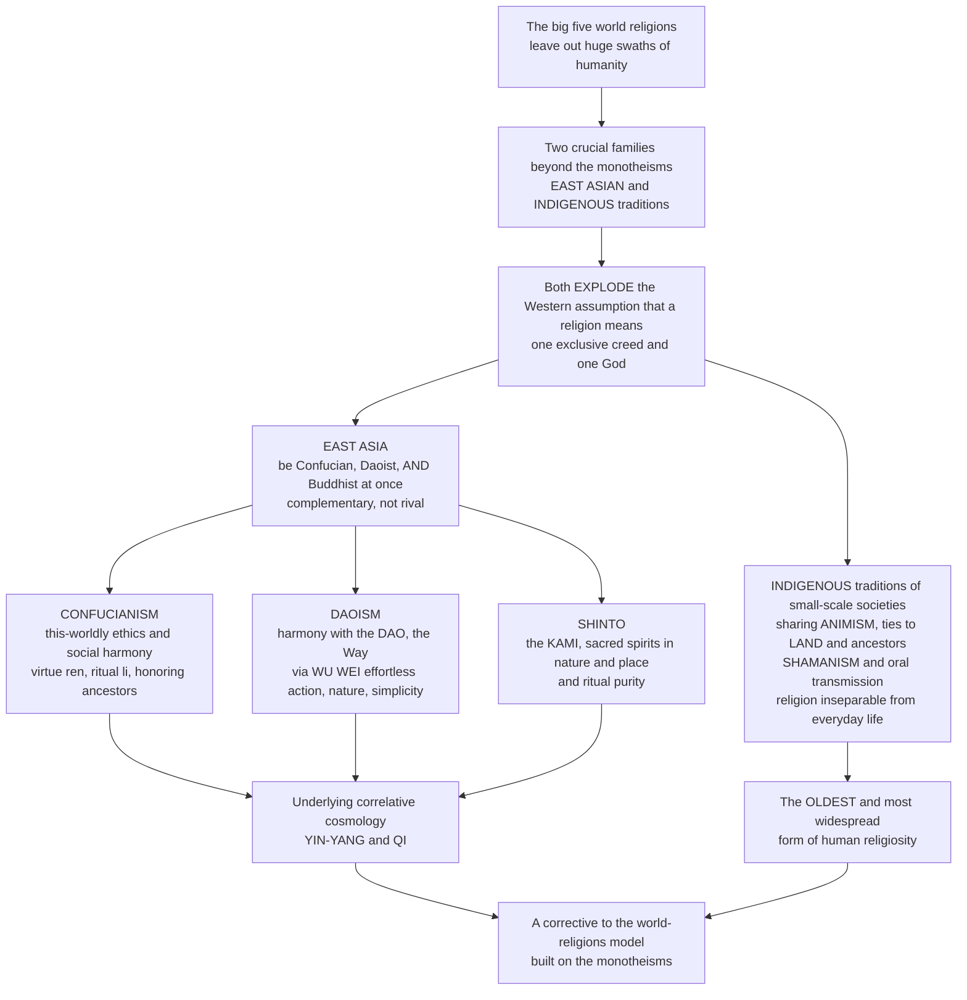

# 🀄 East Asian and Indigenous Religions

> [!abstract] TL;DR
> The familiar "big five" world religions leave out enormous swaths of humanity's religious life — including two very different but crucial families that both **explode the Western assumption that "a religion" means exclusive membership in a single creed with one God**. The first is the great **East Asian** traditions: in China, Korea, and Japan a single person can be **Confucian, Daoist, AND Buddhist all at once** — not rival religions you choose between but complementary **"three teachings"** (*sanjiao*) addressing different needs. **Confucianism** is a this-worldly ethical and social humanism — how to be a good person and order society through **ren** (benevolence), **li** (ritual propriety), honoring the **five relationships** and ancestors — so this-worldly that scholars debate whether it is a "religion" at all. **Daoism** seeks harmony with the **Dao** (the ineffable "Way," the flow of the cosmos) through **wu wei** ("effortless action," going with nature's grain), simplicity, and a rich tradition of ritual, alchemy, and the quest for immortality. **Shinto** centers on the **kami** — the sacred spirits and powers in nature, ancestors, and place — and ritual **purity**. All of it rests on a **correlative cosmology** of **yin-yang** and **qi**. The second family is the countless **indigenous / primal** traditions of small-scale societies worldwide (Native American, African, Aboriginal Australian, Arctic, Amazonian), which are not one religion but share family resemblances: **animism** (a world alive with spirits/persons), deep ties to **land** and **ancestors**, **shamanism** (specialists who travel to spirit worlds to heal), **oral** rather than textual transmission, and religion **inseparable from everyday life**. Long dismissed as "primitive," these represent the **oldest and most widespread** form of human religiosity — and studying both families is a decisive **corrective to the world-religions model built on the monotheisms**.

---

## Intuition

**Analogy:** Ask a Westerner "what is your religion?" and they expect a single-answer, multiple-choice question — Christian *or* Muslim *or* Jewish *or* none — as though religions were rival software you install, one at a time, on the same machine. Now ask the same question in a Japanese household. On New Year's Day the family visits a **Shinto** shrine to greet the *kami*; a grandparent's funeral is **Buddhist**; the values ordering the home — respect for elders, propriety, hard study, honoring ancestors at the family altar — are quintessentially **Confucian**; and a lucky charm, a *feng shui* choice, or a temple fortune is folk practice. Nobody experiences a contradiction, because these are not competing "religions" at all. They are **complementary tools for different jobs** — like a person who uses a doctor for the body, a lawyer for contracts, and a coach for fitness without feeling they must pick just one. The multiple-choice form itself was the mistake.

That single reframing — from **exclusive membership** to **complementary belonging** — is the doorway to a whole hemisphere of religious life the "world religions" checklist mishandles, and it is only half the story. Walk into the world's small-scale, tribal, and indigenous societies and the checklist breaks down even more completely: there is no membership card, no founding scripture, often no word for "religion" as a separate sphere, because the sacred is **woven inseparably into hunting, planting, kinship, healing, and the land itself**. A river is a person; an ancestor is present; a specialist falls into trance to bargain with spirits for a sick child. These traditions were long filed under "primitive superstition," yet they are the **oldest and most widespread** way humans have ever been religious. Between them, East Asian and indigenous religions force the central question of this whole field back open: **what is religion, really — once you stop assuming it must look like the monotheisms?**

---

## How It Works

There is no single doctrine here to diagram, because the whole point is a **shape of religiosity** — diffuse, complementary, embedded — that differs from the creed-and-membership shape of the monotheisms. The diagram traces the argument from "the big five leave people out" through the two families to the payoff: a corrective to the world-religions model.



**The core mechanics:**

1. **Reject the exclusivity assumption.** The Western template — one creed, one God, one membership, one scripture, one separate "religious" sphere — is a *local* generalization from the monotheisms, not a universal template. Both families here violate it, which is exactly why they matter for defining religion at all.
2. **East Asia: complementary "three teachings."** *Confucianism, Daoism, and Buddhism* function together as the **sanjiao**, each serving different life-domains — Confucianism for social and ethical life, Daoism for harmony with nature and the body, Buddhism for suffering and the afterlife — plus a substrate of **folk religion**. One person draws on all of them: **multiple religious belonging**.
3. **The correlative cosmology underneath.** Rather than a transcendent creator, East Asian thought assumes an immanent cosmos of **qi** (vital energy) patterned by **yin and yang** and the **five phases** (*wuxing*), with harmony as the balancing of complementary forces — Heaven, Earth, and Human in resonance.
4. **Indigenous: religion as the texture of life.** In small-scale, largely oral societies, religion is not a separate institution you join; it is diffused through kinship, subsistence, place, and the life-cycle. Shared **family resemblances** — animism, ancestors, shamanism, oral myth, rites of passage — appear across otherwise unrelated peoples.
5. **The scholarly payoff.** Taking both families seriously **decenters** the field: it dismantles the colonial "primitive religion" hierarchy, shows the monotheistic pattern to be one option among many, and turns "what is religion?" from a settled definition into a live comparative question.

---

## Key Concepts

### 🟢 Secondary — the essentials

- **The "three teachings" (sanjiao).** In East Asia, *Confucianism, Daoism, and Buddhism* are not mutually exclusive religions but **complementary traditions** used together. The famous image: "**three teachings, one family**." A person can honestly be all three at once.
- **Confucianism.** Founded on the teaching of **Confucius** (Kong Fuzi, ~551–479 BCE): a this-worldly ethic of **being a good person and ordering society** through **ren** (benevolence/humaneness), **li** (ritual propriety, manners, and rites), **filial piety** (*xiao*), and honoring relationships and **ancestors**. Its goal is the **junzi**, the "exemplary person."
- **Daoism (Taoism).** Seeks **harmony with the Dao** — the ineffable "Way," the natural flow of the cosmos ("the Dao that can be named is not the eternal Dao"). Its signature ideals are **wu wei** ("non-action" / **effortless action**, going with nature's grain rather than forcing) and **naturalness** and **simplicity**. Founding texts: the **Dao De Jing** (attributed to **Laozi**) and the **Zhuangzi**.
- **Shinto.** Japan's indigenous tradition, "the **way of the kami**." The **kami** are the myriad **sacred spirits and powers** in nature, phenomena, ancestors, and place. Practice centers on **shrines** (*jinja*), **festivals** (*matsuri*), and above all ritual **purity** (*harae*) versus pollution.
- **Yin and yang, qi.** The shared **correlative cosmology**: reality is woven of **qi** (vital energy) and patterned by **yin-yang**, two complementary opposites in cyclic balance — harmony is their dynamic equilibrium, not the victory of one.
- **Indigenous / primal religions.** The diverse religions of **small-scale, often oral, tribal societies** worldwide — not one religion but many, sharing features like **animism**, ties to **land** and **ancestors**, **shamanism**, and **oral** transmission. The oldest and most widespread form of human religiosity.

### 🟡 Undergraduate — the doctrines that make them distinctive

- **Multiple religious belonging.** The East Asian pattern is genuinely alien to the exclusive-membership model: religiosity is **diffuse** (spread across family, community, and calendar rather than congregational) and **overlapping**. Survey instruments that force a single answer systematically **mismeasure** it (see the Python demo).
- **The Confucian tradition after Confucius.** **Mencius** (Mengzi) argued human nature is innately **good**; **Xunzi** argued it is **crude** and must be shaped by ritual and learning; the medieval **Neo-Confucian** synthesis of **Zhu Xi** re-founded Confucian ethics on a metaphysics of *li* (principle) and *qi*. Key ideas: the **five relationships** (ruler–subject, father–son, husband–wife, elder–younger, friend–friend), the **rectification of names**, **self-cultivation**, and **Tian** (Heaven) with its **Mandate of Heaven** legitimating just rule.
- **Philosophical vs. religious Daoism.** **Philosophical Daoism** (*daojia* — Laozi, Zhuangzi) is a naturalist wisdom of wu wei, **ziran** (spontaneity/naturalness), relativity, and going with the flow. **Religious/institutional Daoism** (*daojiao*) adds **deities, priests, liturgy**, internal and external **alchemy** (*neidan* / *waidan*), **qi cultivation**, and the quest for **immortality** and longevity. The two are historically intertwined, not a clean split.
- **Shinto and its fusion with Buddhism.** For most of Japanese history Shinto and Buddhism were deeply **syncretized** (*shinbutsu-shūgō*), kami understood as manifestations of buddhas — until the state forcibly **separated** them in the Meiji era to build "State Shinto." Shinto has little dogma or scripture; it is a religion of **ritual, place, and purity** more than belief.
- **Chinese popular / folk religion.** The lived religion of most Chinese: a pragmatic traffic with **gods, ghosts, and ancestors**, local **temple** cults, **divination**, **feng shui**, and festival — cutting across and beneath the "three teachings" rather than belonging to any one.
- **Common features of indigenous traditions.** **Animism** (a world of many persons, not only human); intimate relationship to **land/place** and the living world; **ancestors** and the "living-dead"; **shamanism** (specialists entering **trance** to travel spirit-worlds to heal, divine, and mediate); **totemism**; **oral** myth and ritual rather than scripture; **rites of passage**; and religion **embedded** in kinship and subsistence rather than housed in a separate institution.

### 🔴 Graduate — the debates, the critique, and the frontier

- **Is Confucianism a "religion"?** The classic hard case. It has ritual, ancestor veneration, a transcendent reference (**Tian**/Heaven), and functioned as a state orthodoxy — yet it is agnostic about gods and afterlife and focused on **this-worldly** ethics and society. The answer depends entirely on your **definition of religion** (substantive/belief-in-gods vs. functional/ultimate-concern) — which is why it is a permanent stress test for the field.
- **The world-religions paradigm critique.** The very list of "world religions" — canonical, textual, congregational, belief-centered, often modeled on Protestant Christianity — was assembled in the 19th–20th centuries and tends to **misdescribe** diffuse East Asian traditions and to **omit or marginalize** indigenous ones. Scholars (J.Z. Smith, Tomoko Masuzawa) argue the paradigm reflects the classifier's assumptions as much as the traditions themselves.
- **"Primitive religion" and the evolutionist bias.** Victorian theorists (Tylor's **animism**, Frazer's **magic → religion → science**) ranked indigenous traditions as an early, "lower" stage of a ladder climbing toward monotheism and science. That **evolutionist hierarchy** is now rejected as ethnocentric — but its residue lingers in words like "primitive," "pagan," and "superstition," and in who gets called a "world religion."
- **Animism reconsidered — the "new animism."** Rather than Tylor's cognitive error ("savages mistakenly attribute souls to things"), scholars like **Graham Harvey** and **Nurit Bird-David** recast animism as a coherent **relational ontology**: a world of **many kinds of persons** (human and other-than-human) sustained by relationships of respect and reciprocity. This reframes animism as a serious rival account of reality, not a mistake to be outgrown.
- **Shamanism as category — universal or artifact?** **Eliade** treated shamanism as a near-universal "archaic technique of ecstasy"; critics warn that lumping wildly different specialists (Siberian, Amazonian, Korean) under one Siberian-derived word can **flatten** real differences and impose a romantic Western construct. A live methodological debate about comparison itself.
- **The colonial legacy, appropriation, and revitalization.** Indigenous religions were disrupted by **colonialism, missionization, and land dispossession**; today many are being **revitalized** and are entangled with **indigenous rights and sovereignty**, sacred-site protection, and repatriation — while facing **commodification and appropriation** (plastic shamans, wellness "smudging"). The very act of studying them raises ethical and epistemic questions about the "religion" category and about whose knowledge counts.
- **The Aboriginal "Dreaming."** A frequently cited example (and a translation to handle with care): the *Tjukurpa* / **Dreaming** is at once a creative primordial era, an eternally present order, a body of Law, and a map of country — collapsing the Western partitions of myth, ritual, ethics, and geography into a single fabric, and showing how differently "religion" can be configured.

---

## Python Demo

```python
# East Asian & indigenous religion in four pictures with numpy + matplotlib:
#   (a1) MULTIPLE RELIGIOUS BELONGING: East Asian practice-portfolios are
#        OVERLAPPING sets, not a partition -- so prevalences SUM > 100%.
#   (a2) The MISMEASUREMENT: a Western "pick ONE religion" survey compresses
#        the overlap and over-counts "no religion", mis-reading East Asian life.
#   (b1) YIN-YANG: two complementary opposites in cyclic balance, each holding
#        the seed of the other; harmony = a constant SUM, not one side winning.
#   (b2) ANIMISM: agency/spirit attributed across a rich animate cosmos vs the
#        modern "only humans have minds" view.
# All figures are illustrative teaching heuristics, not survey data.

import numpy as np
import matplotlib.pyplot as plt

rng = np.random.default_rng(7)

# ======================================================================
# (a) MULTIPLE BELONGING vs the exclusive-membership model
# ======================================================================
N = 12000
labels4 = ["Confucian\n(ethics/family)", "Daoist\n(nature/body)",
           "Buddhist\n(afterlife)", "Folk\n(everyday)"]

# East Asian reality: each person engages SEVERAL traditions for different
# life-domains -> overlapping boolean portfolios (not a single box).
p_engage = np.array([0.70, 0.55, 0.60, 0.75])
practice = rng.random((N, 4)) < p_engage          # N x 4 portfolios
prevalence = practice.mean(axis=0)                # SUMS to > 100%

# The Western survey question "What is your ONE religion?" forces a single
# exclusive box; people who MIX often see no exclusive membership and answer
# "no religion / none", so each tradition is under-counted and "none" inflated.
exclusive = np.full(N, -1)                        # -1 = "no religion / none"
for i in range(N):
    active = np.where(practice[i])[0]
    if active.size == 1:
        exclusive[i] = active[0]                  # clearly one -> that box
    elif active.size >= 2 and rng.random() < 0.45:
        exclusive[i] = rng.choice(active)         # sometimes names a "primary"
    # else stays -1 ("no religion") -- the mixers who reject the single box
excl_counts = np.array([(exclusive == k).mean() for k in range(4)])
none_share = (exclusive == -1).mean()

# ======================================================================
# (b1) YIN-YANG correlative dynamic
# ======================================================================
theta = np.linspace(0, 4 * np.pi, 600)
yang = 0.5 + 0.45 * np.sin(theta)                 # never fully 0/1 -> the "seed"
yin = 1.0 - yang                                  # complementary opposite
balance = yang + yin                              # constant 1.0 = dynamic harmony

# ======================================================================
# (b2) ANIMISM: attributed agency across an animate cosmos
# ======================================================================
entities = ["Humans", "Animals", "Plants/Trees", "Rivers/Springs",
            "Mountains", "Wind/Storms", "Ancestors/Dead", "Made things"]
animist = np.array([1.00, 0.90, 0.75, 0.85, 0.80, 0.70, 0.95, 0.40])
modern  = np.array([1.00, 0.30, 0.00, 0.00, 0.00, 0.00, 0.00, 0.00])

# ======================================================================
# Plot
# ======================================================================
fig, ax = plt.subplots(2, 2, figsize=(14, 10))
x = np.arange(4)

# (a1) overlapping reality vs forced-exclusive count
w = 0.38
ax[0, 0].bar(x - w/2, prevalence, w, label="actual practice (overlapping)", color="#2a7")
ax[0, 0].bar(x + w/2, excl_counts, w, label="'pick ONE' survey count", color="#c33")
ax[0, 0].set_xticks(x); ax[0, 0].set_xticklabels(labels4, fontsize=8)
ax[0, 0].set_ylabel("fraction of people")
ax[0, 0].set_title("(a1) Multiple belonging: overlapping practice\nvs the forced single-choice count")
ax[0, 0].legend(fontsize=8)

# (a2) the mismeasurement, at the population level
sums = [prevalence.sum(), excl_counts.sum() + none_share]
ax[0, 1].bar(["Overlapping\nreality", "Exclusive\nsurvey model"], sums,
             color=["#2a7", "#c33"])
ax[0, 1].axhline(1.0, color="gray", ls="--", lw=1)
ax[0, 1].text(1, none_share/2, f"'no religion'\n= {none_share*100:.0f} pct",
              ha="center", va="center", fontsize=8, color="white")
ax[0, 1].bar(["Exclusive\nsurvey model"], [none_share],
             bottom=[excl_counts.sum()], color="#666", label="'no religion' (mixers)")
ax[0, 1].set_ylabel("summed memberships")
ax[0, 1].set_title("(a2) Mismeasurement: real religiosity sums past 100 pct,\n"
                   "the exclusive model compresses it to a partition")
ax[0, 1].legend(fontsize=8)

# (b1) yin-yang complementarity
ax[1, 0].plot(theta, yang, color="#111", lw=2, label="yang (waxing)")
ax[1, 0].plot(theta, yin, color="#bbb", lw=2, label="yin (waning)")
ax[1, 0].plot(theta, balance, color="crimson", ls="--", lw=1.6,
              label="yang + yin = 1 (harmony)")
ax[1, 0].set_ylim(-0.05, 1.15)
ax[1, 0].set_xlabel("cyclic time"); ax[1, 0].set_ylabel("proportion")
ax[1, 0].set_title("(b1) Yin-yang: complementary opposites in cyclic balance\n"
                   "each keeps the seed of the other; harmony is a constant sum")
ax[1, 0].legend(fontsize=8, loc="center right")

# (b2) distribution of attributed agency
y = np.arange(len(entities))
ax[1, 1].barh(y - 0.2, animist, 0.4, label="animist cosmos", color="#2a7")
ax[1, 1].barh(y + 0.2, modern, 0.4, label="modern 'only humans'", color="#36c")
ax[1, 1].set_yticks(y); ax[1, 1].set_yticklabels(entities, fontsize=8)
ax[1, 1].invert_yaxis()
ax[1, 1].set_xlabel("attributed spirit / agency")
ax[1, 1].set_title("(b2) Animism: a world of many persons\nvs the modern human-only mind")
ax[1, 1].legend(fontsize=8, loc="lower right")

plt.tight_layout()
plt.savefig("east_asian_and_indigenous_religions.png", dpi=130, bbox_inches="tight")
plt.show()

# Console summary: the mismeasurement made numeric
print(f"Sum of actual (overlapping) practice prevalence: {prevalence.sum()*100:.0f} pct")
print(f"Exclusive-survey 'no religion' share:            {none_share*100:.0f} pct")
print("Under-count per tradition (actual - exclusive):",
      np.round((prevalence - excl_counts) * 100).astype(int), "pct pts")
```

**What the figure teaches.** Panels (a1)–(a2) make the core East Asian point quantitative: because a person is Confucian *and* Daoist *and* Buddhist *and* folk, the honest prevalences **overlap and sum well past 100%** (a1, green), whereas a Western "pick one religion" survey **forces a partition**, compressing the overlap and dumping the mixers — who reject the single-box premise — into an inflated **"no religion"** bucket (a2, grey). The same population reads as "highly religious" or "mostly non-religious" depending entirely on whether your instrument assumes exclusivity. Panel (b1) draws the **yin-yang** intuition: two complementary opposites wax and wane in cyclic balance, neither ever reaching zero (each carries the **seed** of the other), and their **sum stays constant** — harmony as *dynamic equilibrium*, not the triumph of one side. Panel (b2) contrasts two ontologies of mind: the modern view grants agency to humans (and grudgingly some animals) alone, while an **animist** cosmos distributes spirit and personhood across animals, plants, rivers, mountains, weather, and ancestors — a world of **many kinds of persons** rather than a stage of dead matter with a few minds on it.

---

## Real-World Applications

- **Measuring religion globally.** Pew, census, and World Values Survey figures for China, Japan, Korea, and Vietnam are notoriously unstable precisely because of the multiple-belonging problem in panel (a): "religiously unaffiliated" can be the largest category on paper while shrines, ancestor rites, temples, and divination remain woven through daily life. Reading those numbers requires the diffuse-religion lens.
- **Business, diplomacy, and design across East Asia.** Ancestor veneration and filial obligation, festival calendars, temple etiquette, *feng shui* in architecture, and the aesthetics of *wu wei* and simplicity shape everything from HR norms to product design and negotiation in a civilizational bloc of well over a billion people.
- **Indigenous rights, land, and sacred sites.** Because indigenous religion is **inseparable from land**, legal battles over pipelines, dams, mining, and national parks (Standing Rock, Uluru, the Black Hills) are simultaneously **religious-freedom** cases — but ones the standard "belief and worship" framework, built for congregational religions, handles poorly.
- **Ecology and the environmental humanities.** Animist relational ontologies — "the river is a person" — increasingly inform environmental ethics, "rights of nature" law (e.g., legal personhood for rivers in New Zealand and elsewhere), and critiques of the human/nature dualism, making indigenous cosmologies unexpectedly central to climate-era thought.
- **The health and wellness marketplace.** Qi, *tai chi*, *feng shui*, "mindfulness," and neo-shamanic and "smudging" practices circulate globally, usually stripped of their tradition and community — a live case study in both cross-cultural transmission and the ethics of **appropriation**.

---

## Common Pitfalls

- **Treating the "three teachings" as rival religions.** Asking whether someone is "really" Confucian *or* Buddhist *or* Daoist imports the exclusive-membership assumption the whole region does not share. They are **complementary** tools for different domains; belonging to all three is the norm, not a contradiction or "syncretic confusion."
- **Reading "unaffiliated" as "non-religious."** The single largest source of error about East Asia: survey "no religion" figures reflect the *instrument's* exclusivity assumption, not an absence of religious life. Ancestor rites, temple visits, and festivals persist among people who tick "none."
- **Calling indigenous traditions "primitive," "pagan," or "superstition."** These terms carry an outdated **evolutionist hierarchy** that ranked non-textual religions as a lower stage. They are neither earlier drafts of "real" religion nor errors to be outgrown, but complete, coherent traditions — and the oldest and most widespread form of human religiosity.
- **Lumping all indigenous religions into one thing.** "Indigenous religion" is a family-resemblance grouping of **thousands of distinct traditions** across every continent. Animism, shamanism, and totemism are recurring *features*, not a single shared creed; treating "the shaman" or "the Dreaming" as universal flattens enormous diversity.
- **Misreading animism as a childish mistake.** Tylor's "savages wrongly attribute souls to things" has been superseded by the "new animism" — a **relational ontology** of many kinds of persons. Dismissing it as a cognitive error is itself the ethnocentric error the field has learned to avoid.
- **Assuming "religion" is a separate sphere everywhere.** Many of these traditions have **no word for "religion"** because the sacred is not partitioned off from kinship, subsistence, healing, and land. Looking only for creeds, scriptures, and congregations will make you miss the religion that is everywhere at once.
- **Romantic appropriation.** Reaching past the colonial dismissal into equal-and-opposite fantasy — the noble ecological native, the plastic shaman, "smudge kits" — replaces one distortion with another and severs practices from the communities and obligations that give them meaning.

---

## Related Concepts

- [[Confucianism]] — the Philosophy-vault deep dive on **ren, li, the junzi, the five relationships, and Tian**; the ethical-philosophical core behind this note's "is it even a religion?" question.
- [[Daoism]] — the Philosophy-vault treatment of the **Dao, wu wei, ziran**, and the Laozi/Zhuangzi texts underlying both philosophical and religious Daoism.
- [[Buddhist_Philosophy]] — the third of the **"three teachings"**; East Asian Buddhism (Chan/Zen, Pure Land) is precisely what fuses with Confucian and Daoist practice in the multiple-belonging pattern.
- [[Comparative_Philosophy_East_and_West]] — frames why East Asian correlative, this-worldly, relational thought diverges from Western substance-and-transcendence assumptions.
- [[Japanese_Shinto_and_the_Kami]] — the Mythology-vault companion on the **kami**, shrines, purity, and Amaterasu; the mythic-narrative face of the tradition summarized here.
- [[The_Chinese_Celestial_Bureaucracy]] — the gods-and-ancestors cosmology of **Chinese popular religion**, the folk substrate beneath the three teachings.
- [[The_Yoruba_Orishas]] — a living **indigenous / African** tradition (the orisha, divination, diaspora forms) illustrating animism, ancestors, and spirit-mediation in practice.
- [[Oral_Tradition_and_the_Griot]] — the Mythology-vault case for **oral** transmission of sacred narrative, central to how indigenous religions carry myth and ritual without scripture.
- [[Religion_Magic_and_Ritual]] — the Anthropology-vault treatment of **animism, shamanism, totemism, and the magic–religion debate** (Tylor, Frazer, Durkheim) that theorizes indigenous religiosity.
- [[Oral_Tradition_and_Narrative]] — the anthropology of how oral, non-textual cultures encode and transmit knowledge and cosmology.
- [[Indigenous_Rights_and_Sovereignty]] — the applied-anthropology stakes: land, sacred sites, repatriation, and the political present of indigenous religious life.

*Prose-only siblings in this vault (built or forthcoming):* this note sits under the field hub *Religious_Studies_and_Comparative_Religion_Overview* and completes the traditions surveyed beside *Buddhism_and_the_Path_to_Liberation* (whose Mahayana and Vajrayana branches took root and fused with local practice across East Asia). Its treatment of animism and the "primitive religion" critique directly extends *Theories_of_the_Origin_of_Religion*; shamanic trance and Daoist inner cultivation are cases for *Religious_Experience_and_Mysticism*; kami festivals, ancestor rites, and *li* feed *Ritual_and_Religious_Practice*; and oral cosmogonies and the Dreaming belong with *Myth_and_Sacred_Narrative*.

---

## Review Questions

**🟢 Secondary.** Explain, using the New Year / funeral / family-altar example, how a single East Asian person can be "Confucian, Daoist, and Buddhist all at once." Then name one core idea from each of Confucianism (*ren* or *li*), Daoism (*wu wei* or the *Dao*), and Shinto (*kami* or purity).

**🟡 Undergraduate.** A global survey reports that a majority in a certain East Asian country is "religiously unaffiliated." Using the ideas of **diffuse religion** and **multiple belonging**, explain why this number can badly *mismeasure* the population's actual religious life — and what a better instrument would ask. Then list three **family resemblances** shared across otherwise unrelated indigenous traditions.

**🔴 Graduate.** Scholars argue that both Confucianism ("is it a religion?") and indigenous traditions ("primitive religion") were mishandled by the inherited **world-religions paradigm**. Choose *one* of these cases and defend a position: what does it reveal about the hidden assumptions — belief-centered, textual, exclusive, congregational — built into the category "religion," and how would taking that case seriously reshape a definition of religion for a genuinely global, non-Western-centric field?

---

## Sources

- Julia Ching, *Chinese Religions* (Orbis / Palgrave Macmillan, 1993) — a standard synthesis of Confucianism, Daoism, Buddhism, and folk religion as an interacting whole.
- Livia Kohn, *Introducing Daoism* (Routledge, 2009) — the standard textbook on both philosophical and religious Daoism.
- Graham Harvey, *Animism: Respecting the Living World* (2nd ed., Hurst / Columbia University Press, 2017) — the leading statement of the "new animism" as a relational ontology.
- Mircea Eliade, *Shamanism: Archaic Techniques of Ecstasy* (Princeton University Press, 1964) — the classic (and much-debated) comparative study of shamanism.
- Joseph A. Adler, *Chinese Religious Traditions* (Prentice Hall, 2002) — a concise scholarly overview of the East Asian "three teachings" and popular religion.

---

#religious-studies #east-asian-religion #daoism #confucianism #indigenous-religions
