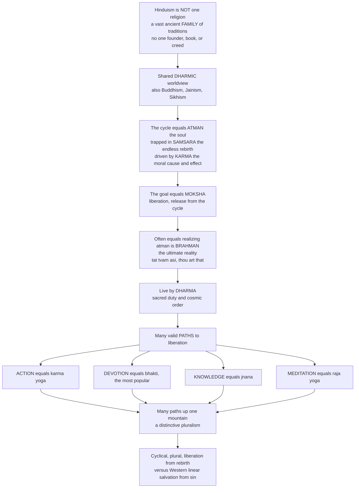

# 🕉️ Hinduism and the Dharmic Traditions

> [!abstract] TL;DR
> Calling "Hinduism" a single religion is like calling all the music ever made in India "Indian music" — technically true, but it hides staggering diversity. Hinduism has **no one founder, no one book, no one creed, and no ecclesiastical authority**: it is a vast, organically-evolved **family** of interwoven traditions grown over 4,000+ years on the Indian subcontinent, spanning fervent monotheists, exuberant polytheists, philosophical **monists** who see all reality as one, and near-**atheists** — all under a single umbrella that insiders often call **Sanatana Dharma**, "the eternal way." Yet a distinctive **dharmic worldview** runs through most of it (and, with variations, through Buddhism, Jainism, and Sikhism — the "Indian religions"): the soul (**atman**) is caught in **samsara**, the beginningless cycle of birth, death, and rebirth, driven by **karma**, the moral law of cause and effect. The ultimate goal is **moksha** — liberation, release from the cycle — often understood as realizing that the innermost self is identical to **Brahman**, the infinite ground of all being (*tat tvam asi*, "thou art that"). One lives well by following **dharma** (sacred duty and cosmic order) and pursues liberation by many valid **paths** — selfless **action** (karma yoga), loving **devotion** (bhakti), philosophical **knowledge** (jnana), and meditative **discipline** (raja yoga) — a "many paths up the same mountain" pluralism. As the world's **oldest living major religion and third largest** (~1.2 billion), Hinduism embodies a religious vision that is **cyclical rather than linear, plural rather than exclusive, and centered on liberation from rebirth rather than salvation from sin**.

---

## Intuition

**Analogy:** Imagine a naturalist trying to describe "Indian music." There is Carnatic and Hindustani classical, temple bhajans, film songs, folk traditions in a hundred languages, devotional qawwali, tribal drumming — no single composer founded it, no single score defines it, and two pieces can sound nothing alike. Yet a trained ear hears deep shared grammar underneath: the logic of *raga* and *tala*, a drone that anchors everything, an aesthetic of ornament and improvisation. "Indian music" is not one song; it is a **family** with a family resemblance.

Hinduism is exactly like this. It is not a religion in the shape Westerners expect — one founder, one scripture, one creed you sign — but a 4,000-year-old family of traditions in which one worshipper may be a strict monotheist devoted to a single Lord, another may honor thousands of gods, another may be a philosopher who holds that all plurality is illusion, and another may care only about ritual duty and barely think about gods at all. What holds the family together is not a shared confession but a shared **grammar**: a grand cyclical vision in which the soul is trapped in the wheel of rebirth, driven by the moral momentum of its own actions, seeking release. Understanding that grammar — the **dharmic worldview** — is understanding a religious imagination fundamentally different from the Western monotheisms: cyclical instead of linear, plural instead of exclusive, aimed at *liberation from rebirth* rather than *salvation from sin*.

---

## How It Works

Hinduism has no headquarters and no catechism, so it is best understood not as a set of beliefs to accept but as a **shared cosmology of the soul's journey**. The diagram traces the dharmic logic from "not one religion but a family" down to the pluralism of paths and the contrast with Western monotheism.



**The core mechanics of the dharmic worldview:**

1. **The wheel turns (samsara).** Existence is not a one-way line from a single birth to a final judgment. It is a **wheel** — *samsara* — of birth, death, and rebirth (reincarnation) with no beginning and, without intervention, no end. The self is reborn again and again across countless lifetimes.
2. **Action has moral momentum (karma).** What keeps the wheel turning is **karma** — the impersonal law that intentional action leaves traces that bear fruit, shaping the character and circumstances of future lives. Karma is not a judge and not fate; it is moral cause and effect, which is why it grounds responsibility rather than removing it.
3. **The goal is release, not reward (moksha).** The deepest aim is not a better rebirth but **moksha** — *liberation*, getting off the wheel entirely. This is the signature reversal from Western monotheism: the problem is not sin to be forgiven but *bondage to rebirth* to be escaped.
4. **What is liberated, and into what (atman and Brahman).** Many traditions understand moksha as the realization that the innermost self, **atman**, is not a separate droplet but is identical with (or utterly dependent on) **Brahman**, the infinite ground of all being — captured in the Upanishadic saying *tat tvam asi*, "thou art that."
5. **How to live while on the wheel (dharma).** One progresses by following **dharma** — righteousness, sacred duty, and cosmic order — which is not a single universal rulebook but varies by one's role, stage of life, and situation (*svadharma*).
6. **Many roads to the summit (the yogas).** Crucially, there is no single required path. One may pursue liberation through selfless **action**, loving **devotion**, philosophical **knowledge**, or meditative **discipline** — the classic "many paths up the same mountain," a built-in **pluralism** that is one of Hinduism's most distinctive features.

---

## Key Concepts

### 🟢 Secondary — the shape of the family

- **Not one religion but a family.** There is no founder like Jesus or Muhammad, no single scripture like the Bible or Qur'an, no creed, and no central church. Hinduism grew organically over millennia; insiders often call it **Sanatana Dharma**, "the eternal way / eternal order."
- **The great cycle.** The soul (**atman**) is reborn again and again in **samsara**, the cycle of birth and death, driven by **karma** — good actions tend toward a better future, bad actions toward a worse one. The ultimate goal is **moksha**, liberation from the whole cycle.
- **Dharma.** Living rightly means following your **dharma** — your duty and place in the cosmic order — which depends on who you are and where you are in life, not a single list of commandments for everyone.
- **Many gods, or one, or none.** Hindus may worship **Vishnu** (the preserver, whose avatars include **Krishna** and **Rama**), **Shiva** (the destroyer and transformer), the **Goddess** (Devi, in forms like **Durga**, **Kali**, **Lakshmi**, **Saraswati**), elephant-headed **Ganesha**, and countless others — while many also hold that all these are faces of **one** ultimate reality: "one truth, many names."
- **Many paths.** Selfless work (**karma yoga**), loving devotion to a personal god (**bhakti** — the most popular), study and insight (**jnana**), and meditation (**raja yoga**) are all valid roads to the same goal.
- **Living practice.** Everyday Hinduism is rich in **puja** (worship with images, *murti*), temple visits, chanted **mantras**, vibrant **festivals** like **Diwali** (lights) and **Holi** (colors), **pilgrimage** to sacred rivers and sites, rites of passage (**samskaras**), and the guidance of a **guru**.

### 🟡 Undergraduate — the canon, the aims, and the divine

- **The word "Hindu" is younger than the religion.** "Hindu" began as a **geographic** term (from the Sindhu / Indus river) used by outsiders — Persians, then Muslims, then Europeans — for the peoples beyond that river. "Hinduism" as the name of a single *ism* is largely a **19th-century, partly colonial** coinage that bundled an enormous plurality into one category. (This ties directly into the *world-religions paradigm* critique introduced in the vault's foundations section.)
- **The two-tier canon: shruti and smriti.** Hindu scripture divides into **shruti** ("that which is heard" — revealed, timeless) and **smriti** ("that which is remembered" — authored, traditional).

| Tier | Meaning | Core texts | Character |
|---|---|---|---|
| **Shruti** | "heard" / revealed | The four **Vedas** (Rig, Yajur, Sama, Atharva) and the **Upanishads** | Ritual hymn and philosophical culmination; highest authority |
| **Smriti** | "remembered" / traditional | The epics **Mahabharata** (containing the **Bhagavad Gita**) and **Ramayana**; the **Puranas**; the **Dharmashastras** (e.g., the *Laws of Manu*); the **Yoga Sutras** | Story, law, devotion — the texts most people actually live by |

- **The four aims of life (purusharthas).** A well-lived human life legitimately pursues four goods: **dharma** (duty/righteousness), **artha** (wealth, success, material means), **kama** (pleasure, love, aesthetic enjoyment), and **moksha** (liberation). Hinduism is *not* world-denying by default — worldly flourishing is sanctioned, with moksha as the crowning aim.
- **Dharma is situational (varnashrama).** Traditional dharma is indexed to **varna** (the classical fourfold social ordering) and **ashrama** (the four life-stages: student, householder, forest-dweller, renunciant). Your *svadharma* — your own specific duty — is not the same as everyone else's, which makes Hindu ethics contextual rather than universal-rule-based.
- **The Trimurti and the denominations.** The three great cosmic functions are personified as **Brahma** (creator, little worshipped today), **Vishnu** (preserver), and **Shiva** (destroyer/transformer). Most Hindus belong loosely to one of four broad streams: **Vaishnavism** (Vishnu/Krishna/Rama-centered, the largest), **Shaivism** (Shiva-centered), **Shaktism** (Goddess-centered), and **Smartism** (which venerates several major deities as equal faces of one Brahman).
- **Personal God and impersonal Absolute.** Hindu theology runs a spectrum from **saguna Brahman** — the ultimate reality *with* qualities, i.e. a personal God (**Ishvara**) one can love and worship — to **nirguna Brahman**, the ultimate reality *without* qualities, an impersonal absolute beyond all description (*neti neti*, "not this, not this"). The same tradition can hold both as valid at different levels.
- **The long arc, in one breath.** Roots in the **Indus Valley** civilization → the **Vedic** period of hymn and fire-sacrifice → the **Upanishadic** inward turn toward philosophy → the **epic and Puranic** classical age of the great gods, temples, and devotion → medieval **bhakti** movements of passionate personal love → modern **reform and Neo-Vedanta** (Vivekananda, Gandhi) and, politically, **Hindu nationalism** (Hindutva).

### 🔴 Graduate — the debates, the schools, and the frontier

- **"Hinduism" as a constructed category.** Because there is no founder, creed, or single canon, some scholars argue that "Hinduism" is less a religion than a **retrospective umbrella** — a family of traditions unified more by the colonial and comparative gaze than by any internal essence. This is the *world-religions-paradigm* critique applied to its hardest case: what looks like one religion may be an artifact of the very act of listing "the world religions." Insiders counter with *Sanatana Dharma*, a self-description that predates the colonial label.
- **The Aryan migration debate.** How the **Vedic** culture and Sanskrit reached the subcontinent — via migration/incursion of Indo-Aryan speakers, via gradual diffusion, or (a nationalist position) as indigenous — remains contested, entangling linguistics, archaeology, genetics, and modern politics. The mainstream scholarly view favors Indo-Aryan migration into a subcontinent whose Indus Valley civilization was already ancient; the topic is unusually politicized.
- **The six darshanas and the Vedanta split.** Classical Hindu philosophy is organized into **six orthodox schools** (*darshanas*) — Nyaya (logic), Vaisheshika (atomism), **Samkhya** (dualism of consciousness and matter), **Yoga** (Patanjali's disciplined practice), Mimamsa (ritual hermeneutics), and **Vedanta** (the philosophy of the Upanishads). Vedanta itself splits over the *atman–Brahman* relation: **Advaita** (Shankara) — strict **non-dualism**, atman *is* Brahman and the plural world is *maya*; **Vishishtadvaita** (Ramanuja) — *qualified* non-dualism, real souls as the "body" of a personal God, grounding devotion; **Dvaita** (Madhva) — outright **dualism**, God and souls eternally distinct. The deep detail lives in the Philosophy vault (see Related Concepts).
- **Atman versus anatta — the pivotal Indian debate.** Hinduism's affirmation of a real, eternal **atman** is exactly what Buddhism **denies** (*anatta*, no-self). Both share samsara, karma, and the goal of liberation — the dharmic grammar — yet disagree at the root about *what*, if anything, is reborn and liberated. This makes the Hindu–Buddhist contrast the sharpest fault line inside the dharmic family.
- **The ethical puzzle of svadharma.** Because dharma is role-relative, Hindu ethics wrestles with the tension between **one's particular duty** (svadharma) and any **universal morality** (*sadharana dharma* / *ahimsa*, non-violence). The **Bhagavad Gita** stages this directly: Arjuna's anguish at fighting his kin is answered by Krishna's teaching of **karma yoga** — do your duty without attachment to the fruits — a resolution scholars still debate as either profound or troubling.
- **Modernity: Neo-Vedanta and Hindutva.** Nineteenth- and twentieth-century reformers (Ramakrishna, **Vivekananda**, **Gandhi**, Radhakrishnan) produced a **Neo-Vedanta** that foregrounded Advaita's universalism and the "all paths lead to the one truth" pluralism as *the* essence of Hinduism for a global audience — a real but selective reading. In parallel, **Hindutva** ("Hindu-ness") reframes Hinduism as a national-political identity, illustrating how a "religion" and a "nation" can be co-constructed in the modern era.

---

## Python Demo

```python
# Hinduism / the dharmic worldview in four pictures:
#   (a1) SAMSARA as a Markov chain with an absorbing MOKSHA state --
#        souls flow through rungs of rebirth toward liberation.
#   (a2) Better KARMA (dharmic action quality q) accelerates escape.
#   (b1) The four MARGAS/YOGAS: different routes, one summit (moksha).
#   (b2) Internal diversity: the major denominations of Hinduism.
# All figures are illustrative teaching heuristics, not survey data.

import numpy as np
import matplotlib.pyplot as plt

rng = np.random.default_rng(0)

# ----- Model: SAMSARA as a Markov chain with an absorbing MOKSHA state -----
# States 0..K-1 = rungs of rebirth (0 = furthest from liberation,
# K-1 = closest); state K = MOKSHA (absorbing = release from the cycle).
K = 5
MOKSHA = K
n_states = K + 1

def transition_matrix(q):
    """Row-stochastic transitions for 'dharmic action quality' q in [0,1].
    Higher q -> more likely to climb a rung and, from the top rung, to be
    liberated (absorbed into MOKSHA)."""
    P = np.zeros((n_states, n_states))
    for i in range(K):
        up   = 0.15 + 0.55 * q           # climb toward liberation (good karma)
        down = 0.15 + 0.45 * (1 - q)     # fall a rung (bad karma)
        if i == K - 1:                   # only the top rung can reach MOKSHA
            lib = 0.10 + 0.65 * q
            P[i, MOKSHA] = lib
            P[i, i - 1]  = down * (1 - lib)
            P[i, i]      = 1 - P[i, MOKSHA] - P[i, i - 1]
        else:
            P[i, i + 1]        = up
            P[i, max(i - 1, 0)] += down
            P[i, i]            += 1 - up - down
    P[MOKSHA, MOKSHA] = 1.0              # liberation is irreversible
    return P

def simulate(q, n_souls=4000, n_cycles=60):
    """Monte-Carlo: many souls journeying through many lifetimes."""
    P = transition_matrix(q)
    state = np.zeros(n_souls, dtype=int)         # all begin at rung 0
    hist = np.zeros((n_cycles + 1, n_states))
    for t in range(n_cycles + 1):
        for s in range(n_states):
            hist[t, s] = np.mean(state == s)
        r = rng.random(n_souls)                  # advance one lifetime
        nxt = state.copy()
        for s in range(n_states):
            idx = np.where(state == s)[0]
            if idx.size:
                cdf = np.cumsum(P[s])
                nxt[idx] = np.searchsorted(cdf, r[idx], side="right")
        state = nxt
    return hist

cycles = 60
hist_mid = simulate(0.5, n_cycles=cycles)        # middling dharma

# fraction liberated over cycles for three qualities of dharmic action
qs = {"low dharma  q=0.25": 0.25,
      "middling    q=0.50": 0.50,
      "high dharma q=0.75": 0.75}
liberated = {name: simulate(q, n_cycles=cycles)[:, MOKSHA] for name, q in qs.items()}

# ----- (b1) Four paths (margas/yogas): different routes, one summit -----
t = np.arange(0, cycles + 1)
rates = {"Karma  (action)":     0.055,
         "Bhakti (devotion)":   0.075,
         "Jnana  (knowledge)":  0.045,
         "Raja   (meditation)": 0.060}
paths = {name: 1 - np.exp(-r * t) for name, r in rates.items()}

# ----- (b2) Major denominations of Hinduism (illustrative shares) -----
denoms = ["Vaishnavism", "Shaivism", "Shaktism", "Smartism", "Other"]
denom_share = np.array([0.68, 0.27, 0.02, 0.02, 0.01])

# --------------------------- Plot ---------------------------
fig, axes = plt.subplots(2, 2, figsize=(14, 10))

# (a1) distribution across rebirth rungs + moksha over cycles
ax = axes[0, 0]
labels = [f"rung {i}" for i in range(K)] + ["MOKSHA"]
ax.stackplot(np.arange(cycles + 1), hist_mid.T, labels=labels)
ax.set_title("(a1) Souls flowing through samsara toward moksha\n(middling dharma, q=0.5)")
ax.set_xlabel("lifetime / cycle"); ax.set_ylabel("fraction of souls")
ax.legend(loc="center right", fontsize=7); ax.set_xlim(0, cycles); ax.set_ylim(0, 1)

# (a2) escape from samsara accelerates with better karma
ax = axes[0, 1]
for name, curve in liberated.items():
    ax.plot(np.arange(cycles + 1), curve, linewidth=2, label=name)
ax.set_title("(a2) Better karma accelerates escape from samsara")
ax.set_xlabel("lifetime / cycle"); ax.set_ylabel("fraction liberated (in MOKSHA)")
ax.legend(fontsize=8); ax.set_xlim(0, cycles); ax.set_ylim(0, 1)

# (b1) four paths up one mountain
ax = axes[1, 0]
for name, curve in paths.items():
    ax.plot(t, curve, linewidth=2, label=name)
ax.axhline(1.0, color="gray", ls="--", lw=1)
ax.text(cycles * 0.5, 1.02, "the one summit: MOKSHA", ha="center", fontsize=9)
ax.set_title("(b1) Many paths, one summit\ndifferent margas, different rates, same goal")
ax.set_xlabel("time on the path"); ax.set_ylabel("fraction of the way to liberation")
ax.legend(fontsize=8, loc="lower right"); ax.set_ylim(0, 1.1)

# (b2) internal diversity: the major denominations
ax = axes[1, 1]
ax.pie(denom_share, labels=denoms, autopct="%1.0f%%", startangle=90,
       wedgeprops=dict(width=0.45))
ax.set_title("(b2) Internal diversity: major denominations\n(~1.2 billion adherents; illustrative shares)")

plt.tight_layout()
plt.savefig("hinduism_dharmic_traditions.png", dpi=130, bbox_inches="tight")
plt.show()

# console: how many cycles to liberate half the souls, by dharma quality?
for name, curve in liberated.items():
    reached = np.where(curve >= 0.5)[0]
    when = int(reached[0]) if reached.size else None
    print(f"{name}: half of souls liberated by cycle {when}")
```

**What the figure teaches.** Panel (a1) turns the abstract doctrine of *samsara* into a picture: souls start on the lowest rung and diffuse upward, and the slowly growing top band is *moksha*, the absorbing state from which nothing returns — liberation is irreversible. Panel (a2) makes the moral engine visible: raising the "dharmic action quality" *q* (better karma) dramatically speeds the escape from the wheel, exactly the intuition behind karma as *momentum* rather than fate. Panel (b1) is the "many paths up one mountain" pluralism made literal — four *yogas* climb at different rates suited to different temperaments, yet all converge on the same summit. Panel (b2) is the reminder that even "Hinduism" alone contains a family within the family: several great denominations, each centering a different face of the divine.

---

## Real-World Applications

- **Reading a civilization of 1.2 billion people.** India, Nepal, and a global diaspora are unintelligible without dharmic categories. Debates over cow protection, caste and reservation policy, temple governance, festival politics, and the constitutional meaning of "Hindu" all run on the concepts in this note.
- **Interfaith and comparative literacy.** The dharmic vision is the clearest available *contrast case* to the Abrahamic monotheisms — cyclical vs. linear time, liberation vs. salvation, plural vs. exclusive truth. Teaching it well is the fastest way to break the assumption that all religions share the Western shape.
- **Global culture and wellness.** **Yoga**, meditation, *karma* as an everyday word, *mantra*, *guru*, *avatar*, *ashram*, and Ayurveda have all migrated worldwide — usually stripped of their liberative context. Knowing the originals lets you see what modern "wellness culture" borrowed and what it left behind.
- **Politics and identity.** **Hindutva** and religious nationalism are among the most consequential political forces in contemporary South Asia; analysts who cannot distinguish *Sanatana Dharma* from *Hindutva*, or bhakti devotion from political mobilization, misread the region.
- **A living laboratory for the study of religion.** Because Hinduism resists every neat definition (one god? one book? one founder? — no, no, no), it is the field's favorite stress test for what "a religion" even *is* — the question opened in the vault's foundations section.

---

## Common Pitfalls

- **"Hinduism is polytheistic."** Too crude in both directions. Many Hindus are effectively **monotheists** (one supreme Lord), many are **monists** (all reality is one Brahman), some are **henotheists** (worship one god as supreme without denying others), and the "many gods" are often understood as faces of one reality — "one truth, many names." Neither "polytheism" nor "monotheism" captures it.
- **"Karma is fate / cosmic punishment."** Karma is **impersonal moral causation**, not a judge handing out sentences and not fatalism. Present action shapes future outcomes, which grounds *responsibility* rather than removing it. The pop-culture "instant karma" is a caricature.
- **"Reincarnation is a comforting idea."** In the dharmic worldview, endless rebirth is precisely the **problem** to be solved, not a consolation — the goal (*moksha*) is to *stop* being reborn. Reading samsara as a happy "second chance" inverts its meaning.
- **"Caste is the essence of Hinduism."** *Varna* and *jati* are real and consequential in Hindu social history, but treating caste as the *definition* of the religion both overstates its scriptural centrality and erases the many Hindu movements (bhakti saints, reformers, Gandhi, Ambedkar's critique) that fought it.
- **Reading the Neo-Vedanta gloss as the whole.** The elegant "all paths lead to one truth, Advaita is the essence" story popularized by Vivekananda and others is *one* powerful strand, not a neutral summary; dualist, devotional, and ritual Hinduism would describe themselves quite differently.
- **Collapsing the dharmic family.** Buddhism, Jainism, and Sikhism share the dharmic grammar (karma, rebirth, liberation) but are **distinct religions**, and Buddhism's *anatta* directly denies the Hindu *atman*. "It's all basically the same Eastern spirituality" flattens sharp, historic disagreements.

---

## Related Concepts

- [[Hindu_Philosophy_and_Vedanta]] — the Philosophy-vault deep dive on the **six darshanas** and the **Advaita / Vishishtadvaita / Dvaita** split; the rigorous metaphysics of *atman* and *Brahman* behind this note's overview.
- [[Buddhist_Philosophy]] — the **great heterodox rival** born in the same milieu; shares samsara, karma, and liberation but denies the *atman* (*anatta* vs. *atman*), making it the pivotal contrast within the dharmic family.
- [[The_Trimurti]] — the Mythology-vault treatment of **Brahma, Vishnu, and Shiva**, the three cosmic functions personified.
- [[Avatars_Yugas_and_Cosmic_Cycles]] — Vishnu's **avatars** (Krishna, Rama) and the vast **cyclical cosmic time** (yugas) that mirrors samsara at the cosmological scale.
- [[The_Mahabharata]] — the great epic that **contains the Bhagavad Gita**, the classic statement of *karma yoga* and *svadharma*.
- [[The_Ramayana]] — the other foundational epic, the story of Rama as an embodiment of *dharma*.
- [[Vedic_Deities_and_Cosmology]] — the **Vedic** layer of hymn, sacrifice, and cosmology from which the later tradition grew.
- [[Indus_Valley_Civilization]] — the deep prehistoric backdrop and one root of the tradition's imagery.
- [[Vedic_India_and_the_Mauryan_Empire]] — the historical-political context of the Vedic and classical periods.

*Prose-only siblings in this vault (built or forthcoming):* this note sits under the vault hub *Religious_Studies_and_Comparative_Religion_Overview* and beside *Buddhism_and_the_Path_to_Liberation*, its closest dharmic sibling; its shruti/smriti canon is developed in *Sacred_Texts_and_Scripture*; *moksha* is the Indian case study in *Salvation_Liberation_and_the_Afterlife*; *dharma* and *svadharma* feed *Ethics_and_Religious_Law*; and bhakti, yoga, and the realization of Brahman connect to *Religious_Experience_and_Mysticism*.

---

## Review Questions

**🟢 Secondary.** In your own words, explain why scholars say Hinduism is "not one religion but a family of traditions." Name the four links of the great cycle — *atman*, *samsara*, *karma*, *moksha* — and say how they fit together.

**🟡 Undergraduate.** Distinguish **shruti** from **smriti**, giving an example of each, and explain the **four aims of life** (*purusharthas*). Then use the "many paths up the same mountain" idea to describe how *karma*, *bhakti*, *jnana*, and *raja* yoga differ yet share a goal.

**🔴 Graduate.** The dharmic vision is often summarized as "cyclical, plural, liberation from rebirth" versus the monotheistic "linear, exclusive, salvation from sin." Choosing *two* concrete points of contrast, defend how illuminating that summary really is — and then complicate it, using either the internal disagreement between Advaita and Vishishtadvaita, or the *atman*-vs-*anatta* dispute with Buddhism, to show what a single tidy formula conceals.

---

## Sources

- Gavin Flood, *An Introduction to Hinduism* (Cambridge University Press, 1996).
- Wendy Doniger, *The Hindus: An Alternative History* (Penguin, 2009).
- Klaus K. Klostermaier, *A Survey of Hinduism* (3rd ed., SUNY Press, 2007).
- *The Bhagavad-Gita: Krishna's Counsel in Time of War*, trans. Barbara Stoler Miller (Bantam, 1986).
- Julius J. Lipner, *Hindus: Their Religious Beliefs and Practices* (2nd ed., Routledge, 2010).

---

#religious-studies #hinduism #dharmic-traditions #karma-and-samsara #moksha
