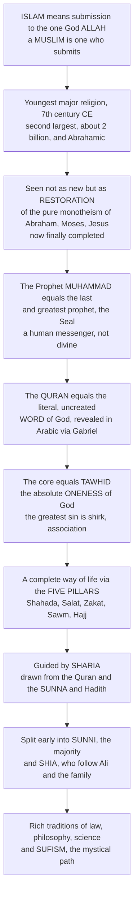

# ☪️ Islam and the Islamic Tradition

> [!abstract] TL;DR
> **Islam** means **"submission" or "surrender"** — specifically to the will of the one God, *Allah* (simply the Arabic word for "the God"), and a **Muslim** is literally **"one who submits."** It is the **youngest** of the major world religions (7th century CE) and the **second-largest** (~2 billion, and the fastest-growing), the third of the **Abrahamic** monotheisms alongside Judaism and Christianity. Muslims see Islam not as a *new* religion but as the **restoration and final completion** of the original, pure monotheism of Adam, Abraham, Moses, and Jesus — all honored as prophets. Its central figure is the Prophet **Muhammad** (~570–632 CE), the last and greatest prophet (the **"Seal of the Prophets"**) — a human messenger, not divine — through whom God delivered the **Qur'an**, revered as the literal, uncreated **word of God** dictated in Arabic through the angel Gabriel. Islam's uncompromising core is **tawhid**: the absolute **oneness** of God, whose gravest violation is *shirk* (associating anything with God). It structures a complete way of life through the **Five Pillars** (creed, prayer, almsgiving, fasting, pilgrimage), guided by the **sharia** (the divine law, drawn from Qur'an and the prophetic *Sunna*). Having split early into **Sunni** and **Shia** over succession, and having developed rich traditions of law, philosophy, science, and the mystical path of **Sufism**, Islam guides nearly a quarter of humanity.

---

## Intuition

**Analogy:** Imagine a note that a great composer intends to be played in its one perfect, final form. Earlier musicians received fragments of the score and played them beautifully but partially — some parts were lost, some were embellished, some were misremembered. Then the composer sends one last messenger carrying the complete, unaltered score, dictated word for word, and says: *this is the whole piece as I always meant it; play exactly this.* The right response is not to critique the score or add your own flourishes but to **submit** to it — to perform it faithfully. That word, submission, is the entire posture of Islam. *Islam* means submission, and a *Muslim* is one who submits — not grudgingly, but as the fitting response of a creature to its Creator.

In the technical domain, this is why Islam understands itself not as a *rival* to Judaism and Christianity but as their **completion**: Abraham, Moses, and Jesus were earlier prophets who delivered the same monotheism, and the **Qur'an** is the final, uncorrupted "score" — God's own speech, sent through Muhammad, the last messenger. Everything else in Islam — the daily prayer, the fasting, the law — flows from that one act of surrender to the one God.

---

## How It Works

Islam is built from a single center outward. Start with the meaning of the word, move to the finality of the messenger and the revelation, then to the doctrine of God's oneness, and finally to the way of life and the community that submission produces. The diagram traces that logic.



**The core mechanics of the tradition:**

1. **Submission to the one God.** The name is the theology: to be Muslim is to surrender to *Allah* — not a tribal or ethnic deity but *the* God, transcendent creator and judge, the same God worshipped (Muslims hold) by all the prophets. Arab Christians and Jews use the word *Allah* too; it is Arabic for "the God," not a separate being.
2. **The final prophet.** Muhammad stands in a long line — Adam, Noah, Abraham (*Ibrahim*), Moses (*Musa*), Jesus (*Isa*) are all honored prophets — but he is the **"Seal of the Prophets,"** the last and greatest. He is emphatically **human**: not worshipped, not divine, the messenger and not the message.
3. **The final revelation.** The **Qur'an** ("recitation") is the literal, uncreated **speech of God**, revealed in Arabic through the angel Gabriel (*Jibril*) over ~22 years. It is not *about* God; it *is* God's own words — which is why it is recited, memorized, and revered as the very heart of the faith.
4. **Tawhid, and its opposite.** The doctrine of God's **absolute oneness and uniqueness** (*tawhid*) is the foundation of everything. Its violation — *shirk*, associating any partner, image, or equal with God — is the one unforgivable sin, and the reason Islam rejects the Trinity, incarnation, and any image of the divine.
5. **A structured way of life.** Submission is enacted, not merely felt, through the **Five Pillars** and governed in every domain by **sharia** — the divine "path" derived from the Qur'an and the **Sunna** (Muhammad's exemplary practice, recorded in the *hadith*).
6. **Community and history.** From the first *ummah* (community) at Medina, Islam split over succession into **Sunni** and **Shia**, elaborated schools of law and theology, absorbed and advanced Greek philosophy and science, cultivated the mystical path of **Sufism**, and spread across three continents to build one of history's great civilizations.

---

## Key Concepts

### 🟢 Secondary — the shape of the faith

- **The name means submission.** *Islam* = "submission/surrender" to God; a *Muslim* = "one who submits." This is the single idea from which everything else grows.
- **One God, no partners.** Islam is radically monotheist. There is one God, *Allah* (Arabic for "the God"), with no equal, no image, and no family. Muslims do **not** worship Muhammad.
- **The last prophet and the final book.** **Muhammad** (~570–632 CE) is the last of the prophets; the **Qur'an** is the word of God he delivered. Earlier prophets — Abraham, Moses, Jesus — are honored, and Islam sees itself as restoring their original message.
- **The Five Pillars.** The framework of a Muslim's life: **Shahada** (the creed — "there is no god but God, and Muhammad is his messenger"), **Salat** (praying five times a day facing Mecca), **Zakat** (giving to the poor), **Sawm** (fasting in Ramadan), and **Hajj** (the pilgrimage to Mecca once in a lifetime, if able).
- **Mostly not Arab.** Fewer than one in five Muslims is Arab. The largest Muslim populations are in **Indonesia, Pakistan, India, and Bangladesh** — Islam is a global, mostly Asian and African faith.

### 🟡 Undergraduate — the doctrine, the law, the community

- **Tawhid and shirk.** *Tawhid* — the absolute oneness, unity, and uniqueness of God — is the cardinal doctrine; God is the transcendent, merciful, all-powerful creator and judge, addressed through his **99 Beautiful Names**. The gravest sin is *shirk*, associating partners with God — which is precisely why Islam rejects the Trinity, the incarnation, and religious images.
- **The six articles of faith.** Belief in (1) God, (2) angels, (3) the revealed books, (4) the prophets, (5) the Last Day — resurrection and judgment — and (6) divine decree (*qadar*). Note the **finality of Muhammad's prophethood**, which closes revelation.
- **The Qur'an as God's speech.** Unlike the Bible — which Islam regards as human testimony *about* God's acts — the Qur'an is direct, verbatim revelation. Its 114 *suras* are recited with special art (*tajwid*), memorized entire by the *hafiz*, and held to be inimitable (*i'jaz*). Its Arabic is theologically load-bearing: a translation is a paraphrase, not the Qur'an.
- **The Hijra and the *ummah*.** Muhammad's **emigration from Mecca to Medina in 622 CE** — the *Hijra* — marks year 1 of the Islamic calendar and the founding of the first Muslim community. Meccan revelation is largely devotional; Medinan revelation is largely legal and communal.
- **Sunna, hadith, and sharia.** **Sharia** is the divine path governing worship and conduct; **fiqh** is its *human* interpretation (jurisprudence). Its four classical sources are the **Qur'an**, the **Sunna** (recorded in *hadith*), *ijma* (scholarly consensus), and *qiyas* (analogical reasoning), elaborated by four Sunni law schools (*madhhabs*) and the scholars (*ulama*).
- **The Sunni–Shia split.** After Muhammad's death, the community divided over **succession**: the **Sunni** majority (~85–90%) accepted the elected caliphs and the community's consensus; the **Shia** (~10–15%) held that authority passed to Muhammad's family through his cousin and son-in-law **Ali** and a line of **Imams** (Twelvers, Ismailis). The dispute is about legitimate authority, not the core creed.
- **The Pillars in practice, and beyond.** Around the Five Pillars: **Friday congregational prayer**, the **mosque**, dietary law (**halal/haram**), and the great festivals **Eid al-Fitr** (ending Ramadan) and **Eid al-Adha** (during Hajj, commemorating Abraham's sacrifice).

### 🔴 Graduate — theology, philosophy, mysticism, and the frontier

- **Kalam: the created-Qur'an controversy.** Islamic **theology** (*kalam*) turned on whether the Qur'an is **created or uncreated (eternal)**. The rationalist **Mu'tazila** held it created and championed reason and human free will; the traditionalist **Ash'ari** synthesis — which became Sunni orthodoxy — affirmed the Qur'an's **uncreated eternity** and a more predestinarian view of God's decree. The dispute shaped Islamic conceptions of revelation, reason, and divine attributes.
- **Falsafa and the Ghazali–Averroes debate.** Muslim **philosophers** (*falsafa*) — **al-Farabi**, **Ibn Sina/Avicenna**, **Ibn Rushd/Averroes** — synthesized Aristotle and Neoplatonism, and their Arabic transmission of Greek learning later ignited the Latin West. **Al-Ghazali's** *Incoherence of the Philosophers* attacked their claims about the eternity of the world; **Averroes** replied with the *Incoherence of the Incoherence*. The exchange is a landmark in the perennial tension of faith and reason.
- **Sufism: the inner path.** *Tasawwuf* (**Sufism**) is Islamic **mysticism** — the inner, experiential path to God through **love**, **remembrance** (*dhikr*), and self-purification, organized into orders (*tariqas*) around saints and masters. **Al-Ghazali** helped reconcile it with orthodoxy; **Rumi's** poetry became world literature. Sufism has long stood in creative tension with legalist and, later, reformist Islam.
- **Conquest vs. conversion.** Historiography (notably **Richard Bulliet**) distinguishes sharply between **rapid political conquest** and **slow religious conversion**: the caliphates seized vast territory within a century, but the *populations* under their rule became majority-Muslim only gradually over centuries, following an S-shaped (logistic) curve that *lagged* the conquest — a distinction the Python demo below makes visible.
- **The modern era.** Ottoman decline, European **colonialism**, and modernity provoked a spectrum of responses: **modernist reform** (Abduh, Iqbal), scriptural revivalism and **Salafism**, and **Islamism / political Islam** seeking to reorder state and society by sharia. The critical study of religion also asks how far the tidy "world religion" category (Masuzawa, Asad) fits a tradition that resists the belief-first, privatized model.

---

## Python Demo

```python
# Islam in two lenses:
#   (a) CONQUEST vs CONVERSION -- the extraordinarily rapid EARLY EXPANSION of
#       territory under Muslim rule (622 CE onward) versus the much SLOWER,
#       lagging conversion of populations to Islam (Bulliet-style logistic curve).
#   (b) THE QIBLA -- the direction of prayer toward Mecca as a real great-circle
#       bearing, showing why it is NOT simply "east" or "toward Mecca on a flat map";
#       plus the GLOBAL DEMOGRAPHICS showing Islam is mostly NON-Arab.
# Figures are illustrative teaching heuristics, not precise survey data.

import numpy as np
import matplotlib.pyplot as plt

# ----------------------------------------------------------------------
# (a) RAPID CONQUEST vs GRADUAL CONVERSION
# ----------------------------------------------------------------------
years = np.arange(622, 1101)            # 622 CE (Hijra) to ~1100 CE

# Territory under Muslim rule (millions of km^2): explosive growth 622-750
# (Rashidun + Umayyad conquests, from Spain to Central Asia), then saturation.
def territory(y):
    # logistic-ish rapid rise centered ~665, saturating near ~11-12 M km^2 by 750
    L, k, y0 = 11.5, 0.055, 665.0
    return L / (1.0 + np.exp(-k * (y - y0)))

# Fraction of the conquered population that has CONVERTED to Islam:
# a slower logistic curve, deliberately LAGGED decades/centuries behind conquest.
def conversion(y):
    L, k, y0 = 0.92, 0.017, 900.0       # midpoint ~900 CE, slow rise
    return L / (1.0 + np.exp(-k * (y - y0)))

terr = territory(years)
conv = conversion(years)

# ----------------------------------------------------------------------
# (b) THE QIBLA: great-circle initial bearing from world cities to Mecca
# ----------------------------------------------------------------------
# Kaaba, Mecca:
mecca_lat, mecca_lon = 21.4225, 39.8262

cities = {
    "New York":  (40.7128,  -74.0060),
    "London":    (51.5074,   -0.1278),
    "Los Angeles":(34.0522, -118.2437),
    "Cape Town": (-33.9249,   18.4241),
    "Jakarta":   (-6.2088,   106.8456),
    "Beijing":   (39.9042,   116.4074),
    "Moscow":    (55.7558,    37.6173),
    "Sydney":    (-33.8688,  151.2093),
    "Delhi":     (28.6139,    77.2090),
    "Istanbul":  (41.0082,    28.9784),
}

def qibla_bearing(lat, lon):
    """Initial great-circle bearing (degrees, 0=N, 90=E) from (lat,lon) to Mecca."""
    p1, p2 = np.radians(lat), np.radians(mecca_lat)
    dlon   = np.radians(mecca_lon - lon)
    y = np.sin(dlon) * np.cos(p2)
    x = np.cos(p1) * np.sin(p2) - np.sin(p1) * np.cos(p2) * np.cos(dlon)
    return (np.degrees(np.arctan2(y, x)) + 360.0) % 360.0

names    = list(cities.keys())
bearings = np.array([qibla_bearing(*cities[c]) for c in names])

# ----------------------------------------------------------------------
# Global demographics: largest Muslim populations (millions, approx.)
# ----------------------------------------------------------------------
demo = {
    "Indonesia": 231, "Pakistan": 212, "India": 200, "Bangladesh": 154,
    "Nigeria": 106, "Egypt": 90, "Iran": 82, "Turkey": 80,
}
non_arab = {"Indonesia", "Pakistan", "India", "Bangladesh", "Nigeria", "Iran", "Turkey"}

# ----------------------------------------------------------------------
# Plot
# ----------------------------------------------------------------------
fig = plt.figure(figsize=(14, 11))

# (a) conquest vs conversion
ax1 = fig.add_subplot(2, 2, 1)
ax1.plot(years, terr, color="#b22222", lw=2.5, label="Territory under Muslim rule (M km^2)")
ax1.set_xlabel("Year (CE)")
ax1.set_ylabel("Territory (millions of km^2)", color="#b22222")
ax1.tick_params(axis="y", labelcolor="#b22222")
ax1.axvline(750, ls="--", color="gray", alpha=0.6)
ax1.text(752, 1.0, "conquests\nlargely done ~750", fontsize=8, color="gray")
ax1b = ax1.twinx()
ax1b.plot(years, 100 * conv, color="#1f4e79", lw=2.5, label="Population converted to Islam")
ax1b.set_ylabel("Population converted (%)", color="#1f4e79")
ax1b.tick_params(axis="y", labelcolor="#1f4e79")
ax1b.set_ylim(0, 100)
ax1.set_title("(a) Rapid CONQUEST precedes gradual CONVERSION")

# (b) qibla bearings as horizontal bar
ax2 = fig.add_subplot(2, 2, 2)
order = np.argsort(bearings)
ax2.barh(np.array(names)[order], bearings[order], color="#2a8f6e")
ax2.axvline(90,  ls=":", color="gray");  ax2.text(90, -0.9, "E", ha="center", fontsize=8)
ax2.axvline(180, ls=":", color="gray");  ax2.text(180, -0.9, "S", ha="center", fontsize=8)
ax2.axvline(270, ls=":", color="gray");  ax2.text(270, -0.9, "W", ha="center", fontsize=8)
ax2.set_xlim(0, 360)
ax2.set_xlabel("Compass bearing to Mecca (deg, 0=N, 90=E)")
ax2.set_title("(b) The QIBLA is a great-circle bearing, not simply 'east'")
for y, v in zip(range(len(order)), bearings[order]):
    ax2.text(v + 4, y, f"{v:.0f}", va="center", fontsize=8)

# (c) qibla on a polar compass (arrows from center)
ax3 = fig.add_subplot(2, 2, 3, projection="polar")
ax3.set_theta_zero_location("N")     # 0 deg at top = North
ax3.set_theta_direction(-1)          # clockwise = compass convention
for c, b in zip(names, bearings):
    theta = np.radians(b)
    ax3.plot([theta, theta], [0, 1], lw=1.8)
    ax3.text(theta, 1.12, c, ha="center", va="center", fontsize=7)
ax3.set_rticks([]); ax3.set_ylim(0, 1.25)
ax3.set_title("(c) Direction to Mecca from each city\n(arrows fan across the compass)", pad=18)

# (d) largest Muslim populations -- mostly non-Arab
ax4 = fig.add_subplot(2, 2, 4)
dn = list(demo.keys()); dv = np.array([demo[k] for k in dn])
colors = ["#c98a2b" if k in non_arab else "#7a4fb0" for k in dn]
o = np.argsort(dv)
ax4.barh(np.array(dn)[o], dv[o], color=np.array(colors)[o])
ax4.set_xlabel("Muslim population (millions, approx.)")
ax4.set_title("(d) Largest Muslim populations: mostly NON-Arab, non-Mideast")
ax4.text(0.98, 0.05, "orange = non-Arab-majority country",
         transform=ax4.transAxes, ha="right", fontsize=8, color="#c98a2b")

plt.tight_layout()
plt.savefig("islam_expansion_and_qibla.png", dpi=130, bbox_inches="tight")
plt.show()

# Console: how "east" is the qibla, really?
print("City-by-city qibla bearing to Mecca (0=N, 90=E):")
for c in names:
    b = qibla_bearing(*cities[c])
    print(f"  {c:12s}  {b:5.1f} deg")
print(f"\nTerritory in 632 CE: {territory(632):.2f} M km^2  |  in 750 CE: {territory(750):.2f} M km^2")
print(f"Converted by 750 CE: {100*conversion(750):.1f}%  |  by 1000 CE: {100*conversion(1000):.1f}%")
```

**What the figure teaches.** Panel (a) is the historian's crucial distinction made visible: the **red curve** (territory) rockets from almost nothing in 622 to a saturated empire stretching from Spain to Central Asia by ~750, while the **blue curve** (conversion of the population) rises far later and more slowly — political control ran *centuries* ahead of religious conversion, so the early caliphates ruled societies that were still mostly non-Muslim. Panels (b) and (c) show why the **qibla** is a genuine spherical-geometry problem: from New York the great-circle bearing to Mecca is roughly **northeast (~58°)**, not the "east" or "southeast" a flat map suggests, and from Jakarta it points **northwest** — the bearings fan across the entire compass. Panel (d) drives home that Islam is a **global, mostly non-Arab** faith: its four largest populations (Indonesia, Pakistan, India, Bangladesh) are all in South and Southeast Asia, and only a minority of the world's ~2 billion Muslims are Arab or Middle Eastern.

---

## Real-World Applications

- **Reading nearly a quarter of humanity.** ~2 billion people across ~50 Muslim-majority countries and large global diasporas — geopolitics, migration, and international affairs are unreadable without literacy in the Sunni/Shia distinction, the role of the *ulama*, and the diversity of lived Islam.
- **Islamic finance.** A ~trillion-dollar sector built on sharia principles — the prohibition of *riba* (interest) and *gharar* (excessive uncertainty) — using profit-sharing and asset-backed instruments (*mudaraba*, *sukuk*). A direct, modern application of *fiqh* to global markets.
- **The halal economy.** Dietary and lifestyle law (*halal/haram*) governs a vast global food, pharmaceutical, cosmetics, and travel industry with its own certification and supply chains.
- **Qibla and prayer-time computation.** Every prayer app, smart compass, and mosque orientation relies on exactly the great-circle bearing and solar-timing astronomy in the demo above — a living intersection of ritual and spherical geometry inherited from medieval Islamic astronomy.
- **The transmission of knowledge.** Islamic civilization preserved, translated, and advanced Greek philosophy and science, gave the world *algebra* (*al-jabr*), the numeral system, and foundational work in medicine and optics — the pipeline through which much of antiquity reached medieval Europe.
- **Interfaith and Abrahamic dialogue.** Understanding tawhid, prophethood, and shared scriptural figures (Abraham, Moses, Jesus, Mary) is the basis for serious Jewish–Christian–Muslim conversation and for defusing the ignorance that fuels conflict.

---

## Common Pitfalls

- **Equating Islam with Arabs or the Middle East.** Fewer than one in five Muslims is Arab; the largest Muslim populations are in Indonesia, Pakistan, India, and Bangladesh. Islam is a global, mostly Asian and African faith.
- **Thinking Muslims worship Muhammad.** They emphatically do not — that would be *shirk*, the gravest sin. Muhammad is a revered but **human** messenger; "Mohammedanism" is an old, offensive, and simply inaccurate label.
- **Assuming "Allah" is a different, foreign God.** *Allah* is just Arabic for "the God" — the same word used by Arabic-speaking Christians and Jews. Tawhid claims it is the very God of Abraham, Moses, and Jesus.
- **Treating Islam as monolithic.** Sunni and Shia, four Sunni law schools, Sufi orders, and enormous cultural variation from Morocco to Indonesia mean there is no single "Islam" any more than a single "Christianity."
- **Confusing sharia with fiqh.** *Sharia* is the divine ideal path; *fiqh* is fallible human interpretation of it. Media talk of a single fixed "sharia law" collapses a rich, contested, centuries-long juristic tradition into a caricature.
- **Assuming conquest equals conversion.** As panel (a) shows, rapid political expansion vastly outran gradual religious conversion; the two are distinct processes separated by centuries — the "spread by the sword" trope ignores this.
- **Reducing *jihad* to "holy war."** The word means "striving"; the classical tradition distinguishes the **greater** jihad (inner moral struggle) from the **lesser** jihad (defensive armed struggle), and both are hedged with strict conditions.

---

## Related Concepts

Islam is the third of the **Abrahamic** monotheisms, and in this vault it sits beside its prose-only siblings: the *Religious Studies and Comparative Religion Overview* hub, *Judaism and the Covenant Tradition* and *Christianity and the Christian Traditions* (the other two Abrahamic faiths whose primordial monotheism Islam claims to complete), *Sacred Texts and Scripture* (where the Qur'an-as-uncreated-word contrasts with the Bible-as-testimony), *Ethics and Religious Law* (the natural home of sharia and *fiqh*), and *Religious Experience and Mysticism* (which develops Sufism comparatively).

- [[Religious_Studies_and_Comparative_Religion_Overview]] — the vault hub; Islam is a case study in its non-confessional, comparative method and in the "world religions" category critique.
- [[Rise_of_Islam_and_the_Caliphates]] — **History**: the historical narrative of Muhammad, the Rashidun and Umayyad conquests, and the caliphate this note treats doctrinally.
- [[Islamic_Science_and_Mathematics]] — **History**: the Golden-Age science, algebra, and astronomy (including the qibla and prayer-timing) that Islamic civilization produced.
- [[The_House_of_Wisdom]] — **History**: the Abbasid Baghdad institution where Greek learning was translated and advanced — the transmission pipeline mentioned above.
- [[Al_Andalus]] — **History**: Islamic Spain, the setting for Averroes and centuries of Muslim–Jewish–Christian coexistence and exchange.
- [[Islamic_and_Jewish_Philosophy]] — **Philosophy**: *falsafa* — al-Farabi, Ibn Sina/Avicenna, Ibn Rushd/Averroes — and the Ghazali–Averroes debate on faith and reason.
- [[Faith_and_Reason]] — **Philosophy**: the perennial tension that *kalam* theology and *falsafa* both engage; Islam is a central chapter in that story.
- [[Islamic_Cosmology_and_the_Jinn]] — **Mythology**: the narrative and folkloric layer of the Islamic imagination — angels, jinn, and cosmology — complementing this doctrinal treatment.
- [[The_Crusades]] — **History**: the medieval Christian–Muslim military and cultural encounter, a key episode in Islam's relations with the wider Abrahamic world.

---

## Review Questions

**🟢 Secondary.** What do the words *Islam* and *Muslim* literally mean, and why does that meaning explain both the centrality of the Five Pillars and the fact that Muslims do not worship Muhammad?

**🟡 Undergraduate.** Explain **tawhid** and its opposite, **shirk**, and use them to account for three specific features of Islam: its rejection of the Trinity, its prohibition of images of the divine, and its insistence that Muhammad is a human messenger rather than a divine figure.

**🔴 Graduate.** Historians distinguish sharply between the *rapid political conquest* of the early caliphates and the *slow religious conversion* of the populations they ruled (the Bulliet conversion curve). Explain the evidence and logic behind this distinction, and discuss how it complicates the popular "spread by the sword" narrative and the reductive "world religion" template applied to Islam.

---

## Sources

- Fazlur Rahman, *Islam* (2nd ed., 1979) — the classic modern scholarly overview by a leading Muslim reformist thinker.
- Carl W. Ernst, *Following Muhammad: Rethinking Islam in the Contemporary World* (2003).
- John L. Esposito, *Islam: The Straight Path* (5th ed., 2016).
- *The Qur'an*, trans. M. A. S. Abdel Haleem (Oxford World's Classics, 2004) — a leading scholarly English translation.
- Marshall G. S. Hodgson, *The Venture of Islam*, 3 vols. (1974); Richard W. Bulliet, *Conversion to Islam in the Medieval Period* (1979).

---

#religious-studies #islam #tawhid #quran #five-pillars
