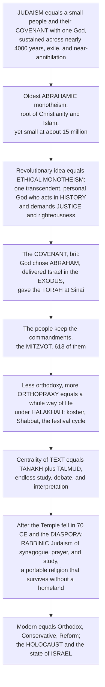

# ✡️ Judaism and the Covenant Tradition

> [!abstract] TL;DR
> Judaism is the astonishing story of a small people and their **covenant** — a binding, mutual agreement — with **one God**, sustained across nearly four thousand years, exile, and near-annihilation. It is the **oldest of the Abrahamic monotheisms** and the root from which Christianity and Islam grew, yet it remains distinctively small at roughly **15 million people**. Its revolutionary idea, radical in the ancient world, was **ethical monotheism**: not many gods embodying natural forces, but *one* transcendent, personal God (**YHWH**) who is the sole creator, who acts in **history**, and who is fundamentally concerned with **justice** and **righteousness** — with how humans treat one another. The relationship between God and the people **Israel** is framed as a **covenant** (*brit*): God chose **Abraham**, delivered his descendants from slavery in Egypt (the **Exodus**), and at **Sinai** gave the **Torah** to Moses; in return the people commit to keeping the commandments (the **mitzvot**, 613 of them). So Judaism is less about correct *belief* (orthodoxy) than about right *practice and living* (orthopraxy) — a whole way of life governed by **halakhah** (Jewish law): kosher, the Sabbath, festivals, life-cycle rites, prayer, and above all **study**. After the Temple's destruction (70 CE) and the **diaspora**, it transformed from a Temple-and-sacrifice cult into **rabbinic Judaism** centered on synagogue, prayer, and Torah — an adaptation that let it survive without a homeland, through the trauma of the **Holocaust** and into the era of modern **Israel**.

---

## Intuition

**Analogy:** Imagine a family with no land, no army, and no capital city, whose entire national existence is carried in a **contract** and a **library**. Empires rise and fall around them; they are exiled, scattered to the ends of the earth, and repeatedly targeted for destruction — yet three thousand years later the family still keeps the terms of the original agreement, still reads and argues over the same book every week, still marks the same anniversaries. What holds them together is not a place or a bloodline alone but a **covenant** — a solemn, two-sided promise between a people and their God — plus a portable text that any ten adults can open anywhere in the world.

That portable covenant *is* Judaism. Most ancient peoples anchored their identity in a temple, a homeland, and gods who *were* the sun, the storm, the river — powers of nature to be appeased. Judaism's radical wager was different: there is **one** God, above and beyond nature, who is not bribed by sacrifice but who **demands justice**; who once made a binding agreement with a specific family; and who wrote the terms into a **teaching** (Torah) that the people carry, study, and live by. Strip away the Temple and the land — as history did in 70 CE — and the religion does not die, because its center of gravity was never a building. It was the covenant and the book.

---

## How It Works

Judaism is best understood not as a creed to be affirmed but as a **relationship to be lived** — a covenant with obligations, unfolding through a founding story (Abraham → Exodus → Sinai) into a total way of life (halakhah) sustained by a culture of endless textual study. The diagram traces that logic, and its single most important twist: when the Temple fell, a **place-and-sacrifice** religion re-engineered itself into a **portable, textual** one, which is exactly why it survived the diaspora.



**The core mechanics:**

1. **One God, above nature, who acts in history.** The founding claim is **ethical monotheism**: reality is created and governed by a single, transcendent, personal God (**YHWH**, the ineffable name), summarized in the **Shema** — *"Hear O Israel, the LORD our God, the LORD is one."* This God is not a force of nature to be manipulated by ritual but a holy will that **demands moral conduct**. Hence **aniconism**: no images, because the infinite cannot be captured in a form.
2. **The covenant sequence.** Sacred history is a chain of covenants: **creation**, then **Abraham** (the call, the promise of descendants and land, the sign of circumcision), the **Exodus** from Egypt under **Moses** (the foundational redemptive act), and **Sinai**, where God gives the **Torah** and the **Ten Commandments**. Israel becomes a **"chosen people"** — chosen for *responsibility and mission*, not privilege.
3. **From belief to practice.** The covenant is kept by *doing*. The **613 mitzvot** (commandments) and the accumulated system of **halakhah** ("the way to walk") govern daily life: **kashrut** (dietary law), **Shabbat** (the Sabbath), the festival and fast cycle, life-cycle rites, prayer, and ethics. Judaism prizes **orthopraxy** (right practice) over **orthodoxy** (right belief).
4. **A religion of the text.** The written **Tanakh** is completed by an **Oral Torah** — the **Mishnah**, the **Talmud** (Mishnah plus Gemara), Midrash, and centuries of commentary and legal reasoning. Study *is* worship; argument *is* piety.
5. **The great transformation.** When Rome destroyed the Second Temple in **70 CE**, sacrifice became impossible. The **rabbis** re-centered the religion on **synagogue, prayer, and Torah study** — a portable, adaptable form that could travel with an exiled people. This single pivot is why Judaism outlived every empire that dispersed it.

---

## Key Concepts

### 🟢 Secondary — the shape of the tradition

- **Ethical monotheism.** The core idea: *one* God, not many; a God who stands *above* nature rather than being the sun or the sea; and a God who cares above all about **justice** and how people treat one another. In the polytheistic ancient world, this was revolutionary.
- **The covenant (*brit*).** A binding, two-way agreement between God and the people Israel. God rescues and guides; the people keep the commandments. Everything in Judaism hangs on this relationship.
- **Torah and mitzvot.** The **Torah** (the first five books, "teaching" or "law") contains the **613 commandments** (*mitzvot*) that shape Jewish life. Judaism is about **living rightly**, not just believing rightly.
- **A way of life.** Keeping **kosher**, resting on **Shabbat**, and marking festivals such as **Passover** (the Exodus), **Yom Kippur** (the Day of Atonement), and **Hanukkah** turn belief into daily, weekly, and yearly practice.
- **A people and a religion.** Jewishness is *both* a religion *and* a peoplehood — one can be a secular or cultural Jew. This is why "who is a Jew?" is genuinely complicated.

### 🟡 Undergraduate — covenant, law, and text

- **YHWH, the Shema, and aniconism.** The divine name **YHWH** is treated as unpronounceable; God is affirmed as radically **one** in the Shema and represented by **no image**. This transcendence distinguishes Israelite religion from its Near Eastern neighbors, whose gods were embodied natural powers (compare the "demythologized" tone of Genesis 1).
- **The covenant sequence and chosenness.** Creation → Abraham → Exodus → Sinai → the Land → the Prophets → messianic hope. **Chosenness** is best read as *vocation*: Israel is a "kingdom of priests," obligated to be a moral witness, not a favored elite. The **prophets** (Amos, Isaiah, Micah) sharpen this into a demand that **ethics outrank ritual** — God despises sacrifices offered by the unjust.
- **Halakhah and orthopraxy.** **Halakhah** — Jewish law derived from Torah and rabbinic interpretation — governs **kashrut**, **Shabbat**, the full festival cycle (**Pesach/Passover, Shavuot, Sukkot, Rosh Hashanah, Yom Kippur, Hanukkah, Purim**), circumcision and life-cycle rites, prayer (the **synagogue**, the *siddur*), and purity. The ethical ideal of **tikkun olam** ("repairing the world") frames observance as moral responsibility.
- **The two Torahs.** Alongside the **written** Torah is the **Oral Torah**, later codified in the **Mishnah** (c. 200 CE) and expanded in the **Talmud** (Babylonian Talmud, c. 500 CE). Judaism becomes a "religion of the book" *and* of argument — the yeshiva, the commentary of **Rashi**, and the codes of **Maimonides** make interpretation a central act of piety.
- **The 70 CE pivot.** The destruction of the Second Temple ended the sacrificial cult; **rabbinic Judaism** replaced Temple and priest with **synagogue, prayer, and study**, producing a **portable** religion able to survive the **diaspora**.

### 🔴 Graduate — history, thought, and modern fractures

- **The historical arc.** Ancient Israel (patriarchs, Exodus tradition, the monarchy, the First Temple) → the **Babylonian Exile** (587 BCE) and return → the Second Temple period → **70 CE** and the rabbinic transformation → medieval Jewish life under Islam and Christendom → **Kabbalah** and Jewish **mysticism** (the *Zohar*, later Hasidism) → the **Haskalah** (Jewish Enlightenment) and emancipation → the **Holocaust/Shoah** → **Zionism** and the founding of the modern state of **Israel**. Each rupture forced a reinvention that the covenant framework absorbed.
- **Jewish philosophy and theology.** **Maimonides** (the *Guide for the Perplexed*, the Thirteen Principles) fused Aristotle with Torah through a rigorous **negative theology**; modern thinkers include **Martin Buber** (*I and Thou*, the covenantal relation as dialogue), **Abraham Joshua Heschel** (radical amazement, the prophets), and **post-Holocaust theology** (Fackenheim, Rubenstein) wrestling with divine presence after Auschwitz.
- **The denominational spectrum.** **Orthodox** (including **Haredi/ultra-Orthodox** and **Modern Orthodox**) holds Torah and halakhah to be divinely binding and unchanging; **Conservative/Masorti** treats halakhah as binding but historically evolving; **Reform/Progressive** prioritizes ethical monotheism and autonomy over the binding force of ritual law; **Reconstructionist** reframes Judaism as an evolving **civilization**.
- **Chosenness, particularism, and mission.** The covenant is *particular* (a specific people) yet its God is *universal* (creator of all) — a productive tension running from the prophets to modern debates about universal ethics versus communal survival. Reform reread chosenness as a **mission to humanity**; others stress covenantal peoplehood.
- **Modern fault lines.** Tradition vs. modernity; religious vs. secular/cultural Jewishness; **Israel and diaspora**; **gender and inclusion** (women's ordination, egalitarian *minyan*). These are not peripheral: they are where the covenant is being renegotiated today.

---

## Python Demo

```python
# Judaism in two computations that get at WHY the covenant tradition survived:
#   (a) DIASPORA & SURVIVAL -- a portable/textual religion persists under
#       dispersion where a place-bound (Temple/land) religion fragments.
#   (b) THE HEBREW LUNI-SOLAR CALENDAR -- the 19-year Metonic intercalation
#       (7 leap months) that keeps festivals like Passover locked to spring.
# Figures are illustrative teaching heuristics, not precise historical data.

import numpy as np
import matplotlib.pyplot as plt

# =====================================================================
# (a) DIASPORA DISPERSION & SURVIVAL
# =====================================================================
# Timeline from the Second Temple's fall (70 CE) forward, by decade.
years = np.arange(70, 2030, 10)
t = years - years[0]

# Geographic dispersion: population starts in one homeland and spreads to
# many regions -- modeled as saturating (logistic) growth in # of regions.
K_regions = 80.0            # carrying number of distinct regions/communities
r = 0.028
regions = K_regions / (1.0 + (K_regions - 1.0) * np.exp(-r * t))

# A dispersion index in [0, 1]: how far the people are from a single homeland.
dispersion = (regions - regions[0]) / (K_regions - regions[0])

# Continuity of shared religious practice under dispersion, two "types":
#   place-bound     -> identity anchored in Temple + land; collapses when scattered
#   portable/textual-> identity carried in Torah, law, synagogue; survives scattering
place_bound = np.exp(-4.0 * dispersion)                 # fragments fast
portable    = 0.55 + 0.45 * np.exp(-0.30 * dispersion)  # persists (text-anchored)

# =====================================================================
# (b) THE HEBREW LUNI-SOLAR CALENDAR: METONIC INTERCALATION
# =====================================================================
synodic    = 29.530594      # mean lunar (synodic) month, days
solar_year = 365.24219      # mean tropical year, days

# 19-year Metonic cycle: 13-month "leap" years at positions 3,6,8,11,14,17,19.
leap_positions = {3, 6, 8, 11, 14, 17, 19}
n_cycles = 2
n_years  = 19 * n_cycles
yr = np.arange(1, n_years + 1)

months_per_year = np.array(
    [13 if ((y - 1) % 19 + 1) in leap_positions else 12 for y in yr]
)
lunisolar_len  = months_per_year * synodic     # actual Hebrew year length
lunar_only_len = np.full(n_years, 12 * synodic)  # naive 12-month lunar year

# Cumulative seasonal drift vs the solar year (days ahead/behind the seasons).
drift_lunisolar  = np.cumsum(lunisolar_len  - solar_year)
drift_lunar_only = np.cumsum(lunar_only_len - solar_year)

# Sanity check on the cycle: 235 months should ~ 19 solar years.
months_in_cycle = int(12 * 12 + 7 * 13)  # 12 common + 7 leap years
cycle_lunar_days = months_in_cycle * synodic
cycle_solar_days = 19 * solar_year

# =====================================================================
# PLOT
# =====================================================================
fig = plt.figure(figsize=(14, 10))

# (a1) geographic dispersion over time
ax1 = fig.add_subplot(2, 2, 1)
ax1.plot(years, regions, color="#4c72b0", lw=2)
ax1.set_xlabel("Year (CE)")
ax1.set_ylabel("Distinct communities / regions")
ax1.set_title("(a1) The Diaspora: dispersion from one homeland to many lands")
ax1.grid(alpha=0.3)

# (a2) continuity of shared practice: portable vs place-bound religion
ax2 = fig.add_subplot(2, 2, 2)
ax2.plot(years, 100 * portable, color="#2a9d8f", lw=2,
         label="Portable / textual (Torah, synagogue, law)")
ax2.plot(years, 100 * place_bound, color="#c44e52", lw=2, ls="--",
         label="Place-bound (Temple + land)")
ax2.set_xlabel("Year (CE)")
ax2.set_ylabel("Retained shared practice (%)")
ax2.set_title("(a2) Why Judaism survived: a book outlasts a building")
ax2.set_ylim(0, 105)
ax2.legend(fontsize=8, loc="center right")
ax2.grid(alpha=0.3)

# (b) Hebrew calendar drift vs the solar year, over two Metonic cycles
ax3 = fig.add_subplot(2, 1, 2)
ax3.axhline(0, color="k", lw=0.8)
ax3.plot(yr, drift_lunisolar, color="#4c72b0", lw=2, marker="o", ms=3,
         label="Luni-solar (Hebrew) calendar: 7 leap months / 19 yrs")
ax3.plot(yr, drift_lunar_only, color="#c44e52", lw=2, ls="--",
         label="Naive 12-month lunar calendar (no intercalation)")
for c in range(1, n_cycles):
    ax3.axvline(19 * c + 0.5, color="gray", ls=":", lw=1)
ax3.set_xlabel("Year within the sequence (two 19-year Metonic cycles)")
ax3.set_ylabel("Cumulative drift vs. solar year (days)")
ax3.set_title("(b) Intercalation keeps festivals in season: the luni-solar "
              "drift stays bounded, the naive lunar calendar runs away")
ax3.legend(fontsize=8, loc="lower left")
ax3.grid(alpha=0.3)

plt.tight_layout()
plt.savefig("judaism_covenant_tradition.png", dpi=130, bbox_inches="tight")
plt.show()

# ---- Console summary ----
print(f"Metonic cycle: {months_in_cycle} lunar months over 19 years")
print(f"  235 lunar months  = {cycle_lunar_days:8.2f} days")
print(f"  19 solar years    = {cycle_solar_days:8.2f} days")
print(f"  mismatch          = {cycle_lunar_days - cycle_solar_days:+.2f} days "
      f"(~2 hours -> an excellent reconciliation)\n")
print(f"After ~1950 yrs of diaspora, retained shared practice:")
print(f"  portable/textual  = {100*portable[-1]:5.1f} %")
print(f"  place-bound       = {100*place_bound[-1]:5.1f} %")
```

**What the figure teaches.** Panel (a1) sketches the **diaspora**: a people flung from a single homeland into scores of communities across the world. Panel (a2) is the whole argument in one picture — a **place-bound** religion (identity fused to a Temple and a land) fragments as it disperses, while a **portable, textual** one (Torah, synagogue, law, study) holds its shared practice almost flat. That is the difference the rabbis engineered after 70 CE, and it is why Judaism, alone among the ancient Near Eastern religions, is still practiced. Panel (b) shows the **Hebrew luni-solar calendar** solving a real astronomical problem: twelve lunar months fall about eleven days short of a solar year, so a naive lunar calendar (red) drifts steadily and would drag **Passover** backward through the seasons. Inserting **seven leap months over every nineteen years** (the **Metonic cycle**) keeps the drift bounded (blue), locking Passover to spring and Sukkot to autumn — sacred time re-synchronized with the created order, cycle after cycle.

---

## Real-World Applications

- **Understanding the Abrahamic family.** Christianity and Islam inherited Judaism's ethical monotheism, its scriptures (the "Old Testament"), its prophets, and its covenant grammar. You cannot read the New Testament or the Qur'an without the Torah's God, Abraham, Moses, and Sinai in the background. Judaism is the **parent tradition** of roughly half the world's believers.
- **The invention of history and conscience.** The idea of a God who acts *in history* toward a *moral goal* seeded Western notions of linear history, progress, and social justice — the prophetic demand for *justice for the widow, the orphan, and the stranger* echoes through abolition, labor, and civil-rights movements.
- **A model of cultural survival without a state.** For 1,900 years Judaism sustained a people with no homeland, purely through **text, law, ritual, and community** — a case study in how portable institutions preserve identity through dispersion and persecution, studied by historians, sociologists, and diaspora scholars everywhere.
- **Contemporary geopolitics and identity.** The modern state of **Israel**, the memory of the **Holocaust**, and the diaspora's relationship to both are unreadable without the covenant tradition — including the deep tension between Judaism as *religion* and as *peoplehood*.
- **A living hermeneutic tradition.** The Talmudic culture of layered commentary, dissenting opinions preserved alongside majority rulings, and reasoning from precedent is a genuine intellectual technology — one that has shaped legal reasoning, scholarship, and debate far beyond the synagogue.

---

## Common Pitfalls

- **Reading Judaism as "Christianity minus Jesus."** Judaism is not a faith defined by a creed you *accept*; it is a covenant you *keep*. Its center is **orthopraxy** (right practice) and law, not orthodoxy (right belief). Projecting a belief-first, Protestant template distorts it.
- **Misreading "chosenness" as supremacy.** The covenant frames Israel as chosen for **responsibility and mission** — a "kingdom of priests" bound by *more* obligations — not as a privileged elite. The prophets themselves relentlessly attack any complacent reading.
- **Confusing the religion with the ethnicity.** Jewishness is *both* a religion *and* a peoplehood; there are secular and cultural Jews. Treating "Jewish" as purely religious *or* purely ethnic both miss the "who is a Jew?" complexity.
- **Assuming Judaism is unchanged since the Bible.** The most important fact about it is a **transformation**: the Temple-and-sacrifice religion of the Bible became the **rabbinic**, synagogue-and-study religion after 70 CE. Modern Orthodox, Conservative, and Reform are further developments, not deviations from a frozen original.
- **Flattening the denominations.** Orthodox, Conservative, and Reform differ sharply on whether halakhah is divinely binding, historically evolving, or ethically optional — lumping them together erases the central modern debate.
- **Equating the Talmud with a catechism.** The Talmud is not a book of settled answers but a record of **argument** — minority opinions are preserved, questions often left open. Its authority lies in the *process* of interpretation, not a list of doctrines.

---

## Related Concepts

- [[Mythic_Motifs_in_the_Hebrew_Bible]] — reads Genesis beside its ancient Near Eastern neighbors (Enuma Elish, the Gilgamesh flood), showing how Israelite religion **demythologized** shared motifs into the work of a single transcendent God — the literary substrate of the covenant story.
- [[Creation_and_Flood_Myths]] — the comparative backdrop for Genesis: creation-and-flood patterns across cultures against which Judaism's distinctive **ethical monotheist** cosmogony stands out.
- [[Islamic_and_Jewish_Philosophy]] — **Maimonides** and the medieval synthesis of Aristotle with Torah (negative theology, the *Guide for the Perplexed*); the intellectual high-water mark of Jewish philosophy and its influence on Aquinas.
- [[Faith_and_Reason]] — the perennial tension the covenant tradition negotiates: revealed Torah versus reasoned argument, worked out by Maimonides in Judaism just as by Aquinas in Christianity and Averroes in Islam.
- [[The_Holocaust]] — the **Shoah**, the near-annihilation that reshaped modern Jewish identity, accelerated **Zionism** and the founding of Israel, and forced post-Holocaust theology to rethink the covenant itself.

*(Sibling notes in this section are developed in prose companions rather than links: see the `Religious_Studies_and_Comparative_Religion_Overview` for the field's stance, and the forthcoming `Christianity_and_the_Christian_Traditions`, `Islam_and_the_Islamic_Tradition`, `Sacred_Texts_and_Scripture`, `Ethics_and_Religious_Law`, and `Concepts_of_the_Divine_and_Ultimate_Reality` for the daughter traditions, the mechanics of scripture, religious law, and the doctrine of God.)*

---

## Review Questions

**🟢 Secondary.** What is a **covenant**, and why is it more central to Judaism than any single belief? Give one everyday practice through which Jews "keep" the covenant.

**🟡 Undergraduate.** Judaism prizes **orthopraxy** (right practice) over **orthodoxy** (right belief). Using kashrut, Shabbat, and the festival cycle, explain what this means — and why the destruction of the Temple in 70 CE made a **portable, text-centered** version of the religion not just possible but necessary.

**🔴 Graduate.** "Chosenness" has been read as privilege, as burden, and as universal mission. Drawing on the prophets, Maimonides, and at least one modern movement (Reform, Conservative, or Orthodox), argue for the most defensible interpretation of the covenant's particularism in light of its **universal** God — and say what post-Holocaust theology adds to the question.

---

## Sources

- Nicholas de Lange, *An Introduction to Judaism* (2nd ed., Cambridge University Press, 2010).
- Jacob Neusner, *Judaism: An Introduction* (Penguin, 2002).
- Isadore Epstein, *Judaism: A Historical Presentation* (Penguin, 1959).
- *Tanakh: The Holy Scriptures* — The New JPS Translation (Jewish Publication Society, 1985).
- Norman Solomon, *Judaism: A Very Short Introduction* (Oxford University Press, 2000).

---

#religious-studies #judaism #ethical-monotheism #covenant #torah
