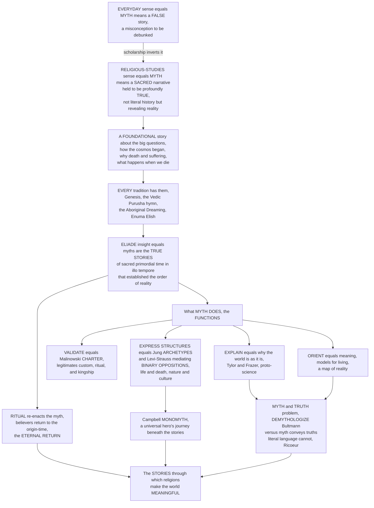

# 🌌 Myth and Sacred Narrative

> [!abstract] TL;DR
> In everyday speech a **myth** is a *false* story — a misconception to be debunked ("the myth of the eight-hour workday"). In religious studies the word means almost the **opposite**: a **sacred, foundational narrative** that a community holds to be profoundly **true** — not necessarily as literal history, but as a story that reveals *how the world came to be, who we are, and how we should live*. Myths are a culture's answers to the biggest questions: How did the cosmos begin (**cosmogony**)? Why is there death and suffering? Where did we come from and what happens when we die? Every tradition has them — Genesis, the Vedic *Purusha* hymn, Aboriginal *Dreaming*, the Babylonian *Enūma Eliš*, Norse and Greek cosmogonies. The crucial insight, sharpened by **Mircea Eliade**, is that for religious people myths are not "just stories" but the **true stories** — accounts of sacred events in *primordial time* (*in illo tempore*) that established the very order of reality — and **ritual re-enacts them**, letting believers return to and participate in that origin-time (the **eternal return**). Scholars have theorized what myth *does*: it **explains** why the world is as it is (Tylor, Frazer); it **validates** social order as a **charter** for custom, ritual, and kingship (Malinowski); it expresses deep **archetypes** (Jung) and mediates fundamental **binary oppositions** like life/death and nature/culture (Lévi-Strauss); and it **orients** us, giving meaning and models for living. Joseph Campbell popularized a universal **monomyth** (the hero's journey) beneath the world's stories. The myth–truth relationship is subtle: to **demythologize** (Bultmann) is to extract the existential meaning behind the imagery, but others insist (Ricoeur) that myth conveys truths **literal, propositional language cannot** — meanings grasped only through story and symbol. To understand myth as sacred narrative is to understand the stories through which religions make the world meaningful — and why, in the scholarly sense, calling something a "myth" is not to dismiss it but to point to its deepest cultural work.

---

## Intuition

**Analogy:** Imagine two people using the same word for utterly different things. A skeptic points at a tabloid headline and says, *"That's a myth"* — meaning it is false, a rumor to be corrected. Now picture a grandmother by a fire telling her grandchildren the story of how the world was sung into being — a story she would never call "false," because judging it true-or-false as *reportage* would miss its entire point. It is not a claim about last Tuesday; it is a **map of reality** — a story that tells the children where they came from, why the seasons turn, why people die, and how they ought to live. The skeptic's "myth" is a *broken fact*. The grandmother's "myth" is a *foundational truth* that no fact could ever replace.

That gap **is** the subject of this note. Religious studies deliberately adopts the grandmother's meaning, not the skeptic's. A **myth**, in the scholarly sense, is a **sacred narrative** set in primordial or sacred time, concerning gods, origins, and the fundamental order of things, which a community holds to be *true* in the deepest orienting sense — even, and especially, when it is not literal history. When Eliade says a creation myth is "true," he means it discloses what is *really real*: it establishes the cosmos, and ritual lets people re-enter that creative moment. So when an anthropologist labels the Babylonian *Enūma Eliš* a "myth," she is making a claim about its **sacred status and cultural function**, not calling it a lie. Learning to hear the word this way — as pointing to a story's power rather than dismissing its content — is the whole shift this note asks you to make.

---

## How It Works

Myth as sacred narrative moves through a definite logic: the **redefinition** of the word (false story → sacred true story), the **Eliade insight** that myths recount sacred primordial time and that ritual re-actualizes it, the great **theories of what myth does** (explain, validate, structure, orient), Campbell's universal **monomyth**, and the unresolved **myth-and-truth problem**. The diagram traces that arc from the everyday misunderstanding to the scholarly payoff.



**The core mechanics of myth as sacred narrative:**

1. **Redefine the word.** Separate the popular sense ("myth equals falsehood") from the scholarly sense ("myth equals a sacred, true-for-its-community story"). The label tracks a narrative's *social status and function*, not its factual accuracy — which is why the same story can be scripture to one people, "legend" to their neighbors, and "fairy tale" to outsiders (compare the Mythology-vault note **What_Is_Myth**).
2. **Locate it in sacred time.** A myth narrates events *in illo tempore* — the strong, creative primordial time of beginnings — and typically concerns gods, first ancestors, and the founding of the cosmos and its institutions.
3. **Bind it to ritual.** Ritual **re-actualizes** the myth: to recite or re-enact the origin-story is to abolish profane time and re-enter the sacred creative moment (Eliade's **eternal return**). Myth is the story that ritual *does* (compare the sibling **Ritual_and_Religious_Practice**).
4. **Ask what it accomplishes.** Interpret the myth through its **functions** — explanatory, social-charter, psychological-archetypal, structural, and orienting — and through the theorists who named them.
5. **Hold the truth-question open.** Decide whether to **demythologize** (translate the imagery into existential meaning) or to defend myth as a *mode of knowing* that carries truths propositional language cannot reach.

---

## Key Concepts

### 🟢 Secondary — the basic idea

- **Myth is a "true story," not a false one.** In religious studies, a **myth** is a **sacred story** a community treats as deeply true — a story about how the world began, why we die, and how we should live — even when it is not meant as literal history. Calling something a myth is *not* an insult here.
- **Myths answer the biggest questions.** Where did everything come from? Why is there suffering and death? What happens after we die? Every culture tells stories that answer these — Genesis in the Bible, the Dreaming of Aboriginal Australians, the Norse world-tree.
- **Creation myths (cosmogony).** The most important type: stories of how the cosmos, the world, and humans came to be — from chaos, from a cosmic egg, from a god's body, or by a divine *word*.
- **Ritual re-tells the myth.** People do not just *read* their myths; they **re-enact** them in festivals and rites, stepping back into the sacred "first time" when the world was made.
- **What myths do.** They **explain** the world, **justify** how a society is organized, express deep shared images, and **guide** how people should live.

### 🟡 Undergraduate — types and theories of myth

- **Myth vs. legend, folktale, "just a story."** Following William Bascom, traditional narratives sort by *belief* and *setting*: **myth** (sacred, true, primordial time, gods), **legend** (believed, secular, historical past, named humans), **folktale** (fiction, "once upon a time"). Myth's distinguishing mark is **sacred status plus origin-explaining function**, not merely the presence of the supernatural (the detailed taxonomy lives in the Mythology vault; see **What_Is_Myth**).
- **The major genres of myth.**
  - **Cosmogony / creation myths** — how the cosmos, world, and humans arose: *creation from chaos* (Babylonian *Enūma Eliš*, Marduk splitting Tiamat), from a **cosmic egg** (Chinese Pangu), by a **word** or command (Genesis 1's *"Let there be…"*), *ex nihilo*, or from a **divine body/sacrifice** (Vedic *Purusha Sūkta*, the primal being dismembered into the cosmos and the social orders).
  - **Origin / etiological myths** — explaining the origin of a specific feature: death, suffering, fire, agriculture, a custom (Prometheus's fire; Pandora; the serpent stealing immortality in *Gilgamesh*).
  - **Eschatological myths** — the end and renewal of the world (Norse *Ragnarök*, the Hindu cyclic dissolution and re-creation of the yugas).
  - **Theogony** — the origin and genealogy of the gods (Hesiod's *Theogony*).
  - **Hero and founder myths** — the deeds that establish a people, a city, or an order (the founding of Rome).
  - The **myth of the eternal return** — the ritual recovery of the primordial time of origins.
- **The functions and theories — what myth *does* and *means*.**
  1. **Explanatory / intellectualist** — myth as *proto-science*, an early attempt to explain nature and experience (E. B. **Tylor**, James **Frazer**); myth as a first cause-and-effect account of the world (the roots of this are in the sibling **Theories_of_the_Origin_of_Religion**).
  2. **Functionalist / social charter** — Bronisław **Malinowski**: a myth is a **"charter"** that legitimates present institutions, customs, rituals, and authority by rooting them in primordial precedent. A kingship, a taboo, a rite is *warranted* because the myth says it was so *from the beginning*.
  3. **Myth-and-ritual** — myth and **ritual** are intertwined; the myth is the sacred *story* that the rite *enacts* (the "myth-and-ritual school," S. H. Hooke, Jane Harrison). See the sibling **Ritual_and_Religious_Practice**.
  4. **Phenomenological** — Mircea **Eliade**: myth recounts sacred events *in illo tempore*, disclosing the **"really real,"** and ritual re-actualizes those origins (the **eternal return**). See the sibling **Phenomenology_of_Religion**.
  5. **Psychological** — Freud reads myth as disguised wish; **Jung** reads myths as expressions of universal **archetypes** and the **collective unconscious**; Joseph **Campbell** distills the **monomyth**, the hero's journey (the Mythology vault develops these in **Jungian_Archetypes_and_Myth** and **The_Heros_Journey**).
  6. **Structuralist** — Claude **Lévi-Strauss**: myth is a *logic*, a machine for mediating fundamental **binary oppositions** (life/death, nature/culture, raw/cooked). The *content* varies wildly, but the *structure* — the way myths resolve contradictions through mediating terms — is constant.
  7. **Sociological / ideological** — Roland **Barthes**: "myth" is *naturalized ideology*, the way a culture makes contingent, historical arrangements look eternal and self-evident.

### 🔴 Graduate — myth, truth, meaning, and power

- **The myth–truth problem.** Because myth speaks in image and symbol, its relation to truth is contested. **Literal** readers ask whether the events happened; **symbolic** readers ask what the imagery *means*. Two influential positions frame the debate:
  - **Demythologization** — Rudolf **Bultmann** argued that the New Testament's mythological worldview (a three-tiered cosmos, descending spirits, cosmic catastrophe) is a *husk* around an existential **kerygma** (proclamation). To *demythologize* is not to delete the myth but to *reinterpret* it — to extract the address to human existence encoded in the mythic imagery.
  - **The symbol gives rise to thought** — Paul **Ricoeur** resisted dissolving the symbol into a concept. For Ricoeur, myth and symbol carry a *surplus of meaning* that literal, propositional language cannot exhaust; we understand *through* the symbol, not by translating it away. Myth is thus a **mode of knowing** in its own right.
- **Living vs. dead myths.** A myth is "living" when a community still inhabits it — when it structures ritual, law, identity, and the felt shape of the world (Aboriginal *Dreaming* remains living law). A "dead" myth is one told as literature or curiosity, detached from the sacred order it once founded. The same narrative can move between states over time.
- **Structuralism's deep grammar.** Lévi-Strauss's *"The Structural Study of Myth"* (1955) treats a myth as a bundle of relations (**mythemes**) whose arrangement, not surface plot, carries the meaning. Across a *corpus*, myths repeatedly generate **mediating terms** that stand between opposed poles — a **trickster** (Coyote, Raven) is a carrion-eater, both like the herbivore (does not kill) and like the predator (eats meat), so it *mediates* the life/death opposition. Myth, on this view, is a collective logical machine for handling contradictions a society cannot otherwise resolve. The Python demo below makes this mediation visible.
- **Myth beyond religion.** Myth's grammar persists in secular modernity. **National and political myths** (foundational stories, "manifest destiny," origin narratives of the people) do charter-work for nations (see the Mythology-vault note **National_Myths_and_Symbols**). Barthes analyzed advertising and mass culture as *modern mythology*; Campbell's monomyth was consciously used to structure blockbuster film (Star Wars). Ideologies function mythically when they naturalize a contingent order.
- **The politics and ethics of myth.** *Whose* myths get told as sacred truth, and whose as "mere superstition," is a question of **power** (Wendy Doniger, Bruce Lincoln). Myth can legitimate domination as easily as it can orient a community; the same charter that founds an order can exclude and subordinate. Reading myth critically therefore means asking not only *what does this story mean?* but *whose interests does treating it as sacred and eternal serve?*
- **Myth in scripture and tradition.** Myth is not opposed to scripture; scriptures are dense with mythic narrative (Genesis's creation and flood, the *Rig Veda*'s cosmogonies), which is why myth interlocks with the sibling notes on **Sacred_Texts_and_Scripture** and on the **Sacred_Symbols_Space_and_Time** that myths populate and organize.

---

## Python Demo

```python
# Myth and sacred narrative in three pictures:
#   (a) LEVI-STRAUSS's STRUCTURAL analysis -- myth as a machine that
#       MEDIATES binary oppositions. We place mythic elements in a 2D
#       "opposition space" (NATURE<->CULTURE  x  DEATH<->LIFE). Pole terms
#       sit at the corners; MEDIATORS (trickster, culture-hero, dying-and-
#       rising god, sacrifice) cluster in the MIDDLE, resolving contradictions.
#   (b) MOTIF DIFFUSION -- the cross-cultural recurrence of universal myth
#       MOTIFS (flood, creation-from-chaos, cosmic egg, dying-and-rising,
#       world-tree/axis, primordial sacrifice, trickster, hero's journey)
#       across culture regions: a heatmap showing BOTH a shared "monomyth"
#       core AND regional variation.
#   (c) MOTIF UNIVERSALITY -- how widely each motif is shared, ranking the
#       most "monomythic" motifs against the more regional ones.
# These are conceptual teaching heuristics, not empirical measurements.

import numpy as np
import matplotlib
matplotlib.use("Agg")
import matplotlib.pyplot as plt

rng = np.random.default_rng(42)

# ======================================================================
# (a) STRUCTURALIST OPPOSITION SPACE  (Levi-Strauss mediation)
#     x-axis: 0 = NATURE  ...  1 = CULTURE
#     y-axis: 0 = DEATH   ...  1 = LIFE
# ======================================================================
# Pole terms sit near the four corners of the fundamental contradiction:
poles = {
    "Wild Predator\n(nature/death)":      (0.12, 0.14),
    "Prey / Herbivore\n(nature/life)":     (0.14, 0.86),
    "Warfare / Weapons\n(culture/death)":  (0.86, 0.13),
    "Agriculture\n(culture/life)":         (0.88, 0.87),
}
# Mediating terms -- the payoff of the myth-machine -- cluster in the MIDDLE,
# occupying the "impossible" middle of an opposition:
mediators = {
    "Trickster\n(Coyote/Raven)":  (0.50, 0.50),
    "Culture-Hero":               (0.58, 0.60),
    "Shaman / Liminal figure":    (0.44, 0.56),
    "Carrion-eater":              (0.40, 0.44),
    "Dying-and-Rising God":       (0.52, 0.48),
    "Sacrifice (raw->cooked)":    (0.62, 0.52),
}

def dist_to_center(pt):
    return np.hypot(pt[0] - 0.5, pt[1] - 0.5)

# ======================================================================
# (b) MOTIF x REGION distribution matrix  (1 = present, 0 = absent)
# ======================================================================
motifs = ["Flood", "Creation from Chaos", "Cosmic Egg", "Dying-and-Rising",
          "World Tree / Axis", "Primordial Sacrifice", "Trickster", "Hero's Journey"]
regions = ["Mesopotamia", "Egypt", "Greece", "Norse", "Vedic India",
           "East Asia", "Mesoamerica", "Aboriginal Aus."]

#            Mesop Egypt Greece Norse Vedic EAsia Meso  Abor
M = np.array([
    [1,     0,    1,     0,    1,    1,    1,    1],   # Flood
    [1,     1,    1,     1,    1,    1,    1,    1],   # Creation from Chaos
    [0,     1,    1,     0,    1,    1,    0,    0],   # Cosmic Egg
    [1,     1,    1,     1,    0,    1,    1,    0],   # Dying-and-Rising
    [1,     0,    1,     1,    1,    1,    1,    1],   # World Tree / Axis
    [1,     1,    0,     1,    1,    0,    1,    0],   # Primordial Sacrifice
    [1,     1,    1,     1,    1,    1,    1,    1],   # Trickster
    [1,     0,    1,     1,    1,    1,    1,    1],   # Hero's Journey
], dtype=float)

universality = M.mean(axis=1)                 # fraction of regions sharing each motif
order = np.argsort(universality)              # ascending, for a clean bar chart

# ======================================================================
# Plot
# ======================================================================
fig = plt.figure(figsize=(16, 5.6))

# ---- (a) structuralist opposition space ------------------------------
ax1 = fig.add_subplot(1, 3, 1)
# faint radial "mediation intensity" background: brightest at the center
gx = np.linspace(0, 1, 200)
GX, GY = np.meshgrid(gx, gx)
intensity = np.exp(-(((GX - 0.5) ** 2 + (GY - 0.5) ** 2) / (2 * 0.16 ** 2)))
ax1.imshow(intensity, extent=[0, 1, 0, 1], origin="lower",
           cmap="Purples", alpha=0.55, aspect="auto")
for name, (x, y) in poles.items():
    ax1.scatter(x, y, s=90, c="#2563eb", edgecolor="k", zorder=3)
    ax1.text(x, y - 0.075, name, ha="center", va="top", fontsize=6.7, color="#1e3a8a")
for name, (x, y) in mediators.items():
    ax1.scatter(x, y, s=70, c="#dc2626", edgecolor="k", marker="D", zorder=4)
ax1.text(0.5, 0.62, "MEDIATION ZONE\n(trickster & liminal figures)",
         ha="center", fontsize=7.5, color="#7c3aed", fontweight="bold", zorder=5)
ax1.axhline(0.5, color="k", lw=0.6, alpha=0.25)
ax1.axvline(0.5, color="k", lw=0.6, alpha=0.25)
ax1.set_xlabel("NATURE  <---------->  CULTURE")
ax1.set_ylabel("DEATH  <---------->  LIFE")
ax1.set_title("(a) Levi-Strauss: myth as a machine\nthat MEDIATES binary oppositions",
              fontsize=10)
ax1.set_xlim(0, 1); ax1.set_ylim(0, 1)

# ---- (b) motif x region heatmap --------------------------------------
ax2 = fig.add_subplot(1, 3, 2)
im = ax2.imshow(M, cmap="YlGnBu", aspect="auto", vmin=0, vmax=1)
ax2.set_xticks(range(len(regions)))
ax2.set_xticklabels(regions, rotation=45, ha="right", fontsize=7)
ax2.set_yticks(range(len(motifs)))
ax2.set_yticklabels(motifs, fontsize=7.5)
ax2.set_title("(b) Motif diffusion across culture regions:\nshared core + regional variation",
              fontsize=10)
for i in range(M.shape[0]):
    for j in range(M.shape[1]):
        ax2.text(j, i, "*" if M[i, j] else "", ha="center", va="center",
                 color="#b91c1c", fontsize=9)

# ---- (c) motif universality bar --------------------------------------
ax3 = fig.add_subplot(1, 3, 3)
colors = plt.cm.viridis(universality[order])
ax3.barh([motifs[k] for k in order], universality[order] * 100, color=colors)
ax3.set_xlabel("percent of regions sharing the motif")
ax3.set_title("(c) How 'monomythic' is each motif?\nuniversal patterns vs regional ones",
              fontsize=10)
ax3.set_xlim(0, 100)
for y_i, k in enumerate(order):
    ax3.text(universality[k] * 100 + 1.5, y_i, f"{universality[k]*100:.0f}%",
             va="center", fontsize=7.5)

plt.tight_layout()
plt.savefig("myth_and_sacred_narrative.png", dpi=120, bbox_inches="tight")
plt.show()

# ---- Console summary --------------------------------------------------
print("=" * 66)
print("(a) STRUCTURALIST MEDIATION -- distance of each term to the")
print("    CENTER of the opposition (0.5, 0.5). Small = a MEDIATOR.")
print("=" * 66)
for label, group in [("POLE", poles), ("MEDIATOR", mediators)]:
    for name, pt in group.items():
        d = dist_to_center(pt)
        tag = "<-- mediates the contradiction" if d < 0.18 else ""
        clean = name.replace(chr(10), " ")
        print(f"  [{label:8s}] {clean:32s} dist={d:4.2f}  {tag}")
print()
print("Structuralist claim: myth systematically GENERATES mediating terms")
print("that occupy the 'impossible' middle of a binary opposition.\n")

print("=" * 66)
print("(b/c) MOTIF UNIVERSALITY -- the 'monomyth' core vs regional motifs")
print("=" * 66)
for k in np.argsort(-universality):
    bar = "#" * int(round(universality[k] * 20))
    print(f"  {motifs[k]:22s} {universality[k]*100:5.0f}%  {bar}")
print()
print("Creation-from-chaos and the Trickster are near-universal (a shared")
print("'monomyth' layer), while the Cosmic Egg and Primordial Sacrifice are")
print("more regionally distributed -- shared deep structure AND local variety.")
```

**What the figure teaches.** Panel (a) makes Lévi-Strauss's claim concrete: the four *poles* of a fundamental contradiction — nature vs. culture, death vs. life — sit at the corners (blue circles), but the myths do not leave the contradiction unresolved. They **manufacture mediators** (red diamonds) that occupy the "impossible" middle: the **trickster** who is both predator and non-predator, the dying-and-rising god who is both dead and alive, sacrifice that turns raw nature into cultured food. Myth, on this reading, is a *logical machine* for handling tensions a society cannot otherwise resolve — and the mediators cluster exactly where the purple "mediation intensity" glows brightest, at the center. Panel (b) shifts from *structure* to *distribution*: the heatmap of motifs across culture regions shows both a **shared core** (creation-from-chaos and the trickster appear almost everywhere — the empirical basis for talk of a "monomyth") **and** clear **regional variation** (the cosmic egg and primordial sacrifice are patchier). Panel (c) ranks that universality, making visible the middle ground between two overstatements: myths are *neither* infinitely culturally specific *nor* one single universal story — they are recurrent deep patterns dressed in local particulars. That double truth — shared grammar, local vocabulary — is exactly what the comparative study of myth (see the sibling **The_Comparative_Study_of_Religion**) is built to hold in view.

---

## Real-World Applications

- **Interpreting scripture and tradition.** Reading Genesis's creation and flood, the *Rig Veda*'s *Purusha* hymn, or the *Enūma Eliš* as **myth in the scholarly sense** — sacred narratives doing cosmogonic and charter work — is standard method in religious studies and biblical scholarship, and it reframes tired "science vs. religion" disputes by asking what the text *is for* rather than whether it is literal (connects to the sibling **Sacred_Texts_and_Scripture**).
- **Understanding ritual and festival.** The myth-and-ritual link explains *why* communities re-enact origin stories on holy days — the Babylonian *akītu* New Year recited *Enūma Eliš* to renew kingship and cosmic order; the Christian liturgical year re-presents a sacred narrative. Myth is the script that ritual performs (see **Ritual_and_Religious_Practice**).
- **Comparative mythology and folklore.** Motif-indexing (the Aarne–Thompson–Uther tale-type and Thompson motif indices) and structural analysis let scholars map shared patterns — flood, creation-from-chaos, the hero's journey — across cultures while respecting regional variation, exactly as panel (b) illustrates (the Mythology vault develops this in **Creation_and_Flood_Myths** and **The_Heros_Journey**).
- **Storytelling, film, and game design.** Campbell's **monomyth** was explicitly used by George Lucas for *Star Wars* and has become a working template (Christopher Vogler's *The Writer's Journey*) across Hollywood and games — a case of ancient mythic structure engineered into modern entertainment.
- **National identity and politics.** Foundational **national myths**, civic origin stories, and political ideologies do charter-work for modern states; recognizing their mythic grammar is central to political analysis and to the critique of propaganda (Barthes' "mythologies"; see the Mythology-vault note **National_Myths_and_Symbols**).
- **Depth psychology and therapy.** Jungian and archetypal approaches use myth as a map of the psyche — the hero, the shadow, the great mother — in analysis, dream interpretation, and narrative therapy (see the Mythology-vault note **Jungian_Archetypes_and_Myth** and the psychology of **Psychodynamic_Theories**).

---

## Common Pitfalls

- **Importing the everyday meaning of "myth."** The single commonest error: using "myth" to mean "false belief." In religious studies the term is **neutral and analytic** — it marks a story's sacred status and function, *not* its truth-value. Saying "the creation *myth*" is not saying "the creation *lie*."
- **Treating myths as failed science.** Reading a cosmogony as a primitive, botched physics lecture (the crude form of the intellectualist theory) is anachronistic. Myths operate in a register of **meaning, legitimation, and orientation**, not empirical prediction; judging them as bad data misses their entire function.
- **Collapsing myth into "the supernatural."** The defining feature of myth is **sacred status plus origin-explaining function within a community**, not merely the presence of gods or magic — folktales brim with magic yet are not myths, and a myth can be told with sober solemnity.
- **Over-reading the monomyth.** Campbell's universal hero's journey and Jung's archetypes are powerful lenses, but flattening every story into one template erases the **cultural specificity** that gives each myth its meaning. Use the universal patterns as hypotheses, not as a cookie-cutter (panel (c)'s point: shared core *and* regional variation).
- **Mistaking demythologization for debunking.** Bultmann's *demythologizing* is not "proving the myth false and discarding it"; it is **reinterpreting** the mythic imagery to recover its existential meaning. Conflating the two turns a hermeneutical program into mere skepticism.
- **Ignoring the politics of myth.** Treating a myth as timeless and self-evidently sacred can obscure *whose* order it legitimates and *whom* it excludes. Critical reading (Lincoln, Doniger) asks not only what a myth means but **whose interests** its sacred status serves.
- **Freezing the genre boundaries.** Myth, legend, and folktale are **ideal types** whose borders a culture draws for itself; the same narrative can migrate between categories across communities and centuries (the Trojan War was legend-plus-myth for the Greeks). Do not treat the boxes as universal or airtight.

---

## Related Concepts

- [[What_Is_Myth]] — the Mythology vault's foundational definition (Bascom's myth/legend/folktale, the *mythos*/*logos* history, Eliade's sacred time); this note takes the **religious-studies** angle on the same object and should be read *alongside* it, not as a replacement.
- [[Functions_of_Myth]] — develops the charter, cohesion, and sacred-time functions in depth; the "functions and theories" section here condenses and re-frames that material for the study of religion.
- [[Creation_and_Flood_Myths]] — the archetypal **cosmogonic** and etiological myths (creation-from-chaos, the flood) that anchor the "types of myth" discussion and the motif-diffusion demo.
- [[The_Heros_Journey]] — Campbell's **monomyth** in full; this note references it as the psychological/structural claim that heroic myths share a deep grammar.
- [[Jungian_Archetypes_and_Myth]] — the depth-psychology theory of myth as archetype and collective unconscious, one of the major interpretive schools surveyed here.
- [[Religion_Magic_and_Ritual]] — the **anthropology of religion**, where Malinowski's charter theory, Frazer, and the myth-and-ritual nexus appear in their fieldwork setting.
- [[Structuralism_and_Symbolic_Anthropology]] — Lévi-Strauss's structuralism and the symbolic anthropology of Turner and Geertz; the theoretical home of the binary-opposition/mediation analysis dramatized in the Python demo.
- [[Structuralism_and_Narratology]] — the **literary** structuralism (Propp, Greimas, Barthes) that parallels and extends Lévi-Strauss's structural study of myth as a grammar of narrative.
- [[Metaphor_Symbol_and_Imagery]] — the literary study of symbol and metaphor that underwrites Ricoeur's claim that myth conveys a *surplus of meaning* literal language cannot exhaust.
- [[Semiotics_and_Symbolic_Communication]] — Barthes' semiotic account of "myth" as **naturalized ideology**, the sociological/ideological theory referenced above.
- [[Psychodynamic_Theories]] — the Freudian and Jungian psychology behind the psychological readings of myth (wish, archetype, the collective unconscious).

---

## Review Questions

**🟢 Secondary.** In your own words, explain the difference between what "myth" means in everyday speech and what it means in religious studies. Then give one example of a creation myth and describe what "big question" it answers for the community that tells it.

**🟡 Undergraduate.** Compare **three** theories of what myth *does*: Malinowski's charter theory, Eliade's sacred-time/eternal-return theory, and Lévi-Strauss's structuralism. For each, state what the theory claims myth accomplishes, and apply it to a single example (e.g. the Babylonian *Enūma Eliš* recited at the New Year festival). Which theory best explains why a myth is *re-enacted in ritual*, and why?

**🔴 Graduate.** The myth–truth problem: Bultmann argues we should **demythologize** — extract the existential meaning behind the mythic imagery — while Ricoeur insists "the symbol gives rise to thought" and that myth conveys truths literal, propositional language cannot capture. Reconstruct both positions. Then, drawing on Lévi-Strauss's claim that myth is a *logic* for mediating contradictions and on the politics-of-myth critique (Lincoln, Doniger, Barthes), defend a position: is calling a scripture or a national origin story a "myth" a neutral analytic act, a hermeneutical recovery of deep truth, or an ideological unmasking — and can it be all three at once?

---

## Sources

- Mircea Eliade, *Myth and Reality* (*Aspects du mythe*, 1963; Eng. trans. Willard Trask) — myth as the "true story" of sacred origins *in illo tempore* and the eternal return.
- Bronisław Malinowski, *Myth in Primitive Psychology* (1926) — the **charter** theory: myth as a warrant legitimating custom, ritual, and social order.
- Claude Lévi-Strauss, "The Structural Study of Myth," *Journal of American Folklore* 68 (1955), and *The Raw and the Cooked* (1964) — myth as a logic mediating binary oppositions.
- Robert A. Segal, *Myth: A Very Short Introduction* (2004; 2nd ed. 2015) — a concise map of the major theories of myth (Tylor, Frazer, Malinowski, Eliade, Jung, Campbell, Lévi-Strauss, Barthes).
- Wendy Doniger, *The Implied Spider: Politics and Theology in Myth* (1998) — comparative method and the politics of reading myth across cultures.

---

#religious-studies #myth #sacred-narrative #cosmogony #levi-strauss
