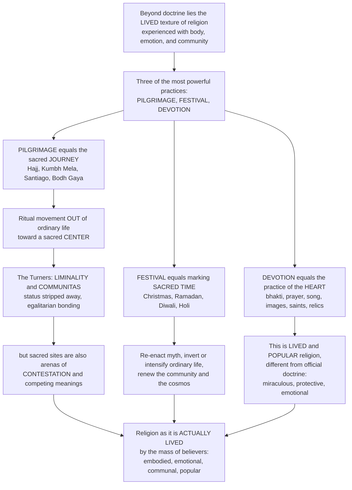

# 🕋 Pilgrimage, Festival and Devotion

> [!abstract] TL;DR
> If you study only creeds and theology, you miss what religion actually *is* for most people who have ever lived. Beyond private belief and formal doctrine lies the vibrant, **lived** texture of religion — the practices through which ordinary believers **express and experience** their faith with their **bodies, emotions, and communities**. Three of the most powerful are **pilgrimage**, **festival**, and **devotion**. **Pilgrimage** is the sacred **journey** that pulls millions out of ordinary life toward holy centers — Muslims to Mecca for the **Hajj**, Hindus to the Ganges and the **Kumbh Mela** (the largest human gatherings on Earth), Christians to Jerusalem, Rome, **Santiago**, and Lourdes, Buddhists to **Bodh Gaya** — which Victor and Edith **Turner** read as a great instance of **liminality** and **communitas** (the egalitarian bonding of status-stripped travelers), even as **Eade and Sallnow** show that pilgrimage sites are also **arenas of contestation**. **Festivals** mark **sacred time** — Christmas, Ramadan and Eid, Diwali, Holi, Passover, the Day of the Dead — re-enacting sacred history and **myth**, inverting or intensifying ordinary life, and renewing the community and cosmos. **Devotion** (Hindu **bhakti**, but universal) is the practice of the **heart** — prayer, song, images, saints, and relics — the core of **lived and popular religion**, often quite different from official doctrine and focused on the practical, miraculous, and protective. For most believers through history, religion has been less about assenting to creeds than about **journeying, celebrating, and loving the sacred with the whole person**.

---

## Intuition

**Analogy:** Imagine trying to understand *what football means to a city* by reading only the rulebook. You would learn the offside law and the points system — and understand almost nothing. To grasp what the game *is* for the people who love it, you have to watch the pilgrimage of fans to the stadium, feel the roar of the crowd on match day, and see the scarves, chants, and shrines to legendary players. The rulebook is the official doctrine; the *lived* reality is the journey, the festival, and the devotion. Religion is exactly like this. For centuries, scholars treated religion as if it *were* the rulebook — a set of beliefs and doctrines administered by theologians and clergy. But for the mass of believers across history, religion has been less about *assenting to propositions* and more about *doing things*: traveling to holy places, celebrating the great feasts, and pouring out love, song, and offerings before the sacred. This is **lived religion** or **popular religion** — the practical, embodied, emotional texture of faith as ordinary people actually practice it, often quite different from what the official theology says it should be.

Three of these lived practices are especially powerful, and each engages a different dimension of the person. **Pilgrimage** engages the *body in motion*: it is the sacred **journey**, the ritual of *movement* that takes you out of ordinary space and ordinary life and toward a sacred **center** — Mecca, the Ganges, Santiago, Bodh Gaya. Victor and Edith **Turner** saw pilgrimage as a magnificent example of **liminality** (the "betwixt-and-between" threshold state) and **communitas** (the intense, *egalitarian* bond that forms when pilgrims strip away their normal social status and become, on the road, simply fellow travelers) — though later scholars like **Eade and Sallnow** insisted that sacred sites are also *arenas of contestation*, where competing meanings and powers collide, not just havens of harmony. **Festival** engages *sacred time*: the great recurring celebrations — Christmas and Easter, Ramadan and the two Eids, Diwali and Holi, Passover, the Day of the Dead — that punctuate the religious calendar, re-enact sacred history and myth, *invert or intensify* ordinary life through feasting, fasting, and carnival, and renew the community's bonds and its cosmos. **Devotion** engages the *heart*: it is the emotional, loving, personal relationship with the divine — Hindu **bhakti** is the paradigm, but the pattern is universal — expressed through prayer, song and dance, offerings and vows, and the veneration of images, saints, and relics. To understand pilgrimage, festival, and devotion is to understand religion as it is genuinely **lived** by most believers: embodied, emotional, communal, and popular.

---

## How It Works

### Core mechanics

1. **The lived-religion shift.** Scholars like Robert **Orsi** (*The Madonna of 115th Street*) and Meredith **McGuire** (*Lived Religion*) moved the study of religion away from official, elite doctrine toward what ordinary people actually *do* — at home shrines, healing sites, street processions, and kitchen tables. The key distinction is between **official / normative** religion (theologians, clergy, scripture, correct belief) and **popular / vernacular / folk** religion (the practical, emotional, miraculous, and protective concerns of everyday believers). Foregrounding the latter corrects the **intellectualist bias** that reduces religion to creeds.

2. **Pilgrimage is ritual movement toward a center.** A pilgrimage takes the believer *out* of ordinary space and life and directs bodily movement toward a sacred **center** — a shrine, city, river, or mountain charged with holiness. The great examples channel astonishing masses of people: the **Hajj** to Mecca (up to ~2 million at once), the Hindu **Kumbh Mela** and *tirtha* to the Ganges and Varanasi (tens of millions — the largest human gatherings on Earth), Christian journeys to Jerusalem, Rome, **Santiago de Compostela**, Lourdes, and Fatima, and Buddhist travel to **Bodh Gaya** and Lhasa — plus countless *local* shrines. Sacred geography acts like a gravity field, concentrating movement at a few great centers with a long tail of minor sites.

3. **Two theories of pilgrimage.** Victor and Edith **Turner** argued that pilgrimage is **liminal** and **anti-structural**: pilgrims shed their ordinary rank and roles and form **communitas** — a spontaneous, egalitarian solidarity — echoing the liminal phase of a rite of passage. Against this harmonious picture, **John Eade and Michael Sallnow** (*Contesting the Sacred*) argued that a shrine is better seen as an *empty vessel* into which different groups pour *competing discourses* — a site of contestation, power, and negotiated meaning. Both are right about different pilgrimages, and often about the same one.

4. **Festival marks and renews sacred time.** Festivals are **calendrical rites** that punctuate ordinary time with periodic peaks of collective intensity. Their recurring functions include: *commemorating and re-enacting* sacred history and **myth**; the *periodic renewal* of the cosmos and community (Mircea **Eliade**); the alternation of **feasting and fasting**; **carnival** and ritual **reversal** — the temporary, licensed overturning of hierarchy that Mikhail Bakhtin called the "carnivalesque"; and Émile **Durkheim's** **collective effervescence**, the emotional charge of the assembled group that regenerates solidarity.

5. **Devotion is the practice of the heart.** Devotionalism is the *emotional, loving, personal* relationship with the divine. Hindu **bhakti** is the paradigm, but the pattern recurs everywhere — Christian and Sufi devotion, Pure Land Buddhism's loving trust in Amida. Its forms are embodied and sensory: prayer and worship, song and chant (kirtan, hymns, qawwali), dance, offerings and vows, the use and veneration of **images** (icons, *murtis*, statues — with recurrent **iconoclasm** disputes), the cults of **saints** (intercession, canonization) and **relics**, and shrines associated with **miracles** and **healing**. This is where the "little tradition" (Robert **Redfield**) of popular practice meets the "great tradition" of scripture — and where the boundary with **magic** (amulets, protection, luck, divination, spirit possession) becomes porous and contested.

### Flow



---

## Key Concepts

### Secondary (the core idea)

- **Religion is lived, not just believed.** For most people through history, religion has been less about *what you think* and more about *what you do* — journeying, celebrating, and loving the sacred with your whole body and heart. This everyday, popular practice is called **lived religion**.
- **Pilgrimage = the sacred journey.** A pilgrimage is a special *trip* to a holy place — Muslims to Mecca (the **Hajj**), Hindus to the Ganges (the **Kumbh Mela**, the biggest crowd on Earth), Christians to Santiago or Lourdes, Buddhists to Bodh Gaya. Leaving home and traveling *is itself* the ritual.
- **Festival = marking sacred time.** The big recurring celebrations — Christmas, Ramadan and Eid, Diwali, Holi, Passover — punctuate the year, retell sacred stories, and bring the community together with feasting, fasting, and joy.
- **Devotion = the practice of the heart.** Devotion is the *loving, emotional* side of religion: prayer, song, dance, offerings, and honoring holy images, saints, and relics. In India this loving devotion is called **bhakti**, but every tradition has it.
- **Official vs popular.** What the priests and theologians teach (official religion) is often quite different from what ordinary believers actually do (popular or folk religion), which cares more about healing, protection, and miracles.

### Undergraduate (theorists, structures, and debates)

- **The lived-religion approach.** **Robert Orsi** and **Meredith McGuire** reoriented the field from doctrine to *practice as ordinary people live it* — home altars, street processions, healing shrines, vows, and the "messy" everyday negotiation of the sacred. It corrects the belief-centric, Protestant-shaped bias in defining religion and exposes the gap between **normative** and **vernacular** religion.
- **The Turners on pilgrimage.** Victor and Edith **Turner** (*Image and Pilgrimage in Christian Culture*) treated pilgrimage as **liminal** and **anti-structural**: like the middle phase of a rite of passage, it strips pilgrims of ordinary status and generates **communitas** — spontaneous, egalitarian solidarity. Pilgrimage is the paradigmatic "**liminoid**" phenomenon of complex societies.
- **The contestation critique.** **Eade and Sallnow** (*Contesting the Sacred*) reject the harmony thesis: a shrine is a site where *competing* discourses, meanings, and powers collide — locals vs outsiders, official vs popular, rival factions. The same holy place can mean opposite things to different pilgrims. Modern study holds Turner and the contestation view in tension.
- **Festival functions and features.** Festivals *commemorate and re-enact* sacred **myth**; effect the *periodic renewal* of cosmos and community (**Eliade's** eternal return); orchestrate **feasting and fasting**; license **carnival** and ritual **reversal** (Bakhtin's carnivalesque — the temporary inversion of hierarchy); and manufacture Durkheimian **collective effervescence** and solidarity. They mark the rhythmic alternation of *sacred* and *ordinary* time.
- **Devotion across traditions.** **Bhakti** (loving devotion to a personal deity — Krishna, Rama, the Goddess) is the Hindu paradigm, historically a democratizing movement open to low castes and women. Its analogues: Christian devotionalism (the rosary, Sacred Heart, Marian piety), **Sufi** love-mysticism and *qawwali*, and **Pure Land** Buddhist reliance on Amida. Common forms: prayer, sacred **song** and chant, dance, offerings and vows, and the veneration of **images**, **saints**, and **relics**.
- **Popular religion and the miraculous.** Redfield's "**little tradition**" vs "**great tradition**"; popular religion's focus on the *practical and protective* (healing, fertility, luck, protection); the porous, contested boundary with **magic**, amulets, divination, and spirit possession; and the persistent tension between clerical orthodoxy and popular practice.

### Graduate (the deep debates)

- **Anti-structure vs contested field.** Is pilgrimage best modeled as Turnerian **communitas** (a temporary escape from social structure into egalitarian bonding) or as a **field of contestation** (Eade and Sallnow) where the sacred center is an "empty vessel" filled with rival meanings and asserted powers? The most sophisticated ethnography treats *both* as simultaneously true and analyzes the conditions under which each dominates.
- **The pilgrimage/tourism blur.** As mass tourism, heritage travel, and secular "pilgrimages" (Graceland, war memorials, Glastonbury, celebrity graves) proliferate, the analytic boundary between **pilgrim** and **tourist** dissolves. Scholars (e.g., the "sacred journey" literature) ask whether the difference lies in the traveler's *intention*, the site's *framing*, or nothing essential at all — extending Turner's liminality into secular modernity.
- **The political economy of the sacred.** Pilgrimage generates vast **economies** (the Hajj infrastructure, Kumbh logistics for tens of millions, shrine towns living on pilgrim trade) and is entangled with **state power** — regimes manage, fund, restrict, and instrumentalize pilgrimage and festival for legitimacy and control. Sacred geography is never politically neutral.
- **Agency in lived religion.** A central payoff of the lived-religion turn is recovering the **agency and meaning-making of the marginalized** — women, the poor, the colonized — for whom devotion, vows, healing shrines, and saint cults are often the primary, and sometimes the *only*, arena of religious authority and expression outside male, clerical, textual control.
- **Meaning, efficacy, and the body.** Devotional practice foregrounds *embodiment* and *affect* over cognition: what does it mean to say a relic *heals*, an image is *present*, a vow *works*? These questions connect popular religion to debates over ritual efficacy, the phenomenology of presence, and the anthropology of the senses — resisting reduction to symbolism or "mere" belief.

---

## Python Demo

```python
# Pilgrimage, Festival and Devotion -- four dramatizations of LIVED religion:
#   (a) PILGRIMAGE GRAVITY MODEL: pilgrims flow from many origin regions toward
#       a few sacred CENTERS. Flow scales with each center's "sacred pull" and
#       falls with distance/cost -> sacred geography channels mass movement.
#   (b) RANK-SIZE OF PILGRIMAGE SITES: the resulting attendance is heavily
#       concentrated -> a few great centers (Mecca/Kumbh) dwarf a long tail of
#       local shrines (a near power-law on a log-log plot).
#   (c) FESTIVAL CALENDAR / SACRED TIME: multiple traditions' festivals overlaid
#       as periodic peaks of collective intensity punctuating ordinary time.
#   (d) COMMUNITAS: pilgrims' social-status DISPERSION collapses during the
#       liminal journey (temporary egalitarian bonding), then re-stratifies.
import numpy as np
import matplotlib.pyplot as plt

rng = np.random.default_rng(7)

# ---------------------------------------------------------------------------
# (a)+(b) Pilgrimage gravity model over a stylized sacred geography
# ---------------------------------------------------------------------------
n_origins, n_centers = 400, 25
beta = 1.8                                   # distance-decay exponent (cost of travel)

origins = rng.uniform(0, 100, size=(n_origins, 2))
pops    = rng.lognormal(mean=1.0, sigma=0.6, size=n_origins)     # regional populations
centers = rng.uniform(0, 100, size=(n_centers, 2))
# "sacred pull": a few centers are overwhelmingly important, most are minor
pull    = rng.pareto(a=1.6, size=n_centers) + 0.15

# gravity flow T_ij = pop_i * pull_j / d_ij^beta, shared per origin (a choice model)
d = np.sqrt(((origins[:, None, :] - centers[None, :, :]) ** 2).sum(axis=2)) + 1.0
attract = pull[None, :] / d ** beta
shares  = attract / attract.sum(axis=1, keepdims=True)
flows   = pops[:, None] * shares                         # pilgrims from i to j
site_total = flows.sum(axis=0)                           # pilgrims received per center

order = np.argsort(site_total)[::-1]
ranked = site_total[order]
top = order[0]
print(f"Top center holds {100*ranked[0]/site_total.sum():4.1f}% of all pilgrims; "
      f"top 3 hold {100*ranked[:3].sum()/site_total.sum():4.1f}%")

# ---------------------------------------------------------------------------
# (c) Festival calendar: overlaid periodic peaks of ritual intensity
# ---------------------------------------------------------------------------
day = np.arange(1, 366)
def feast(center, width, height):            # a festival = Gaussian bump in the year
    return height * np.exp(-0.5 * ((day - center) / width) ** 2)

christian = feast(359, 5, 1.0) + feast(105, 6, 0.9)      # Christmas, Easter
islamic   = feast(80, 9, 1.0) + feast(112, 4, 0.8)       # Ramadan month, Eid
hindu     = feast(305, 6, 1.0) + feast(74, 4, 0.9)       # Diwali, Holi
jewish    = feast(105, 4, 0.7) + feast(268, 3, 0.7)      # Passover, Yom Kippur
total_intensity = christian + islamic + hindu + jewish

# ---------------------------------------------------------------------------
# (d) Communitas: status dispersion collapses in the liminal phase
# ---------------------------------------------------------------------------
phase = np.linspace(0, 1, 500)
n_pil = 40
base_status = rng.normal(0, 1, size=n_pil)   # normally stratified group

# liminal "levelling" factor: ~1 at home (full stratification), ~0 mid-journey
lim = 1.0 - 0.95 * np.exp(-0.5 * ((phase - 0.5) / 0.16) ** 2)
trajectories = base_status[:, None] * lim[None, :]       # each pilgrim's effective status
dispersion = trajectories.std(axis=0)                    # group status spread

# ---------------------------------------------------------------------------
# Plot
# ---------------------------------------------------------------------------
fig, ax = plt.subplots(2, 2, figsize=(15, 11))

# (a) gravity flow map
ax0 = ax[0, 0]
ax0.scatter(origins[:, 0], origins[:, 1], s=8, color="lightsteelblue",
            label="Origin regions", zorder=2)
for j in range(n_centers):                                # strongest flows to top center
    if order.tolist().index(j) < 3:
        for i in range(n_origins):
            if flows[i, j] > 0.02 * flows.max():
                ax0.plot([origins[i, 0], centers[j, 0]], [origins[i, 1], centers[j, 1]],
                         color="tomato", alpha=0.05, lw=0.6, zorder=1)
ax0.scatter(centers[:, 0], centers[:, 1], s=40 + 900 * site_total / site_total.max(),
            color="crimson", edgecolor="black", alpha=0.8, label="Sacred centers", zorder=3)
ax0.scatter(centers[top, 0], centers[top, 1], s=60, marker="*", color="gold",
            edgecolor="black", zorder=4, label="Greatest center")
ax0.set_title("(a) Pilgrimage gravity model:\nsacred geography channels mass movement to a few centers", fontsize=10)
ax0.set_xlabel("space x"); ax0.set_ylabel("space y"); ax0.legend(fontsize=7, loc="upper right")

# (b) rank-size distribution
ax1 = ax[0, 1]
ax1.loglog(np.arange(1, n_centers + 1), ranked, "o-", color="darkred")
ax1.set_title("(b) Rank-size of pilgrimage sites:\nfew great centers, a long tail of local shrines", fontsize=10)
ax1.set_xlabel("Site rank (log)"); ax1.set_ylabel("Pilgrims received (log)")
ax1.grid(True, which="both", ls=":", alpha=0.4)

# (c) festival calendar
ax2 = ax[1, 0]
ax2.fill_between(day, total_intensity, color="gold", alpha=0.35, label="Combined sacred-time intensity")
ax2.plot(day, christian, lw=1.4, label="Christian (Christmas, Easter)")
ax2.plot(day, islamic,   lw=1.4, label="Islamic (Ramadan, Eid)")
ax2.plot(day, hindu,     lw=1.4, label="Hindu (Diwali, Holi)")
ax2.plot(day, jewish,    lw=1.4, label="Jewish (Passover, Yom Kippur)")
ax2.set_title("(c) Festival calendar: periodic peaks of collective intensity\npunctuate ordinary time across the year", fontsize=10)
ax2.set_xlabel("Day of year"); ax2.set_ylabel("Ritual intensity"); ax2.legend(fontsize=7, loc="upper center")

# (d) communitas: status dispersion collapse
ax3 = ax[1, 1]
for k in range(n_pil):
    ax3.plot(phase, trajectories[k], color="gray", alpha=0.25, lw=0.7)
ax3.plot(phase, dispersion, color="navy", lw=2.6, label="Status dispersion (std)")
ax3.axvspan(0.3, 0.7, color="gold", alpha=0.2, label="Liminal journey")
ax3.set_title("(d) Communitas: status dispersion COLLAPSES on the journey,\nthen re-stratifies on return", fontsize=10)
ax3.set_xlabel("Pilgrimage progress (home -> sacred center -> home)")
ax3.set_ylabel("Effective social status"); ax3.legend(fontsize=8, loc="upper right")

plt.tight_layout()
plt.savefig("pilgrimage_festival_and_devotion.png", dpi=120, bbox_inches="tight")
plt.show()
```

**What it shows.** Panel (a): treating each holy site's *sacred pull* like mass and each journey's *cost* like distance, a simple **gravity model** reproduces the real signature of sacred geography — pilgrims from hundreds of scattered origins are funneled onto a handful of great **centers** (the red flow-lines converge on the gold star), exactly as billions of journeys concentrate on Mecca, the Ganges, and Santiago. Panel (b): plotting the resulting attendance by rank on log-log axes yields a steep, near-**power-law** curve — a few dominant sites dwarf a long tail of local shrines (the printed figures show the top center alone capturing a large share of all pilgrims). Panel (c): overlaying four traditions' festivals renders **sacred time** as *rhythm* — the year is not flat but studded with recurring peaks of collective intensity (the gold envelope) that periodically lift the community out of ordinary time. Panel (d): as a normally *stratified* group of pilgrims enters the shaded **liminal** phase of the journey, the spread of their social status **collapses toward zero** — Turner's **communitas**, the temporary egalitarian bonding of status-stripped travelers — before re-stratifying when they return home. Together the four panels model religion as it is *lived*: mass movement toward the sacred, the concentration and rhythm of holy places and holy days, and the leveling intensity of the shared journey.

---

## Real-World Applications

> **Example — the Hajj as liminality, communitas, and contestation at once:** During the Hajj, roughly two million Muslims from every nation converge on Mecca. Pilgrims shed ordinary markers of wealth and rank and don the **ihram** — two plain white unstitched cloths that make a king indistinguishable from a laborer. This is Turner's **communitas** engineered in fabric: a deliberately *anti-structural*, egalitarian brotherhood of the status-stripped, exactly the collapse modeled in panel (d). The rites re-enact sacred **narrative** (Hagar's search for water in the *sa'y*, Abraham's trial in the stoning of the pillars), binding embodied movement to myth. Yet the Hajj is also **contested** and deeply **political** (Eade and Sallnow): the Saudi state administers, funds, polices, and controls access through quotas and infrastructure, and the pilgrimage is an arena of vast **economy** and competing meanings — precisely the gravity-fed concentration of panels (a) and (b).

- **Managing mega-gatherings.** The **Kumbh Mela** draws tens of millions to the Ganges in a matter of weeks — a logistics, public-health, and crowd-dynamics challenge studied by urban planners and epidemiologists as a recurring, predictable *pulse* of sacred time (panel c) and spatial concentration (panels a–b).
- **Heritage, tourism, and the pilgrim/tourist blur.** The revival of the **Camino de Santiago**, and secular "pilgrimages" to Graceland, war memorials, and celebrity graves, are analyzed with Turnerian tools; the tourism industry designs "authentic journeys" that trade on liminality and communitas.
- **Recovering marginalized voices.** Historians and anthropologists use the **lived-religion** lens (Orsi, McGuire) to study home altars, saint cults, healing shrines, and vows — arenas where women, the poor, and the colonized exercised religious agency largely invisible in official, clerical, textual sources.
- **Festival, identity, and the state.** Governments and diasporas mobilize **Diwali**, **Eid**, Christmas markets, and the **Day of the Dead** for civic identity, tourism, and soft power — festivals as engines of solidarity and belonging well beyond the temple.
- **Devotional media and music.** The global circulation of **qawwali**, **kirtan**, gospel, and Marian devotions shows devotion's embodied, affective core traveling through **sacred music** and imagery — popular piety as a living, transmissible practice.

---

## Common Pitfalls

- **The intellectualist / belief-centric bias.** Assuming religion is *essentially* creeds and doctrine — a post-Reformation, Protestant-shaped template — makes you miss what most believers actually do. Start from practice: the journey, the feast, the vow, the song.
- **Romanticizing communitas.** Turner's egalitarian bonding is real but partial. Treating every pilgrimage as harmonious solidarity ignores **Eade and Sallnow**: shrines are also arenas of *contestation*, hierarchy, commerce, and power. Hold both models together.
- **Dismissing popular religion as "superstition."** Labeling healing shrines, saint cults, amulets, and vows as debased or "not real religion" reproduces the very clerical, elite bias the lived-religion approach exists to correct. For most believers, *this is* religion.
- **Collapsing pilgrim into tourist (or rigidly separating them).** Both the naive "pilgrims are pure, tourists are profane" split and the cynical "it's all just tourism" flattening miss the point; the interesting work is on the *blur* and the conditions that tip one into the other.
- **Reading festivals as mere entertainment.** Feasting, fasting, and carnival are not decoration; they *renew the cosmos and community*, re-enact myth, and (in the carnivalesque) *invert* hierarchy in socially meaningful ways. Missing the sacred-time function trivializes them.
- **Treating devotion as watered-down theology.** Bhakti, Marian piety, and Sufi love-mysticism are not simplified doctrine for the masses; devotion is a distinct, embodied, *affective* mode of relating to the sacred with its own logic of presence, image, and intercession.

---

## Related Concepts

- [[Defining_Religion_and_the_Sacred]] — the belief-vs-practice problem and the sacred/profane distinction this note answers by foregrounding lived, popular practice.
- [[Methods_in_the_Study_of_Religion]] — the "lived religion" approach of Orsi and McGuire as a method for studying religion from below rather than from doctrine.
- [[Phenomenology_of_Religion]] — Eliade's sacred space, sacred time, and the "center," the experiential frame that pilgrimage and festival enact.
- [[The_Comparative_Study_of_Religion]] — pilgrimage, festival, and devotion as recurring cross-cultural patterns the comparative method sets side by side.
- [[Islam_and_the_Islamic_Tradition]] — the Hajj to Mecca and the two Eids as central pillars of Islamic lived practice.
- [[Hinduism_and_the_Dharmic_Traditions]] — bhakti devotion, the Kumbh Mela and tirtha pilgrimage, murti worship, and Diwali and Holi.
- [[Judaism_and_the_Covenant_Tradition]] — Passover, Yom Kippur, and the pilgrimage-festival structure of the Jewish sacred calendar.
- [[Christianity_and_the_Christian_Traditions]] — Christmas and Easter, saint and relic cults, Marian devotion, and pilgrimage to Jerusalem, Rome, and Santiago.
- [[Buddhism_and_the_Path_to_Liberation]] — pilgrimage to Bodh Gaya and Pure Land devotional trust in Amida.
- [[Religion_Magic_and_Ritual]] — the anthropology-of-religion companion: rites of passage, the magic/religion boundary, and popular practice; the closest cross-vault note.
- [[Religion_Sacred_and_Secular]] — the sociology of collective effervescence, civil religion, and secular festival and pilgrimage.
- [[Collective_Behavior_and_Crowds]] — the crowd dynamics and synchronized-assembly effects underlying festival effervescence and mega-pilgrimage.
- [[Functions_of_Myth]] — the sacred narratives that festivals commemorate and re-enact, viewed from the mythology side.
- [[Music_Cognition_and_Emotion]] — why devotional song and chant (kirtan, hymns, qawwali) move the emotions so powerfully.

*Sibling notes in this section (Ritual, Myth, and the Sacred) develop adjacent threads prose-first: Ritual_and_Religious_Practice supplies the liminality-and-communitas machinery this note applies to journeys and feasts; Sacred_Symbols_Space_and_Time examines the hierophanic centers and sacred time that pilgrimage and festival move through; Myth_and_Sacred_Narrative treats the stories festivals re-enact; Religious_Experience_and_Mysticism explores the inner states devotion can trigger; Religion_and_Social_Order follows the Durkheimian binding function into institutions; Religion_Gender_and_Sexuality examines how devotion and popular piety became arenas of agency for women and the marginalized; and Religious_Studies_and_Comparative_Religion_Overview frames the whole field.*

---

## Review Questions

**Secondary.** What is the difference between studying a religion's official *beliefs* and studying how ordinary people actually *live* it? Give one example each of a pilgrimage, a festival, and a form of devotion, and explain what "sacred journey" means.

**Undergraduate.** Explain the Turners' concepts of *liminality* and *communitas* and apply them to a real pilgrimage such as the Hajj or the Camino de Santiago. Then state Eade and Sallnow's *contestation* critique and explain what it captures that the communitas model misses. Separately, list three recurring *functions* of festivals and connect one of them to Durkheim or Eliade.

**Graduate.** The "lived religion" approach (Orsi, McGuire) claims that foregrounding popular, embodied, everyday practice corrects an intellectualist bias in the study of religion. Reconstruct this argument, relate it to the "little" vs "great" tradition distinction (Redfield) and the porous boundary between religion and magic, and assess: does centering pilgrimage, festival, and devotion give us a *truer* picture of religion than centering doctrine — or does it simply substitute one partial lens for another? Use the pilgrim/tourist blur and the agency of the marginalized in your answer.

---

## Sources

- [Victor Turner and Edith Turner, *Image and Pilgrimage in Christian Culture* (1978)](https://en.wikipedia.org/wiki/Victor_Turner)
- [John Eade and Michael Sallnow, *Contesting the Sacred: The Anthropology of Christian Pilgrimage* (1991)](https://en.wikipedia.org/wiki/Pilgrimage)
- [Robert A. Orsi, *The Madonna of 115th Street: Faith and Community in Italian Harlem* (1985)](https://en.wikipedia.org/wiki/Robert_A._Orsi)
- [Mircea Eliade, *The Sacred and the Profane: The Nature of Religion* (1957)](https://en.wikipedia.org/wiki/The_Sacred_and_the_Profane)
- [Meredith B. McGuire, *Lived Religion: Faith and Practice in Everyday Life* (2008)](https://en.wikipedia.org/wiki/Lived_religion)

---

#religious-studies #pilgrimage #festival #devotion #lived-religion
