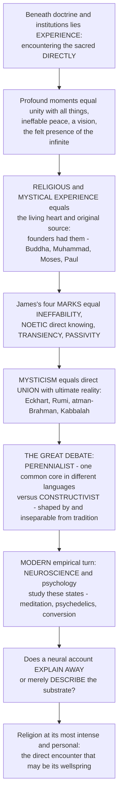

# 🕉️ Religious Experience and Mysticism

> [!abstract] TL;DR
> At the white-hot core of religion, beneath the doctrines and institutions, lies something more immediate: **experience** — the felt sense of encountering the sacred, the divine, the ultimate, **directly**. People across every tradition report profound, transformative moments: a sudden overwhelming sense of **unity** with all things, an ineffable peace, a vision, a voice, the felt presence of something infinitely greater, of dissolving into the divine. These **religious** and **mystical experiences** are, for many, the living heart and original source of religion — the founders had them (the Buddha's enlightenment, Muhammad's revelation, Moses at the burning bush, Paul on the Damascus road), and traditions are in part attempts to institutionalize and transmit them. **William James**, in *The Varieties of Religious Experience* (1902), identified four common **marks** of mystical states: **ineffability** (it defies description), a **noetic** quality (it feels like a direct *knowing* of deep truth), **transiency** (it does not last), and **passivity** (it feels received, not willed). **Mysticism** proper is the pursuit of, and experience of, **direct union** or communion with ultimate reality — the Christian mystics (Eckhart, Teresa of Ávila), the Sufis of Islam (Rumi, al-Hallaj — *fana*, annihilation in God), the Hindu realization of *atman–Brahman* unity, Buddhist enlightenment, Jewish Kabbalah. A central scholarly debate runs through the field: are all these experiences fundamentally **the same** underlying reality described in different cultural languages (the **perennialist** view — a common mystical core), or are they **constructed** by and inseparable from the mystic's tradition, so that a Buddhist and a Christian have genuinely **different** experiences shaped by their concepts (the **constructivist** view of Steven Katz)? And modern **neuroscience** and psychology now study these states empirically — the "neurotheology" of meditation, the reliable occasioning of mystical-type experience by psychedelics, the default-mode network and ego-dissolution — raising the sharp question of whether a neural explanation **explains away** the experience or merely **describes its substrate**. Religious experience and mysticism are religion at its most intense and personal: the direct encounter with the sacred that may be its very wellspring.

---

## Intuition

**Analogy:** Imagine trying to understand *love* by studying only marriage certificates, wedding customs, and legal contracts. You would learn a great deal about the *institutions* that surround love — and miss the thing itself: the overwhelming, world-reorganizing *experience* of falling in love, which no certificate captures and which the institutions exist to channel and preserve. Now imagine that some people, in rare moments, report an experience like falling in love but aimed at *everything at once* — a sudden collapse of the boundary between themselves and the whole of reality, a flooding certainty that "all is one" and "all is well," so overwhelming and so obviously *true-feeling* that it reorganizes the rest of their lives. They insist it cannot be put into words, that it felt like *knowing* rather than merely feeling, that it came and went in minutes, and that it happened *to* them rather than being something they did.

That is **religious and mystical experience**, and it stands to religion roughly as falling in love stands to marriage. Beneath the creeds, the clergy, and the calendars lies this immediate encounter with the sacred, the divine, or the ultimate — and many scholars and believers regard it as the **living heart and original source** of religion itself, since the founders from the Buddha to Muhammad, Moses, and Paul had exactly such foundational experiences, and the traditions are in large part machinery built to institutionalize and transmit them. This note asks the two questions that have organized the entire field: **what are these experiences like** (William James's marks — ineffability, the noetic quality, transiency, passivity — and the mystical quest for direct **union** across traditions), and **what are they** — one universal reality wearing different cultural costumes (**perennialism**), or genuinely different experiences each stitched together out of a tradition's own concepts (**constructivism**) — with modern **neuroscience** now adding a third, unsettling voice: whether a brain-based account of these states *dissolves* their authority or merely *describes the machinery* through which they occur.

---

## How It Works

Religious experience and mysticism are organized by four moves: the **claim** that experience is the wellspring of religion (Schleiermacher, the founders' foundational experiences); the **description** of what mystical states are like (James's four marks; types from the numinous to the unitive); the **mystical quest** for direct union across traditions (Christian, Sufi, Hindu, Buddhist, Kabbalist); and the **two great modern debates** — perennialism versus constructivism about the *nature* of these experiences, and the naturalistic study (neurotheology, psychedelics) about their *substrate* and whether it "explains away" the encounter. The diagram traces that logic from the immediate encounter down to the modern empirical turn.



**The core mechanics of the field:**

1. **Take experience as the datum.** Following Friedrich Schleiermacher — who located the essence of religion not in doctrine or morality but in a pre-reflective **"feeling of absolute dependence"** — and Ninian Smart's naming of the **experiential dimension** as one of religion's basic dimensions, this approach treats the believer's *first-person experience* of the sacred as the primary reality to be understood, prior to the theology that interprets it.
2. **Anchor it in the founders.** The great traditions each rest on a **foundational experience**: the Buddha's *enlightenment* under the Bodhi tree, Muhammad's *revelation* on Mount Hira, Moses at the *burning bush* (theophany), Paul's *conversion* on the Damascus road. On this reading, institutions are downstream — attempts to *institutionalize and transmit* an originating encounter.
3. **Describe the varieties and their marks.** Following William James's pragmatic, empirical method — judging experiences by their **fruits** (their effects on a life) rather than their **roots** (their causes) — catalogue the **types** (numinous, unitive/mystical, visionary, conversion, prophetic, ecstatic, devotional) and identify the recurring **four marks** of mystical states: *ineffability*, *noetic quality*, *transiency*, *passivity*.
4. **Follow the mystical path to union.** **Mysticism** proper is the disciplined pursuit of **direct union** with the ultimate. Map its two great forms (theistic *love-union* with a personal God vs monistic *identity* with an impersonal absolute), its classic stages (*purgation → illumination → union*, with John of the Cross's "dark night"), and its expression across every tradition.
5. **Adjudicate nature and substrate.** Run the two modern debates: **perennialism vs constructivism** (is there a common cross-cultural core, or is all experience tradition-mediated?), and the **scientific turn** (psychology, neurotheology, psychedelics) — culminating in the **"explaining-away"** question of whether a naturalistic account *reduces* the experience or merely *describes* its biological substrate.

---

## Key Concepts

### 🟢 Secondary — the basic idea

- **Religious experience is the *felt* side of religion.** Beneath beliefs and rituals lies the direct sense of *encountering* the sacred — an experience believers interpret as meeting God, the divine, or ultimate reality. For many, this is the real heart of religion; the rest grows up around it.
- **The founders had these experiences.** The Buddha's enlightenment, Muhammad's revelation, Moses at the burning bush, Paul's blinding conversion — each tradition begins with an overwhelming, life-changing encounter. The religion is, in part, an attempt to keep that encounter alive and pass it on.
- **William James's four marks of a mystical state.** In *The Varieties of Religious Experience*, James said mystical experiences share four features: **ineffability** (you cannot put it into words), **noetic quality** (it feels like *knowing* a deep truth, not just feeling an emotion), **transiency** (it is brief — it fades), and **passivity** (it feels like it happens *to* you, not something you make happen).
- **Mysticism is the search for direct union.** A **mystic** is someone who seeks not just to *believe in* the ultimate but to *directly experience union* with it — to merge with, or dissolve into, the divine. Mystics appear in every religion.
- **The numinous.** The distinctive feeling of standing before the holy — something **wholly other**, at once awe-full and terrifying yet fascinating and magnetic (Rudolf Otto's *mysterium tremendum et fascinans*, developed in the sibling note *Phenomenology of Religion*).

### 🟡 Undergraduate — the varieties, the quest, and the great debate

- **The experiential dimension (Schleiermacher, Smart).** Friedrich Schleiermacher relocated religion's essence to a pre-conceptual **feeling** — the *"feeling of absolute dependence"* (*schlechthinnige Abhängigkeit*) — making experience, not doctrine, foundational. Ninian Smart's **seven dimensions** of religion include the **experiential/emotional** dimension precisely to keep this first-person reality in view. This is the wellspring thesis: experience is the *source*, doctrine the *sediment*.
- **A typology of religious experience.**
  - **Numinous** (Otto) — awe before the *wholly other*; the *mysterium tremendum et fascinans*.
  - **Mystical / unitive** — the collapse of subject–object duality; oneness, union, identity.
  - **Conversion** — sudden or gradual reorientation of the self (James's "twice-born" transformation).
  - **Visionary / auditory** — visions and voices; revelations, apparitions.
  - **Prophetic** — the sense of being *called*, addressed, commissioned.
  - **Ecstatic / possession** — trance, spirit-possession, glossolalia.
  - **Devotional / everyday** — the ordinary felt sense of grace, presence, or answered prayer.
- **William James and the pragmatic study of experience.** James's *Varieties* (his 1901–02 Gifford Lectures) is the founding text of the **psychology of religion**. His moves: study experience by its **fruits, not its roots** (a state's value is not settled by its cause — the "medical materialism" that dismisses a vision as "just" epilepsy commits a genetic fallacy); distinguish the **healthy-minded** ("once-born") from the **"sick soul"** who must be **"twice-born"** through conversion; and prioritize **personal experience** over institutional religion ("the feelings, acts, and experiences of individual men in their solitude"). The **four marks** — ineffability, noetic quality, transiency, passivity — remain the standard checklist.
- **Mysticism: the quest for union.** Two broad forms (with Walter **Stace**'s influential distinction):
  - **Extrovertive** mysticism — perceiving the *One* shining *through* the multiplicity of the outer world (unity *in* nature and things).
  - **Introvertive** mysticism — turning *inward* to a *pure consciousness event*, empty of all content, where the self dissolves into undifferentiated unity. Stace regarded this as the deeper, more universal form.
  - **Theistic (love-mysticism)** — union *with* a personal God, preserving a lover/beloved distinction (much Christian and Sufi mysticism) — vs **monistic (identity)** — total identity with an impersonal absolute (Advaita's *atman = Brahman*).
  - **The mystical path** — the classic threefold ascent: **purgation → illumination → union**, including John of the Cross's **"dark night of the soul,"** the desolation that precedes union.
- **Mysticism across the traditions.**
  - **Christian** — Pseudo-Dionysius and the **apophatic** *via negativa* (knowing God by negation); Meister **Eckhart** (the "birth of God in the soul," the *Godhead* beyond God); **Teresa of Ávila** (*The Interior Castle*) and **John of the Cross**.
  - **Islamic Sufism** — **fana** (annihilation of the self in God) and **baqa** (subsistence in God); **Rumi**'s love-poetry, **Ibn Arabi**'s "unity of being" (*wahdat al-wujud*), and **al-Hallaj**'s scandalous "*Ana al-Haqq*" — "I am the Truth."
  - **Hindu** — the realization that *atman* (the self) *is* **Brahman** (ultimate reality); the states of **samadhi** in yoga.
  - **Buddhist** — **nirvana** and enlightenment; the meditative absorptions (**jhana / dhyana**); the dissolution of the illusion of a separate self (*anatta*).
  - **Jewish** — **Kabbalah** (the *Ein Sof*, the *sefirot*, *devekut* or "cleaving" to God) and **Hasidism**; alongside **Daoist** mysticism (union with the *Dao*).
- **The perennialism vs constructivism debate (the field's central controversy).**
  - **Perennialism / essentialism** (Aldous **Huxley**'s *The Perennial Philosophy*, Walter **Stace**, Robert **Forman**) — beneath the doctrinal surface lies a single, cross-cultural, **culture-transcending mystical core** (paradigmatically the introvertive *pure consciousness event*), which each tradition then *interprets* in its own vocabulary. Slogan: **"many paths, one summit."**
  - **Constructivism / contextualism** (Steven **Katz**, "Language, Epistemology, and Mysticism," 1978) — **"there are NO pure (i.e. unmediated) experiences."** All experience is **shaped and constructed** by the mystic's prior **concepts, language, expectations, and training**; a Buddhist seeking empty *nirvana* and a Christian seeking loving union with a personal God therefore have genuinely **different** experiences, not one experience differently described. Tradition goes *all the way down*.

### 🔴 Graduate — the empirical turn and the "explaining-away" problem

- **The psychology of religious experience.** Beyond James, a measurement and theory tradition: **Ralph Hood's Mysticism Scale (M-Scale)**, built directly on Stace's categories, operationalizes mystical experience for empirical study; **conversion theory** (sudden vs gradual, and the "active convert" critique of purely passive models); **deprivation** and compensation theories; and **attachment theory** applied to religion (God as an attachment figure; "correspondence" vs "compensation" pathways — see the cross-vault link on *Attachment_Theory*). Debates persist over whether the M-Scale's apparent cross-cultural fit *supports* perennialism or merely **imports** a Stace-shaped grid onto diverse reports (a constructivist rejoinder about measurement).
- **The neuroscience of mystical states — "neurotheology."** Andrew **Newberg** and Eugene d'Aquili's SPECT studies of meditating monks and praying nuns reported decreased activity in the **superior parietal lobule** (the orientation-association area), correlated with the felt **loss of the self–world boundary** — a candidate neural signature of *unitive* experience. Related strands: the **temporal-lobe** hypothesis and Michael Persinger's contested "God helmet"; the popular but oversold search for a single **"God spot"** (there is none — religious experience recruits *distributed* networks); and, in the psychedelic literature, **default-mode network (DMN)** hypofunction correlated with **ego-dissolution**. See the cross-vault notes on *Consciousness_and_Neural_Correlates* and *Consciousness_and_Awareness*.
- **Psychedelics and the reliable occasioning of mystical experience.** The **Good Friday Experiment** (Walter Pahnke, 1962) and its 25-year follow-up (Rick Doblin), then the **Johns Hopkins** trials (Roland **Griffiths** et al., 2006 onward), showed that **psilocybin** can *reliably occasion* experiences that score as "**complete**" mystical experiences on validated scales, with participants rating them among the most personally and spiritually significant events of their lives — and with durable increases in wellbeing and openness (see *States_of_Consciousness* and *Happiness_and_Wellbeing*). This is the empirical spearhead of the whole field: a *dose* of a molecule can, above a threshold and with the right **set and setting**, produce the phenomenology James catalogued.
- **The "explaining-away" problem (the crux).** If a mystical state has a **neural correlate** or can be **pharmacologically induced**, does that *debunk* it? Two positions:
  - **Reductive / debunking** — a natural cause shows the experience is "nothing but" brain chemistry; its claim to reveal a transcendent reality is undermined (a **genetic-fallacy**-adjacent inference: explain the cause, dissolve the authority).
  - **Non-reductive / compatibilist** — a neural or chemical *substrate* is exactly what you'd expect *whether or not* the experience is **veridical**; describing the machinery of perception does not settle whether it perceives something real (you can give a full neuroscience of *seeing a tree* without the tree becoming an illusion). This routes directly into the **epistemology of religious experience** (see *Faith_and_Reason*): does mystical experience provide *evidence* — William Alston's "doxastic practice" and the **principle of credulity** (Richard Swinburne: absent defeaters, seemings are evidence) — or is it defeated by disagreement, unreliability, and naturalistic explanation? And it touches the **hard problem** (see *Consciousness_and_the_Hard_Problem*): explaining the neural *correlates* of a state is not obviously the same as explaining its felt *quality* or its *object*.
- **Attributionist and mediating positions.** Between strict perennialism and strict constructivism sit **attribution** theories (Ann Taves' *"religious experience reconsidered"* — start from ordinary "**experiences deemed religious**" and study how a *religious* label gets **attributed** to them, dissolving the assumption of a special *sui generis* faculty) and **common-core-with-mediation** views (a shared physiological/phenomenological substrate that is *then* interpreted through tradition — conceding Katz's point about interpretation while preserving a thinner core). The debate maps onto whether **language and concepts precede and shape** perception or merely **label** a pre-given experience.
- **Why the perennialism/constructivism debate is not idle.** It decides whether comparative mysticism is a science of one **human universal** wearing local costumes, or a study of **irreducibly plural** phenomena — and whether the psychedelic "mystical-type experience," which is *deliberately elicited outside any tradition*, counts as evidence *for* a tradition-independent core (a strong perennialist card) or is itself an experience shaped by the modern, medicalized set and setting in which it occurs (the constructivist reply).

---

## Python Demo

```python
# Religious experience & mysticism in three pictures:
#   (1) PERENNIALIST vs CONSTRUCTIVIST clustering.
#       Represent many reported mystical experiences as feature vectors
#       (unity, loss-of-self, timelessness, ineffability, noetic, and a
#        personal-God-vs-impersonal-absolute axis), each TAGGED by tradition.
#       PERENNIALIST prediction: experiences share a common CORE regardless of
#         tradition (they overlap on the unitive axis -> "many paths, one summit").
#       CONSTRUCTIVIST prediction: experiences SPLIT by tradition on the
#         interpretive overlay (personal God vs impersonal absolute).
#       The plot shows BOTH: a shared unitive core PLUS a tradition-shaped overlay.
#   (2) JAMES's FOUR MARKS across experience TYPES
#       (ineffability, noetic, transiency, passivity).
#   (3) DOSE-RESPONSE: probability of a "COMPLETE" mystical-type experience
#       vs practice/dose (meditation depth or psilocybin dose), with a threshold
#       and the effect of set-and-setting -- the reliable OCCASIONING of the state.
# All figures are conceptual teaching heuristics, not empirical measurements.

import numpy as np
import matplotlib
matplotlib.use("Agg")
import matplotlib.pyplot as plt

rng = np.random.default_rng(11)

# ======================================================================
# (1) PERENNIALIST vs CONSTRUCTIVIST clustering
# ======================================================================
# 6 features; the first 5 are the shared UNITIVE CORE (high for ALL mystical
# experiences); the 6th, personal_God, is the tradition-shaped INTERPRETIVE
# OVERLAY (high for theistic traditions, low for monistic/non-theistic ones).
core_means = np.array([9.0, 8.5, 8.0, 9.0, 8.5])  # unity, loss_of_self, timelessness, ineffab, noetic

def make_tradition(personal_god_mean, n):
    core = rng.normal(core_means, 0.65, size=(n, 5))         # shared high core
    pg   = rng.normal(personal_god_mean, 0.75, size=(n, 1))  # tradition overlay
    X = np.clip(np.hstack([core, pg]), 0, 10)
    return X

n = 32
X_christ = make_tradition(8.3, n)   # theistic love-union -> HIGH personal God
X_sufi   = make_tradition(8.0, n)   # theistic (fana in God)
X_advaita= make_tradition(2.2, n)   # monistic identity -> LOW (impersonal absolute)
X_buddh  = make_tradition(1.7, n)   # non-theistic (empty of a personal God)

traditions = ["Christian", "Sufi", "Advaita Hindu", "Buddhist"]
colors     = ["#dc2626", "#b45309", "#2563eb", "#16a34a"]
blocks     = [X_christ, X_sufi, X_advaita, X_buddh]

# Two interpretable axes:
#   x = shared UNITIVE-CORE score (mean of the 5 core features)  -> perennialist test
#   y = PERSONAL-God vs IMPERSONAL-absolute (the overlay)        -> constructivist test
def core_score(X):     return X[:, :5].mean(axis=1)
def personal_axis(X):  return X[:, 5]

# Simple adjudication printed to console: within-tradition vs within-"core-type"
# spread on each axis (which grouping is tighter tells us what structure dominates).
all_core = np.concatenate([core_score(B) for B in blocks])
all_pers = np.concatenate([personal_axis(B) for B in blocks])
print("=" * 66)
print("PERENNIALIST vs CONSTRUCTIVIST -- what does the data cluster by?")
print("=" * 66)
print(f"UNITIVE-CORE axis: overall spread (std) = {all_core.std():4.2f}"
      f"   -> ALL traditions bunch high  => shared core (perennialist)")
print(f"PERSONAL-God axis: overall spread (std) = {all_pers.std():4.2f}"
      f"   -> splits theistic vs monistic => overlay (constructivist)")
print("Conclusion: a common unitive CORE + a tradition-shaped interpretive OVERLAY.")

# ======================================================================
# (2) JAMES's FOUR MARKS across experience types (0..1 intensity)
# ======================================================================
marks = ["Ineffability", "Noetic", "Transiency", "Passivity"]
profiles = {
    "Everyday devotional": [0.30, 0.35, 0.55, 0.40],
    "Numinous / awe":      [0.70, 0.60, 0.80, 0.75],
    "Unitive / mystical":  [0.95, 0.90, 0.85, 0.90],
}
ptypes = list(profiles.keys())
pcols  = ["#9ca3af", "#7c3aed", "#dc2626"]

# ======================================================================
# (3) DOSE-RESPONSE: P(complete mystical-type experience) vs dose
# ======================================================================
dose = np.linspace(0, 40, 400)   # e.g. psilocybin mg/70kg, or meditation "depth"
def logistic(x, x50, k):         # probability of a COMPLETE mystical experience
    return 1.0 / (1.0 + np.exp(-k * (x - x50)))
p_supported   = logistic(dose, x50=20, k=0.45)   # optimal set & setting
p_unsupported = logistic(dose, x50=30, k=0.30)   # poor set & setting -> shifted right
threshold = 20

# ======================================================================
# Plot
# ======================================================================
fig = plt.figure(figsize=(16, 5.4))

# ---- (1) clustering: unitive core vs personal/impersonal overlay ------
ax1 = fig.add_subplot(1, 3, 1)
for name, B, c in zip(traditions, blocks, colors):
    ax1.scatter(core_score(B), personal_axis(B), s=34, c=c, alpha=0.8,
                edgecolors="k", linewidths=0.3, label=name)
ax1.axvspan(7.5, 10, color="#111827", alpha=0.06)                 # shared-core band
ax1.axhline(5, color="k", lw=0.7, alpha=0.4, ls="--")
ax1.text(8.75, 9.4, "PERENNIALIST core:\nall traditions bunch high\n(many paths, one summit)",
         ha="center", fontsize=7.2, color="#111827")
ax1.annotate("CONSTRUCTIVIST\noverlay:\ntheistic vs monistic\nsplit here",
             xy=(6.2, 5), xytext=(4.4, 5), fontsize=7.2, va="center",
             color="#111827",
             arrowprops=dict(arrowstyle="<->", color="#111827", lw=1.0))
ax1.set_xlabel("shared UNITIVE-CORE score\n(unity, self-loss, timelessness, ineffab, noetic)")
ax1.set_ylabel("personal God  <-->  impersonal absolute")
ax1.set_title("(1) Perennialist core + constructivist overlay", fontsize=10)
ax1.set_xlim(3.5, 10.2); ax1.set_ylim(0, 10.2)
ax1.legend(fontsize=7, loc="center left")

# ---- (2) James's four marks -------------------------------------------
ax2 = fig.add_subplot(1, 3, 2)
xidx = np.arange(len(marks)); w = 0.26
for i, (name, c) in enumerate(zip(ptypes, pcols)):
    ax2.bar(xidx + (i - 1) * w, profiles[name], width=w, color=c,
            alpha=0.9, label=name, edgecolor="k", linewidth=0.3)
ax2.set_xticks(xidx); ax2.set_xticklabels(marks, fontsize=8.5)
ax2.set_ylabel("intensity of the mark  (0 to 1)")
ax2.set_ylim(0, 1.05)
ax2.set_title("(2) James's four marks by experience type", fontsize=10)
ax2.legend(fontsize=7.5, loc="lower right")

# ---- (3) dose-response ------------------------------------------------
ax3 = fig.add_subplot(1, 3, 3)
ax3.plot(dose, p_supported, color="#7c3aed", lw=2.4,
         label="optimal set & setting")
ax3.plot(dose, p_unsupported, color="#9ca3af", lw=2.2, ls="--",
         label="poor set & setting")
ax3.axvline(threshold, color="#dc2626", lw=1.2, ls=":")
ax3.text(threshold + 0.6, 0.08, "threshold", color="#dc2626", fontsize=8, rotation=90)
ax3.fill_between(dose, 0, p_supported, where=(dose >= threshold),
                 color="#7c3aed", alpha=0.08)
ax3.set_xlabel("practice depth / dose  (e.g. psilocybin mg per 70 kg)")
ax3.set_ylabel("P(COMPLETE mystical-type experience)")
ax3.set_title("(3) Reliable occasioning: a dose-response", fontsize=10)
ax3.set_ylim(0, 1.02)
ax3.legend(fontsize=7.5, loc="lower right")

plt.tight_layout()
plt.savefig("religious_experience_and_mysticism.png", dpi=120, bbox_inches="tight")
plt.show()
```

**What the figure teaches.** Panel **(1)** stages the perennialism–constructivism debate as a clustering problem and shows why the honest answer is *both*. Along the horizontal **unitive-core** axis every tradition bunches to the right — Christian, Sufi, Advaita, and Buddhist reports all score high on unity, self-loss, timelessness, ineffability, and the noetic sense — exactly the **perennialist** "common core" ("many paths, one summit"). But along the vertical axis the *same* experiences **split** cleanly: theistic traditions (Christian, Sufi) sit high on the *personal-God* pole, monistic and non-theistic traditions (Advaita, Buddhist) sit low on the *impersonal-absolute* pole — the **constructivist** interpretive overlay that Katz insists goes all the way into the experience. The data cluster *by type* on one axis and *by tradition* on the other; neither camp wins outright. Panel **(2)** renders James's **four marks** as a profile: everyday devotional experience registers them faintly, the **numinous** more strongly, and the full **unitive/mystical** state maxes out ineffability, the noetic quality, and passivity — the marks are a *dimmer switch*, brightest at the mystical extreme. Panel **(3)** captures the modern empirical spearhead: the probability of a **"complete"** mystical-type experience rises **sigmoidally** with practice depth or psychedelic dose, crossing a **threshold** above which such experiences become *reliable* — and the whole curve shifts with **set and setting**, so the *same* dose yields a mystical experience under supportive conditions and far less often under poor ones. That reliability is what makes the state scientifically tractable — and what sharpens the "explaining-away" question: a dose-response curve describes *when* the encounter occurs without settling *what*, if anything, it reveals.

---

## Real-World Applications

- **Psychedelic-assisted therapy.** The single hottest application: clinical trials (Johns Hopkins, NYU, Imperial College) deliberately **occasion mystical-type experiences** with psilocybin because the *intensity* of the mystical experience **predicts therapeutic benefit** for depression, end-of-life anxiety, and addiction. James's "study by fruits" has become a measured endpoint — the mystical experience is scored (on Stace/Hood-derived scales) and correlated with outcomes.
- **Contemplative science and clinical mindfulness.** The empirical study of meditation — from Newberg's neuroimaging of monks to the mainstreaming of mindfulness-based interventions — descends directly from the attempt to study **religious experience** naturalistically. What began as *jhana* and *samadhi* is now measured with fMRI and deployed in clinics (see *States_of_Consciousness* and *Consciousness_and_Neural_Correlates*).
- **The psychology of conversion, radicalization, and deconversion.** James's model of the "twice-born" and later conversion theory inform how researchers understand sudden identity-reorganizing experiences — religious conversion, but also the affective dynamics of radicalization and of leaving a faith, where *deprivation*, *attachment*, and *social* factors interact with experience.
- **Interfaith dialogue and the perennialist temptation.** The perennialist thesis ("all mystics reach the same summit") is the working assumption of much interfaith and "spiritual but not religious" discourse; the constructivist critique is the scholarly check that warns against flattening real doctrinal and phenomenological differences.
- **Spiritual care, chaplaincy, and clinical assessment.** Distinguishing a **veridical-feeling mystical or numinous experience** from psychosis is a live problem in chaplaincy and psychiatry; James's marks and the modern literature on **spiritual experience vs psychopathology** give clinicians criteria (e.g., a mystical experience is typically transient, ego-syntonic, and life-enhancing, whereas psychosis is persistent, distressing, and disorganizing).
- **The design of ritual and contemplative technology.** From the architecture of cathedrals and the choreography of Sufi *dhikr* to modern **breathwork**, sensory-deprivation floats, and neurofeedback, practitioners engineer the **set and setting** and sensory conditions that reliably push people toward the numinous and unitive states — an applied dose-response.

---

## Common Pitfalls

- **Conflating "religious experience" with "mysticism."** Mysticism (the pursuit of *direct union* with the ultimate) is one *species* of religious experience, not the whole genus. Numinous awe, conversion, visions, prophetic calling, and everyday devotion are all religious experiences that are **not** unitive-mystical. Reserve "mystical" for the unitive/union type.
- **Committing the genetic fallacy — "explaining away."** Showing that a mystical state has a **neural correlate** or a **chemical trigger** does **not**, by itself, show it is *false* or reveals nothing real — that inference (cause found, therefore debunked) is a fallacy. A full neuroscience of *seeing a tree* leaves the tree intact. Whether the experience is *veridical* is a separate, **epistemological** question (see *Faith_and_Reason*).
- **Assuming perennialism is obviously true.** The intuitive "all mystics say the same thing" is exactly what Katz's **constructivism** denies: the reports *look* similar partly because we translate them into a shared (often vaguely Vedantic or Neoplatonic) vocabulary and *discard* the doctrinal specifics. Do not treat the common core as a given; it is a **contested hypothesis**.
- **Assuming constructivism is obviously true either.** The reliable **psychedelic occasioning** of mystical-type experiences *outside* any tradition, in people with no relevant training, is a real datum that pure "tradition all the way down" struggles to explain. Hold both views as live.
- **Mistaking a measurement grid for the reality.** Hood's **Mysticism Scale** is built on **Stace's** perennialist categories; when it "finds" a common core cross-culturally, it may be **importing** the very structure it claims to discover. Be alert to the circularity: the instrument can manufacture the perennialism it detects.
- **The single "God spot" myth.** There is **no** one brain region for religious experience. Popular claims about a temporal-lobe "God spot" or Persinger's "God helmet" are **contested and poorly replicated**; mystical states recruit **distributed** networks (parietal, prefrontal, default-mode). Neurotheology describes *correlates*, not a localized "faith organ."
- **Treating experience as pre-linguistic bedrock.** Whether experience *precedes* interpretation (perennialism) or is *shaped by* concepts before it even arises (constructivism) is precisely the open question. Do not smuggle in the assumption that there is a "raw," uninterpreted experience underneath — that is the disputed premise.
- **Judging mystical claims by intensity or sincerity.** That an experience felt **ineffable, noetic, and overwhelmingly certain** (James's marks) is a fact about its **phenomenology**, not evidence of its **truth**. The *feeling of knowing* is not knowledge; the noetic quality is a datum to be explained, not a warrant to be trusted uncritically.

---

## Related Concepts

- [[Christianity_and_the_Christian_Traditions]] — home of the apophatic *via negativa* and the great Christian mystics (Pseudo-Dionysius, Eckhart, Teresa of Ávila, John of the Cross); the *unio mystica* and the "dark night" are Christian mysticism's signature contributions.
- [[Islam_and_the_Islamic_Tradition]] — **Sufism**, Islam's mystical dimension: *fana* (annihilation of the self in God), Rumi's love-poetry, Ibn Arabi's *wahdat al-wujud*, and al-Hallaj's "*Ana al-Haqq*" — the paradigm of theistic love-union.
- [[Hinduism_and_the_Dharmic_Traditions]] — the realization of *atman–Brahman* identity and the states of *samadhi*; Advaita Vedanta is the classic case of **monistic** (identity) mysticism and the source of much perennialist vocabulary.
- [[Buddhism_and_the_Path_to_Liberation]] — enlightenment, *nirvana*, and the meditative absorptions (*jhana / dhyana*); its **non-theistic**, *anatta* (no-self) framing is the sharpest test case for constructivism against a personal-God core.
- [[Judaism_and_the_Covenant_Tradition]] — **Kabbalah** and Hasidism: the *Ein Sof*, the *sefirot*, and *devekut* ("cleaving" to God) — Jewish mysticism's map of ascent and union.
- [[States_of_Consciousness]] — the psychology of **altered states**, meditation, and psychedelics; the empirical container for religious/mystical experience as a *state* of consciousness.
- [[Consciousness_and_Neural_Correlates]] — the neuroscience behind **neurotheology**: parietal "orientation-area" deactivation, the default-mode network, and ego-dissolution as candidate correlates of unitive experience.
- [[Consciousness_and_Awareness]] — the cognitive-science treatment of consciousness and meditative states that grounds the "pure consciousness event" at the heart of introvertive mysticism.
- [[Faith_and_Reason]] — the **epistemology of religious experience**: does a mystical seeming count as *evidence* (the principle of credulity, Alston's doxastic practices), and how does the "explaining-away" worry function as a defeater?
- [[Consciousness_and_the_Hard_Problem]] — the philosophical crux of the substrate question: explaining the neural *correlates* of a state is not obviously explaining its felt *quality* or its *object* — the wedge in the "does neuroscience explain away mysticism?" debate.

---

## Review Questions

**🟢 Secondary.** William James listed four "marks" of a mystical experience: ineffability, the noetic quality, transiency, and passivity. In your own words, explain each one, and give an everyday (non-religious) example of a moment that feels *noetic* — as if you suddenly *knew* something deep — even if it is fleeting.

**🟡 Undergraduate.** Using the clustering panel from the demo, explain how the **perennialist** and **constructivist** views make *different predictions* about how mystical experiences from different traditions should group together. On which axis do all traditions overlap, and on which do they split — and why does this suggest the answer is "a shared unitive core *plus* a tradition-shaped interpretive overlay" rather than a clean win for either side? Illustrate with the difference between Sufi *fana* and Advaita *atman–Brahman*.

**🔴 Graduate.** Griffiths' Johns Hopkins studies show that psilocybin can *reliably occasion* experiences that score as "complete" mystical experiences and that participants rate among the most significant of their lives. (a) Explain why this dose-response reliability is a strong card for the **perennialist** (a tradition-independent core) — and how a **constructivist** might reply by appealing to set, setting, and the modern medicalized frame. (b) Then take up the **"explaining-away"** problem: does a neural or pharmacological account of a mystical state *undermine* its claim to reveal something real, or merely *describe its substrate*? Distinguish the **genetic fallacy** from a genuine *defeater*, and connect your answer to the epistemology of religious experience (the principle of credulity and its defeaters) and to the hard problem of consciousness.

---

## Sources

- William James, *The Varieties of Religious Experience: A Study in Human Nature* (1902) — the founding text; the four marks, the healthy-minded vs the sick soul, conversion, and the pragmatic "study by fruits."
- Steven T. Katz, "Language, Epistemology, and Mysticism," in *Mysticism and Philosophical Analysis* (1978) — the classic statement of **constructivism**: "there are no pure (i.e. unmediated) experiences."
- Walter T. Stace, *Mysticism and Philosophy* (1960) — the extrovertive/introvertive typology and the influential **perennialist** account of a common mystical core.
- Andrew Newberg, *Principles of Neurotheology* (2010) — the programmatic statement of the neuroscience of religious and mystical states.
- Roland R. Griffiths et al., "Psilocybin can occasion mystical-type experiences having substantial and sustained personal meaning and spiritual significance," *Psychopharmacology* (2006) — the landmark reliable-occasioning study.

---

#religious-studies #mysticism #religious-experience #perennialism #neurotheology
