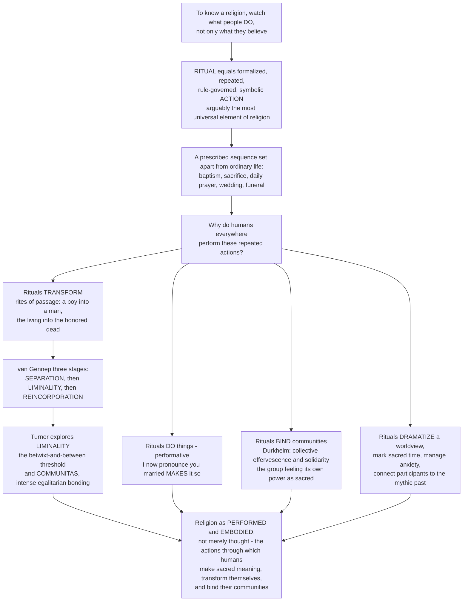

# 🕯️ Ritual and Religious Practice

> [!abstract] TL;DR
> If you want to know what a religion really *is*, do not only ask what people **believe** — watch what they **do**. **Ritual** — formalized, repeated, rule-governed, symbolic **action** set apart from ordinary life — may be the most universal and fundamental element of religion, often more basic and stable than contested doctrine (many traditions prize **orthopraxy**, "right practice," over orthodoxy). Rituals **transform** participants: Arnold **van Gennep** showed that rites of passage everywhere share a three-phase structure — **separation**, **liminality** (an ambiguous, "betwixt-and-between" threshold), and **reincorporation** — and Victor **Turner** explored that magical liminal phase and the intense, egalitarian bonding ("**communitas**") it generates. Rituals also *do* things (J. L. Austin's **performatives**: saying "I now pronounce you married" *makes* it so), **bind** communities (Durkheim's **collective effervescence**), dramatize a worldview, manage anxiety, and mark sacred time. To grasp religion as it actually works, you must see it as *performed and embodied*, not merely thought.

---

## Intuition

**Analogy:** Imagine you are an anthropologist who has just arrived in an unfamiliar community and wants to understand its religion. You could sit people down and ask them what they *believe* — but you would get vague, contradictory, or embarrassed answers, because most people cannot articulate their theology and often disagree about it. So you do something smarter: you *watch what they do*. You notice that at dawn they wash in a particular way and face a particular direction; that a boy who vanished into the forest for a month returns and is now addressed as a man; that a bride and groom exchange words after which they are, irreversibly, *married*; that when someone dies the whole village moves through a sequence of prescribed acts for days. None of these actions is "useful" in any ordinary sense — you cannot eat a prayer or plough a field with a funeral. And yet *everyone* does them, everywhere, in patterned, repeated, deadly-serious ways. This is **ritual**, and it may be the most universal and fundamental thing about religion — more basic than belief, because you find elaborate rituals attached to vague or fiercely contested "beliefs" all the time.

So why do humans everywhere perform these strange, repeated, seemingly pointless actions? Scholars have given deep answers, and they interlock. First, rituals **transform**: a rite of passage turns a boy into a man, a stranger into a spouse, the living into the honored dead. Arnold **van Gennep** discovered that such rites, across wildly different cultures, share a single universal skeleton of three stages — **separation** (you are detached from your old status), **liminality** (a strange, ambiguous, "betwixt-and-between" threshold where you are *neither* your old self *nor* your new one, stripped of structure), and **reincorporation** (you re-enter society bearing a new status). Victor **Turner** fell in love with that middle, liminal phase and showed that in it people who are all equally "nothing" experience an intense, levelling comradeship he called **communitas** — the bonding of soldiers in basic training, pilgrims on the road, initiates in the bush. Second, rituals *do* things. The philosopher J. L. **Austin** noticed that some utterances are not descriptions but **performatives** — "I now pronounce you husband and wife" does not *report* a marriage, it *creates* one — and ritual is performative through and through: it *enacts* realities, obligations, and statuses that did not exist before. Third, rituals **bind**. Émile **Durkheim** watched gathered groups generate a shared electricity he called **collective effervescence** — the group experiencing its own power as something sacred and greater than itself — and argued that this, renewed in periodic ritual, is what welds individuals into a moral community. Along the way rituals also dramatize a worldview, soothe anxiety in the face of danger and death, mark the turning of the seasons, and reconnect participants to the sacred and the mythic past. Understanding ritual, in short, is understanding religion as something *performed and embodied* — the actions through which humans create sacred meaning, transform themselves, and hold their communities together.

---

## How It Works

### Core mechanics

1. **Ritual is action set apart.** A ritual is a *prescribed, patterned sequence of actions* marked off from ordinary behavior. Catherine **Bell** catalogues its typical features: **formalism** (a restricted, elevated register), **traditionalism** (it claims to repeat what was always done), **invariance** (disciplined, exact repetition), **rule-governance**, **sacral symbolism**, and **performance**. A daily prayer, a baptism, a sacrifice, a wedding, a Passover meal, a rain dance — all wear these marks. This is why ritual is distinguishable from mere habit or routine: routine is private and instrumental; ritual is public, symbolic, and set apart.

2. **Practice can outrank belief.** Many traditions are organized around **orthopraxy** ("right *action*") rather than orthodoxy ("right *belief*") — much of Judaism, Islam, Hinduism, Confucianism, and Indigenous religion cares intensely about *doing the rite correctly* while tolerating wide latitude in what one privately thinks. Treating belief as the essence of religion is a Protestant-shaped bias; foregrounding ritual corrects it.

3. **Rites of passage follow a universal arc.** van Gennep decomposed life-cycle rites (birth, initiation, marriage, death) into **separation → transition/liminality → reincorporation**. The middle, *liminal* phase is the engine: the initiate is stripped of former status and hangs in an ambiguous, structureless "threshold" (Latin *limen*) before being reassembled into a new one. Turner added that liminal people, being equally status-less, bond into **communitas** — spontaneous, egalitarian, *anti-structural* solidarity — which is exactly why the liminal middle is where the ritual's transformative power concentrates.

4. **Rituals enact realities.** On Austin's insight, some words and acts are **performative** — they *do* rather than *describe*. A rite of ordination, coronation, marriage, or excommunication *brings about* the status it names, provided the proper persons perform the proper acts in the proper setting (Austin's "felicity conditions"). Ritual is efficacious action; its *failure* (wrong words, wrong officiant) is a real category, not a joke.

5. **Rituals bind and dramatize.** Durkheim's **collective effervescence** — the emotional charge of assembled, synchronized bodies — regenerates social solidarity and reaffirms the sacred; Geertz's ritual *fuses* a people's **ethos** (mood, character) and **worldview** (picture of reality) so that each guarantees the other. Rituals thus simultaneously *manage anxiety* (Malinowski), *mark sacred time*, and *link participants to myth* — the myth being the "script" or charter, the ritual its embodied enactment.

### Flow



---

## Key Concepts

### Secondary (the core idea)

- **Ritual = action, set apart.** A ritual is a prescribed, repeated, symbolic sequence of actions marked off from everyday life — a baptism, a sacrifice, a daily prayer, a wedding, a funeral, a festival. It is something you *do*, not just something you think.
- **Watch what people do.** Religion is *performed and embodied*. Ritual may be the most universal element of religion — more basic and stable than belief, since traditions often have elaborate, unchanging rituals and vague or contested doctrines.
- **Rituals transform.** A *rite of passage* changes your status: a boy becomes a man, a single person becomes a spouse, the living becomes the honored dead. The ritual *makes* the change; it does not merely mark it.
- **Three stages.** Every rite of passage moves through **separation** (leaving your old status), **liminality** (a strange in-between threshold state), and **reincorporation** (entering your new status).
- **Rituals bind people.** Gathering and moving together in a ritual creates a powerful shared feeling that welds a group into a community.

### Undergraduate (theorists, types, and trade-offs)

- **Defining and classifying ritual.** With **Catherine Bell**, ritual is best identified by *ritualization* — the strategies (formalism, traditionalism, invariance, rule-governance, sacral symbolism, performance) that set certain acts apart as privileged. **Types** include: **rites of passage** (life-cycle: birth, initiation, marriage, death); **calendrical/seasonal rites** (repeating with the year — harvest, New Year, holy days); **rites of affliction/crisis** (healing, exorcism, responses to disaster); **feasting, fasting, and festivals**; **rites of exchange and communion** (offering, sacrifice, shared meals); **political and devotional rites** (coronation, prayer, worship); and **purification** and **magic**.
- **The five great theories of *why* humans ritualize.**
  1. **Expressive / symbolic** — ritual dramatizes and communicates a worldview, myth, and cosmology. **Clifford Geertz**: ritual *fuses ethos and worldview*, so that the way things are and the way one ought to feel confirm each other.
  2. **Functional / social** — **Émile Durkheim**: collective ritual generates **collective effervescence** and reaffirms both the sacred and social solidarity; in worshipping its totem the group is, unknowingly, worshipping *itself*. **A. R. Radcliffe-Brown** stressed ritual's role in transmitting and sustaining social sentiments.
  3. **Performative / efficacious** — **J. L. Austin's** performatives; **Stanley Tambiah** ("a performative approach to ritual") and **Roy Rappaport** — ritual *enacts and creates* realities, obligations, and statuses; the very act of performance establishes what it signifies.
  4. **Psychological** — **Bronisław Malinowski**: ritual and magic manage **anxiety** where technical control fails (Trobriand fishermen ritualize *open-sea* fishing, not the safe lagoon); ritual offers catharsis and steadies the person through life-cycle upheavals.
  5. **Cognitive / evolutionary** — ritual as **costly signaling** of commitment (hard-to-fake acts build trust and cooperation), as **synchrony**-driven bonding, and (**Harvey Whitehouse**) as two "**modes of religiosity**": a high-frequency, low-arousal *doctrinal* mode and a rare, high-arousal *imagistic* mode.
- **Orthopraxy vs orthodoxy.** In many traditions, *doing the rite correctly* matters more than holding correct beliefs. Religious **law** and ethics are frequently a code of practice, which is why the belief-centric definition of religion so often distorts.

### Graduate (the deep debates)

- **The practice turn.** **Catherine Bell** (*Ritual Theory, Ritual Practice*) rejects the old "thought vs action" dichotomy: ritual is not the acting-out of prior beliefs but a *strategic mode of practice* that produces "ritualized agents" and quietly reproduces relations of power and authority through the disciplined body.
- **Rappaport's cybernetic sacred.** **Roy Rappaport** (*Ritual and Religion in the Making of Humanity*) argues that ritual's *form* — the performance of an invariant, encoded order the performers did not themselves invent — is what *generates* the sacred, the holy, and even the possibility of truth and social contract; ritual is the ground of "the Holy" and thus of humanity itself.
- **Van Gennep and Turner, extended.** Turner generalized **liminality** and **communitas** far beyond initiation: to pilgrimage, millenarian movements, monastic and countercultural life ("*liminoid*" phenomena in modern society), and the recurring tension between **structure** and **anti-structure** in social life. Liminality became one of the twentieth century's most portable analytic concepts.
- **Does ritual *mean* anything?** **Frits Staal's** provocation — "**the meaninglessness of ritual**" — holds that ritual (his case: Vedic *śrauta* rites) is *pure activity governed by rules*, like syntax or birdsong, with no external meaning; meaning is a later, secondary imposition. Against this, symbolic and performative theorists insist ritual is dense with meaning. The debate reframes the whole field: is the *action* primary and interpretation parasitic, or vice versa?
- **Efficacy, failure, and change.** If rituals *do* things, they can also *fail* (the wrong officiant, a botched sequence) — a topic **Ronald Grimes** and *ritual studies* take seriously. And rituals are **invented** and reinvented: Hobsbawm and Ranger's "**invented tradition**" shows how "immemorial" rites are often recent constructions, and modern life spawns **secular, civic, sporting, and even online/virtual rituals** — extending Durkheim's insight well beyond religion.

---

## Python Demo

```python
# Ritual and Religious Practice — two dramatizations of ritual's mechanics:
#   (a) RITES OF PASSAGE / LIMINALITY: an individual's social status traced
#       through van Gennep's three phases, with the LIMINAL middle plotted as a
#       distinct "betwixt-and-between" zone where status is suspended -> and the
#       intensity of COMMUNITAS (bonding) peaking precisely in that liminal phase.
#   (b) COLLECTIVE EFFERVESCENCE / SYNCHRONY: Durkheim's claim that assembled,
#       synchronized bodies produce a NONLINEAR jump in collective emotional
#       intensity and cohesion -> higher behavioral synchrony shifts the jump
#       earlier and higher (why gathering and moving in unison bonds a group).
import numpy as np
import matplotlib.pyplot as plt

# ---------------------------------------------------------------------------
# (a) Rites of passage: status trajectory + communitas overlay
# ---------------------------------------------------------------------------
t = np.linspace(0.0, 1.0, 1000)            # ritual progress, 0 = start, 1 = end

# phase boundaries (van Gennep's three-phase structure)
sep_start, lim_start, reinc_start, reinc_end = 0.18, 0.34, 0.66, 0.84
pre_status, new_status = 1.0, 2.2          # old status vs new, elevated status

def status(x):
    if x < sep_start:                       # PRE-LIMINAL: stable old status
        return pre_status
    if x < lim_start:                       # SEPARATION: status stripped away
        return pre_status * (1 - (x - sep_start) / (lim_start - sep_start))
    if x < reinc_start:                     # LIMINALITY: suspended, structureless ~0
        return 0.05                         # ambiguous "betwixt-and-between" zone
    if x < reinc_end:                        # REINCORPORATION: rise to NEW status
        return new_status * (x - reinc_start) / (reinc_end - reinc_start)
    return new_status                        # POST-LIMINAL: new elevated status

S = np.array([status(x) for x in t])

# COMMUNITAS: intense egalitarian bonding, peaking in the liminal middle
lim_mid = 0.5 * (lim_start + reinc_start)
communitas = np.exp(-0.5 * ((t - lim_mid) / 0.11) ** 2)   # Gaussian bump

# ---------------------------------------------------------------------------
# (b) Collective effervescence: emotional intensity vs group size & synchrony
# ---------------------------------------------------------------------------
group_size = np.linspace(1, 120, 400)

def effervescence(size, amp, thresh, steep):
    # logistic "ignition": a nonlinear jump in collective emotional intensity
    return amp / (1.0 + np.exp(-steep * (size - thresh)))

low_sync  = effervescence(group_size, amp=0.55, thresh=70, steep=0.10)  # milling crowd
high_sync = effervescence(group_size, amp=1.00, thresh=35, steep=0.22)  # unison chant/dance

# half-max "ignition point" for each condition
def ignition(y, amp):
    return group_size[np.argmin(np.abs(y - amp / 2))]

print("Liminal phase spans ritual-progress "
      f"{lim_start:.2f} to {reinc_start:.2f}; communitas peaks at {t[np.argmax(communitas)]:.2f}")
print(f"Collective ignition point (half-max) -> low synchrony: {ignition(low_sync,0.55):.0f} people, "
      f"high synchrony: {ignition(high_sync,1.0):.0f} people")

# ---------------------------------------------------------------------------
# Plot
# ---------------------------------------------------------------------------
fig, (ax1, ax2) = plt.subplots(1, 2, figsize=(15, 6))

# (a) rites of passage
ax1.axvspan(lim_start, reinc_start, color="gold", alpha=0.25,
            label="LIMINAL zone (status suspended)")
ax1.axvspan(sep_start, lim_start, color="tomato", alpha=0.15, label="Separation")
ax1.axvspan(reinc_start, reinc_end, color="mediumseagreen", alpha=0.15, label="Reincorporation")
ax1.plot(t, S, lw=2.6, color="navy", label="Social status / identity")
ax1.plot(t, communitas, lw=2.2, color="crimson", ls="--", label="Communitas (bonding)")
ax1.axhline(pre_status, color="gray", ls=":", lw=1)
ax1.axhline(new_status, color="gray", ls=":", lw=1)
ax1.text(0.09, pre_status + 0.06, "old status", fontsize=8, color="gray")
ax1.text(0.88, new_status + 0.06, "new status", fontsize=8, color="gray", ha="right")
ax1.set_title("(a) Rite of passage: separation -> LIMINALITY -> reincorporation\n"
              "the transformative power concentrates in the liminal middle", fontsize=10)
ax1.set_xlabel("Ritual progress"); ax1.set_ylabel("Status / bonding intensity")
ax1.set_ylim(-0.15, 2.6); ax1.legend(fontsize=7, loc="upper left")

# (b) collective effervescence
ax2.plot(group_size, high_sync, lw=2.6, color="darkorange",
         label="High synchrony (unison chant / dance)")
ax2.plot(group_size, low_sync, lw=2.6, color="steelblue",
         label="Low synchrony (milling crowd)")
ax2.axvline(ignition(high_sync, 1.0), color="darkorange", ls=":", lw=1.4)
ax2.axvline(ignition(low_sync, 0.55), color="steelblue", ls=":", lw=1.4)
ax2.set_title("(b) Collective effervescence: a nonlinear jump in shared intensity\n"
              "synchrony ignites the group earlier and higher", fontsize=10)
ax2.set_xlabel("Group size (assembled participants)")
ax2.set_ylabel("Collective emotional intensity / cohesion")
ax2.legend(fontsize=8, loc="lower right")

plt.tight_layout()
plt.savefig("ritual_and_religious_practice.png", dpi=120, bbox_inches="tight")
plt.show()
```

**What it shows.** Panel (a): the initiate begins at a stable "old status," is *stripped* of it during **separation**, and then falls into the shaded **liminal** zone where status is suspended near zero — *betwixt and between*, neither old self nor new — before being reassembled at a higher "new status" in **reincorporation**. The dashed **communitas** curve peaks exactly inside that liminal middle: with everyone equally status-less, bonding is most intense precisely where the transformation happens. Panel (b): collective emotional intensity does not rise smoothly with group size but *ignites* in a nonlinear jump — and raising **behavioral synchrony** (moving and chanting in unison rather than milling) shifts that ignition point dramatically earlier and higher (the printed half-max points move from a large crowd down to a modest, synchronized gathering). This is Durkheim's insight in miniature: it is not mere numbers but *coordinated, embodied* assembly that manufactures the felt power a group experiences as sacred.

---

## Real-World Applications

> **Example — military basic training as a rite of passage:** Boot camp is a textbook van Gennep sequence. Recruits are **separated** (removed from home, stripped of civilian clothes, hair, and names), pass through a prolonged **liminal** ordeal (identical uniforms, no rank, constant synchronized drill, sleep and food controlled, humiliation and testing), and are finally **reincorporated** at a graduation ceremony that confers a new, elevated status: *soldier*. Turner's **communitas** is the whole point — the fierce, levelling bond forged among people who are all equally "nothing" is exactly the cohesion armies need. The synchronized marching and chanting are not decoration; they are the collective-effervescence machinery of panel (b), engineered to weld individuals into a unit.

- **Life-cycle rites across traditions.** Baptism and confirmation, bar/bat mitzvah, the Hindu *saṃskāras*, quinceañera, weddings, and funerals all *perform* status change; comparative study reads them through the same three-phase lens.
- **Performative law and institutions.** Courtroom oaths, presidential inaugurations, academic graduations, and citizenship ceremonies are secular **performatives** — the act *creates* the office, the degree, the citizen. Austin's felicity conditions are why *who* administers the oath, and *how*, is legally decisive.
- **Ritual studies and chaplaincy.** Hospitals, hospices, and the armed forces design rites for birth, death, and trauma; **Ronald Grimes** and applied ritual studies treat ritual *failure* and the *invention* of new rites (e.g., for stillbirth, divorce, or transition) as practical problems.
- **Analyzing secular "religions."** Sports fandom, national holidays, brand launches, concerts, and online communities exhibit calendrical rites, collective effervescence, and pilgrimage — the ritual lens is a research tool for studying solidarity far beyond temples.
- **Cooperation and costly signaling.** Development economists and evolutionary anthropologists study why demanding rituals (fasting, painful initiations, tithing) correlate with more durable, high-trust communities — hard-to-fake acts as credible commitment signals.

---

## Common Pitfalls

- **The belief-centric bias.** Assuming religion is *fundamentally* about private belief and doctrine — a post-Reformation Protestant template — makes you miss the traditions (much of Judaism, Islam, Hinduism, Confucianism, Indigenous religion) built around **orthopraxy**. Watch what people *do* first.
- **Confusing ritual with empty routine.** Not all repetition is ritual; ritual is *set apart*, symbolic, and rule-governed (Bell's ritualization). But the opposite error — dismissing ritual as "just going through the motions" — misses that the motions may be the *point* (Staal), or may *do* real performative work regardless of inner state.
- **Reducing ritual to belief-in-action.** Ritual is not merely the acting-out of a prior doctrine; Bell and Rappaport argue the *practice* is primary and can *generate* the belief, the status, and the sacred. Treating ritual as a mere illustration of theology inverts the actual causal arrow.
- **Flattening liminality.** Liminality is not just "a transition"; it is a genuinely *ambiguous, anti-structural, dangerous* state. Skipping over it — or treating a rite as instantaneous — misses where the transformative power and communitas actually live.
- **Over-reading meaning.** Assuming every ritual gesture "symbolizes" a neat proposition can impose interpretations participants would not recognize; Staal's challenge and the practice turn warn against treating ritual as an encrypted text.
- **Ignoring efficacy and failure.** If ritual only "expresses" feelings it can never *fail* — yet participants treat wrong words or wrong officiants as invalidating. Take **efficacy** and its felicity conditions seriously; they reveal what a community thinks ritual really *does*.

---

## Related Concepts

- [[Defining_Religion_and_the_Sacred]] — sets up the sacred/profane distinction and the belief-vs-practice problem that this note answers by foregrounding action.
- [[Phenomenology_of_Religion]] — Otto's numinous and Eliade's sacred time and space, the experiential field that ritual *enacts* and enters.
- [[Theories_of_the_Origin_of_Religion]] — the same theorists (Durkheim, Malinowski, cognitive-evolutionary accounts) here applied specifically to *why humans ritualize*.
- [[Religion_Magic_and_Ritual]] — the anthropology-of-religion treatment of ritual, magic, and rites of passage; the closest cross-vault companion to this note.
- [[Religion_Sacred_and_Secular]] — the sociological development of Durkheim's collective effervescence, civil religion, and secular ritual.
- [[Classical_Sociological_Theory]] — Durkheim's *Elementary Forms of Religious Life*, the source of the effervescence-and-solidarity argument, in its wider theoretical setting.
- [[Collective_Behavior_and_Crowds]] — the dynamics of assembled, synchronized bodies that model panel (b)'s nonlinear ignition of shared emotion.
- [[Structuralism_and_Symbolic_Anthropology]] — Turner and the symbolic-anthropology tradition that theorized liminality, communitas, and the ritual process.
- [[Functions_of_Myth]] — myth as the "script" or charter that ritual embodies; the myth-and-ritual relationship viewed from the mythology side.
- [[Group_Dynamics]] — the social-psychology of synchrony, cohesion, and in-group bonding underlying communitas and costly signaling.

*Sibling notes in this section (Ritual, Myth, and the Sacred) develop adjacent threads prose-first: Myth_and_Sacred_Narrative treats the myths that rituals enact; Sacred_Symbols_Space_and_Time examines the hierophanic settings ritual creates; Religious_Experience_and_Mysticism explores the inner states ritual can trigger; Pilgrimage_Festival_and_Devotion applies liminality and communitas to journeys and calendrical feasts; Religion_and_Social_Order follows the Durkheimian binding function into institutions; and Religious_Studies_and_Comparative_Religion_Overview frames the whole field.*

---

## Review Questions

**Secondary.** What is a "ritual," and how is it different from an ordinary habit? Name the three stages every rite of passage moves through, and give one example of a ritual that *transforms* a person's status.

**Undergraduate.** Explain van Gennep's three-phase structure and Turner's concepts of *liminality* and *communitas*, then use them to analyze one real rite of passage (e.g., a wedding, an initiation, or military training). Separately, contrast two theories of *why* humans ritualize — for instance Durkheim's functional account against Austin's performative one — and say what each captures that the other misses.

**Graduate.** Frits Staal argued for "the meaninglessness of ritual," while symbolic and performative theorists insist ritual is dense with meaning and *does* things. Reconstruct both positions, relate them to Catherine Bell's "practice turn" and Roy Rappaport's claim that ritual's *form* generates the sacred, and assess: is the *action* of ritual primary and interpretation secondary, or the reverse — and what does your answer imply for how we should study religion as a whole?

---

## Sources

- [Arnold van Gennep, *The Rites of Passage* (1909)](https://en.wikipedia.org/wiki/The_Rites_of_Passage)
- [Victor Turner, *The Ritual Process: Structure and Anti-Structure* (1969)](https://en.wikipedia.org/wiki/The_Ritual_Process)
- [Catherine Bell, *Ritual: Perspectives and Dimensions* (1997)](https://en.wikipedia.org/wiki/Catherine_Bell_(religious_studies_scholar))
- [Roy A. Rappaport, *Ritual and Religion in the Making of Humanity* (1999)](https://en.wikipedia.org/wiki/Roy_Rappaport)
- [Stanford Encyclopedia of Philosophy — "Ritual" and related entries on religious practice](https://plato.stanford.edu/entries/concept-religion/)

---

#religious-studies #ritual #rites-of-passage #liminality #religious-practice
