# ⛩️ Sacred Symbols, Space, and Time

> [!abstract] TL;DR
> Religions do not merely tell stories and perform rituals — they **saturate the world with meaning through symbols**, and they **carve space and time into the sacred and the ordinary**. A **symbol** compresses a whole worldview into a single image that "stands for" and *participates in* a reality beyond itself: a cross, a crescent, the wheel of *dharma*, the Star of David, the syllable *OM* — each evokes deep emotion and commitment far beyond what any argument could, which is why symbols are the **fundamental currency of religious meaning**. Clifford **Geertz** argued that religion *works* precisely as a **system of symbols** that establishes powerful moods and motivations and clothes a particular vision of reality in an "aura of factuality," making it feel uniquely real; Victor **Turner** showed that dominant symbols are **multivocal condensations**, single images holding many meanings at once. Religions also transform **space**: not all space is equal — there is **sacred space** (the temple, the church, the mosque, the shrine, the sacred mountain) *set apart* from **profane** ordinary space (**Eliade**), often marked as a **threshold** between worlds and as the **center of the world** — the *axis mundi* where heaven, earth, and underworld connect — which is why religious **architecture** is designed to embody cosmic order and evoke transcendence. And religions transform **time**: alongside ordinary linear time runs **sacred time** — the cyclical rhythm of the ritual **calendar** (Sabbaths, holy days, festivals) that repeatedly returns the community to the sacred, mythic origin (Eliade's **"eternal return"**), whether inside a **linear** salvation-history (the monotheisms) or **cyclical** cosmic ages (the Indian *yugas*). Together these build a total **sacred cosmos** — the meaningfully ordered world that Peter **Berger** called the **"sacred canopy,"** a shield against chaos and meaninglessness. To understand sacred symbols, space, and time is to understand how religion constructs an **inhabitable, meaningful world** — the symbolic and spatial-temporal *architecture of the sacred*.

---

## Intuition

**Analogy:** Think of how a **flag** works. It is a scrap of colored cloth, yet people salute it, fold it with reverence, refuse to let it touch the ground, and — astonishingly — will *die* for it. The flag does not *argue*; it *condenses*. Into one image it packs a nation's history, its dead, its hopes, its enemies, its idea of itself, and it hands that whole world back to you in a single glance that tightens your throat. Now imagine a symbol that does this not for a nation but for *reality itself* — for life, death, suffering, and the meaning of the cosmos — and you have a **religious symbol**. A cross, a crescent, a wheel of *dharma*, the syllable *OM*: each is a compression of an entire worldview into one image, and each can command devotion, tears, pilgrimage, and martyrdom on a scale no flag ever could.

That is the first thing religions do: they **saturate the world with meaning through symbols**. But they do a second, equally strange thing — they refuse to treat all **space** and all **time** as the same. For a religious person, space is *not* a uniform grid. There is *this* place — the temple, the mosque, the shrine, the mountain — which is **set apart**, charged, holy, and *that* place — the parking lot outside — which is merely ordinary, **profane**. The sacred place is often felt as a **threshold** between worlds and as the **center of the world**, the fixed point — the *axis mundi* — where heaven and earth touch; this is exactly why a cathedral or a temple is *built* to feel like a doorway into another order of being. And **time** is not uniform either: cutting across the flat, forgettable flow of ordinary days runs a cycle of **holy days and festivals** — the ritual calendar — that keeps returning the community to the founding, sacred moment "in the beginning," so that Easter is not merely *about* the first Easter but somehow *re-presents* it. Weave these three together — sacred symbols, sacred space, sacred time — and you get a **sacred cosmos**: a total, meaningful, ordered world in which the believer *dwells* and is *oriented*, a world where the everyday is stitched at every point to the transcendent. Sociologist Peter Berger called this the **"sacred canopy"** — the humanly built roof of meaning that keeps the terrifying formlessness of *chaos* at bay. Everything below is the *architecture of that canopy*.

---

## How It Works

The sacred cosmos is assembled from three materials — **symbol**, **sacred space**, and **sacred time** — each of which takes a *neutral* element of experience (an object, a place, a moment) and makes it **stand out** as charged with ultimate meaning. The mechanism is the same in all three: a **hierophany** (a "showing of the sacred," Eliade's word) breaks the uniformity, marks off a *center*, and orients everything else around it. The diagram traces how symbol, space, and time interlock into a single meaningful world.

```mermaid
graph TD
    SAT["Religion SATURATES the world with meaning<br/>via SYMBOLS and carves SPACE and TIME<br/>into the sacred and the ordinary"]
    SYM["A SYMBOL such as cross, crescent, OM<br/>compresses a whole worldview into one image<br/>evoking deep emotion and commitment"]
    GEERTZ["GEERTZ equals religion works through<br/>a SYSTEM OF SYMBOLS that makes<br/>a vision of reality feel uniquely real"]
    TURNER["TURNER equals dominant symbols are<br/>MULTIVOCAL condensations<br/>one image holding many meanings at once"]
    SPACE["SACRED SPACE such as temple, mosque,<br/>sacred mountain is SET APART<br/>from PROFANE ordinary space - Eliade"]
    AXIS["Often a THRESHOLD and a CENTER of the world<br/>the AXIS MUNDI connecting<br/>heaven, earth, and underworld"]
    ARCH["Religious ARCHITECTURE - cathedral, stupa,<br/>mandala - embodies cosmic order<br/>and evokes transcendence"]
    TIME["SACRED TIME equals the ritual CALENDAR<br/>of holy days and festivals returning<br/>to the mythic origin - the eternal return"]
    HIST["Plus sacred HISTORY<br/>linear salvation-history<br/>versus cyclical cosmic ages"]
    COSMOS["Together a total SACRED COSMOS<br/>a meaningfully ordered world<br/>that orients the believer"]

    SAT --> SYM
    SYM --> GEERTZ
    GEERTZ --> TURNER
    TURNER --> SPACE
    SPACE --> AXIS
    AXIS --> ARCH
    ARCH --> TIME
    TIME --> HIST
    HIST --> COSMOS
```



**The core mechanics of building a sacred cosmos:**

1. **Start from non-homogeneity.** For the religious person, neither space nor time is uniform. Some places and moments are qualitatively *different* — set apart, forbidden, charged with power. This break in the fabric of the ordinary is the raw material of everything else (this is Eliade's central claim, developed in the sibling **[[Phenomenology_of_Religion]]**).
2. **Mark the break with a symbol.** A **symbol** is not a mere *sign* (an arbitrary label, like a stop sign) — it *participates in* what it points to and *condenses* meaning and feeling (Paul Tillich: a symbol "participates in the reality of that which it symbolizes"). The cross does not *label* salvation; it *makes present* and *evokes* it.
3. **Found a center.** The sacred manifestation (**hierophany**) fixes a **center of the world** — the *axis mundi*: the cosmic pillar, world-tree, or sacred mountain around which the cosmos is *oriented* and through which heaven, earth, and underworld communicate. Building a temple *repeats* the original ordering of chaos into cosmos (the cosmogony).
4. **Set apart and consecrate space.** Around the center, space is zoned by **thresholds** into decreasing degrees of sanctity — holy of holies, sanctuary, nave, narthex, profane outside — policed by rules of purity and access. **Architecture** then makes this zoning *walkable*: the building *is* the diagram of the cosmos.
5. **Periodically return to the origin in time.** The ritual **calendar** — Sabbaths, holy days, festivals, seasons — punctuates ordinary linear time with recurring **sacred time**, in which the community *reactualizes* the mythic time of origins (*in illo tempore*, "in that time"). This is Eliade's **"eternal return."**
6. **Frame the whole as sacred history.** The tradition tells whether time as a whole is **linear** (creation → fall → redemption → end, in the Abrahamic monotheisms) or **cyclical** (immense repeating cosmic ages, the Indian *yugas*, eternal recurrence).
7. **Result: a sacred cosmos.** Symbol + space + time cohere into a total, meaningful, oriented world — a *cosmos* rather than *chaos* — in which religious humanity dwells. Berger's **"sacred canopy"** names the social achievement: a shared roof of meaning against *anomie* (normlessness) and terror.

---

## Key Concepts

### 🟢 Secondary — the basic idea

- **A symbol stands for a whole world.** A religious symbol — cross, crescent, *OM*, the wheel of *dharma*, the Star of David, the yin-yang — packs an entire worldview into one image and stirs deep feeling. Like a flag, only far more powerful, because it is about *everything*, not just a nation.
- **Sign vs symbol.** A *sign* just points ("this way to the exit"). A *symbol* both points to *and shares in* something bigger, and it moves the heart. That is why you can argue with a sign but you *revere* a symbol.
- **Sacred space vs profane space.** Not all places feel the same. A shrine, a temple, a great cathedral is **sacred** — set apart, special, entered with awe; the street outside is **profane** — ordinary. Religions draw a line between them.
- **The center of the world.** Sacred places are often felt as *the* center — the point where heaven and earth meet, a doorway between worlds. Scholars call it the *axis mundi* (Latin for "axis of the world").
- **Sacred time vs ordinary time.** Alongside ordinary days runs a special rhythm of **holy days and festivals** — the *calendar* — that returns the community again and again to the holy story it is built on.

### 🟡 Undergraduate — the theorists and the machinery

- **Geertz — religion as a system of symbols.** In "Religion as a Cultural System" (1966), Clifford **Geertz** defined religion as "a **system of symbols** which acts to establish powerful, pervasive, and long-lasting **moods and motivations**" by "formulating **conceptions of a general order of existence**" and "clothing these conceptions with such an **aura of factuality** that the moods and motivations seem uniquely realistic." The key move: religion fuses a people's **ethos** (their approved style of life, their mood) with their **worldview** (their picture of how reality *is*), each making the other seem inevitable. Symbols are the *vehicles* of this fusion (see the parallel treatment in the anthropology note **[[Culture_Symbols_and_Meaning]]** and the definitional note **[[Defining_Religion_and_the_Sacred]]**).
- **Turner — dominant, multivocal symbols.** Victor **Turner** (*The Forest of Symbols*, 1967) showed that a **dominant symbol** in ritual is **multivocal** (polysemic): it *condenses* many meanings into one object. His famous case — the Ndembu *mudyi* (milk-tree) — simultaneously signifies breast milk, matriliny, tribal custom, and womanhood. Turner distinguished two **poles** of meaning that the symbol *unites*: an **ideological** (or *normative*) pole (the moral and social order — norms, values, principles) and a **sensory** (or *orectic*) pole (raw physiological and emotional stuff — milk, blood, sex). The genius of the dominant symbol is that it **exchanges** feeling and duty: it makes the moral order *desirable* and the desires *moral*.
- **Tillich — symbols participate.** Theologian Paul **Tillich** distinguished a **sign** (arbitrary, replaceable) from a **symbol**, which "**participates in the reality of that which it symbolizes**," opens up levels of reality otherwise closed, and *cannot* be invented or replaced at will. Religious symbols point beyond themselves to the *ultimate* — and (crucially) a symbol becomes an **idol** when it is mistaken for the ultimate itself rather than a window onto it.
- **Eliade — the sacred, the hierophany, and non-homogeneous space/time.** Mircea **Eliade** (*The Sacred and the Profane*, 1957) is the classic theorist of sacred space and time. Core terms: **hierophany** (the "showing-forth" of the sacred into the profane); the **non-homogeneity of space** (a fixed *center* vs formless expanse); the **axis mundi** (world-pillar / world-tree / cosmic mountain orienting the cosmos and linking its levels); the **threshold** (the paradoxical boundary between worlds); **orientation** and **consecration** (founding a world by repeating the cosmogony); and, for time, the **eternal return** — the ritual **reactualization** of the primordial mythic origin (developed at length in **[[Phenomenology_of_Religion]]**).
- **Types of sacred symbol.** *Aniconic* signs and diagrams (the cross, crescent, *OM*, Star of David, *taijitu* / yin-yang, the *dharma*-wheel, the **mandala**); *iconic* sacred images and icons (Byzantine icons, Hindu *mūrti*), against traditions of **aniconism** that forbid images (Islam, Judaism, some Protestantism) — an art-historical field of its own (see **[[Iconography_and_Semiotics_of_Art]]**).
- **Types of sacred space.** The **temple**, church, mosque, synagogue, and shrine; **sacred mountains** (Sinai, Meru, Fuji, Kailash), **rivers** (the Ganges), and **groves**; the **home** and the **body** as sacred space; and **sacred geography** more broadly — a landscape mapped by pilgrimage and cosmology.
- **Types of sacred time.** **Cyclical** ritual time (the recurring festival calendar) vs the **linear** arrow of history; **kairos** (the charged, decisive "right moment," against *chronos*, mere clock-time); rites that **mark** the passage of time and acts of **commemoration** and memory.

### 🔴 Graduate — construction, integration, and the modern predicament

- **Religion as world-construction — Berger's sacred canopy.** Peter **Berger** (*The Sacred Canopy*, 1967) synthesized the sociology of knowledge with the phenomenology of the sacred: humans *externalize* a social order, *objectivate* it as an independent reality, and *internalize* it — and **religion** is the boldest form of this world-building, a **"sacred canopy"** that confers **cosmic legitimation** on the fragile human *nomos* (ordered world), locating it in the very structure of the universe and thereby shielding it against **anomie** — the terror of chaos, meaninglessness, and death that lurks at the margins of every social world. Religion's deep function is to make the humanly constructed world feel **cosmically given** (this world-construction argument belongs to the sociology of religion; compare the definitional-functional lineage in **[[Defining_Religion_and_the_Sacred]]**).
- **The multivocality / condensation debate.** Turner's condensation model (one symbol, many referents, two poles) contrasts with **Lévi-Strauss**'s *structuralist* reading (meaning lies not in any symbol's richness but in **binary oppositions** and their transformations across a system) and with **Sperber**'s cognitivist critique (symbolism is not a *code* to be decoded but an *evocative* device that triggers open-ended search). How much a symbol "means," and whether meaning is *in* the symbol or *in the system*, remains contested (see **[[Culture_Symbols_and_Meaning]]** and the structuralist tradition in anthropology).
- **The axis mundi and built cosmology.** Sacred **architecture** is *built cosmology*: the Gothic **cathedral** oriented east toward the risen sun, cruciform in plan, its verticality pulling the eye to heaven; the Hindu **temple** as an image of **Mount Meru** and a **mandala** laid in stone (the *vāstu-puruṣa-maṇḍala* grid); the Buddhist **stupa** as a diagram of the cosmos and the Buddha's presence; the **Kaaba** as the fixed center toward which a fifth of humanity turns (*qibla*) five times daily. Each embodies **cosmic order** and stages the passage from profane to sacred as a walk inward and upward (see **[[Architecture_and_the_Built_Environment]]**).
- **Linear vs cyclical time as two time-geometries.** The **Abrahamic** traditions read time as a **linear salvation-history** with a beginning (creation), a decisive middle (covenant, incarnation, revelation), and an **eschatological** end (judgment, messianic age) — history *goes somewhere*. The **Indian** traditions read time as **cyclical**: immense repeating cosmic ages (the four **yugas** in ratio 4:3:2:1, a *kalpa* as a "day of Brahmā," followed by dissolution) turning without final end (developed in the mythology note **[[Avatars_Yugas_and_Cosmic_Cycles]]**). Eliade argued the archaic norm is *cyclical reversibility* — a "revolt against history" — and that **linear, irreversible** time is Judaism and Christianity's radical innovation, the seedbed of the modern idea of *progress*.
- **The integration — the myth-ritual-symbol-space-time complex.** Symbol, space, and time do not float free: **myth** *narrates* the sacred origin, **ritual** *enacts* it, the **symbol** *condenses* it, sacred **space** *locates* it, and sacred **time** *re-presents* it. A festival (sacred time) held at a shrine (sacred space) re-tells a myth through symbols in ritual action — one integrated machine for dwelling in a meaningful world (the enacting and narrating halves are treated in the section-03 siblings *Ritual_and_Religious_Practice* and *Myth_and_Sacred_Narrative*).
- **Modernity — disenchantment and the relocation of the sacred.** Max **Weber**'s *Entzauberung* — the **"disenchantment of the world"** — names modernity's stripping of magic and the sacred from a now-**profane**, calculable, bureaucratic universe (the **secularization** thesis). Yet the sacred **persists and relocates**: Robert Bellah's **civil religion** (the nation's sacred symbols, martyrs, scriptures, and holy days — flags, the Fourth of July, war memorials, the tomb of the unknown soldier); the "secular sacreds" of sport, celebrity, and consumer brand-cults; sacred spaces and times carved out of secular life (Ground Zero, Auschwitz-as-memorial, moments of silence). Debates over **re-enchantment**, the sacred in a **pluralistic** and **digital** age (virtual pilgrimage, online shrines), extend the analysis to the present.

---

## Python Demo

```python
# Sacred Symbols, Space, and Time -- four teaching pictures of how religion
# builds a "sacred cosmos". These are conceptual heuristics, not measurements.
#   (a) SACRED SPACE / GRADIENT: a 2D "sanctity" landscape that is NOT uniform --
#       it peaks at a CENTER (the axis mundi / holy of holies) and falls off with
#       distance, unlike the flat homogeneous space of the profane worldview.
#   (b) CONCENTRIC ZONES + THRESHOLDS: the same space seen as a radial profile --
#       sanctuary -> nave -> narthex -> threshold -> profane outside, with SHARP
#       drops (the sacred is SET APART), against the flat secular line.
#   (c) SACRED TIME: flat, homogeneous "profane" linear time vs the ritual
#       CALENDAR -- periodic festival peaks that re-actualize the origin
#       (Eliade's "eternal return") punctuating an otherwise linear year.
#   (d) SYMBOL as CONDENSATION: Turner's DOMINANT symbol -- one central node
#       ("the Cross") wired to MANY meanings at once (a multivocal star-graph).
import numpy as np
import matplotlib
matplotlib.use("Agg")
import matplotlib.pyplot as plt

# ======================================================================
# (a) SACRED SPACE: a non-homogeneous sanctity landscape
# ======================================================================
grid = np.linspace(-5, 5, 300)
X, Y = np.meshgrid(grid, grid)
R = np.sqrt(X**2 + Y**2)                     # distance from the center of the world

profane_floor = 0.05                         # flat, homogeneous profane space
# smooth core peak at the axis mundi + a couple of satellite hierophanies
sacred = np.full_like(X, profane_floor)
sacred += 1.00 * np.exp(-(R**2) / (2 * 0.9**2))          # AXIS MUNDI (the center)
sacred += 0.35 * np.exp(-(((X + 3.0)**2 + (Y - 2.3)**2)) / (2 * 0.55**2))  # a shrine
sacred += 0.30 * np.exp(-(((X - 2.8)**2 + (Y + 2.6)**2)) / (2 * 0.50**2))  # a holy well

# ======================================================================
# (b) CONCENTRIC ZONES: a radial profile with sharp thresholds
# ======================================================================
r = np.linspace(0, 5, 500)
# step-down zones of decreasing sanctity, each boundary a THRESHOLD
zones = np.select(
    [r < 0.8, r < 1.6, r < 2.4, r < 3.2],
    [1.00,    0.70,    0.45,    0.20],       # sanctuary, nave, narthex, threshold
    default=0.05,                            # profane outside
)
secular_flat = np.full_like(r, 0.05)         # homogeneous space of the profane worldview
zone_edges = [0.8, 1.6, 2.4, 3.2]
zone_names = ["holy of\nholies", "nave", "narthex", "threshold", "profane\noutside"]
zone_mids  = [0.4, 1.2, 2.0, 2.8, 4.1]

# ======================================================================
# (c) SACRED TIME: linear profane time vs periodic festival calendar
# ======================================================================
t = np.linspace(0, 12, 1400)                 # twelve "months" of the ritual year
profane_time = np.full_like(t, 0.10)         # homogeneous, forgettable ordinary time
festival_dates = [1.0, 3.5, 6.0, 8.5, 11.0]  # holy days / festivals
sacred_time = profane_time.copy()
for d in festival_dates:                     # each festival re-actualizes the origin
    sacred_time += np.exp(-((t - d)**2) / (2 * 0.16**2))

# ======================================================================
# (d) SYMBOL CONDENSATION: one dominant symbol -> many meanings (Turner)
# ======================================================================
meanings = ["sacrifice", "salvation", "suffering", "victory\nover death",
            "faith", "the axis of\nthe world", "communal\nidentity",
            "forgiveness"]
n = len(meanings)
angles = np.linspace(0, 2 * np.pi, n, endpoint=False)
mx, my = np.cos(angles), np.sin(angles)

# ======================================================================
# Plot 2x2
# ======================================================================
fig, axes = plt.subplots(2, 2, figsize=(14, 11))
(axA, axB), (axC, axD) = axes

# ---- (a) sacred-space landscape --------------------------------------
im = axA.imshow(sacred, extent=[-5, 5, -5, 5], origin="lower",
                cmap="magma", aspect="auto")
axA.contour(X, Y, sacred, levels=8, colors="white", linewidths=0.4, alpha=0.5)
axA.plot(0, 0, marker="*", color="cyan", markersize=18, markeredgecolor="k")
axA.text(0, 0.55, "axis mundi\ncenter of the world",
         ha="center", fontsize=8, color="cyan", fontweight="bold")
axA.set_title("(a) SACRED SPACE: non-homogeneous sanctity,\ncentered by hierophany",
              fontsize=10)
axA.set_xlabel("space"); axA.set_ylabel("space")
fig.colorbar(im, ax=axA, fraction=0.046, pad=0.04, label="sacred intensity")

# ---- (b) concentric zones + thresholds -------------------------------
axB.step(r, zones, where="post", color="#b45309", lw=2.2,
         label="Sacred space: graded, set-apart zones")
axB.plot(r, secular_flat, color="#6b7280", lw=2, ls="--",
         label="Profane space: flat, homogeneous")
axB.fill_between(r, zones, step="post", color="#f59e0b", alpha=0.15)
for e in zone_edges:                         # each boundary is a THRESHOLD
    axB.axvline(e, color="k", lw=0.6, ls=":", alpha=0.5)
for name, mid in zip(zone_names, zone_mids):
    axB.text(mid, 1.06, name, ha="center", fontsize=7.5, color="#7c2d12")
axB.set_title("(b) CONCENTRIC ZONES: sharp thresholds set the sacred apart",
              fontsize=10)
axB.set_xlabel("distance from the center")
axB.set_ylabel("degree of sanctity")
axB.set_ylim(0, 1.2)
axB.legend(fontsize=8, loc="center right")

# ---- (c) sacred time -------------------------------------------------
axC.plot(t, profane_time, color="#6b7280", lw=2,
         label="Profane time: homogeneous, linear")
axC.plot(t, sacred_time, color="#7c3aed", lw=2,
         label="Sacred time: the ritual calendar")
for d in festival_dates:
    axC.axvline(d, color="#7c3aed", lw=0.5, ls="--", alpha=0.35)
axC.annotate("eternal return:\nfestival re-actualizes the origin",
             xy=(6.0, 1.05), xytext=(6.2, 0.62), fontsize=7.5, color="#5b21b6",
             ha="center",
             arrowprops=dict(arrowstyle="->", color="#5b21b6", lw=0.8))
axC.set_title("(c) SACRED TIME: festivals punctuate ordinary linear time",
              fontsize=10)
axC.set_xlabel("ordinary calendar time (the year)")
axC.set_ylabel("intensity / meaning")
axC.set_ylim(0, 1.3)
axC.legend(fontsize=8, loc="upper right")

# ---- (d) symbol condensation star-graph ------------------------------
for x, y, m in zip(mx, my, meanings):
    axD.plot([0, x], [0, y], color="#9ca3af", lw=1.3, zorder=1)
    axD.scatter([x], [y], s=520, color="#dbeafe", edgecolor="#1d4ed8",
                zorder=2)
    axD.text(x, y, m, ha="center", va="center", fontsize=7, zorder=3)
axD.scatter([0], [0], s=1400, color="#dc2626", edgecolor="k", zorder=4)
axD.text(0, 0, "THE\nCROSS", ha="center", va="center", fontsize=9,
         color="white", fontweight="bold", zorder=5)
axD.set_title("(d) SYMBOL as CONDENSATION: one dominant symbol,\n"
              "many meanings at once (Turner)", fontsize=10)
axD.set_xlim(-1.7, 1.7); axD.set_ylim(-1.7, 1.7)
axD.axis("off")

plt.tight_layout()
plt.savefig("sacred_symbols_space_and_time.png", dpi=120, bbox_inches="tight")
plt.show()

# ---- Console summary --------------------------------------------------
print("=" * 66)
print("The sacred cosmos in numbers")
print("=" * 66)
peak = zones.max() / secular_flat.max()
print(f"(b) Sanctity contrast, center vs profane outside : {peak:5.1f}x")
print(f"(c) Festival peak vs ordinary-time floor         : "
      f"{sacred_time.max() / profane_time.max():5.1f}x")
print(f"(d) Meanings condensed into ONE dominant symbol  : {n}")
print()
print("Space is NOT flat, time is NOT uniform, and a single symbol carries")
print("many meanings at once -- three ways religion saturates the world with")
print("meaning and builds an inhabitable SACRED COSMOS.")
```

**What the figure teaches.** Panels (a) and (b) render Eliade's key claim that for the religious person **space is non-homogeneous**. In (a) the "sanctity" of space is *not* a flat sheet but a landscape with a bright **center** — the *axis mundi*, the cyan star — around which the world is oriented, dotted with lesser hierophanies; for the modern *profane* map the same terrain would be featurelessly uniform. Panel (b) shows the *same* space as a radial profile: sanctity steps **down** through concentric zones (holy of holies → nave → narthex → threshold → profane outside), and each boundary is a **sharp threshold** — the sacred is *set apart*, not smoothly shaded, which is exactly why crossing into a temple *feels* like crossing into another world. Panel (c) does for **time** what (a)–(b) do for space: ordinary "profane" time is the flat gray line, but the ritual **calendar** produces recurring **peaks** where festival and holy day *reactualize* the founding origin — Eliade's **eternal return** — reaching intensities the flat everyday never touches. Panel (d) makes Turner's **condensation** visible: a single dominant **symbol** at the center is wired simultaneously to *many* meanings — sacrifice, salvation, suffering, victory over death, communal identity — so that one image holds a whole worldview at once (the "multivocality" that lets a symbol move the heart the way an argument never could). Together: space bent around a center, time folded back to its origin, and meaning compressed into symbols — the three-part machinery of an inhabitable **sacred cosmos**.

---

## Real-World Applications

> **Example — the Gothic cathedral as a built cosmos.** A medieval cathedral is Eliade's theory in stone. It is **oriented** (the altar faces liturgical east, toward the rising — and returning — sun); its plan is **cruciform** (the symbol of the faith *is* the floor plan); it is zoned by **thresholds** from profane street through porch and nave to the sanctuary and the sacred *reserved* space of the choir; its soaring verticality and colored light stage an ascent from earth to heaven, making it a felt **axis mundi**, a doorway between worlds. The building does not *describe* the sacred cosmos — it *is* one you walk through. The same logic reshapes the Hindu **temple** as Mount Meru and a **mandala** in stone, the Buddhist **stupa** as a cosmic diagram, and the **Kaaba** as the fixed center of the Islamic world (see **[[Architecture_and_the_Built_Environment]]**).

- **The Sabbath as a cathedral in time.** Abraham Joshua Heschel called the Jewish **Sabbath** "a cathedral in time" — sacred *time* rather than sacred *space*, a weekly, recurring **holy day** that sets apart the seventh day and re-actualizes the rest of creation, structuring the whole rhythm of the week (a direct instance of sacred time studied in the tradition note **[[Christianity_and_the_Christian_Traditions|Christianity]]**'s neighboring **[[Judaism_and_the_Covenant_Tradition|Judaism]]**).
- **Reading religious images.** Panofsky's iconography — decoding *what a figure with a wheel means* — is the applied science of religious symbols, from Byzantine icons to Buddhist **mandalas** and the *dharma*-wheel (see **[[Iconography_and_Semiotics_of_Art]]**).
- **Pilgrimage as movement through sacred geography.** The *hajj* to Mecca, the Kumbh Mela on the Ganges, the Camino to Santiago — pilgrimage enacts a journey *from* the profane periphery *to* the sacred **center**, exactly the axis-mundi structure, and Turner analyzed it as **liminal**, communitas-forming ritual time (developed in the section-03 sibling *Pilgrimage_Festival_and_Devotion*).
- **Civil religion and secular sacreds.** Bellah's **civil religion** applies the whole apparatus to the nation: sacred symbols (the flag), sacred space (war memorials, the tomb of the unknown soldier, Ground Zero), sacred time (Independence Day, days of remembrance, moments of silence), showing that even a "secular" society builds a **sacred canopy** — the analysis extends to sport, brand-cults, and national **[[Culture_Symbols_and_Meaning|symbol systems]]**.
- **Interpreting ritual in the field.** Anthropologists reading a rite ask *which object is the dominant symbol, what meanings it condenses, and how sacred space and time frame the act* — Turner's and Geertz's toolkit in action (see **[[Religion_Magic_and_Ritual]]**).

---

## Common Pitfalls

- **Collapsing symbol into sign.** Treating a religious symbol as an *arbitrary label* (a mere pointer to a doctrine) misses what makes it religious: it **participates in** and **condenses** what it points to, and moves the heart. A cross is not a stop sign for salvation (Tillich's distinction).
- **Assuming symbols are univocal.** Expecting a symbol to have *one* correct meaning ignores Turner's **multivocality**: dominant symbols hold *many* meanings at once, uniting a normative pole (duty) and a sensory pole (feeling). Asking "but what does it *really* mean?" mistakes richness for ambiguity.
- **Reading sacred space as merely "a special building."** The point is the **non-homogeneity of space itself** and the *break* the threshold marks — not architecture as decoration. Miss this and you reduce a cosmology to real estate.
- **Universalizing the axis mundi.** Eliade's grand, everywhere-the-same *center of the world* and *eternal return* were built partly on **decontextualized** examples; use them as illuminating *interpretations*, not proven cross-cultural laws (the standing critique of Eliade in **[[Phenomenology_of_Religion]]**).
- **Forcing every tradition into "cyclical vs linear."** The binary is a useful heuristic, but real traditions mix both — Christianity has a *cyclical* liturgical year *inside* a *linear* salvation-history; Hindu cyclical *yugas* still carry directional decline. Treat the two as *emphases*, not a strict either/or.
- **Confusing the sacred with the merely old or beautiful.** What makes space or time *sacred* is being **set apart** and charged with ultimate meaning, not age or aesthetics. A brand-new mosque is sacred; an ancient ruin may be wholly profane.
- **Assuming modernity abolished the sacred.** Weber's **disenchantment** did not empty the world of the sacred — it **relocated** it (civil religion, secular memorials, sport, the digital shrine). Declaring the modern world simply "profane" misses where the canopy went.
- **Mistaking the symbol for the ultimate.** When a symbol is worshipped *as* the sacred rather than as a window *onto* it, it becomes, in Tillich's terms, an **idol** — a failure mode traditions themselves warn against (aniconism, iconoclasm).

---

## Related Concepts

- [[Phenomenology_of_Religion]] — the deepest link: Eliade's **hierophany**, **sacred space** (the *axis mundi*), and **sacred time** (the eternal return) are developed there as method; this note is the applied, integrating companion.
- [[Defining_Religion_and_the_Sacred]] — supplies the **sacred/profane** distinction (Durkheim) and Geertz's **"system of symbols"** functional definition that this note builds directly upon.
- [[Religion_Magic_and_Ritual]] — the anthropology of the sacred *in action*: Turner's liminality and dominant symbols, van Gennep's rites, and Durkheim's collective effervescence — the *enacting* side of the symbol-space-time complex.
- [[Culture_Symbols_and_Meaning]] — Geertz's *thick description* and Lévi-Strauss's structuralism: the general anthropology of how symbols encode a worldview, of which religious symbolism is the intensest case.
- [[Iconography_and_Semiotics_of_Art]] — the art-historical science of reading sacred images and symbols (Panofsky's three levels, Peirce's icon/index/symbol) — the technical toolkit for religious iconography and aniconism.
- [[Architecture_and_the_Built_Environment]] — religious **architecture as built cosmology**: the cathedral, temple, mosque, and stupa that *embody* cosmic order and stage the passage from profane to sacred.
- [[Avatars_Yugas_and_Cosmic_Cycles]] — the paradigm of **cyclical** sacred time and history: the four *yugas* and repeating cosmic ages against the Abrahamic linear arrow.
- [[Yggdrasil_and_the_Nine_Realms]] — a vivid mythic **axis mundi**: the world-tree linking the levels of the cosmos, one of Eliade's central images of the center of the world.

*Sibling notes in this section (03 — Ritual, Myth, and the Sacred): **Ritual_and_Religious_Practice** examines the sacred *enacted*; **Myth_and_Sacred_Narrative** the sacred *narrated*; **Religious_Experience_and_Mysticism** the sacred *encountered*; **Pilgrimage_Festival_and_Devotion** the sacred *journeyed and celebrated*; and **Sacred_Texts_and_Scripture** the sacred *written* — together with this note on the sacred *symbolized and located in space and time*.*

---

## Review Questions

**🟢 Secondary.** Explain the difference between a **sign** and a **symbol**, and give one example of a religious symbol. Then, in your own words, what does it mean to say a temple is "sacred space" while the street outside is "profane"?

**🟡 Undergraduate.** Using the demo's panels, explain (a) why Eliade says space is "non-homogeneous" for the religious person and what the *axis mundi* is, and (b) what Victor Turner means when he calls a dominant symbol "multivocal," including his two *poles* of meaning. How do Geertz's "system of symbols" and Berger's "sacred canopy" together explain *why* symbols make a worldview feel real?

**🔴 Graduate.** Compare **linear** (Abrahamic salvation-history) and **cyclical** (Indian *yugas*) conceptions of sacred time as two "time-geometries," and assess Eliade's claim that linear, irreversible time was Judaism and Christianity's radical break from an archaic norm of the "eternal return." Then evaluate: given Weber's **disenchantment** thesis, has modernity *abolished* the sacred cosmos, or merely **relocated** it? Use civil religion, secular memorials, and the digital age to defend a position, and connect your answer to the crypto-theology critique of treating "the sacred" as *sui generis*.

---

## Sources

- Mircea Eliade, *The Sacred and the Profane: The Nature of Religion* (1957; Eng. 1959) — hierophany, sacred space and the *axis mundi*, sacred time and the eternal return.
- Mircea Eliade, *The Myth of the Eternal Return* (1949; Eng. 1954) — cyclical vs linear time and the reactualization of the mythic origin.
- Clifford Geertz, "Religion as a Cultural System," in *The Interpretation of Cultures* (1973) — religion as a system of symbols fusing ethos and worldview with an "aura of factuality."
- Victor Turner, *The Forest of Symbols: Aspects of Ndembu Ritual* (1967) — dominant, multivocal symbols; condensation; the ideological and sensory poles.
- Peter L. Berger, *The Sacred Canopy: Elements of a Sociological Theory of Religion* (1967) — religion as world-construction, cosmic legitimation, and the shield against anomie.

---

#religious-studies #sacred-symbols #sacred-space #sacred-time #axis-mundi
