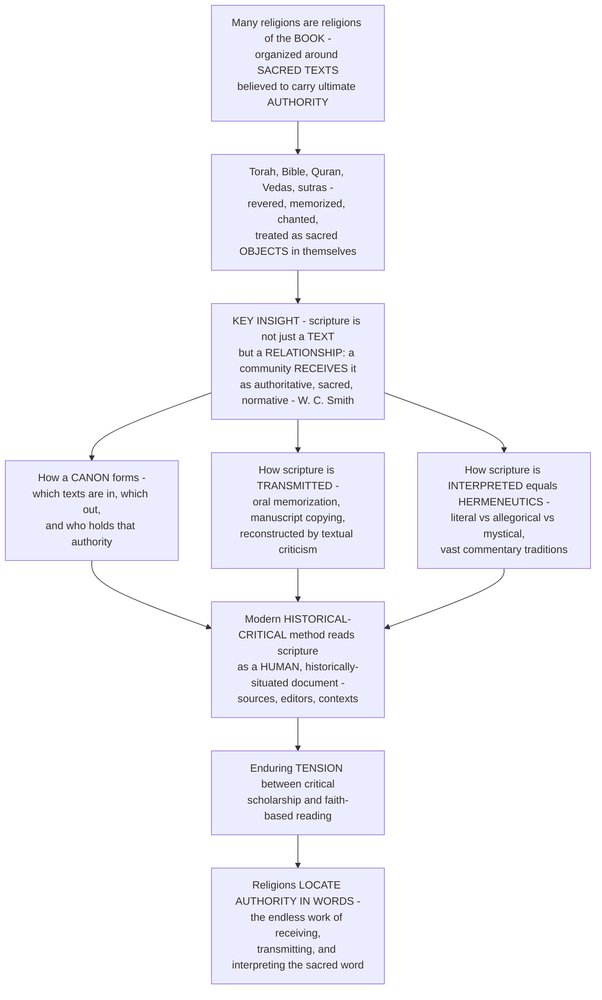

# 📜 Sacred Texts and Scripture

> [!abstract] TL;DR
> Many religions are **religions of the book** — organized around **sacred texts** believed to carry ultimate **authority**, whether as the literal Word of God, inspired wisdom, or the record of revelation. The Torah, Bible, Qur'an, Vedas, Buddhist sutras, and Analects are not read like ordinary books; they are **revered, memorized, chanted, copied with painstaking care, kissed, carried in procession, and treated as sacred objects in themselves**. The field's key insight (Wilfred Cantwell **Smith**) is that scripture is **not a property of the words but a relationship**: nothing is scripture *in itself* — a text *becomes* scripture through the way a community **receives and uses** it as authoritative, sacred, and normative. This raises the three great questions of scriptural religion: how a **canon** forms (which texts are in, and who decides), how scripture is **transmitted** (astonishing oral memorization, manuscript copying, and the **textual criticism** that reconstructs an archetype from variant witnesses), and above all how scripture is **interpreted** — since ancient, ambiguous, inexhaustible texts generate sophisticated **hermeneutics** (literal, allegorical, mystical) and vast commentary traditions. The modern **historical-critical method** — reading scripture as a human, historically situated document — revolutionized and sometimes traumatized traditions, and the tension between critical scholarship and faith-based reading persists.

---

## Intuition

**Analogy:** Picture two ways of handling a piece of writing. The first is how you treat a takeout menu or a text message: you read it once for information and throw it away, and you would not care if a word were misspelled or a line were slightly reworded. The second is how a devout community treats its scripture. A scribe washes before copying it and counts every letter so that not one is lost across a thousand years. A child spends years memorizing the *entire* text by heart until millions of people carry an identical copy in their minds. Worshippers stand when it is read, kiss its cover, chant it in a special voice, and process with it under a canopy. When a phrase is obscure, scholars write libraries of commentary on that single phrase, and still it is thought to hold more meaning. The *same marks on a page* are, in one case, disposable information and, in the other, the most precious and dangerous object in the room. That difference is the whole subject: **scripture is not a kind of book, it is a kind of relationship.**

This is the pivotal insight of religious studies, sharpened by Wilfred Cantwell **Smith** in *What Is Scripture?*: **nothing is scripture in and of itself.** "Scripture" is not a quality the words possess, like being written in Hebrew or containing a thousand verses; it is the *stance a community takes toward them* — receiving them as authoritative, sacred, and normative, using them in worship, law, and life. The Bhagavad Gita is scripture for a Hindu and world literature for a comparatist reading the same lines. So the field does not ask only "what does the text say?" but "how does a community *make* this text scripture?" — and three questions follow. First, how does a **canon** form? Communities had to *decide* which texts were in and which were out — a process of councils, consensus, contested "lost" gospels and apocrypha, and raw authority over who gets to decide (*canon* originally meant a measuring **rod**). Second, how is scripture **transmitted** across centuries without printing presses? The answers are staggering: the Vedas were preserved *orally* with mnemonic precision for millennia, millions of *ḥuffāẓ* memorize the entire Qur'an, and Masoretic scribes counted letters — while modern **textual criticism** reconstructs the "original" wording from thousands of variant manuscripts, building a family tree (a *stemma*) of copies. Third, and deepest, how is scripture **interpreted**? Because sacred texts are ancient, authoritative, ambiguous, and believed *inexhaustibly* meaningful, every tradition grows a sophisticated **[[Hermeneutics_and_Interpretation|hermeneutics]]** — literal versus allegorical versus mystical reading (the medieval *four senses*, the Jewish *PaRDeS*, Sufi and Kabbalistic esoteric reading) and enormous commentary traditions (the Talmud, *tafsīr*, biblical exegesis, *bhāṣya*). Finally, the modern **historical-critical method** — reading scripture as a *human, historically situated document* with sources, editors, and contexts — revolutionized and sometimes traumatized traditions, and the tension between the scholar's reading and the believer's reading (and the scriptural **fundamentalism** that reacts against it) is still live. To understand sacred texts is to understand how religions **locate authority in words** — and the endless, generative work of receiving, transmitting, and interpreting the sacred word.

---

## How It Works

### Core mechanics

1. **Scripture is a category, not a genre.** What unites the Torah, the Qur'an, the Vedas, and the Lotus Sutra is not literary form (they range from law code to lyric hymn to philosophical dialogue to narrative) but a *function*: a community invests them with ultimate **authority**, **sacrality**, and **normativity**. Smith's thesis follows: scripture is **relational**, not intrinsic — a text becomes scripture through reverence and use, and can *cease* to be scripture if a community stops relating to it that way.

2. **The material and ritual life of a text.** Because scripture is sacred, it acquires a bodily, ceremonial life: **chanting and cantillation**, **memorization**, **calligraphy and illumination**, veneration and enthronement (the Guru Granth Sahib is treated as a living Guru), the book as **talisman** and object of procession, and a central place in **[[Ritual_and_Religious_Practice|ritual]]** and worship. The recited/spoken word is often *primary* — William **Graham** showed that "scripture" is frequently an **oral** reality (Qur'an means "recitation") before and beneath the written page.

3. **A canon must be closed by someone.** A **canon** (Greek *kanōn*, "measuring rod") is the bounded set of texts a community accepts as authoritative. Canon **formation** is a historical and often political process — councils, scholarly consensus, and disputes that leave **apocrypha**, **pseudepigrapha**, and "lost" gospels (Nag Hammadi) *outside* the rod. Canons can be **closed** (fixed, as in rabbinic Judaism or Sunni Islam) or comparatively **open** (the sprawling Mahāyāna sutra corpus), and *who* controls the canon is inseparable from *who* holds religious authority.

4. **Transmission fights entropy with fidelity.** Preserving a text across centuries is a war against copying error. Sacred-text cultures win it with extraordinary **high-fidelity** techniques: **oral** memorization with cross-checking recitation (the Vedic *pāṭha* permutations, the Qur'anic *ḥāfiẓ* system), meticulous **scribal** discipline (the Masoretes counting letters and words), and multiple parallel copies. When variants nonetheless accumulate, **textual criticism** compares surviving **witnesses** to reconstruct the **archetype**, arranging manuscripts into a family tree — a **stemma** — much as [[Historical_Linguistics_Methods|comparative philology]] reconstructs a proto-language from descendants.

5. **Interpretation is endless because the text is inexhaustible.** A scripture is ancient (its world is gone), authoritative (it *must* be made to speak to the present), ambiguous (its words underdetermine meaning), and believed *infinitely* meaningful. So each tradition develops **levels of meaning** — literal/*peshat*, allegorical, moral, and mystical/anagogical (the medieval **four senses**; the Jewish **PaRDeS**; the Sufi/Kabbalistic *bāṭin* "inner" versus *ẓāhir* "outer") — and vast **commentary** traditions (Talmud and Midrash, *tafsīr*, patristic and scholastic exegesis, Sanskrit *bhāṣya*) that are themselves quasi-scriptural.

6. **The modern turn: scripture as a human document.** The **historical-critical method** brackets the question of divine authorship and reads scripture like any ancient text — reconstructing its **sources** (the Documentary Hypothesis for the Torah), oral **forms**, and editorial **redaction**, and situating it in history (the "quest for the historical Jesus," critical Qur'anic studies). This revolutionized scholarship and disrupted traditions, producing the enduring **confessional-versus-critical** tension and, in reaction, scriptural **literalism**, **inerrancy**, and fundamentalism.

### Flow



---

## Key Concepts

### Secondary (the core idea)

- **Scripture = a sacred, authoritative text.** A scripture is a writing (or recitation) that a religious community treats as holy and binding — the source of truth, law, and story. Many religions are **"religions of the book,"** built around one: Judaism the **Torah/Tanakh**, Christianity the **Bible**, Islam the **Qur'an**, Hinduism the **Vedas** and **Bhagavad Gita**, Buddhism the **sutras**, Sikhism the **Guru Granth Sahib**.
- **Not read like ordinary books.** Scriptures are **revered, memorized, chanted, beautifully copied, and treated as sacred objects** — kissed, carried in procession, placed above other books. How you *handle* the text shows it is scripture.
- **Scripture is a relationship, not just words.** The same lines can be scripture for a believer and just literature for someone else. What makes a text scripture is how a **community receives and uses** it — a point associated with Wilfred Cantwell **Smith**.
- **Three big questions.** (1) **Canon** — which texts got *in*, and who decided? (2) **Transmission** — how were they preserved so accurately for so long? (3) **Interpretation** — what do the ancient, ambiguous words *mean*, and who gets to say?

### Undergraduate (mechanisms, traditions, and debates)

- **Smith's relational thesis.** In *What Is Scripture? A Comparative Approach*, **Wilfred Cantwell Smith** argues that "scripture" names a **human activity**, not a class of texts: *nothing is scripture in itself.* A text is scripture only within a community's relation to it — a comparative, cross-cultural category that lets us set the Qur'an, the Vedas, and the Gospels side by side.
- **The world's scriptures (a survey).** The **Tanakh** and the **Talmud** ([[Judaism_and_the_Covenant_Tradition|Judaism]]); the Christian **Bible**, Old and New Testaments ([[Christianity_and_the_Christian_Traditions|Christianity]]); the **Qur'an** and **Hadith** ([[Islam_and_the_Islamic_Tradition|Islam]]); the Hindu **Vedas, Upaniṣads, Bhagavad Gita**, and epics, sorted as **śruti** ("that which is heard," eternal revelation) versus **smṛti** ("that which is remembered," authored tradition — [[Hinduism_and_the_Dharmic_Traditions|Hinduism]]); the Buddhist **Tripiṭaka** and Mahāyāna **sutras** (the Pali Canon and beyond — [[Buddhism_and_the_Path_to_Liberation|Buddhism]]); the Daoist and Confucian classics, the **Dao De Jing** and **Analects** ([[East_Asian_and_Indigenous_Religions|East Asian traditions]]); and the Sikh **Guru Granth Sahib**.
- **Revelation, inspiration, authorship.** Traditions differ on *how* a text is divine: **dictation** (the Qur'an as the literal, uncreated speech of God, hence its doctrine of **untranslatability** — a translation is only an "interpretation of the meanings"), **inspiration** (the biblical authors moved by the Spirit yet writing in their own idiom), or **inspired human composition** and canonical teaching. This spectrum runs from an exclusive "Word of God" to inspired wisdom.
- **Canon and its politics.** **Canonization** decides authority. Study the New Testament canon debates and Marcion, the fixing of the Hebrew Bible, the status of the **Apocrypha/Deuterocanon** (in vs out for different churches), **pseudepigrapha** (works attributed to ancient worthies), and "lost" texts (the **Nag Hammadi** gospels). Canon is entangled with **power**: whoever controls the canon and its interpretation — clergy, scholars, schools — controls authority.
- **Transmission and textual criticism.** **Oral** transmission (the mnemonically encoded Vedas, the oral Torah, the Qur'anic *ḥuffāẓ*); **manuscript** cultures (Masoretes, monastic *scriptoria*); **translation** and its theology (the **Septuagint**, the **Vulgate**). **Textual criticism** (Bart **Ehrman**'s *Misquoting Jesus*) reconstructs earlier readings from **variants** across witnesses — the **Dead Sea Scrolls** pushed the manuscript record of the Hebrew Bible a thousand years earlier.
- **Levels of meaning and commentary.** The medieval **four senses** (literal, allegorical, moral/tropological, anagogical/mystical) and the Jewish **PaRDeS** (*peshat*, *remez*, *derash*, *sod*); **Sufi** and **Kabbalistic** esoteric reading (*bāṭin* vs *ẓāhir*). Commentary is a genre unto itself: **Talmud/Midrash**, **tafsīr**, patristic/scholastic **exegesis**, and Hindu **bhāṣya**. Interpretation is the *heart* of scriptural religion, and it is inseparable from the general theory of **[[Hermeneutics_and_Interpretation|hermeneutics]]** developed in the humanities.
- **The historical-critical method.** Reading scripture as a **human, historically situated** document: **source, form, redaction, historical, and literary** criticism. Its impact was revolutionary and often disruptive — this is the modern watershed, treated in the vault's **Methods_in_the_Study_of_Religion**.

### Graduate (the deep debates)

- **What kind of thing is scripture?** Smith's move dissolves the essentialist question ("which properties make a text scripture?") into a functional, relational one, but it raises hard follow-ups: Is *scripturality* graded (some texts more scripture than others)? Can we compare the *relations* across traditions without smuggling in a Protestant, print-centric, canon-and-belief template? **Miriam Levering**'s *Rethinking Scripture* pushes the comparative program toward **reception** and use rather than content.
- **Orality against the printed page.** William **Graham** (*Beyond the Written Word*) argues that Western, post-Gutenberg scholarship over-textualized scripture and missed its **oral/aural** primacy — recitation, sound, memorization, and performance. The recited Qur'an and the chanted Veda are not degraded oral versions of a "real" written text; the sonic performance *is* the scripture, which reframes transmission, translation, and authority.
- **Stemmatics and the archetype.** Classical textual criticism (Lachmann) builds a **stemma codicum** from shared errors to reconstruct the archetype, but the method's assumptions — no contamination, a single original — are contested. **New Philology** and the study of "living texts" argue that variance *is* the tradition (there was never one pristine autograph of many scriptures), which destabilizes the goal of recovering *the* original wording — a tension with the theological premise of a fixed revealed text.
- **Peshat to sod, ẓāhir to bāṭin.** Esoteric hermeneutics claim the surface (*peshat*/*ẓāhir*) conceals inexhaustible inner meaning (*sod*/*bāṭin*), licensing allegorical and mystical reading. This raises the classic problem of **interpretive constraint**: if a text can mean anything, does it mean nothing? Traditions answer with an **interpretive community**, an authoritative chain of transmission (*isnād*, *paramparā*), and rules of exegesis that discipline proliferation.
- **The confessional-critical fault line.** The historical-critical method's separation of "what the text meant" from "what it means" (Krister Stendahl) institutionalized a split between **academic** and **devotional** reading. **James Kugel** (*How to Read the Bible*) dramatizes the collision between the ancient interpreters' assumptions (the text is cryptic, perfect, divinely relevant) and modern scholarship's (it is composite, human, time-bound) — and asks whether the two readings can coexist.
- **Fundamentalism as a modern hermeneutic.** Scriptural **literalism** and **inerrancy** are not the pre-modern default but a *modern* reaction to historical criticism and secular modernity (treated in the vault's **Fundamentalism_and_Religious_Revival**). Meanwhile scripture grounds **law and ethics** — halakha, sharia, canon law — so hermeneutics has direct normative stakes (see the vault's **Ethics_and_Religious_Law**). The **digital age** adds new modes of access (searchable corpora, apps, AI exegesis) that quietly reshape authority and the community-text relation Smith described.

---

## Python Demo

```python
# Sacred Texts and Scripture — two dramatizations of how communities MAKE scripture:
#   (a) TRANSMISSION FIDELITY: copy a text across many generations of scribes/
#       reciters with a per-copy error rate. Compare (i) CASUAL copying (errors
#       accumulate -> textual drift/variants) vs (ii) HIGH-FIDELITY sacred
#       transmission (memorization checks, error-correction, parallel copies with
#       majority voting -- like the Masoretes or the Qur'anic hafiz system), which
#       dramatically SUPPRESSES drift. This is why sacred-text cultures preserve so
#       well, and why textual criticism can reconstruct an archetype from variants.
#   (b) INTERPRETIVE DIVERGENCE: one ambiguous verse spawns multiple readings
#       (literal / allegorical / moral / mystical) that DIVERGE and multiply across
#       commentary generations -- a branching interpretation tree -- with an
#       "interpretive community" ceiling that constrains proliferation. Compare a
#       LITERALIST tradition (low latitude) vs an ESOTERIC tradition (high latitude).
import numpy as np
import matplotlib.pyplot as plt

rng = np.random.default_rng(2)

# ---------------------------------------------------------------------------
# (a) Transmission fidelity: accumulation of textual variants over generations
# ---------------------------------------------------------------------------
N_gen  = 60          # generations of copying / recitation
trials = 500         # independent manuscript lineages
mu     = 2.0         # expected RAW copying errors introduced per generation

raw = rng.poisson(mu, size=(trials, N_gen))          # errors born each generation

# (i) casual copying: every error accumulates as a permanent variant
casual = np.cumsum(raw, axis=1)

# (ii) high-fidelity sacred transmission: memorization cross-checks + majority
#      voting across parallel copies catch ~95% of errors before they propagate
p_catch  = 0.95
survivors = rng.binomial(raw, 1.0 - p_catch)          # only uncaught errors persist
sacred    = np.cumsum(survivors, axis=1)

gens = np.arange(1, N_gen + 1)
casual_mean, casual_sd = casual.mean(0), casual.std(0)
sacred_mean, sacred_sd = sacred.mean(0), sacred.std(0)

# ---------------------------------------------------------------------------
# (b) Interpretive divergence: distinct readings vs commentary generation
#     logistic growth from a single verse toward a community-imposed ceiling
# ---------------------------------------------------------------------------
cg = np.arange(0, 13)                                 # commentary generations

def divergence(rate, ceiling):
    # logistic: starts at 1 reading, multiplies at `rate`, saturates at `ceiling`
    return ceiling / (1.0 + (ceiling - 1.0) * np.exp(-rate * cg))

literalist = divergence(rate=0.55, ceiling=6)         # low latitude, tight community
esoteric   = divergence(rate=0.95, ceiling=64)        # high latitude, batin/sod reading

# ---------------------------------------------------------------------------
print(f"After {N_gen} generations -- casual copying: {casual_mean[-1]:.0f} variants; "
      f"high-fidelity: {sacred_mean[-1]:.0f} variants "
      f"({casual_mean[-1] / max(sacred_mean[-1], 1e-9):.0f}x fewer under sacred transmission)")
print(f"Distinct readings by commentary gen {cg[-1]} -- "
      f"literalist: {literalist[-1]:.0f}; esoteric: {esoteric[-1]:.0f}")

# ---------------------------------------------------------------------------
# Plot
# ---------------------------------------------------------------------------
fig, (ax1, ax2) = plt.subplots(1, 2, figsize=(15, 6))

# (a) transmission fidelity
ax1.plot(gens, casual_mean, lw=2.6, color="firebrick",
         label="Casual copying (drift accumulates)")
ax1.fill_between(gens, casual_mean - casual_sd, casual_mean + casual_sd,
                 color="firebrick", alpha=0.15)
ax1.plot(gens, sacred_mean, lw=2.6, color="navy",
         label="High-fidelity sacred transmission")
ax1.fill_between(gens, sacred_mean - sacred_sd, sacred_mean + sacred_sd,
                 color="navy", alpha=0.15)
ax1.set_title("(a) Textual transmission: variants accumulate over generations\n"
              "memorization + error-correction suppress drift (the Masoretic / hafiz feat)",
              fontsize=10)
ax1.set_xlabel("Generations of copying / recitation")
ax1.set_ylabel("Accumulated textual variants (distance from archetype)")
ax1.legend(fontsize=8, loc="upper left")

# (b) interpretive divergence
ax2.plot(cg, esoteric, "o-", lw=2.6, color="darkorange",
         label="Esoteric tradition (allegorical / batin / sod)")
ax2.plot(cg, literalist, "s-", lw=2.6, color="steelblue",
         label="Literalist tradition (peshat / zahir)")
ax2.axhline(4, color="gray", ls=":", lw=1.4)
ax2.text(0.2, 4.4, "the medieval 'four senses' (literal / allegorical / moral / mystical)",
         fontsize=8, color="gray")
ax2.set_yscale("log")
ax2.set_title("(b) Interpretive divergence: one verse -> many readings\n"
              "commentary branches and multiplies, capped by the interpretive community",
              fontsize=10)
ax2.set_xlabel("Commentary generations")
ax2.set_ylabel("Distinct interpretations (log scale)")
ax2.legend(fontsize=8, loc="lower right")

plt.tight_layout()
plt.savefig("sacred_texts_and_scripture.png", dpi=120, bbox_inches="tight")
plt.show()
```

**What it shows.** Panel (a): under **casual copying**, small per-generation errors *accumulate* into a widening cloud of textual **variants** — the manuscript tradition **drifts** away from any original (a random walk with a broad uncertainty band). Under **high-fidelity sacred transmission** — the memorization cross-checks, letter-counting, and parallel-copy majority voting of Masoretic scribes and Qur'anic *ḥuffāẓ* — most errors are caught before they propagate, so the variant count stays *nearly flat* over the same sixty generations (often an order of magnitude fewer variants). This is the quantitative shadow of a real historical achievement, and it is exactly what makes **textual criticism** possible: because drift is bounded and structured, scholars can compare surviving witnesses and reconstruct the **archetype** (a *stemma*). Panel (b): a single ambiguous verse does not stay single. Across **commentary generations** the number of distinct **interpretations** grows — slowly and to a low ceiling in a **literalist** tradition that reads only the plain sense (*peshat/ẓāhir*), explosively and to a high ceiling in an **esoteric** tradition that licenses allegorical and mystical reading (*sod/bāṭin*) — but always *bounded* by the interpretive community rather than proliferating without limit. The dotted line marks the classic **four senses**: interpretation is inexhaustible, yet traditions discipline it into recognizable levels.

---

## Real-World Applications

> **Example — the Masoretes and the Aleppo Codex:** Between roughly the 7th and 10th centuries CE, the **Masoretes** of Tiberias standardized the Hebrew Bible with an obsessive apparatus designed to defeat exactly the drift modeled in panel (a). They fixed the consonantal text, added vowel and cantillation marks, and wrote a marginal **Masorah** that *counted* the letters, words, and verses of each book, flagged the middle letter of the Torah, and recorded every unusual spelling — so that any copying error would be caught by the count. The **Aleppo Codex** (c. 930 CE) became the model manuscript. The astonishing payoff appeared in 1947: when the **Dead Sea Scrolls** pushed the manuscript record back a thousand years, the great Isaiah scroll matched the Masoretic text with remarkable fidelity — empirical proof that a sacred-text culture can hold a text nearly stable across a millennium. This is scripture as *relationship* in action: the sanctity of the words motivated an entire technology of preservation.

- **Textual criticism and the "original" New Testament.** Because there is no autograph of any biblical book, scholars collate thousands of Greek manuscripts, versions, and patristic citations to reconstruct earlier readings — the work Bart **Ehrman** popularized. Famous cases (the ending of Mark, the woman taken in adultery, the *Comma Johanneum*) show how **variants** carry theological weight, directly connecting to error-and-correction reasoning shared with [[Error_Correcting_Codes_Fundamentals|coding theory]] and the reconstruction logic of [[Historical_Linguistics_Methods|comparative philology]].
- **Canon debates as institutional history.** Which books count as scripture is decided by communities and councils; the status of the **Deuterocanon/Apocrypha** still divides Catholic, Orthodox, and Protestant Bibles, a direct legacy of the [[The_Protestant_Reformation|Reformation]]'s *sola scriptura* and its re-drawing of the canon.
- **Translation as theology and politics.** The **Septuagint**, **Vulgate**, Luther's German Bible, and the **King James Version** each reshaped a tradition; Islam's doctrine that the Qur'an is untranslatable makes Arabic itself sacramental — a live case study in [[Translation_and_Interpretation|translation theory]].
- **Print, mass literacy, and reading revolutions.** The [[The_Printing_Revolution|printing revolution]] made scripture cheap and personal, fueling the Reformation's "priesthood of all believers" and, later, the very possibility of individual literal reading that fundamentalism assumes.
- **Scripture as world literature.** Read comparatively, sacred texts sit alongside the [[Ancient_Literature_and_Epic|ancient epics]] and are studied with the same tools of [[Close_Reading_and_Textual_Analysis|close reading]] and [[Intertextuality_and_Allusion|intertextuality]] — even as, for their communities, they remain something categorically more.

---

## Common Pitfalls

- **Treating scripture as an essence rather than a relationship.** The deepest error is thinking "scripture" is a property of certain words. Smith's point is that the *same* text is scripture for one community and literature for another; scripturality lives in **reception and use**, not ink. Miss this and comparison collapses into listing books.
- **Importing a Protestant, print, canon-centric template.** Assuming every religion has *one closed book* read privately for *doctrine* distorts traditions where scripture is plural, open, primarily **oral/recited**, and oriented to *practice* (Hindu śruti, the vast Buddhist canons, Qur'anic recitation). Graham's oral-aural corrective matters here.
- **Confusing the written text with the "real" scripture.** For much of history the recited, memorized word was primary; treating the manuscript as the authentic object and recitation as a copy inverts the tradition's own hierarchy.
- **Assuming a single pristine original.** The theological premise of one perfect autograph collides with the manuscript reality of pervasive **variance**. New Philology warns that for many texts *there never was* a single original — recovering "the" original wording may be reconstructing a fiction.
- **Reading literalism into the past.** Modern **inerrancy and literalism** are a *reaction* to historical criticism, not the ancient default; pre-modern exegetes reveled in multiple senses. Projecting fundamentalist reading backward misrepresents the history of interpretation.
- **Mistaking critical distance for hostility (or piety for stupidity).** The confessional-critical tension is real, but the historical-critical method is a *method*, not an anti-religious verdict, and devotional reading is not naïve. Flattening either side blocks understanding of both — and of why the tension persists.
- **Letting esoteric reading mean "anything goes."** *Bāṭin/sod* hermeneutics are not unconstrained; they operate inside an **interpretive community** with chains of authority and rules. Ignoring those constraints turns a disciplined tradition into a caricature.

---

## Related Concepts

- [[Defining_Religion_and_the_Sacred]] — the sacred/profane frame that explains why a *text* can become a hierophany and be handled as a sacred object.
- [[The_Comparative_Study_of_Religion]] — the comparative program that makes "scripture" a cross-traditional category rather than a Christian-specific one.
- [[Phenomenology_of_Religion]] — scripture as an object of reverence and manifestation of the sacred, read through the phenomenological lens.
- [[Ritual_and_Religious_Practice]] — the chanting, procession, and veneration that constitute scripture's *ritual* life; scripture is enacted, not only read.
- [[Judaism_and_the_Covenant_Tradition]] — Torah, Tanakh, the oral Torah, and the Talmud/Midrash commentary tradition and PaRDeS.
- [[Christianity_and_the_Christian_Traditions]] — the two-testament Bible, canon formation, and the exegetical tradition from the Church Fathers onward.
- [[Islam_and_the_Islamic_Tradition]] — the Qur'an as dictated, uncreated, untranslatable Word, the ḥāfiẓ system, Hadith, and tafsīr.
- [[Hinduism_and_the_Dharmic_Traditions]] — śruti vs smṛti, the orally preserved Vedas, and the Upaniṣads, Gita, and epics.
- [[Buddhism_and_the_Path_to_Liberation]] — the Tripiṭaka and Mahāyāna sutras and the relatively open Buddhist canon.
- [[East_Asian_and_Indigenous_Religions]] — the Confucian and Daoist classics (Analects, Dao De Jing) as authoritative canonical teaching.
- [[Hermeneutics_and_Interpretation]] — the general theory of interpretation that *grew out of* biblical exegesis (Schleiermacher, Dilthey, Gadamer, Ricoeur); the humanities side of scriptural reading.
- [[The_Reader_and_Reception]] — reception theory, the interpretive community, and why meaning is realized in the reader — the literary parallel to Smith's relational thesis.
- [[Intertextuality_and_Allusion]] — how scriptures cite, rewrite, and echo one another (the New Testament reading the Hebrew Bible), a core exegetical dynamic.
- [[Close_Reading_and_Textual_Analysis]] — the disciplined attention to wording that both critical scholars and traditional exegetes practice on the sacred text.
- [[Ancient_Literature_and_Epic]] — scripture read as ancient literature, alongside Gilgamesh, the Homeric epics, and the Mahābhārata.
- [[Historical_Linguistics_Methods]] — comparative reconstruction and the stemma/family-tree logic that textual criticism shares with philology.
- [[Translation_and_Interpretation]] — the theory and stakes of rendering a sacred text across languages (Septuagint, Vulgate, Qur'anic untranslatability).
- [[The_Printing_Revolution]] — how print transformed access to scripture and enabled the Reformation and mass private reading.
- [[The_Protestant_Reformation]] — *sola scriptura*, vernacular Bibles, and the re-drawing of the canon that still shapes scriptural authority.
- [[Cuneiform_and_the_Code_of_Hammurabi]] — the origins of writing and the earliest authoritative written texts, the deep background to scripture.
- [[Error_Correcting_Codes_Fundamentals]] — the information-theoretic logic of catching and correcting copying errors that models high-fidelity transmission in panel (a).

*Sibling notes in this section (Ritual, Myth, and the Sacred) develop adjacent threads prose-first: **Ritual_and_Religious_Practice** covers the chanting, recitation, and veneration that give scripture its ceremonial life; **Myth_and_Sacred_Narrative** treats the sacred stories that scriptures narrate and the primacy of the spoken/recited word; **Methods_in_the_Study_of_Religion** situates the historical-critical method within the discipline's toolkit; **Theology_and_Religious_Doctrine** follows how doctrine is derived from and read back into scripture; **Ethics_and_Religious_Law** traces the derivation of norms (halakha, sharia, canon law) from the sacred text; and **Fundamentalism_and_Religious_Revival** examines literalism, inerrancy, and the modern reaction against critical scholarship.*

---

## Review Questions

**Secondary.** What is a "scripture," and how is the way a devout community treats its scripture different from how you read an ordinary book? Name three "religions of the book" and their central sacred texts, and give one example of a way scriptures are treated as sacred objects.

**Undergraduate.** Explain Wilfred Cantwell Smith's claim that "nothing is scripture in itself." Using two different traditions, show how the *same kind of object* (a text) is made scripture by a community's relationship to it. Then walk through the three problems of canon, transmission, and interpretation for one specific scripture (e.g., the Qur'an or the Hebrew Bible), naming the concrete mechanisms each tradition uses (memorization, scribal discipline, commentary, levels of meaning).

**Graduate.** The historical-critical method reads scripture as a human, historically situated document, while the tradition receives it as revealed and inexhaustibly meaningful. Reconstruct both stances, relate them to (a) the stemmatic goal of recovering an "original" versus the New Philology claim that variance *is* the tradition, and (b) James Kugel's contrast between ancient and modern interpretive assumptions. Can a single reader hold both readings at once — and what does your answer imply for how a secular field should study sacred texts without either flattening the believer's relationship or surrendering critical distance?

---

## Sources

- [Wilfred Cantwell Smith, *What Is Scripture? A Comparative Approach* (1993)](https://en.wikipedia.org/wiki/What_Is_Scripture%3F)
- [William A. Graham, *Beyond the Written Word: Oral Aspects of Scripture in the History of Religion* (1987)](https://en.wikipedia.org/wiki/William_A._Graham)
- [Bart D. Ehrman, *Misquoting Jesus: The Story Behind Who Changed the Bible and Why* (2005)](https://en.wikipedia.org/wiki/Misquoting_Jesus)
- [James L. Kugel, *How to Read the Bible: A Guide to Scripture, Then and Now* (2007)](https://en.wikipedia.org/wiki/How_to_Read_the_Bible)
- [Miriam Levering (ed.), *Rethinking Scripture: Essays from a Comparative Perspective* (1989)](https://www.sunypress.edu/p-655-rethinking-scripture.aspx)

---

#religious-studies #sacred-texts #scripture #canon #hermeneutics
