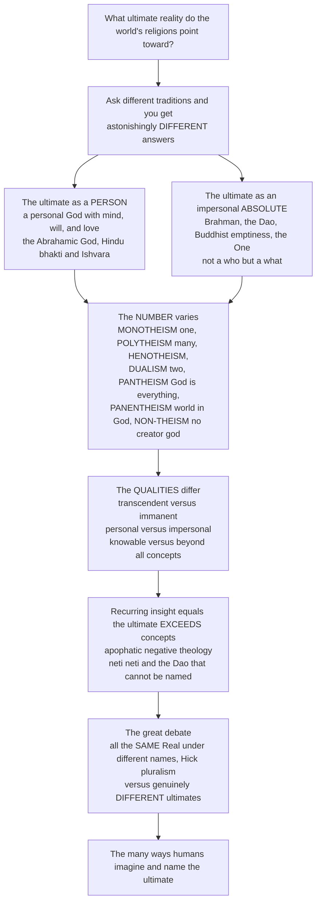

# ♾️ Concepts of the Divine and Ultimate Reality

> [!abstract] TL;DR
> Ask the world's religions what **ultimate reality** they point toward and you get astonishingly *different* answers — one of the most fascinating maps in all of religious studies. Some conceive the ultimate as a **PERSON**: a personal God with mind, will, and love who creates, commands, and relates to us (the God of Judaism, Christianity, Islam, Hindu **bhakti**). Others conceive it as an impersonal **ABSOLUTE** — not a "who" but a "what": **Brahman** (the infinite ground of being in Advaita), the **Dao** (the ineffable Way), Buddhist **emptiness/suchness**, the Neoplatonic **One**. The *number* varies wildly: **monotheism** (one God), **polytheism** (many gods), and in between **henotheism**, **dualism**, **pantheism** (God *is* everything), **panentheism** (the world is *in* God but God exceeds it), and even **non-theism** (traditions like early Buddhism and Confucianism that function without a creator god). So do the *qualities*: is the ultimate **transcendent** (beyond the world) or **immanent** (within it), personal or impersonal, knowable or beyond all concepts? A profound recurring insight is that ultimate reality **exceeds human concepts and language** — hence the **apophatic** ("negative") theology found across traditions: the Upanishadic *neti neti* ("not this, not this"), "the Dao that can be named is not the eternal Dao," the *cloud of unknowing*. And comparativists still debate whether all these point to the **same** Real under different names (John **Hick's** pluralism) or to genuinely **different** ultimates. Concepts of the divine are the central object of religious thought and the deepest axis of difference — and possible unity — among the world's faiths.

---

## Intuition

**Analogy:** Imagine assembling explorers who have each spent a lifetime facing a single, unreachable summit hidden in cloud, and asking each to *describe the peak*. One says it is a **someone** — a face turned toward us, a will that calls and loves and judges. Another says it is not a someone at all but a **something** — a boundless ground out of which everything flows, no more a "person" than the ocean is a fish. A third counts **one** summit; a fourth insists there are **many** peaks; a fifth says the whole mountain range *is* the divine; a sixth says there is no peak to reach, only a path to walk. And the wisest of them, when pressed for the summit's true shape, fall silent and say only what it is **not** — *not this, not that* — because, they insist, the peak is larger than any word thrown at it. The startling thing is that they are all, plausibly, pointing at the *same cloud-wrapped height* — or are they pointing at different mountains entirely?

That is the situation of the world's religions before **ultimate reality**. This note is the map of their answers. It is *not* an argument for or against any of them (that is the philosopher's job) — it is the comparativist's atlas of how humanity has **imagined and named the ultimate**: as personal God or impersonal absolute; as one, many, all, or none; as beyond the world or within it; as speakable or forever exceeding speech. Getting this map straight is the first move in all religious thought, because almost every other disagreement between traditions — about salvation, ethics, ritual, and revelation — flows downstream from what they take the ultimate *to be*.

---

## How It Works

Concepts of the divine sort along a few great **axes of variation**. Start from the one question every tradition answers, then watch it fan out: is the ultimate a *person* or an *absolute*? How *many*? *Where* is it — beyond the world or within it? Can it be *spoken*? And finally, the meta-question the comparativist cannot escape: are all these answers about the **same** reality or different ones? The diagram traces that fan-out from the single question to the great pluralism debate.



**The mechanics, axis by axis:**

1. **The ultimate as the object of religion.** Whatever else a religion does — ritual, ethics, community, story — it *orients* toward something it takes to be ultimate: the sacred, the divine, the transcendent, "ultimate reality." Concepts of the divine are simply the many ways of specifying *what that something is*.
2. **Person vs absolute (the deepest axis).** Is the ultimate a **who** — an agent with mind, will, and love, whom one can address, obey, and be loved by — or a **what**: an impersonal principle, ground, or reality that has no face and issues no commands, but which the self can *realize* or *merge with*?
3. **The number and structure.** Traditions differ on *how many* and *where*: one God, many gods, one-among-many, two warring principles, the divine identified with the cosmos, the cosmos held within a God who exceeds it, or no creator god at all.
4. **The attributes.** Is the ultimate **transcendent** (wholly beyond the world), **immanent** (present within it), or both? Omnipotent, omniscient, all-good, eternal, simple? Personal in love and justice, or beyond all such predicates?
5. **The ineffable.** A recurring discovery across traditions is that the ultimate **overflows every concept** applied to it. This drives *apophatic* ("negative") theology — approaching the divine by saying what it is *not* — and the reliance on **symbol, analogy, and metaphor** as the only available speech.
6. **Same or different?** Finally, the comparativist asks whether these strikingly different concepts are culturally-shaped responses to *one* ineffable reality (pluralism) or genuinely *different* ultimates (the difference view) — the question that governs how the whole map is read.

---

## Key Concepts

### 🟢 Secondary — the basic map of the ultimate

- **Every religion points at an "ultimate."** Call it the divine, the sacred, ultimate reality, or the transcendent — it is *what the religion is about*. Concepts of the divine are the different pictures traditions paint of it.
- **A person, or a "something"?** Some traditions see the ultimate as a **personal God** — a being with mind, will, and love you can pray to and be loved by (the God of Judaism, Christianity, and Islam; the beloved Lord of Hindu devotion). Others see it as an **impersonal absolute** — not a "who" but a boundless reality or principle: **Brahman**, the **Dao**, Buddhist **emptiness**.
- **How many?** **Monotheism** worships *one* God; **polytheism** honors *many* gods; **pantheism** says the whole universe *is* divine; and some traditions (much of Buddhism, Confucianism) get along with **no creator god at all** (non-theism).
- **Beyond the world, or within it?** A **transcendent** God is utterly *beyond* and *other than* the world; an **immanent** divine is *present inside* it — in nature, in the self, in everything. Many traditions want *both*.
- **Beyond words.** A deep and widespread idea: the ultimate is *bigger than any word we use for it*. So the Upanishads say **neti neti** ("not this, not this"), the Daoists say the Dao that can be named is not the *real* Dao, and Christian mystics speak of a "cloud of unknowing." We point; we do not capture.

### 🟡 Undergraduate — the full typology

**Personal vs impersonal ultimates.** This is the field's most important single distinction.

- **The ultimate as a personal God (theism).** A being with **mind, will, agency, love, and relationship** — creator, lawgiver, judge, and beloved. This is the God of the Abrahamic faiths and of Hindu **bhakti**, where the ultimate is **saguna Brahman** / **Ishvara** — Brahman *with qualities*, a Lord one can adore.
- **The ultimate as an impersonal absolute.** Not a "who" but the ultimate *principle* or *ground of being*: **nirguna Brahman** (Brahman *without* qualities, in Advaita Vedanta), the **Dao** (the nameless Way), Buddhist **sunyata** (emptiness) and **tathata** (suchness), the Neoplatonic **One**, the mystics' "Godhead" beyond God. The **saguna/nirguna** distinction — the same ultimate seen *with* or *without* qualities — is the classic bridge between the two.

**The number and structure of the divine (the theistic typology):**

| Type | Core idea | Examples |
|---|---|---|
| **Monotheism** | One and only God | Judaism, Christianity, Islam |
| **Polytheism** | Many gods | Greek, Norse, Vedic, many indigenous traditions |
| **Henotheism / kathenotheism** | Worship of one god without denying others (Müller's coinage) | Vedic religion |
| **Monolatry** | Many gods exist; only one is *worshipped* | Early Israelite religion (on some readings) |
| **Dualism** | Two cosmic principles (good vs evil) | Zoroastrianism, Manichaeism |
| **Pantheism** | God *is* the cosmos; all is divine | Spinoza, some strands of Hinduism |
| **Panentheism** | The world is *in* God, but God *exceeds* it | Some Christian and Hindu theologies |
| **Deism** | A creator who does *not* intervene | Enlightenment natural religion |
| **Animism / spirits** | The world is filled with animating spirits | Indigenous and folk traditions |
| **Non-theism / transtheism** | Ultimate reality *without* a creator god | Theravada Buddhism, Jainism, Confucianism |

Note the **complex monotheisms**: Christian **Trinity** (one God in three "persons") shows that "one" can be internally rich, not simple arithmetic.

**The attributes of the divine.** Traditions ascribe different *qualities* to the ultimate:

- **Transcendence vs immanence** — beyond the world, present within it, or (most often) both.
- **The classical "omni" attributes** — omnipotence, omniscience, omnibenevolence, plus eternity, **aseity** (self-existence), **simplicity** (no parts), and immutability — the package of "**classical theism**" worked out in philosophy of religion.
- **Personal qualities** — love, justice, mercy, wrath, holiness — ascribed to personal Gods.
- **Anthropomorphism vs its rejection** — depicting the divine in human form, versus **aniconism** (no images) in Islam and Judaism, which guards transcendence.
- **Gender and the divine** — God the Father, the Goddess / **Shakti**, or a divine explicitly *beyond* gender.

**The ineffable and negative theology.** The recurring insight that the ultimate *exceeds* concepts drives a distinctive style of God-talk:

- **Apophatic (negative) theology** — the **via negativa**: we know the ultimate only by *negation*, saying what it is *not*. Its great voices are **Pseudo-Dionysius**, **Maimonides** (positive attributes threaten God's absolute unity, so read them as negations), and the anonymous *Cloud of Unknowing*.
- **Cataphatic (positive) theology** — the complementary path of *affirmation* (God *is* good, wise, loving) — always aware its terms are stretched.
- **The great apophatic sayings** — the Upanishadic **neti neti**, the unnameable **Dao**, and the Buddhist refusal to conceptualize **nirvana**.
- **Symbol, analogy, and metaphor** — the only access to what literal language cannot hold — and Rudolf **Otto's** "the holy" as the *mysterium tremendum et fascinans*, the "**wholly other**" that awes and allures beyond all reason.

### 🔴 Graduate — the comparative and pluralist question

**"In itself" vs "as conceived."** The sharpest analytic move distinguishes the ultimate **as it is in itself** from the ultimate **as humanly conceived and named**. Negative theology already implies this gap; the modern pluralists make it the hinge of a whole theory.

**Religious pluralism (John Hick).** In *An Interpretation of Religion* (1989), Hick argues that all the great traditions are **culturally-conditioned responses to the same ultimate reality**, which he names, neutrally, "**the Real**." Borrowing **Kant's** distinction between the *noumenon* (a thing as it is in itself) and the *phenomenon* (as it appears to us), Hick holds that the **Real *an sich*** is ineffable and beyond all our categories — neither personal nor impersonal, neither one nor many — while the *personae* (personal God-images: Yahweh, Allah, Vishnu, the Trinity) and *impersonae* (Brahman, the Dao, emptiness) are how the single Real is **humanly experienced through different cultural "lenses."** His image is the **elephant and the blind men**: each grasps a real part; none grasps the whole. "One Real, many manifestations."

**Exclusivism, inclusivism, pluralism (the theology of religions).** The standard typology of stances on religious diversity:

- **Exclusivism** — only *one* tradition's conception (and salvation) is true.
- **Inclusivism** — one tradition is the fullest truth, but others *participate* in it (e.g., Rahner's "anonymous Christians").
- **Pluralism** — all are valid, equally-authentic routes to the one Real (Hick).

**The "genuinely different ultimates" alternative.** Against pluralism, critics argue that Hick's ineffable "Real" is bought too cheaply — it can be the source of *both* a personal loving God *and* impersonal emptiness only by being emptied of all determinate content, which threatens to make it vacuous. **S. Mark Heim** (*Salvations*, 1995) argues the traditions may aim at and attain **genuinely different religious ends** — not one summit reached by many roads but *different summits*. This preserves the traditions' own self-understandings, which pluralism arguably overrides.

**Perennialism and its critics.** The **perennial philosophy** (Aldous Huxley; the "traditionalists" Schuon, Guénon) holds that a single mystical truth underlies all religions at their esoteric core. Constructivist critics (Steven **Katz**) reply that mystical experience is always *shaped* by the tradition's concepts — there is no unmediated, universal experience of the ultimate, so the "same core" is a projection.

**The projection challenge.** Running beneath all of this is **Feuerbach's** naturalistic wager — that "God" is a *projection* of idealized human qualities — which reframes the entire typology as a map of the human imagination rather than of any transcendent reality. Whether concepts of the divine track *the ultimate* or *ourselves* is the question the comparativist brackets and the philosopher of religion confronts.

---

## Python Demo

```python
# Concepts of the Divine and Ultimate Reality, in four pictures:
#   (a) the DIVINE-TYPOLOGY MAP -- position traditions' conceptions of the ultimate
#       in a 2D space: personal<->impersonal (x), immanent<->transcendent (y).
#   (b) the NUMBER/LOCUS spectrum -- monotheism..polytheism..pantheism..non-theism,
#       arranged by "how many gods / where the divine is located."
#   (c) NEGATIVE THEOLOGY -- the apophatic "neti neti": each negation shrinks the
#       describable content toward an ineffable limit no finite description captures,
#       contrasted with cataphatic affirmation that piles up but never reaches the whole
#       ("the map never equals the territory").
#   (d) HICK'S PLURALISM -- one ineffable "Real" projected through many cultural
#       "lenses" into many god-images (one source, many manifestations).
# All numbers are illustrative teaching heuristics, not measurements.

import numpy as np
import matplotlib.pyplot as plt
from matplotlib.lines import Line2D

# ------------------------------------------------------------------
# (a) The divine-typology map
#     x: -1 = impersonal ABSOLUTE ... +1 = personal GOD
#     y: -1 = immanent (within the world) ... +1 = transcendent (beyond it)
# ------------------------------------------------------------------
concepts = {
    "Abrahamic classical theism":   ( 0.90,  0.80, "personal"),
    "Hindu bhakti / Ishvara":       ( 0.80,  0.10, "personal"),
    "Deism (distant creator)":      ( 0.55,  0.92, "personal"),
    "Polytheism (Olympians)":       ( 0.65, -0.60, "personal"),
    "Animism / spirits":            ( 0.45, -0.85, "personal"),
    "Panentheism":                  ( 0.20,  0.15, "both"),
    "Advaita: nirguna Brahman":     (-0.90,  0.05, "impersonal"),
    "Neoplatonic One":              (-0.70,  0.85, "impersonal"),
    "Buddhist sunyata / emptiness": (-0.85, -0.45, "impersonal"),
    "The Dao":                      (-0.80, -0.70, "impersonal"),
    "Pantheism (Spinoza)":          (-0.55, -0.90, "impersonal"),
}
color_map = {"personal": "#c44e52", "impersonal": "#4c72b0", "both": "#8172b3"}

fig, axes = plt.subplots(2, 2, figsize=(15, 12))

ax = axes[0, 0]
for name, (x, y, kind) in concepts.items():
    ax.scatter(x, y, s=95, color=color_map[kind], zorder=3, edgecolor="white")
    ax.annotate(name, (x, y), fontsize=7.5, ha="center",
                xytext=(0, 8), textcoords="offset points")
ax.axhline(0, color="gray", lw=0.8)
ax.axvline(0, color="gray", lw=0.8)
ax.set_xlim(-1.3, 1.3); ax.set_ylim(-1.3, 1.3)
ax.set_xlabel("impersonal ABSOLUTE   <--->   personal GOD")
ax.set_ylabel("immanent (within)   <--->   transcendent (beyond)")
ax.set_title("(a) The divine-typology map:\nthe structured diversity of concepts of the ultimate")
handles = [Line2D([0], [0], marker="o", ls="", color=c, label=k)
           for k, c in color_map.items()]
ax.legend(handles=handles, fontsize=8, loc="lower left", title="axis of the divine")

# ------------------------------------------------------------------
# (b) The number / locus spectrum
# ------------------------------------------------------------------
ax = axes[0, 1]
types = [
    ("Non-theism\n(no creator god)", 0.0),
    ("Monotheism\n(one)",            1.0),
    ("Dualism\n(two principles)",    2.0),
    ("Henotheism\n(one of many)",    3.0),
    ("Polytheism\n(many)",           4.5),
    ("Pantheism\n(all is God)",      6.0),
    ("Panentheism\n(all in God)",    6.9),
]
xs = [v for _, v in types]
ax.plot([min(xs), max(xs)], [0, 0], color="gray", lw=1, zorder=1)
ax.scatter(xs, [0] * len(xs), s=85, color="#55a868", zorder=3)
for i, (label, v) in enumerate(types):
    up = (i % 2 == 0)
    ax.annotate(label, (v, 0), fontsize=8, ha="center",
                va="bottom" if up else "top",
                xytext=(0, 24 if up else -24), textcoords="offset points")
ax.set_xlim(-0.9, 7.7); ax.set_ylim(-1, 1)
ax.set_yticks([])
ax.set_xlabel("how many gods  /  where is the divine located  --->")
ax.set_title("(b) The number and locus of the divine:\nfrom none, through one and many, to all")

# ------------------------------------------------------------------
# (c) Negative theology: the apophatic 'neti neti' limit
# ------------------------------------------------------------------
ax = axes[1, 0]
n = np.arange(0, 21)
apophatic  = 0.9 ** n                          # each 'not this' negates a fraction left
cataphatic = 0.6 * (1 - np.exp(-0.35 * n))     # affirmations pile up but saturate < whole
ax.plot(n, apophatic, "o-", color="#4c72b0",
        label="apophatic 'neti neti': content shrinks toward the ineffable")
ax.plot(n, cataphatic, "s-", color="#c44e52",
        label="cataphatic affirmation: piles up but saturates below the whole")
ax.axhline(1.0, color="black", ls="--", lw=1)
ax.text(10, 1.03, "the ultimate 'in itself' (the territory)", ha="center", fontsize=8)
ax.fill_between(n, cataphatic, 1.0, color="#c44e52", alpha=0.08)
ax.annotate("the excess:\nwhat no concept captures", (14.5, 0.80),
            fontsize=8, color="#8a2f33", ha="center")
ax.set_xlabel("number of negations / affirmations applied to the ultimate")
ax.set_ylabel("fraction of the ultimate 'captured'")
ax.set_ylim(0, 1.15)
ax.set_title("(c) Negative theology: the map never equals the territory")
ax.legend(fontsize=7.5, loc="center right")

# ------------------------------------------------------------------
# (d) Hick's pluralism: one Real, many manifestations
# ------------------------------------------------------------------
ax = axes[1, 1]
images = ["God\n(Christian)", "Allah\n(Islam)", "YHWH\n(Judaism)",
          "Brahman\n(Hindu)", "the Dao\n(Daoist)", "emptiness\n(Buddhist)"]
angles = np.linspace(0.5 * np.pi, 0.5 * np.pi + 2 * np.pi, len(images), endpoint=False)
ax.scatter(0, 0, s=280, color="#333333", zorder=4)
ax.annotate("the REAL\n(ineffable\nan sich)", (0, 0), color="white",
            fontsize=7.5, ha="center", va="center", zorder=5)
for ang, img in zip(angles, images):
    x, y = np.cos(ang), np.sin(ang)
    ax.plot([0, x], [0, y], color="gray", lw=1, zorder=1)
    ax.scatter(x, y, s=120, color="#dd8452", zorder=3, edgecolor="white")
    ax.annotate(img, (x * 1.30, y * 1.30), fontsize=8, ha="center", va="center")
    ax.annotate("lens", (x * 0.55, y * 0.55), fontsize=6.5, color="gray",
                ha="center", va="center")
ax.set_xlim(-1.75, 1.75); ax.set_ylim(-1.75, 1.75)
ax.set_aspect("equal")
ax.axis("off")
ax.set_title("(d) Hick's pluralism: one ineffable 'Real',\nmany cultural lenses, many god-images")

plt.tight_layout()
plt.savefig("concepts_of_the_divine.png", dpi=130, bbox_inches="tight")
plt.show()

# console: cluster the typology map into personal vs impersonal families
pts   = np.array([(x, y) for (x, y, _) in concepts.values()])
kinds = [k for (_, _, k) in concepts.values()]
pers = pts[[i for i, k in enumerate(kinds) if k == "personal"]]
imp  = pts[[i for i, k in enumerate(kinds) if k == "impersonal"]]
print(f"personal-God cluster   mean x = {pers[:, 0].mean():+.2f}  (toward personal)")
print(f"impersonal-absolute    mean x = {imp[:, 0].mean():+.2f}  (toward impersonal)")
print(f"apophatic content after 20 negations: {0.9 ** 20:.3f}  -> approaching the ineffable")
```

**What the figure teaches.** Panel (a) turns the whole essay into one picture: every major conception of the ultimate placed by *two* axes — **personal↔impersonal** and **immanent↔transcendent** — so that the structured diversity becomes visible and the concepts *cluster*. The warm points (a personal God) gather on the right; the cool points (an impersonal absolute) gather on the left; classical Abrahamic theism sits high-right (personal *and* transcendent), the Dao and Spinoza's pantheism low-left (impersonal *and* immanent), the Neoplatonic One high-left (impersonal but transcendent). Panel (b) lays out the **number-and-locus** typology as a single spectrum, from *none* (non-theism) through *one* (monotheism) and *many* (polytheism) all the way to *all* (pantheism / panentheism) — the arithmetic of the divine at a glance. Panel (c) is **negative theology** made quantitative: the apophatic *neti neti* curve shows the describable content shrinking toward an ineffable limit as each "not this" strips a predicate away, while the cataphatic curve of affirmations climbs but **saturates below the whole** — the shaded gap is Otto's "wholly other," *the excess no concept captures* ("the map never equals the territory"). Panel (d) diagrams **Hick's pluralism**: a single ineffable "Real" at the hub, projected through many cultural *lenses* into the many god-images at the rim — one source, many manifestations — the picture the "different-ultimates" critics reject by insisting the spokes may lead to *different* centers.

---

## Real-World Applications

- **Interfaith dialogue and religious literacy.** Whether Jews, Christians, Muslims, Hindus, and Buddhists are "worshipping the same God" is not an abstract puzzle — it shapes cooperation, conflict, and mutual respect. The personal/impersonal and same/different distinctions are the working tools of every serious interfaith encounter.
- **Reading a tradition from the inside.** You cannot understand Islamic **aniconism**, the Jewish refusal to pronounce the divine Name, Advaita's **nirguna Brahman**, or Zen's silence about ultimate reality without the concept of the *ineffable* and *negative theology* — otherwise they look like arbitrary taboos rather than principled responses to transcendence.
- **Diagnosing conflict and misunderstanding.** Many cross-tradition disputes are really **category mismatches** — a personal-theist and a non-theist arguing past each other because one is asking "who?" and the other "what?" Mapping the divine-concepts prevents the false assumption that every tradition means the same thing by "God."
- **Philosophy of religion and theology.** The typology is the raw material for the arguments over God's existence and attributes, the coherence of classical theism, and the theology of religions (exclusivism / inclusivism / pluralism) — the analytic follow-through this descriptive map feeds into.
- **Secular and "spiritual but not religious" contexts.** Modern non-theistic spiritualities, deist framings of a "higher power," and pantheistic "the universe is divine" sentiments are all recognizable positions on this ancient map — which lets one place contemporary belief precisely rather than vaguely.

---

## Common Pitfalls

- **Assuming every religion means a personal God by "the divine."** The impersonal-absolute traditions (Advaita, Daoism, much of Buddhism) are *not* just "believing in God differently" — for them the ultimate is not a "who" at all. Forcing them into the theistic mould is the single most common error, and it usually imports a Christian template.
- **Treating "monotheism" as automatically superior or more evolved.** The old evolutionist story ("polytheism → monotheism = progress") is a nineteenth-century value judgment, not a finding. Polytheism, pantheism, and non-theism are *different* structures, not lower rungs.
- **Reading apophatic silence as agnosticism or emptiness of meaning.** "We can only say what God is *not*" is not skepticism or vagueness — it is a *positive claim about transcendence*: the ultimate is real but exceeds our categories. Mistaking *neti neti* for "we don't know / there's nothing there" inverts its point.
- **Collapsing pantheism, panentheism, and monotheism.** "God is everything" (pantheism), "everything is in God who also exceeds it" (panentheism), and "God is distinct from a created world" (classical theism) are three *different* geometries of divine–world relation. Blurring them erases the whole immanence/transcendence axis.
- **Assuming pluralism is the "tolerant, obvious" default.** Hick's "one Real, many names" is a strong, *contested* metaphysical thesis, not neutral common sense — it arguably overrides the traditions' own claims about their ultimate. The "different-ultimates" view (Heim) can be *more* respectful of difference, not less.
- **Confusing the descriptive map with the truth question.** This note charts *what traditions conceive*; it does not adjudicate *which (if any) is correct*. Sliding from "here are the concepts" to "therefore they're all equally true / all projections" smuggles in a philosophical verdict the map itself does not deliver.

---

## Related Concepts

**Within this vault — traditions and the sacred:**

- [[The_Comparative_Study_of_Religion]] — the method that makes this map possible; the typologies (monotheism / polytheism / non-theism) are a signature product of setting traditions side by side.
- [[Hinduism_and_the_Dharmic_Traditions]] — the clearest case of *both* personal and impersonal ultimates in one tradition: **saguna** Ishvara for the devotee, **nirguna** Brahman for the philosopher.
- [[Buddhism_and_the_Path_to_Liberation]] — the great **non-theistic** ultimate: **sunyata** (emptiness) and the refusal to conceptualize nirvana.
- [[Islam_and_the_Islamic_Tradition]] — strict monotheism (**tawhid**) and **aniconism** as a guard on divine transcendence.
- [[Phenomenology_of_Religion]] — Rudolf Otto's "the holy," the *mysterium tremendum*, and the "wholly other" as the felt quality of the ultimate.
- [[Sacred_Symbols_Space_and_Time]] — symbol, image, and analogy as the only speech available for what exceeds concepts.

**Cross-vault — Philosophy (the concept-of-God analysis):**

- [[Hindu_Philosophy_and_Vedanta]] — the rigorous metaphysics of **Brahman** and the **nirguna/saguna** distinction behind the impersonal absolute.
- [[Daoism]] — "the Dao that can be named is not the eternal Dao": the paradigm case of the *ineffable* impersonal ultimate.
- [[Buddhist_Philosophy]] — **emptiness** and the anti-metaphysical refusal to posit a divine ground.
- [[Cynicism_and_Neoplatonism]] — Plotinus's **One** beyond being, the source of Western **apophatic** theology (via Pseudo-Dionysius).
- [[Spinoza_and_Leibniz]] — Spinoza's substance-monist **pantheism** (*Deus sive Natura*, "God or Nature"): the ultimate identified with the cosmos.
- [[Aquinas_and_Scholasticism]] — **classical theism**: the Five Ways and the "omni" attributes (simplicity, aseity, eternity) of a personal, transcendent God.
- [[Islamic_and_Jewish_Philosophy]] — **Maimonides'** *via negativa*: positive attributes threaten God's unity, so speak only of what God is *not*.
- [[Faith_and_Reason]] — the *truth*-question about the ultimate that this descriptive map deliberately brackets.

**Cross-vault — Mythology (the divine in narrative):**

- [[The_Twelve_Olympians]] — the paradigm of **polytheism**: many personal gods, immanent in the world.
- [[The_Trimurti]] — Brahma, Vishnu, and Shiva: the Hindu ultimate refracted into three cosmic functions.
- [[The_Mesopotamian_Pantheon]] — one of the oldest attested polytheistic conceptions of the divine.

*Prose-only siblings in this section (built or forthcoming):* this note anchors *Religious_Studies_and_Comparative_Religion_Overview*'s treatment of religious thought and is the presupposition of its neighbors — *Theology_and_Religious_Doctrine* (systematic reflection on these concepts), *Problem_of_Evil_and_Theodicy* (which arises only for a personal, all-good, all-powerful God), *Faith_Reason_and_Religious_Epistemology* (how, if at all, the ultimate is known), *Religious_Experience_and_Mysticism* (the direct encounter behind apophatic language), and *Salvation_Liberation_and_the_Afterlife* (whose shape follows directly from whether the ultimate is a personal savior or an impersonal state to be realized).

---

## Review Questions

**🟢 Secondary.** Explain, in your own words, the difference between conceiving the ultimate as a **personal God** and as an **impersonal absolute**, giving one example of each. Then define **monotheism**, **polytheism**, and **pantheism** in a sentence apiece.

**🟡 Undergraduate.** What is **apophatic (negative) theology**, and why do so many *different* traditions independently arrive at it — the Upanishadic *neti neti*, the unnameable **Dao**, and the Christian *cloud of unknowing*? Using the ideas of **transcendence** and the **ineffable**, explain what these traditions are *claiming* when they say the ultimate can only be described by what it is *not*.

**🔴 Graduate.** John Hick argues that the world's traditions are culturally-shaped responses to a single ineffable "**the Real**," while S. Mark Heim argues they may aim at **genuinely different** ultimate ends. State the strongest case for each, then take a position: can a personal loving God *and* impersonal emptiness both be "manifestations of the same Real" without emptying "the Real" of all content? Use the divine-typology map and the apophatic-limit idea from the demo to support your answer.

---

## Sources

- John Hick, *An Interpretation of Religion: Human Responses to the Transcendent* (Yale University Press, 1989) — the definitive statement of religious pluralism and "the Real."
- John Hick, *God Has Many Names* (Westminster Press, 1982) — the accessible entry to the "one Real, many manifestations" thesis.
- Karen Armstrong, *A History of God: The 4,000-Year Quest of Judaism, Christianity and Islam* (Knopf, 1993) — the historical evolution of the concept of God across the monotheisms.
- Keith Ward, *Concepts of God: Images of the Divine in Five Religious Traditions* (Oneworld, 1998) — a comparative theology of the divine across traditions.
- Rudolf Otto, *The Idea of the Holy* (1917; Oxford University Press, 1923) — the classic account of the ultimate as *mysterium tremendum* and the "wholly other."

---

#religious-studies #concept-of-god #ultimate-reality #monotheism #negative-theology
