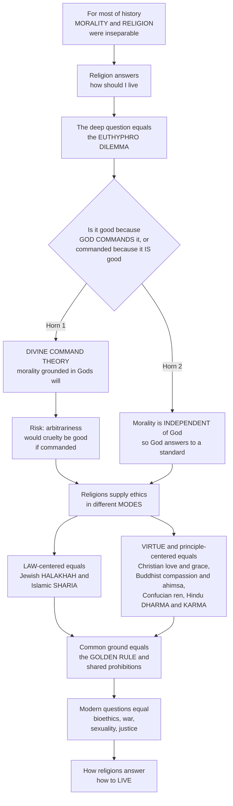

# ⚖️ Ethics and Religious Law

> [!abstract] TL;DR
> For most of human history, **morality and religion were inseparable** — religion has been humanity's primary source of answers to *"how should I live?"*, offering a comprehensive vision of the good life and often a detailed **sacred law** governing conduct down to daily details. This raises one of philosophy's oldest questions, the **Euthyphro dilemma**: is something good *because God commands it* (**divine command theory** — which grounds ethics in God but risks making morality *arbitrary*), or does God command it *because it is good* (which makes morality *independent* of God)? Beyond this foundational question, traditions supply ethical content in different **modes**: **law-centered** systems like Jewish **halakhah** and Islamic **sharia** treat living rightly as *obeying divine commandments*, while **virtue- or principle-centered** traditions emphasize Christian **love** and grace, Buddhist **compassion** and non-harming, Confucian cultivation of **ren**, and Hindu **dharma** and the cosmic law of **karma**. Nearly all converge on a version of the **Golden Rule** and shared prohibitions — hinting at a common moral core — even as they still wrestle with hard modern questions of bioethics, war, sexuality, and justice.

## Intuition

**Analogy.** Imagine asking a child *"why is it wrong to hit your sister?"* and getting the answer *"because Mom said so."* Now ask the harder question: is hitting wrong **because** Mom forbids it, or does Mom forbid it **because** it is already wrong? If the first, then had Mom said *"go ahead and hit her,"* hitting would have become *good* — which feels absurd. If the second, then there is a standard of right and wrong that even Mom is answering to, and her command is not the *source* of the rule but a **signpost** pointing at it. Swap "Mom" for "God," and you have stumbled onto the exact question **Plato** posed 2,400 years ago in the *Euthyphro* — the deepest question in the philosophy of religious ethics.

That single fork frames everything. For most of history, "how should I live?" was a **religious** question, not merely a philosophical one: the tradition you were born into handed you not just a story about the cosmos but a **map of the good life** — what to eat, whom to marry, how to trade, when to fight, how to treat a stranger. Some traditions delivered that map as a **detailed legal code** (do *this*, avoid *that*); others as a **transformation of character** (become a certain *kind of person* and right action follows). Both are answers to the same practical question, and understanding them is understanding the normative heart of religion for most believers.

---

## How It Works

Religious ethics operates on three layers stacked on top of one another. First a **meta-ethical foundation** asks *where* moral authority comes from (the Euthyphro fork). Second, each tradition adopts a **mode** — is right living primarily a matter of **obeying law**, or of **cultivating virtue**, or of **fulfilling cosmic duty**? Third, at the level of concrete **content**, the traditions turn out to overlap enormously: nearly all articulate a **Golden Rule** and forbid killing, stealing, and lying, suggesting either a shared natural law, a convergent evolution of cooperation, or common human need.

The **Euthyphro dilemma** forces a choice with real consequences. **Horn 1 — divine command theory** (defended in strands of Ockham, Reformed, and Islamic *Ash'ari* thought) says morality just *is* God's will: right and wrong are **constituted** by divine command, which makes God the unshakeable foundation of ethics — but invites the *arbitrariness* worry (*would cruelty be good if God commanded it?*) and the *vacuity* worry (*"God is good" collapses into "God is God"*). **Horn 2** says God commands the good *because* it is good, preserving morality's non-arbitrariness but making God **answer to** an independent standard — a subordination many theists resist. The great mediating moves are **modified divine command theory** (Robert Adams: goodness is grounded in God's *loving nature*, not bare will) and **natural law** (Aquinas: morality is built into creation and human nature, knowable by reason — see [[Aquinas_and_Scholasticism]] and [[Philosophy_of_Law_Jurisprudence]]).

Then the traditions diverge in **mode**. **Law-centered** (deontological, command-based): Judaism's **halakhah** — the 613 *mitzvot* and the vast rabbinic/Talmudic elaboration — and Islam's **sharia** and *fiqh* — divine law derived from the *Qur'an* and *Sunna* through the schools of jurisprudence — are comprehensive systems covering worship, diet, family, commerce, and criminal justice; here *ethics is law*. **Virtue-centered**: Christianity's ethic of *agape* (love), grace, and the transformed heart (the Sermon on the Mount reaching *beyond* legal codes); Confucian cultivation of **ren** and **li**; Buddhist **karuna** (compassion) and **ahimsa** (non-harming) flowing from the Eightfold Path. **Duty and cosmic order**: Hindu **dharma** (obligation varying by role/*varna* and life-stage/*ashrama*) and the impartial moral physics of **karma**.



---

## Key Concepts

**Secondary (foundations).**
- **Religion as moral source** — historically, religion supplied not only cosmology but the answer to *how to live*: moral **content** (the rules), **authority** (who says so), **motivation** (why obey), **community** (who lives it), and an **ultimate sanction** (reward, punishment, or karma).
- **Golden Rule** — the near-universal principle "do unto others as you would have them do unto you," appearing as Hillel's *"what is hateful to you, do not do to your neighbor,"* Jesus' positive formulation, and Confucius' *shu* (reciprocity).
- **Shared prohibitions** — most traditions forbid killing, stealing, lying, and adultery, and prize compassion, justice, hospitality, and care for the poor and vulnerable.
- **Law vs virtue** — the basic contrast between traditions where right living means **obeying commandments** and those where it means **becoming a good person**.

**Undergraduate (structure).**
- **Euthyphro dilemma** — Plato's question: are pious acts loved by the gods *because* they are pious, or pious *because* the gods love them? The template for every debate about grounding ethics in God.
- **Divine command theory** — morality is constituted by God's will; its strength (an absolute foundation) and its two classic problems (*arbitrariness* and *vacuity*).
- **Natural law** — morality is embedded in creation and human nature and knowable by reason (Aquinas' *eternal → natural → human law*); a middle path between bare divine command and God-independent morality.
- **Halakhah** — the total body of Jewish law (biblical *mitzvot* plus rabbinic/Talmudic interpretation) governing ritual, ethics, and civil life.
- **Sharia and fiqh** — divine law (*sharia*) and its human juristic elaboration (*fiqh*) drawn from *Qur'an*, *Sunna*, consensus, and analogy across the legal schools.
- **Dharma and karma** — Hindu role-and-stage-relative duty (*dharma*) and the impersonal law of moral cause and effect (*karma*) woven into the cosmos.

**Graduate (contested frontiers).**
- **Modified divine command theory (Adams)** — moral obligation is grounded in the commands of a *loving* God, blunting the arbitrariness horn by anchoring commands in God's *nature* rather than sheer will.
- **The "moral gap" (Hare)** — the distance between the moral demand we recognize and our capacity to meet it, and how theistic ethics proposes to bridge it (grace, transformation) where secular ethics may not.
- **Common core vs deep diversity** — is cross-traditional convergence evidence of *natural law*, of *convergently evolved cooperation* (see [[Direct_Reciprocity_and_Repeated_Games]]), or of shared human needs — and how much genuine moral **disagreement** survives alongside the core?
- **Religious law and the secular state** — theocracy vs secular order, reform of *sharia*/halakhah, canon law, and tensions between religious law and human rights, including *who* holds the authority to interpret.
- **Applied religious ethics** — bioethics, **just war** vs **pacifism** vs **jihad**, sexuality and gender, economic ethics (usury, *zakat*, tithing), environmental "creation care," and social-justice strands like liberation and prophetic theology.

---

## Python Demo

```python
# Ethics and Religious Law — three complementary visual arguments:
#   (1) WHY reciprocal ethics (the Golden Rule) recurs across cultures:
#       a Tit-for-Tat "do unto others" strategy out-earns pure defection
#       in a repeated cooperation game.
#   (2) The COMMON MORAL CORE: an overlap matrix of traditions x precepts,
#       showing a shared core plus tradition-specific rules.
#   (3) The EUTHYPHRO-adjacent LAW-vs-VIRTUE map: positioning traditions by
#       how rule/law-based vs virtue/character-based their ethics is.
import numpy as np
import matplotlib.pyplot as plt

# ---------- (1) Reciprocity beats defection in a repeated game ----------
T, R, P, S = 5, 3, 1, 0   # Temptation, Reward, Punishment, Sucker payoffs

def play(strat_a, strat_b, rounds=50):
    """Cumulative payoffs for two strategies. A strategy maps
    (my_history, opp_history) -> 'C' (cooperate) or 'D' (defect)."""
    ha, hb, pa, pb, ca, cb = [], [], [], [], 0, 0
    for _ in range(rounds):
        a, b = strat_a(ha, hb), strat_b(hb, ha)
        if   a == 'C' and b == 'C': sa, sb = R, R
        elif a == 'C' and b == 'D': sa, sb = S, T
        elif a == 'D' and b == 'C': sa, sb = T, S
        else:                       sa, sb = P, P
        ca, cb = ca + sa, cb + sb
        pa.append(ca); pb.append(cb); ha.append(a); hb.append(b)
    return np.array(pa), np.array(pb)

tit_for_tat  = lambda me, opp: 'C' if not opp else opp[-1]   # "do unto others"
always_defect = lambda me, opp: 'D'                          # pure self-interest

N = 50
rounds = np.arange(1, N + 1)
coop_coop, _   = play(tit_for_tat,  tit_for_tat,  N)   # reciprocity vs reciprocity
def_def,  _    = play(always_defect, always_defect, N)  # defection vs defection
tft_vs_def, def_vs_tft = play(tit_for_tat, always_defect, N)

# ---------- (2) Cross-tradition moral overlap ----------
traditions = ['Judaism', 'Christianity', 'Islam', 'Hinduism', 'Buddhism', 'Confucianism']
precepts   = ['Golden Rule', 'No killing', 'No stealing', 'No lying',
              'Care for poor', 'Comprehensive\nsacred law code']
M = np.array([
    [1, 1, 1, 1, 1, 1],   # Judaism      (halakhah = full legal code)
    [1, 1, 1, 1, 1, 0],   # Christianity (love/grace over legal code)
    [1, 1, 1, 1, 1, 1],   # Islam        (sharia = full legal code)
    [1, 1, 1, 1, 1, 0],   # Hinduism     (dharma by role, no single code)
    [1, 1, 1, 1, 1, 0],   # Buddhism     (precepts, no theocratic law)
    [1, 1, 1, 1, 1, 0],   # Confucianism (virtue/ritual, not divine law)
])
shared_core = [precepts[j].replace('\n', ' ') for j in range(M.shape[1]) if M[:, j].all()]

# ---------- (3) Law-centered vs virtue-centered map ----------
# x: 0 = rule/law-centered ......... 1 = virtue/character-centered
# y: 0 = this-worldly conduct ...... 1 = cosmic/metaphysical grounding
labels = ['Halakhah\n(Judaism)', 'Sharia\n(Islam)', 'Christian love\n(agape)',
          'Buddhist\ncompassion', 'Confucian\nren', 'Hindu dharma\n& karma']
x = np.array([0.10, 0.15, 0.75, 0.85, 0.80, 0.55])
y = np.array([0.45, 0.50, 0.55, 0.72, 0.30, 0.88])

# ---------- Plot ----------
fig, ax = plt.subplots(1, 3, figsize=(18, 5.4))

ax[0].plot(rounds, coop_coop,  lw=2.5, label='Golden Rule vs Golden Rule (TFT–TFT)')
ax[0].plot(rounds, tft_vs_def, lw=2.5, label='Golden Rule vs Defector (TFT)')
ax[0].plot(rounds, def_def,    lw=2.5, ls='--', label='Defector vs Defector')
ax[0].plot(rounds, def_vs_tft, lw=2.0, ls=':',  label='Defector vs Golden Rule')
ax[0].set_title('Why reciprocity recurs:\n"do unto others" out-earns defection')
ax[0].set_xlabel('Rounds of interaction'); ax[0].set_ylabel('Cumulative payoff')
ax[0].legend(fontsize=8); ax[0].grid(alpha=0.3)

im = ax[1].imshow(M, cmap='YlGn', vmin=0, vmax=1, aspect='auto')
ax[1].set_xticks(range(len(precepts)));  ax[1].set_xticklabels(precepts, fontsize=8, rotation=30, ha='right')
ax[1].set_yticks(range(len(traditions))); ax[1].set_yticklabels(traditions, fontsize=9)
ax[1].set_title(f'Common moral core: {len(shared_core)} of {M.shape[1]} precepts\nshared by ALL six traditions')
for i in range(M.shape[0]):
    for j in range(M.shape[1]):
        ax[1].text(j, i, '✓' if M[i, j] else '·', ha='center', va='center',
                   color='black' if M[i, j] else 'gray', fontsize=11)

ax[2].scatter(x, y, s=140, c='crimson', zorder=3)
for xi, yi, li in zip(x, y, labels):
    ax[2].annotate(li, (xi, yi), fontsize=8, ha='center', va='bottom',
                   xytext=(0, 8), textcoords='offset points')
ax[2].axvline(0.5, color='gray', ls='--', alpha=0.6)
ax[2].set_xlim(0, 1); ax[2].set_ylim(0, 1)
ax[2].set_xlabel('law / rule-centered  →  virtue / character-centered')
ax[2].set_ylabel('this-worldly conduct  →  cosmic grounding')
ax[2].set_title('Modes of religious ethics:\nlaw pole vs virtue pole')
ax[2].grid(alpha=0.3)

plt.tight_layout()
plt.savefig('ethics_and_religious_law.png', dpi=120)
print('Shared moral core (present in all six):', shared_core)
print(f'TFT total after {N} rounds vs a defector: {tft_vs_def[-1]}  '
      f'| defector vs defector: {def_def[-1]}  | reciprocity vs reciprocity: {coop_coop[-1]}')
```

Running it shows three things at once: mutual **reciprocity** (Golden Rule against Golden Rule) accumulates the *highest* long-run payoff while mutual **defection** accumulates the least — a game-theoretic reason "do unto others" recurs across cultures; the **overlap matrix** quantifies a shared moral core (five of six precepts held in common) with a comprehensive *sacred legal code* as the tradition-specific dimension separating **halakhah**/**sharia** from the rest; and the **law-vs-virtue map** places Judaism and Islam at the *law pole* while Christian love, Buddhist compassion, and Confucian *ren* cluster toward the *virtue pole*, with Hindu dharma/karma pulled upward by its cosmic grounding.

---

## Real-World Applications

- **Living law today.** Halakhah governs Sabbath observance, kashrut, and family life for observant Jews and shapes personal-status law in Israel; sharia informs finance (interest-free *riba*-avoiding banking), family law, and worship for over a billion Muslims — concrete cases where *ethics is law* and jurisprudential interpretation is a live, professional practice.
- **Bioethics.** Religious frameworks drive real clinical debates over end-of-life care, abortion, IVF, brain death, and organ donation — often reaching different verdicts from secular principlism, which is why hospital ethics boards and pluralistic societies must negotiate across traditions.
- **War and peace.** The **just war** tradition (Augustine, Aquinas) supplies criteria still embedded in international humanitarian law, while **pacifism** (Anabaptists, Gandhi's *ahimsa*, King's nonviolence) and contested doctrines of **jihad** show religion arguing with itself about legitimate force.
- **Economic and environmental ethics.** *Zakat*, tithing, jubilee debt-forgiveness, and prohibitions on usury shape charitable and financial institutions; "creation care" and dharmic ecology mobilize religious communities on climate and conservation.
- **Interfaith and secular dialogue.** The shared **Golden Rule** and common prohibitions provide the working overlap that makes cross-tradition cooperation, human-rights consensus, and comparative moral education possible despite unresolved metaethics.

---

## Common Pitfalls

- **Collapsing all religious ethics into "rule-following."** Treating every tradition as a rulebook misses the **virtue** and **transformation-of-heart** strands (Christian grace, Buddhist compassion, Confucian character) where the goal is *who you become*, not just what you obey.
- **Assuming morality requires God.** The Euthyphro dilemma cuts both ways: divine command theory faces the *arbitrariness* objection, and thriving **secular ethics** shows moral reasoning can proceed without theism — the real question is about *grounding* and *motivation*, not whether atheists can be good.
- **Mistaking the Golden Rule's ubiquity for identical ethics.** Shared prohibitions coexist with deep disagreement on sexuality, authority, gender, and the scope of "neighbor"; overstating the common core erases genuine moral diversity.
- **Reading sacred law as static.** Halakhah and sharia are living, *interpreted* traditions with schools, precedent, and reform debates — treating them as frozen texts misrepresents how religious law actually functions.
- **Conflating religious law with civil law.** The relationship between sacred and secular law (theocracy vs secular state, canon law, personal-status carve-outs) is contested terrain, not a settled identity — and its tensions with human rights are a central modern problem (see [[Philosophy_of_Law_Jurisprudence]]).

---

## Related Concepts

This note is the religious-ethics hub of the vault; its sibling notes carry the neighboring pieces in prose. **Theology_and_Religious_Doctrine** supplies the doctrines (the nature of God, sin, grace) that ground moral claims; **Salvation_Liberation_and_the_Afterlife** carries the *ultimate sanction* — reward, punishment, karma, and liberation — that motivates the moral life; **Sacred_Texts_and_Scripture** is the source and authority from which halakhah, sharia, and gospel ethics are derived and interpreted; **Religion_Politics_and_the_State** handles the collision of religious law with civil law and human rights; **Religion_Violence_and_Peacebuilding** develops just war, jihad, pacifism, and ahimsa; and **Religion_Gender_and_Sexuality** takes up the contested applied ethics of family and body.

- [[Metaethics]] — the deep philosophical treatment of divine command theory, moral realism, and the Euthyphro fork that grounds this note.
- [[Metaethics_and_Moral_Disagreement]] — whether morality is objective, and whether cross-cultural agreement (the moral core) survives the disagreement objection.
- [[Philosophy_of_Law_Jurisprudence]] — natural law vs legal positivism, and the "unjust law is no law" tradition that religious law inhabits.
- [[Aquinas_and_Scholasticism]] — the natural-law middle path (eternal → natural → human law) between bare divine command and God-independent morality.
- [[Virtue_Ethics]] — the character-and-flourishing framework underlying the virtue-centered mode (Christian, Confucian, Buddhist).
- [[Direct_Reciprocity_and_Repeated_Games]] — the game-theoretic engine of the Golden Rule: why "do unto others" reciprocity is evolutionarily favored and recurs across cultures.

---

## Review Questions

**Secondary.** In your own words, what is the Golden Rule, and name two different religious traditions that state a version of it. Why might so many cultures arrive at the same idea?

**Undergraduate.** Explain the two horns of the Euthyphro dilemma. What problem does each horn create for a believer who wants God to be the foundation of morality, and how does *modified* divine command theory (Adams) or *natural law* (Aquinas) try to escape between them?

**Graduate.** A tradition organized around comprehensive **sacred law** (halakhah, sharia) and one organized around **virtue and transformed character** (Christian *agape*, Buddhist compassion) both claim to answer "how should I live?" Are these rival answers, complementary emphases, or ultimately the same ethic in different idioms? Defend your position, and say what the near-universal Golden Rule and shared prohibitions do — and do *not* — prove about a "common moral core."

---

## Sources

- Plato, *Euthyphro* (c. 399 BCE) — the origin of the "is it good because the gods love it, or loved because it is good?" dilemma.
- John Hare, *God and Morality: A Philosophical History* (2007) and *The Moral Gap* (1996) — theistic grounding of ethics and the gap between moral demand and human capacity.
- Robert M. Adams, *Finite and Infinite Goods: A Framework for Ethics* (1999) — modified divine command theory grounded in a loving God's nature.
- Peggy Morgan and Clive Lawton (eds.), *Ethical Issues in Six Religious Traditions* (2nd ed., 2007) — comparative survey of ethics across Judaism, Christianity, Islam, Hinduism, Buddhism, and more.
- Thomas Aquinas, *Summa Theologiae* (Treatise on Law, I-II, qq. 90–108) — the classic statement of natural-law theory bridging divine command and reason.

---

#religious-studies #religious-ethics #divine-command-theory #euthyphro #religious-law
