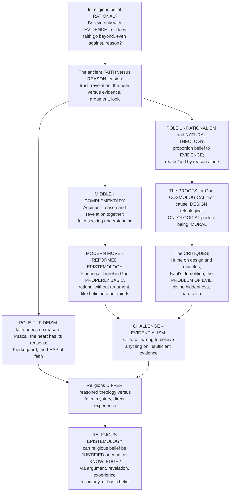

# ⚖️ Faith, Reason and Religious Epistemology

> [!abstract] TL;DR
> Should you believe in God **only if you have good evidence and arguments** — or is **faith** something that goes *beyond*, or even *against*, reason? This ancient tension between **faith** (trust, belief, revelation, "the heart") and **reason** (evidence, argument, logic, philosophy) is the central question where religion meets philosophy, and thinkers have staked out strikingly different positions. At one pole, **rationalism** says belief should be *proportioned to evidence*, producing the great **arguments for God's existence** — the **cosmological** argument from a first cause, the **teleological/design** argument from the universe's order, the **ontological** argument from the concept of a perfect being, and the **moral** argument — together with their famous critiques (**Hume** on design and miracles, **Kant**'s demolition of the proofs, the **problem of evil**). *Natural theology* tries to reach God by reason alone. At the opposite pole, **fideism** says faith does **not** rest on reason and doesn't need to: religious truth is grasped by faith, revelation, or the heart, not proof — **Pascal**'s *"the heart has its reasons which reason knows not,"* **Kierkegaard**'s *"leap of faith,"* Tertullian's *"I believe because it is absurd."* In between lies the **compatibilist** synthesis of **Aquinas**: reason can reach *some* truths about God, revelation completes what reason cannot — *"faith seeking understanding."* A crucial modern move is **Reformed epistemology** (Alvin **Plantinga**): belief in God can be **"properly basic"** — rationally held *without* argument, the way we rationally believe in other minds and the external world without proving them. Meanwhile **evidentialism** (W.K. **Clifford**: *"it is wrong always, everywhere and for anyone to believe anything upon insufficient evidence"*) presses the demand hard. Beneath it all lies **religious epistemology** — the systematic study of whether and how religious beliefs can be **justified** or count as **knowledge**: through argument, revelation, religious experience, testimony, or "basic" belief. Understanding faith and reason is understanding the fundamental question of whether — and how — religious belief can be **rational**, the perennial meeting point of religion and philosophy.

---

## Intuition

**Analogy:** Imagine two people who each say, with total conviction, *"my closest friend would never betray me."* The **first** arrives at this the way a detective arrives at a verdict: she has gathered *evidence* — years of loyal behaviour, corroborating testimony, the absence of any motive — and she holds the belief *because* the evidence supports it. Challenge her and she reaches for the case file. The **second** holds the very same belief, but not as the *conclusion of an argument*. She trusts her friend *directly* — the trust is where her thinking *starts*, not where it *ends*. She has never assembled a proof, and if you demanded one she would find the demand slightly beside the point: *"I don't believe my friend is loyal because I deduced it; I simply trust her — and that trust is not irrational just because it isn't the bottom line of a syllogism."* Now notice a third possibility: someone who says trust must sometimes be *given before* the evidence is complete, as a **commitment** — you cannot fully know a friend is trustworthy until you have *already* trusted them and lived it out.

That triangle — **believe-only-on-evidence**, **trust-as-a-rational-starting-point**, and **commitment-beyond-the-evidence** — is exactly the ancient tension between **faith** and **reason** applied to belief in **God**. The **evidentialist/rationalist** is the detective: proportion belief to evidence, and if you want God you had better produce the *arguments* (cosmological, design, ontological, moral) and survive the *critiques* (Hume, Kant, the problem of evil). The **Reformed epistemologist** (Plantinga) is the second friend: belief in God can be **"properly basic"** — rational to hold *without* argument, just as you rationally believe *"there are other minds"* or *"the world is more than five minutes old"* without ever proving them. The **fideist** (Pascal, Kierkegaard) is the third: faith is a **leap** and a **commitment** of the whole self that the heart makes where argument runs out — *"the heart has its reasons which reason knows not."* And **Aquinas** stands in the middle, insisting the detective and the trusting friend are *both partly right*: reason can establish *some* of it, revelation supplies the rest, and the two cannot ultimately conflict. The discipline that studies which of these stances is defensible — whether religious belief can be **justified** or amount to **knowledge**, and by what route — is **religious epistemology**, and it is the sharpest edge where religion meets philosophy.

---

## How It Works

The faith–reason problem is organized by a single question — *can religious belief be rational, and if so, how?* — around which the tradition has staked out a small number of recurring stances. **Rationalism** proportions belief to **evidence** and launches the project of **natural theology** with its classic **arguments for God** and their **critiques**. **Fideism** denies that faith rests on, or needs, reason at all. **Compatibilism** (Augustine, Aquinas) holds the two in **harmony** as *faith seeking understanding*. The decisive modern move, **Reformed epistemology**, argues that belief in God can be **properly basic** — warranted *without* argument — against the **evidentialist** demand that belief require sufficient evidence. Different traditions weight these differently (reasoned theology vs mystery vs direct experience), and the systematic study of the whole question is **religious epistemology**. The diagram traces that logic from the opening question down to the discipline that studies it.



**The core mechanics of the problem:**

1. **Fix the two terms.** *Faith* is not one thing: it can mean **trust** and personal commitment (*fiducia*), **assent** to propositions held to be revealed (*fides*), or the **theological virtue** of clinging to God. *Reason* likewise spans **deductive proof**, **evidence-weighing**, and **inference to the best explanation**. Almost every dispute about "faith vs reason" turns on *which* sense of each is in play — trust-in-a-person is a very different candidate for rationality than assent-to-a-proposition.
2. **Locate the stance on a spectrum.** From **conflict/opposition** (faith and reason as rivals), through **identity** (rare — faith *is* rational insight), to a family of **compatibilities** (they cooperate, or occupy separate spheres). The mainstream historical view is *harmony*; the sharp poles are rationalism and fideism.
3. **Run the rationalist programme.** Build **natural theology**: proportion belief to evidence and try to *demonstrate* God — the cosmological, teleological/design, ontological, and moral arguments, plus arguments from consciousness, religious experience, and miracles. Then run the **critiques** (Hume, Kant, the problem of evil — the sibling note *Problem of Evil and Theodicy* handles the last in depth) and the **arguments against** God (evil, divine hiddenness, incoherence, naturalistic explanation of religion — see *The Cognitive Science of Religion*).
4. **Run the fideist programme.** Deny that religious belief rests on or needs argument at all: the priority of **revelation** and **experience** (the siblings *Sacred Texts and Scripture* and *Religious Experience and Mysticism*), faith as **trust and commitment** rather than propositional proof, and truth as **subjectivity** (Kierkegaard).
5. **Adjudicate the epistemology.** Ask the modern question directly — is belief in God *justified*, *warranted*, *knowledge*? Weigh **evidentialism** against **Reformed epistemology** (properly basic belief), the **epistemology of religious experience** (does a seeming count as evidence?), and the **epistemology of disagreement** raised by religious diversity. This is where the doctrinal content studied in the sibling notes *Theology and Religious Doctrine* and *Concepts of the Divine and Ultimate Reality* meets the question of whether any of it can be *rationally held* — and where religion's relation to science (the sibling *Religion and Science*) is negotiated.

---

## Key Concepts

### 🟢 Secondary — the basic tension

- **Faith vs reason is the question of whether religious belief is *rational*.** *Reason* = evidence, argument, logic. *Faith* = trust, belief, revelation, "the heart." The core question: should you believe in God *only if you have good arguments and evidence*, or can faith go *beyond* — or even *against* — what reason can prove?
- **The rationalist answer: believe with evidence, and here are the arguments.** People who think belief needs evidence produce **proofs for God**: the world must have a **first cause** (cosmological), the universe looks **designed/fine-tuned** (design), the very *idea* of a perfect being implies it exists (ontological), and **morality** points to a moral lawgiver (moral). Critics (Hume, Kant) and the **problem of evil** (why is there suffering if God is good and all-powerful?) push back hard.
- **The fideist answer: faith doesn't need proof.** Some thinkers say religious truth is grasped by **faith**, not argument. **Pascal**: *"the heart has its reasons which reason knows not."* **Kierkegaard**: faith is a **"leap"** beyond the rational. Tertullian: *"I believe because it is absurd."* On this view, demanding a proof of God misunderstands what faith *is*.
- **The middle answer: faith and reason work together.** **Aquinas** and **Augustine**: reason can reach *some* truths about God (that God exists), and revelation supplies what reason cannot (the Trinity). *"Faith seeking understanding"* — believe in order to understand. Truth is one, so faith and reason can never really contradict.
- **The modern twist: maybe belief in God can be reasonable *without* a proof.** **Reformed epistemology** (Plantinga): believing in God can be **"properly basic"** — rational to hold on its own, the way trusting your senses, your memory, or the existence of *other people's minds* is rational even though you can't *prove* any of them.

### 🟡 Undergraduate — the poles, the synthesis, and the ethics of belief

- **The rationalist pole and natural theology.** *Natural theology* is the project of knowing God by **reason and nature alone**, without appeal to revelation. Its engine is the set of classic **arguments for God's existence**:
  - **Cosmological argument** — from the existence/contingency of the world to a **first cause** or necessary being. Aquinas's first three of the **Five Ways** (motion, causation, contingency); the **Kalam** version (whatever begins to exist has a cause; the universe began to exist; therefore it has a cause — Craig). See *Aquinas and Scholasticism*.
  - **Teleological / design argument** — from the world's **order and apparent purpose** to a designer. **Paley**'s watchmaker; the modern **fine-tuning** argument (the physical constants sit in a razor-thin life-permitting range).
  - **Ontological argument** — *a priori*, from the **concept** of God as *"that than which nothing greater can be conceived"* (Anselm), revived by Descartes and, in **modal** form, by Plantinga (if a maximally great being is *possible*, it exists in every possible world, hence actually).
  - **Moral argument** — from the reality of objective **moral obligation** to a moral lawgiver (**Kant**'s practical postulate; later versions).
  - Plus arguments from **consciousness**, **religious experience**, and **miracles**.
- **The classic critiques and the arguments *against*.** **Hume** dismantled the design argument (the analogy to human artefacts is weak; a well-ordered world needn't have a mind behind it) and argued that testimony can never establish a **miracle** (it is always more probable that the witness errs). **Kant** delivered the famous **demolition of the proofs**: the ontological argument fails because *"existence is not a real predicate,"* and the cosmological and design arguments smuggle it back in (see *Kant and the Copernican Turn*, *Humes Skepticism*). Then come the **arguments against God**: the **problem of evil** (suffering vs an omnipotent, omnibenevolent God — the sibling *Problem of Evil and Theodicy*), **divine hiddenness** (a loving God would not remain hidden from sincere seekers — Schellenberg), **incoherence** (do the divine attributes even cohere?), and **naturalism** (evolution and the cognitive science of religion explain belief without God).
- **The fideist pole.** **Fideism** = the view that faith does *not* and *need not* rest on reason or evidence.
  - **Tertullian** — *"credo quia absurdum"* (*"I believe because it is absurd"*): the Gospel's very unreasonableness is not a defect.
  - **Pascal** — *"the heart has its reasons which reason knows not"*; and the famous **Wager**: even absent proof, the **expected value** of believing (infinite gain if God exists, finite loss if not) rationally recommends belief as a *prudential bet*.
  - **Luther** — reason as *"the devil's whore"* in matters of salvation; justification by faith, not by philosophical demonstration.
  - **Kierkegaard** — the **"leap of faith,"** *"truth is subjectivity,"* faith as a passionate inward commitment held *against* objective uncertainty; the paradox of the eternal entering time cannot be reasoned into (see *Kierkegaard and Existentialism*).
  - **Wittgensteinian fideism** (D.Z. Phillips) — religion is a distinct **"language game"** / form of life with its own internal grammar; demanding external evidential justification simply *misreads* what religious belief is.
- **The compatibilist synthesis.** Faith and reason as **complementary and harmonious**:
  - **Augustine** — *"credo ut intelligam"* (*"I believe in order to understand"*): faith *illuminates* reason, which then genuinely deepens faith (see *Augustine and Early Christian Thought*).
  - **Aquinas** — reason and revelation are **two non-contradicting sources** from the one God. Reason can demonstrate the *preambles* (God's existence); revelation supplies the *mysteries* that exceed reason (Trinity, Incarnation). **"Grace perfects nature."** The **"two books"** metaphor — nature and Scripture, both authored by God — belongs here.
  - **Islamic and Jewish rationalism** — **Averroes** (Ibn Rushd) on the harmony of philosophy and revelation; **Maimonides** reconciling Aristotle with Torah (see *Islamic and Jewish Philosophy*); the parallel *analogical* knowledge of God (we speak of God neither univocally nor equivocally but by *analogy*).
- **Evidentialism and its critics — the "ethics of belief."** **John Locke** and, sharpest of all, **W.K. Clifford** (*"The Ethics of Belief,"* 1877): *"It is wrong always, everywhere, and for anyone, to believe anything upon insufficient evidence."* Belief is subject to an *ethical* norm; unevidenced faith is a dereliction. **William James** replied in *"The Will to Believe"* (1896): when a choice is **genuine** — *live*, *forced*, and *momentous* — and cannot be settled by evidence, we have the **right to believe**; Clifford's rule would itself irrationally forbid a belief whose truth might depend on our believing it (see *Pragmatism*).

### 🔴 Graduate — religious epistemology as a discipline

- **Reformed epistemology (Plantinga, Wolterstorff, Alston).** The most influential 20th-century move. Against the **"evidentialist objection"** — the assumption (Locke → Clifford → classical foundationalism) that theistic belief is rational *only if* supported by argument — Plantinga argues that belief in God can be **"properly basic"**: a *foundational* belief accepted *without* being inferred from others, and rational for all that. The analogy is our belief in **other minds**, the **external world**, the **past**, and **inductive** regularities — none of which we hold on the basis of successful arguments, yet all of which are paradigmatically rational. The engine is his theory of **warrant** (in *Warrant and Proper Function* and *Warranted Christian Belief*): a belief has warrant when produced by cognitive faculties **functioning properly**, in an appropriate **environment**, per a **design plan** aimed at **truth**. If theism is true, God may have endowed us with a **sensus divinitatis** (Calvin's "sense of the divine") that, working properly, *produces* belief in God as basic — in which case such belief, if true, is *warranted*, indeed can constitute **knowledge**, without any argument. The striking upshot (the *de jure / de facto* point): the objection that theistic belief is *irrational* cannot be sustained *independently* of the question whether theism is *true* — you cannot show it unwarranted without showing it false.
- **The epistemology of religious experience.** Can experience *justify* belief? **William Alston** (*Perceiving God*, 1991): forming beliefs on the basis of apparent experience of God is a **"doxastic practice"** epistemically **on a par** with sense-perceptual practice — both are socially established, internally consistent, self-supporting, and *unjustifiable without circularity* — so it is arbitrary to trust the one and reject the other. **Richard Swinburne**'s **Principle of Credulity**: *absent specific defeaters*, if it seems to you that X is present, then probably X is present — apparent experiences of God are *prima facie* evidence for God (see the sibling *Religious Experience and Mysticism*). Critics press **defeaters**: unreliability, conflicting reports across traditions, and naturalistic explanation.
- **Testimony, revelation, and tradition as sources of religious knowledge.** Most religious belief is transmitted by **testimony** and embedded in **tradition** and **authority** — raising the general epistemology of testimony (are we entitled to trust it by default?) as applied to **revelation** and **sacred text**. How does a *revealed* proposition acquire warrant for the hearer, and how does one rationally identify a source *as* revelatory?
- **The epistemology of disagreement and religious diversity.** **Religious pluralism** sharpens an epistemological worry: sincere, informed, virtuous inquirers disagree radically about God. Does awareness that epistemic **peers** disagree oblige you to *lower your confidence* (conciliationism), or may you rationally retain your belief (steadfastness)? John Hick's **pluralist hypothesis** (traditions are culturally conditioned responses to one ineffable Real) is one answer; **exclusivism** and its charge of arbitrariness is the pressure it responds to.
- **Cumulative-case vs the demand for a decisive proof.** A key structural insight from **Bayesian** epistemology (see *Bayesian Reasoning*): even if *no single* argument for God is individually decisive, several **independent** arguments can, like strands in a rope, jointly raise a rational credence — Swinburne's *cumulative case* treats the arguments as **confirming evidence** that multiply Bayes factors rather than as would-be demonstrations. The evidentialist who dismisses each argument *one at a time* for failing to *prove* God commits a structural error about how evidence aggregates.
- **Faith, reason, and modernity — the historical arc and the science relation.** The trajectory runs: the **medieval synthesis** (Anselm → Aquinas) → **Enlightenment critique** (Hume, Kant, the deist controversies) → the 19th-century **"conflict thesis"** (Draper–White, largely a historiographical myth) → the **contemporary revival** of philosophy of religion (Plantinga, Swinburne, Alston). The **science–religion** relationship is standardly mapped (Ian Barbour) onto four models — **conflict**, **independence** (Gould's **NOMA**, non-overlapping magisteria), **dialogue**, and **integration** — a debate the sibling *Religion and Science* develops.
- **The existential dimension.** Faith is not only a *cognitive* stance but a *lived* one: trust exercised under **doubt**, **commitment** in the face of uncertainty (Tillich's *"ultimate concern"*; Kierkegaard's inwardness). Religious epistemology that ignores the *first-person, volitional, and affective* texture of faith risks answering a question no believer is actually asking.

---

## Python Demo

```python
# Faith, reason & religious epistemology in three pictures:
#   (1) THREE EPISTEMIC STANCES respond to the SAME stream of evidence.
#       - EVIDENTIALIST: credence in God = prior updated by each argument's
#         log-odds shift (design/fine-tuning, religious experience, testimony
#         RAISE it; the problem of evil, divine hiddenness, naturalism LOWER it).
#       - PROPERLY BASIC believer (Reformed epistemology): belief starts HIGH
#         without argument and is resilient -- evidence nudges it only weakly
#         (belief is warranted basically, though it can face defeaters).
#       - FIDEIST: belief is held INDEPENDENT of evidence -- essentially flat.
#   (2) PASCAL'S WAGER as a decision under uncertainty: expected value of
#       BELIEVE vs NOT-BELIEVE across "God exists / doesn't," with the claimed
#       (large) payoff of salvation -- believe dominates for any prior > 0
#       (and the classic objections: many-gods, finite-cost, doxastic voluntarism).
#   (3) CUMULATIVE CASE vs "each argument must be DECISIVE": several individually
#       weak arguments can COMBINE (Bayes) to move a credence, versus an
#       evidentialist who rejects each one-at-a-time for not proving God.
# All figures are conceptual teaching heuristics, not empirical measurements.

import numpy as np
import matplotlib
matplotlib.use("Agg")
import matplotlib.pyplot as plt

def sigmoid(x): return 1.0 / (1.0 + np.exp(-x))
def logit(p):   return np.log(p / (1.0 - p))

# ======================================================================
# (1) THREE EPISTEMIC STANCES vs the same evidence stream
# ======================================================================
ev_labels = ["prior", "fine-tuning\n(design)", "religious\nexperience",
             "testimony\n& tradition", "problem\nof evil", "divine\nhiddenness",
             "moral\nargument", "naturalist\nexplanation"]
# log-odds shift each item contributes for the EVIDENTIALIST (+ raises, - lowers)
llr = np.array([0.0, +0.55, +0.60, +0.35, -0.95, -0.60, +0.40, -0.45])
steps = np.arange(len(llr))

evidentialist = sigmoid(np.cumsum(llr))                       # starts at 0.5, tracks evidence
basic_believer = sigmoid(logit(0.90) + 0.30 * np.cumsum(llr)) # high & resilient (weak update)
fideist = np.full(len(llr), 0.95)                             # independent of evidence

# ======================================================================
# (2) PASCAL'S WAGER: expected value of belief vs unbelief across priors
# ======================================================================
p = np.linspace(1e-3, 0.6, 400)     # prior probability that God exists
SALVATION = 1_000.0                 # large (idealized "infinite") payoff
DAMNATION = 1_000.0                 # large loss for not believing if God exists
cost_belief   = 1.0                 # finite cost of a pious life if God doesn't exist
gain_unbelief = 1.0                 # finite worldly gain of unbelief if God doesn't exist

EV_believe    = p * SALVATION      + (1 - p) * (-cost_belief)
EV_notbelieve = p * (-DAMNATION)   + (1 - p) * (gain_unbelief)

# ======================================================================
# (3) CUMULATIVE CASE vs "each must be decisive"
# ======================================================================
case_labels = ["prior", "cosmo-\nlogical", "fine-\ntuning", "moral",
               "religious\nexperience", "conscious-\nness", "problem\nof evil",
               "divine\nhiddenness"]
case_llr = np.array([0.0, 0.30, 0.35, 0.25, 0.40, 0.20, -0.75, -0.45])
cum_case   = sigmoid(np.cumsum(case_llr))          # weak arguments COMBINE (then defeaters pull back)
decisive   = np.full(len(case_llr), 0.5)           # none individually decisive -> stays at prior
cstep = np.arange(len(case_llr))

# ======================================================================
# Plot
# ======================================================================
fig = plt.figure(figsize=(16.5, 5.3))

# ---- (1) three stances -------------------------------------------------
ax1 = fig.add_subplot(1, 3, 1)
ax1.plot(steps, evidentialist,  "o-", color="#2563eb", lw=2.2, label="Evidentialist")
ax1.plot(steps, basic_believer, "s-", color="#d97706", lw=2.2, label="Properly basic (Reformed)")
ax1.plot(steps, fideist,        "^-", color="#dc2626", lw=2.2, label="Fideist")
# shade evidence-for (green) vs evidence-against (red) items
for i, s in enumerate(llr):
    if i == 0: continue
    ax1.axvspan(i - 0.5, i + 0.5, color=("#16a34a" if s > 0 else "#ef4444"), alpha=0.05)
ax1.set_xticks(steps); ax1.set_xticklabels(ev_labels, fontsize=6.6, rotation=0)
ax1.set_ylabel("credence in God  P(G)")
ax1.set_ylim(0, 1.02)
ax1.set_title("(1) Three epistemic stances,\nsame evidence stream", fontsize=10)
ax1.legend(fontsize=7.4, loc="lower left")
ax1.text(4.0, 0.06, "green = evidence FOR   red = evidence AGAINST",
         fontsize=6.6, color="#374151", ha="center")

# ---- (2) Pascal's wager ------------------------------------------------
ax2 = fig.add_subplot(1, 3, 2)
ax2.plot(p, EV_believe,    color="#7c3aed", lw=2.6, label="Expected value: BELIEVE")
ax2.plot(p, EV_notbelieve, color="#6b7280", lw=2.4, ls="--", label="Expected value: NOT believe")
ax2.axhline(0, color="k", lw=0.7, alpha=0.5)
ax2.fill_between(p, EV_notbelieve, EV_believe, where=(EV_believe > EV_notbelieve),
                 color="#7c3aed", alpha=0.08)
ax2.set_xlabel("prior probability that God exists,  P(G)")
ax2.set_ylabel("expected value  (utility units)")
ax2.set_title("(2) Pascal's Wager:\nbelief dominates for any P(G) > 0", fontsize=10)
ax2.legend(fontsize=7.6, loc="center right")
ax2.text(0.02, -650,
         "objections:\n- many-gods (which God?)\n- is the cost really finite?\n- doxastic voluntarism\n  (can we believe at will?)",
         fontsize=6.8, color="#374151", va="top")

# ---- (3) cumulative case ----------------------------------------------
ax3 = fig.add_subplot(1, 3, 3)
ax3.plot(cstep, cum_case, "o-", color="#16a34a", lw=2.3,
         label="Cumulative case (arguments combine)")
ax3.plot(cstep, decisive, "s--", color="#6b7280", lw=2.1,
         label="'Each must be decisive' -> stuck at prior")
ax3.axhline(0.5, color="k", lw=0.7, alpha=0.4, ls=":")
ax3.axvspan(5.5, 7.5, color="#ef4444", alpha=0.06)  # defeaters region
ax3.text(6.5, 0.14, "defeaters\npull back", fontsize=6.8, color="#b91c1c", ha="center")
ax3.set_xticks(cstep); ax3.set_xticklabels(case_labels, fontsize=6.6)
ax3.set_ylabel("credence in God  P(G)")
ax3.set_ylim(0, 1.02)
ax3.set_title("(3) Cumulative case vs\ndemand for a decisive proof", fontsize=10)
ax3.legend(fontsize=7.2, loc="upper left")

plt.tight_layout()
plt.savefig("faith_reason_and_religious_epistemology.png", dpi=120, bbox_inches="tight")
plt.show()

# ----------------------------------------------------------------------
# Console summary
# ----------------------------------------------------------------------
print("=" * 68)
print("THREE STANCES -- final credence after the full evidence stream:")
print("=" * 68)
print(f"  Evidentialist    : {evidentialist[-1]:.3f}  (tracks the balance of evidence)")
print(f"  Properly basic   : {basic_believer[-1]:.3f}  (high, weakly moved -> Reformed)")
print(f"  Fideist          : {fideist[-1]:.3f}  (independent of evidence)")
print("-" * 68)
print("PASCAL: EV(believe) exceeds EV(not-believe) for ALL P(G) > 0  ->",
      bool(np.all(EV_believe > EV_notbelieve)))
print("CUMULATIVE CASE final credence :", round(float(cum_case[-1]), 3),
      "| 'each-decisive' stays at :", round(float(decisive[-1]), 3))
```

**What the figure teaches.** Panel **(1)** is the heart of religious epistemology rendered as three credence trajectories reacting to the *same* stream of considerations. The **evidentialist** (blue) starts agnostic at 0.5 and lets belief *ride the evidence*: it climbs with fine-tuning, religious experience, and testimony, then plunges at the **problem of evil** and **divine hiddenness**, then recovers partway with the moral argument before the naturalist explanation tugs it back — belief is *exactly as strong as the balance of arguments*. The **properly basic** believer (orange, Reformed epistemology) begins **high without any argument at all** and is *resilient*: the same evidence only *nudges* the line, because the belief was never *based* on argument in the first place — though it can still dip under a serious defeater like evil. The **fideist** (red) runs essentially **flat** near certainty: belief is a commitment held *independent* of the evidential see-saw. Same inputs, three profiles — that is the whole dispute in one chart: whether rational belief *must* track evidence (Clifford), *may* be basic (Plantinga), or *transcends* the question (Kierkegaard). Panel **(2)** stages **Pascal's Wager** as a decision under uncertainty: because the payoff of belief-if-true is enormous, the expected value of **believing** exceeds that of **not believing** for *every* prior probability greater than zero — the purple line sits above the grey one across the whole axis, which is Pascal's point that the *prudentially rational* bet is to believe *even without* a proof. The annotations flag why the argument is contested: **which** God (the many-gods objection), whether the "cost" of belief is really finite, and whether we can even *choose* to believe (doxastic voluntarism). Panel **(3)** dramatizes the **cumulative-case** insight: individually *weak* arguments (cosmological, fine-tuning, moral, experience, consciousness) **combine** to lift the green credence well above the prior — until the **defeaters** (evil, hiddenness) pull it back — whereas the evidentialist who insists each argument be *individually decisive* rejects them one by one and stays frozen at 0.5 (grey). The lesson is structural: *how you aggregate evidence* can matter as much as the arguments themselves.

---

## Real-World Applications

- **Contemporary philosophy of religion and apologetics.** Faith–reason is not a museum piece: it is the live research programme of analytic philosophy of religion (Plantinga, Swinburne, Alston, van Inwagen, Craig) and of the **New Atheist**–vs–theist debates. Reformed epistemology reshaped the field by moving the question from *"can you prove God?"* to *"is belief in God warranted?"* — changing what counts as a win.
- **Interreligious dialogue and the epistemology of disagreement.** How traditions understand the *rationality* of the other's faith — exclusivist, inclusivist, or pluralist — is applied religious epistemology, and it governs the tone and stakes of interfaith engagement.
- **The science–religion interface.** Whether evolution, cosmology, and the **cognitive science of religion** *conflict* with faith, are *independent* of it (NOMA), or invite *dialogue* is a direct application of the faith–reason models — and shapes public controversies from creationism to fine-tuning (see the sibling *Religion and Science*).
- **Theological method and seminary formation.** Whether a tradition builds its theology on **natural reason** (Thomism, scholasticism), on **revelation and faith alone** (much Reformation and Barthian theology), or on **experience** (Schleiermacher, liberal theology) is a methodological choice *about faith and reason* that structures how clergy are trained and doctrine is argued (see the sibling *Theology and Religious Doctrine*).
- **Secular epistemology and the "ethics of belief."** Clifford vs James is a template used far beyond religion — in debates over conspiracy belief, vaccine hesitancy, trust in testimony, and belief under uncertainty. The question *"when is it responsible to believe without conclusive evidence?"* is a general one that religious epistemology sharpened first (see *Decision Making Under Uncertainty*).
- **Legal and bioethical reasoning about conscience.** Courts and ethics boards must decide when **faith-based** convictions count as reasons in public deliberation — a practical version of asking whether religious belief is *rational* or merely *private* and non-arguable.

---

## Common Pitfalls

- **Treating "faith" as a single thing.** Faith-as-**trust** (a personal, relational stance) and faith-as-**assent** (accepting propositions as revealed) are very different candidates for rational assessment. Much heat in "faith vs reason" comes from an evidentialist attacking *assent* while a defender means *trust* — they talk past each other. Always ask *which faith*.
- **Assuming faith and reason must be enemies.** The **conflict** model is the *loudest* but historically the *minority* view. Augustine, Aquinas, Maimonides, and Averroes held *harmony*; Plantinga holds that unevidenced belief can be *rational*. Do not smuggle in the assumption that faith is *by definition* the abandonment of reason.
- **Confusing fideism with irrationalism.** Sophisticated fideism (Pascal, Kierkegaard, Wittgensteinian) is not the claim that faith is *stupid*; it is the claim that faith operates in a register where *evidential proof is the wrong tool* — trust, commitment, subjectivity, a form of life. Read it as a thesis about the *limits* of argument, not a licence for nonsense.
- **Thinking Reformed epistemology *proves* God.** It does **not**. "Properly basic" means belief in God can be *rational without* argument — a claim about **warrant/justification**, not a *demonstration* that God exists. Plantinga's own point is that the *de jure* question (is it rational?) cannot be settled apart from the *de facto* question (is it true?).
- **Committing the genetic fallacy — "explaining away" belief.** Showing that religious belief has a *psychological* or *evolutionary* cause (the cognitive science of religion) does **not**, by itself, show it is *false* or *unwarranted*. A belief can be both *caused* and *warranted*; the truth of a belief is not settled by its origin.
- **Mistaking "no single decisive proof" for "no rational support."** Rejecting each argument for God *one at a time* for failing to *prove* God ignores how **cumulative** (Bayesian) evidence works: several individually weak, independent arguments can jointly warrant a credence (panel 3). The demand that each argument be a *knockdown* is itself an epistemic mistake.
- **Over-reading Pascal's Wager.** The Wager is a *prudential* argument about the **rationality of believing**, not an *evidential* argument that God **exists** — and it faces real objections (**many-gods**: which God do you bet on?; **finite-cost**: is a life of belief really cheap?; **doxastic voluntarism**: can you *decide* to believe on command?). Presenting it as a proof of God misunderstands its logic.
- **Flattening all traditions into one stance.** Traditions weight faith and reason *very* differently — Thomist natural theology, Reformation *sola fide*, Sufi and Advaitic *experiential* knowing, Buddhist emphasis on *insight* over a creator-God. Do not assume the Western theistic evidentialism debate is the shape of *every* religion's epistemology.

---

## Related Concepts

- [[Faith_and_Reason]] — the **companion Philosophy note**: the medieval synthesis (Anselm's *fides quaerens intellectum* and ontological argument, Aquinas's preambles vs mysteries, Latin Averroism, the Condemnation of 1277). This Religious-Studies note broadens that historical core into the full **epistemological** question of the rationality of religious belief.
- [[Aquinas_and_Scholasticism]] — the fullest **compatibilist** synthesis: the Five Ways of natural theology, "all truth is one," and "grace perfects nature" — the paradigm of faith and reason in harmony.
- [[Kierkegaard_and_Existentialism]] — the **fideist** pole in depth: the "leap of faith," "truth is subjectivity," and faith held *against* objective uncertainty.
- [[Humes_Skepticism]] — the classic **critiques**: Hume's dismantling of the design argument and his argument that testimony can never establish a miracle.
- [[Kant_and_the_Copernican_Turn]] — Kant's **demolition of the proofs** ("existence is not a real predicate") and his relocation of God to a postulate of *practical* reason — the pivot from natural theology to the moral argument.
- [[Islamic_and_Jewish_Philosophy]] — **Averroes** and **Maimonides** on the harmony of philosophy and revelation, and al-Ghazali's critique of reason's reach — the non-Christian versions of the faith–reason debate.
- [[Pragmatism]] — home of **William James**, whose *"Will to Believe"* is the decisive reply to Clifford's evidentialism: the right to believe in genuine, forced, momentous options.
- [[Rationalism_vs_Empiricism]] — the general epistemological axis (a priori reason vs experience) underlying whether God is known by *demonstration* (rationalist natural theology) or *experience* (design, religious experience).
- [[Epistemology_and_Theories_of_Knowledge]] — the general machinery of **justification, warrant, and knowledge** that Reformed epistemology and evidentialism apply to religious belief.
- [[Bayesian_Reasoning]] — the formal backbone of the **cumulative case** and of Swinburne's probabilistic natural theology: how independent arguments combine as confirming evidence (panel 3).
- [[Decision_Making_Under_Uncertainty]] — the decision-theoretic frame for **Pascal's Wager**: expected value under uncertainty about states of the world (panel 2).
- [[Abductive_Reasoning_and_Inference_to_Best_Explanation]] — many arguments for God (design, fine-tuning, religious experience) are best read as **inference to the best explanation**, not deductive proof — the logical form the rationalist pole actually uses.

---

## Review Questions

**🟢 Secondary.** Explain, in your own words, the difference between the **rationalist** view (you should believe in God only if you have good arguments and evidence) and the **fideist** view (faith does not need proof). Give one example thinker or slogan for each, and then describe how **Aquinas** tries to hold a *middle* position between them.

**🟡 Undergraduate.** Using panel (1) of the demo, explain how an **evidentialist**, a **properly basic** believer (Reformed epistemology), and a **fideist** would each respond *differently* to the *same* piece of evidence — say, encountering the **problem of evil**. Which stance lets evidence move belief the most, which the least, and why? Then state W.K. **Clifford**'s "ethics of belief" and explain William **James**'s reply in *"The Will to Believe."*

**🔴 Graduate.** Alvin **Plantinga** argues that belief in God can be **"properly basic"** — rational without argument, analogous to belief in other minds. (a) Reconstruct the argument, including the roles of **warrant**, **proper function**, and the **sensus divinitatis**, and explain his claim that the *de jure* objection (theistic belief is irrational) cannot be sustained independently of the *de facto* question (whether theism is true). (b) Then evaluate it against the **evidentialist** objection and the **cumulative-case** picture from panel (3): does treating belief in God as basic *dodge* the demand for evidence, or does it *relocate* the real dispute to whether such belief is in fact *warrantedly produced*? Connect your answer to the epistemology of **religious experience** (Alston's doxastic practices, Swinburne's principle of credulity) and to the challenge posed by **religious disagreement**.

---

## Sources

- Alvin Plantinga, *Warranted Christian Belief* (Oxford University Press, 2000) — the definitive statement of Reformed epistemology: properly basic belief, warrant and proper function, the *sensus divinitatis*, and the *de jure/de facto* argument.
- William James, *The Will to Believe and Other Essays in Popular Philosophy* (1897) — the classic reply to Clifford's evidentialism: the right to believe in genuine, forced, and momentous options.
- Anthony Kenny, *Faith and Reason* (Columbia University Press, 1983) — a lucid analytic survey of the relationship between rational inquiry and religious belief.
- Richard Swinburne, *The Existence of God*, 2nd ed. (Oxford University Press, 2004) — the leading probabilistic, cumulative-case natural theology assessing the arguments as confirming evidence.
- C. Stephen Evans, *Faith Beyond Reason: A Kierkegaardian Account* (Eerdmans, 1998) — a sympathetic reconstruction of responsible fideism and the limits of reason in matters of faith.

---

#religious-studies #faith-and-reason #religious-epistemology #arguments-for-god #reformed-epistemology
