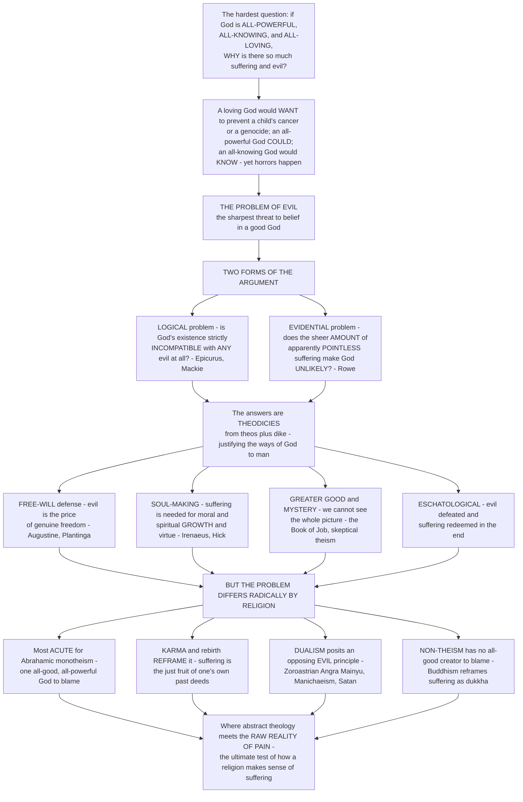

# 😔 The Problem of Evil and Theodicy

> [!abstract] TL;DR
> Here is perhaps the single hardest question any religion faces, and the sharpest threat to belief in a good God: **if God is all-powerful, all-knowing, and all-loving, why is there so much suffering and evil in the world?** A loving God would *want* to prevent a child's cancer or a genocide; an all-powerful God *could*; an all-knowing God would *know* about it — yet these horrors happen. This is the **problem of evil**, and it comes in two forms: the **logical** problem (is God's existence logically *incompatible* with any evil at all? — Epicurus's ancient dilemma, sharpened by J.L. Mackie) and the more powerful **evidential** problem (does the sheer *amount* and horror of apparently pointless suffering make God's existence *unlikely*? — William Rowe). Philosophers also split evil into **moral** evil (cruelty and injustice done by free agents) and **natural** evil (suffering from disease, earthquakes, and disaster that no human chose). The attempts to answer the problem — to "justify the ways of God to man" — are called **theodicies** (from Greek *theos*, "god" + *dikē*, "justice"; the word was coined by **Leibniz**). The great theodicies of the Western traditions include the **free-will defense** (evil is the price of genuine freedom; God could not create free beings guaranteed to choose only good — **Augustine**, **Alvin Plantinga**); the **soul-making** or **Irenaean** theodicy (the world is a "vale of soul-making" where suffering and challenge are necessary for moral and spiritual *growth*, virtue, courage, and compassion — **Irenaeus**, **John Hick**); the appeal to a **greater good** or to **mystery** (we cannot see the whole picture; God has reasons beyond our understanding — the Book of **Job**, "skeptical theism"); and **eschatological** answers (evil will be defeated and the suffering redeemed in the end). A crucial move here is the distinction between a **theodicy** (giving God's *actual* reason) and a mere **defense** (showing only that God's existence is *consistent* with evil) — and against both stands **anti-theodicy**, the moral protest that trying to *justify* a child's torture is itself obscene (Ivan Karamazov's "returned ticket"). Crucially, this problem takes very *different* forms in different religions: it is most acute for the **Abrahamic** monotheisms (one all-good, all-powerful God), but Eastern and dualistic traditions dissolve or reframe it — **karma** and rebirth make suffering the just consequence of one's own past deeds across lifetimes (so there is no *undeserved* suffering and no God to blame); **dualistic** religions posit an independent evil principle in cosmic struggle (Zoroastrian *Angra Mainyu*, Manichaeism); and **non-theistic** traditions have no all-good creator to blame at all (Buddhism reframes suffering as *dukkha* with its own diagnosis and cure). The problem of evil is where abstract theology meets the raw reality of pain — the ultimate test of how a religion makes sense of suffering.

---

## Intuition

**Analogy.** Imagine a fire chief who is present at *every* fire in the city, has the strength to put out *any* blaze single-handedly, sees *every* spark the instant it starts — and who *loves* every resident as her own child. Now imagine that houses keep burning down, with families still inside, night after night. You would face an unavoidable trilemma: either she does not really have the *power* she is said to have, or she does not really *know* about the fires, or — the unbearable option — she knows and is able but does not *care* enough to act. There is no fourth option that leaves all three attributes intact while the fires still rage. That is exactly the shape of the sharpest challenge to belief in God, first pressed by **Epicurus** and passed down by Hume: *"Is God willing to prevent evil, but not able? Then he is not omnipotent. Is he able, but not willing? Then he is malevolent. Is he both able and willing? Then whence cometh evil?"*

Now push the analogy one painful step further. A defender of the fire chief might say: *the fires are the price of letting residents strike their own matches* (freedom), or *surviving a house fire is what makes people brave and compassionate* (growth), or *she has hidden reasons we cannot see from the sidewalk* (mystery), or *she will rebuild every house and heal every burn in the end* (final redemption). Each of these is a **theodicy** — a defense of the fire chief's goodness in the face of the flames. And here is the twist the rest of this note develops: whether the trilemma even *arises* depends on the religion you start from. It bites hardest where there is **one** all-good, all-powerful God to hold responsible (Judaism, Christianity, Islam). Where suffering is understood as the just **karmic** return on one's own past deeds, no one is unjustly burned and there is no chief to blame. Where the cosmos is a **battlefield** between a good power and an independent evil one, the fires come from the enemy, not the chief. And where there is **no** omnipotent, benevolent creator at all, the whole trilemma simply never forms — suffering becomes a problem to *diagnose and cure* (Buddhism's *dukkha*) rather than a divine crime to *explain*. This note is about that question and its many answers: the problem of evil, the theodicies built to meet it, and why the darkest challenge to a religion's vision of a good and meaningful cosmos looks so radically different depending on where you stand.

---

## How It Works

The problem of evil is best understood as a logical *engine* with several moving parts. First, one states the apparent **contradiction** between three divine attributes and the plain fact of suffering (the "inconsistent triad" / Epicurean dilemma). Second, one distinguishes the two *strengths* of the argument — the **logical** version (God is strictly *incompatible* with any evil) and the far more resilient **evidential** version (the *scale* and *pointlessness* of suffering make God *improbable*). Third, believers respond with **theodicies** and **defenses** — free-will, soul-making, greater-good, privation, and eschatological answers, plus the appeal to mystery. Fourth — and this is the comparative heart of the note — one notices that the *whole engine* is calibrated to **monotheism**, and that other traditions **re-wire** it entirely through karma, dualism, or non-theism. The diagram traces that flow from the raw question down to where theology meets pain.



**The core mechanics of the problem:**

1. **State the inconsistent triad.** Take three classical attributes of the God of monotheism — **omnipotence** (all-powerful), **omniscience** (all-knowing), and **omnibenevolence** (all-good) — and add the manifest fact of **evil and suffering**. An omnipotent God *could* eliminate evil; an omniscient God *knows* of it; an omnibenevolent God *would want* to. The persistence of evil seems to force us to drop (or weaken) at least one attribute. This is the **Epicurean dilemma**, transmitted through Lactantius and made famous by David **Hume**.
2. **Distinguish the two strengths.** The **logical problem** (J.L. **Mackie**, 1955) claims a strict *contradiction*: theism plus "some evil exists" is like "a round square." This version is widely regarded as *defeated* by Plantinga's free-will defense. The **evidential (probabilistic) problem** (William **Rowe**, 1979) is weaker in form but stronger in force: it grants no contradiction, but argues that the *quantity*, *distribution*, and *apparent gratuitousness* of suffering (a fawn burning to death unseen in a forest fire) make God's existence *improbable* on the evidence.
3. **Classify the evil.** Split evil into **moral evil** — cruelty, injustice, and atrocity flowing from the free choices of moral agents (the Holocaust, torture) — and **natural evil** — suffering from disease, earthquakes, tsunamis, predation, and disaster that no human willed. This split matters because the flagship theodicy (free will) addresses moral evil directly but must *strain* to cover natural evil.
4. **Deploy theodicies and defenses.** A **theodicy** offers God's *actual, plausible* reason for permitting evil (an ambitious project). A **defense** (Plantinga) is more modest: it shows only that God's existence is *logically consistent* with evil, without claiming to know the real reason. The major moves: the **free-will** defense, the **soul-making** (Irenaean) theodicy, the **greater-good** and "best of all possible worlds" theodicies, the Augustinian **privation** theory (evil as *privatio boni*, a lack of good rather than a positive thing), **eschatological** redemption, and the appeal to **mystery** / **skeptical theism**.
5. **Re-calibrate for each religion.** Recognize that the entire construction presupposes a single omni-God. **Karma** dissolves the injustice (all suffering is deserved fruit of past action); **dualism** relocates the source of evil to an independent malign principle; **non-theism** removes the defendant entirely. The problem is not one problem but a *family* of problems, each shaped by a tradition's picture of ultimate reality.

---

## Key Concepts

### 🟢 Secondary — the basic idea

- **The core question.** If God is all-powerful, all-knowing, and all-good, why is there so much terrible suffering? This is the **problem of evil**. It feels less like a puzzle and more like a wound — it is the reason many people struggle with or lose their faith.
- **Epicurus's dilemma.** The oldest form: *Can God stop evil but won't? Then he's not good. Wants to but can't? Then he's not all-powerful. Both can and will? Then why is there evil?* You seem forced to give up one of God's great qualities.
- **Two kinds of evil.** **Moral evil** is the harm people *choose* to do — murder, cruelty, war. **Natural evil** is the suffering *nobody chooses* — cancer, earthquakes, plagues. Answers that work for one often don't work for the other.
- **Theodicy = "defending God."** A **theodicy** is an attempt to explain *why* a good God allows evil. The word comes from Greek for "god" (*theos*) and "justice" (*dikē*) — literally, putting God's justice on trial and defending it.
- **The three classic defenses.** (1) **Free will** — God gave us real freedom, and evil is the price of being free to choose (a robot that can only be nice isn't really good). (2) **Soul-making** — we grow into brave, kind, wise people *through* hardship; a world with no problems could never produce courage or compassion. (3) **Mystery** — we can't see the whole picture; God may have good reasons we can't understand (the message of the Book of Job).
- **It looks different in different religions.** For Judaism, Christianity, and Islam (one all-powerful, all-good God) the problem is sharpest. In Hinduism and Buddhism, **karma** says suffering is the fair result of your own past actions, so no one suffers *unfairly*. Some religions blame an *evil force* fighting God. And religions with no all-powerful creator don't have the problem in the same way at all.

### 🟡 Undergraduate — the logical vs evidential problem and the major theodicies

- **The logical problem of evil (Mackie).** J.L. Mackie's "Evil and Omnipotence" (1955) argues the theist holds an *inconsistent set* of beliefs: (1) God is omnipotent, (2) God is wholly good, and (3) evil exists. Add the plausible bridging premises "a good being always eliminates evil as far as it can" and "there are no limits to what an omnipotent being can do," and (3) contradicts (1)+(2). To be a theist, Mackie argued, you must be *irrational* — or quietly abandon one premise.
- **Plantinga's free-will *defense* (the reply to the logical problem).** Alvin **Plantinga** (*God, Freedom, and Evil*, 1974) does not offer a theodicy but a **defense**: he only needs a *possible* reason God might permit evil to break Mackie's claimed contradiction. His key claim — **transworld depravity** — is that it is *possible* that God could not create *any* world containing genuinely free creatures who *always* freely choose the good. A world with free beings who sometimes sin may be better than a world of pre-programmed puppets, and even omnipotence cannot make someone *freely* do something (that is a logical limit, not a limit on power). This is now *widely* accepted as *defeating the logical problem* — which is why the action shifted to the evidential version.
- **The evidential problem of evil (Rowe).** William **Rowe** (1979) concedes no contradiction but presses the *evidence*: (1) there exist instances of *intense suffering* an omnipotent, omniscient being *could* have prevented *without* thereby losing some greater good or permitting some equally bad evil (**gratuitous** evil); (2) an omnibenevolent being would prevent such suffering; therefore (3) probably no such being exists. His famous example is **natural** evil with no human free will in sight: a fawn trapped in a forest fire, burned, suffering for days, and dying unseen — suffering that appears utterly *pointless*.
- **Moral vs natural evil, and "horrendous" evil.** The **free-will** theodicy handles *moral* evil (human cruelty) but must add extra moves to cover *natural* evil — e.g. attributing it to the fall of angels/demons, to the necessity of stable **natural laws**, or to soul-making. Marilyn McCord **Adams** focuses on **horrendous evils** — atrocities (child torture, genocide) so grave they threaten to make the victim's *whole life* not worth living — arguing that abstract "greater-good" theodicies fail here and only a God who *personally defeats* the evil within the victim's own life (through relationship and resurrection) can answer.
- **The soul-making (Irenaean) theodicy.** Reaching back to **Irenaeus** and developed by John **Hick** (*Evil and the God of Love*, 1966), this treats the world as a *"vale of soul-making"* (Keats). Humans are created *immature* and must *develop* into virtuous, God-loving persons; genuine virtues — courage, compassion, patience, forgiveness — *logically require* an environment of real challenge, risk, and suffering. A pain-free paradise could produce only pampered innocents, never *matured* souls. **Epistemic distance** from God (a world that does not *obviously* announce its Maker) is needed so faith and love can be freely formed.
- **The Augustinian tradition: privation and the Fall.** **Augustine** (see the cross-vault note) held that evil is not a *positive thing* God created but *privatio boni* — a **privation** or lack of good, like a hole in a fabric or darkness as the absence of light — so God is not the *author* of evil. Moral evil enters through the free **fall** of angels and humans, who turn from higher goods to lower ones. This is the classic **Augustinian theodicy**, contrasted by Hick with his own Irenaean one.
- **Leibniz and the "best of all possible worlds."** **Leibniz** *coined the word "theodicy"* (*Théodicée*, 1710) and argued that a perfect God necessarily actualized the **best of all possible worlds** — one whose overall goodness requires that it contain *some* evil (see the cross-vault note on Spinoza and Leibniz). **Voltaire** savaged this optimism in *Candide* after the 1755 Lisbon earthquake ("if this is the best of all possible worlds, what are the others like?").
- **Skeptical theism and mystery.** **Skeptical theism** answers Rowe by denying premise (1): we are in no position to judge that *apparently* gratuitous evil is *really* gratuitous. Given the vast gap between divine and human cognition, we should *not expect* to discern God's reasons — so "I can't see a justifying reason" does not license "there is none." This is the philosophical form of the **Book of Job**: from the whirlwind God offers Job no *explanation*, only an overwhelming display of the incomprehensible scope of creation ("Where were you when I laid the foundations of the earth?").
- **Anti-theodicy.** A powerful *moral* objection to the whole enterprise. Dostoevsky's **Ivan Karamazov** "returns his ticket": even if every tear is redeemed in a final harmony, he refuses to accept a heaven bought with the *unavenged* torture of a single child — to *justify* such suffering is itself a moral obscenity. **Anti-theodicy** (D.Z. Phillips, Kenneth Surin) holds that theodicies "explain" horrors in a way that trivializes victims; the honest religious responses are **lament**, **protest**, and **solidarity**, not justification.

### 🔴 Graduate — the evidential debate, comparative frameworks, and the sociology of theodicy

- **The evidential problem as a Bayesian / inductive inference.** Rowe's argument is fundamentally **probabilistic**: it moves from "we can find *no* justifying reason for this suffering" (a premise about our epistemic situation) to "there *is* no justifying reason" (a claim about reality) — a **"noseeum" inference** ("I don't see 'um, so there ain't any"). Its cogency turns on whether God's reasons, if they existed, would be the *kind of thing we'd expect to detect*. Skeptical theists deny this; Paul **Draper**'s version reframes the whole debate as a **likelihood** comparison: the observed *distribution* of pain and pleasure (much of it biologically explicable, morally random, and useless for any soul-making) is far *more probable* on the "hypothesis of indifference" (a morally neutral universe) than on theism — so it *disconfirms* theism regardless of any single "pointless" case. (The Python demo below models exactly this update.)
- **Theodicies as probability-preserving auxiliary hypotheses.** In Bayesian terms, a theodicy functions as an **auxiliary hypothesis** that *raises the likelihood* of observing suffering *given* God (P(evil | God & theodicy) is not tiny) and so *shields* the God-hypothesis from disconfirmation. But every such auxiliary carries a **cost**: it *lowers the prior* (it makes the total theory more complex and specific) and often incurs *moral* costs (skeptical theism, taken seriously, threatens to undermine ordinary moral knowledge and the practice of consoling the suffering — the "**moral skepticism**" objection of Michael Bergmann's critics). The dialectic is a tug-of-war between evidential force and auxiliary rescue.
- **The comparative thesis: it is not one problem.** The *acute* problem of evil is a **local artifact of omni-God monotheism**. Restructure the concept of ultimate reality and the problem *transforms*:
  - **Karma and rebirth (Hindu, Buddhist, Jain).** Suffering is the lawful **fruit (*phala*) of one's own past *karma*** across beginningless lifetimes. This yields a *perfectly just* cosmos with **no undeserved suffering** and **no God to indict** — a self-operating moral law rather than a divine judge. But it generates *its own* problems: an apparent **infinite regress** (what caused the first karma?), a tendency toward **blaming the victim** (the disabled child "earned" it), and, for theistic Hinduism, the question of why *Ishvara* set up such a ledger. (See the notes on the Dharmic and Buddhist traditions.)
  - **Dualism (Zoroastrianism, Manichaeism, Gnosticism).** Posit an **independent evil principle** — **Angra Mainyu / Ahriman** locked in cosmic combat with **Ahura Mazda** — so evil has a *source other than* the good God. This *solves* the goodness of God cleanly but at the price of **omnipotence**: God is now one combatant, not the sole sovereign. Monotheism's **Satan** is a *subordinated*, non-dualist echo of this move (a creature, not a co-equal).
  - **Non-theism (Buddhism).** With **no** omnipotent, benevolent creator, the Western problem *never forms*. Suffering (**dukkha**) is not a scandal to be *explained* but a **fact to be diagnosed and cured** — the Four Noble Truths give its cause (craving) and its cessation (the Eightfold Path). The intellectual problem of *justifying* suffering is replaced by a *soteriological program* for *ending* it.
  - **Process theology.** Charles Hartshorne and A.N. Whitehead's heirs *deny classical omnipotence*: God works by **persuasion, not coercion**, luring the world toward good but unable to unilaterally override it — a God who **suffers *with*** creation (the "fellow sufferer who understands"). This dissolves the logical problem by *revising* the omnipotence premise, at the cost of orthodoxy.
  - **Post-Holocaust Jewish theology.** The **Shoah** forced a radical reckoning: Richard **Rubenstein**'s "death of God," Hans **Jonas**'s *self-limiting* God who "withdrew" (*tzimtzum*) power to make room for freedom, Emil **Fackenheim**'s "614th commandment" (do not grant Hitler a posthumous victory), and Elie Wiesel's **protest** and lament traditions ("Where was God? ... He is hanging here on this gallows"). Much of it is **anti-theodicy**: refusing to justify Auschwitz.
- **The sociology of theodicy (Weber, Berger).** Max **Weber** generalized the concept: *every* religion must **"make sense" of the distribution of suffering and fortune** — not only *why the good suffer* (theodicy of **suffering**) but *why the fortunate prosper* (theodicy of **good fortune**, which legitimates privilege: the rich "deserve" their blessing). Weber classed the *three most rationally consistent* theodicies as **karma** (the most complete, self-contained solution), **Zoroastrian dualism**, and **Calvinist predestination** (the inscrutable decree). Peter **Berger** (*The Sacred Canopy*) reframed theodicy as **social**: religion is a "nomos-building" enterprise that *shields* the social order from the terror of chaos and meaninglessness, and theodicies *legitimate* even suffering and injustice by locating them within a meaningful sacred order.
- **The existential and pastoral register.** Theodicy is philosophy; but the person at the deathbed or in the refugee camp needs *consolation, meaning, solidarity, and lament*, not a valid syllogism. Scholars distinguish **theoretical** theodicy (justifying God to the intellect) from **practical**/**pastoral** theodicy (helping people *live* with suffering) — and note the role of **redemptive suffering** (the Cross, martyrdom, *ashura*, compassion born of pain) as religion's *lived* answer, developed in the vault's treatment of lived religion and ethics.

---

## Python Demo

```python
# The Problem of Evil & Theodicy in three pictures:
#
#   (1) THE EVIDENTIAL PROBLEM as Bayesian updating.
#       As we observe MORE apparently-gratuitous suffering, how does the
#       posterior probability of each WORLDVIEW change? We compare:
#         - OmniGod (plain): an all-good, all-powerful God with NO theodicy
#                            -> should strongly PREVENT pointless suffering
#         - OmniGod + THEODICY: God PLUS a "greater-good / hidden-reasons"
#                            auxiliary hypothesis -> suffering only LOOKS pointless
#         - Indifferent universe: no moral agent behind events
#         - Karma cosmos: suffering is the DESERVED fruit of past deeds
#         - Dualism: an independent EVIL principle is at work
#       Plain-OmniGod's posterior COLLAPSES as pointless suffering piles up;
#       the THEODICY auxiliary RESISTS the update -- but only by paying a
#       lower PRIOR (a more complex, ad-hoc theory). This is why the *scale*
#       of suffering is evidentially powerful, and how theodicies function as
#       probability-preserving auxiliary hypotheses.
#
#   (2) COMPARATIVE FRAMEWORKS -- "coverage" of a single grievous suffering
#       event. Each tradition distributes the explanatory load across
#       categories (free-will misuse, soul-making, karma, evil-principle,
#       natural-law, divine-mystery) with some UNEXPLAINED residue.
#
#   (3) THE SOUL-MAKING CLAIM -- moral/spiritual growth as a function of
#       encountered adversity. The theodicy's core empirical premise
#       ("no virtue without challenge") vs its Achilles heel: HORRENDOUS
#       evil that CRUSHES rather than builds (an inverted-U, not a ramp).
#
# All figures are conceptual teaching heuristics, not empirical measurements.

import numpy as np
import matplotlib
matplotlib.use("Agg")
import matplotlib.pyplot as plt

# ======================================================================
# (1) EVIDENTIAL PROBLEM: Bayesian update over worldviews
# ======================================================================
# Each hypothesis H_i has a prior P(H_i) and a per-observation likelihood
# L_i = P(one apparently-gratuitous suffering event | H_i).
# After n such observations:  posterior_i(n) proportional to prior_i * L_i**n
hypotheses = [
    # name,                        prior,  per-event likelihood, color
    ("OmniGod (no theodicy)",      0.30,   0.15, "#dc2626"),   # should PREVENT pointless evil
    ("OmniGod + theodicy",         0.15,   0.55, "#7c3aed"),   # hidden reasons: resists update, low prior
    ("Indifferent universe",       0.30,   0.78, "#374151"),   # suffering expected under indifference
    ("Karma cosmos",               0.15,   0.70, "#16a34a"),   # suffering = deserved fruit -> expected
    ("Dualism (evil principle)",   0.10,   0.72, "#b45309"),   # an evil power is active -> expected
]
names   = [h[0] for h in hypotheses]
priors  = np.array([h[1] for h in hypotheses])
likes   = np.array([h[2] for h in hypotheses])
hcolors = [h[3] for h in hypotheses]

n_obs = np.arange(0, 31)                                  # 0..30 observed events
# unnormalized posterior mass for each hypothesis at each n
mass = priors[:, None] * (likes[:, None] ** n_obs[None, :])
post = mass / mass.sum(axis=0, keepdims=True)             # normalize across hypotheses

# ======================================================================
# (2) COMPARATIVE FRAMEWORKS: coverage of one grievous suffering event
# ======================================================================
categories = ["free-will\nmisuse", "soul-\nmaking", "karma\n(past lives)",
              "evil\nprinciple", "natural-law\nnecessity", "divine\nmystery",
              "unexplained\nresidue"]
cat_colors = ["#2563eb", "#dc2626", "#16a34a", "#b45309",
              "#0891b2", "#7c3aed", "#9ca3af"]
# Each row is a framework's distribution of the explanatory load (sums to 1.0)
frameworks = {
    "Augustinian\nChristian":  [0.45, 0.10, 0.00, 0.15, 0.10, 0.15, 0.05],
    "Irenaean\n(soul-making)": [0.20, 0.45, 0.00, 0.00, 0.15, 0.10, 0.10],
    "Hindu / Buddhist\n(karma)":[0.05, 0.05, 0.75, 0.00, 0.10, 0.05, 0.00],
    "Zoroastrian\n(dualism)":  [0.10, 0.00, 0.00, 0.70, 0.10, 0.05, 0.05],
    "Process\ntheology":       [0.30, 0.20, 0.00, 0.05, 0.30, 0.05, 0.10],
    "Non-theistic\n(dukkha)":  [0.15, 0.10, 0.00, 0.00, 0.55, 0.00, 0.20],
}
fw_names = list(frameworks.keys())
fw_data  = np.array([frameworks[k] for k in fw_names])    # rows=frameworks, cols=categories

# ======================================================================
# (3) SOUL-MAKING: growth as a function of adversity
# ======================================================================
adversity = np.linspace(0, 1, 400)
# Theodicy's IDEAL claim: monotonic "no growth without challenge"
growth_claim = 1.0 - np.exp(-3.2 * adversity)
# The realistic / anti-theodicy correction: inverted-U -- horrendous evil CRUSHES
growth_real  = np.exp(1.0) * adversity * np.exp(-3.0 * adversity)   # peaks then falls
growth_real  = growth_real / growth_real.max()                     # normalize to 0..1

# ======================================================================
# PLOT
# ======================================================================
fig = plt.figure(figsize=(17, 5.4))

# ---- (1) Bayesian posterior over worldviews --------------------------
ax1 = fig.add_subplot(1, 3, 1)
for i, name in enumerate(names):
    style = "-" if "OmniGod" in name else "--"
    lw = 2.8 if "OmniGod" in name else 1.9
    ax1.plot(n_obs, post[i], style, color=hcolors[i], lw=lw, label=name)
ax1.set_xlabel("number of apparently-GRATUITOUS suffering events observed")
ax1.set_ylabel("posterior probability  P(worldview | evidence)")
ax1.set_title("(1) Evidential problem: the scale of suffering\nupdates our worldview", fontsize=10)
ax1.set_ylim(0, 0.75)
ax1.annotate("plain OmniGod\nCOLLAPSES",
             xy=(6, post[0][6]), xytext=(11, 0.55), fontsize=8, color="#dc2626",
             arrowprops=dict(arrowstyle="->", color="#dc2626", lw=1.1))
ax1.annotate("theodicy auxiliary\nRESISTS (at a prior cost)",
             xy=(20, post[1][20]), xytext=(12, 0.30), fontsize=8, color="#7c3aed",
             arrowprops=dict(arrowstyle="->", color="#7c3aed", lw=1.1))
ax1.legend(fontsize=7.0, loc="upper right")

# ---- (2) Comparative frameworks: stacked coverage --------------------
ax2 = fig.add_subplot(1, 3, 2)
ypos = np.arange(len(fw_names))
left = np.zeros(len(fw_names))
for c in range(len(categories)):
    ax2.barh(ypos, fw_data[:, c], left=left, color=cat_colors[c],
             edgecolor="white", linewidth=0.5, label=categories[c].replace("\n", " "))
    left += fw_data[:, c]
ax2.set_yticks(ypos); ax2.set_yticklabels(fw_names, fontsize=8)
ax2.set_xlabel("share of the explanation for ONE grievous suffering event")
ax2.set_title("(2) How each framework 'accounts for' suffering", fontsize=10)
ax2.set_xlim(0, 1.0)
ax2.legend(fontsize=6.2, loc="lower center", bbox_to_anchor=(0.5, -0.42), ncol=4)
ax2.invert_yaxis()

# ---- (3) Soul-making curve -------------------------------------------
ax3 = fig.add_subplot(1, 3, 3)
ax3.plot(adversity, growth_claim, color="#7c3aed", lw=2.6,
         label="theodicy's claim:\n'no virtue without challenge'")
ax3.plot(adversity, growth_real, color="#dc2626", lw=2.6, ls="--",
         label="anti-theodicy correction:\nhorrendous evil CRUSHES")
peak = adversity[np.argmax(growth_real)]
ax3.axvline(peak, color="#dc2626", lw=1.0, ls=":")
ax3.text(peak + 0.02, 0.10, "beyond this,\nsuffering breaks\nrather than builds",
         fontsize=7.5, color="#dc2626")
ax3.scatter([0], [growth_claim[0]], color="#111827", zorder=5)
ax3.text(0.02, 0.02, "no challenge ->\nno soul-making", fontsize=7.5, color="#111827")
ax3.set_xlabel("adversity / suffering encountered")
ax3.set_ylabel("moral & spiritual GROWTH produced")
ax3.set_title("(3) Soul-making: the theodicy's core premise\n(and its limit)", fontsize=10)
ax3.set_ylim(0, 1.08)
ax3.legend(fontsize=7.2, loc="center right")

plt.tight_layout()
plt.savefig("problem_of_evil_and_theodicy.png", dpi=120, bbox_inches="tight")
plt.show()
```

**What the figure teaches.** Panel **(1)** stages the **evidential problem** as Bayesian updating. Each observed instance of apparently-*gratuitous* suffering is evidence, and the crucial fact is that a *plain* all-good, all-powerful God assigns a *very low* likelihood to pointless suffering — so as the events pile up, that hypothesis's posterior **collapses toward zero**, while "indifferent universe," "karma," and "dualism," which all *expect* suffering, rise. This is precisely why the *sheer scale* of the world's pain is evidentially powerful: it is not any single horror but the *cumulative* weight. The purple curve shows the theodicy at work: adding a "greater-good / hidden-reasons" **auxiliary hypothesis** raises the likelihood of *seemingly*-pointless suffering, so the augmented God-hypothesis **resists** the update — but notice it started from a *lower prior* (it is a more complex, more specific theory). That is the exact trade every theodicy makes: it buys evidential immunity at the price of prior probability (and, often, moral cost). Panel **(2)** makes the **comparative** thesis visual: the *same* grievous event is "accounted for" by entirely different explanatory ingredients depending on the tradition — the Augustinian leans on free-will misuse and the Fall, the Irenaean on soul-making, the Dharmic frameworks on karma (which absorbs almost the whole load), the Zoroastrian on an evil principle, process theology on the necessity of natural law and a non-coercive God, and the non-theistic frame simply *stops asking* for a justification (large "natural-law" plus "residue"). The width of each color is that framework's *coverage*; the grey tail is what it leaves unexplained. Panel **(3)** isolates the **soul-making** theodicy's empirical bet: the purple curve is its *claim* — growth rises with challenge, and a challenge-free paradise (the black dot at the origin) produces *no* virtue at all. But the red curve is the **anti-theodicy correction**: growth is an *inverted-U*, and past a threshold, **horrendous evil** does not deepen the soul — it *shatters* it. That gap between the ramp and the hump is the whole force of Marilyn McCord Adams's objection: theodicies that work for *ordinary* hardship break down exactly where evil becomes *horrendous*.

---

## Real-World Applications

- **Chaplaincy, hospice, and pastoral care.** The problem of evil is not merely a seminar topic — it is what a chaplain meets at every deathbed and every NICU. The scholarship on **theoretical vs practical theodicy** trains clergy and spiritual-care workers to respond to "*why did God let this happen?*" with **presence, lament, and solidarity** rather than a syllogism, because a valid theodicy delivered to a grieving parent can *deepen* the wound.
- **Atheist and theist debate / apologetics.** The **argument from evil** is the single most-used argument for atheism in public debate (from Hume through Mackie, Rowe, and the New Atheists), and the free-will defense, soul-making, and skeptical theism are the standard theist replies. Understanding the **logical-vs-evidential** distinction is essential to arguing (or judging) the debate honestly — many popular "gotchas" attack the *logical* version that professional philosophy already regards as answered.
- **Disaster theology.** Every mass-casualty event — the **1755 Lisbon earthquake**, the 2004 Indian Ocean **tsunami**, famines and pandemics — reignites public theodicy debate in op-eds, sermons, and interfaith statements. These are live case studies in *natural* evil, where the free-will defense has least grip and soul-making, mystery, and process theology do the heavy lifting.
- **Post-genocide and post-Holocaust theology.** The **Shoah** reshaped 20th-century Jewish and Christian thought (Rubenstein, Jonas, Fackenheim, Wiesel, Metz's "political theology after Auschwitz"), and comparable reckonings follow the Rwandan and Cambodian genocides — a living laboratory for **anti-theodicy** and **protest** as religious responses.
- **The sociology and politics of suffering (Weber, Berger).** Weber's insight that theodicies of **good fortune** *legitimate privilege* — the powerful "deserve" their blessing, the poor their lot — illuminates how religion can either *sanctify* or *challenge* inequality (from caste-legitimating readings of karma to liberation theology's protest against them). This is a core lens in the **sociology of religion**.
- **Literature, film, and moral imagination.** The problem drives some of the greatest art — the **Book of Job**, Dostoevsky's *The Brothers Karamazov* (Ivan's rebellion), Camus's *The Plague*, Elie Wiesel's *Night*, Voltaire's *Candide*, and countless films — which serve as the culture's primary *classroom* for wrestling with suffering and meaning.

---

## Common Pitfalls

- **Confusing the logical and evidential problems.** Attacking theism with the *logical* problem ("evil and God are a flat contradiction") is fighting a battle most philosophers consider *lost* since Plantinga. The serious action is the **evidential** problem (the *scale* and *apparent pointlessness* of suffering makes God *improbable*). Know which one you are arguing.
- **Confusing a theodicy with a defense.** A **defense** (Plantinga) only shows God's existence is *logically consistent* with evil — a modest, largely successful goal. A **theodicy** claims to give God's *actual* reason — a far more ambitious and vulnerable project. Criticizing a "defense" for not being a satisfying "theodicy" misses the point.
- **Thinking the free-will defense answers *natural* evil.** Free will explains the *moral* evil that *agents choose* — it says nothing directly about earthquakes, cancer, and animal suffering. Answering natural evil requires *additional* moves (fallen angels, the necessity of stable natural law, soul-making, or process theology's non-coercive God). Watch for the switch.
- **Assuming karma "solves" the problem cleanly.** Karma removes *undeserved* suffering and the *divine defendant*, but it generates its own difficulties: an apparent **infinite regress** of prior lives, a slide into **victim-blaming** (the disabled child "earned" it), and, for theistic Hinduism, the question of why the divine set up the ledger at all. It **relocates** the problem more than it dissolves it.
- **Mocking "the best of all possible worlds" without understanding it.** Voltaire's *Candide* made Leibnizian optimism a punchline, but Leibniz's claim is a *subtle metaphysical* thesis about the compossibility of goods, not the naive claim that "everything is fine." Straw-manning it is easy and unfair.
- **Overlooking the cost of skeptical theism.** "We can't see God's reasons" (skeptical theism) is a powerful reply to Rowe — but taken seriously it threatens to undermine *ordinary moral knowledge*: if we can't tell that a given horror is *really* gratuitous, can we ever be confident we should *intervene* to stop suffering? The rescue has a **moral price**.
- **Ignoring the anti-theodicy objection.** Do not assume the *goal* is to justify evil. Ivan Karamazov's "returned ticket" and post-Holocaust theology insist that *explaining* a tortured child's suffering as a means to some greater good can be *itself* a moral failure. **Lament and protest** are religiously serious responses, not evasions.
- **Assuming every religion faces the *same* problem.** The single deepest error. The acute problem of evil is a **feature of omni-God monotheism**. For non-theistic Buddhism the problem barely arises; for dualism the *source* of evil is elsewhere; for karma there is no *unjust* suffering. Treating the problem as a universal religious embarrassment mistakes a *local* problem for a *global* one.
- **Reducing evil to mere privation.** The Augustinian *privatio boni* (evil as absence of good) elegantly keeps God from *authoring* evil — but critics (from Hume to Adams) charge that it *understates* the **positive horror** of torture and atrocity, which do not feel like mere "gaps" in goodness but like active, present malignancy.

---

## Related Concepts

- [[Christianity_and_the_Christian_Traditions]] — home of the Augustinian and Irenaean theodicies, the Fall, the Cross as redemptive suffering, and the eschatological hope that evil is finally defeated; the tradition where Western theodicy was most intensely developed.
- [[Judaism_and_the_Covenant_Tradition]] — the Book of **Job** (the paradigm of the appeal to mystery), the Psalms of lament and protest, and the searing modern **post-Holocaust** theodicy and anti-theodicy debates ("Where was God at Auschwitz?").
- [[Islam_and_the_Islamic_Tradition]] — divine justice (*'adl*) and the tension with *qadar* (predestination/decree); how a strongly sovereign, all-determining God reframes the balance between free will and divine will.
- [[Hinduism_and_the_Dharmic_Traditions]] — **karma** and rebirth as the great non-theistic *reframing* of suffering: pain as the just fruit of one's own past deeds across lifetimes, dissolving "undeserved" suffering but raising problems of regress and victim-blaming.
- [[Buddhism_and_the_Path_to_Liberation]] — the **non-theistic** dissolution: with no omnipotent good creator, suffering (**dukkha**) becomes a fact to *diagnose and cure* (the Four Noble Truths), not a divine crime to justify.
- [[Augustine_and_Early_Christian_Thought]] — the classic **Augustinian theodicy**: evil as *privatio boni* (privation of good, not a positive thing), moral evil entering through the free **fall**, and God exonerated as its non-author.
- [[Spinoza_and_Leibniz]] — **Leibniz** coined the word *theodicy* and argued this is the **"best of all possible worlds,"** whose overall perfection requires *some* evil — the target of Voltaire's *Candide*.
- [[Free_Will_and_Determinism]] — the metaphysical engine of the **free-will defense**: it needs *libertarian* free will (genuine alternative possibilities) for evil to be the "price of freedom"; if determinism or compatibilism holds, the defense weakens.
- [[Arguments_Validity_and_Soundness]] — the **logical** problem of evil is a *deductive* argument; distinguishing **validity** (the form) from **soundness** (true premises) is exactly how one evaluates whether Mackie's "inconsistent set" really does contradict itself.
- [[Paradoxes_and_Logical_Puzzles]] — the "inconsistent triad" (omnipotent, omnibenevolent, and evil-exists) is precisely a claimed **logical inconsistency**; the free-will defense dissolves it by denying a hidden bridging premise.

---

## Review Questions

**🟢 Secondary.** State **Epicurus's dilemma** in your own words. Then explain the difference between **moral evil** and **natural evil**, giving one clear example of each — and say why the "free will" answer works better for one of them than the other.

**🟡 Undergraduate.** Distinguish the **logical** problem of evil (Mackie) from the **evidential** problem (Rowe), and explain why professional philosophers generally regard Plantinga's **free-will defense** as answering the *logical* version but *not* the evidential one. Then compare the **free-will** theodicy and the **soul-making** (Irenaean) theodicy: what does each claim, and how does the demo's soul-making panel — the ramp vs the inverted-U — capture both the *strength* and the *limit* of the soul-making view when it faces **horrendous** evil?

**🔴 Graduate.** "The problem of evil is not one problem but a family of problems, each shaped by a tradition's picture of ultimate reality." Defend this thesis by contrasting how **Abrahamic monotheism**, **karma-based** traditions, **dualism**, and **non-theistic** Buddhism each transform (or dissolve) the problem — naming the *cost* each solution pays. Then, using the Bayesian panel from the demo, explain (a) why the *scale* of apparently-gratuitous suffering makes the evidential argument powerful, and (b) how a theodicy functions as a **probability-preserving auxiliary hypothesis** — raising the likelihood of observing suffering given God while paying a lower prior and possible *moral* costs (skeptical theism's threat to ordinary moral knowledge). Finally, assess the **anti-theodicy** objection: is the very *project* of justifying horrendous suffering morally defensible?

---

## Sources

- John Hick, *Evil and the God of Love* (1966) — the definitive modern statement and defense of the **soul-making (Irenaean)** theodicy, set against the **Augustinian** tradition.
- Alvin Plantinga, *God, Freedom, and Evil* (1974) — the canonical **free-will defense** and its reply to Mackie's logical problem of evil (transworld depravity).
- Marilyn McCord Adams, *Horrendous Evils and the Goodness of God* (1999) — the influential critique of abstract "greater-good" theodicies and the case that only a God who *defeats* evil within the victim's own life can answer **horrendous** evil.
- *The Book of Job* (Hebrew Bible) — the foundational scriptural confrontation with undeserved suffering and the appeal to divine **mystery** ("Where were you when I laid the foundations of the earth?").
- Max Weber, *The Sociology of Religion* / *Economy and Society* (1922) — the classic sociological treatment of **theodicy** as every religion's need to "make sense" of suffering and good fortune, and the three most rationally consistent solutions (karma, dualism, predestination).

---

#religious-studies #problem-of-evil #theodicy #free-will-defense #soul-making
