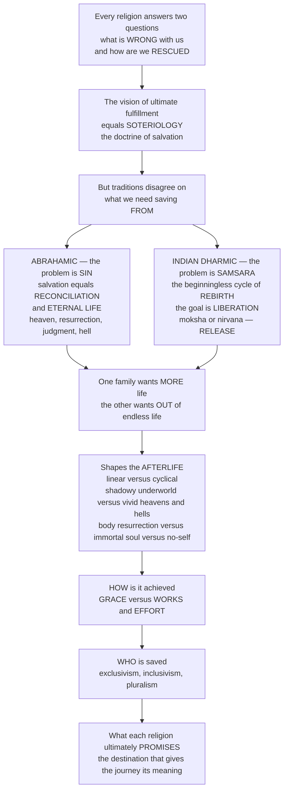

# 🕊️ Salvation, Liberation and the Afterlife

> [!abstract] TL;DR
> Nearly every religion answers two of humanity's most urgent questions — **what is fundamentally WRONG with our condition**, and **how can we be RESCUED from it** — and its answer to the second is its **soteriology** (doctrine of salvation, from *soter*, "savior"): its vision of **ultimate fulfillment**, arguably the "point" of the whole tradition. But traditions disagree radically about what we need saving *from* and what the saved state *is*. For the **Abrahamic** monotheisms the problem is **sin** (estrangement from a holy God) and salvation means **reconciliation** and **eternal life** — pictured as **heaven, resurrection, and judgment**, with hell as the alternative. For the **Indian dharmic** traditions the trap is entirely different: **samsara**, the weary, beginningless cycle of birth, death, and **rebirth** driven by **karma** — and the goal is not more life but **liberation** (*moksha* / *nirvana*), **release** from the cycle altogether. So one family wants **MORE** life (eternal); the other wants **OUT** of endless life. This shapes wildly varied visions of the **afterlife** — linear vs cyclical, shadowy underworld vs vivid heavens and hells, resurrection of the **body** vs immortality of the **soul** vs **no permanent self** at all — and it forces two further debates: whether salvation comes by **grace** or by **works**, and **who** is saved (exclusivism vs inclusivism vs pluralism). These "last things" (**eschatology**) reach from personal death all the way to cosmic destinies — judgment day, messianic ages, and the end or renewal of the world.

---

## Intuition

**Analogy:** Imagine two travelers, each handed a map, each desperate to reach "home." But when you look closely, the maps disagree about *everything that matters* — where home is, what the road is, even what "getting there" means. The first map is a **straight line**: you are born once, you walk a single road, and at its end a gate opens onto an eternal destination — a radiant city if you kept faith, a locked outer darkness if you did not. Home means arriving, once and forever, and staying. The second map is a **circle**: you are born, you die, you are born again, around and around, a wheel that has been turning without beginning. On this map "home" is not a destination you reach *inside* the circle at all — it is the moment the circle finally *breaks* and you step off the wheel entirely. Home means **escape**.

These are the two great "geometries" of religious hope. The traveler on the **line** wants *more* road — an eternal life that never ends. The traveler on the **circle** wants *no more* road — a liberation *out* of endless life. Every technical term follows from this one picture. What we need saving *from* — the **human predicament** — is **sin** and mortality on the line, but the **cycle of rebirth** (*samsara*) itself on the circle. What we are saved *to* — the **highest good**, the *summum bonum* — is **eternal life with God** on the line, but *moksha* or *nirvana*, the **blowing out** of craving, on the circle. And each map answers the same three follow-up questions in its own way: *How* do you travel it — by **grace** (a gift you are given) or by **works** (an effort you make)? *Who* is allowed to arrive — only travelers with this exact map (**exclusivism**), or others too (**inclusivism**, **pluralism**)? And *what lies past the last mile* — a shadowy grey underworld, a vivid heaven or hell, a resurrected body, a disembodied soul, or no permanent self to arrive at all? To study salvation, liberation, and the afterlife is to read these maps side by side and see, in each, the **promise** that gives the whole journey its meaning.

---

## How It Works

Soteriology is best read as a **logical chain**: from the two founding questions (what is wrong, how are we rescued), to the technical name for the answer (soteriology), to the great fork where traditions disagree about the *problem itself* — sin versus samsara — which drives everything downstream: opposite goals (more life vs out of life), radically different afterlife pictures, and the further quarrels over the *mechanism* (grace vs works) and *scope* (who is saved) of rescue. The diagram traces that chain from the universal questions to what each religion finally promises.



**The core mechanics:**

1. **Name the predicament.** Every soteriology begins with a diagnosis of what is fundamentally wrong — **sin** and estrangement (Abrahamic), **ignorance** and **craving** trapping us in **samsara** (dharmic), **alienation** or **disharmony** (much of East Asian thought), or simply **mortality** itself. There is no "salvation" without a prior sense of a problem to be saved from.
2. **Name the resolution — the *summum bonum*.** Against the predicament stands the **highest good** and final goal: reconciliation with God and **eternal life**; **liberation** from rebirth; harmony with the Dao or Heaven; union with ultimate reality. This is the destination that organizes the entire path.
3. **Fix the geometry of destiny.** Is a human life **linear** (one life, then an eternal fate) or **cyclical** (endless rebirth until release)? This single structural choice reshapes the afterlife, the meaning of death, and even the direction of hope — *toward* an eternal state, or *away from* an endless one.
4. **Specify the mechanism.** *How* is rescue obtained — as an unmerited **gift of grace** received in faith, or as something **earned** through works, ethics, ritual, knowledge, and discipline? Most traditions sit somewhere on this **grace–works spectrum** rather than at a pure extreme.
5. **Specify the scope.** *Who* is saved? — only members of my tradition (**exclusivism**), sincere others implicitly (**inclusivism**), or many equally valid paths (**pluralism**)? This is the flashpoint of modern interreligious debate.
6. **Extend to the cosmos.** Individual eschatology (my death and destiny) scales up to **cosmic eschatology** — the end or renewal of the world, judgment day, the messianic age, the return of Christ, the turning of the *yugas*. The personal and the cosmic horizons mirror each other.

---

## Key Concepts

### 🟢 Secondary — the essentials

- **Soteriology.** The doctrine of **salvation** — a tradition's account of the human problem and its ultimate solution. From Greek *soteria* ("deliverance") and *soter* ("savior"). It is arguably the *destination* that gives a whole religion its point.
- **Salvation (Abrahamic).** In **Judaism**, **Christianity**, and **Islam**, the core problem is **sin** and separation from a holy God, and the goal is **reconciliation** with God and **eternal life** — often pictured as **heaven**, bodily **resurrection**, and a final **judgment** (with **hell** as the alternative).
- **Liberation (dharmic).** In the Indian traditions, the problem is **samsara** — the beginningless cycle of birth, death, and **rebirth** driven by **karma** — and the goal is **release**: **moksha** (Hindu) or **nirvana** (Buddhist). Not *more* life, but *out* of the cycle.
- **The afterlife, comparatively.** Beliefs vary enormously: **linear** (one life, then an eternal destiny) vs **cyclical** (reincarnation until liberation); a **shadowy underworld** (Hebrew *Sheol*, Greek *Hades*) vs vivid **heavens and hells**; resurrection of the **body** vs immortality of the **soul** vs **no permanent self**.
- **Grace vs works.** Two answers to *how* salvation is attained: an **unmerited gift** from God/other-power vs something **earned** through ethical living, ritual, law, knowledge, and discipline.

### 🟡 Undergraduate — the distinctions that do the work

- **The predicament and the *summum bonum*.** Every soteriology pairs a **diagnosis** (sin, ignorance, samsara, alienation, mortality) with a **highest good** (the *summum bonum* — the final goal). Comparing religions well means asking *both* questions: what is the disease, and what is full health? Traditions that look similar on one axis diverge sharply on the other.
- **"More life" vs "out of life."** The sharpest contrast in comparative soteriology: Abrahamic hope reaches *toward* an **eternal life** that never ends, while dharmic hope reaches *away from* the wheel — **liberation** is precisely *not* wanting endless existence but the **cessation** of the cycle. Endless life is, for the dharmic frame, the *problem*, not the prize.
- **Resurrection vs immortality vs no-self.** Three rival anthropologies of what survives death. **Resurrection** (Zoroastrian, Jewish, Christian, Islamic) reanimates the *whole embodied person* at the end of time. **Immortality of the soul** (Platonic, much popular Christianity and Hinduism's *atman*) posits a deathless spiritual core that separates from the body. **No permanent self** — Buddhist **anatta** — denies any enduring soul at all, raising the famous puzzle: if there is no self, *what* is reborn? (A causal continuity, "one candle lighting another," not a transmigrating essence.)
- **Moksha and nirvana are not the same "release."** **Moksha** in Vedanta is typically *union with* or *realization of* **Brahman**, the eternal absolute — the drop rejoining the ocean. **Nirvana** in Buddhism is the **extinction** ("blowing out") of the fires of craving, hatred, and delusion — and, given anatta, *not* the merger of a soul with a divine absolute. Both end rebirth; they disagree about what, if anything, "remains."
- **Intermediate states.** Between death and final destiny many traditions place way-stations: Catholic **purgatory** (purification before heaven), the Tibetan Buddhist **bardo** (the between-state before rebirth), **limbo**, and the Islamic **barzakh**. These reveal that "the afterlife" is often a *process*, not a single instantaneous verdict.
- **Self-power vs other-power.** A precise cross-tradition version of grace vs works: Japanese Buddhism names it **jiriki** ("self-power" — Zen's rigorous practice) vs **tariki** ("other-power" — Pure Land's reliance on **Amida** Buddha's vow). It maps strikingly onto the Protestant **sola fide** ("faith alone") vs works debate and onto Hindu **bhakti** (loving surrender) vs **jnana** (liberating knowledge) and **karma yoga** (disciplined action).

### 🔴 Graduate — the debates and the frontier

- **Exclusivism, inclusivism, pluralism.** The scope-of-salvation trilemma, sharpened by modern pluralism. **Exclusivism**: salvation only through my tradition (e.g. *extra ecclesiam nulla salus*, "outside the church no salvation"). **Inclusivism**: my tradition is the true path, but sincere others are saved *implicitly* through it (Karl Rahner's "anonymous Christians"). **Pluralism**: many traditions are independently valid responses to the same ultimate reality — **John Hick's** "Copernican revolution" in theology, re-centering the religions on "the Real" rather than on any one faith. Each option pays a price: exclusivism in moral plausibility, pluralism in fidelity to the traditions' own self-understanding.
- **The problem of hell.** Eternal conscious torment strains the picture of a just and loving God, generating three rival positions still debated in theology: **eternalism** (hell is everlasting), **annihilationism / conditional immortality** (the lost simply cease to exist), and **universalism** (all are ultimately reconciled — *apokatastasis*). The debate is a direct downstream consequence of pairing an infinite God with finite human sin.
- **The historical construction of heaven and hell.** Historians such as **Alan Segal** and **Bart Ehrman** show that vivid afterlives were not present "from the beginning": early Hebrew religion knew only the shadowy, undifferentiated **Sheol**; developed schemes of resurrection, reward, and punishment emerged relatively *late*, under **Zoroastrian**, Hellenistic, and apocalyptic influence, crystallizing in Second Temple Judaism and early Christianity. The afterlife has a **history** — it evolved.
- **Karma as cosmic bookkeeping — and its tensions.** Karma makes the moral order self-enforcing across lifetimes, elegantly answering the **problem of evil** (present suffering as the ripening of past deeds). But it also invites the charge of **theodicy-by-blame** (rationalizing the suffering of the innocent as deserved) and raises the technical puzzle of *how* karmic residue is stored and transmitted — especially acute for Buddhism, which denies a permanent self to carry it.
- **Cosmic eschatology and millenarianism.** Individual destiny scales to the collective: the **apocalypse**, the **Day of Judgment**, the **messianic age**, the **return of Christ** (*parousia*), the Hindu **Kali Yuga** and cyclic cosmic renovation. **Millenarian** and **apocalyptic** movements — expecting an imminent, radical, this-worldly transformation — recur across history and often power new religious movements and revolutionary politics; eschatology is not merely otherworldly but a potent engine of social action.
- **Soteriology as the organizing key of a tradition.** A methodological claim in comparative religion (associated with scholars from **Joachim Wach** to **John Hick**): if you want to understand a religion's *inner logic*, ask what it thinks is ultimately wrong and what it offers as final rescue. Doctrine, ritual, ethics, and myth all orient toward this **horizon**; the promise at the end explains the shape of the path.

---

## Python Demo

```python
# Salvation, liberation, and the afterlife, made visual with numpy + matplotlib.
#   (a) TWO GEOMETRIES OF ULTIMATE DESTINY:
#       - LINEAR (Abrahamic): one life -> a single JUDGMENT -> an ABSORBING
#         eternal state (heaven or hell). A one-time sorting.
#       - CYCLICAL (dharmic): repeated REBIRTH in samsara (a Markov cycle)
#         until reaching the ABSORBING liberation state (moksha / nirvana)
#         that EXITS the wheel. A slow escape.
#   (b) GRACE vs WORKS: the MECHANISM of salvation.
#       - WORKS: EARNED and GRADED  -> attainment rises smoothly with effort.
#       - GRACE: an UNEARNED GIFT with a faith THRESHOLD -> near all-or-nothing.
# The figures are teaching heuristics, NOT empirical claims about any religion.

import numpy as np
import matplotlib.pyplot as plt

rng = np.random.default_rng(7)

# ============================================================
# (a1) LINEAR destiny: one life -> judgment -> eternal heaven/hell
#      A single branching event: each soul is judged ONCE on a latent
#      moral/faith state, then the outcome is eternal (absorbing).
# ============================================================
N = 20000
righteousness = rng.normal(0.0, 1.0, N)                  # latent moral/faith state
p_heaven = 1.0 / (1.0 + np.exp(-1.2 * righteousness))    # logistic "judgment"
heaven = rng.random(N) < p_heaven
linear_dist = np.array([heaven.mean(), 1.0 - heaven.mean()])   # [heaven, hell]

# ============================================================
# (a2) CYCLICAL destiny: rebirth in samsara until liberation.
#      Each lifetime carries a small chance of RELEASE (moksha/nirvana);
#      otherwise the soul is reborn. Liberation is the ABSORBING exit.
# ============================================================
n_lives = 60
p_liberate = 0.06                                        # per-life chance of release
in_samsara = np.ones(N, dtype=bool)                      # all start bound to the wheel
frac_liberated = np.zeros(n_lives)
for life in range(n_lives):
    attain = in_samsara & (rng.random(N) < p_liberate)   # some awaken this life
    in_samsara &= ~attain
    frac_liberated[life] = 1.0 - in_samsara.mean()

# ============================================================
# (b1) GRACE vs WORKS: salvation attainment vs accumulated merit/effort
# ============================================================
merit = np.linspace(0.0, 1.0, 300)
p_works = merit ** 1.5                                   # earned, graded
thr = 0.25
p_grace = 1.0 / (1.0 + np.exp(-40.0 * (merit - thr)))    # unearned gift, threshold

# ============================================================
# (b2) Population OUTCOME distributions under each mechanism
# ============================================================
pop_merit = rng.beta(2.0, 2.0, N)                        # a population spread of effort
sal_works = pop_merit ** 1.5
sal_grace = 1.0 / (1.0 + np.exp(-40.0 * (pop_merit - thr)))

# ============================================================
# Plot
# ============================================================
fig, ax = plt.subplots(2, 2, figsize=(14, 9))

# (a1) linear: a one-time sorting
ax[0, 0].bar(["Heaven", "Hell"], linear_dist, color=["#e0b13a", "#7a2f2f"])
ax[0, 0].set_title("(a1) LINEAR destiny: one life -> a single judgment (a one-time sorting)")
ax[0, 0].set_ylabel("fraction of souls"); ax[0, 0].set_ylim(0, 1)
for i, v in enumerate(linear_dist):
    ax[0, 0].text(i, v + 0.015, f"{v:.2f}", ha="center")

# (a2) cyclical: a slow escape from the wheel
lives = np.arange(1, n_lives + 1)
ax[0, 1].plot(lives, frac_liberated, color="#2a7", lw=2.4, label="liberated (exited cycle)")
ax[0, 1].plot(lives, 1 - frac_liberated, color="#8367c7", lw=2.0, ls="--",
              label="still in samsara")
ax[0, 1].set_title("(a2) CYCLICAL destiny: a slow escape from the wheel of rebirth")
ax[0, 1].set_xlabel("lifetimes"); ax[0, 1].set_ylabel("fraction of souls")
ax[0, 1].set_ylim(0, 1.02); ax[0, 1].legend(fontsize=8)

# (b1) the two mechanisms
ax[1, 0].plot(merit, p_works, color="#c33", lw=2.4, label="WORKS: earned & graded")
ax[1, 0].plot(merit, p_grace, color="#36c", lw=2.4, label="GRACE: unearned gift, threshold")
ax[1, 0].axvline(thr, color="gray", ls=":", lw=1.2)
ax[1, 0].set_title("(b1) Mechanism of salvation: grace vs works")
ax[1, 0].set_xlabel("accumulated merit / effort")
ax[1, 0].set_ylabel("attainment of salvation")
ax[1, 0].legend(fontsize=8)

# (b2) two mechanisms -> two population distributions
ax[1, 1].hist(sal_works, bins=25, color="#c33", alpha=0.55, label="WORKS: graded spread")
ax[1, 1].hist(sal_grace, bins=25, color="#36c", alpha=0.55, label="GRACE: near 0-or-1")
ax[1, 1].set_title("(b2) Population outcomes: two mechanisms, two distributions")
ax[1, 1].set_xlabel("salvation attainment"); ax[1, 1].set_ylabel("number of people")
ax[1, 1].legend(fontsize=8)

plt.tight_layout()
plt.savefig("salvation_liberation_afterlife.png", dpi=130, bbox_inches="tight")
plt.show()

# Console summary
print(f"Linear model:   heaven={linear_dist[0]:.3f}, hell={linear_dist[1]:.3f}")
print(f"Cyclical model: liberated after {n_lives} lives = {frac_liberated[-1]:.3f}")
print(f"'Half-life' of samsara ~ {np.log(0.5)/np.log(1-p_liberate):.1f} lifetimes")
```

**What the figure teaches.** Panels (a1)–(a2) make visible the two great **geometries of destiny**. The **linear** Abrahamic model (a1) is a *one-shot sorting*: a single judgment fixes an eternal heaven-or-hell distribution once and for all — the destiny of a soul is decided in one branching event. The **cyclical** dharmic model (a2) is utterly different in *shape*: no one is sorted at a single verdict; instead the population **slowly drains out of samsara** as, life after life, a fraction attains **liberation** and exits the wheel — a geometric decay whose "half-life" is many lifetimes. The two curves dramatize why "eternal life" and "release from the cycle" are *opposite* goals: one is a permanent **arrival**, the other a hard-won **departure**. Panels (b1)–(b2) contrast the two **mechanisms** of rescue. Under **works**, salvation is *earned and graded* — attainment rises smoothly with effort, so a population spreads across the whole range of outcomes. Under **grace**, salvation is an *unearned gift* switched on at a faith **threshold** — a near all-or-nothing step, so the same population collapses toward **0 or 1**. Same people, same effort distribution, radically different destinies: the mechanism is not a footnote but reshapes who ends up saved.

---

## Real-World Applications

- **Interfaith dialogue and the pluralism debate.** The **exclusivism / inclusivism / pluralism** trilemma is not academic: it governs how religious communities regard one another, shapes real theological statements (e.g. Vatican II's cautious inclusivism), and underlies practical questions of proselytism, cooperation, and coexistence in pluralistic societies.
- **Hospice, palliative care, and grief.** Beliefs about death and the afterlife directly shape end-of-life practice — how the dying are accompanied, what rituals are performed, how the bereaved grieve. Chaplaincy and medical ethics must engage a patient's soteriology (heaven, reunion, rebirth, or nothing) with competence, not condescension.
- **Comparative theology and religious literacy.** Reading traditions *by their soteriologies* — asking what each thinks is wrong and what it promises — is one of the most powerful organizing lenses in the academic study of religion, cutting through surface differences to a tradition's inner logic.
- **Apocalyptic and millenarian movements.** Cosmic eschatology powers real-world action: messianic expectation, end-times movements, and revolutionary millenarianism (from historical apocalyptic sects to modern new religious movements) show that beliefs about the *end* can drive politics, migration, and conflict in the present.
- **Ethics and motivation.** The **grace–works** question is not merely doctrinal: it shapes lived ethics and psychology — whether one acts from grateful response to an unearned gift or from the effortful accrual of merit — and echoes in secular debates about desert, reward, and moral motivation.

---

## Common Pitfalls

- **Assuming all religions offer "life after death" in the same sense.** The word "afterlife" smuggles in a *linear* frame. For the dharmic traditions the goal is precisely to *stop* being reborn; "eternal continued existence" is the disease, not the cure. Never flatten "release from the cycle" into "going to a nice place after you die."
- **Treating reincarnation and resurrection as variants of one idea.** They are structurally opposite. **Resurrection** reanimates the *one* embodied person at the *end of time* on a linear track; **reincarnation** recycles beings through *many* lives on a cyclical track. Conflating them erases the deepest divide in comparative soteriology.
- **Reading Buddhist rebirth as a soul transmigrating.** Buddhism denies a permanent self (**anatta**), so nothing like a Hindu *atman* travels between lives. Rebirth is **causal continuity** (karmic momentum), not the journey of an essence — "one flame lighting another," neither the same nor entirely different.
- **Projecting Christian "heaven and hell" backward and everywhere.** The vivid, morally sorted afterlife has a *history*: early Hebrew religion knew only the grey, undifferentiated **Sheol**, and developed heavens and hells emerged late, under Zoroastrian and Hellenistic influence. Assuming every tradition "always" had heaven and hell is anachronism.
- **Equating moksha with nirvana (or either with heaven).** Moksha is often *union with Brahman*; nirvana is the *extinction of craving* with **no** self merging into an absolute; neither is a heaven you are *sent to* as a reward. Different mechanisms, different metaphysics, different "remainder."
- **Caricaturing grace vs works as Protestant-only.** The same axis runs across traditions — Pure Land's **tariki** vs Zen's **jiriki**, *bhakti*'s surrender vs *jnana*'s knowledge and *karma yoga*'s action. Treating it as a purely Christian quarrel misses one of the most useful *comparative* dials in the whole field.

---

## Related Concepts

- [[The_Egyptian_Afterlife]] — one of history's most elaborate afterlife systems: the weighing of the heart against Ma'at, the judgment of Osiris, and the promise of continued existence — a vivid contrast to the shadowy underworlds and a case study in "afterlife as moral accounting."
- [[The_Greek_Underworld]] — **Hades** as the archetypal *shadowy* underworld (like Hebrew *Sheol*): a grey, undifferentiated abode of the dead, before Greek thought developed the sunlit **Elysium** and the punishing **Tartarus** — the very transition from underworld to heaven-and-hell.
- [[The_Celtic_Otherworld]] — the "Otherworld" as a third model distinct from both underworld and heaven/hell: a parallel realm of the blessed, illustrating how varied and non-moralized afterlife geographies can be.
- [[Avatars_Yugas_and_Cosmic_Cycles]] — the dharmic cosmology of **karma**, **samsara**, and cyclic time (the turning **yugas**, the **Kali Yuga**) that frames *moksha* as escape from the wheel — and the model of *cosmic* eschatology as endless renovation rather than a single end.
- [[Personal_Identity]] — the Western philosophical problem of what makes you the same person over time: the crux of every afterlife claim. Resurrection, soul-immortality, and Buddhist no-self are rival answers, close to the debates of Locke, Hume, and Parfit.
- [[Buddhist_Philosophy]] — the rigorous account of **anatta**, dependent origination, and **nirvana** underlying Buddhism's answer to "what is reborn if there is no self?" and its distinctive vision of liberation as extinction rather than union.
- [[Hindu_Philosophy_and_Vedanta]] — the **atman / Brahman** doctrine behind **moksha** as realization of, or union with, the eternal absolute — the affirmed-self counterpart that Buddhist no-self directly negates.

Within this vault, this note is the comparative capstone to the six major-tradition notes it draws on — *Judaism_and_the_Covenant_Tradition* (covenantal life and *olam ha-ba*, the world-to-come), *Christianity_and_the_Christian_Traditions* (atonement, grace, faith, resurrection, and eternal life), *Islam_and_the_Islamic_Tradition* (submission, judgment, and Paradise/Jannah), *Hinduism_and_the_Dharmic_Traditions* (karma, samsara, and the paths to moksha), *Buddhism_and_the_Path_to_Liberation* (nirvana and the end of rebirth), and *East_Asian_and_Indigenous_Religions* (ancestor-existence, the "living dead," and harmony rather than escape). It also stands beside its prose-only siblings in this section — *Theology_and_Religious_Doctrine* (the systematic reasoning that formalizes these doctrines), *Concepts_of_the_Divine_and_Ultimate_Reality* (the God or Absolute one is saved *to* — and John Hick's pluralist "Real"), *Problem_of_Evil_and_Theodicy* (which karma and hell attempt to answer), and *Ethics_and_Religious_Law* (the "works" whose salvific role the grace–works debate contests).

---

## Review Questions

**🟢 Secondary.** Explain, in your own words, why an Abrahamic believer hoping for *eternal life* and a Buddhist hoping for *nirvana* are pursuing, in a sense, **opposite** goals. What is each one hoping to be saved *from*, and what are they hoping to be saved *to*?

**🟡 Undergraduate.** Compare **resurrection of the body**, **immortality of the soul**, and Buddhist **no-self** as three answers to the question "what survives death?" For each, state what continues, and explain the specific puzzle it must solve (e.g., for no-self: what is "reborn" if there is no soul?). Then place each on the **grace–works** spectrum with a justification.

**🔴 Graduate.** John Hick argued for a pluralist "Copernican revolution" that re-centers the religions on "the Real" rather than on any single tradition, while historians such as Segal and Ehrman show that concepts like heaven and hell *evolved* historically. Using **both** the *scope* debate (exclusivism / inclusivism / pluralism) and the *historical development* of afterlife beliefs, construct an argument for **or** against the claim that the world's soteriologies are "many valid paths to the same ultimate reality." What does each tradition's own self-understanding lose, and what does comparative honesty gain?

---

## Sources

- Alan F. Segal, *Life After Death: A History of the Afterlife in the Religions of the West* (Doubleday, 2004) — the authoritative scholarly history of Western afterlife beliefs.
- Bart D. Ehrman, *Heaven and Hell: A History of the Afterlife* (Simon & Schuster, 2020) — accessible account of how heaven and hell were *invented*, from Sheol to the New Testament.
- John Hick, *Death and Eternal Life* (Harper & Row, 1976) — a landmark global-philosophical treatment of survival, resurrection, rebirth, and pluralism.
- John Hick, *An Interpretation of Religion: Human Responses to the Transcendent* (Yale, 1989) — the mature statement of the pluralist "Real" and the salvation-as-transformation thesis.
- Jonathan Z. Smith (ed.), *The HarperCollins Dictionary of Religion* (1995) — reference entries on *soteriology*, *eschatology*, *moksha*, *nirvana*, and *afterlife* for comparative grounding.

---

#religious-studies #salvation #moksha-and-nirvana #afterlife #eschatology
