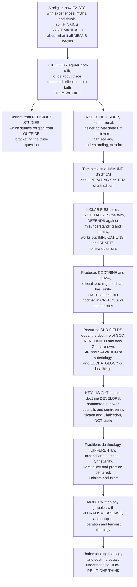

# 🕊️ Theology and Religious Doctrine

> [!abstract] TL;DR
> Once a religion exists — with its experiences, myths, and rituals — a distinctive intellectual activity begins: **thinking systematically about what it all means**. That activity is **theology** (literally *"god-talk"*, *logos* about *theos*): the disciplined, reasoned, critical reflection on the content of a religious faith undertaken **from within** that faith. This is crucially different from **religious studies**, which studies religion from *outside*, neutrally: theology is a **"second-order," confessional, insider activity** done *by* believers, reasoning about God, revelation, salvation, and last things while taking the faith's truth as its starting point — Anselm's *"faith seeking understanding"* (*fides quaerens intellectum*). Think of theology as a tradition's intellectual **immune system and operating system**: it clarifies what the community believes, systematizes it, defends it against misunderstanding and heresy (**apologetics**, **orthodoxy** vs **heresy**), works out its implications, and adapts it to new questions. Its outputs are **doctrine** (an authoritative teaching), **dogma** (a doctrine held as definitively binding), and **creeds** (concise official statements of belief — the Nicene Creed, the Shahada, the articles of faith), often codified in a **catechism**. Theology's standard problems recur: what God is like (the doctrine of God), how God is known (revelation), what is wrong with the world and how it is fixed (sin and **soteriology**), and how it all ends (**eschatology**). The key insight is that **doctrine develops** — it is not static: the great creeds were hammered out over centuries of controversy and councils (the trinitarian and christological fights, Nicaea and Chalcedon), so theology is a **living, historical, argumentative tradition**, not a fixed rulebook. Traditions "do theology" very differently — highly doctrinal and creedal (Christianity) versus law- and practice-centered (Judaism, Islam) versus traditions with little interest in "belief" at all — and modern theology grapples with pluralism, science, and critique (liberation, feminist, comparative theologies). To understand theology and doctrine is to understand **how religions think**.

---

## Intuition

**Analogy:** Imagine a community that has just built something enormous and alive — a shared world of stories, rituals, festivals, and vivid experiences of the holy. At first they simply *live* in it: they tell the sacred story, keep the feast, feel the awe. But sooner or later someone asks a sharp question — *"Wait: if God is one, and we also call this teacher divine, then how many are there? And what exactly are we claiming when we say the world was 'created'?"* The moment the community starts **reasoning carefully about what its own faith actually means and implies**, a new activity is born. That activity is **theology**. It is not the religion itself; it is the religion **thinking about itself, from the inside** — the way a body has an immune system that patrols its own boundaries, and an operating system that coordinates everything running on top of it.

That inside-ness is the whole point, and it is exactly what separates theology from **religious studies**. A scholar of religion studies faith the way a naturalist studies finches — from the outside, *bracketing* the question "is any of this true?" A theologian works **inside** a tradition and takes its truth as the *starting point*, then reasons about God, revelation, sin, and salvation from there. Anselm's medieval slogan names the move precisely: *fides quaerens intellectum*, **"faith seeking understanding"** — you do not reason your way *to* faith and then believe; you *begin* in faith and reason your way *into* deeper understanding of it. The disciplined output of that reasoning is **doctrine** and **dogma** — the official, authoritative teachings a community holds (the Trinity, the two natures of Christ, *tawhid*, karma) and often freezes into **creeds**. And here is the subtle, load-bearing insight that beginners always miss: **doctrine is not a static rulebook handed down whole**. The great doctrines were *hammered out* over centuries of ferocious debate, controversy, and councils — the early church nearly tore itself apart fighting over how Father and Son are related — so theology is a **living, evolving, argumentative** tradition. Different religions even *do* this differently: some are obsessed with getting belief exactly right and codifying it in creeds (Christianity), others care far more about right *practice* and law than about systematic dogma (Judaism, Islam), and some have almost no interest in "belief" at all. Learn theology and you learn the thing every other note in this vault presupposes: the **reasoned, systematic, evolving articulation of faith from the inside**.

---

## How It Works

Theology moves through a definite logic: from the birth of systematic reflection *inside* a living faith, through its **task** (clarify, systematize, defend, adapt), to its **outputs** (doctrine, dogma, creeds), its recurring **sub-fields** (God, revelation, sin/salvation, last things), the crucial insight that **doctrine develops** through councils and controversy, and finally the **diversity** of theological styles and the challenges of modernity. The diagram traces that arc from "a religion now exists" to "how religions think."



**The core mechanics of theology and doctrine:**

1. **Start inside the faith.** Theology is a *second-order* activity: religion is the first-order life of experience, myth, and ritual; theology is the disciplined *reflection on* that life, conducted by adherents who take the faith's truth as a premise, not a hypothesis. This is the **confessional / insider** stance — the mirror image of the neutral, outsider stance surveyed in the *Religious_Studies_and_Comparative_Religion_Overview* and in *Methods_in_the_Study_of_Religion*.
2. **Reason from faith (not to it).** The classic self-definitions — Anselm's *fides quaerens intellectum* and Augustine's *"believe so that you may understand"* — mark theology off from **philosophy of religion**, which analyzes religious claims from *neutral* reason without presupposing them (see the coming sibling on *Faith_Reason_and_Religious_Epistemology*).
3. **Do the tradition's intellectual work.** Theology **articulates and systematizes** the faith (systematic / dogmatic theology), **interprets** scripture and tradition, **defends** the faith (apologetics), **polices boundaries** (defining orthodoxy against heresy), and **applies** the faith to new contexts (constructive / contextual theology).
4. **Produce authoritative outputs.** The results are **doctrine**, **dogma**, and **creed** — teachings a community holds, ranks by bindingness, and codifies (the Nicene Creed, the Shahada, the Thirty-Nine Articles, a catechism).
5. **Recognize development.** Doctrine is **historical**: it is *worked out* over time through controversy, councils, and reinterpretation. Orthodoxy is an *achievement*, not a given — which is why the same question can end with one view crowned "orthodox" and its rivals branded "heresy."

---

## Key Concepts

### 🟢 Secondary — the basic idea

- **Theology means "god-talk."** From Greek *theos* (god) + *logos* (word, reason, study): theology is **careful, organized thinking about God and about what a religion teaches**, done by people *inside* that religion who already believe it.
- **Inside vs. outside.** **Religious studies** looks at religion from the *outside* and does not take sides on whether it is true. **Theology** works from the *inside* and starts by assuming the faith is true, then thinks hard about what that means. Both are valuable; they are just different jobs.
- **"Faith seeking understanding."** A famous old motto (from **Anselm**): you do not have to figure everything out before you believe. You *begin* by believing, and then use your mind to understand your faith better.
- **Doctrine, dogma, creed.** A **doctrine** is an official *teaching* of a religion (for example, "God is a Trinity"). A **dogma** is a doctrine the community treats as *definitely true and required*. A **creed** is a short, official *statement of belief* everyone recites — like the Christian **Nicene Creed** or the Muslim **Shahada** ("There is no god but God, and Muhammad is His messenger").
- **The big questions theology asks.** What is God like? How do we know anything about God (**revelation**)? What is wrong with the world, and how is it made right (**sin** and **salvation**)? How will everything end (**last things**)?
- **Doctrine was *worked out*, not just handed down.** The great teachings were argued over for *centuries* in big meetings called **councils**. Belief has a *history*.

### 🟡 Undergraduate — the task, the outputs, and the branches

- **The definitions that shaped the field.** **Anselm of Canterbury**: *fides quaerens intellectum*, "faith seeking understanding." **Augustine**: *credo ut intelligam*, "I believe in order that I may understand" — faith and reason as partners, not rivals (developed in the Philosophy vault's *Augustine_and_Early_Christian_Thought* and *Faith_and_Reason*). Theology is thus **reason operating within the horizon of faith**.
- **Theology vs. philosophy of religion vs. religious studies.** Three distinct stances on the same object:
  1. **Theology** reasons *from* faith and revelation (confessional, insider, first-person).
  2. **Philosophy of religion** analyzes religious claims *from neutral reason* (arguments for God, the problem of evil) without presupposing any faith — the angle of *Aquinas_and_Scholasticism* where the two overlap.
  3. **Religious studies** describes and compares religions *from outside*, non-confessionally (the vault's *Religious_Studies_and_Comparative_Religion_Overview*).
- **What theology *does* — its tasks.** Following the standard divisions: **systematic / dogmatic theology** (organizing the whole of belief into a coherent system), **biblical / historical theology** (interpreting scripture and tradition — the hermeneutical task), **apologetics** (defending the faith against objection), **moral theology** (ethics), and **practical / pastoral theology** (applying it). Theology is the **doctrinal / philosophical dimension** in Ninian Smart's seven-dimension anatomy of religion.
- **Doctrine, dogma, and authority.** The difference between **doctrine** and **dogma** is *bindingness and authority*: every dogma is a doctrine, but a dogma is a doctrine the community's authority (a council, a magisterium, a consensus of scholars) has declared *definitive and non-negotiable*. **Heresy** is, by definition, a *rejected* doctrine — literally *hairesis*, "a choosing," a position the community ruled out of bounds.
- **Creeds, confessions, catechisms.** Concise, authoritative belief-statements: the **Nicene** and **Apostles'** Creeds, the Reformation **confessions** (Augsburg, Westminster), the **Thirty-Nine Articles**, and teaching **catechisms**. Islam's **Shahada** and its "articles of faith" (*iman*), Judaism's **Maimonides' Thirteen Principles** — each tradition's compact answer to "what do we hold?"
- **Sources and their weighting.** Doctrine is drawn from **scripture, tradition, reason, and experience** — and traditions differ on *how to weight them*. The Anglican **"Wesleyan Quadrilateral"** (scripture, tradition, reason, experience) is one influential balance; Catholicism weights scripture-plus-tradition-plus-magisterium; the Reformation slogan *sola scriptura* elevates scripture alone.
- **Orthodoxy vs. orthopraxy.** *Ortho-doxy* means "right **belief**"; *ortho-praxy* means "right **practice**." Christianity is unusually orthodoxy-centered; Judaism and Islam are far more orthopraxy-centered — rich in **law** (*halakha*, *sharia*) and jurisprudence, less fixated on a single systematic creed (the coming sibling on *Ethics_and_Religious_Law* develops this).
- **The standard branches (loci) of theology.** In Christian systematics, with analogues elsewhere: the **doctrine of God** / theology proper (see the coming sibling on *Concepts_of_the_Divine_and_Ultimate_Reality*); **revelation** (how God is known); **creation and providence**; **theological anthropology** (humanity, sin, the Fall); **Christology** (the nature of the founder); **soteriology** (salvation — see the coming sibling on *Salvation_Liberation_and_the_Afterlife*); **pneumatology** (the Spirit); **ecclesiology** (the church); **sacraments**; **moral theology** (ethics); and **eschatology** (last things).
- **Parallel traditions outside Christianity.** Systematic religious thought is universal even where the word "theology" fits awkwardly: Islamic **kalam** (dialectical theology) and **falsafa** (philosophy); Jewish thought and **Maimonides** (see *Islamic_and_Jewish_Philosophy*); Hindu and Buddhist philosophical schools (Vedanta, Madhyamaka); Confucian and Daoist thought. Each is a tradition reasoning systematically about its own ultimate concerns.

### 🔴 Graduate — development, power, and modernity

- **The development of doctrine.** Doctrine is **historical and developing**, not delivered whole. **John Henry Newman**'s *Essay on the Development of Christian Doctrine* (1845) argued that authentic doctrine *grows* like an organism — the implicit made explicit — and offered "notes" (preservation of type, continuity of principles, assimilative power) to distinguish legitimate **development** from **corruption**. Doctrine is thus continuity *and* change: the same faith, more fully understood.
- **Orthodoxy as an achievement of controversy.** The load-bearing doctrines were forged in **conflict**. The **trinitarian controversy** (fourth century) pitted **Arius** — "there was a time when the Son was not," the Son a supreme *creature* — against **Athanasius** — the Son *homoousios* (of one substance) with the Father; the **Council of Nicaea (325)** and Constantinople (381) settled the creed. The **christological controversies** over how divinity and humanity coexist in Christ ran through Ephesus (431) to **Chalcedon (451)** ("two natures, one person"). Later, the **filioque** clause helped split East and West (Great Schism, 1054), and the **Reformation** (1517) shattered Western doctrinal unity (see *The_Protestant_Reformation*).
- **The social construction of orthodoxy — power and doctrine.** *Whose* theology becomes "orthodox" is not decided by argument alone. **Walter Bauer** (*Orthodoxy and Heresy in Earliest Christianity*, 1934) argued that "heresy" was often chronologically *prior* and locally dominant — that orthodoxy is the position that *won*, partly through ecclesiastical and imperial power (Constantine convened Nicaea). Reading doctrine critically means asking *cui bono* — whose interests a given orthodoxy served — a theme that connects to the sociology of religion.
- **Natural vs. revealed theology.** **Natural theology** reasons to God from nature and unaided reason (Aquinas's Five Ways); **revealed theology** works from what God has disclosed (scripture, the Incarnation). The balance — and whether natural theology is even legitimate (**Karl Barth**'s thunderous *"Nein!"* to it) — is a central modern fault line.
- **Apophatic (negative) theology.** Because the infinite exceeds finite concepts, the **apophatic** tradition (Pseudo-Dionysius, Maimonides, the *Neti neti* — "not this, not that" — of Advaita Vedanta) insists we know God better by **negation**: saying what God is *not*. Its counterpart, **cataphatic** (positive) theology, affirms attributes analogically. This is the doctrine-of-God's deepest methodological problem.
- **Modernity's three great challenges.** (1) The **Enlightenment and historical criticism** — reading scripture as a human, historical document (Spinoza, then nineteenth-century *higher criticism*) — forced theology to rethink revelation and inspiration. (2) **Science** — Copernicus, Darwin, cosmology — reframed creation and providence (the science-and-faith negotiation of *Faith_and_Reason*). (3) **Religious pluralism** — the sheer plurality of faiths — generated **comparative theology** and the exclusivist / inclusivist / pluralist typologies (Hick).
- **Contextual and critical theologies — theology from the margins.** Twentieth- and twenty-first-century theology increasingly *starts from experience and oppression*: **liberation theology** (Gustavo **Gutiérrez**, *A Theology of Liberation*, 1971 — God's "preferential option for the poor," theology as reflection on praxis), **feminist** and **womanist** theology (Ruether, Daly, Grant), **black** theology (Cone), and **postcolonial** and **queer** theologies. These insist that *who* does theology, and *from where*, shapes what it sees — doctrine reinterpreted in light of justice and lived experience (a theme extended in the coming section on religion and society).
- **Demythologizing and the hermeneutical turn.** Rudolf **Bultmann**'s program to *demythologize* the New Testament — recovering its existential *kerygma* from its mythic cosmology — exemplifies theology's modern grappling with the **hermeneutics** of its own texts (see the Literature vault's *Hermeneutics_and_Interpretation*). Doctrine is inseparable from *interpretation*.

---

## Python Demo

```python
# Theology and doctrine in three pictures:
#   (a) DOCTRINAL DEVELOPMENT as CONCEPT-SPACE CONVERGENCE. We model a
#       community of thinkers debating ONE theological question -- the
#       relation of Father and Son -- along a 1D belief axis:
#           -1.0  Modalist  (Father and Son are identical / one person)
#            0.0  NICENE     (co-equal, "of one substance" / homoousios) <- becomes orthodox
#           +0.5  Semi-Arian (homoiousios, "of similar substance")
#           +1.0  ARIAN      (the Son is a created being)
#       Over successive "council" rounds, positions move under (i) social
#       influence toward the crowd's center of gravity and (ii) rising
#       "conciliar pressure" toward the position being SELECTED as orthodox.
#       The distribution NARROWS to an orthodox consensus; the tails that
#       remain get labeled "heresy". Doctrine is a DEVELOPED, CONTESTED,
#       SELECTED outcome -- not a static given.
#   (b) DOCTRINE-vs-PRACTICE SPECTRUM. We place five traditions in a 2D
#       space: how DOCTRINAL / CREEDAL (systematic dogma matters) vs how
#       ORTHOPRAXIC / LAW-CENTERED (right practice matters). Creedal and
#       law-centered religions "do theology" very differently.
#   (c) CREEDAL FAMILY TREE. Doctrine BRANCHES: schisms (filioque 1054,
#       the Reformation 1517) split one creedal trunk into denominations.
# All figures are conceptual teaching heuristics, not empirical measurements.

import numpy as np
import matplotlib
matplotlib.use("Agg")
import matplotlib.pyplot as plt

rng = np.random.default_rng(7)

# ======================================================================
# (a) DOCTRINAL CONVERGENCE over council rounds
# ======================================================================
N = 260                      # thinkers in the debating community
ROUNDS = 9                   # successive councils / generations
ORTHODOX = 0.0               # the Nicene position that gets selected
HERESY_BAND = 0.45           # |x| beyond this at the end = labeled "heresy"

# initial positions: a broad, roughly uniform spread of opinion [-1, 1],
# with small clumps near the named early positions.
x = np.concatenate([
    rng.uniform(-1.0, 1.0, N - 60),
    rng.normal(+1.0, 0.06, 20),   # Arian clump
    rng.normal(+0.5, 0.06, 20),   # semi-Arian clump
    rng.normal(-1.0, 0.06, 20),   # Modalist clump
])
x = np.clip(x, -1.15, 1.15)

history = [x.copy()]
frac_orthodox = []
for r in range(ROUNDS):
    crowd_mean = x.mean()
    # conciliar pressure toward the selected orthodox point rises each round
    pressure = 0.06 + 0.34 * (r / (ROUNDS - 1))
    social = 0.12                                   # pull toward the crowd
    noise = 0.05 * (1.0 - r / ROUNDS)               # debate cools over time
    x = (x
         + pressure * (ORTHODOX - x)
         + social * (crowd_mean - x)
         + rng.normal(0, noise, x.shape))
    x = np.clip(x, -1.15, 1.15)
    history.append(x.copy())
    frac_orthodox.append(np.mean(np.abs(x) < 0.15))

# ======================================================================
# (b) DOCTRINE-vs-PRACTICE SPECTRUM
#     x = doctrinal / creedal emphasis (0..10), y = orthopraxic / law emphasis
# ======================================================================
traditions = {
    "Christianity":  (8.8, 5.2),   # highly creedal / doctrinal
    "Islam":         (6.0, 8.8),   # strong law (sharia) + articles of faith
    "Judaism":       (4.2, 9.0),   # halakha-centered, less systematic dogma
    "Buddhism":      (5.5, 7.0),   # doctrine (dharma) + heavy practice
    "Hinduism":      (5.0, 8.2),   # orthopraxy/dharma over single creed
}

# ======================================================================
# (c) CREEDAL FAMILY TREE (doctrinal branching via schism)
#     nodes: (x, y, label); edges connect parent -> child
# ======================================================================
nodes = {
    "early":   (0.50, 1.00, "Early Church\n(shared creed)"),
    "east":    (0.18, 0.66, "Eastern\nOrthodoxy"),
    "west":    (0.72, 0.66, "Western\n(Latin) Church"),
    "cath":    (0.55, 0.32, "Roman\nCatholicism"),
    "prot":    (0.86, 0.32, "Protestantism"),
    "luth":    (0.66, 0.03, "Lutheran"),
    "ref":     (0.86, 0.03, "Reformed"),
    "angl":    (1.06, 0.03, "Anglican"),
}
edges = [
    ("early", "east", "filioque schism 1054"),
    ("early", "west", ""),
    ("west",  "cath", ""),
    ("west",  "prot", "Reformation 1517"),
    ("prot",  "luth", ""),
    ("prot",  "ref",  ""),
    ("prot",  "angl", ""),
]

# ======================================================================
# Plot
# ======================================================================
fig = plt.figure(figsize=(16, 5.6))

# ---- (a) convergence: violin-like snapshots + orthodox-fraction curve --
ax1 = fig.add_subplot(1, 3, 1)
snap_rounds = [0, 3, 6, ROUNDS]          # which rounds to show as distributions
bins = np.linspace(-1.15, 1.15, 40)
for i, rr in enumerate(snap_rounds):
    counts, edgs = np.histogram(history[rr], bins=bins, density=True)
    centers = 0.5 * (edgs[:-1] + edgs[1:])
    width = 0.9 / len(snap_rounds)
    base = i
    ax1.barh(centers, counts * width * 2.2, left=base, height=(bins[1]-bins[0]),
             color=plt.cm.plasma(i / len(snap_rounds)), alpha=0.85)
    ax1.text(base + 0.05, 1.28, f"council {rr}", fontsize=7.5, rotation=0)
ax1.axhline(ORTHODOX, color="#16a34a", lw=1.4, ls="-")
ax1.text(len(snap_rounds) - 0.9, 0.03, "NICENE\northodoxy",
         color="#166534", fontsize=7.5, va="bottom")
ax1.axhspan(HERESY_BAND, 1.3, color="#dc2626", alpha=0.07)
ax1.axhspan(-1.3, -HERESY_BAND, color="#dc2626", alpha=0.07)
ax1.text(0.05, 1.02, "ARIAN (heresy)", color="#b91c1c", fontsize=7)
ax1.text(0.05, -1.05, "MODALIST (heresy)", color="#b91c1c", fontsize=7)
ax1.set_ylim(-1.3, 1.45)
ax1.set_xlim(-0.2, len(snap_rounds) + 0.2)
ax1.set_yticks([-1.0, -0.5, 0.0, 0.5, 1.0])
ax1.set_yticklabels(["Modalist", "", "Nicene", "semi-Arian", "Arian"], fontsize=7.5)
ax1.set_xticks([])
ax1.set_ylabel("belief axis: Father-Son relation")
ax1.set_title("(a) Doctrine DEVELOPS: opinion converges\n"
              "to a selected orthodoxy over councils", fontsize=10)

# ---- (b) doctrine-vs-practice 2D spectrum -----------------------------
ax2 = fig.add_subplot(1, 3, 2)
for name, (dx, dy) in traditions.items():
    ax2.scatter(dx, dy, s=120, edgecolor="k", zorder=3,
                c=[plt.cm.viridis((dx) / 10.0)])
    ax2.text(dx, dy + 0.28, name, ha="center", fontsize=8.5)
ax2.axvline(5, color="k", lw=0.6, alpha=0.25)
ax2.axhline(5, color="k", lw=0.6, alpha=0.25)
ax2.text(9.2, 1.0, "creedal /\ndoctrinal", ha="right", fontsize=7.5, color="#334155")
ax2.text(0.4, 9.4, "law /\npractice-centered", fontsize=7.5, color="#334155")
ax2.set_xlabel("DOCTRINAL / creedal emphasis  (0 - 10)")
ax2.set_ylabel("ORTHOPRAXIC / law emphasis  (0 - 10)")
ax2.set_xlim(0, 10); ax2.set_ylim(0, 10)
ax2.set_title("(b) Traditions 'do theology' differently:\n"
              "doctrine-emphasis vs practice-emphasis", fontsize=10)

# ---- (c) creedal family tree ------------------------------------------
ax3 = fig.add_subplot(1, 3, 3)
for a, b, lbl in edges:
    xa, ya, _ = nodes[a]
    xb, yb, _ = nodes[b]
    ax3.plot([xa, xb], [ya, yb], "-", color="#64748b", lw=1.3, zorder=1)
    if lbl:
        ax3.text((xa + xb) / 2 + 0.02, (ya + yb) / 2, lbl,
                 fontsize=6.6, color="#b91c1c", rotation=0)
for key, (xx, yy, lbl) in nodes.items():
    ax3.scatter(xx, yy, s=460, color="#e0e7ff", edgecolor="#1e3a8a",
                zorder=2)
    ax3.text(xx, yy, lbl, ha="center", va="center", fontsize=6.6, zorder=3)
ax3.set_xlim(-0.02, 1.20)
ax3.set_ylim(-0.15, 1.18)
ax3.axis("off")
ax3.set_title("(c) Doctrine BRANCHES: creedal trunk\n"
              "splits into denominations via schism", fontsize=10)

plt.tight_layout()
plt.savefig("theology_and_religious_doctrine.png", dpi=120, bbox_inches="tight")
plt.show()

# ---- Console summary --------------------------------------------------
print("=" * 68)
print("(a) DOCTRINAL CONVERGENCE -- fraction of thinkers within the")
print("    orthodox band |x| < 0.15 after each council round")
print("=" * 68)
for r, f in enumerate(frac_orthodox, start=1):
    bar = "#" * int(round(f * 40))
    print(f"  council {r:>2d}:  {f*100:5.1f}% orthodox  {bar}")
final = history[-1]
heretics = np.mean(np.abs(final) > HERESY_BAND)
print(f"\n  Final consensus mean position = {final.mean():+.3f} "
      f"(target Nicene = {ORTHODOX:+.2f})")
print(f"  Remaining 'heresy' tails (|x| > {HERESY_BAND}) = {heretics*100:.1f}%")
print("  -> orthodoxy is a SELECTED, developed outcome; the losing tails")
print("     get labeled heresy.\n")

print("=" * 68)
print("(b) DOCTRINE vs PRACTICE emphasis (0-10)")
print("=" * 68)
for name, (dx, dy) in sorted(traditions.items(), key=lambda t: -t[1][0]):
    lean = "more doctrinal" if dx >= dy else "more orthopraxic"
    print(f"  {name:14s} doctrinal={dx:4.1f}  practice={dy:4.1f}  -> {lean}")
```

**What the figure teaches.** Panel (a) turns the abstract claim *"doctrine develops"* into something you can watch. A community starts with **opinion sprayed all across the belief axis** — some near the Modalist pole (Father and Son identical), some near the Arian pole (the Son a creature), a broad middle. Round by round, two forces act: thinkers pull toward one another (social influence) and toward the position being *selected* as orthodox under rising **conciliar pressure**. The distribution **narrows to a spike at the Nicene position**, while the opinions that remain in the tails get labeled **heresy** (the red bands). Orthodoxy is not the starting point; it is the *outcome* of a contested, historical process — exactly Newman's "development" and Bauer's warning that the winners write the rules. Panel (b) shows *why* a single template for "theology" fails: plotting five traditions on **doctrinal emphasis vs. orthopraxic emphasis** separates the highly **creedal** (Christianity, upper-left-ish on doctrine) from the **law- and practice-centered** (Judaism and Islam, high on orthopraxy) — the same reason Judaism produces vast *halakhic* literature but no single binding "systematic theology," while Christianity produces councils and creeds. Panel (c) makes the *branching* of doctrine literal: one creedal trunk splits at the **filioque** (1054) and again at the **Reformation** (1517), so that "the doctrine" is really a **family tree** of divergent, related positions. Together the three panels deliver the section's thesis: doctrine is **developed, contested, selected, and diverse** — a living argument, not a fixed rulebook.

---

## Real-World Applications

- **Making sense of intra-religious conflict.** Schisms, denominations, and "heresy" trials become legible once you see doctrine as *developed and contested*: the Sunni–Shia split, the Catholic–Orthodox filioque schism, the Protestant Reformation, and modern denominational splits over ordination or sexuality are all *doctrinal* processes with the structure of panel (a). Journalists and diplomats who treat a faith as doctrinally monolithic misread it.
- **Interfaith dialogue and comparative theology.** Understanding that Christianity is creedal while Judaism and Islam are law-centered (panel b) prevents the classic error of demanding another tradition state its "beliefs" in Christian-creedal form. Comparative theology (Francis Clooney) reads *across* traditions from within one's own.
- **Law, education, and public policy.** Courts and legislatures repeatedly must adjudicate *doctrine* — what a faith "officially teaches" for exemptions, chaplaincy, or accommodation — which requires distinguishing binding **dogma** from contested opinion and recognizing internal diversity.
- **Reading scripture and tradition responsibly.** Theology's hermeneutical task — how to weight scripture, tradition, reason, and experience (the Wesleyan Quadrilateral) — is directly applicable wherever authoritative texts are interpreted, and it connects to the general theory of interpretation in *Hermeneutics_and_Interpretation*.
- **Ethics and social movements.** Liberation, feminist, and black theologies have shaped real political movements (Latin American base communities, the U.S. civil-rights movement, liberationist activism), showing doctrine as a *live force* reinterpreted from the experience of the oppressed.
- **Understanding the science-and-religion debate.** Framing creation and providence as *doctrines that develop* — rather than fixed literal claims — reframes tired "science vs. religion" disputes and is central to how traditions have absorbed Copernicus, Darwin, and cosmology (see *Faith_and_Reason*).

---

## Common Pitfalls

- **Confusing theology with religious studies.** The single commonest error. Theology is a **confessional, insider, second-order** activity that reasons *from* faith; religious studies is a **non-confessional, outsider** activity that *brackets* the truth-question. A note that describes doctrine is theology-*adjacent*; doing theology means arguing *within* the faith's premises.
- **Treating doctrine as static and monolithic.** Assuming "the doctrine of X" is a single fixed thing handed down whole ignores **development** (Newman), **controversy** (Nicaea, Chalcedon), and **internal diversity** (denominations, schools). Doctrine is a *living argument*, and almost every tradition contains rival theologies.
- **Universalizing the creedal / doctrinal model.** Projecting Christianity's belief-and-creed obsession onto every religion (a post-Reformation, Protestant-inflected bias) badly distorts **orthopraxic** traditions like Judaism and Islam, whose center of gravity is *law and practice* (*halakha*, *sharia*), and traditions with little interest in "belief" at all.
- **Collapsing dogma into mere opinion (or vice versa).** **Dogma** is a doctrine an authority has declared *definitive and binding*; not every theological opinion is dogma, and not every dogma is uncontested history. Blurring the ranks of authority misreads how a tradition governs its own teaching.
- **Mistaking orthodoxy for the neutral "original."** "Orthodoxy" is the position that *prevailed* — often with institutional and political help (Bauer). Assuming the winning side was always the earliest or the obviously-correct one smuggles in the victors' own story; critical reading asks *whose* theology won and how.
- **Reducing theology to philosophy of religion (or the reverse).** They overlap but differ in *starting point*: theology reasons **from revelation and faith**; philosophy of religion reasons **from neutral premises**. Treating a confessional systematic theology as if it were philosophy — or judging philosophy of religion as though it must presuppose faith — muddles both.
- **Ignoring who does the theology.** Contextual and critical theologies (liberation, feminist, postcolonial) make the point that the theologian's *social location* shapes what the theology sees. Treating theology as a placeless, disembodied logic erases the very perspectives that have most reshaped it.

---

## Related Concepts

- [[Faith_and_Reason]] — the philosophy-of-religion hinge on which theology turns: Anselm's *fides quaerens intellectum*, Augustine's *credo ut intelligam*, and the perennial negotiation of reason with revealed faith that theology presupposes.
- [[Aquinas_and_Scholasticism]] — the high-medieval synthesis where **natural theology** and revealed theology meet: Aquinas's Five Ways, the *summa* as systematic method, and reason operating within faith.
- [[Augustine_and_Early_Christian_Thought]] — the fountainhead of Western theology (sin, grace, the Trinity, faith-and-understanding) whose formulations shaped the doctrines this note surveys.
- [[Islamic_and_Jewish_Philosophy]] — the parallel systematic-thought traditions: Islamic **kalam** and **falsafa**, and **Maimonides**' Jewish rationalism and Thirteen Principles — theology's analogues in law-centered faiths.
- [[The_Protestant_Reformation]] — the historical rupture (*sola scriptura*, justification by faith) that shattered Western doctrinal unity and dramatizes doctrine's contested, branching development (panel c).
- [[The_Branches_of_Philosophy]] — situates **philosophy of religion** among philosophy's subfields, clarifying how neutral-reason analysis of religious claims differs from confessional theology.
- [[Hermeneutics_and_Interpretation]] — the general theory of interpretation underlying theology's exegetical task and Bultmann's demythologizing program: doctrine is inseparable from *reading* scripture and tradition.
- [[Debate_Dialectic_and_Argumentation]] — the logic of dialectical disputation by which doctrine was actually *hammered out* in councils and *summae*: orthodoxy as the outcome of structured argument.

---

## Review Questions

**🟢 Secondary.** In your own words, explain the difference between **theology** and **religious studies** — who does each, from what standpoint, and what each takes for granted about whether the religion is true. Then define **doctrine**, **dogma**, and **creed**, and give one real example of a creed.

**🟡 Undergraduate.** Anselm defined theology as *"faith seeking understanding."* Explain what that phrase rules *in* and *out* about how theology reasons, and use it to distinguish theology from **philosophy of religion**. Then, using the trinitarian controversy (Arius vs. Athanasius, the Council of Nicaea) as your example, explain the claim that **"doctrine develops"** rather than being handed down whole.

**🔴 Graduate.** Walter Bauer argued that "orthodoxy" is often just the position that *won*, sometimes with imperial and institutional help, while Newman argued that authentic doctrine *develops* organically and can be distinguished from *corruption*. Reconstruct both views. Then, drawing on the difference between creedal traditions (Christianity) and orthopraxic ones (Judaism, Islam) and on the rise of contextual theologies (liberation, feminist), defend a position: is the emergence of orthodox doctrine best understood as the **discovery** of implicit truth, the **construction** of a normative consensus by those with power, or an inseparable tangle of both — and what does your answer imply for how a tradition should treat its "heretics"?

---

## Sources

- Alister E. McGrath, *Christian Theology: An Introduction* (6th ed., 2016) — a standard survey of the sources, methods, branches, and history of Christian doctrine.
- David F. Ford, *Theology: A Very Short Introduction* (2nd ed., 2013) — a concise, comparative account of what theology is and how it is done across traditions.
- John Henry Newman, *An Essay on the Development of Christian Doctrine* (1845) — the classic argument that doctrine grows and develops, with criteria distinguishing development from corruption.
- Gustavo Gutiérrez, *A Theology of Liberation: History, Politics, and Salvation* (1971; rev. Eng. ed. 1988) — the foundational text of liberation theology and "theology from the margins."
- Walter Bauer, *Orthodoxy and Heresy in Earliest Christianity* (1934; Eng. trans. 1971) — the influential thesis that orthodoxy is a historically constructed, contested outcome.

---

#religious-studies #theology #doctrine #dogma #creeds
