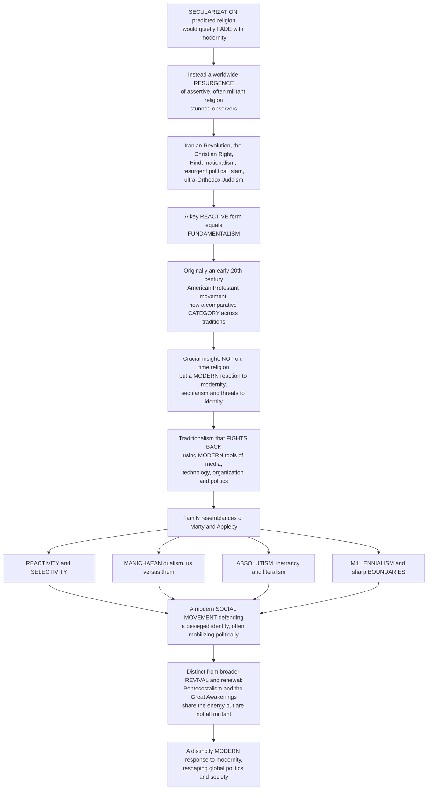

# 🔥 Fundamentalism and Religious Revival

> [!abstract] TL;DR
> For most of the twentieth century, social science expected **[[Religion_Sacred_and_Secular|secularization]]** — that religion would quietly *fade* as societies grew modern, scientific, and rich. Instead the late twentieth century delivered the opposite: a dramatic, worldwide **RESURGENCE** of assertive, often militant religion that stunned observers — the **Iranian Revolution** (1979), the American **Christian Right**, the explosive spread of **Pentecostalism**, resurgent **political Islam**, **Hindu nationalism**, ultra-Orthodox Judaism, Buddhist nationalism. A key *reactive* form of this resurgence is **FUNDAMENTALISM**. The word originally named a specific early-twentieth-century American Protestant movement defending the "fundamentals" against Darwinism and modernism, but scholars now use it — carefully and controversially — as a **comparative category** for a recognizable cross-traditional pattern. The crucial corrective is that fundamentalism is **NOT** simply "old-time" or "traditional" religion: it is a **MODERN phenomenon**, a *reaction* to modernity, secularism, and perceived threats to identity — a traditionalism that *fights back* using modern tools of media, technology, organization, and politics. The **Fundamentalism Project** (Marty & Appleby) identified family resemblances: **reactivity**, **selectivity**, a dualistic **Manichaean** us-versus-them worldview, **absolutism** and scriptural **literalism**/inerrancy, **millennialism**, and sharp **boundaries** against a corrupting world. Best understood as a modern **social movement** defending a besieged identity and often mobilizing politically, fundamentalism is distinct from the broader **revival** and renewal movements (global Pentecostalism, the "Great Awakenings") that share the resurgence energy without all being militant — making these among the most important and *misunderstood* religious phenomena of the modern world.

---

## Intuition

**Analogy:** Imagine a town whose elders were assured, for a hundred years, that the old temple on the hill would empty on its own — that as the railroad, the university, and the factory arrived, people would simply *stop climbing the hill*, and the temple would fall silent without anyone having to lay a hand on it. The forecast felt inevitable. Then one morning the town wakes to find the temple not empty but *overflowing* — and its congregation has not merely returned to pray quietly but has marched down the hill into the town square, seized the radio station, taken over the school board, and declared that the modern town has lost its soul and must be reclaimed. Here is the twist that outsiders always miss: these are **not** the elders' grandparents brought back to life. They dress in modern clothes, run slick media operations, organize like a political party, quote statistics, and use the very tools of the modern town they claim to reject. They are not a *survival* of the past. They are a *reaction* to the present — a movement *born of modernity*, wearing tradition as a battle standard.

That reversal is the heart of the **religious resurgence** and its most combative expression, **fundamentalism**. Where the **[[Religion_Sacred_and_Secular|secularization thesis]]** predicted religion would recede into private, harmless irrelevance, the closing decades of the twentieth century instead produced the **Iranian Revolution**, the American **Christian Right**, resurgent **political Islam**, **Hindu nationalism**, and ultra-Orthodox Judaism — religion crashing *back* into public life. The word "fundamentalism" was coined for a narrow episode — early-twentieth-century American Protestants defending "**The Fundamentals**" (biblical inerrancy, the virgin birth, the literal resurrection) against Darwinian evolution and German biblical criticism, the world of the **[[Darwin_and_Evolution|Scopes "Monkey" Trial]]**. Scholars later stretched it, cautiously and amid real controversy, into a **comparative category** naming a family of movements across traditions. The single most important insight to carry is this: **fundamentalism is not "traditional" religion at all.** Traditional religion is unselfconscious — it simply *is* the water people swim in. Fundamentalism is traditionalism that has become **self-conscious and militant** *because* the water is draining away — it *selects* certain doctrines to defend as absolute, draws a hard line between the pure and the corrupt, and fights the modern world with the modern world's own weapons. It is best understood not as a relic but as a modern **[[Social_Movements_and_Revolution|social movement]]** defending a besieged **identity** — and it is *distinct* from the broader wave of **revival** (Pentecostal enthusiasm, the American awakenings) that shares the resurgence energy without all being reactive or militant.

---

## How It Works

### Core Mechanics

The study of fundamentalism and revival begins by inverting an expectation and then dissecting the pattern the inversion reveals:

1. **The failed prophecy.** Classical **[[Religion_Sacred_and_Secular|secularization theory]]** predicted that modernization — scientific rationality, urbanization, education, market economies, differentiation of institutions — would steadily erode the *plausibility* and *public authority* of religion. In parts of Western Europe this largely held. Globally, it did not. The late twentieth century saw a **resurgence** so broad and so *public* that scholars spoke of "the return of religion" and, later, of a "**post-secular**" age.

2. **Naming the reactive type.** Not all of the resurgence is fundamentalist. Fundamentalism is the specifically **reactive, boundary-drawing, absolutist** type. The term's **origin** is exact: American Protestants who, between 1910 and 1930, published *The Fundamentals* and rallied to defend biblical inerrancy and core doctrines against **higher criticism** and **Darwinism**, culminating culturally in the 1925 **Scopes trial**. Its **extension** into a cross-traditional *comparative category* is contested — critics note the Protestant-specific, even pejorative, baggage and the risk of flattening very different movements — but its defenders argue a real **family resemblance** exists.

3. **The corrective insight.** Fundamentalism is a **modern** phenomenon and a **reaction** *to* modernity — not a leftover *from* the past. It is "traditionalism" that has become **self-conscious**, **selective**, and **militant**: it retrieves an idealized "authentic" past and defends it with thoroughly modern means — mass media, digital networks, formal organization, professional expertise, and the language of **politics**. It rejects modern *values* (pluralism, relativism, secular authority) while eagerly using modern *tools*.

4. **The family resemblances (Marty & Appleby).** The multi-volume **Fundamentalism Project** distilled recurring features: **reactivity** (a defensive fight against the marginalization of religion), **selectivity** (choosing which doctrines and practices to absolutize, and which modern elements to embrace), **Manichaean dualism** (a stark sacred-versus-profane, good-versus-evil, us-versus-them worldview), **absolutism and inerrancy** (often scriptural **[[Sacred_Texts_and_Scripture|literalism]]**), **millennialism** (dramatic end-time expectation — see **[[Salvation_Liberation_and_the_Afterlife|eschatology]]**), and sharp **boundaries** / enclave culture separating the pure community from the corrupt world — typically under **charismatic, elect, and male-led** authority.

5. **The sociological reframe.** Put together, fundamentalism is best analyzed as a modern **[[Social_Movements_and_Revolution|social movement]]** and a form of **identity politics** defending a besieged group against dislocation, humiliation, and rapid change — and a **[[Bifurcations_and_Tipping_Points|threshold-triggered]]** *backlash* rather than a smooth decline. A rational-choice strand adds that **strictness breeds strength**: demanding groups screen out free-riders and raise commitment, so high-cost movements can *outcompete* lax ones (modeled below).

6. **Revival as the broader genus.** Fundamentalism is one species within a wider genus of **revival** and renewal: the American **Great Awakenings**, global **Pentecostalism**, Islamic **tajdid**/**da'wa**/Salafism, and Hindu and Buddhist reform. Revival = renewed vitality and enthusiasm; it is *not necessarily* militant or reactive. Fundamentalism is the reactive, absolutist sub-type.

### Flow / Architecture



---

## Key Concepts

### Secondary Level

**People expected religion to fade — it came roaring back.** For a long time, thinkers were sure that as the world became modern — full of science, factories, universities, and cities — religion would slowly shrink into a quiet, private hobby. This idea is called **secularization**. In much of Europe it seemed true. But across the rest of the world in the late 1900s the opposite happened: religion became *louder and more political* than ever. The 1979 **Iranian Revolution** put religious leaders in charge of a whole country. In the United States, conservative Christians organized to change laws and elections. Similar surges happened in the Islamic world, in India among Hindus, and among ultra-Orthodox Jews. Scholars call this the **religious resurgence** — the "return of religion."

**What "fundamentalism" really means.** The word "fundamentalist" started with a specific group: American Protestants about a century ago who wanted to defend the "fundamentals" of their faith — like taking the Bible literally — against new ideas such as **evolution**. (Their most famous fight was the 1925 **Scopes trial** over teaching evolution in schools.) Today scholars use the word more broadly for similar movements in *many* religions.

**The most important idea to remember:** Fundamentalism is **NOT** just "old-fashioned" religion that never changed. It is a **modern reaction** — it appears *because* the modern world is pushing religion aside, and it *fights back* using very modern tools: TV, the internet, big organizations, and politics. It rejects modern *ideas* but happily uses modern *technology*.

**Fundamentalism vs revival.** A **revival** just means religion getting a burst of fresh energy and excitement — like the huge worldwide growth of **Pentecostal** Christianity. A revival is *not always* angry or political. **Fundamentalism** is the specific kind that draws a hard line between "us" (the pure) and "them" (the corrupt world) and fights.

| Idea | Plain meaning |
|---|---|
| **Secularization** | the (partly wrong) prediction that religion would fade with modernity |
| **Resurgence** | religion's surprising, assertive comeback in public life |
| **Fundamentalism** | a *reactive*, hard-line, modern movement defending "the fundamentals" |
| **Revival** | renewed religious energy and enthusiasm — not always militant |

---

### Undergraduate Level

#### The religious resurgence and the secularization surprise

The intellectual backdrop is the **[[Religion_Sacred_and_Secular|secularization thesis]]**: the expectation, inherited from the Enlightenment and the founding sociologists, that modernization would erode religion's plausibility and public role. The late twentieth century humbled this forecast. A short list of the shocks: the **Iranian Revolution** (1979) built a modern state on clerical rule; the American **Christian Right** (Moral Majority, 1979; Christian Coalition) turned evangelicals into a decisive electoral bloc; **political Islam** / Islamism spread from the Muslim Brotherhood outward; **Hindu nationalism** (Hindutva, the RSS/BJP) reframed Indian politics; ultra-Orthodox (**Haredi**) Judaism grew in numbers and influence; and Buddhist nationalism surged in Sri Lanka and Myanmar. Alongside these came the sheer numerical explosion of **Pentecostal** Christianity in the Global South. Scholars stopped writing religion's obituary and started analyzing its **return to public life** — the theme of this section's sibling notes on secularization and on religion, politics, and the state.

#### Origins of the term and the comparative category

"Fundamentalism" is not an outside label but a **self-description** with a precise history. Between 1910 and 1915, a series of pamphlets titled *The Fundamentals* defended doctrines — biblical **inerrancy**, the virgin birth, substitutionary atonement, the bodily resurrection, the authenticity of miracles — against two modern threats: **Darwinian evolution** (see **[[Darwin_and_Evolution]]**) and German **higher criticism** of the Bible. The 1925 **Scopes "Monkey" Trial** in Tennessee crystallized the culture war. The **controversial move** was later scholars' extension of "fundamentalism" from this Protestant episode to a cross-traditional **comparative category**. The risks are real: the term is Protestant-specific, often **pejorative**, and can **over-generalize** across movements with very different theologies and politics (Islamism is not Christian fundamentalism). Its **defense** is that, used carefully, it names a genuine **family resemblance** — not an identity, but a recognizable pattern of *reactive, absolutist, boundary-setting* religion under modern conditions.

#### The Marty-Appleby family resemblances

The **Fundamentalism Project** (Martin **Marty** & R. Scott **Appleby**, University of Chicago, five volumes, 1991-1995) is the landmark comparative study. Rather than a checklist definition, it offered a set of overlapping **family resemblances** found across traditions:

| Feature | What it means | Example |
|---|---|---|
| **Reactivity** | a defensive fight against the *marginalization* of religion by secular modernity | opposing secular law, secular schooling, secular media |
| **Selectivity** | choosing which doctrines/practices to absolutize *and* which modern tools to adopt | inerrancy emphasized; televangelism embraced |
| **Manichaean dualism** | a stark sacred-vs-profane, good-vs-evil, **us-vs-them** worldview | "the saved remnant" against "the corrupt world" |
| **Absolutism / inerrancy** | certainty and scriptural **[[Sacred_Texts_and_Scripture|literalism]]** | the text is perfect, timeless, and directly applicable |
| **Millennialism** | dramatic end-time expectation (see **[[Salvation_Liberation_and_the_Afterlife|eschatology]]**) | dispensationalist "rapture," apocalyptic urgency |
| **Boundaries / enclave** | separating the pure community from a defiling outside | dress codes, endogamy, separate institutions |

Structurally these movements tend toward **charismatic**, **elect** (chosen-remnant), and typically **male** leadership. Crucially, **selectivity** is the giveaway that this is *not* indiscriminate traditionalism: fundamentalists do not restore "everything old" — they *pick* an idealized essence to defend and *modernize* the means of defending it.

#### Fundamentalism as a modern social movement

The sociological payoff is to read fundamentalism as a modern **[[Social_Movements_and_Revolution|social movement]]** and a form of **identity politics**. It defends a **besieged group identity** against modernity, globalization, and Western/secular hegemony — a response to dislocation, **humiliation**, and rapid change. It **mobilizes politically** (linking to religious nationalism and the state), builds **formal organizations**, and deploys **media, technology, and even science** selectively. Its **anti-modernism is selective**: it repudiates modern *values* while mastering modern *tools*. A **rational-choice** strand (Iannaccone, Stark, Finke) adds a counter-intuitive mechanism: **strictness breeds strength**. Demanding, high-cost groups **screen out free-riders**, raising the average commitment and participation of those who remain, so "strict churches" generate more solidarity and grow *faster* than lax ones — up to a point (modeled in the Python demo, and connected to the church-sect dynamics of **[[Religion_and_Social_Order]]**).

#### Revival and renewal: the broader phenomenon

Beyond fundamentalism lies the wider family of **revival**: renewed religious vitality that is *not necessarily* militant. The American **Great Awakenings** (18th-19th c. revivalism) are the classic template. **Pentecostal and charismatic Christianity** — from essentially zero in 1900 to hundreds of millions today, concentrated in the Global South — is the largest contemporary case (see **[[Christianity_and_the_Christian_Traditions]]**). The Islamic world has its own long tradition of **renewal** (**tajdid**), **outreach** (**da'wa**), **Salafi** reform, and **Sufi** revivals (see **[[Islam_and_the_Islamic_Tradition]]**); Hindu and Buddhist reform and revival movements parallel these. The distinction to hold onto: **revival = renewed enthusiasm; fundamentalism = the reactive, boundary-setting, absolutist sub-type.** Conservatism, evangelicalism, and traditionalism (see **[[Conservatism_and_Traditionalism]]**) are *related but distinct* — a fundamentalist is conservative, but not every conservative believer is a fundamentalist.

---

### Graduate Level

#### Fundamentalism as reactive de-differentiation

A sharper theoretical statement: modernity is characterized by **structural differentiation** — religion, politics, law, science, and economy separate into autonomous spheres, and religion is confined to a private niche (the process at the heart of **[[Religion_Sacred_and_Secular|secularization]]**). Fundamentalism can be read as **reactive de-differentiation**: a movement to *re-fuse* the spheres, to reassert religion's authority over law, science, education, sexuality, and the state. This is why fundamentalisms are so often **political**: the target is precisely the *privatization* of religion. It also explains the **selective** modernism — the movement needs modern organizational and technological forms to wage a de-differentiating campaign at scale. Gilles **Kepel**'s *The Revenge of God* frames the resurgence as a coordinated "re-Islamization / re-Christianization / re-Judaization from above and below" against the secular settlement; Karen **Armstrong**'s *The Battle for God* frames it psychologically as a defense of the sacred **mythos** against an imperial, disenchanting **logos**.

#### The strictness-breeds-strength model and the religious economy

The **rational-choice** account (Laurence **Iannaccone**, Rodney **Stark**, Roger **Finke**) treats a religious group as a producer of **collective goods** (solidarity, meaning, mutual aid) vulnerable to **free-riding**. Costly, seemingly irrational prohibitions (dress, diet, endogamy, time demands) function as a **screening** mechanism: they raise the price of membership, deterring low-commitment free-riders and *raising the average participation* of those who join. The paradoxical result is that **strict groups can be stronger and grow faster than lenient ones** — a formal explanation for why demanding sects and fundamentalist enclaves *thrive* rather than wither, contra the secularization forecast. The effect is **non-monotonic**: past an optimum, strictness suppresses recruitment faster than it raises commitment, and the group shrinks. This nests inside the broader **religious-economy** claim that pluralism and competition *raise* aggregate religious participation — the market logic developed in **[[Religion_and_Social_Order]]** and **[[Religion_Sacred_and_Secular]]**.

#### The cultural-backlash dynamic and threshold effects

Where naive secularization predicts a **monotonic decline** of religious mobilization as modernization advances, the resurgence suggests a **[[Bifurcations_and_Tipping_Points|threshold]]** dynamic: as secularizing pressure and perceived **existential threat to identity** rise, mobilization at first stays low, then — past a critical point — **surges** into militant reaction rather than fading. This "**cultural backlash**" logic (compatible with Norris & Inglehart's account of value change *and* its counter-reaction) reframes fundamentalism as a **[[Bifurcations_and_Tipping_Points|tipping-point]]** phenomenon driven by insecurity, humiliation, and rapid change — a *[[Globalization_and_Its_Discontents|discontent of globalization]]* rather than a survival of tradition. Revival waves, by contrast, can be modeled as **[[Network_Dynamics_and_Contagion|diffusion contagions]]**: a surge of enthusiasm spreading through a population and then **routinizing**, in the successive-awakening pattern.

#### Assessment: the utility and limits of the category, and the future

The mature scholarly position is **critical but not dismissive**. The category's **limits**: Islamism, with its focus on the state and law, differs importantly from American Protestant fundamentalism's focus on personal belief and biblical inerrancy; lumping them can mislead. The **relation to violence** must be stated carefully: *most fundamentalists are not violent*, and equating fundamentalism with terrorism is both empirically wrong and analytically lazy (the religion-and-violence question is its own sibling note, linking to **[[Global_Security_and_Terrorism]]**). The **drivers** are plural — modernization, existential insecurity, identity threat, globalization, humiliation, and ordinary politics — not a single essence. And the **future**: the evidence points away from fundamentalism as a *passing* reaction and toward it as an **enduring feature** of a plural, globalized, "**post-secular**" modernity. The scholarly imperative is **religious literacy** — understanding these movements as intelligible modern responses rather than caricaturing them as atavistic fanaticism.

#### Why it matters

Fundamentalism and religious revival are among the most important and misunderstood religious phenomena of the modern world — not a relic of the past but a distinctly **modern response** to it and a force reshaping global politics and society. Where **[[Religion_Sacred_and_Secular|secularization theory]]** predicted religion would quietly fade with modernity, the late twentieth century instead saw a dramatic worldwide **resurgence** of assertive, often militant religion, from the **Iranian Revolution** and the American **Christian Right** to **Hindu nationalism** and resurgent **political Islam**. Fundamentalism, though named for a specific early American Protestant movement, is now used carefully as a **comparative category** whose crucial insight is that it is *not* simply old-time or traditional religion but a modern **reaction** to modernity, secularism, and perceived threats to identity — a **traditionalism that fights back** using modern tools of media, technology, and politics — sharing family resemblances of **reactivity**, **selectivity**, a dualistic us-versus-them worldview, **absolutism and literalism**, **millennialism**, and sharp **boundaries** against a corrupting world. Best understood as a modern **[[Social_Movements_and_Revolution|social movement]]** defending a besieged identity and often mobilizing politically, it is distinct from broader **revival** and renewal movements like global Pentecostalism that share the resurgence energy without all being militant — making the study of fundamentalism and religious revival essential to understanding religion's assertive presence in modernity throughout this vault.

---

## Python Demo

Two computational sketches of the resurgence. Part **(a)** models the **strictness-breeds-strength** finding (Iannaccone, Stark): demanding groups *screen out free-riders*, raising members' commitment even as high cost shrinks reach, so **group strength** is a **non-monotonic** function of strictness that peaks for movements that are "strict but not too strict" — explaining why fundamentalist sects can *outcompete* lax churches. Part **(b)** models the **cultural-backlash** dynamic: instead of the smooth *decline* naive secularization predicts, religious **mobilization** stays quiescent until secularizing pressure crosses a **threshold** of perceived identity threat, then *surges* into militant reaction. Requires only `numpy` and `matplotlib`.

```python
"""
Fundamentalism and religious revival: two sketches of the RESURGENCE.

(a) STRICTNESS breeds STRENGTH (Iannaccone / Stark) - costly demands SCREEN OUT
    free-riders, raising members' commitment; but high cost shrinks reach, so
    GROUP STRENGTH is NON-MONOTONIC in strictness with an intermediate sweet spot.
(b) The CULTURAL-BACKLASH dynamic - naive secularization predicts a smooth DECLINE,
    but reactive mobilization stays low until secularizing pressure crosses a
    THRESHOLD of identity threat, then SURGES into militant revival.
"""

import numpy as np
import matplotlib.pyplot as plt

# ----------------------------------------------------------------------
# (a) STRICTNESS -> STRENGTH: free-rider screening vs. shrinking reach
# ----------------------------------------------------------------------
s = np.linspace(0.0, 1.0, 200)          # group STRICTNESS / cost of membership

# average member COMMITMENT / participation RISES with strictness (screening):
# demanding groups retain only high-commitment members (logistic in strictness)
commitment = 1.0 / (1.0 + np.exp(-9.0 * (s - 0.35)))

# MEMBERSHIP / reach FALLS with strictness: high cost deters casual joiners
membership = np.exp(-2.3 * s)

# GROUP STRENGTH = solidarity/collective good produced = commitment * membership
strength = commitment * membership
strength_norm = strength / strength.max()
s_star = s[np.argmax(strength)]          # the "strict but not too strict" sweet spot

# ----------------------------------------------------------------------
# (b) CULTURAL BACKLASH: decline predicted, but a THRESHOLD triggers a surge
# ----------------------------------------------------------------------
P = np.linspace(0.0, 1.0, 200)           # secularizing pressure / perceived identity threat

# naive SECULARIZATION prediction: religion fades monotonically as modernity advances
secularization = np.exp(-2.5 * P)

# actual REACTIVE mobilization: quiescent until a threshold, then a militant SURGE
P_star = 0.55                            # threshold of perceived existential threat
militancy = 0.05 + 0.95 / (1.0 + np.exp(-14.0 * (P - P_star)))

# ----------------------------------------------------------------------
# PLOTS
# ----------------------------------------------------------------------
fig, (ax1, ax2) = plt.subplots(1, 2, figsize=(14, 5.5))

# Panel (a): the strictness sweet spot
ax1.plot(s, commitment, color="darkorange", lw=2, ls="--",
         label="avg member commitment (rises: free-riders screened out)")
ax1.plot(s, membership, color="steelblue", lw=2, ls=":",
         label="membership / reach (falls: high cost deters joiners)")
ax1.plot(s, strength_norm, color="crimson", lw=2.8,
         label="GROUP STRENGTH = commitment x reach")
ax1.axvline(s_star, color="crimson", ls="-.", lw=1.3)
ax1.annotate("strict but NOT too strict\n(demanding sects outcompete lax churches)",
             xy=(s_star, 1.0), xytext=(0.10, 0.55),
             arrowprops=dict(arrowstyle="->"), fontsize=8)
ax1.text(0.02, 0.06, "lax\nchurch", fontsize=8, color="gray")
ax1.text(0.90, 0.06, "over-\nstrict", fontsize=8, color="gray")
ax1.set_xlabel("group STRICTNESS / cost of membership")
ax1.set_ylabel("normalized level")
ax1.set_ylim(0, 1.08)
ax1.set_title("(a) Strictness breeds STRENGTH (Iannaccone / Stark)\nnon-monotonic: strength peaks at intermediate strictness")
ax1.legend(loc="upper center", fontsize=7.5)

# Panel (b): decline predicted vs. backlash surge
ax2.plot(P, secularization, color="gray", lw=2, ls="--",
         label="secularization PREDICTION (religion fades)")
ax2.plot(P, militancy, color="firebrick", lw=2.8,
         label="actual REACTIVE mobilization (backlash)")
ax2.axvline(P_star, color="firebrick", ls=":", lw=1.3)
ax2.annotate("THRESHOLD of identity threat:\nreaction SURGES, not declines",
             xy=(P_star, 0.5), xytext=(0.06, 0.72),
             arrowprops=dict(arrowstyle="->"), fontsize=8)
ax2.set_xlabel("secularizing pressure / perceived threat to identity")
ax2.set_ylabel("religious mobilization intensity")
ax2.set_ylim(0, 1.08)
ax2.set_title("(b) The CULTURAL-BACKLASH dynamic\nmodernity can TRIGGER militant revival, not decline")
ax2.legend(loc="center right", fontsize=8)

plt.tight_layout()
plt.savefig("fundamentalism_and_religious_revival.png", dpi=120)
plt.show()

# ----------------------------------------------------------------------
print(f"Group strength peaks at strictness s = {s_star:.2f} (strict but not too strict)")
print(f"Strength of a LAX church (s=0.00):        {strength_norm[0]:.2f}")
print(f"Strength at the sweet spot:               {strength_norm.max():.2f}")
print(f"Strength of an OVER-strict group (s=1.0): {strength_norm[-1]:.2f}")
cross = P[np.argmin(np.abs(militancy - 0.5))]
print(f"Reactive militancy crosses 0.5 near pressure P = {cross:.2f} (the backlash threshold)")
```

**What the output shows.** Panel (a): **member commitment climbs** with strictness (the screening of free-riders) while **membership/reach falls** (high cost deters casual joiners); their product — **group strength** — is a **hump** that peaks at *intermediate* strictness (near s = 0.47). A **lax church** and an **over-strict** group are both weak; the *demanding-but-not-suicidal* sect is strongest, which is precisely why fundamentalist and high-tension movements can **outcompete** liberal ones rather than wither — the counter-intuitive engine of religious vitality. Panel (b): the grey dashed line is the **secularization prediction** (mobilization decays smoothly as modernity advances); the red line is the **cultural-backlash** reality — mobilization stays low until secularizing pressure crosses a **threshold** of perceived identity threat, then **surges** into militant reaction. Modernity, past a tipping point, can *manufacture* militant revival rather than dissolve religion — the pattern that blindsided a century of secularization theory.

---

## Real-World Applications

- **The Iranian Revolution (1979).** The paradigmatic case of the resurgence: a modernizing, oil-rich, Westernizing monarchy overthrown by a mass movement under clerical leadership that then built a *modern* theocratic state — clerics wielding radio, cassette tapes, mass organization, and the machinery of the nation-state. Not a return to the medieval past but a thoroughly modern **reactive de-differentiation** re-fusing religion and politics.
- **The American Christian Right.** Protestant fundamentalism's descendants — the Moral Majority (1979), the Christian Coalition, and the broader Religious Right — turned a once-separatist enclave into a disciplined **electoral** and **media** operation (televangelism, direct mail, later cable and social media), fighting over evolution, abortion, school prayer, and sexuality. A textbook case of rejecting modern *values* while mastering modern *tools*.
- **The Scopes trial and creationism.** The 1925 trial and its long afterlife — "creation science," intelligent design, and school-board battles over the biology curriculum — are the enduring core of the fundamentalism-versus-**[[Darwin_and_Evolution|evolution]]** conflict, and the clearest illustration that the movement is *defined by* its confrontation with a specific modern idea.
- **Hindu nationalism (Hindutva).** The RSS/BJP reworking of Hindu identity into a modern political ideology of the besieged nation shows the comparative category at work far from Protestantism — and shows **selectivity**, since Hindutva *constructs* a unified "Hinduism" that the older, plural tradition never was.
- **Global Pentecostalism as revival (not fundamentalism).** The explosive Southern-Hemisphere growth of Pentecostal and charismatic Christianity is the great case of **revival** proper: enormous renewed enthusiasm, competing successfully in pluralistic religious markets and serving urban migrants, women, and the young — energetic and expansive, yet *not* primarily reactive, militant, or boundary-obsessed, which is exactly why it must be distinguished from fundamentalism.

---

## Common Pitfalls

- **Equating fundamentalism with "traditional" or "old-time" religion.** The single most common error. Traditional religion is unselfconscious inheritance; fundamentalism is *self-conscious, selective, and militant* traditionalism that arises **as a modern reaction** and uses modern means. It is a child of modernity, not a survivor from before it.
- **Equating fundamentalism with violence or terrorism.** *Most* fundamentalists are not violent. Fundamentalism is a mode of *belief and boundary-setting*, not a synonym for extremism; conflating the two is empirically false and obscures the far larger population of non-violent fundamentalists (the religion-and-violence question is a separate analysis).
- **Over-extending the category across traditions.** Islamism's focus on the *state and law* differs sharply from American Protestant fundamentalism's focus on *personal belief and inerrancy*. Treating "fundamentalism" as a uniform essence rather than a **family resemblance** flattens crucial differences and imports Protestant-specific assumptions.
- **Reading selectivity as hypocrisy.** Critics jeer that fundamentalists "reject modernity but use smartphones." That misses the analytic point: **selective** engagement with modern *tools* while rejecting modern *values* is a *defining* feature, not an inconsistency. The movement is modern *by design*.
- **Assuming secularization is a universal law.** Western European decline is real but not the global template. The hyper-religious United States, the Global-South resurgence, and the strictness-breeds-strength dynamic all show that "modernity dissolves religion" is a **contested thesis**, not a law — and that modernity can *trigger* revival.
- **Collapsing revival into fundamentalism.** Global Pentecostalism, the Great Awakenings, and Sufi or Islamic renewal share the *resurgence energy* but are not all reactive or militant. **Revival is the genus; fundamentalism is one reactive species.** Using the words interchangeably erases the distinction the whole field turns on.

---

## Related Concepts

- [[Religion_and_Social_Order]] — the S05 section-opener; its church-sect cycle, the double face of religion, and the strictness-breeds-strength (religious-economy) argument are the direct sociological foundation this note builds on for the reactive resurgence.
- [[Religion_Sacred_and_Secular]] — the Sociology vault's treatment of the **secularization thesis** and religious markets; this note is the *counter-story* to the secularization forecast that note frames.
- [[Social_Movements_and_Revolution]] — the analytic home for reading fundamentalism as a modern **social movement** and identity politics (mobilization, framing, resources) rather than as atavism.
- [[Nationalism_Ethnicity_and_Collective_Identity]] — the collective-identity and nationalism machinery behind **religious nationalism** (Hindutva, political Islam, ultra-Orthodox politics), the political face of the resurgence.
- [[Conservatism_and_Traditionalism]] — the **related-but-distinct** ideological neighbor; every fundamentalist is conservative, but not every conservative believer is a boundary-setting, absolutist fundamentalist.
- [[Sacred_Texts_and_Scripture]] — scriptural **inerrancy** and **literalism** are core fundamentalist markers; this note supplies the theory of the text that fundamentalism absolutizes.
- [[Salvation_Liberation_and_the_Afterlife]] — the **millennialism**/apocalypticism and eschatology that recur among fundamentalist movements as end-time urgency.
- [[Darwin_and_Evolution]] — the specific modern idea (evolution, biblical criticism) whose defense against it *originated* the term "fundamentalism" — the world of the Scopes trial.
- [[Christianity_and_the_Christian_Traditions]] — the tradition of *both* original Protestant fundamentalism *and* the global Pentecostal **revival**, the two poles this note distinguishes.
- [[Islam_and_the_Islamic_Tradition]] — the home of Islamic **revival** (tajdid, da'wa, Salafism, Sufi renewal) and Islamism, the most-discussed non-Christian case of the category.
- [[Globalization_and_Its_Discontents]] — the dislocation, humiliation, and identity threat that the cultural-backlash reading treats as key **drivers** of reactive religion.
- [[Global_Security_and_Terrorism]] — where a *small* militant fringe of the resurgence intersects with political violence; linked precisely to keep it distinct from fundamentalism-in-general.
- [[Bifurcations_and_Tipping_Points]] — the systems-theoretic model behind the **threshold** at which secularizing pressure *triggers* militant revival rather than decline.
- [[Network_Dynamics_and_Contagion]] — the diffusion-wave model of **revival** spreading through a population and then routinizing (the successive-awakening pattern).

This note is a section-05 sibling of **Religion and Social Order** (above) and is referenced in prose while its companions are written: *Secularization and the Sociology of Belief* (the secularization debate this note answers), *Religion, Politics, and the State* (religious nationalism and the political face of resurgence), *Religion, Violence, and Peacebuilding* (the militant fringe and its repair), and *Global Religion, Migration, and Diaspora* (revival carried along global flows).

---

## Review Questions

1. **(Secondary)** People once expected religion to fade as the world modernized. In one or two sentences, explain what actually happened in the late twentieth century, and give two real examples of the "religious resurgence."
2. **(Secondary)** Why is it wrong to call fundamentalism simply "old-fashioned religion"? What is the one word that best captures what fundamentalism is *reacting to*?
3. **(Undergraduate)** List four of the Marty-Appleby "family resemblances" of fundamentalism, and explain how **selectivity** shows that fundamentalism is *not* the same as indiscriminate traditionalism.
4. **(Undergraduate)** Distinguish **fundamentalism** from **revival**, using global Pentecostalism as your example of revival. Why does the field insist on keeping the two apart?
5. **(Graduate)** Using the strictness-breeds-strength model in the Python demo, explain why a *demanding* sect can outcompete a *lax* church, and why the relationship is non-monotonic. What does this imply for the secularization thesis?
6. **(Graduate)** Contrast the "smooth decline" prediction of naive secularization with the "cultural-backlash" threshold dynamic. Under what conditions does modernization *trigger* militant revival rather than dissolve religion, and what are the limits of the comparative category "fundamentalism" (for example, Islamism versus American Protestant fundamentalism)?

---

## Sources

- Marty, M. E., & Appleby, R. S. (eds.). *The Fundamentalism Project* (5 vols., incl. *Fundamentalisms Observed*, 1991) — the landmark comparative study and source of the "family resemblances."
- Armstrong, K. *The Battle for God: A History of Fundamentalism* (2000) — fundamentalism as a modern defense of *mythos* against imperial *logos*, across Judaism, Christianity, and Islam.
- Kepel, G. *The Revenge of God: The Resurgence of Islam, Christianity, and Judaism in the Modern World* (1994) — the coordinated late-twentieth-century religious resurgence against the secular settlement.
- Bruce, S. *Fundamentalism* (2nd ed., 2008) — a concise, critical sociological account of the concept, its causes, and its limits.
- Iannaccone, L. R. "Why Strict Churches Are Strong," *American Journal of Sociology* 99(5), 1994 — the free-rider-screening / strictness-breeds-strength model.

---

#religious-studies #fundamentalism #religious-revival #religious-resurgence #modernity
