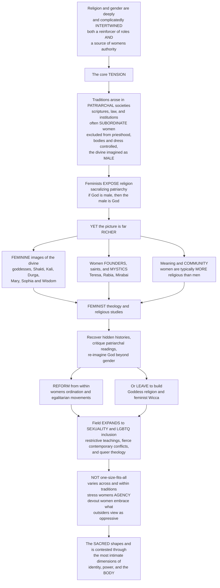

# ⚧️ Religion, Gender and Sexuality

> [!abstract] TL;DR
> **Religion and gender are deeply, complicatedly intertwined** — religions have been among both the most powerful *reinforcers* of traditional gender roles AND, sometimes, *sources* of women's authority and liberation. The tension is real: most major traditions developed in **patriarchal societies**, and their scriptures, laws, and institutions have often *subordinated* women — excluding them from **priesthood** and leadership, prescribing restrictive roles, controlling their **bodies, dress, and sexuality**, and imagining the divine as overwhelmingly **MALE** ("God the Father"). Feminist scholars exposed how religion can *sacralize patriarchy* — Mary Daly's "if God is male, the male is God." **Yet the picture is far richer.** The same traditions hold powerful **feminine images of the divine** (Hindu **Shakti**, Kali, Durga; Mary; Sophia/Wisdom), women **founders, saints, and mystics** (Teresa of Ávila, Rabia, Mirabai), and profound sources of meaning and community — so that women are, paradoxically, *typically more religious than men*. **Feminist theology** arose to *reinterpret and reform* traditions from within (recovering hidden histories, critiquing androcentric readings, re-imagining God beyond gender, winning **women's ordination**) — while others *left* to build women-centered spiritualities (**Goddess religion**, feminist Wicca). The field then expanded to **sexuality** and the fierce contemporary conflicts over marriage, abortion, and especially **LGBTQ+ inclusion** — a major *fault line* realigning many traditions — alongside **queer theology**. Crucially, this is *not one-size-fits-all*: scholars increasingly stress women's **agency** (Saba Mahmood's *Politics of Piety*), challenging the simplistic "religion oppresses women" narrative. Understanding religion, gender, and sexuality is understanding how the sacred shapes — and is contested through — the most intimate dimensions of identity, power, and the **body**.

---

## Intuition

**Analogy.** Picture the same great river photographed at two bends. At the first bend it is a **dam** — a massive stone wall holding a whole valley in place, deciding who may cross and who may not, its authority so total it seems part of the landscape itself. At the second bend, a few miles on, the *same water* is a **spring** in a village square where women gather, draw strength, find their voice, and organize. A visitor who sees only the dam concludes "this river oppresses"; a visitor who sees only the spring concludes "this river liberates." Both are looking at the same river — and both are right about what they see. Religion is exactly like this with respect to gender: it has been humanity's most powerful **dam** holding patriarchal arrangements in place *and* one of its most enduring **springs** of meaning, community, and agency for women. Any honest account has to hold both bends of the river in view at once.

That double vision is the whole subject. It is tempting to pick a side — "religion subjugates women" or "religion honors the feminine" — but the scholarly payoff comes precisely from refusing to. Gender is not a footnote to the study of religion; it is a **lens** that transforms it, revealing whose voices the tradition preserved and whose it erased, whose bodies it regulated and whose it exalted, and how the very image of the ultimate got a gender in the first place. And it runs the other way too: religion is among the primary forces that *shape* gender itself — telling societies what a woman is, what a man is, what desire is for, and whose authority is divinely ordained.

---

## How It Works

The relationship unfolds as a story with a twist. **Act one:** major traditions arose in patriarchal societies, and their sacred texts, laws, and institutions encoded and *sanctified* male dominance — excluding women from ordained leadership, controlling their bodies and dress, and picturing the divine as male. Feminist critique names this the **sacralization of patriarchy**: male rule made to look not merely customary but *divinely willed*. **Act two — the twist:** the same traditions turn out to contain powerful **feminine images of the divine**, women founders and mystics, and deep wells of meaning and community, so that women are on average *more* religious than men. **Act three:** the scholarly and theological response — **feminist theology** and gender-as-analysis — which recovers women's hidden histories, critiques androcentric readings, re-imagines God beyond gender, and either **reforms** institutions from within or **leaves** to create women-centered spiritualities. **Act four:** the field expands to **sexuality and LGBTQ+ inclusion**, today's sharpest fault line, and to a searching debate about women's **agency** that dismantles the tidy "religion oppresses women" story.



---

## Key Concepts

### 🟢 Secondary — the basic picture

- **The double reality.** Religion is *both* a powerful reinforcer of traditional gender roles *and*, at times, a source of meaning, community, and authority for women. Neither "religion oppresses women" nor "religion honors women" is the whole truth; the honest answer is *both at once, differently, in different places*.
- **The divine has often been imagined as male.** "God the **Father**," male prophets and founders, a male priesthood — for most of history the sacred has been pictured and spoken in masculine terms, which quietly made *male* authority look natural and holy.
- **But the feminine is everywhere too.** Hindu **goddesses** (Shakti, Durga, Kali, Lakshmi), the Virgin **Mary**, divine **Wisdom** (Sophia), and countless women **saints and mystics** show the sacred also imagined and led as feminine.
- **The paradox.** Despite all this male dominance, **women are typically *more* religious than men** — more likely to pray, attend, and say faith matters — one of the most robust and surprising findings in the study of religion.
- **Gender is a lens.** Asking "where were the women?" transforms how we read *every* part of a tradition — its texts, its history, its rituals, its picture of God.

### 🟡 Undergraduate — the structure of the field

**1. How religions have supported patriarchy.** The traditions took shape in patriarchal worlds, and their authority *sacralized* those arrangements:
- **Institutional exclusion** — women barred from the priesthood, the pulpit, ordination, and formal religious authority (still the rule for Catholic priests, Orthodox clergy, and Sunni imams leading mixed prayer).
- **Regulation of the body** — dress and veiling codes, **purity/menstruation taboos** (see [[Ritual_and_Religious_Practice]]), and the control of women's sexuality and reproduction, often written into **religious law** governing marriage, divorce, and inheritance (see [[Ethics_and_Religious_Law]]).
- **The male divine** — a predominantly masculine imaging of God (see [[Concepts_of_the_Divine_and_Ultimate_Reality]]) that *legitimates* male authority. Mary Daly's sharpest line: **"if God is male, the male is God."**

**2. Women's religious lives and the feminine sacred.** Against that, a genuinely rich counter-picture:
- **The feminine divine** — Hindu **Shakti/Devi** (Durga, Kali, Lakshmi) as the very *power* of the cosmos (see [[Hinduism_and_the_Dharmic_Traditions]]); the Jewish **Shekhinah** (God's indwelling presence, often feminine); **Sophia**/Wisdom; Marian devotion; and Mother-Goddess traditions worldwide.
- **Women founders, saints, and mystics** — Teresa of Ávila, Julian of Norwich, Hildegard of Bingen, the Sufi **Rabia** of Basra, the *bhakti* poet-saint **Mirabai**, Ann Lee of the Shakers. Mysticism (see [[Religious_Experience_and_Mysticism]]) has often been a channel of *direct* religious authority open to women when institutional authority was closed.
- **Lived and devotional religion** — the everyday, "on-the-ground" piety of pilgrimage, festival, shrine, home altar, and prayer circle (see [[Pilgrimage_Festival_and_Devotion]]) where women's religiosity is dense, active, and socially powerful even where the official hierarchy is male.
- **The gender gap** — women's *higher* average religiosity (attendance, prayer, salience), and religion as a source of **community, status, networks, and agency**.

**3. Feminist theology and religious studies — the response.** Confronting patriarchy from *within* and *beside* the traditions:
- **Feminist theology** reinterprets and reforms — **Rosemary Radford Ruether** (*Sexism and God-Talk*), **Elisabeth Schüssler Fiorenza** (*In Memory of Her*, feminist biblical hermeneutics), plus **womanist** (Black women's), **mujerista** (Latina), and **Islamic, Jewish, and Buddhist** feminisms.
- **Its four moves** — (i) *recover* women's erased histories; (ii) *critique* androcentric texts and readings (feminist hermeneutics of suspicion — see [[Sacred_Texts_and_Scripture]]); (iii) *re-imagine* God beyond or inclusive of gender; (iv) *reform* institutions (women's **ordination**, inclusive language, egalitarian movements).
- **The revolutionary / reformist / rejectionist spectrum** — reform *within* the tradition, radical *transformation* of it, or *leaving* it altogether to build **Goddess religion / thealogy** and feminist **Wicca/Neopaganism**.

**4. Religion, sexuality, and the body.** The newer, fiercely contested frontier:
- Teachings on sex, **marriage, celibacy, and procreation** run from ascetic/celibate ideals to **sacred sexuality** (Tantra), but have historically been *restrictive*.
- The contemporary **conflicts** — contraception, abortion, and above all **homosexuality and LGBTQ+ inclusion** — form a **fault line** dividing and realigning many traditions.
- **Queer theology** reinterprets scripture and tradition for sexual minorities; religion functions *both* as a policer of gender/sexual norms *and* as a resource for the people those norms exclude.

### 🔴 Graduate — contested frontiers

- **Agency and the critique of the "oppression" narrative (Saba Mahmood).** *Politics of Piety* (2005), studying the women's mosque movement in Cairo, argues that **agency is not the same as resistance**. Devout women who embrace veiling, modesty, and submission to religious norms are exercising a real, cultivated agency — a project of *self-formation* — that the secular-feminist framework, which equates freedom with *escaping* norms, cannot see. This reframes the veil debates and challenges the built-in **secular assumption** that religion is inherently oppressive to women.
- **Etic vs emic assessments.** A recurring methodological gap (see [[Methods_in_the_Study_of_Religion]]): the *outsider's* (etic) "oppression score" for a tradition often diverges sharply from *insiders'* (emic) self-reported empowerment. Taking women's own self-understanding seriously — without romanticizing or dismissing it — is a central problem of the field.
- **Intersectionality.** Gender never acts alone; it is entangled with **race, class, and colonialism** (see [[Intersectionality]]). Womanist and mujerista theologies, and postcolonial critiques of Western feminists "saving" veiled women, insist that "women and religion" is never one story.
- **Feminist hermeneutics and the text.** From Schüssler Fiorenza's "hermeneutics of suspicion" to Islamic feminists like **Amina Wadud** and **Asma Barlas** rereading the Qur'an as anti-patriarchal at its core — the battle is over *who* has authority to interpret and *whether* the text's patriarchy is essential or historically contingent.
- **Essentialism vs construction.** Does "the feminine divine" *empower* real women, or merely recycle an idealized femininity men imposed? Goddess feminists and their critics disagree; the same question haunts every appeal to "women's spirituality."
- **Masculinity and religion.** An emerging focus: religion also *constructs men* — muscular Christianity, Islamic and Jewish masculine piety, monasticism, and the male body — decentering the assumption that "gender" means "women."

---

## Python Demo

```python
# Religion, Gender & Sexuality in four teaching pictures:
#   (a) THE GENDER GAP IN RELIGIOSITY -- women are, on average, MORE religious
#       than men across most traditions (daily prayer), yet the gap VARIES and
#       even reverses where attendance is a communal male obligation.
#   (b) WOMEN IN RELIGIOUS LEADERSHIP over time -- the slow, UNEVEN, DIVERGING
#       movement toward women's ordination: some traditions opening, others flat.
#   (c) THE DOUBLE-EDGED RELATIONSHIP -- religion's effect on women's lives is
#       BOTH constraining AND enabling; traditions can score HIGH on both axes.
#   (d) AGENCY / "POLITICS OF PIETY" -- the gap between an OUTSIDER (etic)
#       "oppression score" and INSIDERS' (emic) self-reported empowerment.
# All numbers are illustrative teaching heuristics, not precise measurements.

import numpy as np
import matplotlib.pyplot as plt

fig, ax = plt.subplots(2, 2, figsize=(15, 12))

# ------------------------------------------------------------------
# (a) The gender gap in religiosity: % who pray daily, women vs men
# ------------------------------------------------------------------
groups = ["Christians", "Muslims", "Jews", "Hindus", "Buddhists", "Unaffiliated"]
women  = np.array([66, 74, 27, 58, 40, 30])
men    = np.array([54, 72, 30, 55, 33, 22])
gap    = women - men                       # positive = women more religious

y = np.arange(len(groups))
h = 0.38
ax0 = ax[0, 0]
ax0.barh(y + h/2, women, height=h, color="#c44e52", label="Women")
ax0.barh(y - h/2, men,   height=h, color="#4c72b0", label="Men")
for i, g in enumerate(gap):
    sign = "+" if g >= 0 else ""
    ax0.annotate(f"gap {sign}{g}", (max(women[i], men[i]) + 1.5, y[i]),
                 va="center", fontsize=8,
                 color="#8a2f33" if g >= 0 else "#2f4a8a")
ax0.set_yticks(y); ax0.set_yticklabels(groups, fontsize=9)
ax0.set_xlabel("% who pray daily")
ax0.set_xlim(0, 90)
ax0.set_title("(a) The gender gap in religiosity:\nwomen usually MORE religious -- but the gap varies & can reverse")
ax0.legend(fontsize=9, loc="lower right")
ax0.invert_yaxis()

# ------------------------------------------------------------------
# (b) Women in religious leadership over time (fraction of roles open)
#     Illustrative S-curves / flat lines by tradition family.
# ------------------------------------------------------------------
years = np.arange(1850, 2031, 5)

def scurve(y0, k, ceiling):
    return ceiling / (1 + np.exp(-k * (years - y0)))

liberal_prot = scurve(1965, 0.09, 0.95)    # first ~1853, mainstream 1956-1980s
reform_jew   = scurve(1978, 0.16, 0.92)    # first woman rabbi 1972
buddhist     = scurve(1998, 0.10, 0.45)    # partial bhikkhuni ordination revival
catholic     = np.zeros_like(years, float)  # women's priesthood barred
orthodox     = np.zeros_like(years, float)  # Eastern Orthodox: barred
sunni_imam   = np.full_like(years, 0.03, float)  # women lead women-only prayer

ax1 = ax[0, 1]
ax1.plot(years, liberal_prot, lw=2.5, color="#55a868", label="Liberal/mainline Protestant")
ax1.plot(years, reform_jew,   lw=2.5, color="#8172b3", label="Reform/Conservative Judaism")
ax1.plot(years, buddhist,     lw=2.0, color="#dd8452", label="Buddhist bhikkhuni revival")
ax1.plot(years, sunni_imam,   lw=2.0, ls="--", color="#937860", label="Sunni imam (mixed prayer)")
ax1.plot(years, catholic,     lw=2.5, ls=":", color="#c44e52", label="Roman Catholic priesthood")
ax1.plot(years, orthodox,     lw=1.5, ls="-.", color="#4c72b0", label="Eastern Orthodox clergy")
ax1.set_xlabel("year")
ax1.set_ylabel("fraction of leadership roles open to women")
ax1.set_ylim(-0.05, 1.05)
ax1.set_title("(b) Women in religious leadership:\na slow, uneven, DIVERGING movement")
ax1.legend(fontsize=7.5, loc="center left")
ax1.grid(alpha=0.3)

# ------------------------------------------------------------------
# (c) The double-edged relationship: constraint vs empowerment
#     x = constraint (exclusion, role/body restriction)
#     y = enablement (community, meaning, agency, networks)
# ------------------------------------------------------------------
contexts = {
    "Conservative /\ntraditionalist":   (0.85, 0.80),
    "Reform /\negalitarian":            (0.25, 0.75),
    "Goddess /\nfeminist Wicca":        (0.10, 0.70),
    "Devotional /\nlived religion":     (0.60, 0.85),
    "Secular /\nunaffiliated":          (0.30, 0.30),
    "Monastic /\ncelibate order":       (0.70, 0.65),
}
ax2 = ax[1, 0]
for name, (cx, cy) in contexts.items():
    ax2.scatter(cx, cy, s=150, color="#c44e52", zorder=3, edgecolor="white")
    ax2.annotate(name, (cx, cy), fontsize=7.5, ha="center",
                 xytext=(0, 10), textcoords="offset points")
ax2.plot([0, 1], [0, 1], color="gray", ls="--", alpha=0.5)
ax2.annotate("simple 'trade-off' line\n(reality does NOT follow it)",
             (0.62, 0.42), fontsize=7.5, color="gray", ha="center")
ax2.set_xlim(0, 1); ax2.set_ylim(0, 1)
ax2.set_xlabel("CONSTRAINT  (exclusion, role & body restriction)  -->")
ax2.set_ylabel("ENABLEMENT  (community, meaning, agency)  -->")
ax2.set_title("(c) The double-edged relationship:\nhigh CONSTRAINT and high ENABLEMENT can coexist")
ax2.grid(alpha=0.3)

# ------------------------------------------------------------------
# (d) Agency: outsider (etic) 'oppression' vs insider (emic) 'empowerment'
# ------------------------------------------------------------------
movements = ["Mosque /\npiety movement", "Orthodox\nreturnees", "Evangelical\nwomen",
             "Convent /\nnuns", "Modesty /\nveiling"]
etic_oppress   = np.array([0.85, 0.80, 0.65, 0.60, 0.88])   # outsider score
emic_empower   = np.array([0.80, 0.75, 0.78, 0.82, 0.72])   # insider self-report

ax3 = ax[1, 1]
ax3.scatter(etic_oppress, emic_empower, s=160, color="#8172b3",
            zorder=3, edgecolor="white")
for m, ex, em in zip(movements, etic_oppress, emic_empower):
    ax3.annotate(m, (ex, em), fontsize=7.5, ha="center",
                 xytext=(0, 10), textcoords="offset points")
ax3.plot([0, 1], [0, 1], color="gray", ls="--", alpha=0.6)
ax3.annotate("if outsiders & insiders AGREED,\npoints would sit on this line",
             (0.35, 0.20), fontsize=7.5, color="gray", ha="center")
ax3.fill_betweenx([0, 1], 0, [0, 1], color="#8172b3", alpha=0.06)
ax3.annotate("THE GAP:\ndevout women report agency\nwhere outsiders see only oppression",
             (0.78, 0.40), fontsize=7.5, color="#4a3a6a", ha="center")
ax3.set_xlim(0, 1); ax3.set_ylim(0, 1)
ax3.set_xlabel("OUTSIDER (etic) 'oppression' score  -->")
ax3.set_ylabel("INSIDER (emic) 'empowerment' score  -->")
ax3.set_title("(d) Politics of Piety: the etic-emic GAP\n(agency is not the same as resistance)")
ax3.grid(alpha=0.3)

plt.tight_layout()
plt.savefig("religion_gender_and_sexuality.png", dpi=130, bbox_inches="tight")
plt.show()

# console summary
print(f"Mean gender gap in daily prayer (women - men): {gap.mean():+.1f} points")
print(f"Groups where women pray MORE: {int((gap > 0).sum())} of {len(groups)}  "
      f"| where men pray more: {int((gap < 0).sum())}")
print(f"Leadership openness in 2030 -- liberal Protestant: {liberal_prot[-1]:.2f}  "
      f"| Catholic priesthood: {catholic[-1]:.2f}")
mean_gap_agency = float(np.mean(np.abs(etic_oppress - emic_empower)))
print(f"Mean |etic oppression - emic empowerment| gap: {mean_gap_agency:.2f}  "
      f"-> outsiders and insiders assess the SAME lives very differently")
```

**What the figure teaches.** Panel **(a)** captures the field's central paradox: across most traditions **women pray more than men** — the bars for women reach further right and the labelled gaps are mostly positive — yet the size of the gap *varies* and even *reverses* (Jews, near-parity Muslims), because where communal attendance is a religious *obligation on men* the pattern can flip. Panel **(b)** turns "women's ordination" into a *divergence* plot: liberal Protestant and Reform Jewish curves climb steep S-shapes after the mid-20th century, the Buddhist *bhikkhuni* revival rises partially, while Roman Catholic, Orthodox, and Sunni-imam lines stay pinned near **zero** — one issue, radically different trajectories. Panel **(c)** is the **double-edged** thesis made visual: if religion were *either* oppressive *or* empowering, points would fall along the dashed trade-off line; instead conservative *and* devotional contexts sit in the **upper-right** — *high constraint and high enablement together* — which is exactly the ambivalence the topic insists on. Panel **(d)** stages the **Politics of Piety** point: an outsider's "oppression score" (x) and an insider's "empowerment score" (y) for the *same* women's movements are both high and sit *off* the agreement line — the shaded **gap** is Mahmood's argument that *agency is not the same as resistance*, and that etic and emic readings of the same devout life can diverge profoundly.

---

## Real-World Applications

- **The ordination wars.** The Church of England ordained women priests in **1994** and consecrated women bishops in **2014**; the **Roman Catholic** Church continues to reserve priesthood to men; **Reform Judaism** ordained its first woman rabbi (Sally Priesand) in **1972**. Whether women can lead is one of the most concrete, high-stakes gender questions any institution faces.
- **The LGBTQ+ fault line.** Same-sex marriage and ordination have *split* denominations: the **United Methodist Church** fractured over the issue (a formal split confirmed in 2022–2024), the **Anglican Communion** is deeply strained, and traditions worldwide are realigning around it — the single most divisive contemporary religion-and-sexuality conflict.
- **The veil and the "saving" debates.** Bans on headscarves (France) and, conversely, mandatory veiling (Iran, Taliban Afghanistan) both treat the veil as a symbol to be controlled — while **Mahmood** and Islamic feminists insist devout women's own reasons must be heard rather than assumed. In **2005 Amina Wadud** led a mixed-gender Friday prayer in New York, a landmark act of Islamic feminist practice.
- **Reproductive and body politics.** Religiously grounded positions drive real law and conflict over contraception and abortion (e.g., the U.S. *Hobby Lobby* case; the politics around *Roe*'s reversal) — the applied edge shared with [[Reproductive_Ethics]].
- **Women-centered spiritualities.** The **Goddess movement**, feminist **Wicca** (Starhawk, Z. Budapest), and modern Neopaganism are living examples of women *leaving* patriarchal traditions to build new ones — showing religion as a resource *invented*, not just inherited.
- **Womanist and mujerista theology.** Black and Latina women's theologies (Delores Williams, Ada María Isasi-Díaz) reshaped seminaries and churches by insisting gender be read *through* race, class, and colonial history.

---

## Common Pitfalls

- **The "religion oppresses women" flattening.** The single most common error is treating religion as *uniformly* oppressive to women. It ignores the feminine divine, women's leadership and mysticism, the empirical fact that women are *more* religious, and — decisively — women's own **agency** in embracing traditions outsiders read as oppressive (Mahmood). *Agency is not the same as resistance.*
- **Projecting one tradition's pattern onto all.** "Religion and gender" has *no single story*. Christian debates over ordination do not map onto Hindu goddess theology, Buddhist *bhikkhuni* ordination, or Jewish *halakhah* on divorce. Generalizing from one (usually Christian) case distorts everything.
- **Assuming the divine is only male.** Forgetting the **feminine sacred** — Shakti, Shekhinah, Sophia, Mary, the Goddess — produces a one-sided picture and misreads traditions where feminine power is central (see [[Concepts_of_the_Divine_and_Ultimate_Reality]]).
- **Reading the veil (or modesty, or submission) as *only* oppression.** This imports the **secular-feminist assumption** that freedom means escaping norms, and cannot see the cultivated agency and meaning insiders describe. The etic "oppression score" is not the last word.
- **Conflating "women are more religious" with "religion is good for women."** The gender gap is a *fact about participation*, not a verdict about welfare. Higher religiosity coexists with both empowerment and constraint — that is the double-edged point, not a contradiction of it.
- **Treating scripture as fixed rather than interpreted.** Patriarchal readings are *readings*. Feminist and queer hermeneutics (Schüssler Fiorenza, Wadud, Barlas) show the same texts can be read *against* patriarchy — so "the text is sexist" and "the tradition can reform" are both live, contested claims (see [[Sacred_Texts_and_Scripture]]).
- **Forgetting men.** "Gender" is not a synonym for "women." Religion also *constructs masculinity* (monasticism, muscular Christianity, male piety) — ignoring this leaves the analysis half-done.

---

## Related Concepts

**Within this vault — the sacred, the text, and the body:**

- [[Ethics_and_Religious_Law]] — the marriage, divorce, inheritance, purity, and sexual-conduct law (*halakhah*, *sharia*, *dharma*) through which traditions most concretely regulate gender and the body.
- [[Concepts_of_the_Divine_and_Ultimate_Reality]] — the *gendering of the ultimate*: God the Father, the Goddess/Shakti, the Shekhinah and Sophia, and the divine imagined *beyond* gender.
- [[Hinduism_and_the_Dharmic_Traditions]] — the richest living theology of the **feminine divine**: Shakti/Devi as the very power of the cosmos, Durga, Kali, Lakshmi.
- [[Sacred_Texts_and_Scripture]] — the site of **feminist and queer hermeneutics**: recovering women's voices and reading androcentric texts against patriarchy.
- [[Religious_Experience_and_Mysticism]] — mysticism as a channel of *direct* religious authority historically open to women (Teresa, Julian, Rabia, Mirabai) when institutional authority was closed.
- [[Pilgrimage_Festival_and_Devotion]] — the **lived, devotional** religion where women's piety is dense, active, and socially powerful even under a male hierarchy.
- [[Methods_in_the_Study_of_Religion]] — the **insider/outsider** and **etic/emic** problem, and gender as an analytic category, that the agency debate turns on.

**Cross-vault — gender, body, and justice:**

- [[Gender_Sex_and_Patriarchy]] *(Sociology)* — the general theory of patriarchy and the social construction of gender that religion here both reinforces and is contested through.
- [[Gender_Sexuality_and_the_Body]] *(Anthropology)* — the cross-cultural anthropology of gender, kinship, and the body that grounds the comparative study of religious gender norms.
- [[Reproductive_Ethics]] *(Ethics)* — the applied-ethics arena of contraception, abortion, and the body where religious teaching meets contemporary conflict.
- [[Intersectionality]] *(Sociology)* — why gender never acts alone: race, class, and colonialism inflect every "women and religion" story, as womanist and mujerista theologies insist.

*Prose-only siblings in this section (built or forthcoming):* this note sits alongside **Religion_and_Social_Order** (how religion legitimates and structures social hierarchy, of which gender is a central axis) and **New_Religious_Movements_and_Alternative_Spirituality** (the Goddess movement, feminist Wicca, and women-centered spiritualities that arise when believers *leave* patriarchal traditions to build new ones).

---

## Review Questions

**🟢 Secondary.** Give one way a religious tradition has *reinforced* traditional gender roles and one way a religious tradition has been a *source of authority or meaning* for women. Then explain the paradox that, despite male-dominated institutions, women are on average *more* religious than men.

**🟡 Undergraduate.** Explain what **feminist theology** tries to do, using at least three of its four characteristic moves (recovering hidden histories, critiquing androcentric texts, re-imagining God beyond gender, reforming institutions). Then distinguish the **revolutionary / reformist / rejectionist** responses, and say where "leaving to build **Goddess religion**" falls and why.

**🔴 Graduate.** Saba Mahmood argues that devout women who embrace veiling and submission are exercising a genuine **agency** that secular feminism, which equates freedom with *resisting* norms, cannot recognize. State the strongest version of her argument *and* the strongest objection to it. Then, using the **etic/emic** distinction, take a position: when an outsider's "oppression" reading and an insider's "empowerment" reading of the same religious life *diverge*, whose account should the scholar of religion privilege, and what does your answer imply about the limits of the "religion oppresses women" narrative?

---

## Sources

- Rosemary Radford Ruether, *Sexism and God-Talk: Toward a Feminist Theology* (Beacon Press, 1983) — the foundational systematic statement of Christian feminist theology and the critique of the male God.
- Saba Mahmood, *Politics of Piety: The Islamic Revival and the Feminist Subject* (Princeton University Press, 2005) — the landmark reframing of women's agency within a "patriarchal" tradition.
- Ursula King (ed.), *Religion and Gender* (Blackwell, 1995) — the defining cross-traditional survey establishing gender as an analytic category in religious studies.
- Rita M. Gross, *Feminism and Religion: An Introduction* (Beacon Press, 1996) — a comparative Buddhist-feminist introduction to the whole field.
- Pew Research Center, *The Gender Gap in Religion Around the World* (2016) — the large cross-national study documenting that women are, on most measures, more religious than men (and where the pattern reverses).

---

#religious-studies #religion-and-gender #feminist-theology #sexuality-and-religion #womens-agency
