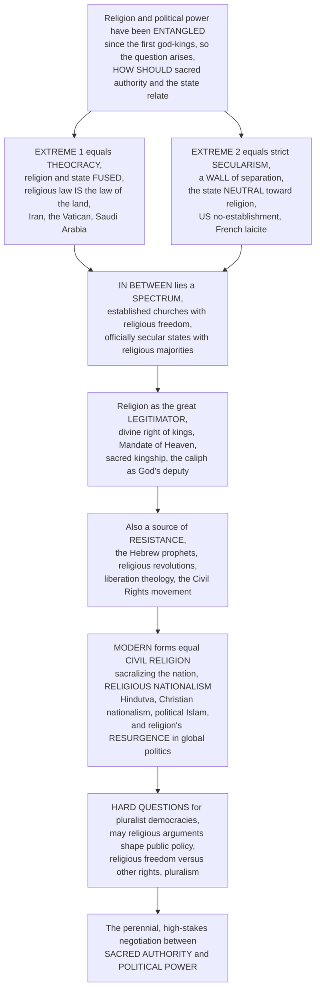

# 🏛️ Religion, Politics and the State

> [!abstract] TL;DR
> Religion and political power have been **entangled since the first god-kings**, and the question of *how they should relate* is one of the most consequential and contested in all of human history. At one pole stands **THEOCRACY**: religion and state are *fused*, religious law **is** the law of the land, and clerics rule in God's name (historically common; today approximated by **Iran**, the **Vatican**, and **Saudi Arabia**). At the opposite pole stands strict **SECULARISM**: a "wall of separation" between religion and state, with government **neutral** toward faith (the American *"no establishment"*, French *laïcité*). Between them lies a vast **spectrum** — established churches that still guarantee religious freedom (England), officially secular states with overwhelmingly religious populations (India, the US, Turkey), and every hybrid in between. Historically, religion has been the great **LEGITIMATOR** of political power — the *"divine right of kings"*, the *Mandate of Heaven*, sacred kingship, the caliph as God's deputy, the union of *throne and altar* — lending rulers a supernatural sanction. Yet religion has *also* been a wellspring of political **RESISTANCE** and revolution — from the **Hebrew prophets** denouncing unjust kings, to the religious roots of modern revolutions, to **liberation theology** and the **Black church** in the US Civil Rights movement. In the modern era three phenomena dominate: **CIVIL RELIGION** (Robert *Bellah* — the quasi-religious sacralization of the *nation itself*, with its own rituals, saints, and scriptures), the rise of **RELIGIOUS NATIONALISM** (fusing religious and national identity — *Hindutva* in India, Christian nationalism, political Islam), and the global **RESURGENCE** of religion in politics that defied secular predictions. This raises hard normative questions democracies still wrestle with: *May religious arguments legitimately shape public policy, or must public reason be secular (Rawls)? How do you balance religious freedom with other rights? How should a pluralistic society accommodate deep religious difference?* To study religion, politics, and the state is to study the **perennial, high-stakes negotiation between sacred authority and political power** — a relationship that shapes wars, constitutions, and the daily lives of billions.

---

## Intuition

**Analogy:** Picture two ancient thrones set side by side in every civilization — the **altar** and the **crown**, the **priest** and the **king**. From the first Sumerian temple-cities and Egyptian pharaohs onward, these two seats of authority have spent five thousand years pushing, pulling, embracing, and stabbing each other. Sometimes they **merge into one seat**: the ruler *is* the high priest, God's law *is* the state's law — that is **theocracy**. Sometimes a determined reformer drives a **wall between the two thrones** and declares that the crown must never touch the altar and the altar must never touch the crown — that is **strict secularism**. And most of the time, in most places, the two thrones sit in an *uneasy, negotiated marriage*: an established church whose bishops bless the king but whose subjects may worship freely, or a secular republic whose constitution is officially godless but whose population prays fervently every Sunday. The entire drama of religion and the state is the story of *how far apart, or how close together, a society places those two thrones.*

Once you see it as **two thrones**, the rest falls into place. Notice first that the crown has always wanted what the altar can uniquely provide: **legitimacy that no army can manufacture**. A king backed only by soldiers rules by fear; a king crowned by God, ruling by *divine right* or the *Mandate of Heaven*, rules by something subjects feel in their bones is *rightful*. That is why nearly every premodern regime married the two thrones — the sacred **sanctifies** power. But here is the twist that makes the whole subject explosive: **the same altar that legitimizes power can also condemn it.** The prophet Nathan denounces King David; the Hebrew prophets thunder against corrupt kings; Latin American priests preach *liberation theology* against dictators; Martin Luther King Jr. preaches from the Black church against segregation. Sacred authority is a **double-edged sword** — it can be the regime's foundation *or* the revolution's fuel. Then, in the modern era, something strange happens: even *secular* nations start to *sacralize themselves*. The flag becomes holy, the war dead become "martyrs", the founding becomes a sacred story — **civil religion**, the nation worshipping itself. And in reaction to secular modernity, **religious nationalism** roars back, fusing "who we worship" with "who we are" so tightly that the out-group becomes an enemy of both God and country. So before any jargon: this note is about **two thrones** — when they merge, when they separate, how one legitimizes or condemns the other, and how, even in a supposedly secular age, the sacred keeps flowing back into politics.

---

## How It Works

The subject unfolds as a single arc: from the **ancient entanglement** of sacred and political power, through the **spectrum** of church-state arrangements (theocracy ↔ secularism, with everything in between), to the two great *functions* religion performs in politics — **legitimating** power and **resisting** it — and finally to the distinctively *modern* forms (**civil religion**, **religious nationalism**, religious **resurgence**) and the hard normative questions they force upon pluralist democracies. The diagram traces that arc from "the god-kings" to "sacred authority versus political power".



**The core mechanics of religion, politics, and the state:**

1. **The entanglement is ancient and pervasive.** From god-kings and temple-states onward, religion has supplied political order with *authority, legitimacy, identity, mobilization,* and, when withheld, *conflict*. There is no "pure" state prior to religion; the question is never *whether* the sacred touches power but *how*.
2. **Arrangements fall on a spectrum.** The church-state relationship is best read as a **continuum** running from full *fusion* (theocracy) through *establishment* (an official church) to *separation* (secularism) and on to active *hostility* (militant atheist states). Crucially, "how fused is it?" and "how free is religion?" are **two different axes** — an established church can be highly tolerant; a secular state can be brutally repressive.
3. **Religion legitimates power.** The most common historical function: sacralizing authority so that obedience feels like piety. *Divine right*, the *Mandate of Heaven*, the *caliphate*, sacred kingship, and "throne-and-altar" alliances all convert brute power into *rightful* power. Carl Schmitt's **political theology** names the deep structural echo — modern political concepts (sovereignty, the state of exception) are *secularized theological concepts*.
4. **Religion resists power.** The mirror image: the **prophetic** tradition measures the throne against a *higher* law and finds it wanting. From Amos and Nathan to liberation theology, Gandhi, Solidarity, and the Black church, faith supplies the moral vocabulary, the organizational network, and the martyr's courage for dissent.
5. **Modernity sacralizes the nation — and religion returns.** Where classic **secularization theory** predicted religion's retreat, three things happened instead: nations grew their *own* **civil religion** (Bellah); **religious nationalism** fused faith with ethno-national identity; and, from the 1970s, a global **resurgence** of political religion (Kepel's *"revenge of God"*) put religion back at the center of world affairs — forcing every pluralist democracy to renegotiate the terms.

---

## Key Concepts

### 🟢 Secondary — the basic idea

- **Two thrones, one society.** Every society has to decide how close to put **religious authority** (priests, holy law, God) and **political authority** (rulers, the state, secular law). That single decision explains most of the differences below.
- **Theocracy = the thrones are one.** In a **theocracy**, religious leaders rule and *religious law is the law of the land*. Historic examples: the medieval **Papal States**, John Calvin's **Geneva**. Today, **Iran** (rule by clerics under an Ayatollah), the **Vatican** (the Pope rules a state), and **Saudi Arabia** come closest.
- **Secularism = a wall between the thrones.** In a **secular** state, government stays *neutral* and does not run or fund a religion. The United States has *"no establishment"* (no official church) plus *"free exercise"* (you may worship freely). France has **laïcité**, a stricter separation that keeps religion out of public institutions.
- **Established church = one throne leans on the other, but people are still free.** England has an official **Church of England** (the monarch is its head), yet citizens may practice any religion or none. "Official religion" does **not** automatically mean "no religious freedom."
- **Religion as the crown's blessing.** For most of history, kings said God chose them — the **"divine right of kings"** in Europe, the **"Mandate of Heaven"** in China, sacred kingship almost everywhere. This made obeying the king feel like obeying God.
- **Religion as the rebel's fire.** The very same religion can *oppose* rulers. The **Hebrew prophets** shouted at unjust kings; Martin Luther **King Jr.** and the **Black church** led the US Civil Rights movement; **Gandhi** fought British rule with religiously-rooted nonviolence.
- **The nation as a kind of religion.** Even secular countries treat the **flag**, the **anthem**, and fallen soldiers as *sacred*, with holidays, monuments, and "God bless America". Scholars call this **civil religion**.

### 🟡 Undergraduate — the spectrum, the functions, and the modern turn

- **The church-state spectrum (typology).** Read arrangements as a continuum: **theocracy** (rule by religious authority/law) → **established / state religion** (an official church, e.g. England, historic Europe) → **accommodationist secularism** (separation, but the state cooperates with religion — the US in practice) → **strict separationism / laïcité** (a firm wall — France) → **hostile / atheist state** (the state *suppresses* religion — the Soviet model). Two independent axes: *degree of fusion* and *degree of religious freedom*.
- **Establishment ≠ repression; secular ≠ free.** The load-bearing insight of panel (a) in the demo: an **established** church can coexist with robust liberty (England), while a formally **secular** regime can savagely restrict faith (the USSR). "Secular" and "religiously free" are *distinct* properties.
- **Erastianism.** The doctrine (named for Thomas Erastus) that the **state controls the church** — religion subordinated to political authority (Henry VIII's English church, the Byzantine and Russian "symphony" of throne and altar, Chinese state supervision of religion). The mirror image of theocracy.
- **Secular state vs. secularized society.** Two different things often conflated: a **secular state** is a *constitutional* arrangement (the government is neutral); a **secularized society** is a *sociological* condition (people become less religious). A society can be highly religious *under* a secular state (the US) — the theme of the sibling note *Secularization_and_the_Sociology_of_Belief*.
- **Legitimation — the sacralization of power.** Max Weber's point: authority needs to be seen as *legitimate*, and the sacred is the strongest legitimator. **Divine right**, the **Mandate of Heaven**, sacred/divine **kingship**, the **caliphate** (the ruler as God's *khalīfa*, deputy), and the union of *throne and altar* all convert power into rightful rule and sanctify the social order, war, and hierarchy — a mechanism also examined in the sibling *Religion_and_Social_Order*.
- **Political theology (Schmitt).** Carl **Schmitt**'s thesis that *"all significant concepts of the modern theory of the state are secularized theological concepts"* — sovereignty mirrors omnipotence, the *state of exception* mirrors the miracle. Political ideas often carry a hidden theological structure.
- **The prophetic tradition and resistance.** Religion as **opposition**: the **Hebrew prophets** (Amos, Isaiah, Nathan) subjecting kings to divine judgment; the religious roots of revolutions; **liberation theology** in Latin America (Gutiérrez — God's "preferential option for the poor"); the **Black church** and **MLK** in the Civil Rights movement; **Gandhi**'s *satyagraha*; the Catholic Church behind **Solidarity** in Poland. Religiously-inspired **nonviolence** and dissent — a theme continued in the sibling *Religion_Violence_and_Peacebuilding*.
- **Civil religion (Bellah).** Robert **Bellah**'s *"Civil Religion in America"* (1967): a nation develops a set of quasi-religious **beliefs, symbols, rituals, saints, and scriptures** that sacralize the *political community itself* — the Declaration as scripture, Lincoln and the war dead as martyrs, Memorial Day and the inauguration as ritual, the flag as sacred object. The nation becomes an object of transcendent devotion.
- **Religious nationalism.** The **fusion of religious and national/ethnic identity**: **Hindutva** (Hindu nationalism, India), **Christian nationalism** (US and Europe), **Buddhist nationalism** (Myanmar, Sri Lanka), **religious Zionism** (Israel), and **Islamism / political Islam**. Mark **Juergensmeyer** frames it as a global confrontation between *religious nationalism and the secular state*. Powerful for in-group cohesion — dangerous for out-group exclusion (panel c of the demo).
- **Religion in the public square.** The core democratic question: *may religious reasons legitimately justify laws?* John **Rawls**'s **"public reason"** says coercive policy must be justifiable by reasons all citizens can share — so religious arguments need *secular translation*. Critics (Nicholas **Wolterstorff**) call this an unfair muzzle on believers; Jürgen **Habermas** proposes a **"post-secular"** middle path in which religious contributions are welcome but must be **translated** into publicly accessible language before becoming law.

### 🔴 Graduate — theory, resurgence, and the normative frontier

- **The secularization thesis and its collapse.** Classical social theory (Comte, Weber, Durkheim, and mid-century sociology) predicted that **modernization → secularization**: religion would privatize and fade from public life. The late twentieth century *falsified* the strong version. José **Casanova**'s *Public Religions in the Modern World* (1994) documents the **deprivatization** of religion — its return as a *public* actor — and disaggregates secularization into three separable claims (differentiation of spheres; decline of belief; privatization), arguing only the *first* reliably holds.
- **The global resurgence — the "revenge of God".** Gilles **Kepel** (*La Revanche de Dieu*, 1991) chronicled the simultaneous 1970s revival of political **Islam, Judaism, and Christianity**. Landmark events — the **Iranian Revolution (1979)**, the US **Religious Right**, the rise of **Hindutva**, political **Buddhism**, and religiously-framed conflict worldwide — put religion back at the heart of politics and international relations, defying secular expectations and reframing "the clash" as, in part, a *religious* one (Juergensmeyer, contra a purely Huntingtonian reading).
- **Modes of secularism (a comparative typology).** "Secular" is plural. Charles **Taylor** and Jocelyn **Maclure** distinguish **republican / laïcité-style** secularism (which restricts religion's public visibility in the name of a shared civic identity — France, Kemalist Turkey) from **liberal-pluralist** secularism (which protects religious freedom and *accommodates* diversity — Canada, India's principled distance). Ahmet Kuru similarly contrasts **assertive** vs. **passive** secularism. The relevant value, Taylor and Maclure argue, is not the *removal* of religion but **freedom of conscience and equal respect**.
- **Multiple secular settlements.** India's constitution enshrines *sarva dharma sama bhava* (equal respect / principled distance, not strict separation); Turkey's early **laiklik** actively controlled Islam; the American **Establishment** and **Free Exercise** clauses generate perpetual jurisprudential tension (endorsement, coercion, and *Lemon*-style tests). There is **no single secular template** — each is a historically negotiated settlement.
- **Political theology after Schmitt.** The Schmittian claim — political concepts as secularized theology — anchors a large literature (Löwith, Blumenberg's counter-thesis on modern *self-assertion*, Kantorowicz's *The King's Two Bodies*, Agamben's *homo sacer* and *state of exception*). At stake: whether modern sovereignty ever truly escaped its theological womb, or merely *disguised* it.
- **Public reason and its critics — the deep debate.** Rawls's **"proviso"** (religious reasons are admissible if *in due course* supported by properly public reasons) tries to reconcile inclusion with legitimacy. **Wolterstorff** and Robert Audi debate whether a *"religious restraint"* on citizens is fair or even coherent; **Habermas**'s **translation proviso** and **institutional filter** (religious speech free in the informal public sphere, translated before entering formal state institutions) is the leading *post-secular* settlement. The unresolved question: can liberal legitimacy demand secular justification without *itself* becoming a sectarian metaphysics?
- **Religious freedom and its limits.** Freedom of religion (UDHR Art. 18; First Amendment) is near-universally affirmed yet perpetually **contested at the boundaries**: religious **dress** (headscarf and *burqa* bans, the *Lautsi* crucifix case), **conscientious objection** and exemptions (military service, contraception mandates, same-sex-marriage service refusals), ritual practice (animal slaughter, circumcision), and the clash of religious liberty with **equality and anti-discrimination** rights. Adjudicating these is the daily work of constitutional courts — connecting to *Rights_and_Civil_Liberties* and *Human_Rights_Law*.
- **The exclusionary logic of religious nationalism.** Fusing sacred and national identity *manufactures cohesion by manufacturing an enemy*: the religious out-group becomes a threat to *both* God and nation, licensing exclusion, disenfranchisement, and violence (the pogrom, the partition, the "cleansing"). Panel (c) of the demo models the danger — as religion-nationalism *intensity* rises, in-group solidarity rises but **out-group exclusion rises faster**, a dynamic explored further in the sibling *Fundamentalism_and_Religious_Revival* and *Religion_Violence_and_Peacebuilding*.
- **Religion in international relations.** Long ignored by realist IR theory, religion is now recognized as a driver of soft power, transnational networks (the Catholic Church, global *ummah*, Pentecostalism), diplomacy and **peacebuilding** (the Community of Sant'Egidio, faith-based reconciliation), *and* conflict — bearing on migration, diaspora identity, and diplomacy (the sibling *Global_Religion_Migration_and_Diaspora*).

---

## Python Demo

```python
# Religion, politics, and the state in three pictures:
#   (a) CHURCH-STATE TYPOLOGY MAP. We plot regimes in a 2D space whose two
#       axes are DELIBERATELY INDEPENDENT:
#           x = STATE-RELIGION FUSION   (0 = strict separation / secular,
#                                        10 = full theocracy / fusion)
#           y = RELIGIOUS FREEDOM        (0 = restricted, 10 = guaranteed)
#       The point of the map is that "secular" and "religiously free" are
#       DIFFERENT axes: an ESTABLISHED church (England) can sit high on
#       freedom, while a SECULAR state (the USSR) can sit low on freedom.
#   (b) LEGITIMATION / DIVINE-RIGHT MECHANISM. A ruler's stability is modeled
#       as coercion-baseline + a large SACRED-SANCTION component. We run two
#       histories: (A) religious authorities keep endorsing the ruler ->
#       stability stays high; (B) they WITHDRAW their endorsement midway ->
#       the divine-right prop is kicked out and legitimacy COLLAPSES.
#   (c) RELIGIOUS NATIONALISM: COHESION vs EXCLUSION. As the intensity of
#       religious nationalism rises (0 -> 1), in-group COHESION rises but
#       SATURATES, while out-group EXCLUSION / polarization rises FASTER and
#       accelerates -- the fusion of faith and nation buys solidarity at the
#       price of a sharpening enemy.
# All figures are conceptual TEACHING HEURISTICS, not empirical measurements.

import numpy as np
import matplotlib
matplotlib.use("Agg")
import matplotlib.pyplot as plt

rng = np.random.default_rng(2)

# ======================================================================
# (a) CHURCH-STATE TYPOLOGY MAP  (fusion vs religious freedom)
# ======================================================================
# (fusion 0-10, freedom 0-10)
regimes = {
    "Theocracy (Iran)":            (9.3, 2.2),
    "Vatican City":                (9.6, 5.5),
    "Saudi Arabia":                (9.0, 1.3),
    "Established church (England)":(6.0, 8.6),
    "Accommodationist (USA)":      (3.0, 8.9),
    "Strict laicite (France)":     (1.8, 7.2),
    "Secular pluralism (India)":   (3.8, 6.4),
    "Hostile atheist (USSR)":      (2.0, 0.9),
}

# ======================================================================
# (b) LEGITIMATION / DIVINE-RIGHT MECHANISM over time
# ======================================================================
T = np.arange(0, 120)
BASE = 0.28            # coercion / output-legitimacy floor (no sacred sanction)
SANCTION = 0.60        # extra stability the sacred blessing provides
WITHDRAW = 60          # round at which clerics revoke endorsement (scenario B)

# scenario A: sacred endorsement sustained throughout
sanction_A = np.ones_like(T, dtype=float)
# scenario B: endorsement collapses after WITHDRAW (a smooth but sharp drop)
sanction_B = 1.0 / (1.0 + np.exp((T - WITHDRAW) / 3.0))

def legitimacy(sanction):
    noise = rng.normal(0, 0.015, sanction.shape)
    return np.clip(BASE + SANCTION * sanction + noise, 0, 1)

legit_A = legitimacy(sanction_A)
legit_B = legitimacy(sanction_B)

# ======================================================================
# (c) RELIGIOUS NATIONALISM: cohesion vs exclusion as intensity rises
# ======================================================================
r = np.linspace(0, 1, 200)                     # religion-nationalism intensity
cohesion  = 1.0 - np.exp(-3.2 * r)             # rises, saturates
exclusion = r ** 1.7                           # rises, accelerates
polar_gap = exclusion - cohesion               # net exclusionary pressure

# ======================================================================
# Plot
# ======================================================================
fig = plt.figure(figsize=(16, 5.4))

# ---- (a) typology scatter --------------------------------------------
ax1 = fig.add_subplot(1, 3, 1)
for name, (fx, fy) in regimes.items():
    ax1.scatter(fx, fy, s=150, edgecolor="k", zorder=3,
                c=[plt.cm.coolwarm(fx / 10.0)])
    ax1.annotate(name, (fx, fy), textcoords="offset points",
                 xytext=(6, 6), fontsize=7.0)
ax1.axvline(5, color="k", lw=0.6, alpha=0.25)
ax1.axhline(5, color="k", lw=0.6, alpha=0.25)
ax1.text(9.6, 0.2, "THEOCRACY", ha="right", fontsize=7.5, color="#b91c1c")
ax1.text(0.3, 0.2, "SECULARISM", fontsize=7.5, color="#1d4ed8")
ax1.text(0.3, 9.4, "high religious freedom", fontsize=7.0, color="#334155")
ax1.set_xlabel("STATE-RELIGION FUSION  (0 separation - 10 theocracy)")
ax1.set_ylabel("RELIGIOUS FREEDOM  (0 restricted - 10 guaranteed)")
ax1.set_xlim(0, 11); ax1.set_ylim(0, 10)
ax1.set_title("(a) Church-state map: FUSION and FREEDOM\n"
              "are INDEPENDENT axes", fontsize=10)

# ---- (b) legitimation / divine-right collapse ------------------------
ax2 = fig.add_subplot(1, 3, 2)
ax2.plot(T, legit_A, color="#166534", lw=2.2,
         label="A: sacred sanction sustained")
ax2.plot(T, legit_B, color="#b91c1c", lw=2.2,
         label="B: clerics withdraw endorsement")
ax2.axhline(BASE, color="#64748b", ls="--", lw=1.2)
ax2.text(2, BASE + 0.02, "coercion-only floor (no sacred sanction)",
         fontsize=7.0, color="#475569")
ax2.axvline(WITHDRAW, color="#b91c1c", ls=":", lw=1.2)
ax2.text(WITHDRAW + 2, 0.95, "endorsement\nwithdrawn", fontsize=7.2,
         color="#b91c1c", va="top")
ax2.fill_between(T, legit_B, BASE, where=(legit_B < legit_A),
                 color="#b91c1c", alpha=0.08)
ax2.set_xlabel("time")
ax2.set_ylabel("regime LEGITIMACY / stability  (0 - 1)")
ax2.set_ylim(0, 1)
ax2.legend(fontsize=7.5, loc="center left")
ax2.set_title("(b) Divine-right mechanism: sacred sanction\n"
              "props up power, its withdrawal collapses it", fontsize=10)

# ---- (c) religious nationalism: cohesion vs exclusion ----------------
ax3 = fig.add_subplot(1, 3, 3)
ax3.plot(r, cohesion, color="#1d4ed8", lw=2.2, label="in-group COHESION")
ax3.plot(r, exclusion, color="#b91c1c", lw=2.2, label="out-group EXCLUSION")
ax3.fill_between(r, cohesion, exclusion, where=(exclusion > cohesion),
                 color="#b91c1c", alpha=0.10)
cross = r[np.argmin(np.abs(exclusion - cohesion))]
ax3.axvline(cross, color="#334155", ls=":", lw=1.0)
ax3.text(cross + 0.02, 0.12,
         "beyond here exclusion\noutpaces cohesion", fontsize=7.0,
         color="#334155")
ax3.set_xlabel("religion-nationalism INTENSITY  (0 - 1)")
ax3.set_ylabel("relative magnitude")
ax3.set_xlim(0, 1); ax3.set_ylim(0, 1.05)
ax3.legend(fontsize=7.5, loc="upper left")
ax3.set_title("(c) Religious nationalism: solidarity bought\n"
              "at the price of a sharpening enemy", fontsize=10)

plt.tight_layout()
plt.savefig("religion_politics_and_the_state.png", dpi=120, bbox_inches="tight")
plt.show()

# ---- Console summary --------------------------------------------------
print("=" * 70)
print("(a) CHURCH-STATE TYPOLOGY -- fusion vs religious freedom")
print("=" * 70)
for name, (fx, fy) in sorted(regimes.items(), key=lambda t: -t[1][0]):
    tag = "theocratic" if fx >= 7 else ("secular" if fx <= 4 else "established")
    free = "FREE" if fy >= 5 else "restricted"
    print(f"  {name:30s} fusion={fx:4.1f}  freedom={fy:4.1f}  "
          f"-> {tag:11s} / {free}")
print("  NOTE: England is 'established' yet FREE; the USSR is 'secular' yet")
print("        restricted -> fusion and freedom are DISTINCT axes.\n")

print("=" * 70)
print("(b) LEGITIMATION -- endgame stability")
print("=" * 70)
print(f"  Scenario A (sanction sustained):  final legitimacy = {legit_A[-1]:.2f}")
print(f"  Scenario B (endorsement pulled):  final legitimacy = {legit_B[-1]:.2f}")
print(f"  Collapse = {(legit_A[-1] - legit_B[-1]):.2f} of stability lost when")
print(f"             the sacred prop is kicked out (floor = {BASE:.2f}).\n")

print("=" * 70)
print("(c) RELIGIOUS NATIONALISM -- cohesion vs exclusion")
print("=" * 70)
for ri in [0.2, 0.5, 0.8, 1.0]:
    c = 1.0 - np.exp(-3.2 * ri)
    e = ri ** 1.7
    lean = "exclusion dominates" if e > c else "cohesion dominates"
    print(f"  intensity={ri:.1f}  cohesion={c:.2f}  exclusion={e:.2f}  -> {lean}")
```

**What the figure teaches.** Panel (a) is the whole *typology* argument in one picture. Plotting regimes on **state-religion fusion** (x) versus **religious freedom** (y) reveals that these are **two independent axes**, not one. The theocracies (Iran, Saudi Arabia) cluster bottom-*right* — high fusion, low freedom — but the **Vatican** sits high-right (fused *and* relatively tolerant of the faiths within it), while **England**, though it has an *established* church, sits high on freedom, and the **USSR**, though formally *secular*, sits at the bottom on freedom. The lesson beginners miss: *"secular" does not mean "free," and "established" does not mean "repressive."* Panel (b) makes the **divine-right mechanism** visible. A ruler's legitimacy has a **coercion-only floor** (the dashed line — what raw power alone can hold), plus a large **sacred-sanction** bonus. In scenario A the clergy keep blessing the throne and stability stays high; in scenario B they **withdraw their endorsement** at the marked moment, the sacred prop is kicked out, and legitimacy **collapses toward the floor** — the historical pattern from investiture crises to 1979 Iran, where losing the mosque loses the street. Panel (c) models the **danger of religious nationalism**: as its *intensity* rises, in-group **cohesion** climbs but *saturates*, while out-group **exclusion** climbs *faster and accelerates*, so that past a threshold the exclusionary pressure **outpaces** the solidarity gained — the shaded region where fusing faith and nation manufactures cohesion by manufacturing an enemy. Together the panels deliver the section's thesis: church-state arrangements are **multi-dimensional**, sacred legitimacy is a **powerful but revocable prop** on political power, and the modern fusion of religion with nation is **potent and perilous**.

---

## Real-World Applications

- **Reading contemporary regimes.** The typology of panel (a) lets you locate real states precisely: **Iran**'s *velayat-e faqih* (guardianship of the jurist) as near-theocracy, **Saudi Arabia**'s throne-and-*ulama* pact, England's tolerant **establishment**, France's assertive **laïcité**, India's contested **secular pluralism**, and the historic Soviet **hostile** model — and to see why simply asking "is it secular?" is not enough.
- **Constitutional and legal design.** How a founding document handles religion — the US **Establishment** and **Free Exercise** clauses, France's 1905 law, India's Articles 25–28, Turkey's *laiklik* — shapes decades of jurisprudence on school prayer, religious dress, exemptions, and funding. Courts constantly adjudicate the church-state line (see *Rights_and_Civil_Liberties*, *Constitutional_Law_and_Structure*).
- **Understanding revolutions and legitimacy crises.** Panel (b)'s mechanism explains why regimes that *lose* their religious sanction wobble: the medieval **Investiture Controversy**, the **English** and **French** revolutions' assault on sacred kingship, and the **1979 Iranian Revolution**, where clerical withdrawal of legitimacy from the Shah proved decisive.
- **Diagnosing religious nationalism.** Panel (c) frames present-day movements — **Hindutva** in India, **Christian nationalism** in the US, **Buddhist** nationalism in Myanmar and Sri Lanka, **religious Zionism**, and **Islamism** — and predicts their characteristic pathology: rising in-group devotion paired with sharpening exclusion of minorities.
- **Faith-based politics and social movements.** The resistance tradition is *operational*: the **Black church** and **MLK**'s Southern Christian Leadership Conference, Latin American **liberation theology** and base communities, **Gandhi**'s religiously-rooted *satyagraha*, and the Catholic Church behind Poland's **Solidarity** all used religious networks and moral authority to move politics.
- **Deliberation in pluralist democracies.** The **public reason** debate (Rawls, Habermas, Wolterstorff) directly informs how legislatures, courts, and citizens argue over abortion, end-of-life law, marriage, and blasphemy — whether a *religious* reason may ground *coercive* law, or must first be *translated* into shared public terms.
- **Religion in foreign policy and peacebuilding.** Recognizing religion as a driver of soft power, conflict, *and* reconciliation (the Community of Sant'Egidio, interfaith diplomacy) reshapes how states and NGOs handle sectarian conflict, refugee flows, and post-war reconciliation.

---

## Common Pitfalls

- **Collapsing "secular" and "religiously free" into one axis.** The single commonest error, and exactly what panel (a) refutes. An **established** church can guarantee wide freedom (England); a **secular** state can crush religion (the USSR). Always ask *two* questions — *how fused?* and *how free?* — never one.
- **Assuming secularization is inevitable and complete.** The strong secularization thesis *failed*: Casanova's deprivatization and Kepel's *"revenge of God"* document religion's public **resurgence**. Treating religion as a fading premodern residue mispredicts modern politics from Tehran to Texas.
- **Confusing a secular *state* with a secular *society*.** A constitutional arrangement (neutral government) is not the same as a sociological fact (declining belief). The US is a **secular state** *and* a highly **religious society** — a combination that baffles those who conflate the two.
- **Treating religion as only a legitimator, or only a rebel.** Sacred authority is a **double-edged sword**: it sanctifies thrones *and* topples them. Analyses that see only "opium of the people" (pure legitimation) or only "liberation" miss half the story — often *both* edges operate in the same conflict.
- **Reading all religious nationalism as ancient hatred.** Religious nationalism is a **modern** phenomenon that *instrumentalizes* religious identity for national-political ends; it is not a timeless eruption of primordial faith. Missing its modernity leads to fatalism and bad policy.
- **Universalizing one model of secularism.** French **laïcité** (restrict religion's public presence) is *not* the only secularism; liberal-pluralist secularism (accommodate and protect diversity — Taylor and Maclure) is a distinct settlement. Judging India, the US, or Canada by French standards distorts them.
- **Assuming "public reason" is neutral, or that religion must be silenced.** The Rawls–Wolterstorff–Habermas debate is genuinely *unsettled*: demanding purely secular justification may itself smuggle in a contestable metaphysics, while admitting any religious reason may threaten equal citizenship. Treating either extreme as obviously correct begs the question.

---

## Related Concepts

- [[State_Formation_and_Political_Development]] — the political-science account of how states are *built* and *legitimated*; religion has been a primary source of the authority and identity that state formation requires, making this the natural companion on the "state" side of church-and-state.
- [[The_State_System_and_Sovereignty]] — the modern *secular* sovereign state (the Westphalian order) is precisely the arrangement that religion both underwrote (Schmitt's political theology) and later stood outside; essential for grasping what "the state" in church-*state* means.
- [[Contemporary_Political_Ideologies]] — situates **nationalism** and religiously-inflected ideologies among modern political creeds, clarifying how religious nationalism relates to secular ideological families.
- [[Rights_and_Civil_Liberties]] — the constitutional home of **religious freedom** and its collisions with other rights (dress, exemptions, anti-discrimination), where the church-state line is adjudicated in practice.
- [[Human_Rights_Law]] — freedom of religion or belief as an international human right (UDHR Art. 18) and its contested limits, the legal frame for accommodating religious difference across borders.
- [[The_Protestant_Reformation]] — the historical rupture that shattered Christendom's unified throne-and-altar order, birthed confessional states and wars of religion, and set Western Europe on the long road to toleration and secular settlement.
- [[Rise_of_Islam_and_the_Caliphates]] — the paradigm of fused sacred-and-political authority: the **caliph** as God's deputy and the union of religious law and rule, the historical template behind political Islam and the theocratic pole.
- [[The_French_Revolution]] — the assault on sacred kingship and the Church, the invention of an aggressively secular republic and its own **civil-religious** cults (the Cult of Reason), and the origin point of **laïcité**.
- [[Political_Ethics_and_Civil_Disobedience]] — the ethical frame for religiously-motivated resistance (King, Gandhi) and for the **public reason** debate over whether religious convictions may justify law and disobedience.

---

## Review Questions

**🟢 Secondary.** In your own words, define **theocracy** and **secularism**, and place one real country near each pole. Then explain, using England as your example, why "a country has an official church" does **not** automatically mean "that country has no religious freedom."

**🟡 Undergraduate.** Religion has served as both a **legitimator** of political power and a source of political **resistance**. Explain each function with a concrete example (e.g., the *Mandate of Heaven* or *divine right* for legitimation; the Hebrew prophets, liberation theology, or the Civil Rights movement for resistance). Then define Robert **Bellah**'s **"civil religion"** and give two examples of how a modern nation sacralizes *itself*.

**🔴 Graduate.** Classical **secularization theory** predicted religion's retreat from public life, yet the late twentieth century saw a global **resurgence** of political religion (Casanova, Kepel) and the rise of **religious nationalism** (Juergensmeyer). First, explain *why* the strong secularization thesis failed and what Casanova means by the *deprivatization* of religion. Then take a position in the **public reason** debate: should a pluralist democracy require that coercive laws be justifiable in *secular* terms (Rawls), permit unrestricted religious argument (Wolterstorff), or adopt Habermas's *"post-secular" translation* proviso — and what does your answer imply for a real contested case (e.g., a religious-dress ban, a blasphemy law, or a faith-based refusal of service)?

---

## Sources

- José Casanova, *Public Religions in the Modern World* (University of Chicago Press, 1994) — the landmark disaggregation of the secularization thesis and the argument for the *deprivatization* of religion.
- Robert N. Bellah, "Civil Religion in America," *Daedalus* 96, no. 1 (1967): 1–21 — the founding statement of the concept of American civil religion.
- Mark Juergensmeyer, *The New Cold War? Religious Nationalism Confronts the Secular State* (University of California Press, 1993) — the comparative analysis of religious nationalism against the secular state.
- Jocelyne Maclure & Charles Taylor, *Secularism and Freedom of Conscience* (Harvard University Press, 2011) — a typology of secularisms grounding secularism in freedom of conscience and equal respect rather than the removal of religion.
- Gilles Kepel, *The Revenge of God: The Resurgence of Islam, Christianity, and Judaism in the Modern World* (Polity, 1994) — the account of the late-twentieth-century global resurgence of political religion.

---

#religious-studies #religion-and-politics #secularism #civil-religion #religious-nationalism
