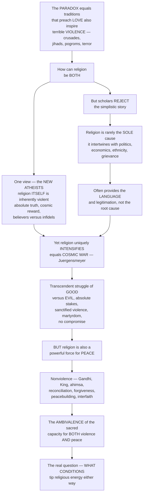

# ☮️ Religion, Violence and Peacebuilding

> [!abstract] TL;DR
> Religion presents a profound **paradox**: the same traditions that preach **love**, compassion, and peace have also inspired some of history's most terrible **violence** — crusades, jihads, inquisitions, pogroms, and terrorism. One popular view (the **"New Atheists"**) blames religion *itself* — its absolute truth-claims, promises of cosmic reward, and division of humanity into believers and infidels. But scholars mostly reject this simplistic story: religion is *rarely the sole cause* of violence and usually intertwines with politics, economics, ethnicity, land, grievance, and power, more often supplying the **language, identity, and legitimation** of conflicts driven by other factors than being their root. Yet religion is not innocent either — it can uniquely **intensify** conflict. Mark **Juergensmeyer's "cosmic war"** is the key idea: framing an earthly struggle as a *transcendent* battle of good vs evil raises the stakes to the absolute, sanctifies violence as sacred duty, demonizes the enemy, resists compromise, and rewards **martyrdom**. But the *same* traditions are also among the most powerful forces for **peace** — the nonviolence of **Gandhi's ahimsa** and **King's** Christian resistance, reconciliation and forgiveness, humanitarian compassion, and faith-based **peacebuilding** and interfaith dialogue. The honest conclusion is R. Scott **Appleby's "ambivalence of the sacred"**: religion has a genuine capacity for *both* extraordinary violence *and* extraordinary peace — and the crucial question is **what conditions tip it one way or the other**.

## Intuition

**Analogy.** Picture fire. The *same* flame that warms a home, cooks a meal, and lights a candle in a shrine can also raze a village to ash. It would be foolish to say "fire is good" or "fire is evil" — fire is *powerful*, and what it does depends on where it is set, who tends it, and what it is fed. Religion is like this fire. It is one of the most concentrated sources of human energy, meaning, identity, and motivation ever devised, and that very power is exactly why it can warm the world with compassion **and** burn it down in holy war. The interesting question is never "is fire good or bad?" but **under what conditions does it heat a home versus start an inferno** — and the same is true of the sacred.

So resist both easy answers. The **apologist** says religion is *always* peaceful and every atrocity is a "distortion" of the "true" faith — but that conveniently exiles inconvenient scripture, saints, and centuries of holy war. The **New Atheist** says religion is *inherently* violent — but that ignores how much bloodshed is secular, and how the *same* verses that some read as a command to kill, others read as a command to love a stranger. The scholarly path runs between them: religion is neither innocent nor uniquely guilty. It is **ambivalent** — dangerously and hopefully so — and understanding it means understanding what tips the flame.

---

## How It Works

The field organizes the paradox into a sequence of claims, each correcting the last. **(1) The blame thesis.** The popular "New Atheist" argument (Dawkins, Harris, Hitchens) holds that religion is *inherently* dangerous: absolutism ("we alone have the Truth"), faith over evidence, promises of cosmic reward, and a sharp **in-group/out-group** split between the saved and the damned make believers unusually willing to kill and die. **(2) The critique.** William **Cavanaugh's** *The Myth of Religious Violence* answers that the very category of a uniquely-irrational "religious" violence is a *modern Western construct* — it isolates faith from the secular nationalisms, ideologies, and economic interests that kill at least as freely, and it does political work (legitimating "rational" secular force against "fanatical" religious force). Violence blamed on "religion" is almost always **multi-causal**.

**(3) The scholarly consensus.** Religion is *rarely the sole or root cause* of violence. It **intertwines** with politics, economics, ethnicity, territory, historical grievance, humiliation, identity, and power, functioning as **language, identity, legitimation, mobilizer, and intensifier** rather than prime mover. **(4) But the distinctive contribution.** Where religion *does* enter a conflict, it can transform it. Mark **Juergensmeyer's "cosmic war"** names the mechanism: reframing a bounded political dispute as a *transcendent, cosmic* struggle between the sacred and the satanic. This **absolutizes the stakes** (you are fighting for God, not for a border), **sanctifies violence** as a sacred duty, **demonizes** the enemy into the devil, **resists compromise** (you cannot negotiate with evil), and **rewards martyrdom** (death becomes victory). It also gives the alienated a grand narrative and identity — much of the appeal of religious terrorism. Traditions supply the raw materials: **holy war** and **crusade**, scriptural warrant for violence, apocalyptic and millenarian expectation, and the deep logic of **sacrifice** and the **scapegoat** (René Girard).

**(5) The other half of the ambivalence.** The *same* traditions are unmatched engines of **peace**: principled **nonviolence** (Gandhi's *satyagraha* and *ahimsa*, King's Christian resistance, the peace churches, Jain and Buddhist non-harming), **reconciliation and forgiveness** (South Africa's Truth and Reconciliation Commission), faith-based **peacebuilding** and mediation, interfaith cooperation, and a vast humanitarian tradition rooted in love, human dignity, and the Golden Rule. **(6) The synthesis.** Appleby's **"ambivalence of the sacred"**: religion holds a *militant* potential for **both** violence **and** peace, and the real analytical task is to identify the **conditions** — interpretation, leadership, grievance, exclusion vs inclusion, political context — that tip the energy one way or the other.



---

## Key Concepts

**Secondary (foundations).**
- **The paradox** — the same traditions preach peace and inspire violence; honest study avoids both *apologetics* ("real religion is always peaceful") and *simplistic blame* ("religion is inherently violent").
- **Holy war vs nonviolence** — traditions contain *both* poles: crusade, jihad, and herem on one side; ahimsa, turning the other cheek, and the peace churches on the other.
- **Multi-causal conflict** — "religious" wars almost always mix faith with land, money, ethnicity, and power; religion is usually *one* ingredient, not the whole recipe.
- **Martyrdom** — dying (and killing) for the sacred is framed as glorious, which is why cosmic framing is so combustible.

**Undergraduate (structure).**
- **The "religion causes violence" thesis** — the New Atheist argument (Dawkins, Harris, Hitchens): absolutism, faith over evidence, cosmic reward, and in-group/out-group division make religion inherently dangerous.
- **The "myth of religious violence" (Cavanaugh)** — the *category* of uniquely-dangerous religious violence is a modern Western construct that ignores secular violence and serves political ends; violence attributed to religion is typically multi-causal.
- **Cosmic war (Juergensmeyer)** — framing earthly conflict as a transcendent struggle of good vs evil that absolutizes stakes, sanctifies violence, demonizes enemies, forbids compromise, and rewards martyrdom.
- **Sacralization of violence** — holy war, sacrifice, and martyrdom that make killing a *sacred act*; scriptural warrant and the interpretation of violent texts; apocalyptic and millenarian violence.
- **Traditions on legitimate force** — **just war** (Augustine, Aquinas: *jus ad bellum* and *jus in bello*), **jihad** (greater/spiritual vs lesser/military and its abuse), the **crusades**, and the scriptural **ban** (*herem*).
- **Religion as peace** — nonviolence (Gandhi, King, peace churches), reconciliation and forgiveness (South Africa's TRC), faith-based peacebuilding, and interfaith dialogue.

**Graduate (contested frontiers).**
- **The ambivalence of the sacred (Appleby)** — religion's *militant* potential runs in **both** directions; the crucial question shifts from "is religion good or bad?" to "what **conditions** tip it toward violence or peace?" (interpretation, leadership, grievance, exclusion vs inclusion, political context).
- **Girard's mimetic theory** — desire is imitative, breeding rivalry and a mimetic crisis that communities resolve by uniting against a **scapegoat**; archaic religion "solves" violence by *ritualizing* it (sacrifice), which both conceals and reproduces the founding murder.
- **The logic of religious terrorism** — beyond grievance, its appeal is *narrative and identity*: humiliation transfigured into cosmic significance, the alienated recruited into a grand story, "performance violence" staged as symbolic theater for a watching world.
- **Religion and the intractability of conflict** — sacralized "cosmic" conflicts empirically last longer and settle less often, because the *utility of compromise* is redefined as *betrayal of the sacred* (formalized in the Python demo).
- **Countering violent extremism and religious peacemaking** — the policy payoff of the ambivalence thesis: rather than treating religion as the problem to be neutralized, engage religious peacemakers, build **religious literacy**, and shift conditions (inclusion, credible leadership, de-escalatory interpretation) that tip the sacred toward peace.

---

## Python Demo

```python
# Religion, Violence and Peacebuilding — three complementary visual arguments:
#   (1) COSMIC WAR / INTRANSIGENCE: sacralizing a conflict (framing it as an
#       absolute good-vs-evil struggle) collapses the "utility of compromise",
#       pushing the settlement point far to the right (or off the chart) and
#       making the conflict escalate and endure.
#   (2) AMBIVALENCE / TIPPING: the same religious intensity can rest at PEACE
#       or VIOLENCE depending on conditions — a bistable / fold bifurcation with
#       a tipping point and hysteresis (Appleby's "ambivalence of the sacred").
#   (3) MULTI-CAUSAL: decomposing the "causes" of religious conflicts shows
#       religion is one factor among several and rarely a majority cause.
import numpy as np
import matplotlib.pyplot as plt

# ---------- (1) Cosmic-war intransigence ----------
# Utility of accepting a compromise as accumulated conflict COST rises.
# Secular: more pain -> a deal grows more attractive, settle when U crosses 0.
# Sacralized: subtract a large "betrayal of the sacred" penalty S -> settlement
# is pushed far right or never reached (you cannot negotiate with the devil).
cost = np.linspace(0, 100, 400)     # accumulated cost of continued fighting
a, b = 1.0, 20.0                    # pain->deal sensitivity; value of "winning" given up
S_levels = [0, 30, 70]             # sacralization penalty: secular -> cosmic war
labels1  = ['Secular / negotiable (S=0)',
            'Partly sacralized (S=30)',
            'Cosmic war (S=70)']

# ---------- (2) Ambivalence as a fold bifurcation ----------
# Outcome x follows dx/dt = -V'(x), V(x) = x^4/4 - mu x^2/2 - h x.
# mu = religious INTENSITY (deep wells = capacity for extreme outcomes);
# h  = the CONDITIONS field (inclusion/peace-framing  <-->  exclusion/grievance).
# Equilibria solve x^3 - mu x - h = 0; stable where 3x^2 - mu > 0.
mu = 1.0
hs = np.linspace(-0.5, 0.5, 500)
st_h, st_x, un_h, un_x = [], [], [], []
for h in hs:
    for r in np.roots([1.0, 0.0, -mu, -h]):     # x^3 - mu x - h = 0
        if abs(r.imag) < 1e-9:
            xr = r.real
            if (3*xr**2 - mu) > 0:               # V'' > 0  -> stable
                st_h.append(h); st_x.append(xr)
            else:                                # V'' < 0  -> unstable tipping point
                un_h.append(h); un_x.append(xr)
st_h, st_x = np.array(st_h), np.array(st_x)

# ---------- (3) Multi-causal attribution ----------
factors   = ['Religion', 'Politics/Power', 'Economics', 'Ethnicity', 'Grievance/Land']
conflicts = ['Conflict A', 'Conflict B', 'Conflict C', 'Conflict D', 'Conflict E']
# Rows = conflicts, cols = factors; each row is a share decomposition (sums to 1).
W = np.array([
    [0.30, 0.25, 0.15, 0.15, 0.15],
    [0.20, 0.30, 0.20, 0.15, 0.15],
    [0.40, 0.20, 0.10, 0.20, 0.10],
    [0.15, 0.30, 0.25, 0.15, 0.15],
    [0.25, 0.20, 0.20, 0.20, 0.15],
])
colors3 = ['crimson', '#4c72b0', '#55a868', '#8172b3', '#ccb974']

# ---------- Plot ----------
fig, ax = plt.subplots(1, 3, figsize=(18, 5.4))

# Panel 1
for S, lab in zip(S_levels, labels1):
    U = a*cost - b - S
    ax[0].plot(cost, U, lw=2.5, label=lab)
    settle = (b + S) / a                       # cost where compromise becomes acceptable
    if settle <= cost[-1]:
        ax[0].scatter([settle], [0], s=70, zorder=5, color='black')
        ax[0].annotate(f'settles\n@ cost {settle:.0f}', (settle, 0),
                       xytext=(settle, -28), ha='center', fontsize=8,
                       arrowprops=dict(arrowstyle='->', lw=1))
    else:
        ax[0].annotate('never settles\n(intransigence)', (cost[-1], a*cost[-1]-b-S),
                       xytext=(70, -45), ha='center', fontsize=8, color='crimson')
ax[0].axhline(0, color='gray', lw=1)
ax[0].set_title('Cosmic war intransigence:\nsacralizing collapses the utility of compromise')
ax[0].set_xlabel('Accumulated cost of continued conflict')
ax[0].set_ylabel('Utility of accepting compromise')
ax[0].legend(fontsize=8); ax[0].grid(alpha=0.3)

# Panel 2
peace = st_x < 0
ax[1].scatter(st_h[peace],  st_x[peace],  s=8, color='#3a7d3a', label='stable PEACE')
ax[1].scatter(st_h[~peace], st_x[~peace], s=8, color='crimson', label='stable VIOLENCE')
ax[1].scatter(un_h, un_x, s=8, color='gray', alpha=0.6, label='tipping threshold (unstable)')
ax[1].axhline(0, color='gray', lw=0.8, ls=':')
ax[1].axvline(0, color='gray', lw=0.8, ls=':')
ax[1].set_title('Ambivalence of the sacred:\nsame intensity, PEACE or VIOLENCE by conditions')
ax[1].set_xlabel('conditions:  inclusion / peace-framing  →  exclusion / grievance')
ax[1].set_ylabel('outcome:   peace (−)   ↔   violence (+)')
ax[1].legend(fontsize=8, loc='upper left'); ax[1].grid(alpha=0.3)

# Panel 3
left = np.zeros(len(conflicts))
for j, (f, c) in enumerate(zip(factors, colors3)):
    ax[2].barh(conflicts, W[:, j], left=left, color=c, label=f,
               edgecolor='white', linewidth=1.2)
    left += W[:, j]
ax[2].axvline(0.5, color='black', ls='--', lw=1.4)
ax[2].text(0.5, len(conflicts)-0.3, '  50% (majority)', fontsize=8, va='center')
ax[2].set_xlim(0, 1)
ax[2].set_title(f'Multi-causal: religion averages only '
                f'{W[:,0].mean()*100:.0f}% of attributed cause')
ax[2].set_xlabel('Share of attributed causation')
ax[2].legend(fontsize=8, loc='lower right')

plt.tight_layout()
plt.savefig('religion_violence_and_peacebuilding.png', dpi=120)
print('Settlement cost by sacralization S:',
      {S: round((b+S)/a, 1) for S in S_levels})
print(f'Religion as share of attributed cause — mean {W[:,0].mean():.2f}, '
      f'max {W[:,0].max():.2f} (never a lone majority)')
```

The three panels dramatize the argument. **Panel 1** shows why cosmic framing produces *intransigence*: a secular conflict settles once its cost passes a modest threshold, but each increment of **sacralization** (S) subtracts a "betrayal of the sacred" penalty that drives the settlement point rightward until, in full "cosmic war," compromise is never rational — the conflict escalates and endures. **Panel 2** renders Appleby's **ambivalence** as a fold bifurcation: for the *same* high religious intensity, the system can rest at a stable **peace** or a stable **violence** equilibrium, and small changes in *conditions* (leadership, inclusion, framing, grievance) can tip it across a threshold with hysteresis — the sacred is not intrinsically peaceful or violent but *bistable*. **Panel 3** operationalizes Cavanaugh: decomposing the "causes" of several religious conflicts, **religion** is consistently *one factor among several* and never a lone majority — a quantitative check on the "religion did it" reflex.

---

## Real-World Applications

- **Countering violent extremism (CVE).** Governments and NGOs increasingly reject "religion is the problem" for the ambivalence model — mapping the *conditions* (humiliation, exclusion, cosmic-war narratives, charismatic recruiters) that tip communities toward violence, and engaging credible religious voices to contest the framing rather than the faith.
- **Faith-based peacebuilding and mediation.** Religious actors — the Community of Sant'Egidio brokering Mozambique's peace, Quaker and Mennonite mediators, interreligious councils in Nigeria and the Balkans — leverage moral authority, trusted networks, and reconciliation vocabularies that secular diplomats lack.
- **Reconciliation and restorative justice.** South Africa's **Truth and Reconciliation Commission**, chaired by Archbishop Desmond Tutu, fused a religious grammar of confession and forgiveness with transitional justice — a template studied worldwide for post-conflict healing.
- **Religious literacy in policy and journalism.** Analysts trained to read a conflict's religious dimension *without* reducing it to religion (or ignoring it) produce better assessments of the Middle East, South Asia, and the Sahel than either the "clash of civilizations" or the "purely economic" caricature.
- **Nonviolent movements.** Gandhi's *satyagraha* against empire and King's church-anchored civil-rights struggle remain the working proof that religiously motivated **nonviolence** can defeat entrenched power — now a studied repertoire for activists globally.

---

## Common Pitfalls

- **Apologetics — "that wasn't *real* religion."** Exiling every atrocity as a "distortion" makes the thesis unfalsifiable and ignores the scripture, saints, and centuries of holy war internal to the tradition. Violence is a *possibility within* religions, not only an external corruption of them.
- **The reductive blame reflex.** Declaring religion the *cause* of a conflict skips the multi-causal analysis (Panel 3). Ask what politics, economics, ethnicity, and grievance are also in play, and what work the religious framing is *doing* — usually legitimation and mobilization, not first cause.
- **Ignoring the secular half of violence.** Cavanaugh's warning: obsessing over "religious" violence while treating nationalism, ideology, and economic interest as "rational" force is itself a political move. The 20th century's deadliest violence was largely *secular*.
- **Treating scripture as self-executing.** "The Qur'an / Bible says X, therefore believers do X" ignores that the *same* texts license both slaughter and mercy; what matters is the community of **interpretation**, leadership, and context that selects a reading.
- **Assuming religion is settled on one side.** The deepest error is forgetting the **ambivalence** — expecting religion to be *only* violent or *only* peaceful. The productive question is always *what conditions tip it*, and those conditions are often changeable.

---

## Related Concepts

This note is the violence-and-peace hub of the vault's **Religion and Society** section, and its sibling notes carry the neighboring pieces in prose. **Religion_and_Social_Order** and **Religion_Politics_and_the_State** supply the social and political embedding in which sacred energy is mobilized or restrained; **Fundamentalism_and_Religious_Revival** develops the apocalyptic, absolutist, and identity dynamics that most readily feed cosmic-war framing; **Ethics_and_Religious_Law** carries the just-war, jihad, pacifism, and ahimsa debates as *normative* traditions on legitimate force; **Global_Religion_Migration_and_Diaspora** connects to the humiliation, dislocation, and identity grievances that religious extremism exploits and that peacebuilding must address; and **Myth_and_Sacred_Narrative** grounds Girard's sacrifice-and-scapegoat theory and the good-vs-evil stories that cosmic war reactivates. In-vault, **Islam_and_the_Islamic_Tradition** anchors the meanings and abuse of *jihad*, and **Christianity_and_the_Christian_Traditions** the crusade-and-nonviolence spectrum.

- [[Global_Security_and_Terrorism]] — the political-science treatment of terrorism and asymmetric violence into which religious terrorism's "cosmic war" logic and performance violence fit.
- [[War_Conflict_and_Security]] — the causes, dynamics, and resolution of armed conflict that the multi-causal and intransigence models here specialize for the religious case.
- [[The_Crusades]] — the paradigmatic Christian holy war, a historical case study in sacralized violence, papal legitimation, and mixed religious-political-economic motives.
- [[Religion_Magic_and_Ritual]] — the anthropology of ritual and sacrifice that underlies Girard's mimetic theory of violence and the sacred.
- [[Just_War_and_the_Ethics_of_Violence]] — the ethical framework (jus ad bellum / in bello) and its pacifist alternative that traditions draw on to regulate and justify force.

---

## Review Questions

**Secondary.** Give one example of religion inspiring violence and one example of religion inspiring peace. Why is it too simple to say "religion is violent" or "religion is peaceful"?

**Undergraduate.** Explain Juergensmeyer's concept of **"cosmic war."** List three ways that framing an earthly conflict as a transcendent struggle between good and evil changes how the conflict is fought — and use one to explain why sacralized conflicts are so resistant to negotiated settlement.

**Graduate.** Appleby calls religion **"ambivalent"** and Cavanaugh calls uniquely-religious violence a **"myth."** Are these claims allies or rivals? Using the multi-causal and tipping-point models, construct an account of *what conditions* tip a religious tradition's energy toward violence versus peace, and say what your account implies for policy toward countering extremism and supporting religious peacemakers.

---

## Sources

- Mark Juergensmeyer, *Terror in the Mind of God: The Global Rise of Religious Violence* (rev. ed., 2017) — the "cosmic war" thesis and comparative study of religious terrorism.
- R. Scott Appleby, *The Ambivalence of the Sacred: Religion, Violence, and Reconciliation* (2000) — religion's militant potential for both extremism and peacebuilding.
- William T. Cavanaugh, *The Myth of Religious Violence: Secular Ideology and the Roots of Modern Conflict* (2009) — the critique of the "religion is uniquely violent" category.
- René Girard, *Violence and the Sacred* (1972; Eng. 1977) — mimetic desire, the scapegoat mechanism, and the origin of the sacred in ritualized violence.
- Charles Kimball, *When Religion Becomes Evil* (2002) — the warning signs (absolute truth-claims, blind obedience, ideal ends justifying any means, holy war) that tip faith toward violence.

---

#religious-studies #religion-and-violence #cosmic-war #peacebuilding #ambivalence-of-the-sacred
