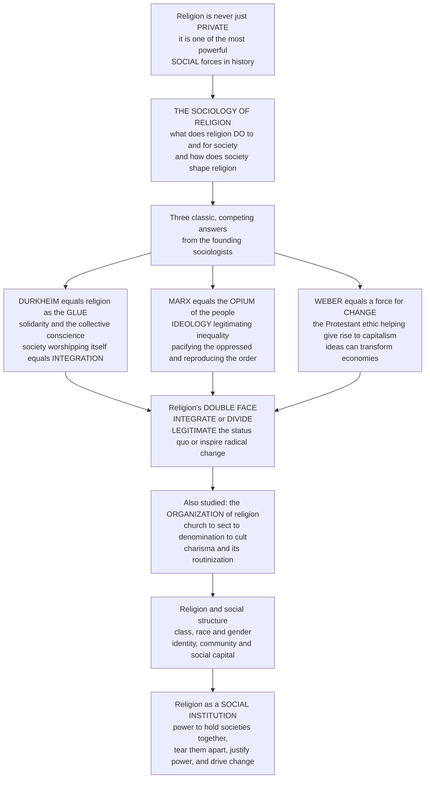

# 🏛️ Religion and Social Order

> [!abstract] TL;DR
> Religion is never merely a private matter between a person and the divine — it is one of the most powerful **social** forces in history, and the **sociology of religion** asks the reciprocal question of what religion *does* to and for society and how society shapes religion in return. Its three founding thinkers gave three enduring, competing answers: **Durkheim** saw religion as the *glue* that binds people into solidarity, so that a community at worship is really *celebrating itself* and religion **integrates** society; **Marx** saw its dark side as the *"opium of the people,"* an **ideology** that legitimates inequality and pacifies the oppressed, reproducing the existing order; and **Weber** revealed it as a force for **change**, arguing in *The Protestant Ethic* that Calvinist theology helped give rise to modern capitalism because ideas can transform economies. Together they expose religion's **double face** — its capacity to *integrate or divide*, to *legitimate the status quo or inspire radical transformation* (from slavery's defenders to the Civil Rights movement and liberation theology) — while sociologists also study how religion is **organized** through the church-sect cycle, how it intersects with class, race, and gender, and how it supplies identity and community, making it a **social institution** of immense power to hold societies together, tear them apart, justify power, and drive change.

---

## Intuition

**Analogy:** Picture the same crowd on three different days. On the first day they gather in a great hall, sing in unison, and feel something larger than any of them fill the room — strangers become a *we*, and each person leaves bound to the rest. On the second day, notice *who* is on the platform and *who* is on the floor: the words from above tell those below that their hardship is meaningful, temporary, and divinely ordained, and so the hall empties peacefully with the seating chart of the world unchanged. On the third day the very same crowd marches *out* of the hall and into the street, its songs now a battering ram against the powerful, its hall the staging ground for a revolution. One institution — three utterly different things it can *do* to a society.

The **sociology of religion** is the study of exactly this: not "which religion is true?" but "what does religion *do* to and for society, and how does society shape religion?" Its founders gave three classic answers that still frame the field. **Émile Durkheim** watched the first day and concluded that religion is society's **glue** — its real function is to bind people into solidarity and a shared "collective conscience," so that when a community worships it is unknowingly *worshipping itself*; the sacred is society experienced as transcendent, and religion **integrates**. **Karl Marx** watched the second day and named the dark side: religion as the **"opium of the people,"** an *ideology* (see [[Marx_and_Critical_Theory]]) that legitimates inequality and pacifies the oppressed by teaching them to accept suffering now for a reward later, reproducing the existing order in the interests of the powerful. **Max Weber** watched the third day — and the long history behind it — and showed religion as a force for **change**: in *The Protestant Ethic and the Spirit of Capitalism* he famously argued that Calvinist theology, with its anxiety about salvation and its worldly asceticism and "calling," helped *give rise* to modern capitalism. Ideas can transform economies. Together the three reveal religion's **double face**: it can integrate *or* divide, legitimate the status quo *or* inspire radical change — the same force that armed slavery's defenders also armed abolition, the Civil Rights movement, and liberation theology.

---

## How It Works

### Core Mechanics

The sociology of religion treats religion as a **social institution** — a durable, patterned part of the social order like the family, the economy, or the state — and asks about its **functions** (what it does *for* society) and its **dysfunctions** (the harms and conflicts it produces). The classical field is organized around three founding paradigms, each of which is really a general theory of society applied to religion:

1. **Durkheim (the functionalist / integration view).** Start from the universal division of the world into the **sacred** (set apart, hedged with taboo) and the **profane** (the everyday). In collective ritual, synchronized action generates **collective effervescence** — an emotional energy that feels larger than any individual and gets attributed to a god or totem. Its true source is the *group itself*, so religion is "society worshipping itself." Its function is to manufacture and periodically renew **social solidarity** and the shared **collective conscience** that holds the group together against **anomie** (normlessness).
2. **Marx (the conflict / critical view).** Religion belongs to the **ideological superstructure** that a society's economic base throws up to justify itself. It is the *"sigh of the oppressed creature"* and the **"opium of the people"** — at once a genuine protest against real suffering *and* an illusory consolation that pacifies. By promising justice in the next world it defers it in this one, producing a **false consciousness** that legitimates class rule and *reproduces* the existing order.
3. **Weber (religion and social change).** Against any view that makes religion a mere reflection of economics, Weber showed that religious *ideas* can be independent causal forces. Calvinist **predestination** bred an unbearable anxiety about salvation; seeking *signs* of election, believers turned to disciplined, methodical work in a worldly **calling** and reinvested rather than enjoyed their wealth — an unintended **elective affinity** that supplied the *spirit* of rational capitalism. Weber also mapped how **charismatic** authority is inevitably **routinized** into traditional or bureaucratic forms, and how religions supply a **theodicy** that makes sense of suffering and fortune.

These paradigms converge on religion's **double face** and then fan back out into the study of how religion is *organized* (the church-sect-denomination-cult typology and its life-cycle) and how it *intersects* with class, race, gender, identity, and community.

### Flow / Architecture



---

## Key Concepts

### Secondary Level

**Religion is a social fact, not just a private belief.** You can study religion without asking whether God exists. What you study instead is what religion *does* in the world: how it makes people feel they belong, how it tells them what is right and wrong, how it can calm a suffering population or fire up a revolution. That is the sociology of religion.

**The three founders — one patient, three diagnoses:**

| Founder | Religion is really... | One-line slogan | What it does to society |
|---|---|---|---|
| **Durkheim** | society *worshipping itself* | "collective effervescence" | **integrates** — creates solidarity and belonging |
| **Marx** | a tool of the *powerful* | "the opium of the people" | **legitimates** inequality and pacifies the oppressed |
| **Weber** | a source of *new ideas* | "the Protestant ethic" | **changes** society — even helped build capitalism |

**The double face.** Because all three are partly right, religion has two faces at once. It can **integrate** (bring people together, give meaning and belonging) *or* **divide** (fuel conflict, sectarianism, and "us versus them"). It can **legitimate** the way things are (kings ruling by divine right, castes fixed by heaven) *or* **inspire people to change them** (the Exodus story, the abolition of slavery, the US Civil Rights movement led from Black churches).

**How religion is organized.** Sociologists also notice that religion comes in different *organizational shapes*: a settled, society-wide **church**; a **denomination** that accepts it is one option among many; a fiery, world-rejecting **sect**; and a brand-new **cult** (new religious movement). Over time, radical sects tend to calm down and become respectable churches — which then spawn new breakaway sects. The cycle repeats.

---

### Undergraduate Level

#### Durkheim: religion as integration, and the fight against anomie

For Durkheim (*The Elementary Forms of Religious Life*, 1912) the *content* of belief is almost beside the point; what matters is the **social function**. Ritual assembles people, generates collective effervescence, and leaves behind a renewed sense of the group and its shared moral rules. The payoff is measurable: Durkheim's earlier *Suicide* (1897) famously found that more tightly **integrated** religious communities had *lower* suicide rates — Catholics lower than Protestants — not because one creed is truer but because dense religious community shields individuals from **egoistic** and **anomic** breakdown. Religion is thus a bulwark against **anomie**, the normlessness that afflicts individuals cut loose from shared meaning. (The full picture is subtler — Durkheim also identified *altruistic* suicide from *over*-integration — modeled below.) This functionalist lineage runs through Robert Bellah's "civil religion" and every study of secular ritual, and it is developed at book length in the Sociology vault's [[Religion_Sacred_and_Secular]].

#### Marx: religion as ideology and the reproduction of the order

For Marx religion is neither science nor solidarity but **ideology**. The famous passage is more sympathetic than the slogan suggests: religion is "the *sigh of the oppressed creature*, the heart of a heartless world... the soul of soulless conditions. It is the *opium of the people*." It is simultaneously a real *protest* against suffering *and* an *anesthetic* that dulls the will to end it — legitimating the ruling order as divinely sanctioned and deferring justice to heaven so the exploited endure injustice on earth. This produces a **false consciousness** that helps **reproduce** class domination. The Marxian analysis of ideology, the base-superstructure model, and false consciousness are developed in [[Marx_and_Critical_Theory]] and, sociologically, in [[Conflict_Theory_and_Critical_Theory]] and [[Culture_Norms_Values_and_Ideology]].

#### Weber: religion as a force for change

Where Marx makes religion a *reflection* of economics, Weber makes ideas *causes*. In *The Protestant Ethic and the Spirit of Capitalism* (1905) the causal chain runs: Calvinist **predestination** (God has already chosen the saved) → unbearable salvation **anxiety** (am I among the elect?) → the search for *signs* of election in disciplined success → **worldly asceticism** (work hard in your **calling**, live frugally, reinvest rather than enjoy) → the systematic capital accumulation that is the *spirit* of rational capitalism. Weber insists this is an **elective affinity**, not simple causation — Roman law, free labor, and capital markets were also required. His comparative sociology of the world religions asked why other civilizations' economic ethics did *not* produce this outcome, and his concept of **theodicy** explains how religions "make sense" of the unequal distribution of suffering and fortune (linking to the theological problem of evil). Weber's *verstehen* (interpretive-understanding) method underlies all of this. See the classical-theory synthesis in [[Classical_Sociological_Theory]].

#### The organization of religion: the church-sect typology

Beginning with Troeltsch and Weber and refined by H. Richard Niebuhr and later Stark and Bainbridge, sociologists classify religious bodies by their **tension with the surrounding society**:

| Type | Tension with society | Membership | Example |
|---|---|---|---|
| **Church / Ecclesia** | low; accommodated, near-monopoly | by birth | medieval Catholic Church, Church of England |
| **Denomination** | low; accepts pluralism | birth + conversion | Methodists, US Baptists, Lutherans |
| **Sect** | high; protest, separatism, high demands | adult conversion | early Quakers, Jehovah's Witnesses |
| **Cult / New Religious Movement** | high; *novel* beliefs | conversion | early Christianity (from Rome's view), Scientology |

The **church-sect dynamic** is a life-cycle (modeled below): a high-tension **sect** forms in protest, then over generations **routinizes** and accommodates into a respectable low-tension **church**, whose very comfort provokes a new **schism** — another breakaway sect at high tension. Weber's insight that **charismatic** authority *must* be routinized to survive the founder's death is the engine of this cycle: every prophet's fire eventually cools into a bureaucracy.

---

### Graduate Level

#### The double face, formalized: integration vs. division, legitimation vs. prophecy

Religion's ambivalence can be stated as two orthogonal axes. On the **solidarity axis** it runs from **integration** (Durkheim's solidarity, meaning, belonging) to **division** (sectarian conflict, exclusion, and religiously framed violence). On the **power axis** it runs from **legitimation** (sanctifying the status quo — divine right, caste, the "great chain of being") to **prophecy** (the Exodus paradigm, abolition, the Social Gospel, the US Civil Rights movement, and Latin American **liberation theology**, which reads the gospel as a mandate for the poor's emancipation). The *same* tradition can occupy opposite corners in different hands: antebellum American Christianity supplied *both* the biblical defense of slavery *and* the abolitionist and civil-rights movements that destroyed it. Peter Berger's **"sacred canopy"** captures the legitimating pole — religion as an overarching order of meaning that makes the social world feel cosmically necessary — while also noting its fragility once pluralism exposes it as one option among many. The prophetic, mobilizing pole connects directly to the study of [[Social_Movements_and_Revolution]].

#### Religion and social structure: class, race, gender, and social capital

Weber observed that religions have an **elective affinity with social strata**: the "religion of the disprivileged" tends toward **theodicies of compensation** (salvation, reversal, the last shall be first), while elite religion tends toward **theodicies of good fortune** (legitimating existing privilege) — a phenomenon visible across the class gradient charted in [[Social_Class_and_Stratification]]. Race and religion fuse in institutions like the **Black church**, historically the organizational and moral engine of African American community and protest. **Gender** structures religious authority, symbolism, and participation pervasively (a theme extended in this section's sibling on religion, gender, and sexuality). And in Robert Putnam's work religion is the single largest generator of **social capital** in America — congregations build the trust, networks, and civic skills that spill far beyond worship, even as bonding capital can harden group boundaries.

#### The religious-economy turn and the contemporary field

Rodney Stark and Roger Finke reframed religious vitality as a **market**: where the classical **secularization thesis** predicts that modernity erodes religion, the **religious-economy model** predicts that religious *pluralism and competition* raise participation by serving diverse niches, explaining why the hyper-pluralistic United States remains far more religious than state-church Europe. The contemporary field has moved *beyond the classics* in several directions: the unresolved **secularization debate** (extended in this section's sibling on secularization and the sociology of belief); **"lived" or everyday religion** (Meredith McGuire, Nancy Ammerman) that studies religion as practiced rather than as officially prescribed; **religion and globalization**; **digital religion**; and **post-secular** theory (Habermas) on the return of religious voices to the public sphere. Each is a way of pressing the founders' question — what does religion do to and for society? — under new conditions.

#### Why it matters

Religion and social order reveal religion as a **social institution** of immense power to hold societies together, tear them apart, justify power, and drive change. Because religion is never merely a private matter between a person and the divine but one of the most powerful social forces in history, the sociology of religion asks the reciprocal question of what religion does to and for society and how society shapes religion — and its founding thinkers gave three enduring answers. Durkheim saw religion as the glue that binds communities into solidarity, so that in worship a society really celebrates itself and religion integrates the group against anomie; Marx saw its dark side as the opium of the people, an ideology that legitimates inequality and pacifies the oppressed to reproduce the existing order; and Weber revealed it as a force for change by arguing that Calvinist theology helped give rise to modern capitalism. Together they expose religion's double face — its capacity to integrate or divide and to legitimate the status quo or inspire radical transformation, from slavery's defenders to the Civil Rights movement and liberation theology — while sociologists also study how religion is organized through the church-sect cycle, how it intersects with class, race, and gender, and how it supplies identity and community. Grasping religion and social order is therefore essential to understanding religion's vast social power throughout this vault, from its origins to its rituals to its politics.

---

## Python Demo

Two computational sketches of religion as a social force. Part **(a)** models **Durkheim's integration thesis**: as shared religious participation rises, group cohesion and cooperation rise while **anomie** (and Durkheim's anomic-suicide index) fall — with the subtle *altruistic-suicide* upturn at extreme over-integration that Durkheim also identified. Part **(b)** models the **church-sect cycle** (Weber-Niebuhr): a high-tension sect routinizes into an accommodated church over generations, then schisms spawn a new sect — a recurring organizational life-cycle. Requires only `numpy` and `matplotlib`.

```python
"""
Religion and social order: two sketches of religion as a SOCIAL force.

(a) DURKHEIM's INTEGRATION thesis - shared religious participation raises group
    cohesion/cooperation and lowers anomie/suicide (with the altruistic-suicide
    upturn at extreme over-integration).
(b) The CHURCH-SECT CYCLE (Weber-Niebuhr) - a high-tension sect routinizes into
    a low-tension church over generations, then a schism spawns a new sect.
"""

import numpy as np
import matplotlib.pyplot as plt

rng = np.random.default_rng(7)

# ----------------------------------------------------------------------
# (a) DURKHEIM: integration -> cohesion up, anomie/suicide down
# ----------------------------------------------------------------------
N_AGENTS   = 3000
ritual     = np.linspace(0.0, 1.0, 60)   # shared religious participation / ritual intensity
cohesion   = np.zeros_like(ritual)       # simulated group cooperation rate
anomie     = np.zeros_like(ritual)       # normlessness felt by members

for i, r in enumerate(ritual):
    # each agent's felt integration = ritual intensity + individual noise
    integ = np.clip(r + rng.normal(0.0, 0.15, N_AGENTS), 0.0, 1.0)
    # probability of cooperating in a collective task rises (logistic) with integration
    p_coop = 1.0 / (1.0 + np.exp(-8.0 * (integ - 0.45)))
    cooperated = rng.random(N_AGENTS) < p_coop
    cohesion[i] = cooperated.mean()
    # anomie (normlessness) falls as integration rises
    anomie[i] = np.mean(np.exp(-3.0 * integ))

# Durkheimian suicide index: EGOISTIC/ANOMIC part falls with integration,
# but an ALTRUISTIC part RISES at extreme over-integration -> a U-shape.
egoistic_anomic = np.exp(-3.2 * ritual)          # too LITTLE integration is pathological
altruistic      = np.exp(-3.2 * (1.0 - ritual))  # too MUCH integration is also pathological
suicide_index   = egoistic_anomic + 0.9 * altruistic

# ----------------------------------------------------------------------
# (b) CHURCH-SECT CYCLE: routinization then schism
# ----------------------------------------------------------------------
GENERATIONS     = 45
tension         = np.zeros(GENERATIONS)
tension[0]      = 0.90            # a new SECT is born at high tension with society
SECT_TENSION    = 0.90
ACCOMMODATE     = 0.82           # each generation the body routinizes / accommodates
SCHISM_THRESH   = 0.25           # once too comfortable (low tension), a schism erupts
schism_gens     = []

for t in range(1, GENERATIONS):
    tension[t] = tension[t-1] * ACCOMMODATE          # drift church-ward
    if tension[t] < SCHISM_THRESH:
        tension[t] = SECT_TENSION                    # breakaway sect resets high tension
        schism_gens.append(t)

# ----------------------------------------------------------------------
# PLOTS
# ----------------------------------------------------------------------
fig, (ax1, ax2) = plt.subplots(1, 2, figsize=(14, 5.5))

# Panel (a): integration -> cohesion (left axis) and suicide index (right axis)
color_c = "seagreen"
ax1.plot(ritual, cohesion, color=color_c, lw=2.5, label="group cohesion / cooperation")
ax1.plot(ritual, anomie, color="darkorange", lw=2, ls="--", label="anomie (normlessness)")
ax1.set_xlabel("shared religious participation  (ritual intensity)")
ax1.set_ylabel("cohesion  /  anomie", color="black")
ax1.set_ylim(0, 1.05)
ax1.set_title("(a) Durkheim: religion INTEGRATES society\ncohesion up, anomie down (suicide U-shaped)")

axb = ax1.twinx()
axb.plot(ritual, suicide_index, color="crimson", lw=2, label="Durkheim suicide index (U)")
axb.set_ylabel("suicide index", color="crimson")
axb.tick_params(axis="y", labelcolor="crimson")
lo = ritual[np.argmin(suicide_index)]
axb.axvline(lo, color="crimson", ls=":", lw=1.3)
axb.annotate("min at MODERATE integration\n(too little OR too much is pathological)",
             xy=(lo, suicide_index.min()),
             xytext=(0.18, suicide_index.max() * 0.92),
             arrowprops=dict(arrowstyle="->"))

lines1, labs1 = ax1.get_legend_handles_labels()
lines2, labs2 = axb.get_legend_handles_labels()
ax1.legend(lines1 + lines2, labs1 + labs2, loc="upper center", fontsize=8)

# Panel (b): the church-sect life-cycle
gens = np.arange(GENERATIONS)
ax2.plot(gens, tension, color="steelblue", lw=2, marker="o", ms=3)
ax2.axhline(SCHISM_THRESH, color="gray", ls="--", lw=1,
            label="schism threshold (too accommodated)")
for j, g in enumerate(schism_gens):
    ax2.scatter([g], [tension[g]], color="crimson", zorder=5, s=55,
                label="SCHISM: new sect" if j == 0 else None)
ax2.text(1.0, 0.93, "SECT\n(high tension)", fontsize=8, color="crimson")
ax2.text(6.5, 0.18, "CHURCH\n(accommodated)", fontsize=8, color="steelblue")
ax2.set_xlabel("generations")
ax2.set_ylabel("tension with surrounding society")
ax2.set_ylim(0, 1.0)
ax2.set_title("(b) Weber-Niebuhr church-sect CYCLE\nsect -> routinizes into church -> schism -> new sect")
ax2.legend(loc="upper right", fontsize=8)

plt.tight_layout()
plt.savefig("religion_and_social_order.png", dpi=120)
plt.show()

# ----------------------------------------------------------------------
print(f"Cohesion at low participation (0.1):  {cohesion[6]:.2f}")
print(f"Cohesion at high participation (0.9): {cohesion[54]:.2f}")
print(f"Suicide index minimized at ritual intensity = {lo:.2f} (moderate integration)")
print(f"Schisms (new sects) erupted at generations: {schism_gens}")
```

**What the output shows.** Panel (a): as shared religious participation rises, simulated **cohesion/cooperation climbs** toward near-universal cooperation while **anomie falls** — Durkheim's integration thesis in miniature. The red **suicide index is U-shaped**: it is highest where integration is *too low* (egoistic and anomic suicide) *and* where it is *too high* (altruistic self-sacrifice), bottoming out at *moderate* integration — the nuance behind the textbook "more religion, less suicide." Panel (b): tension with society **decays each generation** as a sect routinizes into a comfortable church; once it crosses the schism threshold a **breakaway sect** snaps tension back to its high starting value, producing the recurring sawtooth **church-sect life-cycle** that Weber's routinization of charisma predicts.

---

## Real-World Applications

- **The Black church and the US Civil Rights movement.** The prophetic pole of Durkheim's solidarity and Weber's charismatic authority in one institution: dense congregational networks supplied the leadership (a charismatic Baptist minister), the moral vocabulary (the Exodus, the Beloved Community), the meeting halls, and the social capital that made mass mobilization possible — religion driving radical *change*, not legitimating the order.
- **Liberation theology in Latin America.** Catholic base communities reread the gospel as a mandate for the poor's emancipation, turning a tradition long allied with colonial elites into an engine of protest — the clearest case of one religion occupying *both* corners of the legitimation-vs-prophecy axis in the same century.
- **Weber's thesis and East Asian capitalism.** The postwar "miracle" economies of Japan, South Korea, Taiwan, and Singapore built rigorous capitalism *without* Calvinism, prompting the "post-Confucian" hypothesis that Confucian discipline, education, and deferred gratification functioned analogously to the Protestant ethic — vindicating Weber's *method* (ideas shape economies) even where his specific cultural claim was parochial.
- **The Pentecostal explosion in the Global South.** From near-zero in 1900 to hundreds of millions today, Pentecostalism is a textbook church-sect and religious-economy story — high-tension movements entering competitive religious markets and serving urban migrants, women, and the young whom established churches neglected.
- **Religiously framed conflict and "us-versus-them."** The dividing face of religion — from sectarian violence to religious nationalism — shows that the same integrative mechanism that bonds an in-group can sharpen the boundary against an out-group, the theme extended in this section's sibling on religion, violence, and peacebuilding.

---

## Common Pitfalls

- **Reducing the three founders to rivals who cancel out.** Durkheim (integration), Marx (ideology), and Weber (change) often answer *different questions* about the same institution; religion can integrate *and* legitimate *and* transform, sometimes simultaneously. Treating them as a single true-or-false contest misses that each named a real face of religion.
- **Reading "religion integrates society" as always benign.** Integration and division are the *same* mechanism seen from inside versus outside the group. A tradition that generates powerful in-group solidarity can, by the same stroke, harden exclusion and "us-versus-them" hostility. Cohesion is not automatically good.
- **Misreading Marx's "opium" as pure contempt.** The fuller passage — "the sigh of the oppressed creature... the heart of a heartless world" — grants religion a genuine *protest* function. Marx's point is dialectical: religion both *expresses* real suffering and *anesthetizes* the will to end it. Quoting only "opium" flattens the argument.
- **Turning Weber into an economic determinist in reverse.** Weber argued for *elective affinity*, not that Calvinism *caused* capitalism; capital markets, Roman law, and free labor were also required. And he explicitly denied that predestination *logically* implies hard work — the link ran through *psychology* (salvation anxiety), not doctrine.
- **Using "cult" as an insult rather than a technical type.** Sociologically a cult or new religious movement is simply a high-tension *novel* group; most of today's world religions were "cults" from the standpoint of the order they broke with. Confusing organizational type with harm potential smuggles in a value judgment.
- **Assuming secularization is inevitable and universal.** Western European decline is real, but global religious revival, the hyper-religious United States, and the religious-economy critique all show that "modernity dissolves religion" is a contested thesis, not a law — a debate developed in this section's sibling on secularization.

---

## Related Concepts

- [[Religion_Sacred_and_Secular]] — the Sociology vault's book-length treatment of the very same Durkheim-Weber-Marx triad plus the secularization and religious-economy debates; this note is the Religious Studies section-opener that this sociology-of-religion note directly complements (distinct basename).
- [[Theories_of_the_Origin_of_Religion]] — the vault's foundational survey of *why* religion exists; Durkheim's "society worshipping itself" and Marx's "opium" appear there as theories of *origin*, and are extended here into theories of *social order*.
- [[Classical_Sociological_Theory]] — the Sociology vault's synthesis of Durkheim, Marx, and Weber as general theories of society, the parent paradigms applied to religion in this note.
- [[Conflict_Theory_and_Critical_Theory]] — the conflict-tradition home of Marx's base-superstructure model, false consciousness, and religion-as-ideology.
- [[Marx_and_Critical_Theory]] — the Philosophy vault's account of ideology and false consciousness, the intellectual origin of "religion as the opium of the people."
- [[Culture_Norms_Values_and_Ideology]] — the general sociology of ideology and legitimation that Marx's view of religion is a special case of.
- [[Social_Movements_and_Revolution]] — the mobilizing, prophetic pole of religion's double face (abolition, civil rights, liberation theology, religious revolutions).
- [[Social_Class_and_Stratification]] — the class gradient behind Weber's "religion of the disprivileged" versus elite theodicies of good fortune.

This note is the S05 section-opener and the anchor for its siblings, referenced here in prose while they are written: *Secularization and the Sociology of Belief* (the secularization debate and religious markets), *Religion, Politics, and the State* (legitimation, theocracy, and religious nationalism), *Religion, Violence, and Peacebuilding* (the dividing face and its repair), *Religion, Gender, and Sexuality* (how religion structures and is structured by gender), and *Fundamentalism and Religious Revival* (modern reactive de-differentiation) — each extending the double face and the church-sect dynamic developed above.

---

## Review Questions

1. **(Secondary)** Durkheim, Marx, and Weber each explained what religion *does* to society. In one sentence each, state their answers, and give a real example of religion *integrating* a society and a real example of religion *dividing* one.
2. **(Undergraduate)** Trace Weber's causal chain from Calvinist predestination to the "spirit of capitalism." Why does he call the link an *elective affinity* rather than a cause, and at which step is the argument most vulnerable?
3. **(Undergraduate)** Explain the church-sect cycle: why do high-tension sects tend to routinize into low-tension churches, and why does that very success tend to produce new sects? Connect this to Weber's "routinization of charisma."
4. **(Graduate)** Antebellum American Christianity supplied both the biblical defense of slavery *and* the abolitionist movement that destroyed it. Using the legitimation-vs-prophecy and integration-vs-division axes, explain how a single tradition can occupy opposite corners, and what conditions tip it one way or the other.
5. **(Graduate)** Durkheim's *Suicide* found lower suicide among more integrated religious communities, yet he also identified *altruistic* suicide from over-integration. Using the U-shaped result in the Python demo, explain why "more religion means less suicide" is an incomplete summary, and what this implies for the claim that religious integration is unambiguously protective.

---

## Sources

- Durkheim, É. *The Elementary Forms of Religious Life* (1912) — the sacred/profane, collective effervescence, and religion as society worshipping itself.
- Weber, M. *The Protestant Ethic and the Spirit of Capitalism* (1905) — predestination anxiety, worldly asceticism, and religion as a force for economic change.
- Berger, P. *The Sacred Canopy: Elements of a Sociological Theory of Religion* (1967) — religion as a legitimating "sacred canopy" of meaning and its fragility under pluralism.
- McGuire, M. *Religion: The Social Context* (5th ed., 2002) — a standard synthesis of the sociology of religion: functions, organization, and social structure.
- Marx, K. *Contribution to the Critique of Hegel's Philosophy of Right* (1844) — the "opium of the people" passage on religion as ideology and protest.

---

#religious-studies #sociology-of-religion #durkheim #weber #social-order
