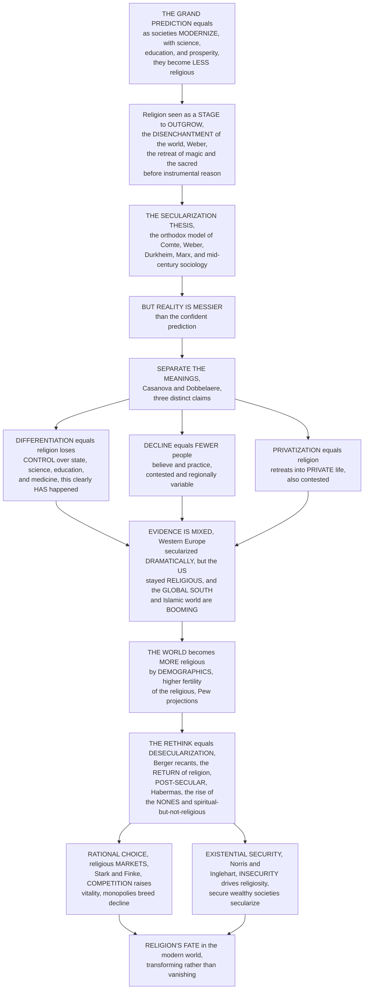

# 🌗 Secularization and the Sociology of Belief

> [!abstract] TL;DR
> For most of the twentieth century social scientists were confident of a grand prediction: as societies **modernize** — with science, education, prosperity, and technology — they will *inevitably* become **less religious**, because religion is a stage humanity would outgrow amid Weber's **"disenchantment of the world."** This is the **secularization thesis**, and reality turned out far messier than the prediction. The thesis actually bundles three distinct claims that must be separated: **differentiation** (religion loses control over the state, science, education, medicine — clearly *has* happened in the West), **decline** (fewer people believe and practice — true in much of Western Europe, the "exceptional case"), and **privatization** (religion retreats from public life into the private sphere). The evidence is regionally divergent: **Western Europe secularized dramatically** (empty churches, plummeting belief), the **United States stayed stubbornly religious** despite being ultra-modern, and the **Global South and Islamic world are booming** — so the world *as a whole* is becoming **more religious, not less**, by sheer demographics (higher fertility of the religious — Pew projections). This forced a major rethink: Peter Berger's famous **recantation** and talk of **desecularization**, Casanova's **"public religions"** and the **return** of religion, Habermas's **"post-secular"** age, and the rise of the **"nones"** (the unaffiliated — growing, but *not* the same as atheists) and the **"spiritual but not religious."** Two rival theories now compete to explain the patterns: **rational-choice / religious-economies** theory (Stark, Finke, Iannaccone — competitive religious *markets* are more vital, explaining America versus Europe's lazy state monopolies) and **existential-security** theory (Norris & Inglehart — people in secure, wealthy, egalitarian societies feel less *need* for religion). The mature verdict: **differentiation is real, but simple decline is not universal** — secularization is *one possible trajectory among several*, context-dependent and even reversible, and religion is **transforming rather than vanishing**. Secularization is one of the central questions about religion's fate in modernity, and a cautionary tale about confident predictions of religion's demise.

---

## Intuition

**Analogy:** Imagine a group of very smart weather forecasters, a century ago, all confidently predicting the same thing: *"As the century goes on, it will keep getting warmer and drier everywhere — the age of storms is over."* Their logic seems airtight; the trend in their own city really is warming. So they announce it as a law of nature. Then the century actually unfolds — and the picture is a mess. Their city *did* get warmer and drier, dramatically so. But the city across the ocean stayed stormy. Whole regions of the planet got *wetter* and wilder than ever. And because the stormy regions had far more people being born, the *global* amount of rain went **up**, not down. The forecasters weren't simply wrong — they had mistaken **their own local experience for a universal law**, and they had bundled several different things ("warmer," "drier," "fewer storms") into one confident word.

That is almost exactly the story of the **secularization thesis** — the single biggest debate in the modern study of religion. The "forecasters" were the founding social scientists (Comte, Marx, Freud, Durkheim, Weber) and mid-century sociology, and their law was: **modernity dissolves religion.** As science explains the thunder, as the state runs the schools and hospitals the church used to run, as cities and factories and universities spread, people would stop believing; Weber called the endpoint the *"disenchantment of the world"* (**Entzauberung**) — the steady retreat of magic, mystery, and the sacred before cold instrumental reason. The prediction felt inevitable. But here is the load-bearing insight that beginners miss: the word "secularization" secretly means **three different things**, and they don't rise or fall together. It can mean **differentiation** — religion losing its *grip on other spheres* (the state, science, medicine, law becoming independent of the church), which has clearly and irreversibly happened across the modern West. It can mean **decline** — individual *belief and practice* fading, which happened spectacularly in Western Europe but *not* in the modern United States, and *not at all* across most of Africa, Latin America, and the Islamic world. And it can mean **privatization** — religion being pushed *out of public life* into a private hobby, which the loud return of religion to politics has repeatedly falsified. Once you separate the three, the "mess" stops looking like a paradox: the West got dramatically *differentiated*, Western Europe *declined*, but the world overall — carried by the higher birth rates of the religious — is becoming **more religious, not less**. So scholars had to rethink everything: Peter Berger, once secularization's most famous champion, publicly *recanted* and coedited a book called *The Desecularization of the World*; Habermas started speaking of a **"post-secular"** age; and a huge, fast-growing new category appeared — the **"nones,"** the religiously *unaffiliated*, who are emphatically **not** all atheists (much of it is "believing without belonging"). Learn secularization and you learn how religion is **mutating rather than disappearing** in the modern world — and you inherit a permanent immunity to confident predictions of religion's death.

---

## How It Works

Secularization is best understood as a **prediction that broke on contact with the evidence, forcing a disciplined rethink**. The logic runs: from the grand modernization-erodes-religion thesis, to the crucial move of *separating its three meanings*, to the regionally divergent evidence and the demographic twist that the world is growing *more* religious, to the revision (desecularization, post-secular, the nones), and finally to the two rival theories that now compete to explain it all. The diagram traces that arc from "the grand prediction" to "religion's fate in modernity."



**The core mechanics of the secularization debate:**

1. **Start with the orthodox thesis.** The classical prediction — the "orthodox model" running from **Comte, Marx, Freud, Durkheim, and Weber** through mid-twentieth-century sociology (**Bryan Wilson**, the early **Peter Berger**) — held that **modernization inevitably erodes religion**. Science, rationalization, industrialization, urbanization, mass education, and pluralism would together cause religion to **decline** and lose social significance. Its most evocative image is Weber's **disenchantment of the world** (*Entzauberung*): the retreat of magic and the sacred before instrumental rationality. Charles Taylor calls the popular version the **"subtraction story"** — modernity as what remains once you subtract religious illusion.
2. **Disentangle what "secularization" even means.** The single most important analytical move (owed to **José Casanova** and **Karel Dobbelaere**) is to *stop treating "secularization" as one thing.* It bundles **(1) differentiation** — the emancipation of secular spheres (state, economy, science, education, law, medicine) from religious control, the **least contested and most clearly true** form; **(2) decline** of individual belief and practice — **contested and regionally variable**; and **(3) privatization** — religion's marginalization from the *public* sphere into private life — **also contested**. Keep separate, too, the **secular**, **secularity**, and **secularism** (a *state's* political stance) from **secularization** (a social *process*).
3. **Confront the great reversal in the evidence.** The empirical reality *broke the simple thesis.* **Western Europe** secularized dramatically (collapsing attendance, belief, and institutional power — the **"European exception"**). The modern **United States** remained persistently religious (the classic counter-case). The **Global South** — Africa, Latin America, Asia (Pentecostalism, Islam) — is exploding with religious vitality. And **demographically**, the higher fertility of religious populations means the world is becoming **more religious in absolute terms** (Pew). Trajectories are diverse and **non-linear**.
4. **Revise the theory.** **Peter Berger** — once secularization's most famous champion — publicly **recanted**: *"the assumption that we live in a secularized world is false."* Scholars now speak of **desecularization**, the **return of religion** to public life (Casanova's **"public religions"**), the **"post-secular"** society (**Habermas**), and **multiple / alternative modernities**. Belief did not vanish so much as **reconfigure**: the rise of the **"nones,"** *believing-without-belonging* (**Grace Davie**), and *spiritual-but-not-religious* seeking.
5. **Adjudicate between rival explanations.** Two theories compete. **Rational-choice / religious-economies** theory (**Stark, Finke, Iannaccone**) argues religious **pluralism and competition increase vitality**, while lazy state **monopolies** breed decline — neatly explaining vibrant, pluralistic America versus monopolistic, secularized Europe. **Existential-security** theory (**Norris & Inglehart**) argues religiosity is driven by **insecurity and vulnerability**, so secure, developed, egalitarian societies secularize while insecure ones stay devout. Defenders of the classical thesis (**Steve Bruce**) hold the line that decline is real and lasting.

---

## Key Concepts

### 🟢 Secondary — the basic idea

- **The big prediction.** For a long time, smart people thought that as countries got **more modern** — more science, schools, wealth, technology — people would slowly **stop being religious**. Religion was seen as something humanity would *grow out of.* That prediction is called the **secularization thesis**.
- **"Disenchantment."** The sociologist **Max Weber** said modern life would strip the world of magic and mystery, leaving only cold facts and machines. He called this the **disenchantment of the world** — a world where nothing is holy or magical anymore, just explainable.
- **It turned out messier.** The prediction was **partly right and partly very wrong.** In **Western Europe**, churches really did empty out. But in the **United States** — a super-modern country — lots of people stayed religious. And in **Africa, Latin America, and the Muslim world**, religion is *growing fast.*
- **The world is getting MORE religious, not less.** Here is the surprise: because deeply religious families tend to have **more children**, the *total number* of religious people on Earth is going **up**, not down.
- **Three things hidden in one word.** "Secularization" secretly means three different things: (1) religion **losing control** over things like government and schools; (2) **fewer people believing**; and (3) religion becoming a **private** thing you don't talk about in public. They don't all happen together.
- **The "nones."** A fast-growing group ticks **"no religion"** on surveys. But careful — the **nones are not all atheists.** Many still believe in *something*; they just don't belong to a church. Others call themselves **"spiritual but not religious."**

### 🟡 Undergraduate — the thesis, the distinctions, and the evidence

- **The orthodox model and its ancestors.** The classical secularization thesis descends from the founders of social science — **Auguste Comte** (his "law of three stages," religion giving way to science), **Karl Marx** (religion as the "opium of the people," dissolving with class society), **Sigmund Freud** (religion as an illusion humanity would mature past), **Émile Durkheim**, and above all **Max Weber** (**rationalization** and **disenchantment**) — and was systematized by mid-century sociologists like **Bryan Wilson** and the **early Peter Berger** (*The Sacred Canopy*, 1967). These founders also shaped the whole framing of *Theories_of_the_Origin_of_Religion*.
- **The three meanings you must separate.** Following **Casanova** and **Dobbelaere**, secularization splits into: (1) **Differentiation** — the *institutional autonomy* of secular spheres (state, science, law, medicine, education) from religious authority. **This is the strong, largely uncontested claim** — modern medicine is not run by priests. (2) **Decline** of individual *belief and practice.* **Contested** — true for Western Europe, false for the US and much of the Global South. (3) **Privatization** — religion pushed *out of public life.* Also **contested**, and repeatedly falsified by religion's return to politics.
- **Secular, secularity, secularism.** Distinguish the **process** (secularization) from the **condition** (secularity — a "secular age"), from the **political doctrine** (secularism — the state's principled separation from, or neutrality among, religions). A society can be highly secular *and* have a formally religious state, or be devoutly religious under a strictly secular constitution (link *Religion_Politics_and_the_State*).
- **The "European exception."** Western Europe is the empirical heartland of decline — plunging church attendance, weak belief, and collapsed institutional power. For much of the twentieth century scholars mistook **Europe for the world**; in fact Europe may be the **exception**, not the rule (Davie's phrase). Its "believing without belonging" (people keep vague belief while abandoning churches) is itself a distinctive pattern, not simple atheism.
- **The American and Global-South counter-cases.** The **United States** — modern, wealthy, educated — stayed among the most religious rich nations, the standing refutation of "modernity dissolves faith." Meanwhile **Pentecostalism** in Latin America and Africa, resurgent **Islam**, and Asian religious growth make the **Global South** the demographic and spiritual center of gravity of world religion.
- **The demographic twist.** Because religious populations have **higher fertility** and religion transmits across generations, **Pew** projections show the religiously affiliated *growing* as a share of the world through mid-century, even as some individual societies secularize. Per-society decline and global growth are **compatible** once you think demographically.
- **Believing without belonging, and its mirror.** **Grace Davie's** "believing without belonging" (Britain: residual belief, empty pews) has a mirror image — **"belonging without believing"** (attending for identity or community without firm faith) — showing that *belief* and *practice* and *affiliation* can each move independently.

### 🔴 Graduate — the revision, the rival theories, and the critique

- **Berger's recantation and desecularization.** The most dramatic reversal in the field: **Peter Berger**, author of the classic secularization statement, renounced it — *"the assumption that we live in a secularized world is false... the world today is as furiously religious as it ever was"* — and edited *The Desecularization of the World* (1999). This crystallized the "**return of religion**" as a research program.
- **Casanova's "public religions."** **José Casanova** (*Public Religions in the Modern World*, 1994) made the decisive analytic cut: accept **differentiation** as the valid core of secularization, but **reject the privatization thesis.** Religions can accept the autonomy of secular spheres yet **"deprivatize"** — re-entering public life (Solidarity in Poland, the US religious right, liberation theology, political Islam) *without* dissolving modernity. Differentiation ≠ privatization ≠ decline.
- **The post-secular turn.** **Jürgen Habermas**, an heir of the Enlightenment, argued that secular liberal societies must now recognize themselves as **"post-secular"** — religion has *not* faded, so public reason must translate and engage religious contributions rather than exclude them. Coupled with **Shmuel Eisenstadt's "multiple modernities,"** this dissolves the assumption that there is one modernity with one (secular) destination.
- **Rational-choice / religious-economies theory.** **Rodney Stark, Roger Finke, and Laurence Iannaccone** invert the classical logic. Model religion as a **market**: religious **pluralism and competition** raise total participation (many energetic "firms" serving diverse "demand"), while state-supported **monopolies** breed complacent clergy and lazy, low-participation religion. This "**supply-side**" theory elegantly explains **vibrant, deregulated America versus monopolistic, declining Europe** — and is dramatized in this note's Python demo (panel b). Critics dispute the pluralism-participation correlation empirically.
- **Existential-security theory.** **Pippa Norris & Ronald Inglehart** (*Sacred and Secular*, 2004) offer the leading rival: religiosity is a **response to existential insecurity** (vulnerability to poverty, disease, disaster, violence). As societies grow **secure, wealthy, and egalitarian** (welfare states, low infant mortality), the felt *need* for religion falls and they secularize; insecure societies stay devout. Crucially, they add the **demographic corollary**: because secure secular societies have **low fertility** and insecure religious ones have **high fertility**, the **world overall grows more religious** even as rich societies secularize — reconciling the two "halves" of the evidence.
- **The enduring defense.** **Steve Bruce** (*God Is Dead*, 2002; *Secularization*, 2011) mounts the sophisticated case that decline in the West is **real, deep, and irreversible**, that America is slowly following, and that the counter-examples are overstated — keeping the classical thesis alive as a serious contender rather than a refuted relic.
- **The ethnocentrism critique.** A recurring charge: the classical thesis **universalized a specifically Western European experience**, smuggling a Protestant-secular teleology into "modernity" as such. **Talal Asad** (*Formations of the Secular*) goes further — the "secular" and "religion" are themselves **historically constructed categories**, so the very framing of a religion-versus-secular contest is a product of Western modernity, not a neutral yardstick (link *Defining_Religion_and_the_Sacred*).
- **The new sociology of nonreligion.** Attention has shifted to studying **unbelief itself** — atheism, agnosticism, humanism, and the diverse **"nones"** — as *positive* phenomena with their own cultures and trajectories, alongside **re-enchantment** and **implicit / secular "religions"** (sport, nationalism, consumerism, wellness) where the sacred **reconfigures** rather than evaporates.

---

## Python Demo

```python
# Secularization and the sociology of belief, in two empirical-style pictures:
#
#   (a) MODERNIZATION vs RELIGIOSITY + EXISTENTIAL SECURITY.
#       We test the secularization thesis "cross-nationally". Each dot is a
#       synthetic "country" with a DEVELOPMENT / security index (0..1). The
#       core Norris-Inglehart pattern: religiosity FALLS as existential
#       security rises -> a clear NEGATIVE trend (Western Europe secularizes).
#       BUT we plant striking OUTLIERS: the United States (high development,
#       high religiosity) and a cluster of poor, high-religiosity nations.
#       Then the demographic twist: religious countries have HIGHER fertility,
#       so we compute the population-WEIGHTED global religiosity over time and
#       show it RISING even while the average society secularizes.
#
#   (b) THE RELIGIOUS MARKET (rational choice) vs THE GROWTH OF THE "NONES".
#       Left: supply-side theory -- plot total religious PARTICIPATION against
#       market PLURALISM; a competitive market of many suppliers yields higher
#       participation than a state MONOPOLY (US vitality vs European decline).
#       Right: model the rise of the unaffiliated across generational cohorts
#       via declining transmission -> an S-shaped growth of the "nones",
#       while noting most nones are NOT atheists ("believing without belonging").
#
# All numbers are conceptual teaching heuristics, not real measurements.

import numpy as np
import matplotlib
matplotlib.use("Agg")
import matplotlib.pyplot as plt

rng = np.random.default_rng(42)

# ======================================================================
# (a) MODERNIZATION / SECURITY  vs  RELIGIOSITY   (+ demographic twist)
# ======================================================================
N = 80
security = rng.uniform(0.05, 0.98, N)                 # development / existential security
# Norris-Inglehart baseline: religiosity falls with security (logistic-ish)
base = 0.92 / (1.0 + np.exp(8.0 * (security - 0.45)))
religiosity = np.clip(base + rng.normal(0, 0.06, N), 0.02, 0.99)

# Plant the famous OUTLIER: the modern-but-religious United States
security = np.append(security, 0.90)
religiosity = np.append(religiosity, 0.72)
labels = [""] * N + ["United States"]

# Fertility rises with religiosity (key to the demographic twist)
fertility = 1.4 + 2.6 * religiosity                   # children per "country" unit

# Population-weighted GLOBAL religiosity projected over generations:
# religious (high-fertility) share compounds faster than secular share.
gens = np.arange(0, 6)
pop = np.ones_like(religiosity)                        # start equal-weight
global_relig = []
for g in gens:
    w = pop / pop.sum()
    global_relig.append(np.sum(w * religiosity))       # weighted world religiosity
    pop = pop * (fertility / 2.0)                       # 2.0 = replacement baseline

# ======================================================================
# (b1) RELIGIOUS MARKET: participation vs pluralism (rational choice)
# ======================================================================
pluralism = np.linspace(0.0, 1.0, 100)                 # 0 = monopoly, 1 = fully competitive
# supply-side: competition raises participation, saturating at high pluralism
participation = 0.25 + 0.55 * (1.0 - np.exp(-3.2 * pluralism))
europe = (0.08, 0.28, "Europe\n(state monopoly)")
usa    = (0.93, 0.72, "United States\n(open market)")

# ======================================================================
# (b2) GROWTH OF THE "NONES" across cohorts (declining transmission)
# ======================================================================
cohorts = np.arange(1930, 2011, 10)                    # birth decades
t = (cohorts - 1930) / (2010 - 1930)
nones = 0.04 + 0.46 / (1.0 + np.exp(-7.5 * (t - 0.55)))   # S-curve rise
atheist_share = 0.28                                    # of nones who are truly atheist
atheists = nones * atheist_share                        # the rest "believe w/o belonging"

# ======================================================================
# Plot
# ======================================================================
fig = plt.figure(figsize=(16, 9.5))

# ---- (a) scatter: security vs religiosity ----------------------------
ax1 = fig.add_subplot(2, 2, 1)
ax1.scatter(security[:N], religiosity[:N], s=45, c=religiosity[:N],
            cmap="coolwarm_r", edgecolor="k", lw=0.3, zorder=3)
ax1.scatter(security[N], religiosity[N], s=170, marker="*",
            color="#f59e0b", edgecolor="k", lw=0.8, zorder=4)
ax1.annotate("United States\n(modern yet religious:\nthe counter-case)",
             (security[N], religiosity[N]), xytext=(0.45, 0.86),
             fontsize=8, color="#b45309",
             arrowprops=dict(arrowstyle="->", color="#b45309"))
# trend curve
xs = np.linspace(0.05, 0.98, 100)
ax1.plot(xs, 0.92 / (1.0 + np.exp(8.0 * (xs - 0.45))),
         "k--", lw=1.5, label="existential-security trend")
ax1.text(0.06, 0.12, "poor / insecure:\nhigh religiosity\n(Global South)",
         fontsize=7.5, color="#7f1d1d")
ax1.text(0.62, 0.10, "secure / wealthy:\nsecularized\n(W. Europe)",
         fontsize=7.5, color="#1e3a8a")
ax1.set_xlabel("existential security / development index  (0 - 1)")
ax1.set_ylabel("religiosity (belief + attendance)")
ax1.set_title("(a) The secularization trend AND its outliers:\n"
              "religiosity falls with security, but the US defies it", fontsize=10)
ax1.legend(loc="upper right", fontsize=7.5)
ax1.set_xlim(0, 1); ax1.set_ylim(0, 1)

# ---- demographic twist: global religiosity RISES ---------------------
ax2 = fig.add_subplot(2, 2, 2)
ax2.plot(gens, global_relig, "o-", color="#16a34a", lw=2.2, ms=7)
ax2.set_xlabel("generations forward")
ax2.set_ylabel("population-weighted WORLD religiosity")
ax2.set_title("(a') The demographic twist: per-society decline,\n"
              "but the WORLD grows more religious (higher fertility)", fontsize=10)
ax2.annotate("religious populations\nout-reproduce secular ones",
             (gens[3], global_relig[3]), xytext=(0.7, 0.35),
             textcoords="axes fraction", fontsize=8, color="#166534",
             arrowprops=dict(arrowstyle="->", color="#166534"))
ax2.grid(alpha=0.25)

# ---- (b1) religious market: participation vs pluralism ---------------
ax3 = fig.add_subplot(2, 2, 3)
ax3.plot(pluralism, participation, color="#7c3aed", lw=2.4,
         label="rational-choice supply-side curve")
for px, py, lbl in (europe, usa):
    ax3.scatter(px, py, s=150, edgecolor="k", zorder=4,
                color="#f59e0b" if "United" in lbl else "#334155")
    ax3.annotate(lbl, (px, py), xytext=(px, py + 0.10),
                 ha="center", fontsize=8)
ax3.set_xlabel("religious-market PLURALISM  (monopoly -> competition)")
ax3.set_ylabel("total religious participation")
ax3.set_title("(b) Religious economies: competition raises vitality;\n"
              "monopoly breeds decline (US vs Europe)", fontsize=10)
ax3.set_xlim(0, 1); ax3.set_ylim(0, 1)
ax3.legend(loc="lower right", fontsize=7.5)
ax3.grid(alpha=0.2)

# ---- (b2) rise of the "nones" ----------------------------------------
ax4 = fig.add_subplot(2, 2, 4)
ax4.fill_between(cohorts, 0, atheists, color="#1e3a8a", alpha=0.85,
                 label='convinced atheists')
ax4.fill_between(cohorts, atheists, nones, color="#60a5fa", alpha=0.75,
                 label='"nones" who still believe\n(believing w/o belonging)')
ax4.plot(cohorts, nones, "o-", color="#0c4a6e", lw=2, ms=4)
ax4.set_xlabel("birth cohort (decade)")
ax4.set_ylabel('share religiously UNAFFILIATED ("nones")')
ax4.set_title('(b′) Rise of the "nones" by cohort:\n'
              "most are NOT atheists", fontsize=10)
ax4.legend(loc="upper left", fontsize=7.5)
ax4.set_ylim(0, 0.6)
ax4.grid(alpha=0.2)

plt.tight_layout()
plt.savefig("secularization_and_the_sociology_of_belief.png", dpi=120,
            bbox_inches="tight")
plt.show()

# ---- Console summary --------------------------------------------------
print("=" * 70)
print("(a) SECURITY vs RELIGIOSITY  -- negative trend + the US outlier")
print("=" * 70)
r = np.corrcoef(security[:N], religiosity[:N])[0, 1]
print(f"  corr(security, religiosity) across societies = {r:+.2f}  (strong negative)")
print(f"  United States: security={security[N]:.2f}, religiosity={religiosity[N]:.2f}"
      f"  <- defies the trend")
print("\n  Population-weighted WORLD religiosity over generations:")
for g, gr in zip(gens, global_relig):
    bar = "#" * int(round(gr * 50))
    print(f"    gen {g}:  {gr:5.3f}  {bar}")
print("  -> per-society SECULARIZATION coexists with a MORE religious WORLD.")

print("\n" + "=" * 70)
print("(b) THE NONES  -- growth by cohort, and how many are truly atheist")
print("=" * 70)
for c, n, a in zip(cohorts, nones, atheists):
    print(f"  born {c}s:  nones={n*100:4.1f}%   of which atheist={a*100:4.1f}%"
          f"   believing-without-belonging={ (n-a)*100:4.1f}%")
```

**What the figure teaches.** Panel (a) turns the secularization *debate* into a scatter you can read. Across "countries," religiosity really does **fall as existential security rises** (the Norris–Inglehart trend, dashed) — that is Western Europe secularizing. But the deliberately planted **United States** star sits high-development *and* high-religiosity, the standing counter-case that broke the simple thesis, while a cluster of poor, insecure "countries" stays devout. Panel (a′) delivers the twist that reconciles the mess: because **religious societies out-reproduce secular ones**, the *population-weighted* religiosity of the **world climbs** even as the average society secularizes — per-society decline and a more-religious planet are **compatible**. Panel (b) stages the leading rival theory: the **rational-choice / religious-economies** curve shows total participation *rising with market pluralism*, with **monopolistic Europe** low and the **open American market** high — the supply-side explanation for the transatlantic gap. Panel (b′) models the fast-growing **"nones"** as an S-curve driven by weakening generational transmission — and crucially splits the band to show that **most nones are not atheists**: the majority are "believing without belonging." Together the four panels deliver the section's thesis: secularization is **real but partial, regional, and non-linear** — religion is **transforming rather than vanishing**, and confident single-track predictions of its demise were mistaking one region's experience for a law of history.

---

## Real-World Applications

- **Reading global politics correctly.** The classical thesis led Western analysts to be repeatedly **blindsided** by religion's public force — the **1979 Iranian Revolution**, the rise of the American religious right, Solidarity's Catholic mobilization in Poland, Hindu nationalism, and global political Islam. Recognizing **desecularization** and **public religions** (Casanova) is now essential for diplomacy, intelligence, and area studies (link *Religion_Politics_and_the_State*, *Fundamentalism_and_Religious_Revival*).
- **Demographic and policy forecasting.** **Pew Research's** global projections — that the unaffiliated *shrink* as a share of the world while Muslims and Christians grow, driven by **fertility and age structure** — reshape planning for education, migration, integration, and religious accommodation, and depend directly on the security-fertility-religiosity logic of the demo (link *Globalization_and_Social_Change*).
- **Understanding the "spiritual marketplace."** Rational-choice / religious-economies theory informs how movements, denominations, and **new religious movements** actually compete for adherents — deregulated, pluralistic "markets" favoring high-commitment, high-tension groups over complacent establishments (link *New_Religious_Movements_and_Alternative_Spirituality*, *Digital_Religion_and_Contemporary_Spirituality*).
- **Surveying belief and unbelief.** The mismatch between **affiliation, belief, and practice** (believing-without-belonging; the heterogeneous "nones") forces careful questionnaire design in the census, the World Values Survey, and Pew — you cannot infer atheism from an empty pew or a "no religion" box.
- **Framing the science-and-religion relationship.** Weber's **disenchantment** and Taylor's "subtraction story" are the backdrop to how modern societies negotiate authority between scientific and religious worldviews — but the persistence of belief among the educated shows disenchantment is **incomplete and contested** (link *Religion_and_Science*).
- **Managing religion in public institutions.** Distinguishing **secularization** (a social process), **secularity** (a cultural condition), and **secularism** (a state doctrine) is directly load-bearing when courts, schools, hospitals, and legislatures design policies on accommodation, chaplaincy, and religious exemption in diverse societies.

---

## Common Pitfalls

- **Treating "secularization" as one thing.** The commonest and most consequential error. **Differentiation** (spheres becoming autonomous), **decline** (fewer believers), and **privatization** (religion going private) are *distinct* and move *independently*. The West clearly differentiated; Western Europe declined; privatization was repeatedly falsified. Conflating them produces the false impression that the whole thesis stands or falls together.
- **Mistaking Western Europe for the world.** Generalizing from the **"European exception"** universalized one region's dramatic decline into a law of modernity. The United States, the Global South, and the Islamic world show that modernization does **not** entail decline — the sample was ethnocentrically narrow.
- **Reading per-society decline as global decline.** Even where individual societies secularize, the **higher fertility** of religious populations means the **world is becoming more religious in absolute terms**. Ignoring demography turns a real local trend into a false planetary one.
- **Equating "nones" with atheists.** The religiously **unaffiliated** are mostly **not** convinced atheists; much is **"believing without belonging"** or **"spiritual but not religious."** Treating rising nonaffiliation as rising atheism badly misreads what is actually changing (belonging and institutions), not necessarily belief.
- **Assuming secularization is irreversible and one-directional.** Berger's recantation, desecularization, and religious revivals show trajectories can **stall, reverse, or diverge**. Secularization is *one possible path among several*, context-dependent — not an escalator with a single destination.
- **Confusing the state's secularism with a society's secularity.** A constitutionally **secular** state (France, India, the US) can sit atop a **devoutly religious** society, and an established church can coexist with mass unbelief (England). The *political-legal* stance and the *sociological* condition are different variables.
- **Picking one rival theory as the whole truth.** **Religious-economies** (supply-side competition) and **existential-security** (demand-side vulnerability) each explain part of the pattern and each face empirical challenges. Dogmatically championing one — or the classical decline thesis, or its wholesale rejection — ignores that the evidence is genuinely mixed and regionally contingent.

---

## Related Concepts

- [[Religion_Sacred_and_Secular]] — the Sociology vault's sociology-of-religion note (Durkheim's solidarity, Weber's Protestant ethic, Marx's false consciousness, and the religious-economy model); this note is the deep dive on its **secularization** strand — cross-link both ways.
- [[The_Enlightenment]] — the historical engine of secularization: the eighteenth-century turn to reason, critique of clerical authority, and the intellectual roots of "religion as a stage to outgrow" that the thesis universalized.
- [[The_Scientific_Revolution]] — the rise of mechanistic, law-governed nature that underwrote Weber's **disenchantment** and the "subtraction story" of modernity this note interrogates.
- [[Nietzsche]] — *"God is dead"*: the philosophical announcement of secularization's cultural core — the collapse of religion's taken-for-granted authority — and the nihilism modernity must then confront.
- [[Faith_and_Reason]] — the long negotiation of revealed faith with autonomous reason that modernity intensifies; secularization is one possible outcome of that tension, not its inevitable terminus.
- [[Defining_Religion_and_the_Sacred]] — what exactly is the "religion" that is said to decline or persist; Asad's critique that "religion" and "the secular" are co-constructed categories complicates the whole debate.
- [[Theories_of_the_Origin_of_Religion]] — the founders (Comte, Marx, Freud, Durkheim, Weber) whose accounts of religion's *origin* also framed their confident predictions of its *modern fate*.
- [[Globalization_and_Social_Change]] — the modernization, development, and global-integration processes whose uneven spread produces the divergent secularization trajectories mapped here.

---

## Review Questions

**🟢 Secondary.** In your own words, state the **secularization thesis** — what it predicted would happen to religion as societies modernize. Then explain, with one real region as an example each, why the thesis looks **right** in some places and **wrong** in others. Finally, explain why the **"nones"** are not simply the same as **atheists**.

**🟡 Undergraduate.** Casanova argues that "secularization" bundles three distinct claims — **differentiation**, **decline**, and **privatization**. Define each, and say which one he thinks is the valid core of the thesis and which he rejects. Then use the contrast between **Western Europe** and the **United States** to explain why a single global prediction of "modernity dissolves religion" fails, and describe the **demographic** reason the *world* can grow more religious even as some societies secularize.

**🔴 Graduate.** Two rival theories compete to explain cross-national religiosity: the **rational-choice / religious-economies** model (Stark, Finke, Iannaccone) and the **existential-security** model (Norris & Inglehart). Reconstruct the core mechanism of each and the key evidence each marshals (the US-vs-Europe gap; the security-fertility-religiosity link). Then, taking account of Berger's recantation, Casanova's "public religions," the ethnocentrism critique (Asad), and Bruce's defense of the classical thesis, defend a position: is "secularization" best understood as a **false universal law**, a **valid-but-partial process (differentiation only)**, or **one context-dependent trajectory among several** — and what does your answer imply for predicting religion's global future?

---

## Sources

- Charles Taylor, *A Secular Age* (Harvard University Press, 2007) — the landmark philosophical history of how Western "conditions of belief" changed, and the critique of the "subtraction story" of secularization.
- Peter L. Berger (ed.), *The Desecularization of the World: Resurgent Religion and World Politics* (Eerdmans, 1999) — the famous recantation and the case that the modern world is "as furiously religious as ever."
- Pippa Norris & Ronald Inglehart, *Sacred and Secular: Religion and Politics Worldwide* (2nd ed., Cambridge University Press, 2011) — the existential-security theory and the global evidence, including the demographic reconciliation.
- José Casanova, *Public Religions in the Modern World* (University of Chicago Press, 1994) — the decisive disaggregation of secularization into differentiation, decline, and privatization, and the "deprivatization" thesis.
- Steve Bruce, *Secularization: In Defence of an Unfashionable Theory* (Oxford University Press, 2011) — the leading sophisticated defense of the classical secularization thesis.

---

#religious-studies #secularization #disenchantment #post-secular #sociology-of-belief
