# 📱 Digital Religion and Contemporary Spirituality

> [!abstract] TL;DR
> Religion has **always** ridden the newest communication technology — from the **oral word**, to **writing** and scripture, to the **printing press** that powered the **Reformation**, to **radio and TV evangelism**. Now it is the **internet's** turn, and **digital religion** is transforming how *billions* practice, encounter, and think about faith — far beyond mere "religion websites." People now **pray via apps**, attend **livestreamed services** and **virtual church** (which exploded during **COVID-19**), take **online pilgrimages**, consult **digital scriptures**, join faith communities on **social media**, and follow **religious YouTubers and "TikTok imams."** The founding scholarly distinction (Christopher **Helland**) separates **"religion ONLINE"** — using digital media to deliver *information about* offline religion, like a church's official website or a livestream — from **"ONLINE religion"** — religious *practice actually happening IN digital space*, like a virtual ritual or an online-only community. The internet reshapes faith along four axes. It **democratizes and fragments religious AUTHORITY**: because anyone can now broadcast, traditional **gatekeepers** (clergy, official institutions) lose their monopoly on interpretation, new **digital authorities** (influencers, self-appointed teachers, online fatwa sites) rise, and believers can **shop, compare, question, and dissent** more easily — the "priesthood of all bloggers." It enables new **COMMUNITY** unbound by geography (global online congregations and "networked religion") but also **fragmentation and echo chambers**. It accelerates the individualistic, **"pick-and-mix,"** **"spiritual but not religious"** (SBNR) turn — the **seeker** curating a bespoke spirituality from a global digital *buffet* of traditions, apps, and content, blurring the line between religion, **wellness**, self-help, and consumerism (Headspace, Calm, online astrology, "WitchTok"). And it raises hard **questions and harms**: it spreads religious **misinformation and extremism**, it **datafies and commodifies** the sacred, and it forces the perennial puzzle — can a ritual over **Zoom** be "real"? Is a **digital Quran** sacred? What happens to **presence and transcendence** when the sacred is mediated by **screens and algorithms**? Digital religion and contemporary spirituality are how we study the **sacred being reshaped by the defining technology of our age** — the newest chapter in the ancient relationship between religion and media.

---

## Intuition

**Analogy:** Picture the sacred as a message that every generation has to *re-broadcast* using whatever the loudest technology of its day happens to be. In the beginning the only "channel" was the **human voice** — myths and prayers carried mouth-to-ear around a fire. Then came **writing**, and the sacred could be *frozen into scripture* and carried across centuries. Then came the **printing press** — and it was no accident that the very first thing it mass-produced was the Bible, and that cheap printed pamphlets and vernacular Bibles are what let Martin Luther's ideas jump the walls of the church and ignite the **Reformation** (a media revolution as much as a theological one). Then **radio and television** arrived, and within a decade the "televangelist" beaming into living rooms became a new kind of preacher with a congregation of millions he had never met. Each time, the *same* pattern repeats: a new medium appears, religion adopts it, and in adopting it religion is subtly *changed* — who gets to speak, who listens, what counts as "being there," and what feels sacred all shift. Now it is the **internet's** turn, the most participatory medium yet built, and the shift is the most dramatic of all.

That is **digital religion** — the study of how faith and digital media (the internet, social platforms, apps, gaming, VR) *co-shape each other*. The load-bearing first insight, from Christopher **Helland**, is a two-word distinction you must not skip: **"religion online"** versus **"online religion."** *Religion online* is just using the net as a **billboard** — a mosque's website, a livestreamed Mass, a PDF of the Torah: the practice still lives offline; the internet only carries **information about it.** *Online religion* is when the practice itself **moves into the wires** — a ritual performed in a virtual world, a prayer said through an app, an online-only congregation with no physical building. The second insight is what the internet's *participatory* nature does to **authority**. Old media were **broadcast**: a few clergy and institutions spoke, and a huge congregation listened — one-to-many, with interpretation tightly controlled by **gatekeepers.** The net is **many-to-many**: *anyone* can produce religious content, so authority **fragments** across a long tail of influencers, forum moderators, and self-appointed teachers — the "priesthood of all bloggers" — and the ordinary believer, now able to **shop, compare, and question**, is empowered as never before. That same freedom fuels the third shift: the rise of the **seeker** who assembles a **"pick-and-mix," "spiritual but not religious"** faith from a global buffet — a meditation app here, an astrology feed there, a manifestation TikTok, a bit of Buddhism, a wellness podcast — the sacred blurring into wellbeing and consumerism. And it comes with a dark side (extremism, misinformation, datafied and commodified faith) and a philosophical vertigo: when the sacred is **mediated by screens and algorithms**, is a **Zoom ritual** *really* a ritual, is a **digital Quran** *really* sacred, and what happens to **presence** itself? Learn digital religion and you learn how the oldest human impulse is being rewired by the newest human technology.

---

## How It Works

Digital religion is best understood as the **latest turn of an ancient wheel**: religion adopts each new communication medium, and the medium reshapes the religion. The logic runs from that long media history, to the internet as the current frontier and its concrete new *forms*, to the pivotal **online-versus-online** distinction, and then to the three great transformations — **authority** democratizing and fragmenting, **community** reconfiguring, and the individualized **spiritual-but-not-religious** turn accelerating — before arriving at the new harms and the deep question of what becomes of **the sacred** when it is mediated by networks and algorithms.

```mermaid
graph TD
    MEDIA["RELIGION ALWAYS ADOPTS the newest MEDIA,<br/>the oral word, then WRITING and scripture,<br/>then the PRINTING press and the REFORMATION,<br/>then RADIO and TV evangelism"]
    NET["NOW THE INTERNET, this equals DIGITAL RELIGION,<br/>transforming how billions practice and encounter faith"]
    FORMS["FAR BEYOND WEBSITES, this equals prayer APPS,<br/>virtual church and LIVESTREAMS that exploded in COVID,<br/>online PILGRIMAGE, faith communities on social media,<br/>plus TikTok imams and religious YouTubers"]
    DISTINCT["SCHOLARS DISTINGUISH, Helland,<br/>religion ONLINE, information ABOUT offline religion,<br/>VERSUS online RELIGION, practice IN digital space"]
    AUTH["THE INTERNET DEMOCRATIZES AUTHORITY,<br/>gatekeepers lose their monopoly,<br/>new influencers and self-appointed teachers rise,<br/>believers can shop, compare, and question"]
    COMM["NEW COMMUNITY unbound by GEOGRAPHY,<br/>global online congregations and networked religion,<br/>but also fragmentation and ECHO CHAMBERS"]
    SBNR["ACCELERATES the individualized turn,<br/>PICK-AND-MIX, SPIRITUAL BUT NOT RELIGIOUS,<br/>seekers curating a bespoke spirituality from a buffet"]
    HARM["SPREADS MISINFORMATION and EXTREMISM,<br/>and DATAFIES and commodifies the sacred"]
    QUEST["NEW QUESTIONS, is a ZOOM ritual real,<br/>is a DIGITAL QURAN sacred,<br/>what happens to presence and transcendence"]
    SACRED["THE SACRED RESHAPED by the defining<br/>TECHNOLOGY of our age, the newest chapter<br/>in the ancient bond of religion and media"]

    MEDIA --> NET
    NET --> FORMS
    FORMS --> DISTINCT
    DISTINCT --> AUTH
    AUTH --> COMM
    COMM --> SBNR
    SBNR --> HARM
    HARM --> QUEST
    QUEST --> SACRED
```



**The core mechanics of digital religion:**

1. **Start with the long view — religion and media.** Religion has a *perennial entanglement with communication technology.* Every major medium restructured faith: the **oral word** (memory, recitation, the living voice), **writing** (scripture becomes fixed, portable, canonical), the **printing press** (cheap vernacular Bibles and pamphlets that *powered the Reformation* and broke the clerical monopoly on the text), and **radio, film, and TV** (mass evangelism, the "electronic church," the televangelist). Scholars call this the **"religious-social shaping of technology"** (Heidi **Campbell**) and the **"mediatization of religion"** (Stig **Hjarvard**) — faith and media *mutually shape* each other, and the digital internet is simply the **current frontier**.
2. **Define the field and its forms.** **Digital religion** studies how religion and digital media (internet, social media, apps, gaming, VR, AI) *intersect and co-shape.* Its concrete forms are now everywhere: **online worship and livestreamed services** (and the **COVID-19 acceleration** that forced "Zoom church" on nearly every tradition at once), **prayer and scripture apps**, **online pilgrimage** and sacred-space simulation, **religious social media** (faith influencers, "TikTok imams," devotional YouTube), **virtual-world and gaming religion**, **digital scriptures and AI**, and **online communities and forums**.
3. **Grasp the pivotal distinction — "religion online" vs "online religion."** Christopher **Helland's** foundational cut: **religion ONLINE** uses digital media to *provide information about, or access to, offline religion* — an official website, a directory, a streamed sermon (the practice still lives offline). **ONLINE religion** is *religious practice occurring IN digital space* — a virtual ritual, cyber-worship, an online-only community, a prayer completed inside an app. The boundary is porous and increasingly blurred, but it remains the field's organizing question: is the digital a *channel* for religion, or a *place* where religion happens?
4. **Track the transformation of authority — the gatekeepers disrupted.** This is the deepest change. Old media were **broadcast/hierarchical**: a few clergy and institutions spoke, a passive congregation received, and **interpretation was controlled** (one-to-many). Digital media are **networked** (**many-to-many**): *anyone can produce religious content*, so authority **democratizes and fragments** across a long tail of **influencers, bloggers, forum admins, self-appointed teachers, and online fatwa / Q&A sites** — the "**priesthood of all bloggers.**" The clerical **monopoly on broadcast and interpretation collapses**, new **digital authorities** rise, and the **individual believer is empowered** to shop, compare, question, and dissent — a tension between *traditional* and *networked* authority that every tradition is now negotiating.
5. **See how community and practice reconfigure.** Digital media create **new forms of belonging** unbound by geography — global online congregations and Campbell's **"networked religion"** — but the *same* mechanism drives **fragmentation and echo chambers** (believers self-sorting into niche communities). Digital **identity and self-presentation** become part of religious life. And **practice itself** is thrown into question: the **"is a mediated/virtual ritual authentic?"** debate turns on **presence, embodiment, and the sacred experienced through screens and algorithms** — a Communion you cannot taste, a congregation you cannot touch.
6. **Watch the individualized sacred accelerate.** Digital media supercharge the pre-existing move toward **individualized religion**: the **"spiritual but not religious"** (SBNR), Grace **Davie's** *"believing without belonging,"** and **"pick-and-mix" / bricolage** spirituality — the **seeker** assembling a bespoke faith from a global **buffet** of traditions, practices, apps, and content. A booming digital **"spiritual marketplace"** (meditation and wellness apps like **Headspace** and **Calm**, online **astrology and tarot**, **manifestation** culture and **"WitchTok"**, therapeutic wellness) **sacralizes the self and wellbeing** and blurs religion into self-help and consumerism.
7. **Confront the harms and the deep question.** The darker dimensions: religious **misinformation, extremism, and radicalization** online; the **datafication and commodification** of the sacred (attention harvested, faith monetized, content shaped by **algorithms**); **digital divides** in access; and the **authenticity/sacrality** puzzles (is a digital Quran or Torah sacred? can rituals be virtual?). Beneath all of it sits the defining question of the field: what happens to **the sacred, presence, and transcendence** when they are mediated by screens, networks, and — increasingly — **AI and the metaverse**?

---

## Key Concepts

### 🟢 Secondary — the basic idea

- **Religion follows the technology.** Every time humans invent a big new way to communicate — talking, writing, printing, radio, TV — religion **starts using it**. The **printing press** helped spread the **Reformation** because it made cheap Bibles; **TV** gave us famous preachers beamed into homes. Now the **internet** is doing the same thing, and we call it **digital religion.**
- **It is way more than websites.** People now **pray using apps**, watch **church online** (which got huge during the **COVID-19** lockdowns when buildings closed), go on **virtual pilgrimages**, join faith groups on **social media**, and follow **religious influencers** on YouTube and TikTok.
- **Two kinds of digital religion.** Scholars split it in two. **"Religion online"** is using the internet to give *information about* real-world religion — like a church's website. **"Online religion"** is when the religion actually *happens on the internet* — like a prayer or ritual done inside an app or a virtual world.
- **Anyone can be a teacher now.** In the old days only official priests and leaders could reach big audiences. Online, **anyone can post**, so lots of new voices (influencers, self-taught teachers) become popular, and ordinary believers can **compare, question, and pick** for themselves.
- **"Spiritual but not religious."** Many people today don't follow one single religion. Instead they **mix and match** — a meditation app, some astrology, a bit of yoga, an inspiring video — building their *own personal* spirituality. This is often called **"spiritual but not religious."**
- **New puzzles.** Digital religion also raises tricky questions: **Is praying together over Zoom "real"?** Is a **Quran on a phone** as holy as a printed one? And the internet can also spread **religious lies and hate**, not just faith.

### 🟡 Undergraduate — the field, the distinction, and the transformations

- **The mediatization of religion.** Faith and media *co-shape* each other. Heidi **Campbell's** **"religious-social shaping of technology"** shows that communities don't just passively receive a new medium — they **negotiate, adapt, and re-shape** it to fit their values (e.g., ultra-Orthodox "kosher phones," Amish selective adoption). Stig **Hjarvard's** **"mediatization"** thesis argues media have become so central that religion increasingly **operates on media's terms** — its logics, formats, and celebrity.
- **Helland's distinction, and its blurring.** **Religion online** (information *about* offline faith) vs **online religion** (practice *in* digital space) is the field's founding move. But the boundary is now **porous**: a livestreamed service (seemingly "religion online") becomes "online religion" when a dispersed congregation prays together in the **live chat**; a scripture app is informational until it *replaces* the physical book in daily devotion.
- **The COVID-19 acceleration.** The pandemic was a **natural experiment** in digital religion: overnight, nearly every tradition moved worship online — "**Zoom church,**" livestreamed Mass, virtual Passover Seders, online Friday prayers — igniting fierce debates about whether **remote sacraments and rituals are valid** (can you receive Communion or be baptized over video?), and permanently **normalizing** hybrid worship afterward.
- **The forms of digital religion.** Prayer and scripture **apps** (Hallow, Muslim Pro, YouVersion Bible), **online pilgrimage** and sacred-space simulation, **faith influencers** and "TikTok imams," devotional **YouTube**, religion in **virtual worlds and games**, and vast **online communities/forums** where believers (and doubters) gather across continents.
- **Democratized and fragmented authority.** The core sociological claim: digital media move religion from **broadcast** (few speak, controlled interpretation) to **networked** (many speak). Traditional **gatekeepers** lose their **monopoly**; new **digital authorities** — influencers, self-appointed teachers, online fatwa councils — rise; and believers gain **exit and voice** (easy to compare traditions, question doctrine, or leave). This is empowering *and* destabilizing, and it links directly to the rise of **new religious movements** and seeker spirituality.
- **Networked community — connection and fragmentation.** Digital religion enables **geographically unbound** congregations and belonging (Campbell's **"networked religion"**), but the *same* self-sorting dynamics produce **echo chambers** and splintering into ever-narrower communities — the "connection versus fragmentation" paradox of all social media.
- **The individualized sacred.** The digital **spiritual marketplace** accelerates **SBNR**, **believing without belonging**, and **bricolage** faith: the **seeker** curates a personal belief-portfolio from a global menu. Wellness apps (**Headspace, Calm**), **online astrology/tarot**, **manifestation** and **"WitchTok"** sacralize *the self and wellbeing*, blurring religion, therapy, self-help, and consumerism.

### 🔴 Graduate — theory, authenticity, and the frontier

- **"Networked religion" as a theoretical model.** Campbell characterizes digital religion by five traits: **networked community** (relationships over institutions), **storied identities** (believers narrate the self across platforms), **shifting authority** (contested, multiple, negotiated), **convergent practice** (blending offline and online ritual), and a **multisite reality** (the religious life spread across physical and digital spaces at once). This reframes digital religion not as a *separate* sphere but as **religion lived across a continuous online-offline field.**
- **The authority problem, formalized.** The shift is from a **hierarchical, low-entropy** attention distribution (a handful of clergy command nearly all religious attention) to a **networked, heavy-tailed** distribution (a long tail of micro-authorities). The result is not the *end* of authority but its **redistribution and contestation**: institutions retain *legitimacy* while losing *reach*, and new actors gain *reach* while lacking *legitimacy* — a persistent legitimacy-versus-reach gap. This note's Python demo models exactly this **fall in authority concentration** (panel a).
- **The authenticity and presence debate.** Can a **mediated ritual** be a *real* ritual? Positions range from **substitution skepticism** (embodiment, co-presence, and the physical sacred cannot be transmitted through a screen — a virtual Eucharist is not a Eucharist) to **mediation optimism** (all religion has *always* been mediated — by voice, text, icon, temple — so digital mediation is a difference of degree, not kind). The debate turns on theories of **presence** (Hoover, Campbell), **ritual efficacy**, and the **material/embodied** dimension of the sacred.
- **The datafication and commodification of the sacred.** Religious life is increasingly **datafied** — prayer streaks, meditation minutes, engagement metrics — and **commodified** by platforms whose **algorithms** optimize for attention, not salvation. This raises critical questions about **surveillance**, the **platformization** of faith, spiritual practice as **content and product**, and the outsourcing of religious *curation* to recommender systems that may **radicalize** or **narrow** as readily as they edify.
- **Misinformation, extremism, and the dark web of belief.** The same networked openness that democratizes faith also **super-spreads** religious misinformation, conspiracy (e.g., religiously inflected QAnon), sectarian incitement, and **online radicalization** — with recruitment, propaganda, and community-building for extremist movements running on the very platforms that host mainstream devotion.
- **Digital divides and access.** "Digital religion" is not universal: **who** has connectivity, devices, literacy, and language access shapes *whose* religion goes online and *whose* voices dominate — reproducing and sometimes widening existing inequalities of geography, class, age, and gender within religious life.
- **The AI and metaverse frontier.** Emerging questions push the field further: **AI chatbots** trained on scripture that answer theological questions or "confess" users; **robot priests** and automated blessings; **generative AI** producing sermons, devotional images, and "sacred" text; and **VR/metaverse** worship spaces. Each intensifies the core puzzle — the status of **presence, authorship, authority, and the sacred** when the mediator is not a human but a **model**.
- **The re-enchantment counter-thesis.** Against a simple "digital = secularizing" reading, many scholars see digital culture **re-enchanting** the world: algorithmic "synchronicities," manifestation and magical thinking online, the sacralization of wellness, and the ritual intensity of fandoms and online communities all suggest the sacred is **migrating and reconfiguring**, not disappearing — a digital-age echo of the secularization debate.

---

## Python Demo

```python
# Digital religion in two conceptual pictures:
#
#   (a) THE COLLAPSE OF THE GATEKEEPERS -- authority DECENTRALIZATION.
#       Old media were BROADCAST: a few clergy/institutions held almost
#       all religious attention (one-to-many, controlled interpretation).
#       Digital media are NETWORKED (many-to-many): anyone can produce
#       content, so authority fragments across a LONG TAIL of influencers,
#       forums and self-appointed teachers. We plot the attention
#       distribution in each regime, then show the authority-CONCENTRATION
#       index (a Gini of who commands attention) FALLING across media eras
#       while the NUMBER of distinct "authorities" explodes.
#
#   (b) THE SEEKER'S "PICK-AND-MIX" SPIRITUAL MARKETPLACE.
#       Left: with a menu of n traditions/practices online, the number of
#       distinct BESPOKE spiritualities a seeker could assemble grows
#       COMBINATORIALLY (2**n - 1 nonempty portfolios) -> a combinatorial
#       explosion of individualized faith. Right: across birth cohorts,
#       single-tradition adherence DECLINES while pick-and-mix / spiritual-
#       but-not-religious RISES -- the individualized sacred.
#
# All numbers are conceptual teaching heuristics, not real measurements.

import numpy as np
import matplotlib
matplotlib.use("Agg")
import matplotlib.pyplot as plt

rng = np.random.default_rng(7)

def gini(x):
    """Gini coefficient of a nonnegative attention/share vector."""
    x = np.sort(np.asarray(x, dtype=float))
    n = x.size
    idx = np.arange(1, n + 1)
    return (2.0 * np.sum(idx * x)) / (n * x.sum()) - (n + 1) / n

# ======================================================================
# (a) ATTENTION DISTRIBUTION: broadcast (gatekeepers) vs networked
# ======================================================================
R = 500
rank = np.arange(1, R + 1)

# Broadcast era: near winner-take-all -> a handful of clergy/institutions
# hold nearly all religious attention (steep exponential fall-off).
att_broadcast = np.exp(-rank / 3.0)
att_broadcast /= att_broadcast.sum()

# Networked era: Zipf-like heavy tail -> a long tail of micro-authorities
# (many small producers still command real, non-zero attention).
att_network = rank ** (-1.05)
att_network /= att_network.sum()

g_broad = gini(att_broadcast)
g_net = gini(att_network)

# ======================================================================
# (a') AUTHORITY CONCENTRATION falling across media eras
# ======================================================================
eras = ["Print /\nBroadcast", "Early\nWeb", "Social\nMedia"]
concentration = np.array([0.96, 0.86, 0.70])          # Gini of attention
n_authorities = np.array([1e1, 1e4, 1e7])             # distinct "authorities"

# ======================================================================
# (b) COMBINATORIAL EXPLOSION of bespoke spiritualities
# ======================================================================
n_menu = np.arange(2, 21)                             # size of the online "buffet"
bespoke = 2.0 ** n_menu - 1                           # nonempty belief-portfolios

# ======================================================================
# (b') DECLINE of single-tradition adherence, RISE of pick-and-mix / SBNR
# ======================================================================
cohorts = np.arange(1960, 2021, 10)
t = (cohorts - 1960) / (2020 - 1960)
single = np.clip(0.82 - 0.45 / (1.0 + np.exp(-7.0 * (t - 0.55))), 0, 1)  # one tradition
sbnr = np.clip(0.08 + 0.42 / (1.0 + np.exp(-7.0 * (t - 0.55))), 0, 1)    # pick-and-mix
other = np.clip(1.0 - single - sbnr, 0, 1)                                # unaffiliated/other

# ======================================================================
# Plot
# ======================================================================
fig = plt.figure(figsize=(16, 9.5))

# ---- (a) attention distribution: broadcast vs networked --------------
ax1 = fig.add_subplot(2, 2, 1)
ax1.semilogy(rank, att_broadcast, color="#b91c1c", lw=2.4,
             label=f"BROADCAST (gatekeepers)  Gini={g_broad:.2f}")
ax1.semilogy(rank, att_network, color="#2563eb", lw=2.4,
             label=f"NETWORKED (long tail)  Gini={g_net:.2f}")
ax1.axvspan(1, 8, color="#b91c1c", alpha=0.08)
ax1.text(9, att_broadcast[0] * 0.6, "a handful of\nclergy hold\nnearly all\nattention",
         fontsize=7.5, color="#7f1d1d")
ax1.text(120, att_network[120] * 3, "long tail of\nmicro-authorities\n(influencers,\nforums)",
         fontsize=7.5, color="#1e3a8a")
ax1.set_xlabel("authority rank (1 = most-attended)")
ax1.set_ylabel("share of religious attention (log)")
ax1.set_title("(a) Gatekeeper collapse: broadcast concentration\n"
              "gives way to a networked long tail", fontsize=10)
ax1.legend(loc="upper right", fontsize=8)

# ---- (a') authority concentration falling across eras ----------------
ax2 = fig.add_subplot(2, 2, 2)
bars = ax2.bar(eras, concentration, color=["#b91c1c", "#d97706", "#2563eb"],
               alpha=0.85, edgecolor="k", lw=0.5)
ax2.set_ylabel("authority CONCENTRATION (Gini)", color="#7f1d1d")
ax2.set_ylim(0, 1.05)
ax2.set_title("(a') Authority democratizes & fragments:\n"
              "concentration falls, number of voices explodes", fontsize=10)
for b, c in zip(bars, concentration):
    ax2.text(b.get_x() + b.get_width() / 2, c + 0.02, f"{c:.2f}",
             ha="center", fontsize=9, color="#7f1d1d")
ax2b = ax2.twinx()
ax2b.plot(eras, n_authorities, "o-", color="#16a34a", lw=2.4, ms=9)
ax2b.set_yscale("log")
ax2b.set_ylabel("number of distinct authorities (log)", color="#166534")
ax2b.tick_params(axis="y", labelcolor="#166534")

# ---- (b) combinatorial explosion of bespoke spiritualities -----------
ax3 = fig.add_subplot(2, 2, 3)
ax3.semilogy(n_menu, bespoke, "o-", color="#7c3aed", lw=2.4, ms=5)
ax3.set_xlabel("size of the online 'buffet' (traditions / practices available)")
ax3.set_ylabel("distinct bespoke spiritualities (log)")
ax3.set_title("(b) Pick-and-mix: distinct personal spiritualities\n"
              "grow combinatorially with the menu (2**n - 1)", fontsize=10)
ax3.annotate("each seeker curates\na near-unique portfolio",
             (n_menu[-6], bespoke[-6]), xytext=(0.08, 0.72),
             textcoords="axes fraction", fontsize=8.5, color="#5b21b6",
             arrowprops=dict(arrowstyle="->", color="#5b21b6"))
ax3.grid(alpha=0.25, which="both")

# ---- (b') decline of single-tradition, rise of SBNR ------------------
ax4 = fig.add_subplot(2, 2, 4)
ax4.stackplot(cohorts, single, sbnr, other,
              labels=["single-tradition adherence",
                      "pick-and-mix / spiritual-but-not-religious",
                      "unaffiliated / other"],
              colors=["#0f766e", "#f59e0b", "#94a3b8"], alpha=0.9)
ax4.set_xlabel("birth cohort")
ax4.set_ylabel("share of population")
ax4.set_title("(b') The individualized sacred: single-tradition\n"
              "adherence declines, pick-and-mix rises", fontsize=10)
ax4.legend(loc="upper center", fontsize=8, framealpha=0.9)
ax4.set_ylim(0, 1)

plt.tight_layout()
plt.savefig("digital_religion_and_contemporary_spirituality.png", dpi=120,
            bbox_inches="tight")
plt.show()

# ---- Console summary --------------------------------------------------
print("=" * 70)
print("(a) AUTHORITY CONCENTRATION: gatekeeper collapse")
print("=" * 70)
print(f"  Broadcast attention Gini = {g_broad:.3f}  (near winner-take-all)")
print(f"  Networked attention Gini = {g_net:.3f}  (long tail of voices)")
print(f"  -> concentration falls by {(g_broad - g_net):.3f}: authority DEMOCRATIZES")
print("\n  Concentration across media eras:")
for e, c, n in zip([s.replace(chr(10), ' ') for s in eras], concentration, n_authorities):
    print(f"    {e:18s} Gini={c:.2f}   authorities~{n:.0e}")

print("\n" + "=" * 70)
print("(b) PICK-AND-MIX: combinatorial explosion of bespoke faiths")
print("=" * 70)
for n in [5, 10, 15, 20]:
    print(f"    menu of {n:2d} practices -> {2**n - 1:,} distinct personal spiritualities")
print("\n  Cohort shift (single-tradition -> pick-and-mix):")
for c, s, m in zip(cohorts, single, sbnr):
    print(f"    born {c}s:  single={s*100:4.1f}%   pick-and-mix/SBNR={m*100:4.1f}%")
```

**What the figure teaches.** Panel (a) turns the *democratization of authority* into a distribution you can read. In the **broadcast** era religious attention is **near winner-take-all** — a handful of clergy and institutions hold almost everything (steep red curve, very high Gini), and interpretation is tightly controlled. In the **networked** era the curve becomes a **heavy-tailed** blue line: the head is lower and a **long tail of micro-authorities** (influencers, forum leaders, "TikTok imams") commands real attention — the **gatekeeper monopoly collapses** and the concentration **Gini falls**. Panel (a′) tracks that fall across three media eras while the **number of distinct authorities explodes** by orders of magnitude (green line, log scale): authority does not *vanish*, it **fragments and multiplies**. Panel (b) dramatizes the **seeker's spiritual marketplace**: with an online **buffet** of `n` practices, the number of distinct **bespoke spiritualities** one could assemble grows as `2**n − 1` — a **combinatorial explosion** that makes near-unique, individualized faith the statistical norm. Panel (b′) shows the demographic correlate: across birth cohorts, **single-tradition adherence declines** while **pick-and-mix / "spiritual but not religious"** rises — the individualized sacred that digital media accelerate. Together the four panels deliver the section's thesis: the internet **redistributes religious authority** (from few to many), **explodes the menu** of available belief, and **shifts believers from inheriting one tradition to curating a personal one** — reshaping who speaks, who belongs, and what the sacred becomes.

---

## Real-World Applications

- **The COVID-19 "Zoom church" shift.** The pandemic forced nearly every tradition online simultaneously — livestreamed Mass and Friday prayers, virtual Passover Seders, Zoom Buddhist meditation — creating a mass real-world test of **online religion**: theological rulings on **remote sacraments** (can Communion, confession, or baptism be valid over video?), permanent normalization of **hybrid worship**, and measurable effects on attendance and giving. It remains the single largest event in the history of digital religion.
- **Prayer and scripture apps at scale.** Apps like **YouVersion Bible** (hundreds of millions of installs), **Hallow** (Catholic prayer), **Muslim Pro** (prayer times, Quran, qibla), and meditation platforms shape *daily* devotional practice for hundreds of millions — while raising the **datafication** questions (streaks, analytics, and in one case the reported sale of location data) that link faith to the **surveillance economy**.
- **Faith influencers and "TikTok imams."** Religious **content creators** — megachurch pastors with YouTube channels, "TikTok imams," devotional Instagram accounts, contemplative podcasters — now command audiences rivaling or exceeding physical congregations, embodying the **democratization and fragmentation of authority** and the new **legitimacy-versus-reach** gap between institutions and influencers.
- **The digital spiritual marketplace / wellness economy.** **Headspace, Calm**, online **astrology** (Co-Star), **tarot**, **manifestation** culture, and **"WitchTok"** monetize a **"spiritual but not religious"** demand, sacralizing wellbeing and self-optimization and blurring the line between religion, therapy, and consumer product — a multibillion-dollar sector built on individualized, pick-and-mix spirituality.
- **Online radicalization and religious misinformation.** Security services, platforms, and researchers track how the same networked openness **super-spreads** sectarian incitement, religiously inflected conspiracy (QAnon), and **extremist recruitment** — making digital religion a live concern for counter-terrorism, content moderation, and interfaith peacebuilding.
- **Virtual pilgrimage and sacred-space simulation.** Virtual tours of **Mecca, Jerusalem, the Vatican, and the Ganges**, VR temple visits, and livestreamed darshan let the housebound, the distant, and the poor participate in **pilgrimage** and **darshan** — extending access while reopening the **authenticity** question of whether a *simulated* sacred space confers the same merit or presence as the physical journey.
- **AI in religious practice.** Deployments now include scripture **chatbots**, AI-generated sermons and devotional art, a German church's experimental **AI-led service**, and "robot priests" — each a real-world stress test of **authority, authorship, and the sacred** when the mediator is a model rather than a human.

---

## Common Pitfalls

- **Reducing digital religion to "religion websites."** The commonest error. Digital religion is not just institutions *putting information online* (**religion online**); it includes **practice actually occurring in digital space** (**online religion**) — virtual ritual, app-based prayer, online-only community — and the two must be kept distinct even as they blur.
- **Assuming the digital simply replaces the physical.** Most believers live a **hybrid, multisite** religious life (Campbell), weaving online and offline together, not migrating wholesale into a "virtual church." Framing it as **substitution** misses the far more common **convergence** of the two.
- **Reading democratized authority as the "end of authority."** Digital media **redistribute and fragment** authority; they do not abolish it. Institutions keep **legitimacy** while losing **reach**; new digital actors gain **reach** while lacking **legitimacy**. The story is *contested, plural* authority — not its disappearance.
- **Treating "spiritual but not religious" as simply irreligion.** SBNR and pick-and-mix seekers are often **intensely engaged** with the sacred — just outside institutions and across traditions. Coding them as "secular" or "nonreligious" misreads a **reconfiguration** of belief as its **absence** (the same trap as equating the "nones" with atheists).
- **Technological determinism in either direction.** The medium does not *by itself* liberate or corrupt religion. Per the **religious-social shaping of technology**, communities **actively negotiate and re-shape** the tech (kosher phones, filtered internet, selective adoption). Both "the internet secularizes everyone" and "the internet will save religion" are naive.
- **Ignoring the digital divide.** "Digital religion" is not everyone's religion. **Connectivity, device, literacy, language, age, and gender gaps** determine *whose* faith goes online and *whose* voices dominate — so generalizing from highly online populations distorts the global picture.
- **Settling the authenticity question too quickly.** Declaring virtual rituals *obviously* fake (ignoring that all religion is *always* mediated) or *obviously* fine (ignoring embodiment and co-presence) both **short-circuit** a genuinely open theological and philosophical debate about **presence, materiality, and the sacred** through screens.
- **Underrating the harms while celebrating access.** The same platforms that democratize devotion also **datafy, commodify, radicalize, and misinform**. A balanced account holds the **empowerment** and the **exploitation/extremism** together, rather than telling only the utopian or only the dystopian story.

---

## Related Concepts

- [[Social_Media_and_Networked_Communication]] — the Media & Communication vault's anatomy of **many-to-many networked communication**; digital religion is what happens when *the sacred* enters that networked, participatory architecture — the engine behind democratized authority and networked religion.
- [[The_Digital_Revolution_and_New_Media]] — the broader shift from **broadcast** to **interactive digital** media; digital religion is one domain-specific instance of this revolution reshaping an institution.
- [[Platforms_Algorithms_and_Curation]] — how **platforms and recommender algorithms** curate attention; the mechanism by which the sacred is now **algorithmically mediated**, monetized, and sometimes radicalized.
- [[Attention_Filter_Bubbles_and_Echo_Chambers]] — the self-sorting dynamics that turn networked community into **echo chambers**; explains the *fragmentation* half of digital religion's community paradox.
- [[Misinformation_Disinformation_and_Fake_News]] — the diffusion of falsehood online; the general case of which **religious misinformation, conspiracy, and radicalization** are a potent instance.
- [[Surveillance_Privacy_and_Datafication]] — the harvesting and monetization of behavioral data; the frame for the **datafication and commodification of the sacred** (prayer streaks, sold location data, faith as content).
- [[Digital_Divide_and_Media_Access]] — structural inequalities in connectivity and access; determines **whose** religion goes digital and whose is left offline.
- [[Digital_Society_and_Online_Communities]] — the Sociology vault's account of **online community formation, identity, and belonging**; the general sociology within which "networked religion" is a special case.
- [[Religion_Sacred_and_Secular]] — the Sociology vault's sociology-of-religion note (Durkheim, Weber, secularization); provides the classical theory of the sacred that digital religion is now transforming.
- [[Online_Social_Networks_and_Platforms]] — the Computational Social Science vault's formal treatment of **online networks and heavy-tailed attention**; the quantitative backbone for modeling the long-tail collapse of religious authority in the demo.
- [[Misinformation_Polarization_and_the_Online_Public_Sphere]] — CSS's study of **online misinformation and polarization**; deepens the harms dimension of digital religion with computational evidence.

---

## Review Questions

**🟢 Secondary.** Using one example each, explain the difference between **"religion online"** (like a church website) and **"online religion"** (like a ritual done inside an app). Then describe **two** ways the internet has changed how people practice faith today — and give **one** reason someone might worry that a **Zoom prayer service** or a **Quran app** isn't the "real thing."

**🟡 Undergraduate.** Historians say each new communication technology — writing, the **printing press**, radio/TV, and now the internet — has reshaped religion. Choose the **printing press and the Reformation** *and* the **internet age**, and explain the *parallel*: in each case, who **lost** their monopoly on religious communication, who **gained** a voice, and what changed for the ordinary believer? Then explain how the internet **democratizes and fragments authority** and how it accelerates the **"spiritual but not religious"** turn.

**🔴 Graduate.** The **authenticity of mediated ritual** is a central debate in digital religion. Reconstruct the strongest case for **substitution skepticism** (a virtual Eucharist is not a Eucharist — embodiment and co-presence cannot be transmitted through a screen) and the strongest case for **mediation optimism** (all religion has *always* been mediated — by voice, text, and icon — so digital mediation is a difference of degree, not kind). Taking account of the **datafication and commodification** of the sacred and the coming **AI/metaverse** frontier, defend a position: is the digital primarily a **channel** for religion, a **place** where religion happens, or a **force** that is remaking the very meaning of the sacred — and what does your answer imply for the future of religious authority and community?

---

## Sources

- Heidi A. Campbell (ed.), *Digital Religion: Understanding Religious Practice in Digital Media* (Routledge, 2013; 2nd ed. 2021) — the field-defining textbook, including the "networked religion" framework and the online-versus-online distinction.
- Heidi A. Campbell, *When Religion Meets New Media* (Routledge, 2010) — the "religious-social shaping of technology" and how communities negotiate and adapt digital media to their values.
- Christopher Helland, "Online Religion / Religion Online and Virtual Communitas," in *Religion on the Internet: Research Prospects and Promises* (JAI Press, 2000) — the foundational "religion online" versus "online religion" distinction.
- Stewart M. Hoover, *Religion in the Media Age* (Routledge, 2006) — mediatization, lived religion, and the shifting locus of religious meaning-making in a media-saturated culture.
- Stig Hjarvard, "The Mediatization of Religion: A Theory of the Media as Agents of Religious Change," *Northern Lights* 6 (2008) — the mediatization thesis applied to religion.

---

#religious-studies #digital-religion #online-religion #spiritual-but-not-religious #religion-and-media
