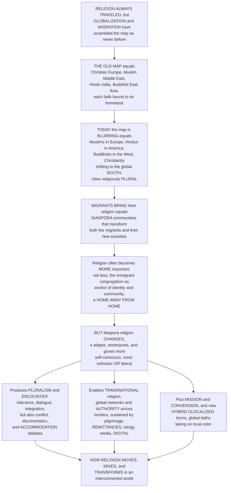

# 🌍 Global Religion, Migration and Diaspora

> [!abstract] TL;DR
> Religion has **always traveled** — carried by traders, missionaries, pilgrims, and conquerors — but **globalization** and **mass migration** have **scrambled the old map of "which religion goes where"** more than at any time in history. For most of the past millennium you could color a world map cleanly by faith: **Christian Europe, Muslim Middle East, Hindu India, Buddhist East Asia**. Today that map is **blurring**: there are more **Muslims in Europe**, **Hindus in America**, and **Buddhists in the West** than ever before; **Christianity's center of gravity has shifted to the global SOUTH** (Africa, Latin America, Asia — Philip Jenkins's "next Christendom"); and nearly every major city has become **religiously PLURAL**, with mosques, temples, churches, and gurdwaras side by side. When people migrate they **bring their religion with them**, creating **DIASPORA** communities that transform *both* the migrants and their new societies. Three dynamics follow. First, religion often becomes **MORE important to migrants, not less** — the **immigrant congregation** is a social and cultural anchor, a "**home away from home**" that supplies identity, community, continuity, and coping in a strange or hostile land. Second, diaspora religion **CHANGES**: cut off from the homeland it **adapts, reinterprets, "congregationalizes"** (US "**de facto congregationalism**"), and becomes either more **self-conscious and orthodox** or, conversely, more **liberal**. Third, migration produces **religious PLURALISM and encounter**, forcing traditions and states to grapple with diversity, tolerance, and integration — and sometimes with **conflict, discrimination (Islamophobia, antisemitism), and hard debates over ACCOMMODATION** (headscarves, mosque-building, "reasonable accommodation," religious law vs secular law). It also enables **TRANSNATIONAL religion** — communities and religious **authority spanning borders** (global Catholicism, the Islamic *ummah*, worldwide Pentecostal and Hindu networks, transnational Sufi orders) knit together by travel, pilgrimage, **remittances**, clergy, media, and now **digital** connection — plus **mission and conversion** in a global religious market and new **hybrid, "glocalized"** forms. Understanding global religion, migration, and diaspora is understanding **how religion moves, mixes, and transforms in an interconnected world** — reshaping the religious map and the religious character of nearly every society on Earth.

---

## Intuition

**Analogy:** Imagine a **world atlas from a century ago**, where every country is shaded a single flat color for its religion — one color for Christian Europe, another for the Muslim belt, another for Hindu India, another for Buddhist East Asia. It looks tidy, permanent, like the physical geography of mountains and coastlines. Now imagine that atlas is not printed on paper but is a **living dye in water**, and someone drops **millions of migrants, jet routes, satellite signals, and wire transfers** into the tank and stirs. The neat blocks of color begin to **bleed into one another**: threads of green (Islam) trail into Europe, saffron (Hinduism) into North America, gold (Buddhism) into California and Berlin; the deepest, brightest patch of Christianity's dye migrates *out* of pale, thinning Europe and blooms across **Africa and Latin America**. And crucially, the dye does not just spread — where it lands it **mixes with the local water** and takes on a new hue. The tidy atlas becomes a **swirling watercolor**, and every big city is now a place where several colors overlap at once.

That swirling tank is the story of **global religion, migration, and diaspora** — how religion **moves, mixes, and transforms** in an interconnected world. The old, clean atlas assumed religion was **territorial**: bounded to its historic homeland. But globalization has **deterritorialized** faith — unbound it from place — while migration physically carries it across borders inside the suitcases and hearts of **immigrants, refugees, and travelers**. And here is the counterintuitive load-bearing insight that beginners miss: when religion travels with a migrant, it usually becomes **more, not less, important**. In a strange land, where the language, the food, the weather, and the faces are all unfamiliar, the **congregation** — the temple, the mosque, the storefront church, the gurdwara — becomes a **home away from home**: it hands back your language, your holidays, your marriage rites, your name for God, a network of people who will find you a job and mourn at your funeral. So diaspora communities often practice **more intensely** and more **self-consciously** than the folks they left behind — even as, cut off from the homeland's institutions, their faith quietly **adapts and reinterprets** itself to fit the new setting (an American Hindu temple that starts holding **Sunday services**, a mosque that runs a **youth basketball league**). Multiply this by millions of people and you get three world-historical effects. You get **pluralism** — the multireligious neighborhood, and with it the whole politics of tolerance, integration, and the ugly friction of **discrimination and "accommodation" fights** over what a woman may wear on her head or whether a minaret may be built. You get **transnational religion** — a single community and even a single religious **authority** stretched across a dozen countries, held together by **remittances, pilgrimage, imported clergy, and WhatsApp**. And you get **hybrids** — global faiths **"glocalizing,"** taking on the color of each place they settle. Learn this and you learn how the sacred behaves in a **mobile, interconnected age** — the theme that runs through this entire vault, from *The_Comparative_Study_of_Religion* to *Secularization_and_the_Sociology_of_Belief*.

---

## How It Works

Global religion is best understood as a **single arc**: religion always moved, but the *scale and speed* of modern globalization and migration have **rescrambled the map**, and the consequences ripple outward from the individual migrant's suitcase to the religious character of whole continents. The logic runs from the **old territorial map**, through its **blurring**, to the **migrant who carries faith across a border**, to the **intensification and transformation** of that faith in the diaspora, and outward to **pluralism, transnational networks, mission, and hybridity**. The diagram traces that arc from "religion always traveled" to "how religion moves, mixes, and transforms."



**The core mechanics of religion in an interconnected world:**

1. **Religion and globalization: deterritorialization.** **Globalization** — the intensifying global flow of **people, capital, media, and ideas** — reshapes religion, and religion in turn is one of globalization's oldest **drivers** (the great "world religions" were the first globalizers, spread by mission and trade). Its signature effect is **deterritorialization**: religions become increasingly **unbound from their historic homelands**, so the traditional religious "map" no longer holds. Peter Beyer analyzes religion as a **global social system** operating alongside the global economy, polity, and media (link *Globalization_and_Social_Change*, *Global_Media_and_Cultural_Imperialism*).
2. **Migration carries and heightens faith.** Human **migration** — of labor migrants, **refugees**, students, and travelers — physically **transports religion** across borders. Counterintuitively, faith frequently becomes **more salient** for migrants: it supplies **identity maintenance**, **community and belonging**, **continuity** with the homeland, and **meaning and coping** in a new or hostile setting. The **immigrant congregation** becomes a social and cultural **anchor** — "a home away from home."
3. **Transformation in the diaspora.** Cut off from the homeland's institutions, transplanted religion **adapts and reinterprets**. In the United States it often **"congregationalizes"** — R. Stephen Warner's **"de facto congregationalism,"** whereby Hindu, Muslim, and Buddhist groups reorganize around a **Protestant-style local congregation** (membership, a lay board, weekend services, a multipurpose building). Diaspora faith can grow more **self-conscious and orthodox** (a sharpened, portable "official" version) *or* more **liberal** — and it changes across the **1st vs 2nd/3rd generation** as children negotiate two worlds.
4. **Diaspora and transnationalism.** **Diaspora** religious communities — dispersed yet maintaining ties to a **homeland and to each other** — extend the ancient **Jewish paradigm** to **Hindu, Sikh, Muslim, Buddhist**, and other dispersions. **Transnationalism** stretches communities, movements, and **religious authority** across borders (global **Catholicism**, the Islamic **ummah**, worldwide **Pentecostal** and Hindu networks, transnational **Sufi** orders), sustained by flows of **people, pilgrimage, money/remittances, media, clergy**, and now **digital** connection.
5. **Pluralism, encounter, and accommodation.** Migration manufactures **religious diversity** and the **encounter of traditions** — the **multireligious neighborhood** and the religiously **plural** city. Societies respond with **tolerance, dialogue, integration, and multiculturalism**, but also with **conflict** (Islamophobia, antisemitism, communal tension) and hard **accommodation debates** in liberal states: the **headscarf/hijab** and religious-dress controversies, **mosque-building** and minarets, **"reasonable accommodation,"** and the collision of **religious law with secular law** (link *Religion_Politics_and_the_State*).
6. **The shifting map, mission, and hybridity.** The great transformations: **Christianity's center of gravity** moves to the **global South** (Jenkins's **"next Christendom"**); the explosive spread of **Pentecostalism** and of **Islam**; **"reverse mission"** (the global South evangelizing the North); the **westward flow** of Asian traditions (**Buddhism, Hinduism, yoga, mindfulness**); and new **syncretic, hybrid, "glocalized"** forms as global faiths take **local shape** (Roland Robertson's *glocalization*), producing new transnational and blended religious identities in the **global city** and the **digital diaspora**.

---

## Key Concepts

### 🟢 Secondary — the basic idea

- **Religion travels with people.** When people **move** to a new country, they **take their religion with them** — their holidays, their prayers, their holy books, their idea of God. Migrants have always done this, but today **so many people are moving** that it is changing the whole world.
- **The old map is blurring.** A long time ago you could point at a map and say "that part is Christian, that part is Muslim, that part is Hindu." Now it is **mixing**: there are more **Muslims in Europe**, **Hindus in America**, and **Buddhists in the West** than ever, and Christianity has grown fastest in **Africa and Latin America**.
- **Religion as "home away from home."** In a strange new country, the **church, mosque, temple, or gurdwara** becomes a place where you meet people who speak your language and share your food and festivals. So for many migrants, religion becomes **more important**, not less — it is a piece of home you can carry.
- **Faith changes when it moves.** Away from the homeland, a religion slowly **adapts**. An American Hindu temple might start holding **Sunday services** like the churches around it. The children of migrants may practice differently from their parents.
- **Cities become religiously mixed.** In one neighborhood today you might find a **mosque, a church, a temple, and a gurdwara on the same street**. Living together brings **friendship and cooperation** — but sometimes also **arguments and unfairness** (for example, fights over whether girls may wear a **headscarf** at school).
- **A "diaspora" is a scattered people.** When a group is **spread out** across many countries but stays connected by religion — like the **Jewish diaspora**, and now Hindu, Sikh, and Muslim diasporas — we call it a diaspora. Money, phone calls, and visits keep them linked across the whole world.

### 🟡 Undergraduate — globalization, diaspora, and pluralism

- **Deterritorialization.** Globalization **detaches** religion from its historic homeland. Faiths that once "belonged" to a region now flow everywhere, so the traditional religious **map dissolves**. Religion is both a **product** of globalization (reshaped by global flows) and one of its oldest **drivers** (the missionary "world religions" globalized long before capitalism did).
- **The heightened religiosity of migrants.** Contrary to the naive expectation that migration secularizes, it often **intensifies** religion. Faith performs concrete work for the newcomer: **identity maintenance** against assimilation, **belonging** in a network of co-religionists, **continuity** with the world left behind, and **meaning/coping** amid dislocation and discrimination. The **immigrant congregation** is the key institution — a mutual-aid society, cultural school, marriage market, and sanctuary rolled into one.
- **De facto congregationalism.** **R. Stephen Warner's** influential thesis: in the American religious ecology, immigrant traditions **reorganize into congregations** on a broadly **Protestant model** — voluntary membership, a lay governing board, a weekend gathering, religious education, a multipurpose building — even when the homeland tradition had **no congregation at all** (temple worship, Sufi lodge, village shrine). Structure adapts to the host society even as content is preserved.
- **Diaspora and the Jewish paradigm.** **Diaspora** originally named the **Jewish dispersion**; scholars now extend it to **Hindu, Sikh, Muslim, Buddhist, Armenian, and Chinese** dispersions. A diaspora keeps a **triadic relationship** — to the **homeland**, to the **host society**, and to **co-ethnics scattered elsewhere** — and religion is often the **thickest thread** binding all three.
- **Transnationalism and its flows.** Beyond one-way migration, **transnational** religion sustains **ongoing cross-border ties**: circulating **clergy and preachers**, **pilgrimage** (the Hajj, Lourdes, the Ganges), **remittances** that fund homeland mosques and temples, imported **media** (satellite TV, cassette sermons, now streaming), and religious **authority** that binds (a Vatican, a marja', a guru) across states. **Peggy Levitt** ("God Needs No Passport") maps these transnational religious lives.
- **Religious pluralism as fact, value, and problem.** Migration makes **diversity** a demographic **fact**; liberal societies then debate it as a **value** (tolerance, dialogue, multiculturalism) and confront it as a **problem** (integration, discrimination, security). The flashpoints are **accommodation**: **headscarf/hijab** bans, **mosque and minaret** disputes, **"reasonable accommodation,"** and clashes between **religious and secular law** (link *Globalization_and_Its_Discontents*).
- **The shifting center of gravity.** The single biggest transformation: **Christianity's demographic core** has moved from **Europe/North America** to the **global South** — **Africa, Latin America, Asia** — Philip Jenkins's **"next Christendom."** Alongside it, **Pentecostalism** and **Islam** spread globally, **"reverse mission"** sends Southern missionaries **North**, and Asian traditions (**Buddhism, Hinduism, yoga, mindfulness**) flow **West** and enter the alternative-spirituality scene of *New_Religious_Movements_and_Alternative_Spirituality*.

### 🔴 Graduate — theory, generation, and the debates

- **Religion in global society (Beyer).** **Peter Beyer** theorizes religion as a **differentiated global system**, a *function system* alongside the global economy, polity, science, and media. Globalization **relativizes** every tradition (each now faces all the others), producing both **liberal/ecumenical** responses that accommodate pluralism and **conservative/fundamentalist** responses that reassert particularity — the twin reactions analyzed in *Fundamentalism_and_Religious_Revival*.
- **Crossing and dwelling (Tweed).** **Thomas Tweed's** theory of religion is built *for* a mobile age: religions are **"confluences of organic-cultural flows"** that intensify **crossing** (movement — of bodies across space, of lives through time, of ultimate horizons) and **dwelling** (making a **home**, mapping and inhabiting space). Diaspora religion is the paradigm case — migrants use ritual to **make a home** while remaining in **motion**, so *movement and place* are the theory's master categories, not static "belief systems."
- **Transnational religion and social remittances (Levitt, Vertovec).** **Peggy Levitt** and **Steven Vertovec** show religious life organized in **transnational social fields**: not migrants who *leave* one religious world for another, but people who **live in both at once**. Beyond money, they circulate **"social remittances"** — ideas, practices, and religious norms flowing **back** to the homeland, so the diaspora can **re-shape** the sending society's religion (reformist Islam, prosperity Pentecostalism, diaspora Hindutva).
- **Segmented assimilation and the second generation.** Generational change is not linear decline. **Segmented assimilation** theory predicts **divergent paths**: some second-generation youth **secularize**, some **retain** a warm ethnic religiosity, and some **sharpen** faith into a portable, self-conscious, often more **orthodox** "**religion**" **detached from ethnicity** (the "born-again" turn to a purified global Islam or global Christianity that the parents' folk practice never had). Religion can thus be a **resource for upward mobility** or a marker of **reactive identity**.
- **Public religions and deprivatization (Casanova).** **José Casanova's** thesis that religion **"deprivatizes"** — re-entering public life rather than retreating — is amplified by migration: diasporas import religiously grounded **public claims** (dress, dietary law, blasphemy, family law) into secular states, forcing renegotiation of the church-state settlement (link *Religion_Politics_and_the_State*, *Secularization_and_the_Sociology_of_Belief*).
- **The next Christendom and world Christianity (Jenkins, Sanneh).** **Philip Jenkins** documents the **Southward shift** of Christianity and its consequences — a **poorer, more charismatic, more literalist, more Pentecostal** global faith whose center is **Lagos, São Paulo, and Manila**, not Rome or Canterbury. **Lamin Sanneh** stresses **translation** and **vernacularization** as Christianity's growth engine: the faith **indigenizes** into each mother tongue and culture — a built-in **glocalization**.
- **Glocalization, hybridity, and syncretism (Robertson).** **Roland Robertson's** **"glocalization"** names the universal pattern: global religions **localize**, absorbing local color, so "global" and "local" are **co-produced**, not opposites. The results range from mild **inculturation** to full **syncretism** and **hybrid** identities — Afro-Caribbean Vodou and Santería, Korean shamanized Christianity, Western Buddhist "mindfulness," and the fluid, mix-and-match spiritualities of the **digital diaspora** (link *Digital_Religion_and_Contemporary_Spirituality*).
- **The critique of "religion" and "the secular."** Following **Talal Asad**, some argue that the very categories — **"religion,"** **"the secular,"** **"the world religions"** — are **historically constructed** artifacts of Western modernity, so mapping global "religions" as discrete, portable units can **misdescribe** the fluid, entangled realities on the ground (link *The_Comparative_Study_of_Religion*).

---

## Python Demo

```python
# Global religion, migration, and diaspora in four pictures:
#
#   (a) THE SHIFTING RELIGIOUS MAP -- Christianity's CENTER OF GRAVITY moves
#       SOUTH. We stackplot the regional SHARES of world Christianity across
#       the 20th-21st centuries: Europe + North America SHRINK from the great
#       majority toward a minority, while Africa, Latin America, and Asia
#       SURGE -- Jenkins's "next Christendom."
#
#   (b) MIGRATION MAKES A SOCIETY PLURAL. A destination society starts nearly
#       religiously HOMOGENEOUS. Migrant inflows plus higher migrant fertility
#       reshape its composition over decades into a PLURAL mix -- a
#       demographic-composition stackplot of the multireligious society.
#
#   (c) DIASPORA RELIGIOUS RETENTION across GENERATIONS. Religiosity is often
#       HIGH / intensified in the 1st generation (religion as identity anchor),
#       then transforms across the 2nd and 3rd -- but not to zero: a portion
#       RETAINS or even re-sharpens faith (segmented assimilation). We plot the
#       assimilation-vs-retention curves and the "identity boost."
#
#   (d) THE TRANSNATIONAL RELIGIOUS NETWORK. A homeland hub linked to diaspora
#       cities and the diaspora cities to each other -- flows of people,
#       remittances, clergy, and media. We plot the network and report its
#       connectivity.
#
# All numbers are conceptual teaching heuristics, not real measurements.

import numpy as np
import matplotlib
matplotlib.use("Agg")
import matplotlib.pyplot as plt

rng = np.random.default_rng(7)

# ======================================================================
# (a) SHIFTING MAP: regional shares of WORLD CHRISTIANITY over time
# ======================================================================
years_c = np.array([1900, 1950, 1970, 1990, 2010, 2025, 2050])
# shares (fractions) -- North/West declines, Global South rises
eur_na   = np.array([0.82, 0.72, 0.60, 0.48, 0.38, 0.32, 0.26])   # Europe + N. America
africa   = np.array([0.02, 0.06, 0.11, 0.18, 0.24, 0.28, 0.33])   # Sub-Saharan Africa
latam    = np.array([0.11, 0.15, 0.19, 0.22, 0.24, 0.25, 0.24])   # Latin America
asia_oc  = np.array([0.05, 0.07, 0.10, 0.12, 0.14, 0.15, 0.17])   # Asia + Oceania
south    = africa + latam + asia_oc                                # the "global South"

# ======================================================================
# (b) MIGRATION makes a DESTINATION SOCIETY religiously PLURAL
# ======================================================================
years_s = np.arange(1960, 2051, 5)
t = (years_s - 1960) / (2050 - 1960)
majority = 0.96 * np.exp(-1.15 * t) + 0.34                          # shrinks, never to zero
muslim   = 0.01 + 0.11 * (1 - np.exp(-2.6 * t))                     # migrant-driven growth
hindu    = 0.002 + 0.028 * (1 - np.exp(-2.2 * t))
buddhist = 0.002 + 0.020 * (1 - np.exp(-2.0 * t))
other    = 0.006 + 0.030 * (1 - np.exp(-1.8 * t))
nones    = 0.02 + 0.24 * t                                          # rising unaffiliated
comp = np.vstack([majority, muslim, hindu, buddhist, other, nones])
comp = comp / comp.sum(axis=0)                                     # normalize to 1

# ======================================================================
# (c) DIASPORA RETENTION across generations (assimilation vs retention)
# ======================================================================
gens = np.array([0, 1, 2, 3])          # 0 = homeland baseline, 1 = 1st gen, ...
homeland_base = 0.70                    # religiosity "back home"
# 1st gen: IDENTITY BOOST above homeland baseline, then decline
first_boost   = np.array([0.70, 0.86, 0.62, 0.45])   # avg / assimilation path
retained_path = np.array([0.70, 0.88, 0.80, 0.74])   # segmented: the re-sharpeners
secular_path  = np.array([0.70, 0.80, 0.45, 0.22])   # the secularizing path

# ======================================================================
# (d) TRANSNATIONAL RELIGIOUS NETWORK (homeland hub + diaspora cities)
# ======================================================================
nodes = {
    "HOMELAND": (0.0, 0.0),
    "London":   (-0.9,  0.6),
    "New York": (-1.0, -0.5),
    "Toronto":  (-0.4, -1.0),
    "Dubai":    ( 0.9, -0.7),
    "Sydney":   ( 1.0,  0.5),
    "Nairobi":  ( 0.3,  1.0),
}
names = list(nodes)
# edges: every diaspora node ties to HOMELAND (hub) + some diaspora-diaspora ties
edges = [(0, i) for i in range(1, len(names))]
edges += [(1, 2), (2, 3), (1, 5), (4, 5), (6, 1), (4, 2)]
# edge weight ~ flow intensity (people + remittances + media)
weights = rng.uniform(0.6, 3.0, len(edges))

# connectivity metric: average degree
deg = np.zeros(len(names))
for a, b in edges:
    deg[a] += 1; deg[b] += 1

# ======================================================================
# Plot
# ======================================================================
fig = plt.figure(figsize=(16, 10))

# ---- (a) center of gravity shifts South --------------------------------
ax1 = fig.add_subplot(2, 2, 1)
ax1.stackplot(years_c, eur_na, latam, africa, asia_oc,
              labels=["Europe + N. America", "Latin America",
                      "Africa", "Asia + Oceania"],
              colors=["#94a3b8", "#f59e0b", "#16a34a", "#7c3aed"], alpha=0.9)
ax1.plot(years_c, south, "k--", lw=2, label="GLOBAL SOUTH total")
ax1.axhline(0.5, color="k", lw=0.7, ls=":")
ax1.annotate("center of gravity\ncrosses SOUTHWARD",
             (1990, 0.5), xytext=(1935, 0.30), fontsize=8.5,
             arrowprops=dict(arrowstyle="->", color="black"))
ax1.set_title("(a) Christianity's CENTER OF GRAVITY shifts to the global SOUTH\n"
              "the 'next Christendom' (Jenkins)", fontsize=10)
ax1.set_xlabel("year"); ax1.set_ylabel("share of world Christianity")
ax1.set_xlim(1900, 2050); ax1.set_ylim(0, 1)
ax1.legend(loc="upper right", fontsize=7.2, ncol=1)

# ---- (b) destination society becomes plural ----------------------------
ax2 = fig.add_subplot(2, 2, 2)
ax2.stackplot(years_s, comp,
              labels=["host majority faith", "Muslim", "Hindu",
                      "Buddhist", "other faiths", 'unaffiliated ("nones")'],
              colors=["#e2e8f0", "#16a34a", "#f59e0b", "#eab308",
                      "#7c3aed", "#60a5fa"], alpha=0.92)
ax2.set_title("(b) MIGRATION makes a society religiously PLURAL\n"
              "from near-homogeneous to the multireligious city", fontsize=10)
ax2.set_xlabel("year"); ax2.set_ylabel("share of population")
ax2.set_xlim(1960, 2050); ax2.set_ylim(0, 1)
ax2.legend(loc="center left", fontsize=7.0)

# ---- (c) diaspora generational retention -------------------------------
ax3 = fig.add_subplot(2, 2, 3)
xt = ["homeland", "1st gen", "2nd gen", "3rd gen"]
ax3.plot(gens, retained_path, "o-", color="#16a34a", lw=2.2, ms=7,
         label="retainers / re-sharpeners (segmented)")
ax3.plot(gens, first_boost, "s--", color="#7c3aed", lw=2.2, ms=6,
         label="average path (identity boost then fade)")
ax3.plot(gens, secular_path, "^:", color="#64748b", lw=2.0, ms=6,
         label="secularizing path")
ax3.axhline(homeland_base, color="k", lw=0.7, ls=":")
ax3.annotate('1st-gen "IDENTITY BOOST"\n(home away from home)',
             (1, 0.86), xytext=(1.15, 0.93), fontsize=8,
             arrowprops=dict(arrowstyle="->", color="#7c3aed"))
ax3.set_title("(c) DIASPORA religiosity across generations:\n"
              "boosted in the 1st gen, then DIVERGENT paths", fontsize=10)
ax3.set_xlabel("generation"); ax3.set_ylabel("religiosity (belief + practice)")
ax3.set_xticks(gens); ax3.set_xticklabels(xt)
ax3.set_ylim(0, 1); ax3.legend(loc="lower left", fontsize=7.2)
ax3.grid(alpha=0.2)

# ---- (d) transnational religious network -------------------------------
ax4 = fig.add_subplot(2, 2, 4)
for (a, b), w in zip(edges, weights):
    xa, ya = nodes[names[a]]; xb, yb = nodes[names[b]]
    hub = (a == 0 or b == 0)
    ax4.plot([xa, xb], [ya, yb], "-",
             color="#f59e0b" if hub else "#94a3b8",
             lw=w, alpha=0.75 if hub else 0.5, zorder=1)
for i, nm in enumerate(names):
    x, y = nodes[nm]
    is_hub = (nm == "HOMELAND")
    ax4.scatter(x, y, s=520 if is_hub else 300,
                color="#b91c1c" if is_hub else "#0ea5e9",
                edgecolor="k", lw=1.0, zorder=3)
    ax4.text(x, y - 0.17, nm, ha="center", fontsize=8,
             fontweight="bold" if is_hub else "normal")
ax4.set_title("(d) TRANSNATIONAL religious network:\n"
              "homeland hub + diaspora cities, flows of people,\n"
              "remittances, clergy, and media", fontsize=10)
ax4.set_xlim(-1.5, 1.5); ax4.set_ylim(-1.5, 1.5)
ax4.axis("off")

plt.tight_layout()
plt.savefig("global_religion_migration_and_diaspora.png", dpi=120,
            bbox_inches="tight")
plt.show()

# ---- Console summary --------------------------------------------------
print("=" * 68)
print("(a) SHIFTING MAP -- share of world Christianity in the global SOUTH")
print("=" * 68)
for y, s in zip(years_c, south):
    bar = "#" * int(round(s * 40))
    print(f"  {y}:  South = {s*100:4.1f}%  {bar}")
cross = years_c[np.argmax(south >= 0.5)]
print(f"  -> the global South becomes the MAJORITY of world Christianity ~ {cross}")

print("\n" + "=" * 68)
print("(b) DESTINATION SOCIETY -- religious composition, first vs last year")
print("=" * 68)
lbls = ["majority", "Muslim", "Hindu", "Buddhist", "other", "nones"]
for i, lb in enumerate(lbls):
    print(f"  {lb:9s}: {comp[i,0]*100:5.1f}%  ->  {comp[i,-1]*100:5.1f}%")
print("  -> a near-homogeneous society becomes religiously PLURAL.")

print("\n" + "=" * 68)
print("(c) DIASPORA -- 1st-generation identity BOOST above homeland baseline")
print("=" * 68)
print(f"  homeland baseline religiosity = {homeland_base:.2f}")
print(f"  1st-generation (avg)          = {first_boost[1]:.2f}   (+{first_boost[1]-homeland_base:.2f} boost)")
print(f"  3rd-gen retainers vs secular  = {retained_path[3]:.2f} vs {secular_path[3]:.2f}  (segmented assimilation)")

print("\n" + "=" * 68)
print("(d) TRANSNATIONAL NETWORK -- connectivity")
print("=" * 68)
print(f"  nodes = {len(names)}, edges = {len(edges)}, avg degree = {deg.mean():.2f}")
print(f"  HOMELAND hub degree = {int(deg[0])}  (ties every diaspora node to the center)")
```

**What the figure teaches.** Panel (a) makes the **scrambled map** literal: the stackplot shows the **share of world Christianity** held by **Europe and North America collapsing** from a dominant majority toward a minority while **Africa, Latin America, and Asia surge**, and the dashed line for the **global South** crossing the 50% mark mid-century — Jenkins's **"next Christendom"** as a picture. Panel (b) runs the **migration-into-a-society** experiment: a nearly **homogeneous** population is reshaped, decade by decade, by **migrant inflows and differential fertility** into a **plural** mix of majority faith, Muslims, Hindus, Buddhists, other traditions, and a rising band of the **unaffiliated** — the demographic birth of the **multireligious city**. Panel (c) captures the **diaspora paradox**: religiosity **jumps above the homeland baseline** in the **first generation** (the "**home away from home**" identity boost), then **diverges** across generations — an **average** path that fades, a **secularizing** path, and a **retaining/re-sharpening** path (segmented assimilation), so the outcome is **not** simple decline. Panel (d) draws the **transnational network** — a **homeland hub** wired to diaspora cities and the cities wired to one another by flows of **people, remittances, clergy, and media** — and reports its **connectivity**, the infrastructure of a **long-distance** religion. Together the four panels deliver the section's thesis: religion in an interconnected world **moves** (a, d), **mixes** (b), and **transforms** (c) — reshaping the religious map and the religious character of nearly every society on Earth.

---

## Real-World Applications

- **Reading the new global religious landscape.** Analysts, journalists, and diplomats now track a map where **Christianity is African and Latin American**, **Islam is European as well as Middle Eastern**, and **Buddhism and Hinduism are Western** — Pew's global projections of migration and fertility are load-bearing for forecasting the religious composition of states (link *Globalization_and_Social_Change*).
- **Integration and accommodation policy.** Governments design (and litigate) rules on **religious dress** (hijab, turban, kippah), **mosque and temple construction**, **halal/kosher provision**, **chaplaincy**, and **religious holidays** — the concrete politics of pluralism, and a recurring source of the backlash traced in *Globalization_and_Its_Discontents* (link *Globalization_and_Its_Discontents*).
- **Diaspora institutions as settlement infrastructure.** The **immigrant congregation** delivers real services — English classes, job networks, elder care, youth programs, legal aid — so refugee resettlement and urban policy increasingly **partner with faith communities** as front-line integration agents.
- **Transnational flows: remittances and religious authority.** **Remittances** fund homeland mosques, temples, and churches; imported **clergy** and **satellite/streaming** preaching shape diaspora belief; and cross-border **religious authority** (a Vatican, a marja', a guru, a Sufi *pir*) coordinates communities across a dozen states — flows that development economists and security services alike now monitor.
- **World Christianity, Pentecostalism, and reverse mission.** The Southward, Pentecostal shift restructures global denominations (Anglican realignment along North-South lines), while **"reverse mission"** — Nigerian, Brazilian, and Korean churches evangelizing **secular Europe** — reshapes the religious life of Northern cities.
- **The global spiritual marketplace.** The **westward** flow of **yoga, mindfulness, and meditation**, and the mix-and-match spiritualities of the **digital diaspora**, feed a transnational "religious economy" of conversion, hybridity, and glocalized practice (link *Global_Media_and_Cultural_Imperialism*).
- **Conflict, security, and cohesion.** Understanding diaspora religion is central to countering **Islamophobia and antisemitism**, defusing **communal tension**, and building interfaith cohesion in plural cities — as well as to distinguishing ordinary devotion from the militant fringe analyzed in *Fundamentalism_and_Religious_Revival*.

---

## Common Pitfalls

- **Assuming migration secularizes.** The naive expectation is that leaving a traditional homeland for a modern city **erodes** faith. The opposite is common: migration **intensifies** religion, because the congregation becomes an **identity anchor and mutual-aid network** in an unfamiliar land. Treating religiosity as automatically declining with mobility badly misreads the data.
- **Freezing diaspora religion as a "pure" transplant.** Transplanted faith is **not** a frozen copy of the homeland's. It **adapts, congregationalizes, and reinterprets** — and the homeland version is *itself* changing. Imagining an unchanging "authentic" original (and judging the diaspora as a degraded copy) misses the two-way, evolving reality of **social remittances**.
- **Reading the second generation as simple decline.** Generational change is **segmented, not linear**: some youth secularize, some retain, and some **re-sharpen** faith into a portable, self-conscious, often more **orthodox** form **detached from ethnicity**. Assuming a smooth slide to unbelief ignores the born-again and revivalist paths.
- **Conflating a religion with an ethnicity or nation.** Diaspora religion and diaspora **ethnicity** overlap but are **not identical** — global Islam, global Pentecostalism, and convert communities deliberately **cut faith loose** from a single homeland. Equating "Muslim" with an ethnic group, or "the diaspora" with one nation, erases converts, minorities, and transnational universalism.
- **Treating accommodation debates as one-sided.** The **headscarf, minaret, and religious-law** controversies pit **genuine competing goods** — religious freedom, gender equality, secular neutrality, social cohesion — against one another. Framing them as simply "bigotry vs faith" (in either direction) flattens a real normative dilemma inside liberal states.
- **Mistaking Western trends for the global story.** Watching only **Western Europe's** decline yields a false "religion is fading" narrative. Globally, migration and fertility make the world **more** religious and its map **more** plural — the action is in the **global South** and its diasporas, not just the secularizing North (link *Secularization_and_the_Sociology_of_Belief*).
- **Ignoring the digital layer.** Diaspora religion today runs on **streaming sermons, WhatsApp fatwa lines, online pilgrimage, and virtual congregations**. Analyzing only brick-and-mortar temples and mosques misses the **digital diaspora** that now sustains long-distance belonging (link *Digital_Religion_and_Contemporary_Spirituality*).

---

## Related Concepts

- [[Migration_and_Diaspora]] — the Sociology vault's core treatment of human migration, diaspora formation, and transnationalism; this note is the **religion-specific** deep dive — how faith is carried, intensified, and transformed in the same flows. Cross-link both ways.
- [[Globalization_and_Social_Change]] — the Sociology account of globalization as the flow of people, capital, media, and ideas; supplies the engine that **deterritorializes** religion and reshapes the global religious map analyzed here.
- [[Globalization_and_Cultural_Change]] — the Anthropology vault's study of how global flows localize and hybridize culture; the ethnographic companion to religious **glocalization, syncretism, and hybridity** in diaspora settings.
- [[Globalization_and_Its_Discontents]] — the Political Science analysis of globalization's backlash; the political frame for **anti-immigrant** and **anti-Muslim** reaction and the state-level **accommodation** and multiculturalism debates.
- [[Religion_Sacred_and_Secular]] — the Sociology-of-religion overview (Durkheim, Weber, Marx, the religious-economy model); this note extends its **globalization and migration** strand into transnational and diaspora religion.
- [[Global_Media_and_Cultural_Imperialism]] — the Media Studies note on global media flows and cultural globalization; the media infrastructure — satellite preaching, streaming, social platforms — that binds the **digital diaspora** and transnational religious networks.

---

## Review Questions

**🟢 Secondary.** Explain, in your own words, why a person who **moves to a new country** might become **more religious**, not less. Give two things the local temple, mosque, church, or gurdwara might do for them. Then explain what it means to say the **religious "map" of the world is blurring**, using one real example (for instance, where Christianity is now growing fastest).

**🟡 Undergraduate.** Define **deterritorialization**, **de facto congregationalism** (Warner), and **transnational religion**, and explain how each helps describe what happens to a faith when its followers migrate. Using the contrast between the **first** and **second/third generations**, explain why diaspora religion should be understood as **transforming** rather than simply **declining** — and describe two concrete **accommodation** disputes that religious pluralism produces in liberal states.

**🔴 Graduate.** Thomas Tweed theorizes religion through **crossing and dwelling**, Peter Beyer through religion as a **global function system**, and Philip Jenkins documents the Southward shift of Christianity. Reconstruct the core claim of each, and use them to analyze a single case (for example, a West African Pentecostal church planted in London, or a Hindu temple network across the American suburbs). Then take a position: does the framework of discrete, portable **"world religions" mapped onto a global grid** adequately capture diaspora religion, or does **Talal Asad's** critique — that "religion" and "the secular" are constructed Western categories — force a different description? Defend your answer with reference to **segmented assimilation**, **social remittances**, and **glocalization**.

---

## Sources

- Peter Beyer, *Religions in Global Society* (Routledge, 2006) — religion theorized as a differentiated global system, and the twin liberal/conservative responses to globalization.
- Philip Jenkins, *The Next Christendom: The Coming of Global Christianity* (3rd ed., Oxford University Press, 2011) — the landmark account of Christianity's demographic shift to the global South.
- Thomas A. Tweed, *Crossing and Dwelling: A Theory of Religion* (Harvard University Press, 2006) — religion as flows of movement and dwelling, built for a diasporic, mobile age.
- R. Stephen Warner & Judith G. Wittner (eds.), *Gatherings in Diaspora: Religious Communities and the New Immigration* (Temple University Press, 1998) — the foundational studies of immigrant congregations and "de facto congregationalism" in the United States.
- Peggy Levitt, *God Needs No Passport: Immigrants and the Changing American Religious Landscape* (The New Press, 2007) — transnational religious lives and how migration is reshaping the religious map.

---

#religious-studies #global-religion #migration #diaspora #transnational-religion
