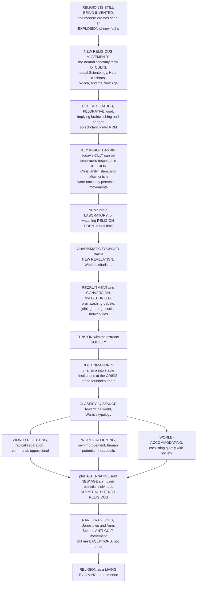

# 🕉️ New Religious Movements and Alternative Spirituality

> [!abstract] TL;DR
> **Religion never stopped being invented.** The modern era has seen an *explosion* of new faiths — and the neutral, scholarly term for what the media and the public loudly call **"cults"** is **New Religious Movements (NRMs)**: everything from **Scientology**, the **Unification Church** ("Moonies"), **ISKCON / Hare Krishna**, **Soka Gakkai**, and the **Nation of Islam** to **Wicca**, Neopaganism, and the diffuse **New Age**. That terminological switch is itself a load-bearing insight: **"cult" is a loaded, pejorative word** (implying brainwashing, danger, and manipulation), and the distinction between a "cult" and a "real religion" is usually about **social acceptance and power, not intrinsic features** — *every* major tradition began as a tiny, marginal, often persecuted new movement (**Christianity, Islam, Buddhism, Mormonism**). This makes NRMs a **natural laboratory for watching religion FORM in real time**: how a **charismatic founder** (Max **Weber**'s *charisma*) claims **new revelation**; how movements **recruit and convert** — *not* through the popular but **debunked "brainwashing" / coercive-mind-control theory**, but through gradual, voluntary **conversion along pre-existing social-network ties** (Lofland & Stark; Stark & Bainbridge); how they manage **tension** with mainstream society; and how, if they are to survive the **crisis of the founder's death**, they must **routinize charisma** into stable institutions. Sociologists classify NRMs by their stance toward the world (**Wallis**): **world-rejecting** (radical separation, communal, oppositional), **world-affirming** (embracing society, self-improvement and human-potential/therapeutic), and **world-accommodating**. Alongside runs the rise of **alternative and "New Age" spirituality** — an eclectic, individualistic **"self-spirituality"** (Heelas) of crystals, astrology, tarot, energy healing, mindfulness, and Goddess/pagan currents — and the broad turn to being **"spiritual but not religious,"** a detraditionalized, consumerist, *pick-and-mix* faith outside institutions. The rare but sensational **tragedies** (Jonestown, Waco/Branch Davidians, Heaven's Gate, the Solar Temple, Aum Shinrikyo's sarin attack) fuel the **anti-cult movement** and a recurring **moral panic** — but they are **exceptions, not the norm**. Understanding new religious movements is understanding religion as a **living, evolving phenomenon**: the ongoing birth, and the modern transformation, of the sacred.

---

## Intuition

**Analogy:** Think of the world's religions the way a venture capitalist thinks of companies. Christianity, Islam, and Buddhism are the trillion-dollar "blue chips" — but they were all once **scrappy startups**: a charismatic founder with a strange new pitch, a handful of early converts recruited through friends and family, ridicule and persecution from the establishment, and terrible odds of survival. Most startups die young. A few break even and stay small forever. A vanishingly rare few become world-spanning institutions. And here is the crucial point the analogy makes vivid: **whether we call a tiny young movement a "cult" or a "religion" has almost nothing to do with its truth or its danger, and almost everything to do with whether it has become big, old, and socially respectable.** The word "cult" is just the label the established players slap on the new entrant they don't like. Today's "cult" is, statistically, mostly a startup that will fail — but occasionally it is tomorrow's Fortune 500 faith.

Now push the analogy into the study of religion. Because most religions we study are ancient — their founders long dead, their revelations frozen into scripture, their institutions fully built — we usually only ever get to study religion as a **finished product**, like a mature corporation whose founding garage is a museum. **New Religious Movements let us watch the founding garage in operation.** We can actually observe a **charismatic founder** claim brand-new revelation and radiate the extraordinary, rule-breaking authority Max **Weber** called **charisma**. We can trace, in real time, exactly *how people join* — and this is where the single biggest myth collapses: the lurid popular theory of **"brainwashing"** or coercive mind-control, of gullible victims zombified against their will, is **rejected by nearly all scholars**. What they find instead is mundane and human: people convert **gradually and voluntarily, through pre-existing friendships and social ties** — you join the group your friend or spouse joined, not because your mind was hijacked. We can watch a movement negotiate its **tension** with the surrounding society, choosing to be **world-rejecting** (build a commune, cut ties, wait for the end) or **world-affirming** (offer stressed professionals a self-improvement seminar). And we can watch the great **make-or-break crisis** every startup and every new religion faces: what happens **when the founder dies?** The movements that survive are the ones that manage to **routinize charisma** — to convert the founder's irreplaceable personal magic into a stable, transmissible institution of offices, texts, and rules. Most cannot, and they vanish. Meanwhile, a quieter revolution runs alongside the movements: the diffuse, individualistic **New Age / alternative spirituality** milieu — the crystals, astrology, mindfulness apps, and energy healing of people who describe themselves as **"spiritual but not religious,"** assembling a private, consumerist faith with no church at all. And yes, a tiny handful of NRMs have ended in horror — Jonestown, Waco, Heaven's Gate, Aum Shinrikyo — and those horrors dominate the headlines and fuel an **anti-cult movement**. But they are the plane crashes, not the flights: the rare, sensational exceptions that make the news precisely because the overwhelming norm is peaceful. Study new religious movements and you stop seeing religion as a set of ancient monuments and start seeing it as what it has always been — a **living, evolving, still-being-invented** human activity.

---

## How It Works

The field of NRM studies is best understood as a **disciplined reframing** followed by a **toolkit of analytic questions**. The reframing swaps the loaded word "cult" for the neutral "NRM" and insists that the cult/religion line is drawn by **social power and acceptance**, not intrinsic evil — after all, every world religion was once a persecuted new movement. That reframing then licenses treating NRMs as a **laboratory** in which four recurring questions can be studied in real time: *who founds them* (charisma and revelation), *how people join* (network conversion, not brainwashing), *how they relate to society* (world-rejecting / affirming / accommodating), and *how they survive the founder* (routinization). Running alongside the movements is the diffuse **New Age / spiritual-but-not-religious** milieu. The diagram traces the arc from "religion is still being invented" to "religion as a living, evolving phenomenon."



**The core mechanics of studying new religious movements:**

1. **Reframe "cult" as "NRM."** The starting move is terminological and it is not cosmetic. In popular and media usage a **"cult"** connotes deception, brainwashing, exploitation, and danger; older sociology used **"sect"** and **"cult"** technically, but the words are now too poisoned to be neutral. Scholars adopt **"New Religious Movement"** — a religion of **recent origin** (mostly nineteenth/twentieth century onward) that is **new and/or nontraditional** within a given society. The critical claim: the "cult"/"religion" boundary tracks **social acceptance, size, age, and power**, not intrinsic features. Christianity, Islam, Buddhism, and Mormonism were all once marginal NRMs.
2. **Treat NRMs as a laboratory.** Because established religions are ancient and finished, they hide their own origins. NRMs expose the machinery of religion *forming* — **revelation, charisma, syncretism, schism, revival, and importation** — making them test cases for general theories of **conversion, organization, and religious change**.
3. **Analyze the founder: charisma and revelation.** Max **Weber** identified **charismatic authority** — legitimacy grounded in a leader's *extraordinary*, rule-breaking personal gifts and claim to **new revelation** — as one of the three pure types of authority (alongside traditional and rational-legal). NRMs are charisma in its raw state.
4. **Analyze joining: conversion, not brainwashing.** The lurid **coercive-mind-control ("brainwashing")** model — championed by the **anti-cult movement** and used to justify coercive **"deprogramming"** — is **rejected by the scholarly mainstream**. The evidence supports **gradual, voluntary conversion through interpersonal bonds**: Lofland & Stark's **process model** and Stark & Bainbridge's finding that people **join movements to which they have pre-existing social ties** (friends, family, spouses). Converts are typically **normal seekers**, not the gullible or pathological.
5. **Analyze the stance toward society.** Roy **Wallis's** typology sorts NRMs by their orientation to the world: **world-rejecting** (oppositional, communal, high-tension — Peoples Temple, Hare Krishna, the Moonies), **world-affirming** (embracing society, offering therapeutic self-improvement and human-potential — est, Transcendental Meditation, Scientology's self-help side), and **world-accommodating** (providing private religious solace while leaving public life largely intact). This overlays the classic **church–sect–cult** organizational continuum.
6. **Analyze survival: routinization.** The founder's death is the **great crisis**. Charisma is by nature unstable and non-transmissible. To persist, a movement must **routinize charisma** — convert the founder's personal magic into **traditional or rational-legal institutions**: offices, canon, doctrine, succession rules. Movements that succeed become **denominations**; those that fail **dissolve**.
7. **Track the diffuse milieu: New Age and alternative spirituality.** Beyond bounded movements lies Colin **Campbell's "cultic milieu"** and Paul **Heelas's New Age** — an eclectic, individualistic **"self-spirituality"** (holism, self-transformation, sacralization of the self) spanning crystals, astrology, tarot, energy healing, channeling, Western Buddhism/yoga, mindfulness, and Wicca/Neopaganism/Goddess spirituality. Its signature is the **"subjective turn"** (Heelas & Woodhead's *spiritual revolution* thesis) and the **"spiritual but not religious"** — detraditionalized, consumerist, *believing without belonging*.
8. **Assess controversy proportionately.** A **tiny minority** of NRMs turned **violent or apocalyptic** (Jonestown, Waco, Heaven's Gate, the Solar Temple, Aum Shinrikyo). These sensational cases drive **anti-cult** and **counter-cult** movements and recurrent **moral panics**. The scholarly balance: most NRMs are **non-violent**, the tragedies are **exceptional**, and understanding *why* a few turn violent (charismatic apocalypticism plus escalating tension and encapsulation) matters more than fearing all.

---

## Key Concepts

### 🟢 Secondary — the basic idea

- **New religions are born all the time.** Religion did not stop being invented thousands of years ago. New ones appear constantly — the modern world has seen *hundreds* of them, from **Scientology** and the **Hare Krishnas** to **Wicca** and the **New Age**.
- **"Cult" is an insult; "NRM" is the fair word.** When people say **"cult"** they usually mean *dangerous, brainwashing, evil*. Scholars avoid that loaded word and say **New Religious Movement (NRM)** instead — a neutral term for a young or unfamiliar religion.
- **Today's "cult" can be tomorrow's respected religion.** Here is the big idea: **Christianity, Islam, and Mormonism were all once tiny, hated, "weird" new movements** that outsiders feared. Whether a group is called a "cult" or a "religion" often just depends on how **big, old, and accepted** it has become.
- **A special founder.** New religions usually start with one magnetic leader who says they have a **brand-new message from God or the universe**. Sociologist Max **Weber** called this special personal power **charisma**.
- **How people really join.** Movies say cults **"brainwash"** people. Scholars have studied this and mostly say that is a **myth**. In reality people **join slowly and by choice, usually because a friend or family member invited them.**
- **The New Age.** Lots of people today mix and match spiritual things they like — **crystals, astrology, tarot, meditation, yoga, energy healing** — without belonging to any church. Many say they are **"spiritual but not religious."**
- **The scary stories are rare.** A few groups ended in tragedy (like **Jonestown**). These are shocking and famous — but they are the **rare exceptions**, not what most new religions are like.

### 🟡 Undergraduate — the field, the founder, and how people join

- **Defining the NRM.** An NRM is a religion of **recent origin** (broadly post-nineteenth/twentieth century) that is **new and/or nontraditional** relative to the host society. The category is huge and diverse: **Scientology**, the **Unification Church**, **ISKCON / Hare Krishna**, **Soka Gakkai**, the **Nation of Islam**, **Raëlism**, **Wicca** and Neopaganism, and countless others. The field's founding move is to **abandon "cult" and "sect"** as pejoratives for the neutral **"NRM"** (link the vault's overview and methods notes).
- **The cult/religion line is about power, not essence.** The most important undergraduate insight: there is **no intrinsic feature** that separates a "cult" from a "religion." The distinction tracks **social acceptance, size, age, respectability, and power**. Since *every* major tradition began as a marginal, often persecuted movement, "cult" is best read as a **social label** applied by dominant groups, not a scientific category.
- **NRMs as a laboratory.** They are analytically precious because they let us observe **religion forming** — origins, revelation, and charisma **in real time** — and serve as **test cases** for theories of conversion, organization, and change. Their sources include **charismatic prophecy / new revelation**, **syncretism** (borrowing across traditions), **schism** (breaking away from a parent body), **revival**, and **importation** (a tradition arriving in a new society).
- **Weber's charisma.** The founder wields **charismatic authority** — legitimacy from *extraordinary* personal qualities and a claim to **new revelation** — which is inherently **unstable**, personal, and revolutionary, standing outside both custom and bureaucracy.
- **The brainwashing debate.** The popular **coercive-mind-control** theory holds that "cults" **brainwash** recruits, justifying the **anti-cult movement** and coercive **"deprogramming."** Scholars **reject** this: controlled studies find **high dropout**, **voluntary entry and exit**, and no evidence of irresistible mind-control. The rival **conversion** model (Lofland & Stark's process model; Stark & Bainbridge) describes a **gradual, voluntary** shift built on **pre-existing social ties** — you join where your **friends and family** already are.
- **Who joins and why.** Not the gullible or mentally ill, but often **ordinary "seekers"** experiencing **deprivation** (material, social, or of *meaning*), a desire for **belonging** and **community**, and, above all, **network availability** — the presence of relational bonds to members. **Disaffiliation** (leaving) is equally common and usually undramatic.
- **Church–sect–cult and Wallis's world-stances.** The classic **church–sect** continuum (low- vs high-tension organizations) is extended by Roy **Wallis** into **world-rejecting** (oppositional, communal), **world-affirming** (society-embracing, therapeutic/self-improvement), and **world-accommodating** NRMs — a map of how a movement positions itself against mainstream society.

### 🔴 Graduate — routinization, the New Age turn, and the violence question

- **Routinization of charisma.** Weber's decisive dynamic: because charismatic authority is **personal and unstable**, a movement faces an **existential crisis at the founder's death** (or the failure of a prophecy). To survive it must **routinize** — transform charisma into **traditional** authority (hereditary or lineage succession, sacred tradition) or **rational-legal** authority (offices, bureaucracy, canon, formal doctrine). Success turns a *movement* into a *denomination*; failure means **dissolution**. This is the demographic knife-edge modeled in the Python demo (link *Religion_and_Social_Order*).
- **Institutionalization and the sect-to-denomination path.** Richard **Niebuhr's** classic observation that high-tension sects tend, across generations, to **lower their tension** and become respectable denominations, and **Rodney Stark & William Bainbridge's** theory of **religious economies** (sect formation via schism, cult formation via innovation/importation, and the perpetual generation of new firms in a religious "market"), formalize how tension and organization co-evolve.
- **The world-affirming turn and the human-potential movement.** Wallis's **world-affirming** type captures a distinctively modern, **therapeutic spirituality** — **est**, **Transcendental Meditation**, **Scientology's** auditing-as-self-improvement — that promises *success, health, and self-actualization within* worldly life rather than rejection of it, blurring the line between religion, therapy, and self-help (link the vault's secularization note on the "spiritual marketplace").
- **The New Age as self-spirituality.** Paul **Heelas** characterizes the **New Age** as **"self-spirituality"**: the sacred is relocated **inside the self**, authority shifts from external tradition to **inner experience**, and the goal is **self-transformation** and **holism**. Colin **Campbell's "cultic milieu"** names the **deviant, seeker-oriented cultural underground** from which such movements continually crystallize and back into which they dissolve.
- **The subjective turn / spiritual revolution.** Heelas & Woodhead's **Kendal Project** advanced the **"spiritual revolution"** thesis: a **"subjective turn"** away from external-authority **religion** ("life-as") toward experiential **spirituality** ("subjective-life") — congregational religion declining while **holistic-milieu** activities (yoga, reiki, mindfulness) grow. This dovetails with **"believing without belonging"** and the **"spiritual but not religious,"** a **detraditionalized, consumerist, pick-and-mix** faith outside institutions (link *Secularization_and_the_Sociology_of_Belief* and the vault's digital-religion note).
- **Alternative spirituality's breadth and gender.** The milieu spans **astrology, tarot, crystals, energy/reiki healing, channeling, reincarnation belief, Western Buddhism and yoga, mindfulness**, and the strongly **female-centered** currents of **Wicca, Neopaganism, and Goddess spirituality** — where the reimagining of the sacred is deeply entangled with **gender** (link the vault's religion-and-gender material).
- **The violence question.** Why do a **tiny minority** of NRMs turn **violent or apocalyptic**? Comparative study of **Jonestown / Peoples Temple** (1978), the **Branch Davidians / Waco** (1993), **the Solar Temple** (1994–97), **Heaven's Gate** (1997), and **Aum Shinrikyo's** Tokyo subway **sarin attack** (1995) points not to "cultness" but to a **combustible interaction**: apocalyptic worldview, charismatic-leader fragility, **encapsulation/isolation**, escalating **tension with and provocation by outsiders** (including, sometimes, state action). Most high-tension NRMs are **non-violent** (link *Religion_Violence_and_Peacebuilding* material).
- **The scholarly conflict and the moral-panic critique.** The field is riven between an **anti-cult / counter-cult** camp (which foregrounds harm and coercion) and scholars accused of being **"cult apologists"** for defending NRMs against **moral panic**. The mature position — argued by **Eileen Barker**, **Lorne Dawson**, and **James Beckford** — is to **study NRMs empirically and neutrally**, taking harm seriously *and* refusing the sensationalist "brainwashing" frame, and to recognize NRMs as vital data on **religious innovation, individualization, and the future of religion**.

---

## Python Demo

```python
# NEW RELIGIOUS MOVEMENTS, in four teaching pictures:
#
#   (a)  NRM LIFE-CYCLE / ROUTINIZATION & SURVIVAL.
#        Simulate the demographic life-cycle of many new movements: a
#        charismatic-founder launch, rapid early growth via conversion,
#        then the CRISIS at the founder's death, where each movement either
#        DISSOLVES (charisma dies with the founder) or successfully
#        ROUTINIZES charisma into an institution & persists. Most fail or
#        stay tiny; a rare few routinize & survive -> the "startup religion".
#
#   (a') THE SIZE DISTRIBUTION of movements is a POWER LAW: a huge number of
#        tiny/failed NRMs, a handful of mid-sized ones, and a vanishingly
#        rare few that become world religions -- a Zipf-style rank-size line.
#
#   (b)  CONVERSION as SOCIAL-NETWORK DIFFUSION, not "brainwashing".
#        Following Stark-Bainbridge, people join through PRE-EXISTING SOCIAL
#        TIES. We spread conversion along the links of a friendship network
#        from a few seed members and compare it with the popular
#        "brainwashing" NULL model (random recruitment of isolated strangers).
#        Network conversion is faster, clustered, and matches the evidence.
#
#   (b') WALLIS'S WORLD-STANCE TYPOLOGY as a 2-D map: stance toward the world
#        (rejecting -> accommodating -> affirming) vs tension with society,
#        with example movements placed on it.
#
# All numbers are conceptual teaching heuristics, not real measurements.

import numpy as np
import matplotlib
matplotlib.use("Agg")
import matplotlib.pyplot as plt

rng = np.random.default_rng(7)

# ======================================================================
# (a) NRM LIFE-CYCLE: growth, founder-death crisis, routinize-or-dissolve
# ======================================================================
years = np.linspace(0, 80, 400)
n_movements = 14
death = rng.uniform(30, 45, n_movements)           # founder dies ~mid-life
# carrying capacity: heavy-tailed -> most movements small, a few large
K = rng.pareto(1.3, n_movements) * 60 + 20
growth = rng.uniform(0.18, 0.35, n_movements)
# bigger, more organized movements are likelier to routinize successfully
p_routinize = np.clip(0.15 + 0.5 * (K / K.max()), 0.15, 0.85)
routinized = rng.random(n_movements) < p_routinize

trajectories = []
for i in range(n_movements):
    # logistic growth toward K while the founder lives
    logistic = K[i] / (1.0 + (K[i] / 2.0 - 1.0) * np.exp(-growth[i] * years))
    traj = np.where(years < death[i], logistic, K[i])
    if not routinized[i]:
        # founder dies, charisma is NOT institutionalized -> exponential decay
        after = years >= death[i]
        traj = traj.copy()
        traj[after] = K[i] * np.exp(-0.16 * (years[after] - death[i]))
    else:
        # routinized: modest continued institutional growth after the crisis
        after = years >= death[i]
        traj = traj.copy()
        traj[after] = K[i] * (1.0 + 0.004 * (years[after] - death[i]))
    trajectories.append(traj)
trajectories = np.array(trajectories)

# ======================================================================
# (a') POWER-LAW size distribution of NRMs (rank-size / Zipf)
# ======================================================================
sizes = np.sort(rng.pareto(1.16, 4000) + 1)[::-1]   # descending
ranks = np.arange(1, sizes.size + 1)

# ======================================================================
# (b) CONVERSION via SOCIAL NETWORK vs "brainwashing" random-recruitment
# ======================================================================
N = 300
# Erdos-Renyi friendship network (symmetric adjacency, avg degree ~6)
p_edge = 6.0 / (N - 1)
upper = (rng.random((N, N)) < p_edge).astype(np.int8)
upper = np.triu(upper, 1)
A = upper + upper.T                                  # symmetric, zero diagonal

steps = 40
beta = 0.14                                          # per-tie conversion prob / step
seeds = rng.choice(N, size=3, replace=False)

# --- network diffusion: convert along ties to existing members ---
member = np.zeros(N, dtype=bool)
member[seeds] = True
net_curve = [member.sum()]
for _ in range(steps):
    infected_nbrs = A.dot(member.astype(float))      # # member friends each person has
    prob = 1.0 - (1.0 - beta) ** infected_nbrs        # >=1 member friend needed
    new = (rng.random(N) < prob) & (~member)
    member = member | new
    net_curve.append(member.sum())
net_curve = np.array(net_curve) / N

# --- "brainwashing" null: random recruitment ignoring the network ---
# same 3 seeds, same expected early per-capita rate, but converts random strangers
member_b = np.zeros(N, dtype=bool)
member_b[seeds] = True
mean_deg = A.sum() / N
r = 1.0 - (1.0 - beta) ** mean_deg                    # match early per-person rate
bw_curve = [member_b.sum()]
for _ in range(steps):
    new = (rng.random(N) < r) & (~member_b)
    member_b = member_b | new
    bw_curve.append(member_b.sum())
bw_curve = np.array(bw_curve) / N

# how many network converts had a prior tie to a member? (the Stark-Bainbridge point)
had_tie = (A.dot((member).astype(float))[member] > 0).mean() * 100.0

# ======================================================================
# (b') WALLIS WORLD-STANCE TYPOLOGY: stance x tension, example movements
# ======================================================================
# x: 0 = world-rejecting ... 0.5 = accommodating ... 1 = world-affirming
# y: tension with mainstream society (0 low ... 1 high)
examples = [
    ("Peoples Temple",     0.04, 0.97),
    ("Branch Davidians",   0.10, 0.93),
    ("Aum Shinrikyo",      0.06, 0.90),
    ("Hare Krishna",       0.22, 0.70),
    ("Unification Church", 0.30, 0.66),
    ("Soka Gakkai",        0.55, 0.35),
    ("Wicca / Neopagan",   0.52, 0.45),
    ("Scientology",        0.78, 0.55),
    ("Transcendental Med.", 0.86, 0.25),
    ("est / human-potential", 0.92, 0.20),
    ("New Age milieu",     0.88, 0.12),
]

# ======================================================================
# Plot
# ======================================================================
fig = plt.figure(figsize=(16, 10))

# ---- (a) life-cycle trajectories -------------------------------------
ax1 = fig.add_subplot(2, 2, 1)
for i in range(n_movements):
    if routinized[i]:
        ax1.plot(years, trajectories[i], color="#16a34a", lw=2.0, alpha=0.9,
                 zorder=3)
    else:
        ax1.plot(years, trajectories[i], color="#b91c1c", lw=1.2, alpha=0.6,
                 ls="--", zorder=2)
ax1.axvspan(30, 45, color="#f59e0b", alpha=0.12)
ax1.text(37.5, ax1.get_ylim()[1] * 0.92, "founder-death\nCRISIS zone",
         ha="center", fontsize=8, color="#b45309")
ax1.plot([], [], color="#16a34a", lw=2, label="ROUTINIZED -> survives")
ax1.plot([], [], color="#b91c1c", lw=1.2, ls="--", label="failed to routinize -> dissolves")
ax1.set_xlabel("years since founding")
ax1.set_ylabel("membership (arb. units)")
ax1.set_title("(a) NRM life-cycle: growth, the founder-death crisis,\n"
              "and routinize-or-dissolve", fontsize=10)
ax1.legend(loc="upper left", fontsize=7.5)
ax1.set_ylim(0, None)

# ---- (a') power-law rank-size ----------------------------------------
ax2 = fig.add_subplot(2, 2, 2)
ax2.loglog(ranks, sizes, ".", color="#7c3aed", ms=3, alpha=0.6)
ax2.set_xlabel("rank of movement (largest = 1)")
ax2.set_ylabel("movement size")
ax2.set_title("(a') Movement sizes follow a POWER LAW:\n"
              "most NRMs tiny, a rare few become world religions", fontsize=10)
ax2.annotate("the rare\n'world religion'", (ranks[0], sizes[0]),
             xytext=(6, sizes[0] * 0.5), fontsize=8, color="#5b21b6",
             arrowprops=dict(arrowstyle="->", color="#5b21b6"))
ax2.annotate("the vast majority:\ntiny, short-lived", (ranks[-1], sizes[-1]),
             xytext=(30, sizes[-1] * 4), fontsize=8, color="#5b21b6",
             arrowprops=dict(arrowstyle="->", color="#5b21b6"))
ax2.grid(alpha=0.2, which="both")

# ---- (b) network conversion vs brainwashing null ---------------------
ax3 = fig.add_subplot(2, 2, 3)
t = np.arange(steps + 1)
ax3.plot(t, net_curve, "o-", color="#0c4a6e", lw=2.2, ms=3,
         label="conversion via SOCIAL-NETWORK ties\n(Stark-Bainbridge)")
ax3.plot(t, bw_curve, "s--", color="#9ca3af", lw=1.8, ms=3,
         label='"brainwashing" null:\nrandom recruitment of strangers')
ax3.set_xlabel("time steps")
ax3.set_ylabel("share of population converted")
ax3.set_title("(b) People JOIN through friendship ties, not brainwashing:\n"
              "network conversion is faster and clustered", fontsize=10)
ax3.legend(loc="lower right", fontsize=7.5)
ax3.grid(alpha=0.2)
ax3.set_ylim(0, 1)

# ---- (b') Wallis world-stance typology map ---------------------------
ax4 = fig.add_subplot(2, 2, 4)
ax4.axvspan(0.0, 0.34, color="#fecaca", alpha=0.35)
ax4.axvspan(0.34, 0.67, color="#fde68a", alpha=0.30)
ax4.axvspan(0.67, 1.0, color="#bbf7d0", alpha=0.35)
for name, x, y in examples:
    ax4.scatter(x, y, s=70, edgecolor="k", lw=0.5, zorder=3,
                color="#334155")
    ax4.annotate(name, (x, y), xytext=(x, y + 0.03), ha="center",
                 fontsize=7)
ax4.text(0.17, 0.03, "WORLD-\nREJECTING", ha="center", fontsize=8,
         color="#7f1d1d", weight="bold")
ax4.text(0.50, 0.03, "WORLD-\nACCOMMODATING", ha="center", fontsize=8,
         color="#92400e", weight="bold")
ax4.text(0.84, 0.03, "WORLD-\nAFFIRMING", ha="center", fontsize=8,
         color="#166534", weight="bold")
ax4.set_xlabel("stance toward the world  (rejecting -> affirming)")
ax4.set_ylabel("tension with mainstream society")
ax4.set_title("(b') Wallis's world-stance typology:\n"
              "mapping NRMs by their orientation to society", fontsize=10)
ax4.set_xlim(0, 1); ax4.set_ylim(0, 1.05)
ax4.grid(alpha=0.15)

plt.tight_layout()
plt.savefig("new_religious_movements.png", dpi=120, bbox_inches="tight")
plt.show()

# ---- Console summary --------------------------------------------------
print("=" * 70)
print("(a) NRM LIFE-CYCLE -- routinization decides survival")
print("=" * 70)
n_surv = routinized.sum()
print(f"  movements simulated      : {n_movements}")
print(f"  routinized -> survived   : {n_surv}")
print(f"  failed -> dissolved      : {n_movements - n_surv}")
print(f"  survival rate            : {100.0 * n_surv / n_movements:4.1f}%")
print("  -> most new religions die young; a rare few institutionalize & persist.")

print("\n" + "=" * 70)
print("(b) CONVERSION -- network ties vs the 'brainwashing' myth")
print("=" * 70)
print(f"  network model  final converted : {net_curve[-1]*100:5.1f}% of population")
print(f"  brainwash null final converted : {bw_curve[-1]*100:5.1f}% of population")
print(f"  network converts with a PRIOR TIE to a member : {had_tie:5.1f}%")
print("  -> joining tracks pre-existing friendship networks, not mind-control.")
```

**What the figure teaches.** Panel **(a)** animates the section's central dynamic: every NRM launches with a charismatic founder and (if it catches) grows fast, but each one hits the shaded **founder-death crisis**. The movements that fail to **routinize charisma** (dashed red) decay toward extinction the moment their founder is gone; the rare ones that convert personal magic into **institution** (solid green) survive and even keep growing — the same knife-edge that separates a forgotten sect from a future world church. Panel **(a′)** shows *why we should expect that outcome*: movement sizes follow a **power law**, a near-straight rank-size line on log-log axes, meaning a vast majority of NRMs stay tiny and short-lived while a vanishingly small number become enormous — the "world religion" is the extreme tail event, not the typical case. Panel **(b)** stages the field's most important myth-busting: model conversion as **diffusion along friendship ties** (dark blue) and it spreads quickly and in **clusters**; model it as the popular **"brainwashing"** picture of random recruitment of isolated strangers (grey dashed) and it is slower and structureless — and the console reports that essentially **all** network converts had a **pre-existing tie to a member**, exactly the **Stark–Bainbridge** finding. Panel **(b′)** lays out **Wallis's typology** as a readable map, placing real movements from the high-tension **world-rejecting** corner (Peoples Temple, the Branch Davidians, Aum) through **world-accommodating** groups (Soka Gakkai, Wicca) to the low-tension **world-affirming** self-improvement end (Scientology's therapeutic side, TM, est, the New Age milieu). Together the panels deliver the thesis: NRMs are a **laboratory** in which religion's birth, spread, and struggle-to-survive can be watched directly — and the sensational "brainwashing cult" of popular imagination dissolves into the ordinary sociology of **charisma, networks, tension, and institutionalization**.

---

## Real-World Applications

- **Getting the "cult" panic right in law and policy.** Courts, child-welfare agencies, and legislatures repeatedly confront demands to restrict "cults." The scholarly rejection of **brainwashing** and the recognition of **moral panic** reshape how NRMs are handled legally — protecting religious liberty for unpopular minorities while still taking **genuine harm** (fraud, abuse, coercion within some groups) seriously on ordinary criminal grounds rather than via a special "cult" category (link the sociology of *Law_Deviance_and_Social_Control*).
- **Reading the "spiritual marketplace."** The **religious-economies** view of NRMs as competing "firms" in a deregulated market illuminates how movements, megachurches, wellness brands, and the **New Age** industry actually recruit and retain adherents — high-commitment, high-tension groups outcompeting complacent establishments for committed members (link the vault's secularization and digital-religion material).
- **Understanding the mindfulness and wellness boom.** The mainstreaming of **yoga, meditation, mindfulness apps, astrology, and "manifestation"** is precisely the **world-affirming, self-spirituality** turn Heelas described — religion reconfigured as **individualized, consumerist self-improvement** outside institutions, now a multi-billion-dollar sector.
- **Crisis prevention and the violence question.** Comparative NRM research on **why a tiny minority turn apocalyptic** — the interaction of charismatic fragility, encapsulation, and escalating tension with outsiders — informs **law-enforcement and negotiation practice** (the post-Waco rethinking of how authorities engage high-tension groups) so that state action does not itself trigger catastrophe.
- **Studying religious innovation and the future of belief.** Because NRMs expose religion **forming**, they are the empirical frontier for questions about **individualization, detraditionalization, and "believing without belonging"** — a preview of where the broader religious landscape may be heading in secularizing, pluralistic societies.
- **Survey design and disaffiliation research.** The gap between joining, staying, and **leaving** (most recruits exit voluntarily) forces careful methodology in studying membership, and cautions journalists and policymakers against inferring permanent capture from initial recruitment.

---

## Common Pitfalls

- **Using "cult" as an analytic category.** The word is **pejorative and non-scientific** — it marks a group as an enemy rather than describing it. Scholars use **"NRM"** precisely because the "cult"/"religion" line tracks **social power and acceptance**, not any intrinsic property. Treating "cultness" as a real, diagnosable feature is the field's foundational error.
- **Believing the brainwashing myth.** The lurid **coercive-mind-control** story is **rejected by the scholarly mainstream**: NRMs show high dropout, voluntary entry *and* exit, and no evidence of irresistible mind-control. Conversion is a **gradual, voluntary, network-mediated** process. Assuming brainwashing both misdescribes recruits and licenses coercive "deprogramming."
- **Assuming recruits are gullible or pathological.** Converts are typically **ordinary seekers** with normal psychology; the strongest single predictor of joining is **pre-existing social ties** to members, not weakness or credulity. Pathologizing converts obscures the real social mechanism.
- **Generalizing from the tragedies.** **Jonestown, Waco, Heaven's Gate, and Aum** are **rare, sensational exceptions**. Most NRMs are **non-violent**. Treating the plane crashes as the flights produces a distorted, fear-driven picture and misdirects attention from the ordinary, peaceful majority.
- **Forgetting that world religions were once NRMs.** **Christianity, Islam, Buddhism, and Mormonism** all began as small, marginal, often persecuted movements. Judging today's NRMs by a standard that would have condemned every faith in its infancy is both ahistorical and self-refuting.
- **Confusing the New Age with an organized religion.** The **New Age / alternative-spirituality** milieu is **diffuse, individualistic, and eclectic** — a **"cultic milieu"** and a **market**, not a bounded church with members and doctrine. Looking for a New Age "organization" or "creed" mistakes its detraditionalized, pick-and-mix nature.
- **Ignoring the founder-death crisis.** Analysts often ask *how* a movement grows but neglect *whether it can survive its founder*. The **routinization of charisma** at the founder's death is the decisive filter separating a fading fad from a durable tradition; skip it and you cannot explain which NRMs last.

---

## Related Concepts

- [[Religion_Sacred_and_Secular]] — the Sociology vault's core sociology-of-religion note (Durkheim, Weber, Marx, church–sect theory, and the religious-economy model); NRMs are the living, forming edge of exactly those dynamics — cross-link both ways.
- [[Social_Movements_and_Revolution]] — NRMs are a species of **social movement**: charismatic leadership, recruitment, mobilization, and the movement-to-institution trajectory are shared analytic problems.
- [[Social_Networks_and_Social_Ties]] — the mechanism behind conversion: Stark & Bainbridge's finding that people join through **pre-existing interpersonal bonds** is exactly the network-diffusion process this note models and simulates.
- [[Law_Deviance_and_Social_Control]] — "cult" as a **deviant label**, the anti-cult movement, moral panic, and the social construction of dangerous outsiders — the sociology of how new religions get stigmatized.
- [[Social_Influence_and_Conformity]] — the Psychology vault's account of conformity, obedience, and group pressure; essential for **evaluating** (and largely deflating) the popular brainwashing/mind-control claim.
- [[Attitudes_and_Persuasion]] — how attitudes actually change: gradual, dual-process persuasion and commitment, a far better model of conversion than coercive "brainwashing."
- [[Group_Dynamics]] — cohesion, in-group/out-group boundaries, groupthink, and encapsulation — the group-level processes that intensify commitment and, in rare high-tension cases, escalation.
- [[Religion_Magic_and_Ritual]] — the Anthropology vault's treatment of religion, magic, and **revitalization movements** (Wallace), the cross-cultural backdrop for how new religious forms arise and spread.

*(Within this vault, this S06 opener builds on the Religious_Studies_and_Comparative_Religion_Overview and the methods material, extends Religion_and_Social_Order on charisma and routinization, and pairs closely with Secularization_and_the_Sociology_of_Belief on the "spiritual but not religious" turn; it also anticipates the vault's forthcoming Digital_Religion_and_Contemporary_Spirituality, Religion_Violence_and_Peacebuilding, and Global_Religion_Migration_and_Diaspora.)*

---

## Review Questions

**🟢 Secondary.** Explain why scholars prefer the term **"New Religious Movement"** to the word **"cult."** Then give one reason the idea that today's "cult" could become tomorrow's respected religion is not far-fetched — naming one major world religion that started out small and disliked. Finally, in one or two sentences, say what most scholars think about the claim that cults **"brainwash"** their members.

**🟡 Undergraduate.** Max Weber said new movements begin with a founder's **charisma**. Define charismatic authority, and explain the **crisis** that charisma faces at the founder's death and what **routinization** means as the solution. Then contrast the popular **brainwashing** model of conversion with the scholarly **social-network** model (Lofland & Stark; Stark & Bainbridge): according to the evidence, who actually joins NRMs and *how*? Use Wallis's **world-rejecting / world-affirming / world-accommodating** typology to place two contrasting example movements.

**🔴 Graduate.** "The tragedies of Jonestown, Waco, and Aum Shinrikyo prove that cults are inherently dangerous." Critically evaluate this claim. Your answer should: (i) explain why the **"cult"** category and the **brainwashing** thesis are rejected in the scholarly mainstream, and how the **anti-cult movement** and **moral panic** shape public perception; (ii) reconstruct the comparative account of *why a tiny minority* of NRMs turn violent (charisma, apocalypticism, encapsulation, and escalating tension with outsiders) rather than treating "cultness" as the cause; and (iii) connect NRMs and the **New Age / spiritual-but-not-religious** turn to broader theses about **individualization, detraditionalization, and the future of religion**, taking a defended position on what NRMs reveal about religious innovation in modernity.

---

## Sources

- Eileen Barker, *New Religious Movements: A Practical Introduction* (HMSO, 1989) — the standard neutral, empirically grounded introduction to the field by the founder of INFORM; a definitive counter to the brainwashing/moral-panic frame.
- Rodney Stark & William Sims Bainbridge, *The Future of Religion: Secularization, Revival and Cult Formation* (University of California Press, 1985) — the theory of religious economies, sect/cult formation, and conversion through social networks.
- Paul Heelas, *The New Age Movement: The Celebration of the Self and the Sacralization of Modernity* (Blackwell, 1996) — the definitive account of the New Age as individualistic "self-spirituality."
- Lorne L. Dawson, *Comprehending Cults: The Sociology of New Religious Movements* (2nd ed., Oxford University Press, 2006) — an accessible synthesis of NRM scholarship, including conversion, charisma, and the violence question.
- Roy Wallis, *The Elementary Forms of the New Religious Life* (Routledge & Kegan Paul, 1984) — the world-rejecting / world-affirming / world-accommodating typology used throughout this note.

---

#religious-studies #new-religious-movements #cults #new-age #alternative-spirituality
