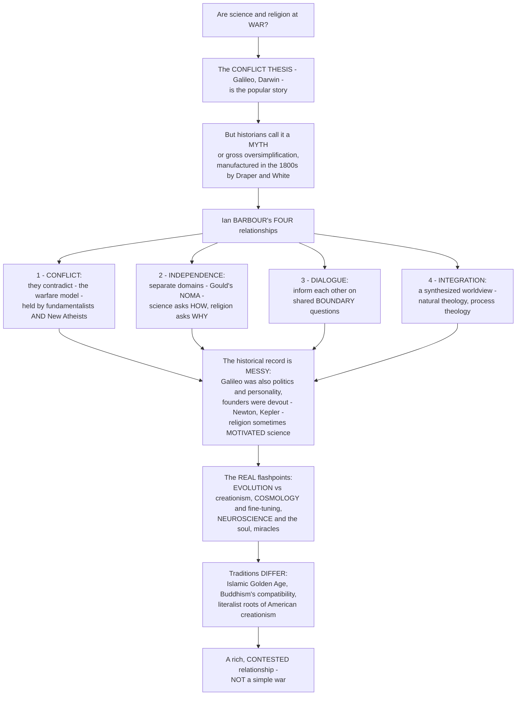

# 🔬 Religion and Science

> [!abstract] TL;DR
> Are science and religion locked in an inevitable **war** — with science steadily conquering territory once held by faith? That popular story is the **conflict thesis** (*Galileo vs the Church! Darwin vs Genesis!*), and historians of science now regard it as a **myth**, or at least a gross oversimplification, one largely *manufactured in the nineteenth century* by **John William Draper** and **Andrew Dickson White** for polemical ends. The real record is far messier and more interesting: the **Galileo affair** was as much about politics, personality, and patronage as doctrine; many founders of modern science were devout (**Newton**, **Kepler**, **Boyle**); and religion sometimes *motivated* science — "thinking God's thoughts after him." **Ian Barbour** famously mapped **four** possible relationships: (1) **Conflict** — they contradict each other (the warfare model, held today by both religious **fundamentalists** and **New Atheists**); (2) **Independence** — they occupy separate, non-overlapping domains: Stephen Jay Gould's **NOMA** (*Non-Overlapping Magisteria*), where science asks **how** and religion asks **why**, so they *cannot* conflict; (3) **Dialogue** — they inform each other on shared **boundary questions** (the origin of the cosmos, consciousness, ethics); and (4) **Integration** — they can be synthesized into a unified worldview (natural theology, process theology). The genuine flashpoints are real, though: **evolution vs creationism / intelligent design** (the sharpest ongoing conflict, especially in America), **cosmology and the Big Bang** (creation, the **fine-tuning** argument), **neuroscience** and free will / the soul, and **miracles** in a law-governed universe. Different traditions engage science differently — the scientific flourishing of the **Islamic Golden Age**, Buddhism's much-touted "compatibility," the specifically literalist-Protestant roots of **American creationism**. Understanding religion and science is understanding one of the defining intellectual dramas of modernity: **not a simple war, but a rich, contested, multi-faceted relationship** between two of humanity's greatest ways of engaging reality.

---

## Intuition

**Analogy:** Picture a wide, unmapped continent at dusk. On one telling, two armies face each other across it: the army of **Science**, advancing year by year, and the army of **Religion**, retreating before it — every hill of ignorance that science conquers (lightning, disease, the origin of species) is a hill faith must abandon, until eventually religion is pushed into the sea. This is the **warfare picture**, and it feels obviously true because we all know the greatest-hits reel: **Galileo** hauled before the Inquisition, **Darwin** dethroning Adam. But walk the actual ground and the battle-map dissolves. The general who supposedly "attacked" Galileo was a personal friend who had *funded* his work; half the officers in the "science" army were themselves pious churchgoers who said they studied nature precisely *to read the mind of its Author*; and the "eternal war" turns out to have been *drawn up on paper* by two nineteenth-century pamphleteers with an axe to grind. The continent was never a single front line. In some places the two are genuinely at each other's throats; in others they simply **survey different terrain** — science charting the *mechanism* of the land, religion asking what the land is *for*; in still others they trade notes at the border.

That dissolving battle-map is exactly the move from the **conflict thesis** to the historians' consensus and to **Barbour's four models**. If you assume **conflict** (both fundamentalists and New Atheists do), science *must* threaten faith. If you adopt **independence** — Gould's **NOMA**, where science owns the empirical *how* and religion owns meaning, value, and purpose (the *why*) — then by construction they can *never* collide, because they are looking at different maps of the same continent. If you choose **dialogue**, you meet at the shared borders — the Big Bang, consciousness, ethics — and compare notes. If you choose **integration**, you try to draw *one* map. Crucially, **which model you adopt largely decides whether science "threatens" religion at all** — the war is not a fact about the world so much as a fact about the picture you bring to it. And yet the real flashpoints are not imaginary: evolution and creationism still fight over the same hill; cosmology's fine-tuning and neuroscience's account of the soul are genuine border disputes. The task is not to declare a winner in a war that mostly wasn't, but to see clearly *where* the two really conflict, where they don't, and why the popular story got it so wrong.

---

## How It Works

The subject is organized less by a body of doctrine than by a **historiographical correction** followed by a **typology**. Start with the popular assumption — inevitable **conflict** — and its nineteenth-century **origins** in Draper and White. Register the **historians' rejection** of that simple thesis and the *messiness* of the actual record (the Galileo affair's politics, the piety of early scientists, religion as a *motive* for science). Then deploy the key analytical tool — **Ian Barbour's four models** (conflict, independence, dialogue, integration) — which shows that the *relationship* is not one thing but a menu of stances. Overlay the **genuine flashpoints** where friction is real (evolution, cosmology, neuroscience, miracles), and finally the **variation across traditions** (Islamic, Buddhist, Christian) and the philosophical hinge of **methodological vs metaphysical naturalism**. The diagram traces that logic from the warfare story down to the rich, contested relationship it becomes on inspection.



**The core mechanics of the debate:**

1. **Name the default and its origin.** The popular assumption is **perpetual conflict** — science and religion as inherently at war, science steadily displacing faith. This "warfare" framing was crystallized by two nineteenth-century books: John William **Draper**'s *History of the Conflict Between Religion and Science* (1874) and Andrew Dickson **White**'s *A History of the Warfare of Science with Theology in Christendom* (1896). Both were **polemical** and, historians now agree, **largely constructed** — retrofitting a clean war onto a tangled past.
2. **Register the correction.** The scholarly consensus (Brooke, Lindberg, Numbers) is that the simple **conflict thesis is a myth**. The historical relationship was **complex and variable** — sometimes tension, often support, often indifference. The paradigm cases don't behave as advertised: the **Galileo affair** turned on Vatican politics, papal personality, and Galileo's own tactlessness as much as on Copernican astronomy; and the **founders of modern science** (Newton, Kepler, Boyle, Faraday) were frequently *devout*, some explicitly framing science as *reading the "book of nature"* written by God.
3. **Deploy the typology — Barbour's four models.** The single most useful tool. Ian **Barbour** (and John Haught) map four ways the two can relate: **conflict**, **independence**, **dialogue**, **integration**. The key realization is that "the relationship" is *underdetermined* — it depends on which model one adopts, which in turn depends on prior commitments about what science and religion each *are*.
4. **Locate the genuine flashpoints.** Not everything is myth. Real friction concentrates at a few points: **evolution vs creationism / intelligent design** (sharpest in the US); **cosmology** — creation *ex nihilo*, the **fine-tuning / anthropic** argument and its multiverse reply; **neuroscience**, free will, and the "soul"; and **miracles** / **divine action** in a universe governed by natural law.
5. **Add the philosophical hinge.** Distinguish **methodological naturalism** (science *methodologically* brackets the supernatural to do its work — compatible with theism) from **metaphysical naturalism** (the *worldview* that nature is all there is). Conflating the two turns a working rule of science into an anti-religious metaphysics — and fuels **scientism**, the overreach of scientific method into questions of meaning and value it is not equipped to settle.

---

## Key Concepts

### 🟢 Secondary — the warfare story and why it is too simple

- **The "conflict" or "warfare" story.** The popular picture: science and religion are natural enemies, forever at war, with science steadily *winning* — taking over explanations (of storms, plagues, the origin of humans) that religion once owned. The greatest-hits examples are **Galileo vs the Church** and **Darwin vs Genesis**.
- **Historians say it is mostly a myth.** Scholars who study the actual history conclude the simple "war" story is **wrong** — it was largely **invented in the 1800s** by two writers, **Draper** and **White**, to score points. The real history is *messier*: the Galileo case was tangled up with **politics** and personalities, and many great scientists were themselves **religious believers**.
- **Newton and Kepler were devout.** **Isaac Newton** wrote more about theology than physics; **Johannes Kepler** said he was "thinking God's thoughts after him." For them, studying nature was a way of *honoring* God, not attacking him — the opposite of the warfare picture.
- **Four ways to relate, not one.** **Ian Barbour** listed four possibilities: **conflict** (they contradict), **independence** (separate areas, no overlap), **dialogue** (they talk and learn from each other), and **integration** (they combine into one big picture). *Whether* science threatens religion depends on which of these you pick.
- **NOMA — "separate magisteria."** Scientist **Stephen Jay Gould** argued science and religion are **non-overlapping magisteria**: science answers **how** the world works (facts, mechanisms), religion answers **why** and what it *means* (purpose, value, ethics). If they cover different questions, they can't really contradict.
- **The real fights are about specific things.** The genuine flashpoints today are **evolution vs creationism**, the **Big Bang** and creation, the **brain vs the soul**, and **miracles** — not a total war between "science" and "religion" as wholes.

### 🟡 Undergraduate — the conflict thesis, its critique, and Barbour's four models

- **The conflict thesis and its manufactured origins.** The **warfare** or **conflict thesis** holds that science and religion are *inherently and perpetually* opposed, with science displacing religion. Its two founding texts are polemics: **Draper** (1874) targeted especially the Catholic Church; **White** (1896) coined the enduring "warfare" metaphor. Both **cherry-picked** and **exaggerated**, and both have been thoroughly critiqued by later historians. Ronald Numbers's edited volume *Galileo Goes to Jail* dismantles a whole catalogue of associated myths (that the medieval Church taught a flat Earth, that it banned dissection, and so on).
- **Who still holds the conflict view.** Ironically, the two loudest constituencies for "conflict" today sit at *opposite* ends: religious **fundamentalists** (who see modern science, especially evolution, as a threat to scriptural authority — the sibling **Fundamentalism and Religious Revival**) and the **New Atheists** (Dawkins, Harris, Hitchens, Dennett), who present science as *refuting* religion. Each *needs* the war to be real.
- **The historians' rejection and the messy record.** The consensus of professional historians of science (John Hedley **Brooke**, David **Lindberg**, Ronald **Numbers**) is the **"complexity thesis"**: no single relationship holds across time and place — support, tension, and indifference all coexist. Concretely:
  - The **Galileo affair** (1616, 1633) involved theology *and* Aristotelian university physics, Counter-Reformation politics, papal ego (Urban VIII), patronage, and Galileo's own combative *Dialogue*. It is a *case study in complexity*, not a clean science-vs-faith duel.
  - **Copernicus** dedicated *De revolutionibus* to the Pope; **Darwin**'s reception among Christians was **mixed**, with prominent clergy and scientists (Asa Gray, Frederick Temple) accommodating evolution early.
  - The **religious roots of science**: the **"Merton thesis"** linking Puritanism to the rise of English science; the medieval and monastic preservation of learning; the theological conviction that a rational Creator made an *intelligible, law-governed* world *worth investigating*.
- **Barbour's four models in depth.** Ian Barbour's *Religion and Science* (1997) gives the field its master typology:
  1. **Conflict** — the two make **competing claims** about the same reality and cannot both be right (scientific materialism vs biblical literalism).
  2. **Independence** — they use **different languages**, methods, and questions and so cannot conflict: **Gould's NOMA**, Wittgensteinian **"language games,"** and Bohr-style **complementarity**. Science = the *empirical/how*; religion = *meaning, value, purpose/why*.
  3. **Dialogue** — they engage on **boundary (limit) questions** neither can fully answer alone: why is there something rather than nothing? why is the universe **intelligible** and mathematically describable? what grounds ethics? Here method and concept are *compared*, not merged.
  4. **Integration** — they are woven into a **single worldview**: *natural theology* (arguing from nature to God), *theology of nature* (letting science reshape doctrine), and **process theology** (Whitehead) with its evolving, persuasive God.
- **The genuine flashpoints, surveyed.**
  - **Evolution vs creationism / intelligent design** — the sharpest live conflict, especially in the United States: from the 1925 **Scopes** trial through *Edwards v. Aguillard* to *Kitzmiller v. Dover* (2005), which ruled **intelligent design** a form of creationism and unconstitutional to teach as science (see **Pseudoscience and the Demarcation Problem**).
  - **Cosmology and the Big Bang** — the beginning of the universe evokes *creation*; the **fine-tuning / anthropic** argument notes that the physical constants sit in a narrow life-permitting range, answered by **multiverse**, **necessity**, or **anthropic-selection** replies.
  - **Neuroscience and the soul** — if mind is brain, what becomes of **free will**, the **soul**, and immortality? (see **Free Will and Determinism**, **Consciousness and the Hard Problem**).
  - **Miracles and divine action** — how can a God act *specially* in a universe of *regular* natural law without "violating" it? Options range from interventionism to non-interventionist "divine action" in quantum indeterminacy or the whole.
- **Methodological vs metaphysical naturalism.** A load-bearing distinction: science's **methodological naturalism** (explain by natural causes *as a working rule*) does **not** entail **metaphysical naturalism** (nature is *all there is*). Many theistic scientists practice the former while rejecting the latter. Sliding from one to the other — or letting science pronounce on meaning and value it cannot test — is **scientism**.

### 🔴 Graduate — historiography, models under pressure, and the traditions

- **The historiography of the conflict thesis.** The "conflict thesis is a myth" claim is itself a *scholarly thesis* with a literature. Draper–White were reacting to specific nineteenth-century contexts (Draper to *Syllabus of Errors*-era Catholicism and the First Vatican Council; White to opposition to Cornell as a secular university). The corrective **complexity thesis** (Brooke) resists *any* master narrative, including a naive "harmony" thesis — the point is that relationships are **local, contingent, and plural**. Careful cases (Numbers, Lindberg) show even the "science heroes vs religious villains" casting collapses on inspection: the flat-Earth "myth of the myth," the exaggeration of Bruno-as-martyr-for-science, the real (theological *and* scientific) reasons the Church resisted heliocentrism before the evidence was decisive.
- **NOMA under pressure.** Gould's **Non-Overlapping Magisteria** is elegant but **contested from both sides**. Critics argue the magisteria *do* overlap: religions make **empirical** claims (a historical resurrection, a young Earth, efficacious petitionary prayer, miracles) that science can bear on; and some argue science *does* speak to "meaning" via evolutionary and cognitive accounts of morality. Richard **Dawkins** rejects NOMA as a truce that concedes too much to religion; many theologians reject it as *demoting* religion to mere ethics-and-poetry, stripping its **truth-claims**. NOMA is best read not as a neutral fact but as a **normative proposal** — one *stance* (independence) among Barbour's four.
- **The fine-tuning argument and its structure.** That the constants of physics permit life within a narrow window is the empirical premise; the inference to design is the contested step. The **anthropic principle** (we could only observe a life-permitting universe) and the **multiverse** (many universes with varied constants; we inhabit a rare hospitable one) are the standard naturalistic replies; the theist responds that the *multiverse itself* needs fine-tuning and explanation. This is a paradigm **dialogue** / **integration** debate at the science-religion border, drawing directly on **cosmology** (the sibling *Concepts of the Divine and Ultimate Reality* connects it to arguments about God).
- **Divine action in a law-governed universe.** Post-Newton, "miracle-as-violation-of-law" (Hume's target) looks metaphysically awkward. The **Divine Action Project** (Vatican Observatory / CTNS) explored **non-interventionist objective divine action** — God acting through **quantum indeterminacy**, **chaotic** sensitivity, or top-down **whole-part** causation without suspending any law. The stakes reach the coherence of **providence**, **prayer**, and **special revelation** in a scientific worldview.
- **The cognitive and evolutionary science of religion.** A modern flashpoint that cuts *beneath* doctrine: cognitive science explains *why humans are prone to religious belief* (agency detection, teleological intuition, mentalizing) and evolutionary theory asks whether religion is an **adaptation** or a **byproduct** (the sibling **The Cognitive Science of Religion**). This raises the **genetic-fallacy** worry — explaining the *origin* of belief does not by itself establish its *falsity or truth* — but debunking arguments (Nietzsche → Freud → today) press it hard.
- **Traditions and cultures differ profoundly.** The Western Christian evidentialism debate is *not* universal:
  - **Islam** produced a **Golden Age** of science (algebra, optics, astronomy, medicine) explicitly framed by faith (**Islamic Golden Age Science**); later debates over the causes of its relative decline, and modern Islamic engagements with evolution, are their own distinct story (the sibling **Islam and the Islamic Tradition**).
  - **Buddhism** is widely promoted as **compatible** with science — the **Dalai Lama**'s dictum that if science disproves a Buddhist claim, Buddhism must change; the **Mind and Life Institute**'s dialogue between contemplatives and **neuroscientists** (the sibling **Buddhism and the Path to Liberation**).
  - **Hindu** and other traditions have their own engagements; and **American creationism** is rooted specifically in **literalist Protestantism**, *not* in Christianity as a whole (Catholic and mainline Protestant churches largely accept evolution).
- **The social and political dimension.** Science-religion conflict is often really a **culture-war** proxy: creationism in **school boards** and curricula, religious framings in debates over **climate**, stem cells, and vaccines (see the sibling **Religion, Politics and the State**). The philosophical questions (scientism, the limits of science, demarcation) are inseparable from these public stakes — and from the **secularization** debate about whether science *causes* religious decline at all (the sibling **Secularization and the Sociology of Belief**), and from the newer spiritualities that *appropriate* scientific language (the sibling **New Religious Movements and Alternative Spirituality**).

---

## Python Demo

```python
# Religion & science -- three teaching pictures of the RELATIONSHIP:
#   (1) "GOD OF THE GAPS" vs NOMA. Under the conflict / god-of-the-gaps
#       picture, religion's "territory" = the UNEXPLAINED gaps, which SHRINK
#       as scientific explanation expands over time -> science looks like it
#       is "conquering" faith. Under Gould's INDEPENDENCE / NOMA picture,
#       religion's domain (meaning, value, purpose) does NOT overlap the
#       scientific domain (how / mechanism) and so does NOT shrink at all.
#       Which curve you believe you're on decides whether science "threatens"
#       religion -- the whole point of choosing a model.
#   (2) EVOLUTION ACCEPTANCE is NOT universal conflict: model public
#       acceptance of evolution as a function of biblical LITERALISM, at two
#       education levels. Acceptance is high for low-literalism groups and
#       collapses only among high-literalism groups -> the conflict is
#       CONCENTRATED among specific literalist communities, not intrinsic to
#       "religion" as such.
#   (3) FINE-TUNING: a toy parameter space in which only a NARROW band of a
#       physical constant permits life -- the empirical setup of the
#       fine-tuning argument (and its multiverse / necessity / anthropic
#       counters). Links cosmology to the science-religion border.
# All figures are conceptual teaching heuristics, not empirical measurements.

import numpy as np
import matplotlib
matplotlib.use("Agg")
import matplotlib.pyplot as plt

def sigmoid(x): return 1.0 / (1.0 + np.exp(-x))

# ======================================================================
# (1) GOD-OF-THE-GAPS (shrinks) vs NOMA (constant)
# ======================================================================
t = np.linspace(0, 1, 300)                       # normalized time / scientific progress
explained = 0.06 + 0.90 * sigmoid(9.0 * (t - 0.5))   # fraction of phenomena science explains
gaps      = 1.0 - explained                          # "god-of-the-gaps" territory -> shrinks
noma      = np.full_like(t, 0.50)                    # religion's magisterium (meaning/value): constant

# ======================================================================
# (2) EVOLUTION ACCEPTANCE vs biblical literalism, by education
# ======================================================================
lit = np.linspace(0, 1, 300)                     # biblical-literalism index (0 = none, 1 = strict)
acc_high_edu = sigmoid(3.2 - 6.5 * lit)          # higher education: accepts unless very literalist
acc_low_edu  = sigmoid(1.6 - 6.5 * lit)          # lower education: lower baseline acceptance

# ======================================================================
# (3) FINE-TUNING: narrow life-permitting window in a constant
# ======================================================================
param = np.linspace(0.0, 2.0, 600)               # a physical constant, observed value = 1.0
width = 0.045                                     # razor-thin life-permitting band
habit = np.exp(-((param - 1.0) ** 2) / (2 * width ** 2))   # "habitability" of the universe

# ======================================================================
# Plot
# ======================================================================
fig = plt.figure(figsize=(16.5, 5.2))

# ---- (1) god-of-the-gaps vs NOMA --------------------------------------
ax1 = fig.add_subplot(1, 3, 1)
ax1.plot(t, explained, color="#2563eb", lw=2.4, label="Science's explained territory")
ax1.plot(t, gaps,      color="#dc2626", lw=2.6, label="God-of-the-gaps domain (SHRINKS)")
ax1.plot(t, noma,      color="#16a34a", lw=2.6, ls="--",
         label="NOMA: religion's domain (CONSTANT)")
ax1.fill_between(t, 0, gaps, color="#dc2626", alpha=0.07)
ax1.set_xlabel("time  /  growth of scientific explanation  ->")
ax1.set_ylabel("share of 'territory'")
ax1.set_ylim(0, 1.02)
ax1.set_title("(1) God-of-the-gaps shrinks;\nNOMA does not", fontsize=10)
ax1.legend(fontsize=7.0, loc="center right")
ax1.text(0.03, 0.90,
         "conflict picture: faith 'retreats'\nindependence picture: no overlap, no retreat",
         fontsize=6.6, color="#374151", va="top")

# ---- (2) evolution acceptance vs literalism ---------------------------
ax2 = fig.add_subplot(1, 3, 2)
ax2.plot(lit, acc_high_edu, color="#7c3aed", lw=2.6, label="Higher education")
ax2.plot(lit, acc_low_edu,  color="#d97706", lw=2.4, ls="--", label="Lower education")
ax2.axvspan(0.7, 1.0, color="#ef4444", alpha=0.08)
ax2.text(0.845, 0.82, "conflict\nconcentrated\nhere", fontsize=6.8,
         color="#b91c1c", ha="center", va="top")
ax2.set_xlabel("biblical-literalism index")
ax2.set_ylabel("public acceptance of evolution")
ax2.set_ylim(0, 1.02)
ax2.set_title("(2) Evolution acceptance:\nconflict is concentrated, not universal", fontsize=10)
ax2.legend(fontsize=7.6, loc="upper right")

# ---- (3) fine-tuning window -------------------------------------------
ax3 = fig.add_subplot(1, 3, 3)
ax3.plot(param, habit, color="#0f766e", lw=2.4)
mask = np.abs(param - 1.0) <= 2 * width
ax3.fill_between(param, 0, habit, where=mask, color="#0f766e", alpha=0.25,
                 label="life-permitting window")
ax3.axvline(1.0, color="k", lw=0.8, ls=":", alpha=0.6)
ax3.text(1.0, 1.03, "observed\nvalue", fontsize=6.8, ha="center", color="#374151")
ax3.set_xlabel("value of a physical constant  (observed = 1.0)")
ax3.set_ylabel("habitability  (life permitted)")
ax3.set_ylim(0, 1.12)
ax3.set_title("(3) Fine-tuning:\na narrow life-permitting band", fontsize=10)
ax3.legend(fontsize=7.2, loc="upper right")
ax3.text(0.03, 1.06,
         "counters: multiverse, necessity,\nanthropic selection",
         fontsize=6.6, color="#374151", va="top")

plt.tight_layout()
plt.savefig("religion_and_science.png", dpi=120, bbox_inches="tight")
plt.show()

# ----------------------------------------------------------------------
# Console summary
# ----------------------------------------------------------------------
print("=" * 66)
print("(1) GOD-OF-THE-GAPS vs NOMA")
print("=" * 66)
print(f"  gaps at start : {gaps[0]:.2f}   gaps at end : {gaps[-1]:.2f}   -> SHRINKS")
print(f"  NOMA domain   : {noma[0]:.2f}   constant     : {noma[-1]:.2f}   -> unchanged")
print("-" * 66)
print("(2) EVOLUTION ACCEPTANCE (higher education)")
print(f"  low literalism (0.1): {sigmoid(3.2 - 6.5*0.1):.2f}   "
      f"high literalism (0.9): {sigmoid(3.2 - 6.5*0.9):.2f}")
print("  -> acceptance collapses only among strong literalists")
print("-" * 66)
print("(3) FINE-TUNING")
frac = float(np.mean(mask))
print(f"  fraction of parameter range that is life-permitting: {frac:.3f}")
print("  -> the 'coincidence' the fine-tuning argument turns on")
```

**What the figure teaches.** Panel **(1)** is the crux of why "does science threaten religion?" has *no answer in the abstract*. On the **conflict / god-of-the-gaps** reading, religion's territory is whatever science has *not yet explained* — the red curve, which *inevitably shrinks* as the blue "explained" curve rises, so faith looks like an army in permanent retreat. On the **independence / NOMA** reading, religion's domain is *meaning, value, and purpose* — the green line, flat and untouched, because it never overlapped the *mechanistic* questions science answers in the first place. **Same scientific progress, opposite verdicts** — the difference is entirely in which model (which curve) you think you are on. Panel **(2)** punctures the idea that religion-vs-evolution is a *universal* war: modelling acceptance of evolution against **biblical literalism** shows acceptance stays high across most of the range and only **collapses in the strongly literalist zone** (shaded) — the conflict is *real but concentrated* in specific communities (and modulated by education), not intrinsic to religiosity as such, which is exactly why Catholic and mainline Protestant bodies accept evolution while young-earth creationists do not. Panel **(3)** sketches the **fine-tuning** setup: habitability peaks in a *razor-thin band* of the constant around its observed value, so a life-permitting universe looks like a "coincidence" demanding explanation — the empirical premise the design argument leans on, with its standard **multiverse / necessity / anthropic** counters annotated. Together the panels stage the whole subject: whether science *threatens* faith (panel 1) depends on your model; the flagship "conflict" (panel 2) is narrower than the warfare story claims; and the liveliest genuine border dispute (panel 3) is a matter of *interpretation*, not a knockout blow either way.

---

## Real-World Applications

- **Science education and the courts.** The evolution-creationism conflict plays out in real institutions: the 1925 **Scopes** "Monkey Trial," *Epperson v. Arkansas* (1968), *Edwards v. Aguillard* (1987), and *Kitzmiller v. Dover* (2005), where a federal court ruled that teaching **intelligent design** as science violates the Establishment Clause. What counts as *science* vs *religion* here is a live legal and pedagogical question (see **Pseudoscience and the Demarcation Problem**).
- **Structured science-religion dialogue.** Institutions exist to run Barbour's **dialogue** and **integration** models in practice: the **Vatican Observatory** and **Center for Theology and the Natural Sciences** (the Divine Action Project), the **Ian Ramsey Centre** (Oxford), and the large **Templeton**-funded field of science-and-religion scholarship.
- **Contemplative neuroscience.** The **Mind and Life Institute** convenes the **Dalai Lama** with neuroscientists to study meditation, attention, and compassion — a flagship case of a tradition (**Buddhism**) treating science as a *partner*, and a driver of real research on neuroplasticity and contemplative practice.
- **Public controversies and policy.** Religious framings shape debates over **climate change**, **stem-cell** research, **vaccines**, and end-of-life care; how a community reads the science-religion relationship affects public health and environmental policy (see **Religion, Politics and the State**).
- **The New Atheism debates.** The best-selling books and public debates of Dawkins, Harris, Hitchens, and Dennett — and the theological and philosophical replies — are the **conflict** model performed in the public square, and a major driver of contemporary religious literacy (and illiteracy).
- **Medicine, genetics, and bioethics.** Genome editing, cloning, brain science, and artificial intelligence force traditions to negotiate doctrine (on the soul, personhood, human dignity) with fast-moving science — applied science-and-religion at the clinical and legislative coalface.

---

## Common Pitfalls

- **Believing the conflict thesis is history.** The "eternal war of science and faith" is the *loudest* story but, according to historians, a **nineteenth-century construction** (Draper–White), not a description of the record. Treating it as settled fact — on either the atheist or the fundamentalist side — is the single most common error.
- **Reading Galileo as the whole story.** The Galileo affair is *cited* as the paradigm of science-vs-Church, but it was shot through with **politics, patronage, personality, and Aristotelian physics**. Using it as a clean template misreads both that episode and the broader history (see **The Copernican Revolution**).
- **Flattening all religions into one stance.** American **young-earth creationism** is a *specifically literalist-Protestant* phenomenon, not "the religious view." Catholicism, mainline Protestantism, much of Judaism, and (often) Buddhism and Hinduism relate to science very differently. Generalizing from creationism to "religion" distorts the map (panel 2).
- **Conflating methodological with metaphysical naturalism.** Science's *working rule* of explaining by natural causes does **not** entail the *worldview* that nature is all there is. Sliding from one to the other lets a scientist's *metaphysics* pose as a *finding of science* — the engine of much manufactured conflict.
- **Scientism — overreaching the reach of science.** Assuming science can answer questions of **meaning, value, purpose, and ethics** (the *why*, not the *how*) is not a scientific result but a philosophical claim, and a contested one. It provokes exactly the friction NOMA tries to dissolve.
- **Treating NOMA as a neutral fact rather than a proposal.** Gould's non-overlapping magisteria is *one model* (independence), and it is **contested from both sides** — religions do make empirical claims that overlap science, and some argue science bears on morality. Presenting NOMA as the obvious truce ignores that it *demotes* religion's truth-claims, which many believers reject.
- **The genetic fallacy about religious belief.** Showing that evolution or cognitive science *explains why humans tend to believe* does **not** by itself show the beliefs are *false* (or true). Origin and truth are distinct questions; debunking arguments must do more work than pointing at a cause.
- **God-of-the-gaps theology.** Locating God in whatever science has *not yet* explained (panel 1) is a losing strategy: it guarantees that God's "role" *shrinks* with every discovery. Most sophisticated theologies deliberately avoid it, placing God as the ground of the *whole* law-governed order rather than a stopgap in its gaps.

---

## Related Concepts

- [[Science_and_Religion]] — the **companion History-of-Science note** (distinct basename): the *historical* development of the relationship — the flat-Earth and Galileo myths, the Merton thesis, the Scopes-to-Dover legal history. This Religious-Studies note foregrounds the **models** (Barbour, NOMA) and the *religious* stakes.
- [[Faith_and_Reason]] — the **Philosophy** backbone: the medieval synthesis (Anselm, Aquinas) of belief and rational inquiry that predates and frames the modern science-religion debate; its Religious-Studies companion is the sibling *Faith, Reason and Religious Epistemology*, where the fine-tuning and design arguments live as natural theology.
- [[The_Darwinian_Revolution]] — the **History-of-Science** account of Darwin's theory and its *mixed* reception — the empirical core of the sharpest ongoing flashpoint (panel 2).
- [[Natural_Selection_and_Adaptation]] — the **Biology** mechanism (variation + selection) that creationism and intelligent design contest; understanding the science is prerequisite to weighing the "conflict."
- [[Evidence_for_Evolution]] — the **Biology** case (fossils, homology, molecular data, observed speciation) that the evolution-vs-creationism dispute is *about*.
- [[The_Big_Bang_and_Cosmic_Microwave_Background]] — the **Astronomy** cosmology that evokes *creation* and anchors the **fine-tuning** argument analysed in panel (3).
- [[Philosophy_of_Science_Overview]] — the **History-of-Science** treatment of what science *is* and *is not* — essential for the methodological-vs-metaphysical naturalism distinction and the scientism worry.
- [[Pseudoscience_and_the_Demarcation_Problem]] — the **demarcation** question ("is intelligent design *science*?") that decided *Kitzmiller v. Dover* and structures the classroom conflict.
- [[Free_Will_and_Determinism]] — the **Philosophy** hinge of the neuroscience flashpoint: if the brain is a physical system, what remains of free will and the soul?
- [[Consciousness_and_the_Hard_Problem]] — the **Philosophy** frontier where mind resists reduction — a live *boundary question* for the dialogue model (soul, subjectivity, meaning).
- [[Islamic_Golden_Age_Science]] — the **History-of-Science** case that faith can *host* a scientific flowering, a direct counter-example to the universal-conflict story.

---

## Review Questions

**🟢 Secondary.** In your own words, what is the **conflict thesis** (the "warfare" story) about science and religion, and why do many historians now call it a **myth**? Give one reason the **Galileo** affair is more complicated than "science vs the Church," and name one famous scientist who was also **religious**.

**🟡 Undergraduate.** Lay out **Ian Barbour's four models** — conflict, independence, dialogue, integration — with a one-line example of each. Then explain **Gould's NOMA**: what question does it assign to science, what to religion, and why (on this view) they *cannot* conflict. Using panel (1) of the demo, explain why "does science threaten religion?" gets *opposite* answers under the god-of-the-gaps picture versus the NOMA picture.

**🔴 Graduate.** "Whether science and religion conflict is not a fact about the world but a function of the model one adopts." (a) Defend and then critique this claim, using at least two of Barbour's models and the **methodological-vs-metaphysical-naturalism** distinction. (b) NOMA is often presented as the reasonable truce; explain why it is **contested from both sides** (the New Atheist objection *and* the theologian's objection that it demotes religion's truth-claims). (c) Take one genuine flashpoint — evolution-and-creationism, fine-tuning cosmology, or neuroscience-and-the-soul — and analyse it through *conflict*, *independence*, and *dialogue* in turn, showing what each model illuminates and what it hides. Connect your answer to why **American creationism** is a poor proxy for "religion vs science" in general (panel 2).

---

## Sources

- Ian G. Barbour, *Religion and Science: Historical and Contemporary Issues* (HarperOne, 1997) — the field-defining statement of the four-model typology (conflict, independence, dialogue, integration).
- John Hedley Brooke, *Science and Religion: Some Historical Perspectives* (Cambridge University Press, 1991) — the classic scholarly demolition of the simple conflict thesis and the case for the "complexity thesis."
- Stephen Jay Gould, *Rocks of Ages: Science and Religion in the Fullness of Life* (Ballantine, 1999) — the primary statement of NOMA, non-overlapping magisteria.
- Ronald L. Numbers (ed.), *Galileo Goes to Jail and Other Myths about Science and Religion* (Harvard University Press, 2009) — twenty-five historians dismantling the popular myths of the warfare narrative.
- David C. Lindberg and Ronald L. Numbers (eds.), *God and Nature: Historical Essays on the Encounter between Christianity and Science* (University of California Press, 1986) — foundational essays on the varied, non-warfare historical relationships.

---

#religious-studies #religion-and-science #conflict-thesis #noma #evolution-and-creationism
