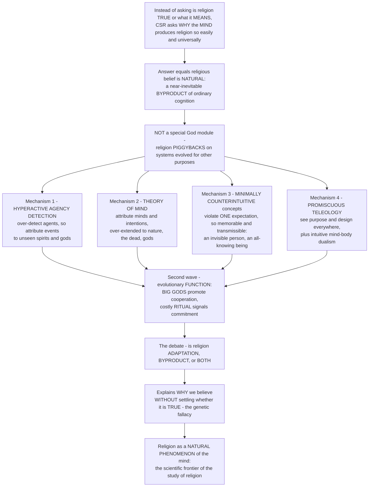

# 🧠 The Cognitive Science of Religion

> [!abstract] TL;DR
> Instead of asking whether religion is **true** or what it **means**, the **cognitive science of religion (CSR)** asks a different, scientific question: *why does the human mind produce religion so easily and so universally?* Its startling answer is that religious belief is **natural** — a near-inevitable **byproduct** of how our ordinary cognitive machinery works, not the product of a special "God module." Religion **piggybacks** on mental systems that evolved for other purposes: a **hyperactive agency-detection device (HADD)** that makes us over-attribute unseen events to invisible agents (spirits, gods, ghosts); a **theory of mind** we over-extend to nature, the dead, and disembodied minds; an attraction to **minimally counterintuitive (MCI)** concepts that violate exactly *one* intuitive expectation and so are especially memorable and transmissible (an invisible person, a statue that hears prayers, a being that knows everything); and a **promiscuous teleology** that sees purpose and design everywhere. A second wave then asks about religion's evolutionary **function** and cultural evolution — do watchful, moralizing **"Big Gods"** (Norenzayan) promote the cooperation that enabled large-scale societies, and is costly **ritual** a hard-to-fake signal of commitment that builds trust? — while debating whether religion is **adaptation, byproduct, or both**. Crucially, explaining *why* we believe does not by itself settle whether the belief is **true** (the genetic fallacy), so CSR is best understood as the study of religion as a **natural phenomenon of the human mind** — the cutting-edge scientific frontier of the study of religion.

---

## Intuition

**Analogy:** Imagine you jump when a coat on a hook, glimpsed in the dark, looks for a split second like a lurking intruder. Your brain screamed "**someone is there!**" on almost no evidence — and it was *right to*. For a creature whose ancestors were eaten by things hiding in the grass, the cost of *missing* a real predator is death, while the cost of a *false alarm* is a wasted flinch. So evolution built you a **trigger-happy detector for agents** — minds, intentions, someone-behind-it — that fires far too often. Now notice: that same jumpy detector, aimed at a rustling bush, a rumble of thunder, a sudden illness, or the vast indifferent world itself, whispers *someone did that* — and you have the seed of a spirit, a ghost, a god.

That is the core move of the **cognitive science of religion**. Rather than debating whether the god behind the thunder is *real*, CSR asks why the human mind *reaches for* a hidden agent so effortlessly — and finds that it does so using the *same* everyday equipment it uses for the coat on the hook. We are not "wired for God" by a dedicated religion organ; religion is **cheap** and **contagious** precisely because it rides on standard mental hardware we already carry for detecting predators, reading other people's intentions, remembering surprising stories, and seeing purpose in the world. A god that is *invisible* (violating one expectation) is far stickier in memory than either "a person" or "a shapeshifting, time-travelling, seven-headed committee." A watchful high god who *sees you cheat* can make strangers trust each other enough to build a city. The whole field is the attempt to explain religion the way a naturalist explains any recurrent product of the mind — and then to ask, carefully, what that explanation does and does *not* prove about whether the belief is true.

---

## How It Works

CSR is organized by four moves. First it **reframes the question** — away from truth and meaning, toward the recurrence and *naturalness* of religion. Second it advances the **byproduct thesis**: religious cognition falls out of ordinary mental systems that evolved for other jobs. Third it names the **specific mechanisms** — hyperactive agency detection, theory of mind, minimally counterintuitive concepts, promiscuous teleology and intuitive dualism. Fourth, a **second wave** asks about evolutionary *function* and cultural evolution — Big Gods, costly ritual, and the adaptation-versus-byproduct debate — before insisting that a causal account of belief does not, by itself, settle its **truth**. The diagram traces that logic.



**Core mechanics of the field:**

1. **Reframe the question.** Older theories (see the sibling *Theories of the Origin of Religion*) asked what religion *fundamentally is* — failed science, society, neurosis, ideology, or a real encounter with the sacred. CSR narrows the target to a *tractable, testable* question: given ordinary human cognition, **why is supernatural belief so recurrent, so natural, and so cross-culturally widespread?** Justin Barrett and Robert McCauley add a provocation: religion is **cognitively natural** (it comes easily, spontaneously, to children and adults), whereas **science is cognitively unnatural** (effortful, counterintuitive, culturally rare).
2. **Adopt the byproduct ("spandrel") stance.** The "standard model" of CSR holds that religion is not a direct **adaptation** and requires **no dedicated "God module."** Instead it is a **byproduct** of mental systems selected for *other* tasks — detecting predators, reading minds, remembering surprising information, inferring purpose. Religion is therefore *cheap* to acquire and *parasitic* on standard architecture, which explains its universality without positing special design.
3. **Identify the generating mechanisms.** A small set of evolved cognitive systems reliably *produce* religious representations as side effects (detailed below): agency detection, mentalizing, the memorability of minimally counterintuitive ideas, and intuitive teleology and dualism.
4. **Add the function/cultural-evolution layer.** A second wave asks whether, *once* byproducts appear, cultural evolution and selection favour certain forms — **prosocial "Big Gods,"** **costly ritual signalling** — because groups carrying them cooperate better and out-persist rivals. This revives the old *function* question in Darwinian form and frames the field's central dispute: **adaptation, byproduct, or both.**
5. **Separate explanation from truth.** CSR explains the **origin and spread** of belief without, on its own, showing there is *nothing to believe in* — conflating the two is the **genetic fallacy**. Some draw debunking conclusions; some theists read HADD and MCI as the *mechanism* of a God-given *sensus divinitatis*. CSR describes the machinery; the truth question stays open.

---

## Key Concepts

### 🟢 Secondary — the basic idea

- **The question is different.** CSR does not ask "*is* religion true?" It asks "**why does the human mind make religion so easily, in every culture?**" That is a scientific question about *minds*, not a theological one about *gods*.
- **Religion is "natural."** The startling headline: belief in gods and spirits is **natural** — it comes to us as easily as seeing faces in clouds. We are not built with a special "religion switch"; religion **rides on ordinary thinking equipment**.
- **We see agents everywhere (HADD).** Our brains are quick to sense that "**someone is there**" — a predator, a person, a hidden mind — because missing a real threat was deadly and a false alarm was cheap. Point that jumpy detector at thunder, illness, or the whole world, and you get **spirits and gods**.
- **Weird-but-not-too-weird ideas stick.** A concept that breaks *one* rule — a person who is **invisible**, a statue that **hears** you, a being that **knows everything** — is far easier to remember and pass on than a boring idea *or* a wildly complicated one. Gods and spirits have exactly this shape: **minimally counterintuitive**.
- **We see purpose everywhere.** Children (and tired adults) naturally think things exist *for* a reason — "mountains are **for** climbing" — which primes the idea of a **designer**.
- **Watchful gods and cooperation.** A god who *sees you cheat* and *punishes* it can make even strangers behave — one reason big, cooperating societies may have grown up alongside big, moralizing gods.

### 🟡 Undergraduate — the byproduct theory and its mechanisms

**The field and its reframed question.** The **cognitive science of religion** is the interdisciplinary scientific study — drawing on **cognitive psychology, evolutionary psychology, anthropology, and neuroscience** — of the *mental processes* underlying religious belief and behaviour. Its founding reframing (Guthrie, Boyer, Barrett, Atran, Lawson & McCauley in the 1990s–2000s) trades the classic "what *is* religion?" for "**why is religion recurrent, natural, and widespread?**" The **"naturalness of religion" thesis** (Barrett; McCauley's *Why Religion Is Natural and Science Is Not*) claims religion is *cognitively cheap* while science is *cognitively hard*.

**The byproduct theory (the core claim).** Religion is a **byproduct** — a **"spandrel"** in Gould-and-Lewontin's sense — of cognitive systems that evolved for *other* purposes, **not** a special "God module" and **not** (on the standard model) a direct adaptation *for* religion. Religion is "**cognitively cheap**" precisely because it is *parasitic* on standard mental architecture. This is the "**standard model**" of CSR.

**The key cognitive mechanisms** — the systems that *generate* religious cognition:

- **(1) The Hyperactive Agency Detection Device (HADD).** Stewart Guthrie (*Faces in the Clouds*, 1993) and Justin Barrett argued for an evolved bias to **over-detect agents** (intentional beings). Because a **false negative** (missing a real predator) is potentially fatal while a **false positive** (fleeing the wind) is cheap, selection favours a **trigger-happy** detector — which spontaneously attributes ambiguous events (a rustle, thunder, illness, fortune) to **unseen agents**: spirits, ancestors, gods. Anthropomorphism is the default; religion inherits it. *(Modelled in the origins-of-religion sibling note; here we model the cooperation side instead.)*
- **(2) Theory of mind / mentalizing.** Our automatic machinery for attributing **beliefs, desires, and intentions** to others (the Cognitive Science vault's *Social Cognition and Theory of Mind*) can be aimed at **non-human, invisible, and disembodied** agents just as readily as at visible people — letting us represent gods with full mental lives that *watch, know, and judge*. Over-extended mentalizing turns nature, the dead, and the cosmos into *someones*.
- **(3) Minimally counterintuitive (MCI) concepts.** Pascal Boyer (*Religion Explained*, 2001) and Justin Barrett showed that concepts violating **exactly one** intuitive ("ontological") expectation — a **person who is invisible**, a **statue that hears prayers**, a **being that knows your thoughts** — are recalled and transmitted **better** than either fully **mundane** concepts (nothing to remember) or **maximally** counterintuitive ones (too costly to encode). The result is an **inverted-U**: the *minimal* violation is the "sweet spot," which is exactly the structure of gods, spirits, ghosts, and miracles. This is CSR's account of the **"catchiness"** and cultural survival of religious ideas (modelled below).
- **(4) Promiscuous teleology and intuitive dualism.** Deborah **Kelemen** showed children (and adults under time pressure or cognitive load) are **promiscuous teleologists** — biased to assume things exist *for a purpose* ("clouds are for raining," "rocks are pointy so animals won't sit on them") — priming **creationist/design** intuitions. Alongside sits intuitive **mind-body dualism** (mind feels separable from body), which primes belief in **souls and an afterlife** (see the sibling *Salvation, Liberation, and the Afterlife*), plus **psychological essentialism** (things have a hidden essence) and a readiness for **ritual** and **contagion/contamination** intuitions (the "ritual stance").

### 🔴 Graduate — evolution, culture, neuroscience, and the limits

**The evolutionary and cultural-evolution theories (the second wave).** Beyond byproduct lies the **adaptation-versus-byproduct** debate and the study of religion's *effects*:

- **Prosocial religion and "Big Gods."** Ara **Norenzayan** (*Big Gods*, 2013) argues that **moralizing, knowing, punishing high gods** are a **cultural technology**: belief in **supernatural monitoring and punishment** raised cooperation among strangers and *co-evolved* with the scale of societies ("**watched people are nice people**"). On this "big-gods hypothesis," moralizing gods and large-scale cooperation expanded together as an answer to the **free-rider problem** (modelled below; connects to the Evolutionary Game Theory vault's account of the **prisoner's dilemma and cooperation**).
- **Costly-signaling theory.** Richard **Sosis**, Joseph **Bulbulia**, and William Irons argue that **costly, hard-to-fake** religious commitments — demanding **ritual**, fasting, tithing, celibacy, scarification — are **credible signals** of in-group loyalty that deter free-riders and build **trust and cooperation** (Sosis's finding: religious communes with more costly demands survive longer). This links to **honest-signalling** theory in the Evolutionary Game Theory vault's *Animal Conflict and Signaling* and to the sibling *Ritual and Religious Practice*.
- **Dual-inheritance / gene-culture coevolution.** Cultural evolutionists (Boyd, Richerson, Henrich; the *Cultural Evolution and Social Learning* note) treat religions as **culturally selected** systems: content biases (MCI, agency) plus context biases (prestige, conformity) shape *which* religious forms spread, and **group-beneficial** variants can be favoured by **cultural group selection** — reopening the contested **group/multilevel-selection** debates.

**Neuroscience and experimental findings — the empirical study.** CSR is a *testable* program:

- **Neurotheology.** Andrew **Newberg** and Eugene d'Aquili imaged meditating monks and praying nuns, correlating **superior-parietal** deactivation with felt loss of the self–world boundary in unitive states (see the sibling *Religious Experience and Mysticism* and the Neuroscience vault's *Consciousness and Neural Correlates*). There is **no single "God spot"**; religious cognition recruits **distributed networks**, including the **default-mode network**.
- **Religious priming.** Experiments show **religious primes** (god concepts, religious words) can increase **prosociality** and reduce **cheating** in the lab — direct support for the supernatural-monitoring hypothesis (though effect sizes and replicability are debated).
- **Analytic vs intuitive thinking.** Will **Gervais** and Gordon **Pennycook** found that **analytic (Type 2) thinking** tends to *predict lower* religious belief, and that experimentally nudging analytic thought can reduce reported belief — implicating **dual-process** cognition (the Cognitive Science vault's *Dual Process Theory*): intuitive defaults *support* belief; deliberate override can *dampen* it.
- **Development and individual differences.** Children readily acquire **god concepts** and show early **teleological** and **agency** biases; individual differences in mentalizing, and the **replication caveats** now standard across social science, temper strong claims.

**Implications, debates, and limits — what CSR does and doesn't show:**

- **Does explaining belief *debunk* it?** The **genetic fallacy**: a causal/cognitive account of *why* people believe does **not**, by itself, settle whether the belief is **true** — a full neuroscience of *seeing a tree* leaves the tree intact. Some (e.g., certain New Atheist readings) draw **debunking** conclusions; some theists argue HADD and MCI are simply the **mechanism** through which a God-given **sensus divinitatis** operates (see the sibling *Faith, Reason, and Religious Epistemology*). CSR itself is officially *neutral* on truth.
- **Reductionism vs meaning.** CSR sits in tension with **meaning-centred** and **phenomenological** approaches (the *Phenomenology of Religion* tradition of Otto and Eliade): critics charge it explains the *mechanism* while missing the *meaning*, *experience*, and *content* of lived religion.
- **The "belief-centric / Protestant" critique.** CSR has been faulted for a **Western, Protestant, "belief"-centric** bias — assuming religion is primarily about propositional *belief* in a personal, omniscient god, and neglecting **practice, ritual, community, embodiment, and meaning** in traditions where orthopraxy outweighs orthodoxy.

**Why it matters.** The cognitive science of religion illuminates religion as a **natural phenomenon of the human mind** — the cutting-edge scientific frontier of the study of religion. Rather than asking whether religion is true or what it means, this field asks *why the human mind produces religion so easily and universally*, and its startling answer is that religious belief is natural — a near-inevitable **byproduct** of how our ordinary cognitive machinery works, rather than the product of a special religion module. Religion **piggybacks** on mental systems that evolved for other purposes, including a **hyperactive agency-detection device** that leads us to attribute unseen events to invisible agents, a **theory of mind** we over-extend to nature, the dead, and gods, an attraction to **minimally counterintuitive** concepts that violate just one expectation and so are especially memorable and transmissible, and a **promiscuous teleology** that sees purpose and design everywhere. A second wave of theories then asks about religion's evolutionary **function** and cultural evolution — investigating whether watchful **"Big Gods"** promote the cooperation that enabled large-scale societies and whether **costly ritual** is a hard-to-fake signal of commitment that builds trust — while debating whether religion is adaptation, byproduct, or both. Crucially, explaining *why* we believe is not the same as settling *whether* the belief is true, so understanding the cognitive science of religion is understanding the naturalistic mechanisms behind humanity's religiosity that form the scientific frontier of this vault.

---

## Python Demo

Two computational sketches of the CSR "standard model." Part **(a)** models the **minimally-counterintuitive recall advantage** — an *inverted-U* over the number of violated expectations that *sharpens* across generations of retelling, explaining why successful supernatural concepts have exactly the MCI structure. Part **(b)** models the **"Big Gods" effect**: supernatural monitoring and punishment as a solution to the free-rider problem, sustaining cooperation that collapses without it (connecting to the Evolutionary Game Theory vault). Requires only `numpy` and `matplotlib`.

```python
"""
Cognitive science of religion: two computational sketches.

(a) MINIMALLY COUNTERINTUITIVE recall/transmission -- concepts that violate
    EXACTLY ONE intuitive expectation are remembered and passed on best,
    an inverted-U that SHARPENS over generations of retelling. This is why
    successful gods/spirits are "an invisible person" rather than "a person"
    or "a shapeshifting, invisible, time-travelling committee."

(b) BIG GODS -- watchful, moralizing, PUNISHING gods raise the expected cost
    of defecting, so groups that believe in them sustain cooperation that
    otherwise collapses under free-riding (a public-goods / replicator model).
"""

import numpy as np
import matplotlib
matplotlib.use("Agg")
import matplotlib.pyplot as plt

rng = np.random.default_rng(7)

# =====================================================================
# (a) MINIMALLY COUNTERINTUITIVE recall -- the inverted U
# =====================================================================
# Per-retelling SURVIVAL probability as a function of the number of intuitive
# expectations a concept VIOLATES:
#   distinctiveness RISES with violations  (more attention-grabbing / memorable)
#   encoding & integration COST decays it  (too weird -> hard to store & retell)
# -> a single-violation optimum = MINIMALLY counterintuitive.
n_violations = np.arange(0, 7)
base, gain, decay = 0.35, 1.00, 0.85
memorability = (base + gain * n_violations) * np.exp(-decay * n_violations)
retain = 0.97 * memorability / memorability.max()      # per-generation survival prob

# transmission across "generations" of retelling: survival = retain ** G
generations = [1, 3, 10]
survival = {G: retain ** G for G in generations}
peak = int(n_violations[np.argmax(memorability)])
print(f"(a) MCI peak memorability at {peak} violation(s) -> minimally counterintuitive")
print(f"    after 10 retellings: n=0 mundane survives {survival[10][0]:.4f}, "
      f"n=1 MCI survives {survival[10][1]:.4f}, n=6 bizarre survives {survival[10][6]:.4f}")

kind_labels = ["0\nmundane\n(brown dog)",
               "1\nMCI\n(a dog that\nspeaks)",
               "2", "3", "4", "5",
               "6\nbizarre\n(invisible\neternal\nshapeshifter)"]

# =====================================================================
# (b) BIG GODS -- supernatural monitoring & punishment sustains cooperation
# =====================================================================
# Public-goods game; replicator dynamics on the fraction x of COOPERATORS.
#   c  = cost of cooperating
#   A DEFECTOR who BELIEVES in a watchful, punishing god pays an expected
#   supernatural cost s = monitoring_probability * punishment_magnitude.
#   payoff(coop) - payoff(defector) = -c + s
#   dx/dt = x*(1-x)*(s - c)         (standard replicator selection term)
# No Big God (s=0): defection wins, cooperation COLLAPSES.
# Watchful Big God (s > c): cooperation is SUSTAINED / grows.
c = 0.25
punishment = 0.9
monitoring_levels = {"no Big God  (s = 0)":     0.00,
                     "weak monitoring":          0.20,
                     "watchful Big God":         0.45}
T, x0 = 60, 0.60
t = np.arange(T)
trajectories = {}
for name, mon in monitoring_levels.items():
    s = mon * punishment
    x = np.empty(T); x[0] = x0
    for k in range(1, T):
        xk = x[k - 1]
        x[k] = np.clip(xk + xk * (1.0 - xk) * (s - c), 0.0, 1.0)
    trajectories[name] = x
    print(f"(b) {name:>22s}: s={s:.2f}  final cooperation = {x[-1]:.2f}")

# =====================================================================
# PLOTS
# =====================================================================
fig, (ax1, ax2) = plt.subplots(1, 2, figsize=(14, 5.6))

# ---- (a) MCI inverted-U ----
bar_colors = ["gray", "seagreen"] + ["gray"] * 5
ax1.bar(n_violations, retain, color=bar_colors, edgecolor="black", alpha=0.85,
        label="per-retelling survival")
for G, ls in zip(generations, ["-", "--", ":"]):
    ax1.plot(n_violations, survival[G], marker="o", lw=2, ls=ls,
             label=f"survival after {G} generation(s)")
ax1.set_xticks(n_violations)
ax1.set_xticklabels(kind_labels, fontsize=6.8)
ax1.set_xlabel("number of counterintuitive violations")
ax1.set_ylabel("recall / transmission survival")
ax1.set_title("(a) Minimally counterintuitive concepts win\nan inverted-U that sharpens over retelling")
ax1.legend(fontsize=7.5, loc="upper right")

# ---- (b) Big Gods cooperation ----
line_colors = ["#9ca3af", "#2563eb", "#dc2626"]
for (name, x), col in zip(trajectories.items(), line_colors):
    ax2.plot(t, x, lw=2.4, color=col, label=name)
ax2.axhline(0.5, color="k", lw=0.7, ls="--", alpha=0.4)
ax2.set_ylim(0, 1.02)
ax2.set_xlabel("time  (generations of social learning)")
ax2.set_ylabel("fraction of COOPERATORS in the group")
ax2.set_title("(b) Big Gods sustain cooperation\nwatchful supernatural punishment beats free-riding")
ax2.legend(fontsize=8, loc="center right")

plt.tight_layout()
plt.savefig("cognitive_science_of_religion.png", dpi=120, bbox_inches="tight")
plt.show()
```

**What the output shows.** Panel **(a)**: memorability peaks not at the **mundane** (a brown dog — nothing to encode) nor at the **maximally** counterintuitive (an invisible, eternal, shapeshifting dog — too costly to store and retell), but at **one** violation — the **minimally counterintuitive** sweet spot. Crucially, the *inverted-U sharpens with transmission*: after ten generations of retelling, the mundane and bizarre concepts have all but vanished while the single-violation concept still survives, so **cultural selection over long transmission chains funnels surviving supernatural ideas toward exactly the MCI structure** of real gods, spirits, and miracles. Panel **(b)**: with **no Big God** the temptation to free-ride wins and cooperation **collapses** toward zero — the classic tragedy of the commons. But once believers expect a **watchful, punishing god** to catch defection, the expected supernatural cost `s` exceeds the cost of cooperating `c`, the replicator term flips sign, and cooperation is **sustained and even climbs** — a toy model of Norenzayan's thesis that **supernatural monitoring** helped scale up human cooperation. Note what neither panel does: model *whether any god exists*. They model only *why such ideas spread and what they do* — the hallmark of CSR's naturalistic method.

---

## Real-World Applications

- **The scientific study of religion itself.** CSR reorganizes the discipline around a *testable* research program — memory experiments on invented god-concepts (MCI), lab studies of agency detection with ambiguous motion, cross-cultural databases (the *Database of Religious History*, Norenzayan's team's cross-societal analyses) — turning theories of *origin* into empirical **cognitive psychology and anthropology**.
- **Explaining cultural transmission and "stickiness."** The MCI model doubles as a general theory of *why some ideas spread* — it informs work on rumor, urban legend, conspiracy theory, and "sticky" marketing (Chip and Dan Heath's *Made to Stick* borrows the "minimally counterintuitive" logic), all of which exploit the same distinctiveness-vs-encodability tradeoff.
- **Cooperation and institution design.** "Big Gods," supernatural-monitoring, and costly-signaling research feed **evolutionary anthropology and economics** models of how large-scale cooperation became possible — and inform how *secular* institutions (surveillance, reputation systems, oaths, initiation costs) engineer the same trust-through-monitoring and trust-through-costly-commitment effects.
- **The science-and-religion conversation.** Whether CSR *explains away* faith or merely *describes its mechanism* is a live question in theology, apologetics (the "**cognitive science and the sensus divinitatis**" literature), and the New Atheist critique — a direct application of the reductionism-versus-*sui generis* debate.
- **Development, education, and the "unnaturalness of science."** McCauley's claim that *religion is natural and science is unnatural* informs **science education**: if teleological, agency-based, and essentialist intuitions are cognitive defaults, then evolution, physics, and probability must be taught *against* the grain of intuition — explaining why misconceptions are so persistent.
- **Understanding conspiracy and pattern-seeing.** HADD and hyperactive pattern-detection ("patternicity," "agenticity" — Michael Shermer) are used to explain not only spirit-belief but conspiratorial and paranormal cognition, connecting CSR to the wider psychology of **cognitive biases**.

---

## Common Pitfalls

- **The genetic fallacy ("explaining away").** The single most common error: assuming that showing religion *originates* in HADD, mentalizing, or MCI *proves* it is **false**. Origin and truth are logically independent — a full account of *why* we perceive something says nothing, by itself, about whether the something is real. Both militant reducers and defensive believers routinely confuse the two.
- **Confusing byproduct with adaptation.** "Religion is a cognitive **byproduct**" (belief falls out of machinery evolved for *other* things) is a *different* claim from "religion is an **adaptation**" (selected *for* its group-binding benefits). Blurring them muddles the field's central dispute — and CSR's answer may be **"both, at different levels"** (byproduct origin, adaptive cultural elaboration).
- **Positing a "God module" or "God spot."** CSR's whole point is the *opposite*: there is **no** dedicated religion organ and **no** single brain region for faith. Religious cognition is **distributed** and **parasitic** on general-purpose systems. Popular "God spot" and "God helmet" claims are contested and poorly replicated.
- **Over-reading priming and correlational studies.** Religious-priming and analytic-thinking-vs-belief findings are real but face **replication and effect-size** challenges (part of the broader replication crisis). Treat them as suggestive, not settled — and beware inferring individual religiosity from a single lab manipulation.
- **The Protestant / belief-centric bias.** Assuming religion is *essentially* propositional **belief** in a **personal, omniscient, moralizing** god imports a specifically Western, post-Reformation template — and **neglects practice, ritual, community, and meaning**, which dominate many traditions (orthopraxy over orthodoxy). CSR's MCI and "Big Gods" work has been criticized for exactly this narrowing.
- **Mistaking mechanism for meaning.** A correct cognitive account of *how* a belief is generated and transmitted is **not** an account of what it *means* to the believer, why this *particular* tradition took *this* form, or the lived experience it organizes. CSR complements, but does not replace, interpretive, phenomenological, and historical study.
- **Assuming "natural" means "true" — or "false."** That religion is *cognitively natural* is a claim about **ease of acquisition**, not about **truth value**. Naturalness cuts *neither* way: intuitive beliefs are sometimes right (folk physics of thrown rocks) and sometimes wrong (folk physics of orbits).

---

## Related Concepts

- [[Social_Cognition_and_Theory_of_Mind]] — the Cognitive Science vault's account of **mentalizing** (attributing beliefs, desires, and intentions), the very system CSR says we **over-extend** to represent watchful, knowing gods and disembodied minds.
- [[Dual_Process_Theory]] — intuitive (Type 1) versus analytic (Type 2) cognition; CSR's finding that **intuitive defaults support** religious belief while **analytic override dampens** it (Gervais, Pennycook) runs directly on this machinery.
- [[Cognitive_Biases]] — the Psychology vault's survey of systematic biases; the **hyperactive agency-detection device** and pattern-seeing ("patternicity/agenticity") are the cognitive substrate CSR builds on.
- [[Foundations_of_Evolutionary_Psychology]] — the adaptationist framework behind the **byproduct-versus-adaptation** debate; CSR's "spandrel" claim is an evolutionary-psychology argument about systems selected for *other* purposes.
- [[The_Prisoners_Dilemma_and_Cooperation]] — the Evolutionary Game Theory vault's core cooperation problem; the **"Big Gods"** and **supernatural-punishment** hypotheses are proposed cultural solutions to exactly this free-rider dilemma (see the Python demo).
- [[Animal_Conflict_and_Signaling]] — honest/costly **signalling** theory; the CSR **costly-signaling** account of religion (Sosis, Bulbulia) treats demanding ritual as a hard-to-fake signal of commitment that builds in-group trust.
- [[Cultural_Evolution_and_Social_Learning]] — the dual-inheritance framework in which religions are **culturally selected**; content biases (MCI, agency) and context biases (prestige, conformity) shape which religious forms spread and persist.
- [[Consciousness_and_Neural_Correlates]] — the Neuroscience vault's treatment of brain correlates of experience, the empirical ground of **"neurotheology"** (parietal deactivation, the default-mode network) and the "explaining-away" question for religious/mystical states.

This note is a frontier companion to its sibling notes in this vault, referenced here in prose: *Theories of the Origin of Religion*, whose "cognitive" camp this note expands into a full program; *Religion and Science*, which frames the reductionism debate CSR sharpens; *Religious Experience and Mysticism*, whose neurotheology and "explaining-away" problem CSR shares; *Faith, Reason, and Religious Epistemology*, which takes up whether a cognitive account of belief is a *defeater* or merely a *mechanism* (the *sensus divinitatis* reply); *Ritual and Religious Practice*, whose costly, synchronized rituals CSR reads as commitment signals; and *The Reach and Future of Religious Studies*, for which CSR is a defining scientific frontier.

---

## Review Questions

**🟢 Secondary.** The cognitive science of religion says belief in gods and spirits is "**natural**" because it rides on ordinary thinking equipment rather than a special "religion switch." Explain, in your own words, how the **hyperactive agency-detection device** — the same instinct that makes you jump at a coat mistaken for an intruder — could lead people to sense a *someone* behind thunder or illness. Why would evolution make this detector "**trigger-happy**"?

**🟡 Undergraduate.** Using the demo's inverted-U, explain the **minimally counterintuitive (MCI)** effect: why is "**an invisible person who hears you**" a stickier, more transmissible idea than *either* "a person" (mundane) *or* "an invisible, eternal, shapeshifting committee" (maximally counterintuitive)? Then explain why the MCI advantage **sharpens over generations of retelling**, and what that predicts about the structure of successful gods and spirits across cultures.

**🔴 Graduate.** (a) Distinguish the **byproduct** and **adaptation** accounts of religion, and explain how Norenzayan's **"Big Gods"** hypothesis and **costly-signaling** theory relate the two — using the demo's cooperation model to show *why* a watchful, punishing god could sustain cooperation that otherwise collapses. (b) Then take up the **"does explaining belief debunk it?"** question: state the **genetic fallacy**, explain why a cognitive account of *why* people believe does not by itself settle *whether* the belief is true, and lay out how a **debunker** and a **theist** (appealing to a *sensus divinitatis*) can each accept the *same* CSR findings while drawing opposite conclusions.

---

## Sources

- Pascal Boyer, *Religion Explained: The Evolutionary Origins of Religious Thought* (2001) — the landmark statement of the byproduct theory and the **minimally counterintuitive** account of religious transmission.
- Justin L. Barrett, *Why Would Anyone Believe in God?* (2004) — the accessible case for the **naturalness of religion** and the **hyperactive agency-detection device (HADD)**.
- Ara Norenzayan, *Big Gods: How Religion Transformed Cooperation and Conflict* (2013) — the **"Big Gods"** / supernatural-monitoring theory of prosociality and the scaling-up of cooperation.
- Scott Atran, *In Gods We Trust: The Evolutionary Landscape of Religion* (2002) — a rigorous synthesis of the evolutionary and cognitive foundations of religion, including agency, MCI, and commitment.
- Stewart Guthrie, *Faces in the Clouds: A New Theory of Religion* (1993) — the founding argument that religion is systematic **anthropomorphism** driven by over-active agency detection.

---

#religious-studies #cognitive-science-of-religion #agency-detection #minimally-counterintuitive #big-gods
