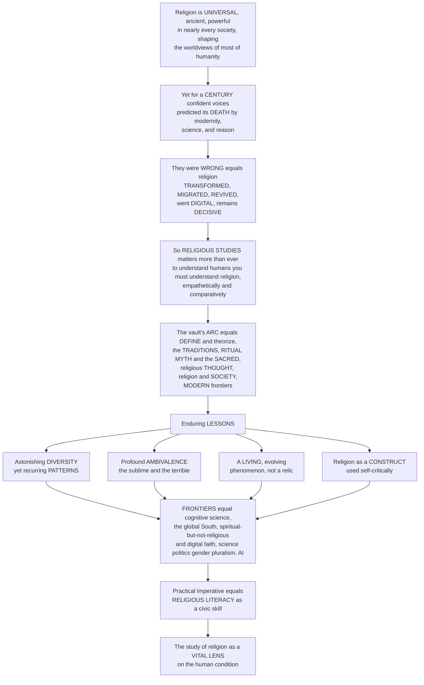

# 🧭 The Reach and Future of Religious Studies

> [!abstract] TL;DR
> **Religion is among the most universal, ancient, and powerful forces in human life** — present in nearly every society, shaping the worldviews of the large majority of humanity, and driving everything from art, ethics, and meaning to identity, cooperation, war, and peace. And yet, for over a century, confident voices predicted its **DEATH**: that modernity, science, and reason would sweep it away. **They were wrong.** Religion did not vanish; it **transformed, migrated, revived, went digital, and remains a decisive force** in the twenty-first-century world of geopolitics, identity, conflict, and meaning. This is why **RELIGIOUS STUDIES** — the empathetic, comparative, critical, *non-confessional* study of religion — matters more than ever: to understand human beings you must understand religion, approached not through the lens of any single faith (or of hostile dismissal) but through the scholarship this vault has surveyed, from **[[Defining_Religion_and_the_Sacred|defining and theorizing religion]]** through the great **traditions**, the machinery of **ritual, myth, and the sacred**, the depths of religious **thought**, and religion's immense role in **society** and its **modern frontiers**. The enduring lessons: religion is astonishingly **DIVERSE yet patterned**, profoundly **AMBIVALENT** (a source of both the sublime *and* the terrible), a **LIVING, evolving** phenomenon rather than a relic, and a **CONSTRUCTED category** we must use self-critically. The frontiers are vivid — the **cognitive science of religion** probing *why* we believe, the surging religion of the **global South**, the **"spiritual but not religious"** and **digital faith** reshaping the sacred, the ongoing negotiations with **science, politics, gender, and pluralism**, and even **AI** raising strange new questions. And beyond the academy lies a practical imperative: in a religiously diverse, interconnected, and often inflamed world, **RELIGIOUS LITERACY** — accurate, empathetic understanding of religion — is an essential civic skill. Understanding the reach and future of religious studies is understanding why the humble, comparative, empathetic study of humanity's religious life is not an antiquarian pursuit but **one of the most vital lenses for making sense of the human condition** — a fitting culmination of this vault.

---

## Intuition

**Analogy:** Imagine you have spent weeks walking a vast cathedral — tracing every column, kneeling to read the crypts, climbing to inspect the vaults and the stained glass one pane at a time. Now, at the very end, you step back out through the great doors, turn around, and for the first time take in **the whole building at once**. Only from here — the full elevation against the sky — can you see what all those parts were *for*: how the buttresses hold up the nave, how the light was engineered to fall on the altar, how a single design logic runs through a thousand details. This capstone is that step back. Having toured how to *define* religion, the great *traditions*, the machinery of *ritual and myth*, the depths of religious *thought*, and religion in *society* and its *modern frontiers*, we finally ask the whole-building question: **what is the study of religion for, and where is it going?**

And here is the twist that makes the view worth the climb. For a hundred years, the confident forecast of educated modernity was that this cathedral — religion itself — was a **ruin in slow collapse**, that the tide of science and reason would empty it and one day the doors would simply be locked forever. That forecast **failed**. Step back and look honestly and you do not see a ruin at all: you see a building constantly **rebuilt, extended, relocated, and re-consecrated** — congregations shrinking in one wing while whole new naves are raised in the global South, side chapels going digital, the very *definition* of "cathedral" being argued over by the people inside it. Religion did not die. It **changed, moved, revived, and adapted** — which is exactly why understanding it, empathetically and comparatively, is not the study of a dead past but one of the sharpest lenses we have on the living human being.

---

## How It Works

### Core Mechanics

The capstone works by **synthesis**: it does not add a new topic so much as reveal the shape of everything already covered, and then point forward. It proceeds in six moves.

1. **State the grand fact.** Religion is one of the most **universal, ancient, powerful, and consequential** forces in human life — found in nearly every society across history, shaping the worldviews of most of humanity, and entangled with art, ethics, meaning, identity, politics, cooperation, war, and peace. Any account of human beings that ignores it is not merely incomplete; it is disfigured.

2. **Confront the failed prophecy.** The dominant twentieth-century social-scientific expectation — the **[[Secularization_and_the_Sociology_of_Belief|secularization thesis]]** — held that modernization would erode religion toward irrelevance. In parts of Western Europe, individual-level religiosity did decline. **Globally, it did not.** Religion **persisted, transformed, migrated, revived, and went digital**; the world today is, if anything, *more* religious than a century ago, driven by the demographic growth of the religious South. The confident "death of religion" is the field's most instructive **wrong prediction**.

3. **Justify the discipline.** Because religion neither vanished nor is reducible to something else, it demands its own **empathetic, comparative, critical, non-confessional** study — the stance developed across the vault's **[[Methods_in_the_Study_of_Religion|methods]]** and **[[The_Comparative_Study_of_Religion|comparative]]** foundations. Religious studies is neither theology (advocacy from inside a faith) nor hostile debunking (dismissal from outside), but disciplined *understanding*.

4. **Recap the arc.** The vault's journey **equals** its argument: FOUNDATIONS (defining and theorizing religion, phenomenology, method), the great TRADITIONS, RITUAL / MYTH / the SACRED, religious THOUGHT and THEOLOGY, religion and SOCIETY, and MODERN frontiers. Each stage supplies a piece of the whole elevation.

5. **Distil the enduring lessons.** Six insights recur: (i) **diversity and pattern**; (ii) the deep **ambivalence** of religion; (iii) religion as a **living, evolving** phenomenon; (iv) "religion" as a **constructed, contested category** demanding reflexivity; (v) the structuring **insider/outsider** and **reduction/meaning** tensions; and (vi) religion's **entanglement** with every domain of human life.

6. **Turn to the future and the street.** The **frontiers** (cognitive science of religion, the global South, digital and "unaffiliated" spirituality, science/politics/gender/pluralism, AI, the material and lived turns, decolonizing critique) meet a **practical imperative**: **religious literacy** as a civic skill in a diverse and often inflamed world.

### Flow / Architecture



---

## Key Concepts

### Secondary Level

**People kept predicting religion would die — and it did not.** For about a hundred years, many educated people were sure that as the world got modern — full of science, machines, universities, and cities — religion would slowly shrink and disappear. This idea is called **secularization**. In some places, like much of Europe, fewer people do go to church now. But across the whole world the opposite happened: **there are more religious people than ever**, and religion is loud in politics, identity, and conflict. It did not vanish — it **changed, moved to new places, came back to life, and even went online**.

**Why study religion at all?** Because you cannot really understand human beings without it. Religion has shaped art, music, laws, holidays, wars, and what billions of people think life *means*. **Religious studies** is a special way of studying religion: not to convert you and not to attack religion, but to **understand it fairly and with empathy** — and to *compare* religions to see what they share and how they differ.

**The big lessons of this whole vault:**
- Religions are **incredibly different** from each other, yet they keep **repeating the same building blocks** — the sacred, rituals, myths, ideas about good and evil and what happens after death.
- Religion has **two faces**: it can inspire the most beautiful and kind things (art, charity, community, peace) *and* the most terrible (violence, oppression, division). It is **not simply good or bad.**
- Religion is **alive** — always changing and inventing new forms, not a frozen relic.
- Even the word **"religion"** is something scholars made up and argue about, so we have to use it carefully.

**Why it matters today: religious literacy.** In a world where people of many faiths live side by side and religion is often part of the news and of conflicts, knowing how to understand religion **accurately and respectfully** is a real skill — one that helps reduce fear and fighting and helps people live together.

| Idea | Plain meaning |
|---|---|
| **Secularization** | the (partly wrong) prediction that religion would fade with modernity |
| **Religious studies** | fair, empathetic, comparing study of religion — not preaching, not attacking |
| **Ambivalence** | religion can produce both wonderful and terrible things |
| **Religious literacy** | understanding religion accurately and empathetically as a civic skill |

---

### Undergraduate Level

#### The failed prophecy and religion's persistence

The intellectual backdrop of the field's present confidence is a famous **falsified forecast**. From the Enlightenment through the founding sociologists, the **[[Secularization_and_the_Sociology_of_Belief|secularization thesis]]** predicted that modernization — science, urbanization, education, institutional differentiation — would steadily erode religion's plausibility and public authority. Western Europe partly fit. The wider world did not. The late twentieth century delivered the **Iranian Revolution**, the American **Christian Right**, resurgent **political Islam**, **Hindu nationalism**, and the explosive Southern-Hemisphere growth of **Pentecostalism** (the resurgence analyzed in **[[Fundamentalism_and_Religious_Revival]]**). Peter Berger — once a leading secularization theorist — publicly recanted, declaring the assumption "that we live in a secularized world is false," and edited a volume titled *The Desecularization of the World*. The corrected picture is not "religion is immortal" but **religion is persistent and, above all, transforming**: declining in some individual-level measures in some regions, yet globally *growing* through demography and constantly **reinventing** its forms.

#### Why a distinct discipline — the non-confessional, comparative stance

Because religion is neither disappearing nor straightforwardly reducible to economics, psychology, or politics, it warrants its own mode of study. Religious studies is defined against two temptations: **theology** (normative reflection from *within* a tradition) and **reductive dismissal** (explaining religion *away* from without). Its signature is the **empathetic-yet-critical**, **comparative**, **non-confessional** approach mapped in the vault's foundations — **[[The_Comparative_Study_of_Religion]]** and **[[Methods_in_the_Study_of_Religion]]** — holding in tension the **insider/outsider** problem (understanding a tradition as believers do *and* analyzing it from outside) and the **reduction/meaning** debate (whether religion is "nothing but" something else or a *sui generis* domain of meaning, the wager of **[[Defining_Religion_and_the_Sacred|phenomenology]]**).

#### The arc of the vault as an argument

The six sections are not a list but a *sequence*: (1) **Foundations** — defining and theorizing religion, comparison, phenomenology, method; (2) the major **Traditions** — Hinduism, Buddhism, Judaism, Christianity, Islam, East Asian and Indigenous religions; (3) **Ritual, Myth, and the Sacred** — ritual, myth, sacred symbols/space/time, mysticism, scripture, pilgrimage; (4) religious **Thought and Theology** — the divine/ultimate reality, evil, salvation, faith and reason, ethics and law (the terrain of **[[Theology_and_Religious_Doctrine]]**); (5) religion and **Society** — social order, secularization, politics, violence, gender, fundamentalism; and (6) **Modern frontiers** — new movements, global religion, science, cognitive science, digital religion. Read together they show religion as a total human phenomenon with a *legible structure*.

#### The enduring lessons

Five deep takeaways survive the tour:
- **Diversity and pattern.** Beneath dazzling variety recur the same structures — the **sacred**, **ritual**, **myth**, ideas of **salvation** — the finding that makes **[[The_Comparative_Study_of_Religion|comparison]]** possible without erasing difference.
- **Ambivalence.** Religion is a wellspring of both the **sublime** (meaning, compassion, beauty, community, peacebuilding) and the **terrible** (violence, oppression, exclusion). It has no single moral valence.
- **A living phenomenon.** Religion is dynamic and adaptive — perpetually generating **new movements** and **digital** forms — not a static survival awaiting extinction.
- **A constructed category.** "Religion" itself is a historically situated, contested **concept** (largely a modern, Western-inflected one), which is why the field must be **reflexive** and self-critical about its own basic term.
- **Deep entanglement.** Religion is interwoven with every domain of human life, which is the source of its vast **reach** across the disciplines.

#### The reach — religion as a connective node

Religious studies is intrinsically **interdisciplinary**. To study religion is to touch **history** (traditions unfold in time), **anthropology** (religion as culture and practice — **[[Religion_Magic_and_Ritual]]**), **sociology** (religion and social order — **[[Religion_Sacred_and_Secular]]**), **psychology** and **cognitive science** (belief, experience), **philosophy** (God, evil, faith and reason — **[[Faith_and_Reason]]**), **politics**, **art**, **[[The_Comparative_Method|mythology]]**, ethics, and **[[Science_and_Religion|science]]**. Religion sits near the *center* of the map of the humanities and social sciences — a hub through which questions about meaning, morality, community, and cosmos all pass.

#### The frontiers and the civic imperative

The field's growing edges: the **cognitive and evolutionary science of religion** (why the mind is prone to belief); the **global** shift (the religious South, migration, transnational and diaspora religion); the **"nones," "spiritual but not religious,"** and **digital** religion reshaping the sacred; the "**material**," "**lived**," and "**sensory**" turns (religion as embodied practice, not just doctrine); and the **decolonizing / critical** rethinking of the discipline and of the "world religions" model. Beyond scholarship, the **practical imperative** is **religious literacy** (Stephen Prothero): a diverse, interconnected, and frequently religiously-inflamed world needs citizens, journalists, diplomats, clinicians, and policymakers who can read religion *accurately and empathetically* — a skill that reduces conflict and counters both extremism and anti-religious prejudice.

---

### Graduate Level

#### From decline to transformation: the post-secularization settlement

The mature scholarly position discards the naive secularization *master-narrative* without embracing a naive "return of religion." Three refinements structure the consensus. First, **disaggregation**: secularization is really several distinct claims — declining *belief*, declining *practice*, declining *institutional authority* (differentiation), and privatization — which vary independently and by region; conflating them produced the failed unitary forecast. Second, **demography as the decisive variable**: Pew-type projections show the *religiously unaffiliated share of the world population* peaking and then **declining** through the twenty-first century, because the most religious populations have the highest fertility and the youngest age structures — so even amid Northern individual-level secularization, the **globe becomes more religious**, not less. Third, **the market and supply-side reframings** (religious-economy theory; strictness-breeds-strength) that treat pluralism and competition as *stimulating* rather than dissolving religious vitality. The upshot for the field: the interesting question is no longer "*when* will religion die?" but "*how* is religion being transformed, relocated, and reassembled?"

#### The reflexive turn and the constructed category

A defining feature of contemporary religious studies is its **reflexivity** about its own object. Following J. Z. Smith ("*religion* is solely the creation of the scholar's study"), Talal Asad's genealogy of the concept, and Tomoko Masuzawa's *The Invention of World Religions*, the field increasingly treats **"religion"** and the **"world religions" paradigm** as historically produced, power-laden constructs — shaped by Christian theology, European colonial encounter, and the modern nation-state's need to classify and govern belief. This **critical / genealogical turn** does not abolish the category (we still need *some* comparative term) but insists it be used **self-consciously**, attentive to what it includes, excludes, and distorts (for instance, forcing non-doctrinal, practice-centered, or Indigenous lifeways into a Protestant-shaped mold of "belief"). The reflexive stance is the discipline's answer to the charge that comparison inevitably colonizes its objects.

#### The frontier research agenda

Several programs define the field's leading edge, each with its own methods and controversies:
- **Cognitive Science of Religion (CSR).** Pascal Boyer, Justin Barrett, and others model religious concepts as by-products of ordinary cognitive systems — **HADD** (a hyperactive agency-detection device), **theory of mind**, **minimally counterintuitive** concept memorability — while a rival **adaptationist** camp (costly signaling, big-gods prosociality, group cohesion) treats religion as fitness-enhancing. The unresolved **by-product vs adaptation** debate is a central frontier.
- **Global and Southern religion.** Philip Jenkins's *The Next Christendom* reframed Christianity's demographic center of gravity as *Southern*; parallel work tracks transnational Islam, migration, diaspora congregations, and **glocalization** of religious forms.
- **Digital and lived religion.** Studies of online ritual, virtual community, algorithmic mediation, and the **"spiritual but not religious"** intersect the **material/lived-religion** turn (Robert Orsi, Meredith McGuire) that relocates the object from doctrine and institutions to **embodied, everyday practice**.
- **Religion, science, gender, and pluralism.** Ongoing renegotiations — the science-and-religion interface (beyond the "conflict thesis," see **[[Science_and_Religion]]**), gender and sexuality, and the governance of religious pluralism in liberal states.
- **AI and the emergent.** New and genuinely open questions: AI "chaplains" and scripture chatbots, algorithmic authority, techno-spiritualities and the metaverse, and what machine "agents" do to categories like ritual, revelation, and the sacred.

#### The persistent big questions and the ethics of the field

Four questions organize the discipline's future and will not be settled soon: **Is religion declining or merely transforming?** **Is "religion" a human universal or a Western construct?** **Is religiosity an evolutionary adaptation or a cognitive by-product?** **Is religion, on balance, a force for good or ill?** Precisely because none has a clean answer, the field's value lies less in final verdicts than in the *quality of understanding* it cultivates. That points to an **ethical** and **civic** dimension often underplayed in the sciences: the scholar of religion bears a responsibility to foster **understanding across difference**, and the field's most consequential export may be **religious literacy** itself — Prothero's argument that ignorance of religion is a public danger, disabling citizens from reading their own history, laws, art, and conflicts. In an interconnected and often religiously inflamed world, empathetic and accurate understanding of religion is not a scholarly luxury but a **condition of coexistence**.

#### Why it matters

The reach and future of religious studies reveal why the humble, comparative, empathetic study of humanity's religious life is not an antiquarian pursuit but **one of the most vital lenses for making sense of the human condition**. Religion is among the most universal, ancient, and powerful forces in human life, found in nearly every society and shaping the worldviews of most of humanity — yet for over a century confident voices predicted its death at the hands of modernity, science, and reason, and **they were wrong**, for religion did not vanish but transformed, migrated, revived, went digital, and remains a decisive force in a twenty-first-century world of geopolitics, identity, conflict, and meaning. This is why religious studies matters more than ever: to understand human beings one must understand religion, approached not through any single faith or hostile dismissal but through the empathetic, comparative, critical scholarship this vault has surveyed — from **[[Defining_Religion_and_the_Sacred|defining and theorizing religion]]** through the great traditions, the machinery of ritual, myth, and the sacred, the depths of religious thought, and religion's immense social role and modern frontiers. The enduring lessons are that religion is astonishingly **diverse yet patterned**, profoundly **ambivalent** as a source of both the sublime and the terrible, a **living and evolving** phenomenon rather than a relic, and a **category we must use self-critically**, while its vivid future frontiers and the urgent civic imperative of **religious literacy** make the study of religion an indispensable key to the human condition — and a fitting culmination of this vault.

---

## Python Demo

Two synthesis plots for the capstone. Part **(a)** dramatizes **religion's persistence and the failed prediction**: it contrasts the confident twentieth-century **secularization forecast** (global religiosity forecast to decay toward zero with modernization) against the **actual global trajectory** — Northern individual-level decline *offset and overwhelmed* by the demographic growth of the religious **South**, so that global religiosity **persists and rises** even as the religiously **unaffiliated ("nones")** share peaks and then *falls* as a share of world population. The "death of religion" prediction **fails**. Part **(b)** models the field's shifting **research frontiers** as an emerging-topics **stackplot**: the decline of the classical world-religions/phenomenology survey and the rise of the **cognitive science of religion**, **global/Southern religion**, **lived/material** religion, **digital** religion, and the **critical / world-religions-paradigm** turn. Requires only `numpy` and `matplotlib`.

```python
"""
The Reach and Future of Religious Studies: two synthesis sketches.

(a) PERSISTENCE vs the FAILED PREDICTION - the confident secularization forecast
    (global religiosity -> 0 with modernity) versus the ACTUAL trajectory: Northern
    decline is swamped by the DEMOGRAPHIC growth of the religious SOUTH, so global
    religiosity PERSISTS/RISES while the "nones" share PEAKS then FALLS as a world share.
(b) SHIFTING FRONTIERS - the field's research attention over time as an emerging-topics
    stackplot: the classical world-religions/phenomenology survey declines while the
    cognitive science of religion, global/Southern religion, lived/material religion,
    digital religion, and the critical/world-religions-paradigm turn all rise.
"""

import numpy as np
import matplotlib.pyplot as plt


def logistic(t, t0, k):
    """Smooth 0->1 transition centered at t0 with steepness k."""
    return 1.0 / (1.0 + np.exp(-k * (t - t0)))


# ----------------------------------------------------------------------
# (a) PERSISTENCE vs the FAILED "death of religion" PREDICTION
# ----------------------------------------------------------------------
year = np.linspace(1900, 2100, 400)

# The confident SECULARIZATION forecast: religiosity decays toward zero with modernity
pred_secular = 0.92 * np.exp(-0.018 * (year - 1900))

# ACTUAL global religiosity: a shallow mid-century dip (Northern decline) then a RISE,
# because the most religious populations grow fastest (demography of the global South)
actual_global = 0.86 - 0.06 * logistic(year, 1965, 0.06) + 0.11 * logistic(year, 2010, 0.05)

# The religiously UNAFFILIATED ("nones") share of WORLD population: rises, PEAKS ~2015,
# then DECLINES as a share of the world because the unaffiliated have low fertility
nones = 0.02 + 0.15 * logistic(year, 1995, 0.05) - 0.06 * logistic(year, 2025, 0.05)

# Share of the world's religious people living in the global SOUTH: steadily rising
south_share = 0.38 + 0.42 * logistic(year, 2000, 0.028)

# ----------------------------------------------------------------------
# (b) SHIFTING RESEARCH FRONTIERS of the field (emerging-topics stackplot)
# ----------------------------------------------------------------------
yr = np.arange(1970, 2031)

classical = 1.00 * (1.0 - 0.62 * logistic(yr, 2000, 0.14))   # world-religions / phenomenology survey (declining)
global_s  = 0.70 * logistic(yr, 1998, 0.16)                  # global / Southern religion (Jenkins 2002)
critical  = 0.60 * logistic(yr, 2003, 0.17)                  # critical / world-religions-paradigm turn (Masuzawa 2005)
csr       = 0.65 * logistic(yr, 2004, 0.24)                  # cognitive science of religion (Boyer 2001)
lived     = 0.55 * logistic(yr, 2006, 0.20)                  # lived / material / sensory turn (Orsi, McGuire)
digital   = 0.60 * logistic(yr, 2013, 0.28)                  # digital religion / the "nones"

topics = np.vstack([classical, global_s, critical, csr, lived, digital])
topics = topics / topics.sum(axis=0)                          # normalize to shares of attention
labels = ["Classical world-religions / phenomenology survey",
          "Global / Southern religion",
          "Critical / world-religions-paradigm turn",
          "Cognitive science of religion",
          "Lived / material / sensory turn",
          "Digital religion / the 'nones'"]
colors = ["#9e9e9e", "#1b9e77", "#7570b3", "#d95f02", "#66a61e", "#e7298a"]

# ----------------------------------------------------------------------
# PLOTS
# ----------------------------------------------------------------------
fig, (ax1, ax2) = plt.subplots(1, 2, figsize=(15, 6))

# Panel (a)
ax1.plot(year, pred_secular, color="gray", lw=2.4, ls="--",
         label="secularization FORECAST (religion -> 0)")
ax1.plot(year, actual_global, color="crimson", lw=2.8,
         label="ACTUAL global religiosity (persists & rises)")
ax1.plot(year, nones, color="steelblue", lw=2.0, ls=":",
         label="'nones' share of WORLD (peaks ~2015, then falls)")
ax1.plot(year, south_share, color="darkgreen", lw=2.0, ls="-.",
         label="religious world living in global SOUTH")
ax1.axhline(0.0, color="black", lw=0.6)
ax1.annotate("the FAILED prediction:\nreligion did NOT vanish",
             xy=(2080, 0.10), xytext=(1935, 0.30),
             arrowprops=dict(arrowstyle="->"), fontsize=9, color="gray")
ax1.annotate("it TRANSFORMED & MIGRATED\n(demography of the South)",
             xy=(2060, actual_global[np.argmin(np.abs(year - 2060))]),
             xytext=(1955, 0.95), arrowprops=dict(arrowstyle="->"),
             fontsize=9, color="crimson")
ax1.set_xlabel("year")
ax1.set_ylabel("share (of population, normalized)")
ax1.set_ylim(-0.03, 1.05)
ax1.set_title("(a) Persistence vs the failed 'death of religion' prediction")
ax1.legend(loc="center left", fontsize=8)

# Panel (b)
ax2.stackplot(yr, topics, labels=labels, colors=colors, alpha=0.9)
ax2.set_xlabel("year")
ax2.set_ylabel("share of research attention")
ax2.set_ylim(0, 1)
ax2.set_xlim(yr.min(), yr.max())
ax2.set_title("(b) Shifting frontiers of religious studies")
ax2.legend(loc="lower center", fontsize=7.2, ncol=1, framealpha=0.9)

plt.tight_layout()
plt.savefig("reach_and_future_of_religious_studies.png", dpi=120)
plt.show()

# ----------------------------------------------------------------------
i2100 = -1
print(f"Secularization FORECAST for 2100:      {pred_secular[i2100]:.2f}  (predicted near-collapse)")
print(f"ACTUAL global religiosity in 2100:     {actual_global[i2100]:.2f}  (persists / rises)")
print(f"'Nones' share of world, peak value:    {nones.max():.2f} near year {year[np.argmax(nones)]:.0f}")
print(f"Global-South share of religious world: {south_share[0]:.2f} (1900)  ->  {south_share[i2100]:.2f} (2100)")
csr_2030 = topics[3, -1]
print(f"Cognitive-science-of-religion attention share by 2030: {csr_2030:.2f}")
```

**What the output shows.** Panel (a): the grey dashed **forecast** slides toward zero — the confident twentieth-century prediction that modernity would end religion. The red **actual** line refuses to follow: after a shallow mid-century dip (real Northern secularization) it **rises**, because the world's most religious populations grow fastest — religion **transformed and migrated** rather than died. The blue **"nones"** curve captures the genuine nuance — the unaffiliated *do* surge — but as a *share of the world* they **peak around 2015 and then decline**, swamped by the demographic growth of the religious **South** (green). Panel (b): the field's attention **reallocates** — the classical world-religions/phenomenology survey (grey) shrinks from dominance while the **cognitive science of religion**, **global/Southern**, **lived/material**, **digital**, and **critical** programs expand to fill the space. Together the panels are the capstone's thesis in two pictures: religion **persists and transforms**, and the *study* of it is a living, reorienting discipline — not the autopsy a century of forecasters expected to be writing.

---

## Real-World Applications

- **Diplomacy and foreign policy.** The U.S. State Department's Office of Religion and Global Affairs and the wider "religious engagement" turn in diplomacy exist because ignoring religion produced costly misreadings — of the Iranian Revolution, of sectarian conflict, of the Balkans. **Religious literacy** is now treated as tradecraft for analysts and negotiators working in a religiously charged world.
- **Medicine and healthcare.** Hospital **chaplaincy**, cultural-competence training, and research on religion and health translate comparative religious understanding into clinical practice — reading patients' beliefs about suffering, end-of-life, diet, and ritual so care is neither dismissive nor coercive.
- **Journalism and public understanding.** Stephen Prothero's *Religious Literacy* argues that a public unable to identify basic religious facts cannot understand its own politics, art, or conflicts. Newsroom religion desks, fact-checking of religious claims, and coverage of the global resurgence all depend on the non-confessional literacy this field cultivates.
- **Counter-extremism and peacebuilding.** Programs distinguishing mainstream traditions from militant fringes (the analytic core of **[[Fundamentalism_and_Religious_Revival]]** and religion-and-violence scholarship) inform de-radicalization, interfaith mediation, and the design of pluralism policy — precisely by refusing both apologetics and blanket suspicion.
- **The frontier research programs themselves.** The **cognitive science of religion** feeds experimental psychology and the study of belief; **digital religion** research shapes how platforms and communities design online ritual and moderation; **global/Southern religion** work informs migration, development, and NGO practice. The field's own scholarship is its most direct application.

---

## Common Pitfalls

- **Treating secularization as a settled law.** European decline is real but not the global template. Reading "modernity dissolves religion" as an iron law ignores the demographic and supply-side evidence that the world is becoming *more* religious. The lesson is **transformation, not disappearance** — the corrective that defines the contemporary field.
- **Confusing religious studies with theology or with debunking.** The non-confessional stance is neither advocacy from inside a faith nor hostile dismissal from outside. Collapsing the field into either destroys its distinctive value: *understanding* rather than *judging* religion.
- **Mistaking comparison for equation.** Finding recurring patterns (the sacred, ritual, myth, salvation) does *not* mean all religions are "really the same." Flattening genuine difference — the perennial temptation of comparison — is exactly what the reflexive, critical turn guards against.
- **Forgetting that "religion" is a construct.** Using the category naively, as if it were a natural kind that carves reality at its joints, imports a modern, often Protestant-shaped assumption (religion = private belief) that distorts practice-centered, communal, or Indigenous lifeways. Self-critical use of the term is mandatory.
- **Sanitizing away religion's ambivalence.** Both the pious error ("religion is essentially peaceful and good") and the cynical one ("religion is essentially violent and backward") miss the point: religion is **profoundly ambivalent**, a source of the sublime *and* the terrible. Honest study holds both.
- **Reading the capstone as a conclusion rather than an opening.** The point of stepping back is not to declare the subject finished but to see its **living frontiers** — cognitive science, the global South, digital and lived religion, AI, decolonizing critique — and the open big questions that make the study of religion perpetually current.

---

## Related Concepts

- [[Religious_Studies_and_Comparative_Religion_Overview]] — the vault's opening gate; this capstone is its mirror-image close, taking in the whole building the overview first sketched.
- [[The_Comparative_Study_of_Religion]] — the comparative method whose promise (pattern within diversity) and peril (flattening difference) this synthesis weighs and defends.
- [[Defining_Religion_and_the_Sacred]] — the constructed, contested category of "religion" that the capstone insists must be used self-critically.
- [[Methods_in_the_Study_of_Religion]] — the insider/outsider and reduction/meaning tensions that structure the field and recur here as enduring lessons.
- [[Secularization_and_the_Sociology_of_Belief]] — the secularization thesis and its failure; the counter-story this note tells (persistence and transformation) begins there.
- [[Fundamentalism_and_Religious_Revival]] — the vivid empirical proof of the failed prophecy: assertive, modern, reactive religion that blindsided a century of forecasters.
- [[Theology_and_Religious_Doctrine]] — the section-four terrain (God, evil, salvation, faith) that the capstone folds into religion's total reach across human thought.
- [[Religion_Violence_and_Peacebuilding]] — the sharpest case of religion's **ambivalence**, its capacity for both the terrible and the reconciling.
- [[Religion_Sacred_and_Secular]] — the Sociology vault's treatment of the sacred/secular and secularization; a cross-vault anchor for the field's reach.
- [[Religion_Magic_and_Ritual]] — the Anthropology vault's account of religion as culture and practice; part of the interdisciplinary web the capstone maps.
- [[The_Comparative_Method]] — the Mythology vault's comparative apparatus, a sister methodology to comparative religion.
- [[Faith_and_Reason]] — the Philosophy vault's philosophy-of-religion node (God, faith, reason), one spoke of religious studies' reach into the disciplines.
- [[Science_and_Religion]] — the History-of-Science vault's treatment of the science-religion interface, a live frontier the capstone flags.

This note is the **capstone** of *Religious Studies and Comparative Religion* and gathers the vault's whole arc — from *Religious Studies and Comparative Religion Overview*, *The Comparative Study of Religion*, and *Ritual and Religious Practice*, through *Theology and Religious Doctrine*, *Religion and Social Order*, and *Secularization and the Sociology of Belief*, to its section-six siblings *The Cognitive Science of Religion*, *Digital Religion and Contemporary Spirituality*, *Global Religion, Migration, and Diaspora*, and *Fundamentalism and Religious Revival* — which it references in prose as the frontiers and lessons it synthesizes.

---

## Review Questions

1. **(Secondary)** For about a century, people predicted religion would fade away as the world modernized. In one or two sentences, say what actually happened, and give one reason the world is not less religious than before.
2. **(Secondary)** What is "religious literacy," and why is it a useful skill in a world where people of many different faiths live close together?
3. **(Undergraduate)** Explain what makes religious studies distinct from *theology* on one side and from *hostile debunking* on the other. Why does the field prize an "empathetic yet critical, comparative, non-confessional" stance?
4. **(Undergraduate)** Name and briefly explain three of the "enduring lessons" of the vault (diversity/pattern, ambivalence, living phenomenon, constructed category, deep entanglement). Illustrate one with a concrete example.
5. **(Graduate)** Using the demographic argument in Panel (a) of the Python demo, explain how the world can become *more* religious even while the "nones" surge in the global North. What does this imply for how we should now frame the secularization question?
6. **(Graduate)** Pick two frontier research programs (e.g., the cognitive science of religion, global/Southern religion, digital/lived religion, the critical world-religions-paradigm turn). For each, state its central claim, one method, and one live controversy — and say how it reflects religious studies treating "religion" as a category to be used self-critically.

---

## Sources

- Smart, N. *The World's Religions* (2nd ed., 1998) — the classic dimensional, comparative survey and a template for the empathetic, non-confessional study of religion.
- Berger, P. L. (ed.). *The Desecularization of the World: Resurgent Religion and World Politics* (1999) — the influential recantation of the secularization thesis and the case for religion's persistence.
- Prothero, S. *Religious Literacy: What Every American Needs to Know — And Doesn't* (2007) — the argument that religious literacy is an essential civic skill.
- Orsi, R. A. (ed.). *The Cambridge Companion to Religious Studies* (2012) — a state-of-the-field survey of the discipline's methods, debates, and frontiers, including the lived/material turn.
- Jenkins, P. *The Next Christendom: The Coming of Global Christianity* (rev. ed., 2011) — the demographic reframing of religion's center of gravity toward the global South.

---

#religious-studies #future-of-religion #religious-literacy #comparative-religion #study-of-religion
