# 🦾 Forward Kinematics

> [!abstract] TL;DR
> Forward kinematics (FK) answers the *easy* direction of robot geometry: given every joint variable (each revolute angle or prismatic displacement), compute exactly where the end-effector — the hand, gripper, or tool — sits and how it is oriented in space. You do it by attaching a coordinate frame to each link, writing one homogeneous transform per joint (systematically, via the **Denavit-Hartenberg** convention or the **product-of-exponentials** screw form), and multiplying them down the chain: $T_0^n = A_1 A_2 \cdots A_n$. FK is *unique* and *closed-form* — one set of joint angles gives exactly one pose. Its inverse, going from a desired pose back to joint angles, is the genuinely hard problem.

---

## Intuition

**Analogy:** Touch your shoulder, then bend your elbow, then flex your wrist — with your eyes closed you *still* know exactly where your fingertip ended up. Your brain adds up each joint angle down the chain of your arm: the shoulder rotation orients the upper arm, the elbow angle stacks on top of that to place the forearm, the wrist stacks on top of *that* to place the hand. Forward kinematics is that same "add-up-the-joints" calculation for a robot: given every joint angle, compute precisely where the hand is in space.

Technically, each joint contributes a rigid-body motion — a rotation and a translation — expressed relative to the link *before* it. Because each motion is measured in the previous link's own frame, you cannot simply sum angles in general; you must *compose* the transforms, and composition of rigid motions is matrix multiplication. FK is the easy, unambiguous direction of robot geometry: many joint configurations may reach the same point, but any *given* configuration lands the hand in exactly one place.

---

## How It Works

### The kinematic chain

A manipulator is a **kinematic chain**: a series of rigid **links** connected by **joints**. Two joint types dominate:

1. **Revolute (R)** — a hinge; its joint variable is an angle $\theta_i$.
2. **Prismatic (P)** — a slider; its joint variable is a linear displacement $d_i$.

The number of independent joint variables is the robot's **degrees of freedom (DOF)**. A 6-DOF arm can, in principle, reach any position *and* any orientation in its workspace; fewer than 6 DOF means the tool cannot achieve every orientation at every point.

### The recipe

1. **Attach a frame to every link.** Frame $\{0\}$ is the fixed base; frame $\{n\}$ rides on the end-effector.
2. **Write one transform per joint.** The **Denavit-Hartenberg (DH)** convention describes each link with just four numbers — link length $a_i$, link twist $\alpha_i$, link offset $d_i$, and joint angle $\theta_i$ — collapsing the relative motion between consecutive frames into a single $4\times4$ homogeneous matrix $A_i$. Exactly one of the four is the *variable* for that joint (the angle for revolute, the offset for prismatic); the other three are fixed by the robot's mechanical design.
3. **Chain the transforms.** Multiply them in order to get the pose of the end-effector frame expressed in the base frame:
$$T_0^n(q) = A_1(q_1)\, A_2(q_2) \cdots A_n(q_n) = \begin{bmatrix} R & p \\ 0 & 1 \end{bmatrix}$$
The upper-left $3\times3$ block $R$ is the end-effector **orientation**; the upper-right column $p$ is its **position**.

This is where FK borrows directly from graphics and mechanics: the same $4\times4$ homogeneous matrices used to build a *Rigid_Body_Motion_and_Homogeneous_Transforms* pipeline are the atoms of the chain. An alternative to DH — the **product-of-exponentials (PoE)** formulation from screw theory — writes each joint as a matrix exponential $e^{[\mathcal{S}_i]\theta_i}$ of its screw axis, avoiding the sometimes-fiddly DH frame assignment and expressing everything relative to a single fixed base frame.

### Joint space vs task space

The vector of joint variables $q = (q_1, \dots, q_n)$ lives in **joint space** (or configuration space); the resulting pose lives in **task space** (or Cartesian/operational space). FK is precisely the map $q \mapsto T_0^n(q)$ from joint space to task space. It is smooth, single-valued, and cheap. Reversing it — *Inverse_Kinematics* — can have zero, one, many, or infinitely many solutions, and generally needs iterative or algebraic solvers. Differentiating it gives *Velocity_Kinematics_and_the_Jacobian*, and adding masses and forces gives *Robot_Dynamics_and_Equations_of_Motion*. FK is the foundation all three build on.

```mermaid
graph LR
    JV["Joint Variables<br/>q1 q2 ... qn<br/>revolute theta or prismatic d"]:::inp
    DH["DH Parameters per link<br/>a alpha d theta<br/>one variable per joint"]:::param
    A1["Frame 0 to 1<br/>transform A1 of q1"]:::mx
    A2["Frame 1 to 2<br/>transform A2 of q2"]:::mx
    AN["Frame n-1 to n<br/>transform An of qn"]:::mx
    PROD["Chain the transforms<br/>T = A1 A2 ... An"]:::op
    POSE["End-Effector Pose<br/>position p and orientation R<br/>expressed in base frame"]:::out

    JV --> DH
    DH --> A1
    A1 --> A2
    A2 --> AN
    AN --> PROD
    PROD --> POSE

    classDef inp fill:#0f3460,stroke:#e94560,color:#fff
    classDef param fill:#16213e,stroke:#f5a623,color:#ffe0a3
    classDef mx fill:#16213e,stroke:#57a773,color:#a8d8ea
    classDef op fill:#1a1a2e,stroke:#57a773,color:#a8d8ea
    classDef out fill:#0f3460,stroke:#e94560,color:#fff
```



---

## Key Concepts

### Secondary (intuition level)
- A robot arm is a chain of stiff bars (**links**) joined by hinges and sliders (**joints**). Set the joint angles and the hand goes to one definite place.
- **Forward** kinematics is easy: angles in, position out. **Inverse** is hard: position in, which angles?
- Angles do not simply add across links — each hinge turns everything *downstream* of it, so you have to build the arm up one link at a time.

### Undergraduate (mechanism level)
- **Homogeneous transforms:** a $4\times4$ matrix packs a $3\times3$ rotation and a $3\times1$ translation together, so one matrix multiply composes both. Positions carry $w=1$; the chain is a product of these matrices.
- **Denavit-Hartenberg parameters:** the four-number $(a, \alpha, d, \theta)$ recipe for standardizing consecutive link frames, reducing FK bookkeeping to filling a table and multiplying.
- **Revolute vs prismatic joints** and counting **degrees of freedom**; **joint space vs Cartesian space**; the closed-form planar 2-link and 3-link equations.
- **Workspace:** the set of all poses the end-effector can physically reach, obtained by sweeping the joint variables over their limits.

### Graduate (system level)
- **Product-of-exponentials & screw theory:** $T(\theta) = e^{[\mathcal{S}_1]\theta_1}\cdots e^{[\mathcal{S}_n]\theta_n} M$, with twists in $se(3)$ and poses in $SE(3)$ — a coordinate-free formulation avoiding DH frame ambiguity, and the natural language for the manipulator Jacobian.
- **$SE(3)$ as a Lie group:** rigid motions form a group under composition; FK is a map into $SE(3)$, and its derivative lives in the Lie algebra $se(3)$ (the basis for velocity kinematics).
- **Kinematic redundancy** (more DOF than the task needs) and **self-motion manifolds**; **singularities** of the forward map where the Jacobian loses rank.
- **Calibration:** real DH parameters differ from nominal ones due to manufacturing tolerances; kinematic calibration fits the parameters to measured poses so FK matches the physical robot.

---

## Python Demo

```python
# Forward kinematics of a planar n-link arm.
# We chain 2D homogeneous transforms (rotate, then translate along the new x-axis),
# read off every joint position, plot the arm, and sweep joint space to trace the workspace.
import numpy as np
import matplotlib.pyplot as plt

# One planar joint: rotate by theta, then step forward by link length L.
# 3x3 homogeneous transform in 2D:  [ R  t ]
#                                   [ 0  1 ]
def joint_transform(theta, L):
    c, s = np.cos(theta), np.sin(theta)
    return np.array([[c, -s, L * c],
                     [s,  c, L * s],
                     [0,  0, 1.0]])

# Forward kinematics: chain the per-joint transforms, returning EVERY joint position
# (base included) plus the final end-effector transform.
def forward_kinematics(thetas, lengths):
    T = np.eye(3)
    points = [T[:2, 2].copy()]              # base joint at the origin
    for theta, L in zip(thetas, lengths):
        T = T @ joint_transform(theta, L)   # compose down the chain
        points.append(T[:2, 2].copy())      # tip of this link, in the base frame
    return np.array(points), T

# --- A specific 3-link arm configuration ---
lengths = np.array([1.0, 0.8, 0.5])
thetas  = np.deg2rad([40.0, 30.0, -20.0])
pts, T_ee = forward_kinematics(thetas, lengths)
ee = T_ee[:2, 2]

# --- Closed-form check for the classic 2-link arm ---
#   x = L1*cos(t1) + L2*cos(t1 + t2)
#   y = L1*sin(t1) + L2*sin(t1 + t2)
#   phi = t1 + t2                      (end-effector orientation)
t1, t2 = thetas[0], thetas[1]
L1, L2 = lengths[0], lengths[1]
x2 = L1 * np.cos(t1) + L2 * np.cos(t1 + t2)
y2 = L1 * np.sin(t1) + L2 * np.sin(t1 + t2)
print("Chained 2-link joint :", np.round(pts[2], 4))
print("Closed-form 2-link   :", np.round([x2, y2], 4))   # must match

# --- Sweep joint space to trace the reachable workspace ---
grid = np.linspace(-np.pi, np.pi, 36)
cloud = []
for a in grid:
    for b in grid:
        for c in grid[::3]:
            p, _ = forward_kinematics(np.array([a, b, c]), lengths)
            cloud.append(p[-1])
cloud = np.array(cloud)

# --- Plot: arm configuration (left) and workspace (right) ---
fig, (axL, axR) = plt.subplots(1, 2, figsize=(11, 5))

axL.plot(pts[:, 0], pts[:, 1], '-o', lw=3, ms=9, color='#1f77b4', label='links & joints')
axL.plot(ee[0], ee[1], '*', ms=22, color='#e94560', label='end-effector')
axL.plot(0, 0, 's', ms=11, color='black', label='base')
axL.set_title('Arm configuration (chained transforms)')
axL.set_aspect('equal'); axL.grid(True, alpha=0.3); axL.legend()

axR.scatter(cloud[:, 0], cloud[:, 1], s=1, alpha=0.25, color='#57a773')
reach_max = lengths.sum()
axR.set_title(f'Reachable workspace  (outer radius = {reach_max:.1f})')
axR.set_aspect('equal'); axR.grid(True, alpha=0.3)

plt.tight_layout()
plt.show()
```

Running it prints matching numbers for the chained and closed-form 2-link joint (confirming the transform chain reproduces the hand-derived formula) and draws two panels: the arm bent at its three joints with the end-effector starred, and the filled disk of reachable points. If you shorten the *first* link below the sum of the others, the workspace fills a solid disk; if the first link is longer than the rest combined, an unreachable hole opens at the center and the workspace becomes an **annulus** — a direct, visual consequence of the FK equations.

---

## Real-World Applications

- **Industrial arms (KUKA, ABB, FANUC, Universal Robots):** every controller runs FK thousands of times per second to know where the tool tip is from encoder readings — for display, collision checking, and closing the loop after inverse kinematics picks the joint targets.
- **Surgical robots (da Vinci):** FK maps the surgeon-side console joint angles into precise instrument-tip poses inside the patient, enabling motion scaling and tremor filtering.
- **Legged robots and humanoids (Boston Dynamics Spot/Atlas):** FK on each leg's joint chain gives foot positions relative to the body — the basis for balance, footstep planning, and center-of-mass estimation.
- **Character animation & VFX:** the same DH-style chaining drives skeletal rigs, where bone rotations propagate down the skeleton to place hands and feet (see skeletal animation in graphics).
- **CNC and 3D printers:** even Cartesian gantries use FK to relate stepper positions to tool location; delta printers need genuinely nontrivial parallel-mechanism FK.
- **Robot simulators (ROS/MoveIt, Gazebo, PyBullet):** publish a URDF joint chain and the framework computes FK to render the robot and evaluate reach and collisions.

---

## Common Pitfalls

- **Degrees vs radians.** Trig functions expect radians; feeding degrees silently produces a garbage pose. Convert at the boundary and keep one unit internally.
- **Composition order and frame conventions.** $A_1 A_2 \neq A_2 A_1$ — rigid motions do not commute. Multiplying transforms in the wrong order, or mixing pre-multiply (fixed-frame) with post-multiply (body-frame) conventions, misplaces the end-effector.
- **Standard vs modified DH.** Craig's *modified* DH assigns the frame at the *proximal* joint and differs from the *classic* (distal) convention. The two are not interchangeable; a table written for one plugged into the other's formula gives wrong results.
- **Forgetting the tool offset.** DH usually terminates at the wrist; the actual tool (gripper tip, welding torch) sits a fixed transform beyond frame $\{n\}$. Omitting that final tool transform offsets every computed pose.
- **Confusing FK difficulty with IK difficulty.** FK is always closed-form and unique; do not reach for iterative solvers here. Save the numerical machinery for inverse kinematics.
- **Ignoring joint limits when sweeping the workspace.** Sweeping over the full $[-\pi, \pi]$ overstates reach; real joints have mechanical stops, so the true workspace is a subset of the idealized one.
- **Gimbal-style parameterization traps.** Reading orientation back out as Euler angles from $R$ can hit singularities; extract with care (or use quaternions) when reporting end-effector orientation.

---

## Related Concepts

- [[Matrices_and_Determinants]] — the $4\times4$ homogeneous matrices multiplied down the chain are the core object of FK; a singular Jacobian is where the linearized forward map degenerates.
- [[Linear_Transformations]] — each joint transform is a rotation-plus-translation acting on link frames; composing them is composing linear (affine) maps.
- [[Vectors_and_Vector_Spaces]] — positions and axes are vectors in the base frame; joint variables form the configuration-space vector $q$.
- [[Trigonometry]] — the closed-form planar FK equations are built from sines and cosines of summed joint angles.
- [[3D_Transforms_and_Matrices]] — graphics uses the identical homogeneous-transform machinery ($w=1$ points, TRS chains) that FK uses to place the end-effector.
- [[Skeletal_Animation_and_Skinning]] — character rigs propagate bone rotations down a skeleton exactly as FK propagates joint transforms down a manipulator.
- [[Rotational_Dynamics]] — the orientation block $R$ and joint rotations connect to rigid-body rotation; adding inertia and torque turns kinematics into dynamics.
- [[Newtons_Laws_and_Kinematics]] — kinematics (geometry of motion, no forces) vs dynamics (motion under forces); FK is the pure-geometry layer.

---

## Review Questions

1. **(Secondary)** A two-link planar arm has link lengths $L_1 = L_2 = 1$. Both joint angles are set to $0$. Where is the end-effector, and what is its orientation? Now set $\theta_1 = 90°$, $\theta_2 = -90°$ — where does the hand end up, and why did the second joint "cancel" the orientation?
2. **(Undergraduate)** Explain why forward kinematics is a single-valued function while inverse kinematics generally is not. Give a concrete configuration of a 2-link arm that two *different* joint-angle pairs both reach (the "elbow-up / elbow-down" pair), and describe what the workspace looks like when $L_1 > L_2$ versus $L_1 = L_2$.
3. **(Graduate)** Contrast the Denavit-Hartenberg and product-of-exponentials formulations of FK. What ambiguity in DH frame assignment does PoE avoid, and how does the PoE form $T(\theta) = \prod_i e^{[\mathcal{S}_i]\theta_i} M$ make the manipulator Jacobian fall out naturally? At which configurations does the forward map become singular, and what does that mean physically for the arm?

---

## Sources

- Craig, J. J. *Introduction to Robotics: Mechanics and Control*, 4th ed. — Chapters 2-3 (spatial descriptions, transformations) and 3 (manipulator kinematics, DH parameters).
- Lynch, K. M. & Park, F. C. *Modern Robotics: Mechanics, Planning, and Control* (2017) — Chapter 4, forward kinematics via the product-of-exponentials formulation. [Free at modernrobotics.org](https://hades.mech.northwestern.edu/index.php/Modern_Robotics)
- Spong, M. W., Hutchinson, S. & Vidyasagar, M. *Robot Modeling and Control*, 2nd ed. — Chapter 3, forward and inverse kinematics.
- Siciliano, B., Sciavicco, L., Villani, L. & Oriolo, G. *Robotics: Modelling, Planning and Control* (Springer, 2009) — Chapter 2, kinematics of manipulators.
- [Denavit-Hartenberg parameters — Wikipedia](https://en.wikipedia.org/wiki/Denavit%E2%80%93Hartenberg_parameters)

---

#robotics #forward-kinematics #dh-parameters #manipulators #kinematic-chain
