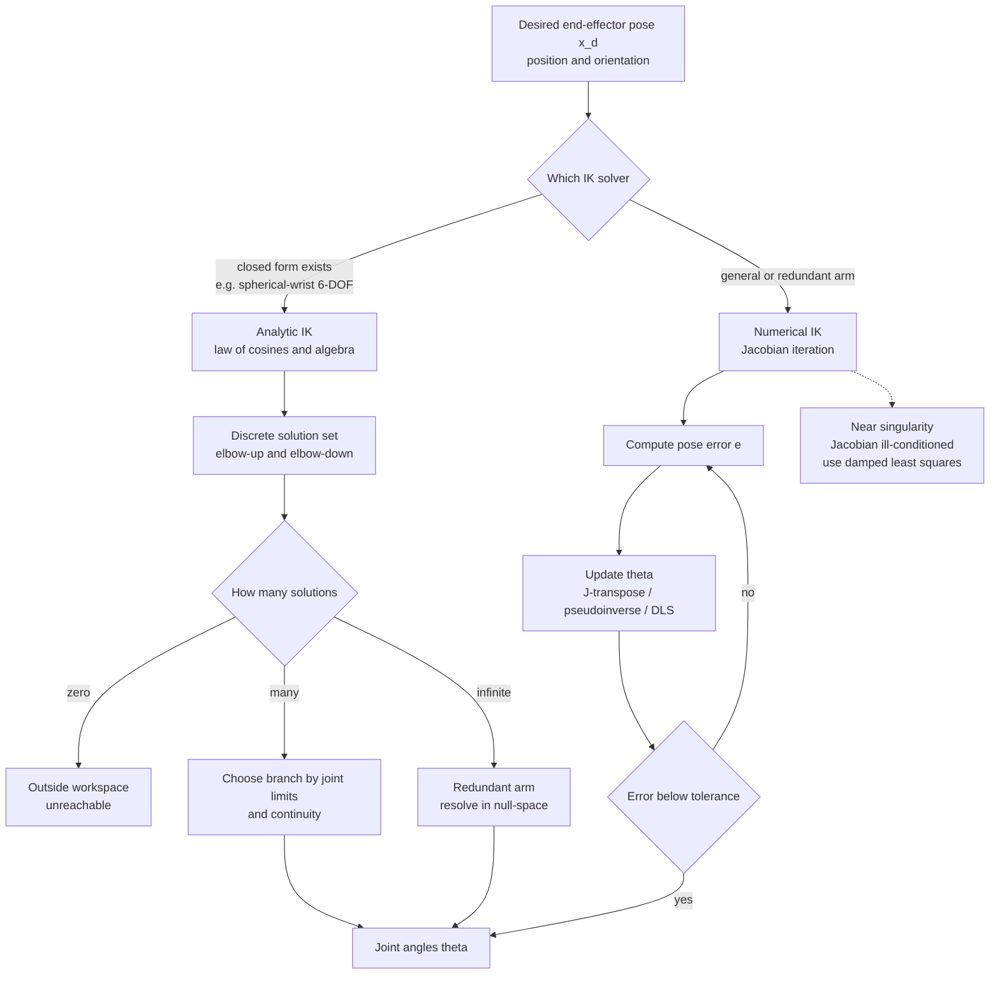

# 🦾 Inverse Kinematics

> [!abstract] TL;DR
> Inverse kinematics (IK) is the backwards problem of robot geometry: given a *desired end-effector pose* (where the hand should be), solve for the *joint variables* (angles or displacements) that place it there. Unlike forward kinematics, IK is nonlinear and can have **many** solutions, **no** solution (outside the workspace), or **infinitely many** (redundant robots) — so it is solved either in closed form when the geometry allows, or numerically by iterating on the Jacobian.

---

## Intuition

**Analogy:** When you reach for a coffee cup, you never consciously compute your shoulder and elbow angles — you just fix your eyes on the target and your arm sorts out the joints. But notice two things. First, you could grab that same cup with your elbow held *high* or held *low*: the same hand position corresponds to more than one arm configuration. Second, a cup on the far side of the room is simply unreachable no matter how you contort. Inverse kinematics is that hard, backwards question made precise — *given where you want the hand, find the joint angles* — and its answer may be many configurations, exactly one, none at all, or (if you have a spare joint like a wrist you can rotate freely) an entire continuum.

Forward kinematics is the easy direction: plug joint angles into the geometry and read off the hand pose. IK reverses the arrow, and reversing it turns a plug-and-evaluate calculation into a nonlinear equation-solving problem.

---

## How It Works

### Core Mechanics

1. **State the target.** Specify the desired end-effector pose `x_d` — position, and for spatial robots orientation too (6 numbers for full pose).
2. **Ask whether a closed form exists.** For special geometries (notably a 6-DOF arm with a **spherical wrist** where the last three axes intersect at a point), the position and orientation subproblems *decouple* and you can write the joint angles as explicit trigonometric formulas. This is **analytic IK**: exact, fast, and it enumerates *all* solution branches.
3. **Otherwise iterate numerically.** For general or redundant arms, treat IK as root-finding on the pose error `e = x_d - f(theta)`, where `f` is forward kinematics. Linearize with the **Jacobian** `J = df/dtheta` and repeatedly step the joints to shrink `e`:
   - **Jacobian transpose:** `dtheta = alpha * Jᵀ e` — cheap, no inversion, but slow and step-size sensitive (it is gradient descent on `½‖e‖²`).
   - **Pseudoinverse:** `dtheta = J⁺ e` — Newton-like, fast near the solution, but blows up near singularities.
   - **Damped least squares (Levenberg-Marquardt):** `dtheta = Jᵀ(JJᵀ + λ²I)⁻¹ e` — trades a little accuracy for numerical stability, staying well-behaved through singularities.
4. **Handle multiplicity.** Analytic IK returns a discrete set (elbow-up / elbow-down, wrist-flip, base-flip). Pick a branch using joint limits, continuity with the previous pose, and obstacle avoidance.
5. **Resolve redundancy.** If the robot has more DOF than the task needs, `J` has a nontrivial **null space**. Project a secondary objective (avoid joint limits, dodge obstacles, stay away from singularities) into that null space: `dtheta = J⁺ e + (I - J⁺J) z`, where `z` is the secondary gradient and `(I - J⁺J)` leaves the primary task untouched.

### Flow / Architecture



---

## Key Concepts

**Secondary (build the picture):**
- **The backwards question.** Forward kinematics goes joints → hand; inverse kinematics goes hand → joints.
- **Multiple ways to reach the same spot.** Elbow-up and elbow-down both put the hand on the target.
- **Some places you cannot reach.** The set of reachable poses is the **workspace**; ask for a point outside it and there is no answer.

**Undergraduate (the mechanics):**
- **Nonlinearity.** `f(theta)` is built from sines and cosines, so IK is a system of nonlinear equations — no single matrix inverse solves it.
- **Analytic vs numerical.** Closed-form IK gives exact, all-branch solutions but only for special geometries; numerical IK works for any robot but returns one solution near your initial guess.
- **The Jacobian `J`.** The matrix of partial derivatives `dx/dtheta` linking joint velocities to end-effector velocities; it is the engine of every numerical IK method.
- **Pseudoinverse `J⁺`.** The least-squares generalized inverse used when `J` is non-square (redundant or over-constrained tasks).

**Graduate (the deep structure):**
- **Solution structure.** A 6R arm can have up to 16 real IK solutions in general; the spherical-wrist decoupling is what makes closed form tractable.
- **Damped least squares.** Levenberg-Marquardt damping `(JJᵀ + λ²I)⁻¹` regularizes the ill-conditioned inverse near singularities; the damping `λ` trades tracking error for stability.
- **Singularities.** Configurations where `J` loses rank: the manipulator loses an instantaneous DOF, `J⁺` explodes, and certain Cartesian directions become momentarily unattainable. Detect via the smallest singular value or the manipulability index `sqrt(det(JJᵀ))`.
- **Redundancy resolution.** With `m` task DOF and `n > m` joints, the `(n - m)`-dimensional null space of `J` carries **self-motions** that reposition the elbow without moving the hand — the substrate for secondary objectives.

---

## Python Demo

```python
# Inverse kinematics of a planar 2-link arm:
#   (a) ANALYTIC IK  -> closed-form law-of-cosines, both elbow-up / elbow-down solutions
#   (b) NUMERICAL IK -> Jacobian-pseudoinverse iteration converging from a guess,
#                       plus a target OUTSIDE the workspace that fails to converge.
import numpy as np
import matplotlib.pyplot as plt

L1, L2 = 1.0, 0.8                        # link lengths -> reach in [|L1-L2|, L1+L2] = [0.2, 1.8]

def forward_kinematics(theta):
    """Return (elbow, end-effector) positions for theta = [t1, t2]."""
    t1, t2 = theta
    elbow = np.array([L1*np.cos(t1), L1*np.sin(t1)])
    end   = elbow + np.array([L2*np.cos(t1+t2), L2*np.sin(t1+t2)])
    return elbow, end

def jacobian(theta):
    """2x2 Jacobian d(end-effector)/d(theta)."""
    t1, t2 = theta
    return np.array([
        [-L1*np.sin(t1) - L2*np.sin(t1+t2), -L2*np.sin(t1+t2)],
        [ L1*np.cos(t1) + L2*np.cos(t1+t2),  L2*np.cos(t1+t2)],
    ])

# ---------- (a) ANALYTIC IK: closed form, two solution branches ----------
def analytic_ik(target):
    """Elbow-down and elbow-up joint solutions, or None if the target is unreachable."""
    x, y = target
    c2 = (x*x + y*y - L1**2 - L2**2) / (2*L1*L2)      # law of cosines
    if abs(c2) > 1.0:
        return None                                   # outside the annular workspace
    s2 = np.sqrt(1 - c2**2)
    sols = []
    for sign in (+1, -1):                             # +1 elbow-down, -1 elbow-up
        t2 = np.arctan2(sign*s2, c2)
        t1 = np.arctan2(y, x) - np.arctan2(L2*np.sin(t2), L1 + L2*np.cos(t2))
        sols.append(np.array([t1, t2]))
    return sols

# ---------- (b) NUMERICAL IK: Jacobian-pseudoinverse gradient step ----------
def numerical_ik(target, theta0, max_iter=200, tol=1e-4, step=0.4):
    theta, history = np.array(theta0, float), [np.array(theta0, float)]
    for _ in range(max_iter):
        _, end = forward_kinematics(theta)
        err = np.array(target) - end
        if np.linalg.norm(err) < tol:
            return theta, history, True
        theta = theta + step * (np.linalg.pinv(jacobian(theta)) @ err)   # pseudoinverse step
        history.append(theta.copy())
    return theta, history, False                      # did not converge

# ================= run =================
target     = np.array([1.0, 0.8])        # reachable (|target| = 1.28, inside [0.2, 1.8])
far_target = np.array([2.5, 0.5])        # unreachable (|target| = 2.55 > 1.8)

sols                      = analytic_ik(target)
theta_num, hist, ok       = numerical_ik(target,     theta0=[0.2, 0.4])
_,          _,    ok_far  = numerical_ik(far_target, theta0=[0.2, 0.4])

# ================= plot =================
fig, ax = plt.subplots(1, 2, figsize=(12, 5))

# left: two analytic solutions reaching the SAME target
for theta, name, col in zip(sols, ["elbow-down", "elbow-up"], ["tab:blue", "tab:red"]):
    elbow, end = forward_kinematics(theta)
    ax[0].plot([0, elbow[0], end[0]], [0, elbow[1], end[1]], "-o", color=col, lw=3, label=name)
ax[0].plot(*target, "k*", ms=16, label="target")
ax[0].set_title("Analytic IK: two solutions, one target")
ax[0].legend(); ax[0].axis("equal"); ax[0].grid(True)

# right: numerical convergence (arm drawn fainter -> darker as it converges)
for i, theta in enumerate(hist):
    elbow, end = forward_kinematics(theta)
    ax[1].plot([0, elbow[0], end[0]], [0, elbow[1], end[1]],
               "-o", color="tab:green", alpha=0.15 + 0.85*i/len(hist), lw=1.5)
ax[1].plot(*target, "k*", ms=16, label="target")
ax[1].set_title("Numerical IK (pseudoinverse): {} iters, converged={}".format(len(hist), ok))
ax[1].legend(); ax[1].axis("equal"); ax[1].grid(True)

plt.tight_layout(); plt.show()

# ================= report =================
print("Analytic solutions (degrees):")
for theta, name in zip(sols, ["elbow-down", "elbow-up"]):
    print("  {:<11s} t1={:7.2f}  t2={:7.2f}".format(name, *np.degrees(theta)))
print("Numerical IK converged:", ok, "-> (deg)", np.round(np.degrees(theta_num), 2))
print("Far target reachable:", analytic_ik(far_target) is not None,
      " | numerical converged:", ok_far)
```

The left panel shows the two closed-form branches (elbow-up and elbow-down) placing the hand on the identical black star. The right panel shows the pseudoinverse iteration walking the arm from its initial guess onto the same target, while the far target (2.5, 0.5) lies past the 1.8 maximum reach so both `analytic_ik` returns `None` and `numerical_ik` never converges.

---

## Real-World Applications

> **Example — 6-DOF industrial arms (KUKA, ABB, UR).** Classic welding and pick-and-place arms are deliberately built with a **spherical wrist** (last three axes intersecting) precisely so IK has a fast closed form: the controller decouples wrist position from orientation and solves the joint angles analytically every control cycle, choosing the elbow-up/down branch that respects joint limits and avoids collisions.

> **Example — animation and game rigging (Blender, Maya, Unreal).** When an animator drags a character's hand to a doorknob, an IK solver (usually damped-least-squares or FABRIK) computes the shoulder/elbow/wrist rotations so the limb follows the handle smoothly, with damping preventing the sudden snapping that a raw pseudoinverse would produce near a fully-extended (singular) arm.

> **Example — humanoid and legged robots (Boston Dynamics, ANYmal).** Whole-body controllers solve *redundant* IK online: many joints, few task constraints (foot placement, center-of-mass), with the null space used for balance and joint-limit avoidance — the redundancy-resolution term `(I - J⁺J)z` in action.

---

## Trade-offs

| Aspect | Pro | Con |
|--------|-----|-----|
| Performance | Analytic IK is closed-form and microsecond-fast; numerical IK reuses the Jacobian already needed for control | Numerical IK needs many iterations and can stall in local minima far from the target |
| Complexity | Numerical IK is *general* — one solver for any robot, no per-geometry algebra | Analytic IK requires hand-derived, robot-specific formulas that exist only for special geometries |
| Scalability | Redundant robots gain extra objectives (obstacle/limit avoidance) for free via the null space | More DOF means infinitely many solutions and harder branch/redundancy management |

---

## When to Use vs Avoid

**Use analytic IK when:**
- The robot has a solvable geometry (6-DOF with spherical wrist, or a planar/decoupled arm).
- You need every solution branch, hard real-time speed, and guaranteed correctness.

**Use numerical IK when:**
- The arm is redundant, has odd geometry, or you need to fold in secondary objectives.
- You are already tracking a trajectory and want smooth, incremental joint updates.

**Avoid (or add safeguards) when:**
- Operating near singularities with a raw pseudoinverse — switch to damped least squares.
- The target may be outside the workspace — check reachability first, or the iteration will chase an impossible goal forever.
- Joint limits are tight and the naive numerical solution drives a joint past its stop.

---

## Common Pitfalls

- **Assuming a unique solution.** Most arms have several IK branches; a controller that silently picks one can jump discontinuously between elbow-up and elbow-down between waypoints. Always enforce continuity with the previous configuration.
- **No solution outside the workspace.** Requesting an unreachable pose makes analytic IK undefined and numerical IK oscillate or plateau. Test `|target|` against reach limits *before* solving.
- **Singularities and near-singular blow-up.** As `J` loses rank, `J⁺` amplifies tiny Cartesian errors into enormous joint velocities. Detect via the smallest singular value / manipulability and switch to damped least squares.
- **Ignoring joint limits.** A mathematically valid solution can command an angle a physical joint cannot reach; clamp, or bias the null space away from limits.
- **Local minima in numerical IK.** Jacobian-transpose and pseudoinverse descend `½‖e‖²`, which for some geometries has non-global stationary points; use multiple restarts or a good initial guess (e.g. the previous pose).
- **Step size / stability.** Too large a step in Jacobian-transpose IK overshoots and diverges; too small crawls. Line search or DLS damping fixes both.

---

## Related Concepts

- [[Matrices_and_Determinants]] — the Jacobian and rotation/transform matrices that encode robot geometry are the linear-algebra backbone of IK.
- [[Systems_of_Linear_Equations]] — each numerical IK iteration solves a linearized `J dtheta = e` system for the joint update.
- [[Singular_Value_Decomposition]] — the SVD defines the Moore-Penrose pseudoinverse `J⁺` and exposes singularities through vanishing singular values.
- [[Partial_Derivatives]] — the Jacobian is literally the matrix of partial derivatives of forward kinematics with respect to the joints.
- [[Numerical_Linear_Algebra]] — least-squares solves, conditioning, and the numerical stability that damped least squares protects.
- [[Root_Finding]] — numerical IK is Newton-style root-finding on the nonlinear pose-error equation `f(theta) - x_d = 0`.
- [[Newtons_Method]] — the pseudoinverse update is the Gauss-Newton step of IK; damping turns it into Levenberg-Marquardt.
- [[Gradient_Descent]] — Jacobian-transpose IK is exactly gradient descent on the squared end-effector error.
- [[Trust_Region]] — the damping in damped least squares plays the same regularizing role as a trust-region radius near ill-conditioned steps.
- [[Gradient_Descent_Variants]] — the same first-order optimization machinery that trains models drives transpose-based IK.

---

## Review Questions

**Secondary:** A two-link arm reaches a cup two different ways — "elbow-up" and "elbow-down." Explain in plain words why one hand position corresponds to two arm configurations, and name one situation where the arm can reach a point in *no* configuration.

**Undergraduate:** Given a target `x_d` and forward kinematics `f(theta)`, write the pseudoinverse IK update and explain why it fails as the arm approaches a singularity. How does damped least squares `Jᵀ(JJᵀ + λ²I)⁻¹` fix the failure, and what does raising `λ` cost you?

**Graduate:** A 7-DOF arm performs a 6-DOF Cartesian task, so `J` has a one-dimensional null space. Derive the redundancy-resolution update that tracks the task while pushing the elbow away from its joint limits, and explain precisely why the projector `(I - J⁺J)` leaves the end-effector motion unchanged.

---

## Sources

- [Buss, "Introduction to Inverse Kinematics with Jacobian Transpose, Pseudoinverse and Damped Least Squares Methods" (UCSD, 2009)](https://mathweb.ucsd.edu/~sbuss/ResearchWeb/ikmethods/iksurvey.pdf)
- [Lynch & Park, *Modern Robotics: Mechanics, Planning, and Control* (free book + course)](https://modernrobotics.northwestern.edu/nu-gm-book-resource/)
- [Craig, *Introduction to Robotics: Mechanics and Control*, 4th ed. (Pearson)](https://www.pearson.com/en-us/subject-catalog/p/introduction-to-robotics-mechanics-and-control/P200000003457)
- [Spong, Hutchinson & Vidyasagar, *Robot Modeling and Control* (Wiley)](https://www.wiley.com/en-us/Robot+Modeling+and+Control%2C+2nd+Edition-p-9781119523994)
- [Wikipedia — Inverse kinematics](https://en.wikipedia.org/wiki/Inverse_kinematics)

---

#robotics #inverse-kinematics #jacobian #redundancy #motion
