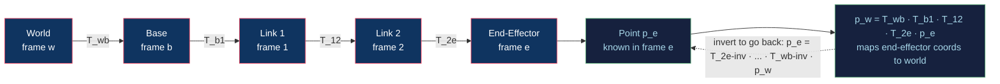

# 🤖 Rigid Body Motion and Homogeneous Transforms

> [!abstract] TL;DR
> A rigid body's *pose* is its position **plus** orientation. Orientation lives in the rotation group SO(3) (a 3×3 matrix, Euler angles, axis-angle, or a unit quaternion); position is a 3-vector. A **homogeneous transform** bundles both into a single 4×4 matrix in SE(3), so a point or pose can be re-expressed from one coordinate frame to another by one matrix multiply. Chaining these matrices down a robot's links (world → base → link₁ → … → end-effector) is how you compute where the gripper is in the world — and inverting one lets you go the other way.

---

## Intuition

**Analogy:** To tell a robot arm "the cup is 30 cm in front of the camera," you must translate between three viewpoints: the camera's, the arm's shoulder, and the world — each person gives directions *from where they stand*. "To your left" means different things to each of them. A homogeneous transform is a single 4×4 "universal translator" that converts any point or pose from one frame's description into another's, packing rotation (which way you're facing) and translation (where you are) into one tidy matrix.

Because it is *one* matrix, you can stack translators end to end: camera-to-shoulder times shoulder-to-world gives camera-to-world directly. In the technical domain, each rigid link of a robot carries its own coordinate frame, and multiplying the frame-to-frame transforms in order marches a coordinate description all the way down the mechanical chain.

---

## How It Works

### Core Mechanics

1. **Pose = position + orientation.** A rigid body cannot deform, so its complete state relative to a reference frame is a point `p ∈ ℝ³` (where its origin sits) and a rotation `R ∈ SO(3)` (how its axes are tilted). Together, `(R, p)` is a *pose*, an element of the special Euclidean group SE(3).

2. **Rotation matrices (SO(3)).** `R` is a 3×3 matrix whose columns are the body's x, y, z axes written in the reference frame. It satisfies `Rᵀ R = I` (orthonormal) and `det R = +1` (right-handed, no reflection). Its inverse is simply its transpose: `R⁻¹ = Rᵀ`.

3. **The homogeneous 4×4 (SE(3)).** Stack `R` and `p` and pad with a bottom row:

   ```
   T = | R   p |     T ∈ SE(3), a 4×4 matrix
       | 0   1 |
   ```

   A point is written as `[x, y, z, 1]ᵀ` (the `1` in the 4th slot exposes it to translation); a direction uses `[x, y, z, 0]ᵀ` so translation is ignored.

4. **Mapping a point between frames.** If `T_ab` describes frame *b* as seen from frame *a*, then a point known in *b* becomes, in *a*: `p_a = T_ab · p_b`. One matrix-vector product rotates **and** shifts it.

5. **Composition = matrix multiplication.** Transforms chain by ordinary multiplication, and the subscripts "cancel": `T_ac = T_ab · T_bc`. March this down a kinematic chain and `T_world,ee = T_wb · T_b1 · T_12 · … · T_(n-1),ee` places the end-effector in world coordinates. Order matters — matrix multiplication does **not** commute.

6. **Inverse transform.** To go the other way, `T_ba = T_ab⁻¹`, and it has a cheap closed form (no full 4×4 inversion needed):

   ```
   T⁻¹ = | Rᵀ   -Rᵀ p |
         | 0      1   |
   ```

7. **Rotation representations — pick your trade-off.**
   - *Rotation matrix* — no singularities, composes by multiplication, but 9 numbers with 6 constraints (redundant).
   - *Euler angles* (roll-pitch-yaw) — only 3 numbers, human-readable, but suffer **gimbal lock** when two axes align and lose a degree of freedom.
   - *Axis-angle* — a unit axis `û` and angle `θ`; compact and geometric, the bridge to `exp`/`log` maps and screw theory.
   - *Unit quaternion* — 4 numbers on the unit 3-sphere; no gimbal lock, numerically stable, cheap to renormalize, and smoothly interpolatable (slerp). The standard for storing/blending orientation.

8. **Active vs passive.** The *same* matrix `T` can mean "move the object" (active: rotate the cup itself) or "re-express in a new frame" (passive: keep the cup, change whose eyes describe it). The algebra is identical; the interpretation is not — mixing them is a classic sign-flip bug.

9. **Foreshadowing — twists and screws.** Just as SE(3) is the group of poses, its *velocity* version — the instantaneous linear+angular velocity of a rigid body — is a **twist**, and every rigid motion is equivalent to a screw (rotate about + translate along one axis, Chasles' theorem). Twists power [[3D_Transforms_and_Matrices|velocity kinematics]] and the exponential-map form of forward kinematics.

### Flow / Architecture



---

## Key Concepts

**Secondary (intuition level)**
- A pose answers two questions: *where is it* (position) and *which way is it facing* (orientation).
- A transform is a rule that rewrites a location from one map's grid onto another map's grid.
- Doing rotation A then rotation B is generally not the same as B then A — turn-then-walk differs from walk-then-turn.

**Undergraduate (working level)**
- SO(3): the set of 3×3 matrices with `Rᵀ R = I`, `det R = 1`; a 3-parameter Lie group.
- SE(3): 4×4 homogeneous matrices bundling `R` and `p`; the group of rigid-body poses.
- Composition `T_ac = T_ab · T_bc` and the closed-form inverse `T⁻¹ = [Rᵀ, -Rᵀp; 0, 1]`.
- Four rotation parametrizations and their failure modes (redundancy, gimbal lock, double-cover).
- Homogeneous coordinates: `w=1` for points (translatable), `w=0` for free vectors (directions).

**Graduate (theory level)**
- SO(3) and SE(3) as Lie groups; their Lie algebras 𝔰𝔬(3) (skew-symmetric matrices `[ω]×`) and 𝔰𝔢(3) (twists).
- The exponential map `R = exp([ω]× θ)` (Rodrigues' formula) and matrix log connecting axis-angle ↔ rotation matrix.
- Unit quaternions as a *double cover* of SO(3): `q` and `-q` are the same rotation (Spin(3) → SO(3)).
- Screw theory / Chasles' theorem: every rigid motion is a screw; product-of-exponentials forward kinematics.
- Adjoint maps transforming twists between frames; the metric structure of SE(3) (no bi-invariant metric).

---

## Python Demo

```python
# Build SO(3) rotations and SE(3) homogeneous transforms, compose a
# 3-frame chain (world -> base -> end-effector), transform a point through it,
# and visualize each frame's axes in 3D with matplotlib quivers.
import numpy as np
import matplotlib.pyplot as plt

# ---- SO(3): elementary rotation matrices (right-handed, active) ----
def rot_x(a):
    c, s = np.cos(a), np.sin(a)
    return np.array([[1, 0, 0], [0, c, -s], [0, s, c]])

def rot_y(a):
    c, s = np.cos(a), np.sin(a)
    return np.array([[c, 0, s], [0, 1, 0], [-s, 0, c]])

def rot_z(a):
    c, s = np.cos(a), np.sin(a)
    return np.array([[c, -s, 0], [s, c, 0], [0, 0, 1]])

# ---- SE(3): pack rotation R and translation p into a 4x4 ----
def homog(R, p):
    T = np.eye(4)
    T[:3, :3] = R
    T[:3, 3] = p
    return T

# ---- Closed-form SE(3) inverse: [R^T, -R^T p; 0, 1] ----
def inv_homog(T):
    R, p = T[:3, :3], T[:3, 3]
    Ti = np.eye(4)
    Ti[:3, :3] = R.T
    Ti[:3, 3] = -R.T @ p
    return Ti

# ---- A 3-frame kinematic chain ----
# base sits 1 m along world +x, yawed 30 deg about z
T_wb = homog(rot_z(np.deg2rad(30)), np.array([1.0, 0.0, 0.0]))
# end-effector sits 0.8 m up the base's +z, pitched 45 deg about y
T_be = homog(rot_y(np.deg2rad(45)), np.array([0.0, 0.0, 0.8]))

# COMPOSE by matrix multiplication: end-effector coords -> world coords
T_we = T_wb @ T_be
print("T_we (end-effector -> world):\n", np.round(T_we, 3))

# A target point 0.3 m out the end-effector's +z axis, expressed in frame e
p_e = np.array([0.0, 0.0, 0.3, 1.0])
p_w = T_we @ p_e
print("target in world frame:", np.round(p_w[:3], 3))

# Inverse round-trips exactly: world -> end-effector recovers p_e
assert np.allclose(inv_homog(T_we) @ p_w, p_e), "inverse transform failed"
print("inverse round-trip OK")

# ---- Visualize the frames ----
def draw_frame(ax, T, name, length=0.4):
    o, R = T[:3, 3], T[:3, :3]
    for i, col in enumerate(['r', 'g', 'b']):          # x=red, y=green, z=blue
        ax.quiver(o[0], o[1], o[2], R[0, i], R[1, i], R[2, i],
                  length=length, color=col, linewidth=2)
    ax.text(o[0], o[1], o[2], f"  {name}", fontsize=9)

fig = plt.figure(figsize=(7, 6))
ax = fig.add_subplot(111, projection='3d')
draw_frame(ax, np.eye(4), "world")     # identity frame at origin
draw_frame(ax, T_wb, "base")
draw_frame(ax, T_we, "end-effector")
ax.scatter(*p_w[:3], color='k', s=60)
ax.text(*p_w[:3], "  target", fontsize=9)
ax.set_xlabel('X'); ax.set_ylabel('Y'); ax.set_zlabel('Z')
ax.set_xlim(0, 2); ax.set_ylim(-1, 1); ax.set_zlim(0, 2)
ax.set_title("Chained frames: T_we = T_wb @ T_be")
plt.tight_layout()
plt.show()
```

Running it prints the composed 4×4, the target's world coordinates, and confirms the closed-form inverse round-trips exactly. The 3D plot shows three coordinate triads — world at the origin, the base shifted and yawed, the end-effector raised and pitched — with the transformed target point marked in black, making the chain `T_we = T_wb @ T_be` visually concrete.

---

## Real-World Applications

- **Robot manipulators (forward kinematics).** Every industrial arm (KUKA, UR, Franka Emika) stores a transform per joint and multiplies them to locate the gripper — the direct use of chained SE(3) matrices.
- **ROS / tf2 transform trees.** ROS maintains a live tree of named frames (`map`, `odom`, `base_link`, `camera_link`, `tool0`) and answers "where is X in frame Y?" by composing and inverting homogeneous transforms on demand.
- **SLAM and computer vision.** Camera extrinsics are exactly an SE(3) pose; visual-inertial odometry and bundle adjustment optimize thousands of these transforms, usually storing rotation as a unit quaternion to stay on the manifold.
- **Autonomous vehicles.** Sensor fusion transforms LiDAR, radar, and camera detections from each sensor's frame into a common vehicle frame before planning — a fixed calibration transform per sensor.
- **Game engines and graphics.** The same 4×4 machinery drives the model/view matrices; see [[3D_Transforms_and_Matrices]] for the graphics-pipeline framing and [[Rigid_Body_Physics]] for quaternion-based orientation integration.

---

## Common Pitfalls

- **Assuming rotations commute.** `R_x · R_y ≠ R_y · R_x`. The order you apply rotations (and the axis convention) changes the result — always fix and document your convention (e.g., intrinsic ZYX roll-pitch-yaw).
- **Gimbal lock with Euler angles.** When the middle-axis angle hits ±90°, two rotation axes align and one DOF vanishes, causing sudden flips and un-invertible Jacobians. Store orientation as a quaternion or rotation matrix and convert to Euler only for display.
- **Active vs passive confusion.** The same matrix either moves the object or re-expresses the frame. Using an active rotation where a passive change-of-frame is meant (or vice versa) inverts your result — it is the transpose you did not take.
- **Pre- vs post-multiplication.** `T_new = T_incr · T_old` applies the increment in the *fixed/world* frame; `T_new = T_old · T_incr` applies it in the *body/local* frame. Swapping them silently produces wrong motions.
- **Forgetting the homogeneous coordinate.** Multiplying a `[x,y,z,0]` direction by a translation-bearing transform (or a `[x,y,z,1]` point where a direction was meant) mixes translation in wrongly. Points get `w=1`, free vectors get `w=0`.
- **Quaternion double-cover and drift.** `q` and `-q` encode the same rotation; interpolators must pick the short way (dot-product sign check), and accumulated products must be renormalized to stay unit-length.
- **Non-orthonormal rotation drift.** Repeated floating-point multiplication makes `R` drift off SO(3); periodically re-orthonormalize (e.g., via SVD or Gram-Schmidt) — see [[Eigenvalues_and_Eigenvectors]] and [[Matrices_and_Determinants]].

---

## Related Concepts

- [[Matrices_and_Determinants]] — the orthogonality (`RᵀR = I`) and `det R = +1` conditions that define a valid rotation live here.
- [[Linear_Transformations]] — a rotation is a linear map preserving lengths and angles; homogeneous transforms extend this to affine (rotation + translation).
- [[Groups_and_Subgroups]] — SO(3) and SE(3) are Lie groups; closure, identity, and inverses give transform composition its algebraic backbone.
- [[Eigenvalues_and_Eigenvectors]] — the rotation axis is the eigenvector of `R` with eigenvalue 1; eigen-analysis also underlies re-orthonormalization.
- [[3D_Transforms_and_Matrices]] — the same 4×4 homogeneous machinery in the graphics pipeline (model/view/projection, gimbal lock, quaternions).
- [[Coordinate_Systems_and_Handedness]] — left- vs right-handed frames and axis conventions that determine transform signs.
- [[Rotational_Dynamics]] — the physics of how rigid bodies actually rotate (angular velocity, moment of inertia) that these kinematics describe geometrically.
- [[Rigid_Body_Physics]] — simulating rigid motion with quaternion orientation integration, the dynamic counterpart to this static pose algebra.

---

## Review Questions

1. **(Secondary)** Why does a robot need more than one coordinate frame, and what two pieces of information does a single homogeneous transform carry between them?
2. **(Undergraduate)** Given `T_wb` (base in world) and `T_be` (end-effector in base), write the transform that takes a point known in the end-effector frame into the world frame, and give the closed-form inverse of that composed transform without doing a full 4×4 matrix inversion.
3. **(Undergraduate/Graduate)** A colleague stores every orientation as roll-pitch-yaw Euler angles and reports occasional violent jumps when the arm points straight up. Diagnose the cause and recommend an alternative representation, explaining its trade-offs (including the quaternion double-cover).
4. **(Graduate)** Explain the difference between pre- and post-multiplying an incremental rotation onto a current pose, and relate active vs passive interpretation to the transpose. In what sense is every such rigid motion equivalent to a screw?

---

## Sources

- Lynch, K. & Park, F. — *Modern Robotics: Mechanics, Planning, and Control* (Cambridge, 2017), Ch. 3 "Rigid-Body Motions." [Book site](https://hades.mech.northwestern.edu/index.php/Modern_Robotics)
- Craig, J. J. — *Introduction to Robotics: Mechanics and Control*, 4th ed. (Pearson), Ch. 2 "Spatial Descriptions and Transformations."
- Murray, R., Li, Z. & Sastry, S. — *A Mathematical Introduction to Robotic Manipulation* (CRC Press, 1994), Ch. 2 "Rigid Body Motion." [PDF](https://www.cds.caltech.edu/~murray/mlswiki/)
- Spong, M., Hutchinson, S. & Vidyasagar, M. — *Robot Modeling and Control*, 2nd ed. (Wiley), Ch. 2 "Rigid Motions and Homogeneous Transformations."
- Corke, P. — *Robotics, Vision and Control*, 3rd ed. (Springer), Ch. 2 "Representing Position and Orientation."

---

#robotics #rigid-body-motion #homogeneous-transforms #rotations #kinematics
