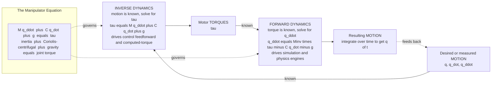

# 🤖 Robot Dynamics and Equations of Motion

> [!abstract] TL;DR
> **Kinematics** tells you *where* a robot's links are; **dynamics** tells you *what forces it takes to move them*. Robot dynamics relates the **joint torques** $\boldsymbol{\tau}$ a robot's motors produce to the resulting **motion** $\mathbf{q}, \dot{\mathbf{q}}, \ddot{\mathbf{q}}$, and it collapses into one compact statement — the **manipulator equation** $\;M(\mathbf{q})\ddot{\mathbf{q}} + C(\mathbf{q},\dot{\mathbf{q}})\dot{\mathbf{q}} + \mathbf{g}(\mathbf{q}) = \boldsymbol{\tau}$. Here $M$ is the configuration-dependent **inertia (mass) matrix**, $C\dot{\mathbf{q}}$ gathers the velocity-dependent **Coriolis and centrifugal** coupling between joints, and $\mathbf{g}$ is the **gravity** load. Read one way (**inverse dynamics**: motion $\to$ torque) it drives high-performance control; read the other (**forward dynamics**: torque $\to$ motion) it drives simulation. It is derived once — via the energy-based **Lagrangian** method or the recursive force-propagating **Newton–Euler** method — and then reused everywhere. Its defining feature is **nonlinear coupling**: swinging one joint throws torques onto the others, which is exactly why fast, precise robots cannot be controlled by geometry alone.

---

## Intuition

**Analogy — the hammer and the feather.** Move a hammer and a feather through the *identical* arc and your muscles report two completely different stories. The hammer's **mass and inertia** fight your acceleration, **gravity** drags on it differently as its angle changes, and if you also rotate your whole arm while swinging, a whip-like **coupling** flings the hammer's head in ways the feather never would. Kinematics — the geometry of the arc — is blind to all of this: it describes the *path* but says nothing about the *effort*. Robot dynamics is the equation that fills that gap. It says, moment by moment, exactly how much torque each motor must produce to make the mechanical body trace the commanded motion — accounting for how heavy each link is, how its inertia changes as the arm folds, how gravity's pull rotates with the geometry, and how the motion of one joint reaches over and disturbs its neighbours.

That last effect — the "whip" — is the heart of it. In a fast robot arm, accelerating the shoulder induces a phantom torque at the elbow even if the elbow motor does nothing. Dynamics is the bridge from **where the arm is** (kinematics) to **what the forces are** that control must wrangle.

---

## How It Works

### Core Mechanics

1. **The state of a robot is its joint configuration.** For an $n$-joint manipulator, the vector $\mathbf{q} = [q_1,\dots,q_n]^\top$ holds the joint angles (or prismatic displacements), $\dot{\mathbf{q}}$ the joint velocities, and $\ddot{\mathbf{q}}$ the joint accelerations. Everything below lives in this **joint space**.

2. **Newton's law, promoted to a whole articulated body.** For a single point mass, $F = ma$. For a tree of rigid links coupled through joints, the analogue is the **manipulator equation**:
   $$M(\mathbf{q})\,\ddot{\mathbf{q}} \;+\; C(\mathbf{q},\dot{\mathbf{q}})\,\dot{\mathbf{q}} \;+\; \mathbf{g}(\mathbf{q}) \;=\; \boldsymbol{\tau}$$
   Each term is a physical actor:
   - $M(\mathbf{q})\,\ddot{\mathbf{q}}$ — the **inertial** term. $M$ is the $n\times n$ **mass/inertia matrix**; it is symmetric, positive-definite, and *depends on configuration* (an outstretched arm has more effective inertia than a folded one). Its off-diagonal entries are the **inertial coupling** between joints.
   - $C(\mathbf{q},\dot{\mathbf{q}})\,\dot{\mathbf{q}}$ — the **Coriolis and centrifugal** term, quadratic in velocity. Centrifugal terms scale as $\dot{q}_i^2$; Coriolis terms as $\dot{q}_i\dot{q}_j$. These are the "whip" — they vanish at rest and grow with the *square* of speed, which is why they can be ignored on a slow arm and absolutely cannot on a fast one.
   - $\mathbf{g}(\mathbf{q})$ — the **gravity** load: the torque each motor must supply merely to *hold* the arm still against its own weight.
   - $\boldsymbol{\tau}$ — the **generalized joint torques/forces** applied by the actuators (plus external/contact wrenches mapped through the Jacobian, when present).

3. **Two ways to derive it, one equation out.**
   - **Lagrangian (energy) method.** Write the total kinetic energy $T = \tfrac{1}{2}\dot{\mathbf{q}}^\top M(\mathbf{q})\dot{\mathbf{q}}$ and potential energy $V(\mathbf{q})$, form $\mathcal{L} = T - V$, and apply the Euler–Lagrange equations $\frac{d}{dt}\frac{\partial \mathcal{L}}{\partial \dot{q}_i} - \frac{\partial \mathcal{L}}{\partial q_i} = \tau_i$. Elegant and coordinate-free; constraint forces vanish automatically. Best for *understanding* and for small $n$.
   - **Newton–Euler (recursive) method.** Sweep *outward* from base to tip propagating velocities and accelerations, then *inward* from tip to base propagating forces and moments across each link. Best for *computation*: it yields inverse dynamics in $O(n)$ time and is the workhorse inside real controllers and physics engines (see Featherstone's articulated-body algorithms).

4. **The Coriolis matrix is not unique — but the term is.** There are many valid factorizations $C(\mathbf{q},\dot{\mathbf{q}})$ of the velocity term. The physically meaningful **Christoffel-symbol** choice makes $\dot{M} - 2C$ **skew-symmetric** — a passivity property that is gold for stability proofs in nonlinear control.

5. **Two readings of the same equation.**
   - **Inverse dynamics** ($\mathbf{q},\dot{\mathbf{q}},\ddot{\mathbf{q}} \to \boldsymbol{\tau}$): given a desired motion, *compute the torque that produces it*. This is the feedforward engine of high-performance control (**computed-torque / inverse-dynamics control**, foreshadowed below) and of gravity compensation.
   - **Forward dynamics** ($\boldsymbol{\tau} \to \ddot{\mathbf{q}}$): given the torque, *solve for the acceleration* via $\ddot{\mathbf{q}} = M^{-1}(\boldsymbol{\tau} - C\dot{\mathbf{q}} - \mathbf{g})$, then integrate. This is what every robot **simulator** and physics engine runs at each timestep.

### Flow / Architecture



---

## Key Concepts

### Secondary Level (Motivation)

- **Kinematics vs dynamics.** Kinematics answers "if the joints are at these angles, where is the hand?" Dynamics answers "what push does each motor need to make the hand *move* like that?" The first is pure geometry; the second is Newton's $F = ma$ for a jointed body.
- **Why gravity alone already needs a formula.** Even holding an arm perfectly still, the motors must fight gravity. A horizontal outstretched arm needs *far* more holding torque than a vertical folded one — the required torque depends on the pose. That pose-dependent hold torque is $\mathbf{g}(\mathbf{q})$.
- **The "whip" you feel.** Spin your shoulder fast and your forearm gets flung outward even without moving your elbow. That transfer of motion between joints is the coupling that dynamics captures and kinematics misses.

### Undergraduate Level

- **The mass matrix $M(\mathbf{q})$.** Symmetric positive-definite, so always invertible — forward dynamics is always solvable. Diagonal entries are each joint's effective inertia; off-diagonals are inertial coupling. It changes with configuration, which is what makes the system **nonlinear** even before velocities enter.
- **Kinetic energy as a quadratic form.** $T = \tfrac12 \dot{\mathbf{q}}^\top M(\mathbf{q})\dot{\mathbf{q}}$. This single expression *is* the mass matrix — read $M$ straight off the kinetic energy.
- **Coriolis/centrifugal structure.** $C(\mathbf{q},\dot{\mathbf{q}})\dot{\mathbf{q}}$ is built from the **Christoffel symbols** $c_{ijk} = \tfrac12\left(\frac{\partial M_{ij}}{\partial q_k} + \frac{\partial M_{ik}}{\partial q_j} - \frac{\partial M_{jk}}{\partial q_i}\right)$ — i.e. it is generated entirely by *how the mass matrix varies with configuration*. No $M$ variation, no Coriolis term.
- **Gravity from potential energy.** $\mathbf{g}(\mathbf{q}) = \partial V/\partial \mathbf{q}$. Compute it once and you have **gravity compensation** for free.
- **Lagrangian recipe.** (1) pick generalized coordinates $\mathbf{q}$; (2) write $T$ and $V$; (3) form $\mathcal{L}=T-V$; (4) apply Euler–Lagrange; (5) collect terms into $M$, $C$, $\mathbf{g}$.

### Graduate Level

- **Newton–Euler recursion & the $O(n)$ barrier.** The **Recursive Newton–Euler Algorithm (RNEA)** computes inverse dynamics in $O(n)$; the **Articulated-Body Algorithm (ABA)** computes forward dynamics in $O(n)$ (Featherstone). Naively inverting $M$ is $O(n^3)$ — spatial-algebra recursions avoid ever forming it.
- **Passivity & the skew-symmetry property.** With the Christoffel factorization, $\dot{M}(\mathbf{q}) - 2C(\mathbf{q},\dot{\mathbf{q}})$ is skew-symmetric, so $\dot{\mathbf{q}}^\top(\dot{M}-2C)\dot{\mathbf{q}} = 0$. This encodes energy conservation and is the linchpin of Lyapunov-based controllers.
- **Contact and constraint forces (brief).** External wrenches map into joint space via the manipulator Jacobian: $\boldsymbol{\tau}_{\text{ext}} = J(\mathbf{q})^\top \mathbf{f}_{\text{ext}}$. Closed loops and contacts add algebraic constraints $A(\mathbf{q})\ddot{\mathbf{q}} = b$, turning the system into a **constrained (DAE) dynamics** problem solved with Lagrange multipliers — the foundation of locomotion and manipulation-with-contact.
- **Friction and unmodeled dynamics.** Real joints add viscous ($b\dot{\mathbf{q}}$), Coulomb ($\text{sgn}(\dot{\mathbf{q}})$), and Stribeck friction, plus actuator/gear-motor inertia, backlash, and link flexibility — terms absent from the ideal rigid-body model and a major source of tracking error.
- **Why it matters for fast/precise control (foreshadowing).** **Computed-torque control** inverts the model: command $\boldsymbol{\tau} = M(\mathbf{q})\mathbf{a} + C(\mathbf{q},\dot{\mathbf{q}})\dot{\mathbf{q}} + \mathbf{g}(\mathbf{q})$ with $\mathbf{a} = \ddot{\mathbf{q}}_d + K_d\dot{\mathbf{e}} + K_p\mathbf{e}$, and the nonlinear plant collapses to $\ddot{\mathbf{e}} + K_d\dot{\mathbf{e}} + K_p\mathbf{e} = 0$ — decoupled, linear, exponentially stable. Model-based control is only as good as the dynamics model behind it.

---

## Python Demo

```python
# Robot dynamics of a 2-link planar arm (= a double pendulum when tau = 0).
# We implement the manipulator equation  M(q) qdd + C(q,qd) qd + g(q) = tau  and show:
#   (a) FORWARD dynamics: zero torque -> the arm topples and swings chaotically
#   (b) INVERSE dynamics: gravity compensation g(q) holds a pose static
#   (c) COUPLING: torque on joint 1 alone still accelerates joint 2
import numpy as np
import matplotlib.pyplot as plt

# --- Physical parameters (SI) ---
m1, m2   = 1.0, 1.0            # link masses (kg)
l1, l2   = 1.0, 1.0           # link lengths (m)
lc1, lc2 = 0.5, 0.5          # distance from each joint to that link's COM (m)
I1, I2   = m1*l1**2/12, m2*l2**2/12   # thin-rod inertias about COM (kg m^2)
grav     = 9.81               # gravitational acceleration (m/s^2)

# Spong's constant lumped parameters for the 2-link arm
alpha = I1 + I2 + m1*lc1**2 + m2*(l1**2 + lc2**2)
beta  = m2*l1*lc2
delta = I2 + m2*lc2**2

def mass_matrix(q):
    """Inertia matrix M(q): symmetric, positive-definite, configuration-dependent."""
    c2 = np.cos(q[1])
    return np.array([[alpha + 2*beta*c2, delta + beta*c2],
                     [delta + beta*c2,   delta          ]])

def coriolis(q, qd):
    """Coriolis/centrifugal matrix C(q,qd): the velocity-dependent inter-joint coupling."""
    s2 = np.sin(q[1])
    return np.array([[-beta*s2*qd[1], -beta*s2*(qd[0]+qd[1])],
                     [ beta*s2*qd[0],  0.0                   ]])

def gravity_torque(q):
    """Gravity load g(q). Angles measured from the horizontal (gravity acts along -y)."""
    g1 = (m1*lc1 + m2*l1)*grav*np.cos(q[0]) + m2*lc2*grav*np.cos(q[0]+q[1])
    g2 = m2*lc2*grav*np.cos(q[0]+q[1])
    return np.array([g1, g2])

def forward_dynamics(q, qd, tau):
    """Torque -> acceleration:  qdd = M^-1 (tau - C qd - g)."""
    return np.linalg.solve(mass_matrix(q), tau - coriolis(q, qd) @ qd - gravity_torque(q))

def inverse_dynamics(q, qd, qdd):
    """Motion -> torque:  tau = M qdd + C qd + g   (the equation read backwards)."""
    return mass_matrix(q) @ qdd + coriolis(q, qd) @ qd + gravity_torque(q)

def rk4_step(state, tau_fn, dt):
    """One RK4 step of the state s = [q1, q2, qd1, qd2]."""
    def deriv(s):
        q, qd = s[:2], s[2:]
        return np.concatenate([qd, forward_dynamics(q, qd, tau_fn(q, qd))])
    k1 = deriv(state)
    k2 = deriv(state + 0.5*dt*k1)
    k3 = deriv(state + 0.5*dt*k2)
    k4 = deriv(state + dt*k3)
    return state + (dt/6.0)*(k1 + 2*k2 + 2*k3 + k4)

def simulate(state0, tau_fn, T=10.0, dt=0.002):
    n = int(T/dt)
    traj = np.zeros((n+1, 4)); traj[0] = state0
    for i in range(n):
        traj[i+1] = rk4_step(traj[i], tau_fn, dt)
    return np.arange(n+1)*dt, traj

def tip_xy(q):
    """Cartesian position of the arm's tip (end of link 2)."""
    return (l1*np.cos(q[0]) + l2*np.cos(q[0]+q[1]),
            l1*np.sin(q[0]) + l2*np.sin(q[0]+q[1]))

# ============================================================
# (a) FORWARD DYNAMICS — zero torque: the arm falls / swings chaotically
#     Two near-identical starts diverge -> sensitive dependence (chaos).
# ============================================================
zero_tau = lambda q, qd: np.zeros(2)
sA = np.array([np.pi/2 + 0.10, 0.0, 0.0, 0.0])   # nearly-inverted, at rest
sB = np.array([np.pi/2 + 0.11, 0.0, 0.0, 0.0])   # 0.01 rad different
t, trA = simulate(sA, zero_tau)
_, trB = simulate(sB, zero_tau)
tipx = np.array([tip_xy(trA[i, :2])[0] for i in range(len(t))])
tipy = np.array([tip_xy(trA[i, :2])[1] for i in range(len(t))])

# ============================================================
# (b) INVERSE DYNAMICS — gravity compensation holds a static pose
# ============================================================
q_hold = np.array([np.pi/6, -np.pi/3])
grav_comp = lambda q, qd: gravity_torque(q)          # tau = g(q) -> qdd = 0 forever
t2, held  = simulate(np.array([*q_hold, 0.0, 0.0]), grav_comp, T=4.0)
_,  fell  = simulate(np.array([*q_hold, 0.0, 0.0]), zero_tau,  T=4.0)
print("Gravity torque to HOLD this pose (N.m):", np.round(gravity_torque(q_hold), 3))

# ============================================================
# (c) COUPLING — torque on joint 1 ONLY still drives joint 2
# ============================================================
drive_j1 = lambda q, qd: np.array([3.0, 0.0])        # tau2 = 0 exactly
t3, cpl = simulate(np.array([0.0, 0.0, 0.0, 0.0]), drive_j1, T=1.5)

# ---------------- Plots ----------------
fig, ax = plt.subplots(2, 2, figsize=(13, 9))

ax[0,0].plot(t, trA[:,0], label="joint 1  q1(t)")
ax[0,0].plot(t, trA[:,1], label="joint 2  q2(t)")
ax[0,0].plot(t, trB[:,0], '--', alpha=0.7, label="q1(t), start +0.01 rad")
ax[0,0].set(title="(a) Forward dynamics: falling arm (chaotic)",
            xlabel="time (s)", ylabel="joint angle (rad)"); ax[0,0].legend(); ax[0,0].grid(alpha=.3)

ax[0,1].plot(tipx, tipy, lw=0.5)
ax[0,1].set(title="(a) Tip trajectory of the falling arm",
            xlabel="x (m)", ylabel="y (m)"); ax[0,1].axis("equal"); ax[0,1].grid(alpha=.3)

ax[1,0].plot(t2, held[:,0], label="q1 WITH gravity comp (tau = g(q))")
ax[1,0].plot(t2, fell[:,0], '--', label="q1 with ZERO torque (falls)")
ax[1,0].set(title="(b) Inverse dynamics: gravity compensation holds the pose",
            xlabel="time (s)", ylabel="joint 1 angle (rad)"); ax[1,0].legend(); ax[1,0].grid(alpha=.3)

ax[1,1].plot(t3, cpl[:,0], label="q1 (torque applied here)")
ax[1,1].plot(t3, cpl[:,1], label="q2 (NO torque, moves via coupling)")
ax[1,1].set(title="(c) Coupling: torque on joint 1 alone accelerates joint 2",
            xlabel="time (s)", ylabel="joint angle (rad)"); ax[1,1].legend(); ax[1,1].grid(alpha=.3)

plt.tight_layout(); plt.show()

# --- Sanity check: inverse then forward dynamics must round-trip ---
q, qd, qdd = np.array([0.3, -0.7]), np.array([1.1, -0.4]), np.array([2.0, -1.5])
tau = inverse_dynamics(q, qd, qdd)
print("round-trip qdd error:", np.linalg.norm(forward_dynamics(q, qd, tau) - qdd))
```

**What the four panels show.** (a) With **zero torque** the arm is a **double pendulum**: it topples and swings, and two starts differing by 0.01 rad diverge completely — the tip traces a chaotic tangle (sensitive dependence, echoing [[Chaos_and_Nonlinear_Dynamics_Numerically]]). (b) Feeding the arm exactly $\mathbf{g}(\mathbf{q})$ — **inverse dynamics** for a static pose — holds it dead still, while zero torque lets it fall: gravity compensation in one line. (c) Applying torque to joint 1 *only* still swings joint 2, because $M_{12}$ and the Coriolis terms **couple** the joints — the very effect a naive per-joint PID controller would fight. The round-trip check confirms forward and inverse dynamics are exact inverses.

---

## Real-World Applications

- **Industrial arms (KUKA, ABB, Fanuc, Universal Robots).** Every torque-controlled manipulator runs an inverse-dynamics model at kilohertz rates for **gravity compensation**, **friction feedforward**, and **computed-torque tracking** so the tool tip follows fast trajectories without lag or overshoot.
- **Physics engines & simulators (MuJoCo, Bullet, Isaac Gym, Drake).** These are forward-dynamics solvers: each step forms $M$, $C$, $\mathbf{g}$ (plus contacts) and integrates $\ddot{\mathbf{q}} = M^{-1}(\boldsymbol{\tau}-C\dot{\mathbf{q}}-\mathbf{g})$. They are the training grounds for modern reinforcement-learning robot policies.
- **Legged robots (Boston Dynamics Atlas/Spot, MIT Cheetah, ANYmal).** Dynamic running and jumping are impossible without whole-body dynamics; controllers solve constrained inverse-dynamics QPs that respect contact forces and friction cones in real time.
- **Aerospace & spacecraft.** Robotic arms on the ISS (Canadarm2) and satellite attitude/appendage control depend on rigid-body dynamics — with the twist that a free-floating base couples arm motion back into the spacecraft body.
- **Haptics & teleoperation.** Force-reflecting devices invert their own dynamics to cancel the device's inertia and gravity, so the operator feels only the remote environment, not the joystick.

---

## Common Pitfalls

- **Ignoring dynamics at high speed.** Treating the arm as pure kinematics (or independent per-joint PID) works only when it moves slowly. Because Coriolis/centrifugal torques scale with **velocity squared**, a controller tuned at low speed goes unstable or lags badly when the arm moves fast — dynamics is precisely the regime where geometry stops being enough.
- **Neglecting the Coriolis term.** It is tempting to keep only $M\ddot{\mathbf{q}} + \mathbf{g}$ and drop $C\dot{\mathbf{q}}$ because it is fiddly to derive. Fine at a crawl; fatal in dynamic motions, where the omitted coupling torques cause visible tracking error and instability. Panel (c) above shows the coupling is real and not optional.
- **Friction and unmodeled dynamics.** The ideal rigid-body model omits joint friction (viscous, Coulomb, Stribeck), gearbox/motor inertia, backlash, and link flexibility. These dominate near zero velocity (stiction) and at fine positioning — the gap between the clean equation and a real robot. Budget for friction identification and integral action.
- **Numerical integration stiffness.** Stiff dynamics, near-singular configurations, and rigid contacts make explicit integrators (Euler) blow up unless the timestep is tiny. Use higher-order or adaptive schemes ([[Runge_Kutta_and_Adaptive_Methods]]); for long energy-conserving swings, symplectic integrators drift far less. Watch conditioning of $M(\mathbf{q})$ near singularities.
- **Bad inertial parameters.** Model-based control is only as good as the mass/COM/inertia numbers. CAD estimates are often wrong by tens of percent; run **dynamic parameter identification** (least-squares on the linear-in-parameters form) rather than trusting the datasheet.
- **Wrong Coriolis factorization for proofs.** Any $C$ that reproduces the term simulates correctly, but Lyapunov stability arguments require the **Christoffel** choice so that $\dot{M}-2C$ is skew-symmetric. Using an arbitrary $C$ silently breaks the passivity property a proof relies on.

---

## Related Concepts

- [[Lagrangian_Mechanics]] — the energy method ($\mathcal{L}=T-V$, Euler–Lagrange) that *derives* the manipulator equation; robot dynamics is Lagrangian mechanics applied to a chain of rigid links.
- [[Newtons_Laws_and_Kinematics]] — the manipulator equation is $F=ma$ promoted from a point mass to a jointed multibody system.
- [[Rotational_Dynamics]] — moment of inertia, torque, and angular momentum for rigid bodies are the per-link ingredients that assemble into the mass matrix $M(\mathbf{q})$.
- [[Hamiltonian_Mechanics]] — the phase-space ($\mathbf{q},\mathbf{p}$) reformulation via the Legendre transform; foundation for symplectic integration and optimal control of robots.
- [[Work_Energy_and_Conservation]] — kinetic energy $T=\tfrac12\dot{\mathbf{q}}^\top M\dot{\mathbf{q}}$ and potential energy $V(\mathbf{q})$ are exactly the quantities read off to build $M$ and $\mathbf{g}$; the skew-symmetry property is energy conservation in disguise.
- [[Systems_of_ODEs]] — forward dynamics turns the equation into a coupled nonlinear ODE system in state $[\mathbf{q},\dot{\mathbf{q}}]$ that must be integrated to simulate motion.
- [[Runge_Kutta_and_Adaptive_Methods]] — the numerical integrators used to solve forward dynamics; RK4 (as in the demo) is the default workhorse, with adaptive/symplectic variants for stiff or long-horizon runs.
- [[Numerical_Integration_and_Differentiation]] — the stepping and finite-difference machinery underlying any dynamics simulation.
- [[Matrices_and_Determinants]] — $M(\mathbf{q})$ is a matrix whose invertibility (positive-definiteness) guarantees forward dynamics always has a unique solution; conditioning matters near singularities.
- [[Chaos_and_Nonlinear_Dynamics_Numerically]] — the zero-torque 2-link arm *is* a double pendulum, the canonical chaotic system; demo panel (a) reproduces its sensitive dependence.
- [[Chaos_Theory_and_Sensitive_Dependence]] — why two nearly-identical starts of the falling arm diverge; the same nonlinear coupling that control must tame also makes the uncontrolled system chaotic.
- [[Dynamical_Systems_and_Attractors]] — the state-space/phase-portrait viewpoint for reasoning about a robot's motion as a trajectory in $[\mathbf{q},\dot{\mathbf{q}}]$.
- [[Symplectic_Integrators_and_Hamiltonian_Dynamics]] — structure-preserving integrators that conserve energy far better for long robot/pendulum simulations than plain RK4.

*Foundational siblings in the Robotics_and_Control vault (to be written): Forward_Kinematics and Velocity_Kinematics_and_the_Jacobian supply the geometry that dynamics builds on (the Jacobian maps contact wrenches into joint torques); Nonlinear_Control_and_Lyapunov_Stability and Model_Predictive_Control consume this model for computed-torque and optimization-based control; Legged_and_Mobile_Robot_Locomotion applies constrained/contact dynamics to walking and running.*

---

## Review Questions

1. **(Secondary)** A robot arm holds a pose without moving. Which term of the manipulator equation is doing all the work, and why does the required motor torque change if you move the arm from horizontal to vertical?
2. **(Undergraduate)** Explain the difference between *forward* and *inverse* dynamics. For each, state which quantities are known and which are solved for, and name a task (simulation vs control) where each is the natural choice.
3. **(Undergraduate)** In the code demo, torque is applied to joint 1 only, yet joint 2 accelerates. Point to the specific entries of $M(\mathbf{q})$ and $C(\mathbf{q},\dot{\mathbf{q}})$ responsible, and explain physically why this "coupling" grows with speed.
4. **(Graduate)** Why do controller-stability proofs insist on the Christoffel factorization of $C$? State the skew-symmetry property $\dot{M}-2C$ and explain what it means physically.
5. **(Graduate / scenario)** You are asked to make a 6-DOF arm follow a fast trajectory with sub-millimetre accuracy, but a decentralized PID per joint keeps overshooting on quick moves. Which model-based term(s) would you add first, would you choose the Lagrangian or recursive Newton–Euler formulation to compute them online, and what real-world effects (friction, parameter error) would still limit you?

---

## Sources

- Lynch, K. M. & Park, F. C. — *Modern Robotics: Mechanics, Planning, and Control* (Cambridge, 2017), Ch. 8 "Dynamics of Open Chains." [Free PDF](https://hades.mech.northwestern.edu/index.php/Modern_Robotics)
- Craig, J. J. — *Introduction to Robotics: Mechanics and Control* (4th ed., Pearson, 2018), Ch. 6 "Manipulator Dynamics."
- Featherstone, R. — *Rigid Body Dynamics Algorithms* (Springer, 2008) — the definitive reference for recursive $O(n)$ forward/inverse dynamics (RNEA, ABA).
- Spong, M. W., Hutchinson, S. & Vidyasagar, M. — *Robot Modeling and Control* (2nd ed., Wiley, 2020), Ch. 6–7 "Dynamics" and "Multivariable Control."
- Siciliano, B., Sciavicco, L., Villani, L. & Oriolo, G. — *Robotics: Modelling, Planning and Control* (Springer, 2009), Ch. 7 "Dynamics."

---

#robotics #robot-dynamics #equations-of-motion #lagrangian #inverse-dynamics
