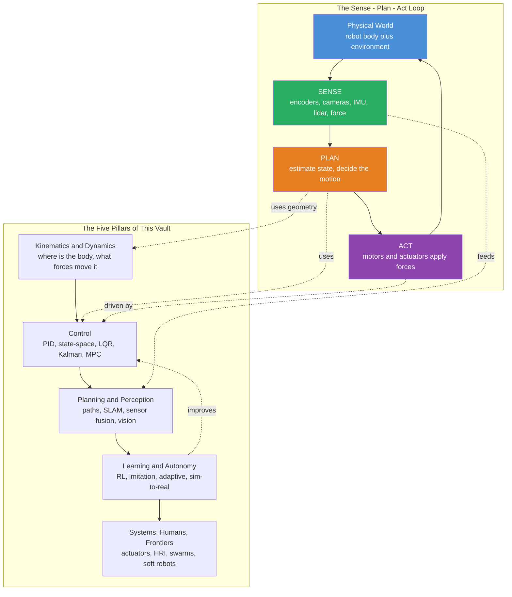

# 🤖 Robotics and Control — Field Overview

> [!abstract] TL;DR
> **Robotics and control** is the interdisciplinary science of machines that **sense, plan, and act** in the physical world. A robot is a pile of motors, joints, and sensors with no built-in instincts; robotics gives it those instincts mathematically — **geometry** to know where its body is, **dynamics** to know the forces that move it, **control theory** to correct its errors moment by moment, and **planning + perception** to decide where to go. The unifying idea is **closing the loop**: feedback from sensing continuously corrects action, turning raw actuators into purposeful behavior. Modern robotics blends **model-based** methods (physics + control) with **learning-based** methods (machine learning), and this vault covers the whole stack — kinematics/dynamics, control, planning/perception, learning/autonomy, and systems/humans/frontiers.

---

## Intuition

**Analogy — a body without instincts.** Imagine an animal that was assembled rather than born: it has muscles (actuators), joints, and eyes (sensors), but it arrives in the world with *no reflexes at all*. It does not know where its own hand is. It cannot feel that its arm has drifted off target. It has no idea how hard to push to lift a cup without crushing it, and no notion of how to weave around a chair to cross the room. It is, in the most literal sense, a machine that has never learned to inhabit itself.

Robotics and control is the discipline that **hands this body its missing instincts, written as mathematics**. **Geometry** (kinematics) tells it where its hand is in space given its joint angles. **Physics** (dynamics) tells it what forces and torques are needed to make that hand move. **Control theory** gives it the reflex arc — sense the error between where the hand *is* and where it *should be*, and correct it, over and over, faster than any disturbance can build up. **Planning and perception** give it foresight — a map of the room and a collision-free path across it. And increasingly, **learning** lets it acquire skills that are too complex to hand-derive, the way a real animal refines its motions with practice.

The single deepest move in the whole field is **closing the loop**: wiring the sensor back to the actuator through a correcting law. An open-loop machine (act, then hope) drifts and overshoots the moment reality disagrees with its assumptions. A closed-loop machine watches its own error and cancels it continuously. That one idea — feedback — is what turns a heap of motors into something that behaves *on purpose*.

---

## How It Works

At the center of every robot is a cycle that never stops turning: **sense → plan → act → and back to sense**. The robot measures its own state and its surroundings, decides what to do, applies forces to the world, and immediately measures the *consequences* — which feed the next decision. Each pillar of the field is a body of theory that makes one part of that cycle rigorous.

- **Kinematics & Dynamics** answer *where is the body and what moves it*. Forward kinematics maps joint angles to hand position; inverse kinematics maps a desired hand position back to joint angles; dynamics (Newton–Euler or Lagrangian) gives the equations of motion relating torques to accelerations.
- **Control** answers *how do I make the robot do what I want despite disturbances and uncertainty*. It spans classical feedback and **PID**, modern **state-space** and pole placement, **optimal control** (LQR), **estimation** (the Kalman filter fuses noisy sensors into a clean state), predictive control (**MPC**), and **nonlinear/Lyapunov** methods for stability guarantees.
- **Motion Planning & Perception** answer *where should I go and what is around me* — finding collision-free paths, building maps while localizing (**SLAM**), fusing sensors, and interpreting camera images.
- **Learning & Autonomy** answer *how do I acquire skills I cannot hand-derive* — reinforcement and imitation learning, adaptive control, crossing the **sim-to-real** gap, legged locomotion, and dexterous manipulation.
- **Systems, Humans & Frontiers** cover the physical substrate and its edges — actuators, sensors, and embedded control; human-robot interaction and safety; swarms; soft robotics; and autonomous vehicles.

The recurring tension across all of it is **model-based vs learning-based**: physics and control theory give provable guarantees when you have a good model, while machine learning handles the messy, high-dimensional cases where writing a model down is hopeless. The best modern systems combine the two — a learned perception front-end feeding a model-based controller, or a learned policy wrapped in safety constraints from control theory.



---

## Key Concepts

### 🟢 Secondary — the plain-language picture

- **Robot = sense + plan + act.** A robot is any machine that measures the world, decides, and moves — a loop that repeats many times per second.
- **Actuators and sensors.** Motors and muscles *push* on the world; encoders, cameras, and gyros *read* it back. Robotics is the bridge between the two.
- **Feedback (closing the loop).** Compare where you are to where you want to be, and correct the difference. This is why a thermostat holds temperature and why a robot arm stops exactly at its target.
- **Degrees of freedom.** How many independent ways a robot can move — a human arm has seven, a car has effectively two.
- **Open loop vs closed loop.** Open loop = act and hope; closed loop = act, measure, correct. Closed loop is what makes robots reliable.

### 🟡 Undergraduate — the working machinery

- **Forward & inverse kinematics.** Forward kinematics maps joint angles → end-effector pose via homogeneous transforms; inverse kinematics solves the harder reverse problem (often nonlinear, multi-solution).
- **Equations of motion.** Newton–Euler and Lagrangian mechanics yield the manipulator dynamics $M(q)\ddot q + C(q,\dot q)\dot q + g(q) = \tau$, relating joint torques to accelerations.
- **PID control.** Weight the error (P), its accumulated history (I, which kills steady-state offset), and its rate of change (D, which damps oscillation). Still the workhorse of industrial control.
- **State-space & stability.** Represent the robot as $\dot x = Ax + Bu$; analyze stability through eigenvalues/poles; design feedback $u = -Kx$ to place them.
- **Trajectory tracking.** Following a time-varying reference, not just holding a fixed setpoint — the everyday task of a robot arm or drone.

### 🔴 Graduate — the frontier machinery

- **Optimal control (LQR).** Solve for the feedback gain that minimizes a quadratic cost trading state error against control effort, via the algebraic Riccati equation.
- **State estimation (Kalman filter).** Optimally fuse a dynamics model with noisy measurements to estimate the hidden state; the extended/unscented variants handle nonlinearity. Foundational for navigation and SLAM.
- **Model Predictive Control (MPC).** At every step, solve a finite-horizon optimization over future inputs subject to constraints, apply the first move, and repeat — the method behind agile drones and self-driving vehicles.
- **Nonlinear & Lyapunov control.** Prove stability of nonlinear systems by finding an energy-like Lyapunov function; design feedback-linearizing or sliding-mode controllers.
- **Learning for control.** Reinforcement learning, imitation learning, and adaptive control acquire policies for contact-rich manipulation and legged locomotion; the **sim-to-real** gap and safety guarantees are open problems.

---

## Python Demo

The closed loop in miniature: a point mass on a damped rail (a 1-DOF stand-in for a robot joint), $m\ddot x + b\dot x = u$. We drive it to a target with a **proportional–derivative (PD) controller** — the essence of sense-plan-act — and contrast it against an **open-loop** push that never looks at the sensor. Open loop drifts past the target; closed loop watches its own error and settles exactly on it.

```python
# Closing the loop: PD feedback control of a 1-DOF robot joint (point mass + damping).
# Plant (Newton's 2nd law):  m*x'' + b*x' = u
# State s = [position, velocity]. Actuator applies force u; sensor reads x and v.
import numpy as np
import matplotlib.pyplot as plt

m, b = 1.0, 0.8            # mass [kg], viscous damping [N.s/m]
x_target = 1.0            # setpoint the robot must reach [m]
dt, T = 0.01, 10.0        # timestep [s], horizon [s]
steps = int(T / dt)
t = np.linspace(0.0, T, steps)

def dynamics(s, u):
    x, v = s
    a = (u - b * v) / m           # acceleration from the equation of motion
    return np.array([v, a])

def rk4_step(s, u):               # 4th-order Runge-Kutta integrator
    k1 = dynamics(s, u)
    k2 = dynamics(s + 0.5 * dt * k1, u)
    k3 = dynamics(s + 0.5 * dt * k2, u)
    k4 = dynamics(s + dt * k3, u)
    return s + (dt / 6.0) * (k1 + 2 * k2 + 2 * k3 + k4)

# --- OPEN LOOP: pick one fixed push, then never look at the sensor again ---
u_fixed = 0.8                     # a "reasonable" constant force, chosen blind
s = np.array([0.0, 0.0])
x_open = np.zeros(steps)
for k in range(steps):
    x_open[k] = s[0]
    s = rk4_step(s, u_fixed)      # no feedback -> drifts past the target forever

# --- CLOSED LOOP: sense error every step and correct it (PD control) ---
Kp, Kd = 12.0, 6.0                # proportional + derivative gains
s = np.array([0.0, 0.0])
x_closed = np.zeros(steps)
u_log = np.zeros(steps)
for k in range(steps):
    x_closed[k] = s[0]
    x, v = s
    e = x_target - x              # SENSE + PLAN: how far off, and which way
    u = Kp * e + Kd * (0.0 - v)   # ACT: push proportional to error, damp the velocity
    u_log[k] = u
    s = rk4_step(s, u)

print(f"open-loop   final position: {x_open[-1]:.3f} m  (target {x_target})")
print(f"closed-loop final position: {x_closed[-1]:.3f} m  (target {x_target})")

fig, ax = plt.subplots(2, 1, figsize=(8, 6), sharex=True)
ax[0].axhline(x_target, ls='--', color='k', label='setpoint')
ax[0].plot(t, x_open,   color='crimson',  label='open loop (no feedback)')
ax[0].plot(t, x_closed, color='seagreen', label='closed loop (PD feedback)')
ax[0].set_ylabel('position [m]')
ax[0].set_title('Closing the loop turns actuators into purposeful motion')
ax[0].legend()
ax[1].plot(t, u_log, color='steelblue', label='control force u(t)')
ax[1].set_xlabel('time [s]'); ax[1].set_ylabel('force [N]')
ax[1].legend()
plt.tight_layout()
plt.show()
```

Running it prints the open-loop mass coasting *past* the target (it reaches a terminal drift velocity and never stops), while the closed-loop mass converges to `1.000 m`. The lower panel shows the control force shrinking to zero as the error vanishes — the loop has done its job.

---

## Real-World Applications

- **Industrial manipulators (FANUC, KUKA, ABB).** Weld, paint, and assemble with sub-millimeter repeatability using inverse kinematics plus tightly tuned joint-level PID/feedforward control.
- **Autonomous vehicles (Waymo, Tesla).** Fuse lidar, radar, and camera through Kalman-style estimation and SLAM, plan collision-free trajectories, and track them with MPC steering/throttle control.
- **Legged robots (Boston Dynamics Spot & Atlas).** Balance and locomote over rough terrain by combining model-based whole-body control with, increasingly, reinforcement-learned locomotion policies trained in simulation and transferred to hardware.
- **Drones and quadrotors.** Inherently unstable; they stay aloft only because an onboard IMU-driven feedback loop corrects attitude hundreds of times per second — a textbook closed-loop controller.
- **Surgical robots (da Vinci) and prosthetics.** Bilateral control and force feedback let a surgeon's motions map precisely to instruments, and let a prosthetic limb read intent and stabilize grasp.

---

## Common Pitfalls

- **Confusing kinematics with dynamics.** Kinematics is pure geometry (positions and velocities); dynamics adds mass, inertia, and force. Planning a geometrically valid path that the robot's *dynamics* cannot physically execute is a classic beginner error.
- **Trusting open-loop control.** Feedforward alone works only if your model is perfect and the world never pushes back. The instant there is friction, payload change, or disturbance, you need feedback — this is why the demo's open-loop mass drifts.
- **Cranking gains too high.** Large proportional/derivative gains promise fast response but invite oscillation, actuator saturation, and instability once real-world time delay and sensor noise enter the loop.
- **Ignoring sensor noise and latency.** Real sensors are noisy and slow. Naive differentiation of a noisy position signal amplifies noise catastrophically — one reason estimation (Kalman filtering) exists.
- **Overfitting to simulation (the sim-to-real gap).** A learned policy that is flawless in a simulator can fail on hardware because contact, friction, and delay are modeled imperfectly. Domain randomization and robust control mitigate but do not erase this.
- **Neglecting stability proofs for nonlinear systems.** Linear intuition (poles, gain margins) can silently break down; nonlinear systems need Lyapunov-style analysis to guarantee they will not diverge.

---

## Related Concepts

- [[State_Space_Basics]] — the $\dot x = Ax + Bu$ representation that underpins modern robot control and estimation.
- [[State_Feedback_Control]] — pole placement, LQR, and observers; the control-theory core this vault builds robotic applications on.
- [[Controllability_Observability]] — whether a robot's state can be steered by its actuators and reconstructed from its sensors.
- [[Transfer_Functions]] — the frequency-domain view of feedback loops, stability, and PID tuning.
- [[Feedback_Loops_and_Causality]] — the systems-thinking foundation of closing the loop, shared with every self-regulating system.
- [[Cybernetics_and_Control]] — the historical and conceptual root of goal-seeking machines and negative feedback.
- [[Nonlinearity_and_Feedback]] — why real robot dynamics resist linear analysis and need nonlinear methods.
- [[Dynamical_Systems_and_Attractors]] — the state-space geometry of stability, limit cycles, and convergence.
- [[Reinforcement_Learning]] — the learning-based route to control policies for locomotion and manipulation.
- [[Newtons_Laws_and_Kinematics]] — the mechanics from which robot equations of motion are derived.
- [[Lagrangian_Mechanics]] — the energy-based formulation used to derive manipulator dynamics compactly.
- [[Rotational_Dynamics]] — rigid-body rotation and inertia, essential for arms, wheels, and attitude control.
- [[Systems_of_ODEs]] — the differential-equation machinery for simulating and analyzing robot motion.
- [[Eigenvalues_and_Eigenvectors]] — the spectral tool that determines closed-loop stability and response modes.
- [[Lagrange_Multipliers]] — the constrained-optimization backbone of optimal control and trajectory planning.

---

## Review Questions

### 🟢 Secondary
1. In one sentence, what does it mean to "close the loop," and why does an open-loop robot tend to drift or overshoot while a closed-loop one settles on its target?

### 🟡 Undergraduate
2. A robot arm holds a fixed position but sags slightly under a new payload it was not tuned for. Which term of a PID controller would eliminate that steady-state droop, and why do the P and D terms alone fail to?
3. Distinguish forward from inverse kinematics, and explain why inverse kinematics is usually the harder problem (mention multiple solutions and nonlinearity).

### 🔴 Graduate
4. You must control a drone that is fast, unstable, and constrained (limited thrust, no-fly zones). Argue for MPC over classical PID here, and state the computational price you pay for that choice.
5. A locomotion policy trained by reinforcement learning is flawless in simulation but stumbles on the real robot. Name three concrete causes of the sim-to-real gap and one mitigation for each, then explain how a model-based safety layer could wrap the learned policy.

---

## Sources

- Siciliano, B., & Khatib, O. (eds.) — *Springer Handbook of Robotics*, 2nd ed. (Springer, 2016).
- Lynch, K. M., & Park, F. C. — *Modern Robotics: Mechanics, Planning, and Control* (Cambridge University Press, 2017).
- Craig, J. J. — *Introduction to Robotics: Mechanics and Control*, 4th ed. (Pearson, 2017).
- Ogata, K. — *Modern Control Engineering*, 5th ed. (Prentice Hall, 2010).
- Corke, P. — *Robotics, Vision and Control*, 2nd ed. (Springer, 2017).

---

#robotics #control-theory #kinematics #feedback-control #autonomy
