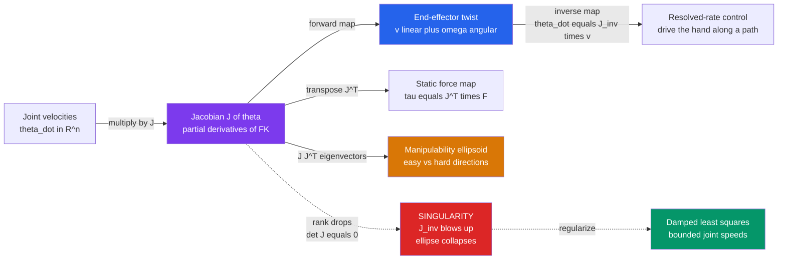

# 🦾 Velocity Kinematics and the Jacobian

> [!abstract] TL;DR
> The **Jacobian** is the matrix of partial derivatives that maps how fast each joint moves to how fast the robot's hand (end-effector) moves — its instantaneous "gearing." It governs velocity control, exposes **singularities** where the mapping degenerates, quantifies **dexterity** via manipulability, and — through its transpose — maps end-effector forces back to joint torques.

---

## Intuition

**Analogy:** Turn the steering wheel of a car a little and the car's heading changes a little. The *gearing* between how fast you turn the wheel and how fast the car turns is not fixed — at parking speed a big wheel turn barely reorients the car, at highway speed the same turn swings it hard. The **Jacobian is the robot's full gearing matrix**: it tells you exactly how a small twist of *each* joint translates into motion of the hand, in every direction at once.

And when that gearing goes bad, the Jacobian is what warns you. In some configurations the hand can *barely* crawl in a certain direction — you'd need enormous joint speeds to move it a hair (a **singularity**). In others the hand glides. The Jacobian encodes all of it: a linear map that changes shape as the arm changes pose.

Concretely, forward kinematics gives position as a function of joint angles, $\mathbf{x} = f(\boldsymbol{\theta})$. Differentiate and you get $\dot{\mathbf{x}} = J(\boldsymbol{\theta})\,\dot{\boldsymbol{\theta}}$ — velocity in, velocity out, with $J$ the local conversion factor that depends on *where* the arm currently is.

---

## How It Works

### Core Mechanics

1. **Start from forward kinematics.** The pose of the end-effector is a nonlinear function of the joint variables: $\mathbf{x} = f(\boldsymbol{\theta})$, where $\boldsymbol{\theta}\in\mathbb{R}^n$ are joint angles and $\mathbf{x}$ is the hand's position (and orientation).
2. **Differentiate to linearize.** Taking the time derivative via the chain rule gives $\dot{\mathbf{x}} = \dfrac{\partial f}{\partial \boldsymbol{\theta}}\,\dot{\boldsymbol{\theta}} = J(\boldsymbol{\theta})\,\dot{\boldsymbol{\theta}}$. The matrix $J = \partial f/\partial\boldsymbol{\theta}$ is the **Jacobian** — a matrix of partial derivatives that is *reevaluated at every configuration*.
3. **The output is a twist.** In full 3D, $\dot{\mathbf{x}}$ stacks linear velocity $\mathbf{v}\in\mathbb{R}^3$ and angular velocity $\boldsymbol{\omega}\in\mathbb{R}^3$ into a 6-vector called a **twist**. So $J$ is $6\times n$: its top three rows produce $\mathbf{v}$, its bottom three produce $\boldsymbol{\omega}$.
4. **Geometric vs analytic Jacobian.** The **geometric** Jacobian expresses $\boldsymbol{\omega}$ as a true angular velocity vector (built column-by-column from joint axes). The **analytic** Jacobian instead differentiates a specific orientation parameterization (Euler angles, quaternions); the two differ by a representation-dependent transform on the rotational block.
5. **Invert to control.** Given a desired hand velocity $\mathbf{v}_d$, solve for joint rates: $\dot{\boldsymbol{\theta}} = J^{-1}\mathbf{v}_d$ (square, full-rank) or $\dot{\boldsymbol{\theta}} = J^{+}\mathbf{v}_d$ (the **pseudoinverse** for non-square / redundant arms). This is **resolved-rate motion control**.
6. **Singularities.** Where $J$ loses rank ($\det J = 0$ for a square $J$), the map collapses: the hand loses the ability to move in some direction, and $J^{-1}$ blows up, demanding infinite joint speed.
7. **Force duality.** The *transpose* runs the map backwards for forces: a static wrench $\mathbf{F}$ at the hand produces joint torques $\boldsymbol{\tau} = J^{T}\mathbf{F}$. Same matrix, transposed — velocities forward, forces backward.

### Flow / Architecture



---

## Key Concepts

### Secondary (intuitive level)
- **Gearing analogy** — the Jacobian is the pose-dependent "gear ratio" between joint speeds and hand speed.
- **Some directions are easy, some are hard** — an outstretched arm can pull its hand back and forth along its length easily but struggles to move it perpendicular; a folded arm is nimble in more directions.
- **A fully-straight arm is stuck** — pushed to its limit it cannot move outward at all. That helplessness is a **singularity**.

### Undergraduate (working level)
- **Definition:** $J_{ij} = \partial f_i / \partial \theta_j$; the velocity relation $\dot{\mathbf{x}} = J\dot{\boldsymbol{\theta}}$ is the linearization of forward kinematics (see [[Partial_Derivatives]] and [[Matrices_and_Determinants]]).
- **Twist output:** end-effector velocity is *linear + angular* stacked as a 6-vector; $J$ is $6\times n$.
- **Inverting the map:** square full-rank → $J^{-1}$; otherwise the Moore–Penrose **pseudoinverse** $J^{+} = J^{T}(JJ^{T})^{-1}$ gives the minimum-norm joint velocity (rooted in least-squares / [[Singular_Value_Decomposition]]).
- **Resolved-rate control:** integrate $\dot{\boldsymbol{\theta}} = J^{-1}\mathbf{v}_d$ over time to trace a Cartesian path.
- **Force/torque duality:** $\boldsymbol{\tau} = J^{T}\mathbf{F}$ — the transpose maps hand forces to joint torques (a consequence of virtual work, $\mathbf{F}^{T}\mathbf{v} = \boldsymbol{\tau}^{T}\dot{\boldsymbol{\theta}}$).
- **Manipulability:** the ellipse/ellipsoid $\{J J^{T}\}$; its axes are eigenvectors of $JJ^{T}$ scaled by $\sqrt{\lambda_i}$ (see [[Eigenvalues_and_Eigenvectors]]).

### Graduate (theory level)
- **Geometric vs analytic Jacobian:** $J_a = E(\phi)^{-1} J_g$ where $E$ relates the chosen orientation-rate parameterization to true angular velocity; $E$ is itself singular at *representation* singularities (e.g. gimbal lock) distinct from *kinematic* singularities.
- **Manipulability measure:** Yoshikawa's $w = \sqrt{\det(JJ^{T})} = \prod_i \sigma_i$, the product of the singular values of $J$; $w\to 0$ at singularities.
- **Condition number:** $\kappa(J) = \sigma_{\max}/\sigma_{\min}$ measures *isotropy* of the ellipsoid; $\kappa\to\infty$ near singularities → numerical ill-conditioning.
- **Damped least squares (Levenberg–Marquardt):** $\dot{\boldsymbol{\theta}} = J^{T}(JJ^{T} + \lambda^{2} I)^{-1}\mathbf{v}_d$ trades exact tracking for bounded joint speeds through singular regions.
- **Redundancy resolution:** for $n>6$, the null-space projector $(I - J^{+}J)$ lets secondary objectives (joint limits, obstacle avoidance) ride along without disturbing the hand's motion.

---

## Python Demo

```python
# Velocity kinematics of a planar 2-link arm:
#   (a) resolved-rate control -- command a straight-line hand velocity,
#       integrate joint velocities theta_dot = inv(J) @ v to trace the path;
#   (b) manipulability ellipses from J J^T at several configs, and their
#       COLLAPSE as the arm approaches a singularity (fully extended).
import numpy as np
import matplotlib.pyplot as plt

L1, L2 = 1.0, 1.0  # link lengths

def forward_kinematics(theta):
    t1, t2 = theta
    x = L1*np.cos(t1) + L2*np.cos(t1 + t2)
    y = L1*np.sin(t1) + L2*np.sin(t1 + t2)
    return np.array([x, y])

def jacobian(theta):
    # J = d(x,y)/d(theta1, theta2) for the planar 2-link arm
    t1, t2 = theta
    s1, c1 = np.sin(t1), np.cos(t1)
    s12, c12 = np.sin(t1 + t2), np.cos(t1 + t2)
    return np.array([
        [-L1*s1 - L2*s12, -L2*s12],
        [ L1*c1 + L2*c12,  L2*c12],
    ])

def elbow_position(theta):
    return np.array([L1*np.cos(theta[0]), L1*np.sin(theta[0])])

# ---- (a) Resolved-rate motion control -------------------------------------
theta = np.array([np.deg2rad(60.0), np.deg2rad(60.0)])  # start well-conditioned
v_cmd = np.array([0.35, -0.35])                          # straight-line hand velocity
dt, steps = 0.01, 100
path = [forward_kinematics(theta)]
arms = [theta.copy()]
for _ in range(steps):
    J = jacobian(theta)
    if abs(np.linalg.det(J)) < 1e-4:      # guard against singularity
        break
    theta_dot = np.linalg.solve(J, v_cmd)  # inv(J) @ v, numerically stable
    theta = theta + theta_dot * dt
    path.append(forward_kinematics(theta))
    arms.append(theta.copy())
path = np.array(path)

# ---- (b) Manipulability ellipses ------------------------------------------
def ellipse_pts(theta, scale=0.35):
    J = jacobian(theta)
    A = J @ J.T                       # 2x2 velocity-manipulability matrix
    vals, vecs = np.linalg.eigh(A)    # eigen-decomposition (symmetric)
    axes = np.sqrt(np.maximum(vals, 0.0))
    phi = np.linspace(0, 2*np.pi, 100)
    circle = np.vstack([np.cos(phi), np.sin(phi)])
    pts = vecs @ np.diag(axes) @ circle * scale   # map unit circle -> ellipse
    w = np.sqrt(np.linalg.det(A))                 # Yoshikawa manipulability
    return pts, w

configs = [
    ("well-conditioned", np.array([np.deg2rad(60), np.deg2rad(90)])),
    ("moderate",         np.array([np.deg2rad(45), np.deg2rad(45)])),
    ("near singular",    np.array([np.deg2rad(30), np.deg2rad(8)])),  # nearly extended
]

fig, (ax1, ax2) = plt.subplots(1, 2, figsize=(13, 6))

# Left: the arm tracing a straight line under resolved-rate control
for th in arms[::20]:
    base, elb, ee = np.zeros(2), elbow_position(th), forward_kinematics(th)
    ax1.plot([base[0], elb[0], ee[0]], [base[1], elb[1], ee[1]],
             '-o', color='0.75', lw=1.5, ms=3, zorder=1)
ax1.plot(path[:, 0], path[:, 1], 'r-', lw=2.5, label='hand path (straight)', zorder=3)
ax1.plot(*path[0], 'go', ms=9, label='start', zorder=4)
ax1.plot(*path[-1], 'bs', ms=9, label='end', zorder=4)
ax1.plot(0, 0, 'k^', ms=11, label='base')
ax1.set_title("(a) Resolved-rate control: theta_dot = inv(J) @ v")
ax1.set_aspect('equal'); ax1.legend(loc='upper right'); ax1.grid(alpha=0.3)

# Right: manipulability ellipses at three poses
colors = ['#059669', '#d97706', '#dc2626']
for (name, th), col in zip(configs, colors):
    ee = forward_kinematics(th)
    base, elb = np.zeros(2), elbow_position(th)
    ax2.plot([base[0], elb[0], ee[0]], [base[1], elb[1], ee[1]],
             '-o', color=col, lw=2, ms=4, alpha=0.9)
    pts, w = ellipse_pts(th)
    ax2.plot(pts[0] + ee[0], pts[1] + ee[1], color=col, lw=2.5,
             label=f"{name}: w={w:.2f}")
ax2.plot(0, 0, 'k^', ms=11, label='base')
ax2.set_title("(b) Manipulability ellipse collapses at a singularity")
ax2.set_aspect('equal'); ax2.legend(loc='upper right'); ax2.grid(alpha=0.3)

plt.tight_layout()
plt.savefig("jacobian_manipulability.png", dpi=110)
print("Manipulability w = sqrt(det(J J^T)) at each config:")
for name, th in configs:
    _, w = ellipse_pts(th)
    print(f"  {name:16s}: w = {w:.4f}   (0 == singular)")
```

Running it prints a shrinking manipulability measure `w` as the arm approaches full extension (the "near singular" pose has `w` close to 0), and plots (a) the arm sweeping its hand along a straight line and (b) three ellipses — a fat, near-circular ellipse when the arm is folded, flattening to a thin sliver as it straightens. The thin direction is exactly where the hand can *barely* move: the geometric signature of a singularity.

---

## Real-World Applications

> **Example — Cartesian jogging on industrial arms (KUKA, ABB, Universal Robots).** When an operator jogs the tool in a straight line with a teach pendant, the controller runs **resolved-rate control**: it reads the commanded Cartesian velocity, computes $\dot{\boldsymbol{\theta}} = J^{-1}\mathbf{v}_d$ at the current pose, and streams joint rates. Near a wrist singularity the controller detects the exploding condition number and either slows down, refuses the motion, or switches to **damped least squares** to keep joint speeds finite.

> **Example — surgical robots (Intuitive da Vinci).** The surgeon's hand velocity at the master console is mapped through the Jacobian to slave-arm joint velocities for smooth, tremor-scaled tool motion; manipulability is monitored so instruments avoid low-dexterity poses inside the patient.

> **Example — force control and haptics.** Grinding, polishing, and human-collaborative robots use the duality $\boldsymbol{\tau} = J^{T}\mathbf{F}$ to render a desired contact force purely by commanding joint torques — no wrist force sensor needed for the mapping itself. Haptic devices likewise turn measured joint torques into a felt force at the handle.

> **Example — humanoids and quadrupeds (Boston Dynamics-style whole-body control).** With more joints than task dimensions, controllers use the pseudoinverse plus null-space projection to track a foot/hand trajectory while simultaneously balancing, respecting joint limits, and avoiding self-collision.

---

## Common Pitfalls

- **Singularities blow up $J^{-1}$.** As $\det J \to 0$, $J^{-1}$ demands near-infinite joint speeds and any noise in $\mathbf{v}_d$ is amplified. Never invert blindly. Use **damped least squares** $\dot{\boldsymbol{\theta}} = J^{T}(JJ^{T}+\lambda^{2}I)^{-1}\mathbf{v}_d$, which caps joint velocity at the cost of small tracking error, and monitor the **condition number** / manipulability to trigger the damping.
- **Confusing analytic and geometric Jacobians.** The angular part of a twist is *not* the derivative of Euler angles. Mixing a geometric Jacobian's $\boldsymbol{\omega}$ with an analytic controller expecting Euler-rate feedback silently corrupts orientation control. Pick one convention and convert with $E(\phi)$ explicitly.
- **Representation singularities masquerading as kinematic ones.** Euler-angle parameterizations hit *gimbal lock* where the analytic Jacobian degenerates even though the arm is perfectly dexterous. This is a coordinate artifact, not a physical one — quaternions or the geometric Jacobian avoid it.
- **Units and stacking order in the twist.** Linear ($m/s$) and angular ($rad/s$) components live in different units; naively taking a norm or building an isotropic manipulability measure across both is meaningless without a weighting/scaling matrix.
- **Forgetting the Jacobian is configuration-dependent.** $J$ must be recomputed every control cycle. Caching a Jacobian from a previous pose introduces drift and instability in fast motions.

---

## Related Concepts

- [[Partial_Derivatives]] — the Jacobian is literally the matrix of partial derivatives of the forward-kinematics map; this is the calculus it is built from.
- [[Matrices_and_Determinants]] — $J$ is a linear map; its **determinant** vanishing is the algebraic test for a singularity.
- [[Linear_Transformations]] — the Jacobian is the *local linear transformation* from joint-velocity space to end-effector twist space.
- [[Singular_Value_Decomposition]] — the SVD of $J$ gives the pseudoinverse for redundant/non-square arms, the condition number, and the principal axes of the manipulability ellipsoid.
- [[Eigenvalues_and_Eigenvectors]] — eigen-decomposition of $JJ^{T}$ yields the manipulability ellipse's axes and directions.
- [[Vectors_and_Vector_Spaces]] — column space and null space of $J$ define reachable hand-velocity directions and redundant "self-motions."
- [[Rotational_Dynamics]] — angular velocity $\boldsymbol{\omega}$, half of the end-effector twist, comes from rigid-body rotational kinematics.
- [[Newtons_Laws_and_Kinematics]] — grounds the linear-velocity half of the twist in classical particle/rigid-body kinematics.

*Sibling notes in this vault (Foundations of Robotics):* Forward Kinematics supplies the map $\mathbf{x}=f(\boldsymbol{\theta})$ that the Jacobian differentiates; Inverse Kinematics is the position-level counterpart that resolved-rate control solves incrementally in velocity; Robot Dynamics and Equations of Motion adds mass and torque on top of this velocity layer; and Robotic Manipulation and Grasping uses the force duality $\boldsymbol{\tau}=J^{T}\mathbf{F}$ to control contact.

---

## Review Questions

1. **(Secondary)** Using the steering-wheel analogy, explain in plain words why an arm stretched perfectly straight cannot move its hand outward, and what that condition is called.
2. **(Undergraduate)** Given a square, full-rank Jacobian $J$ and a desired end-effector velocity $\mathbf{v}_d$, write the expression for the required joint velocities. What changes if the robot has *more* joints than task dimensions, and which specific solution does the pseudoinverse pick?
3. **(Graduate)** A controller must pass a manipulator through a wrist singularity while jogging in a straight line. Contrast plain $J^{-1}$, the Moore–Penrose pseudoinverse, and damped least squares in terms of tracking accuracy, joint-velocity boundedness, and the role of the condition number $\kappa(J)=\sigma_{\max}/\sigma_{\min}$. Which would you deploy on a real robot, and how would you choose the damping factor $\lambda$?

---

## Sources

- Lynch, K. M. & Park, F. C. — *Modern Robotics: Mechanics, Planning, and Control* (Cambridge, 2017), Ch. 5 "Velocity Kinematics and Statics." [Book site](https://hades.mech.northwestern.edu/index.php/Modern_Robotics)
- Craig, J. J. — *Introduction to Robotics: Mechanics and Control* (4th ed., Pearson), Ch. 5 "Jacobians: velocities and static forces."
- Siciliano, B., Sciavicco, L., Villani, L. & Oriolo, G. — *Robotics: Modelling, Planning and Control* (Springer, 2009), Ch. 3 "Differential Kinematics and Statics."
- Murray, R. M., Li, Z. & Sastry, S. S. — *A Mathematical Introduction to Robotic Manipulation* (CRC, 1994), Ch. 3–4 (twists, the spatial/body Jacobian). [Free PDF](https://www.cds.caltech.edu/~murray/mlswiki/)
- Yoshikawa, T. — "Manipulability of Robotic Mechanisms," *Int. J. of Robotics Research* 4(2), 1985.

---

#robotics #jacobian #velocity-kinematics #manipulability #singularities
