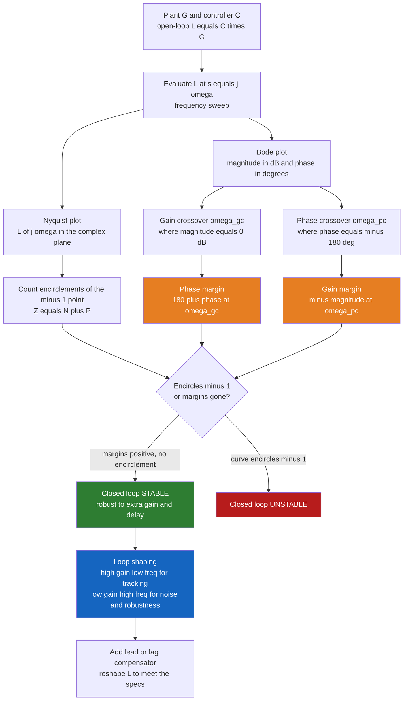

# 📉 Bode, Nyquist and Loop Shaping

> [!abstract] TL;DR
> **Bode and Nyquist plots** answer one question about a feedback loop: at every frequency, *how much does the loop amplify a signal, and how much does it delay it?* If the loop ever amplifies a signal by more than one **while** flipping its phase by a full $180°$, that signal feeds back on itself and grows — the loop is unstable. The **gain margin** and **phase margin** measure how far you are from that catastrophe, the **Nyquist criterion** turns encirclements of the point $-1$ into a rigorous stability test, and **loop shaping** is the design craft of sculpting the open-loop frequency response $L(j\omega)$ to get accurate tracking, good disturbance rejection, and robustness all at once.

---

## Intuition

**Analogy — the whisper down the line.** Imagine you stand at the head of a long chain of people and whisper a command. Each person relays it to the next, and after some delay it travels all the way around and comes *back to you*. Now two things can happen. If the message returns *quieter* than it left, it dies out — the chain is stable. But if the message returns **louder than it left** *and* **perfectly out of step** — arriving exactly as you draw breath to whisper again, reinforcing itself — it will build, whisper on whisper, into a deafening roar. That runaway is exactly how a feedback loop goes unstable.

A control loop faces the same peril. The signal that leaves the controller travels through the plant, gets measured, and returns as feedback. Two numbers decide its fate at each frequency: the **gain** (how much the round trip amplifies it) and the **phase** (how much the round trip delays it). The disaster is the coincidence of **"gain still above one"** with **"phase flipped a full $180°$"** — because a $180°$ phase flip turns *negative* feedback (which corrects) into *positive* feedback (which reinforces). Bode and Nyquist plots are the engineer's **stethoscope**: they measure that gain and that phase across all frequencies, so you can see, long before you build the thing, exactly how close the dreaded coincidence comes — and design to keep it far away.

---

## How It Works

We analyze the **open-loop transfer function** $L(s) = C(s)G(s)$ (controller times plant), evaluated along the imaginary axis $s = j\omega$. The closed-loop transfer function is $T = \frac{L}{1+L}$, so the closed loop blows up wherever $1 + L = 0$, i.e. wherever $L(j\omega) = -1$. Everything below is machinery for measuring *how close $L(j\omega)$ gets to that fatal $-1$.*

1. **Sweep the frequency.** Compute $L(j\omega)$ for $\omega$ from near-DC to very high. Its magnitude $|L|$ and phase $\angle L$ are the two Bode curves.
2. **Find the two crossovers.** The **gain crossover** $\omega_{gc}$ is where $|L| = 1$ ($0$ dB); the **phase crossover** $\omega_{pc}$ is where $\angle L = -180°$.
3. **Read the margins.** **Phase margin** $= 180° + \angle L(j\omega_{gc})$ — how much *extra phase lag* the loop tolerates before instability. **Gain margin** $= 1 / |L(j\omega_{pc})|$ — how much *extra gain* it tolerates. Both must be positive and comfortably large.
4. **Cross-check with Nyquist.** Plot $L(j\omega)$ in the complex plane and count how many times it encircles $-1$. The Nyquist criterion $Z = N + P$ ties open-loop poles to closed-loop stability exactly, with no approximation.
5. **Shape the loop.** Adjust $L$ to hit specs: **high gain at low frequency** for tracking and disturbance rejection, **low gain at high frequency** for noise immunity and robustness, with a well-placed crossover in between.



---

## Key Concepts

### 🟢 Secondary — the plain-language picture

- **Two plots, one stethoscope.** The **Bode plot** shows, frequency by frequency, how much the loop *amplifies* a signal (magnitude) and how much it *delays* it (phase). The **Nyquist plot** shows the same information as a single curve winding through the plane.
- **Decibels and decades.** Magnitude is drawn in **decibels** ($20\log_{10}|L|$, a logarithmic scale so huge and tiny gains fit on one axis) against frequency on a **log scale**. $0$ dB means "gain of exactly one — leaves as loud as it arrives."
- **The danger coincidence.** Trouble is the pairing of *gain above one* with *phase flipped $180°$*. A $180°$ flip turns a correcting signal into a reinforcing one; if it is also amplified, it runs away.
- **Margins = safety buffers.** The **gain margin** and **phase margin** say how much extra amplification or extra delay the loop can swallow before that coincidence happens. Bigger margins mean a calmer, more forgiving system.

### 🟡 Undergraduate — the working machinery

- **Asymptotic Bode sketching.** Each real pole at $\omega = a$ bends the magnitude down by an extra $-20$ dB/decade beyond its **corner frequency** $a$ and adds $-90°$ of phase (spread over roughly a decade either side); each zero does the opposite ($+20$ dB/decade, $+90°$). Sum the straight-line asymptotes and you have a hand sketch accurate to a few dB.
- **Slopes and pole count.** An $n$-pole roll-off falls at $-20n$ dB/decade. A single integrator $1/s$ gives $-20$ dB/decade and a flat $-90°$; it is why **Type-1** systems track a step with zero steady-state error.
- **Gain crossover $\omega_{gc}$** — where $|L| = 0$ dB; sets the closed-loop **bandwidth** (roughly the speed of response). **Phase crossover $\omega_{pc}$** — where $\angle L = -180°$.
- **Phase margin** $\text{PM} = 180° + \angle L(j\omega_{gc})$; **gain margin** $\text{GM} = -20\log_{10}|L(j\omega_{pc})|$ dB. Rules of thumb: PM $\ge 45°$ and GM $\ge 6$ dB for a well-damped loop. PM also predicts damping: $\zeta \approx \text{PM}/100$ for PM up to about $60°$.
- **Nyquist criterion.** $Z = N + P$: the number of unstable closed-loop poles $Z$ equals the clockwise encirclements $N$ of $-1$ by $L(j\omega)$ plus the number of unstable open-loop poles $P$. For a stable open-loop plant ($P = 0$), **stability demands zero encirclements of $-1$**.

### 🔴 Graduate — the design and its limits

- **Loop shaping.** Directly design the shape of $|L(j\omega)|$: high **loop gain** at low frequency (so the **sensitivity** $S = \frac{1}{1+L}$ is small — good tracking and disturbance rejection), a controlled crossover slope near $-20$ dB/decade (for adequate phase margin), and low gain at high frequency (so the **complementary sensitivity** $T = \frac{L}{1+L}$ rolls off — noise rejection and robustness to unmodeled dynamics).
- **Lead and lag compensators.** A **lead** $C(s) = \frac{s+z}{s+p}$ with $z < p$ injects positive phase near crossover to *buy back phase margin* and speed the loop up. A **lag** $z > p$ raises low-frequency gain to *kill steady-state error* without disturbing crossover. **Lead-lag** does both.
- **The sensitivity / complementary-sensitivity tradeoff.** $S + T = 1$ **identically at every frequency** — you cannot make both small at the same $\omega$. Push disturbance rejection down (small $S$) in one band and it must pop up elsewhere.
- **Bode's sensitivity integral (the waterbed effect).** For a stable, strictly-proper open loop, $\int_0^\infty \ln|S(j\omega)|\,d\omega = 0$ (or $= \pi\sum \text{Re}(p_k)$ with RHP poles). Pushing $|S|$ **below** one over some band ($\ln|S| < 0$) forces it **above** one elsewhere — squeeze the waterbed here, it bulges there. Robust design manages *where* the bulge lands, it cannot remove it.
- **Time delay eats phase.** A pure delay $e^{-j\omega\tau}$ has magnitude exactly $1$ but phase $-\omega\tau$ radians — unbounded and growing with frequency. It subtracts phase margin without touching the magnitude curve, and is a leading cause of loops that look fine on a gain plot yet oscillate in hardware.

---

## Python Demo

We take an open-loop transfer function $L(s) = \dfrac{K}{s(s+1)(s+2)}$ — an integrator plus two lag poles, a classic Type-1 loop — and evaluate $L(j\omega)$ **directly with numpy** (no scipy). We (a) draw the **Bode plot** and read off the gain and phase margins at the two crossover frequencies, and (b) draw the **Nyquist diagram** and watch the curve march toward the critical point $-1$ as we raise the loop gain $K$. The margins shrink to zero at $K = 6$ and go negative beyond — the loop encircles $-1$ and goes unstable.

```python
# Bode plot, stability margins, and Nyquist diagram for an open-loop L(s),
# evaluated directly with numpy (no scipy).  L(s) = K / ( s (s+1)(s+2) ).
import numpy as np
import matplotlib.pyplot as plt

def L_of_jw(w, K):
    """Open-loop frequency response L(j*omega) = K / ( jw (jw+1)(jw+2) )."""
    s = 1j * w
    return K / (s * (s + 1.0) * (s + 2.0))

def interp_crossing(x, y, level):
    """First x where y crosses `level`, by linear interpolation on the grid."""
    d = y - level
    idx = np.where(np.diff(np.sign(d)) != 0)[0]
    if len(idx) == 0:
        return None
    i = idx[0]
    return x[i] - d[i] * (x[i + 1] - x[i]) / (d[i + 1] - d[i])

# ---- frequency sweep for the Bode plot (base gain) ----
w = np.logspace(-2, 2, 4000)                 # 0.01 .. 100 rad/s
K_base = 2.0
L = L_of_jw(w, K_base)
mag_dB = 20.0 * np.log10(np.abs(L))
phase_deg = np.degrees(np.unwrap(np.angle(L)))   # continuous (unwrapped) phase

# gain crossover: |L| = 1  ->  mag_dB = 0   ->  gives the PHASE MARGIN
w_gc = interp_crossing(w, mag_dB, 0.0)
phase_at_gc = np.interp(w_gc, w, phase_deg)
PM = 180.0 + phase_at_gc

# phase crossover: phase = -180 deg          ->  gives the GAIN MARGIN
w_pc = interp_crossing(w, phase_deg, -180.0)
mag_at_pc = np.interp(w_pc, w, mag_dB)
GM_dB = -mag_at_pc

print(f"K = {K_base}")
print(f"  gain  crossover w_gc = {w_gc:.3f} rad/s  ->  phase margin = {PM:5.1f} deg")
print(f"  phase crossover w_pc = {w_pc:.3f} rad/s  ->  gain  margin = {GM_dB:5.1f} dB")

# ---- margins collapse toward instability as the loop gain rises ----
print("\ngain sweep (margins shrink as K grows; unstable once GM < 0):")
for K in [1.0, 2.0, 4.0, 6.0, 8.0]:
    m = 20 * np.log10(np.abs(L_of_jw(w, K)))
    p = np.degrees(np.unwrap(np.angle(L_of_jw(w, K))))
    wg = interp_crossing(w, m, 0.0)
    wp = interp_crossing(w, p, -180.0)
    pm = 180 + np.interp(wg, w, p) if wg is not None else float("nan")
    gm = -np.interp(wp, w, m) if wp is not None else float("nan")
    print(f"  K = {K:>3.0f}:   PM = {pm:6.1f} deg    GM = {gm:6.1f} dB")

# ---------------- plotting ----------------
fig = plt.figure(figsize=(12, 7))
gs = fig.add_gridspec(2, 2)
ax_mag = fig.add_subplot(gs[0, 0])
ax_ph = fig.add_subplot(gs[1, 0], sharex=ax_mag)
ax_ny = fig.add_subplot(gs[:, 1])

# --- Bode magnitude ---
ax_mag.semilogx(w, mag_dB, color="steelblue")
ax_mag.axhline(0, color="k", lw=0.8, ls="--")
ax_mag.axvline(w_gc, color="seagreen", ls=":", label=f"w_gc = {w_gc:.2f}")
ax_mag.axvline(w_pc, color="crimson", ls=":", label=f"w_pc = {w_pc:.2f}")
ax_mag.annotate(f"GM = {GM_dB:.1f} dB", xy=(w_pc, mag_at_pc),
                xytext=(w_pc, mag_at_pc - 18),
                arrowprops=dict(arrowstyle="->"), ha="center")
ax_mag.set_ylabel("|L(jw)|  (dB)")
ax_mag.set_title(f"Bode plot   L(s) = K / ( s (s+1)(s+2) ),  K = {K_base}")
ax_mag.grid(True, which="both", alpha=0.3)
ax_mag.legend(fontsize=8)

# --- Bode phase ---
ax_ph.semilogx(w, phase_deg, color="darkorange")
ax_ph.axhline(-180, color="k", lw=0.8, ls="--")
ax_ph.axvline(w_gc, color="seagreen", ls=":")
ax_ph.axvline(w_pc, color="crimson", ls=":")
ax_ph.annotate(f"PM = {PM:.0f} deg", xy=(w_gc, phase_at_gc),
               xytext=(w_gc, phase_at_gc + 45),
               arrowprops=dict(arrowstyle="->"), ha="center")
ax_ph.set_xlabel("omega  (rad/s)")
ax_ph.set_ylabel("phase  (deg)")
ax_ph.grid(True, which="both", alpha=0.3)

# --- Nyquist for two gains: watch the curve march toward -1 ---
wn = np.logspace(-2, 2, 4000)
for K, col in [(2.0, "steelblue"), (6.0, "crimson")]:
    Lp = L_of_jw(wn, K)
    ax_ny.plot(Lp.real, Lp.imag, color=col, label=f"K = {K}")        # w > 0
    ax_ny.plot(Lp.real, -Lp.imag, color=col, ls="--", alpha=0.5)     # w < 0 mirror
ax_ny.plot(-1, 0, "kx", ms=11, mew=2, label="critical point -1")
theta = np.linspace(0, 2 * np.pi, 240)
ax_ny.plot(np.cos(theta), np.sin(theta), color="gray", lw=0.6, alpha=0.5)  # unit circle
ax_ny.axhline(0, color="k", lw=0.5)
ax_ny.axvline(0, color="k", lw=0.5)
ax_ny.set_xlim(-3, 1)
ax_ny.set_ylim(-2, 2)
ax_ny.set_xlabel("Re L(jw)")
ax_ny.set_ylabel("Im L(jw)")
ax_ny.set_title("Nyquist: raising K pushes the curve onto -1")
ax_ny.legend(fontsize=8)
ax_ny.set_aspect("equal", "box")

plt.tight_layout()
plt.show()
```

Running it prints a phase margin of about $33°$ and a gain margin of about $9.5$ dB at $K = 2$. The gain sweep shows both margins collapsing as $K$ climbs: at $K = 6$ the gain margin hits exactly $0$ dB — the Nyquist curve passes straight through $-1$ (marginal), and for $K = 8$ the curve encircles $-1$ and the closed loop is unstable. The Bode panels mark the two crossover frequencies and annotate the margins directly; the Nyquist panel shows the blue ($K=2$) curve safely clearing $-1$ while the red ($K=6$) curve is pinned to it.

---

## Real-World Applications

- **Drone and quadrotor attitude loops.** Flight controllers are tuned to a target phase margin (often $30°$–$45°$) so the fast inner rate loop stays damped despite motor lag and sensor delay; too little margin shows up as visible high-frequency oscillation of the airframe.
- **Hard-disk and optical-drive servos.** Read/write head positioning is designed by loop shaping — high gain at low frequency to reject vibration and track the track, a crossover set by mechanical resonances, and steep roll-off above to avoid exciting them.
- **Switching power supplies (buck/boost converters).** Compensator design is pure Bode work: engineers place a lead-lag network to get a crossover near a fraction of the switching frequency with $45°$–$60°$ of phase margin, guaranteeing the regulator does not ring or oscillate under load steps.
- **Process control (chemical plants, HVAC).** Loops dominated by transport **time delay** are tuned conservatively because the delay eats phase margin; Nyquist and margin analysis quantify exactly how much gain the operator can add before the loop hunts.
- **Automotive cruise control and steering.** Frequency-domain margins certify that the loop tolerates the modeled range of vehicle mass, road grade, and actuator lag without becoming twitchy or sluggish.

---

## Common Pitfalls

- **Conditional stability.** Some loops are stable at the *design* gain but go unstable if the gain is *reduced* (the Nyquist curve dips below $-1$ on the low-frequency side). A single gain margin number hides this; you must inspect the whole Nyquist curve, not just one crossing.
- **Non-minimum-phase dynamics.** A right-half-plane zero adds phase *lag* while raising the magnitude — the worst possible combination. It sharply caps achievable bandwidth and can make aggressive loop shaping impossible; the classic symptom is initial *wrong-way* response (undershoot).
- **Time delay eating phase margin.** A delay $\tau$ is invisible on the magnitude plot but subtracts $\omega\tau$ radians of phase. A loop with a beautiful gain margin can still have almost no phase margin once the true transport delay is included — always model the delay.
- **Margins are necessary, not sufficient.** Gain and phase margins probe robustness only along two specific axes (pure gain change, pure phase change). A loop can have healthy PM *and* GM yet sit dangerously close to $-1$ in some other direction. The **vector margin** (shortest distance from $L(j\omega)$ to $-1$, equivalently the peak of the sensitivity $\|S\|_\infty$) is the honest single-number robustness measure.
- **MIMO limits of the classical picture.** Bode and Nyquist are single-input single-output tools. In multivariable systems, gain and phase vary with *direction*, loops interact, and per-channel margins can lie. Multivariable robustness needs **singular values** of $S$ and $T$ and structured tools ($H_\infty$, $\mu$-analysis), not scalar margins.

---

## Related Concepts

- [[Transfer_Functions]] — the pole-zero description of $L(s)$ whose evaluation at $s = j\omega$ *is* the frequency response we plot.
- [[Stability_Frequency_Response]] — the $s$-plane view (pole locations, Routh-Hurwitz, $H(j\omega)$) that Bode and Nyquist recast in the frequency domain.
- [[BIBO_Stability]] — the pole-in-the-left-half-plane condition that the Nyquist encirclement count certifies for the *closed* loop.
- [[Frequency_Spectrum]] — magnitude-and-phase-versus-frequency thinking, the same lens applied to signals rather than loops.
- [[Laplace_Transform]] — the transform that turns the loop's differential equations into the rational $L(s)$ we evaluate.
- [[Complex_Numbers_and_Functions]] — the complex plane in which $L(j\omega)$ traces its Nyquist curve; magnitude and argument are its polar form.
- [[Residue_Theorem_and_Applications]] — the **argument principle** behind Nyquist: encirclements of $-1$ count the RHP zeros of $1 + L$, i.e. unstable closed-loop poles.
- [[Exponential_and_Logarithmic_Functions]] — the logarithm that makes decibels and log-frequency axes turn multiplicative gain into additive, sketchable slopes.
- [[Oscillations_and_SHM]] — resonance and phase lag in a driven second-order system, the physical roots of the phase-margin-versus-damping link.
- [[Robotics_and_Control_Overview]] — where these frequency-domain margins sit in the broader sense-plan-act control stack.

Sibling notes in this section (frequency-domain analysis builds directly on them): *Transfer Functions and Frequency Response* supplies the $L(s)$ we sweep; *Stability: Routh-Hurwitz and Root Locus* gives the complementary $s$-plane stability tests; *Feedback Control Fundamentals* frames the closed loop $T = L/(1+L)$; and *Adaptive and Robust Control* extends margins into $H_\infty$ and $\mu$-synthesis when the plant is uncertain.

---

## Review Questions

### 🟢 Secondary
1. In plain words, why is the combination of "loop gain still above one" and "phase flipped by $180°$" the recipe for instability? Connect it to the whisper-down-the-line analogy.

### 🟡 Undergraduate
2. A loop's Bode plot shows $|L| = 0$ dB at $\omega = 3$ rad/s where the phase is $-140°$, and $\angle L = -180°$ at $\omega = 8$ rad/s where $|L| = -12$ dB. State the phase margin and the gain margin, and say whether the closed loop is stable.
3. You sketch the asymptotic Bode magnitude of $L(s) = \frac{100}{s(s+10)}$. What is the slope below $\omega = 10$, the slope above it, and roughly where does $|L|$ cross $0$ dB?

### 🔴 Graduate
4. Your loop meets its tracking spec but has only $18°$ of phase margin and oscillates. Design-wise, would you add a lead or a lag compensator, where would you place its zero and pole relative to the current crossover, and what does the sensitivity integral warn you must happen elsewhere as a price?
5. A plant has a right-half-plane zero at $s = 2$ and a transport delay of $0.1$ s. Explain how *each* limits the achievable closed-loop bandwidth, why gain and phase margins can look acceptable while the true robustness (vector margin / $\|S\|_\infty$) is poor, and what tool you would use instead for a $2\times2$ multivariable version of this plant.

---

## Sources

- Åström, K. J., & Murray, R. M. — *Feedback Systems: An Introduction for Scientists and Engineers*, 2nd ed. (Princeton University Press, 2021) — Chs. 9–12 (frequency-domain analysis, loop shaping, robustness).
- Ogata, K. — *Modern Control Engineering*, 5th ed. (Prentice Hall, 2010) — Chs. 7–9 (Bode, Nyquist, margins).
- Franklin, G. F., Powell, J. D., & Emami-Naeini, A. — *Feedback Control of Dynamic Systems*, 8th ed. (Pearson, 2019) — Ch. 6 (frequency-response design).
- Skogestad, S., & Postlethwaite, I. — *Multivariable Feedback Control: Analysis and Design*, 2nd ed. (Wiley, 2005) — Chs. 2–3 (loop shaping, sensitivity, MIMO limits).

---

#robotics #bode-plot #nyquist #loop-shaping #stability-margins
