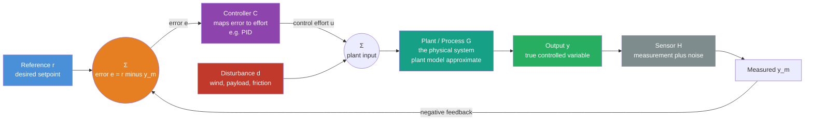

# 🔁 Feedback Control Fundamentals

> [!abstract] TL;DR
> **Feedback control** is the discipline of making an imperfect, disturbed, poorly-known system behave precisely by **closing a loop**: measure the output, compare it to the desired **reference** to form an **error**, and let a **controller** drive that error toward zero — continuously, forever. An **open-loop** controller acts and hopes; the moment friction, payload, wind, or a wrong model intervenes, it drifts. A **closed-loop** controller watches its own error and cancels it, buying **disturbance rejection**, **robustness to model uncertainty**, **stabilization** of unstable plants, and **tracking** of moving targets — all without predicting the future perfectly. The price of that power is the field's central worry: **too much feedback can make a system unstable.** This note frames the whole of classical control — the transfer-function, stability, frequency-response, and state-space machinery in the rest of this section all exist to design and analyze this one loop.

---

## Intuition

**Analogy — a thermostat is the whole of control theory in one gadget.** A thermostat measures the room, compares it to the temperature you dialed in, and turns the heat up or down to close the gap — then keeps checking, forever. It does not need a physics model of your house, it does not need to know that a window just opened or that guests are warming the room; it simply reacts to the *error* between what is and what you want. Open the window (a disturbance) and the room cools, the error grows, the furnace works harder, and the temperature is pulled back to your setpoint. That is the entire idea.

Every cruise control, autopilot, drone, and robot joint is that same loop: **SENSE** the error, **ACT** to shrink it, **REPEAT**. The magic of feedback is that it makes an imperfect, disturbed, poorly-known system behave as if it were precise and obedient — *without ever needing to predict the future perfectly*. You trade the impossible task of modelling every disturbance in advance for the tractable task of reacting to their combined effect as it shows up in one number: the error. The catch, which the rest of this section is largely about, is that reacting too hard — too much gain, too much delay — makes the room temperature swing wildly instead of settling. Feedback is a bargain, and stability is its fine print.

---

## How It Works

### The anatomy of the loop

Classical feedback control is built from a small, fixed cast of parts, wired into a ring:

1. **Reference / setpoint ($r$)** — the desired value of the controlled variable (target temperature, commanded joint angle, cruising speed).
2. **Error ($e = r - y_m$)** — the difference between what you want and what you *measure*. This single signal is the beating heart of the loop; every controller is a rule for turning $e$ into action.
3. **Controller ($C$)** — the decision law that maps error to a **control effort** $u$ (a valve opening, a motor voltage, a rudder angle). The workhorse is **PID**, but the choice of $C$ is the whole art of the field.
4. **Plant / process ($G$)** — the physical system being controlled (the furnace-and-room, the robot arm, the car). Its behaviour is captured by a **plant model** (an ODE, a transfer function, or a state-space model), which is always approximate.
5. **Disturbance ($d$)** — every unmodelled influence pushing on the plant: an opened window, a payload, a gust of wind, friction. Rejecting these is *why feedback exists*.
6. **Sensor / measurement ($H$)** — turns the true output $y$ into a measured signal $y_m$. Real sensors add **noise** and **lag**, which the loop unavoidably feeds back.
7. **Feedback path** — routes $y_m$ back to be subtracted from $r$. Subtraction (rather than addition) is **negative feedback**: it makes the loop *oppose* its own error, which is what produces self-correction and stability. Positive feedback does the opposite and generally runs away.

### Open loop vs closed loop

- **Open-loop (feedforward) control** computes $u$ from the reference and a *model* alone — no measurement is fed back. A microwave "cook for 60 seconds" or a stepper motor "advance 200 steps" is open-loop. It is simple, cheap, and cannot become unstable, but it is only as good as its model, and it is **blind to disturbances**: if the plant differs from the model or the world pushes back, the output is simply wrong with no mechanism to notice.
- **Closed-loop (feedback) control** feeds the measured output back and acts on the *error*. It automatically compensates for model error and disturbances because both show up in $e$. The best real controllers combine the two: **feedforward** supplies the bulk of the effort from the model (fast, predictive), while **feedback** mops up the residual error the model missed (corrective, robust).

### Why feedback — the four payoffs

- **Disturbance rejection.** The loop attenuates the effect of $d$ by roughly the loop gain, turning a large unmodelled push into a small residual offset.
- **Robustness to model uncertainty.** High loop gain makes the closed-loop response depend mostly on the *feedback path*, not the messy, uncertain plant — so a 20% error in the plant model barely moves the output.
- **Stabilization.** Feedback can make an *unstable* plant stable (a quadrotor or an inverted pendulum stays upright only because a fast loop corrects it hundreds of times a second).
- **Tracking.** The loop makes the output *follow* a changing reference (a robot arm sweeping a trajectory), not merely hold a fixed value.

### Regulation vs tracking, SISO vs MIMO

Two problem types recur: **regulation** holds the output at a constant setpoint against disturbances (temperature control), while **tracking** follows a time-varying reference (trajectory following). Most plants here are **SISO** (single-input, single-output); when there are many coupled inputs and outputs — a walking robot's dozens of joints — the problem becomes **MIMO**, and the scalar tools of classical control give way to the matrix machinery of state space (covered later in this section).

### The performance specs and the central trade-off

We judge a loop by its **step response** — how the output reacts to a sudden setpoint change — through four numbers: **rise time** (how fast it first reaches the target), **overshoot** (how far it sails past), **settling time** (how long until it stays near target), and **steady-state error** (the leftover offset once transients die). These fight each other. Cranking up the controller gain shrinks rise time and steady-state error but grows overshoot and, eventually, sustained oscillation and **instability**. Speed versus oscillation, accuracy versus stability, and responsiveness versus **sensor-noise amplification** are the eternal tensions — which is why **stability is the first question you always ask** and the reason the tools that follow exist.



---

## Key Concepts

### 🟢 Secondary — the plain-language picture

- **The loop.** Measure where you are, compare to where you want to be, correct the difference, repeat. That is feedback control.
- **Error.** The gap between the target (setpoint) and the measurement. Everything the controller does is a reaction to this one number.
- **Open loop vs closed loop.** Open loop = act and hope (a microwave timer). Closed loop = act, measure, correct (a thermostat). Closed loop survives surprises; open loop does not.
- **Negative feedback.** The loop *subtracts* the measurement from the target so that it always pushes back against its own error — this is what makes it self-correcting instead of runaway.
- **Disturbance.** Anything unplanned that pushes the system (an opened window, a bump, a load). Rejecting disturbances is the whole reason to close the loop.
- **The gain dial.** Push harder on the error and the system reacts faster — but push too hard and it starts to oscillate and shake apart.

### 🟡 Undergraduate — the working machinery

- **The signals.** Reference $r$, error $e = r - y_m$, control effort $u$, disturbance $d$, output $y$, measurement $y_m$. Draw them as a block diagram and control design becomes bookkeeping on this diagram.
- **Proportional feedback and steady-state error.** The simplest controller, $u = K_p e$, reduces error but a pure-proportional loop on a static plant always leaves a **residual offset** of order $1/(1+K_p \cdot \text{gain})$ — raising $K_p$ shrinks it but never kills it (integral action does; that comes next).
- **Loop gain and sensitivity.** The **sensitivity function** $S = 1/(1+L)$ (with $L$ the loop gain) measures how much of a disturbance leaks through: large loop gain $\Rightarrow$ small $S$ $\Rightarrow$ strong disturbance rejection and low sensitivity to plant error. But $S$ cannot be small at every frequency.
- **Performance specs.** Rise time, percent overshoot, settling time, steady-state error — all read off the **step response** and all traceable to the closed-loop poles (damping ratio $\zeta$ and natural frequency $\omega_n$ for a second-order dominant pair).
- **Stability first.** A closed loop is stable only if all its poles lie in the left half-plane. High gain and time delay drag poles toward the right — losing stability is the failure mode that dominates control design.
- **Regulation vs tracking, type number.** Whether the loop can zero the steady-state error depends on how many free integrators ("type number") sit in the loop versus whether the reference is a step, ramp, or parabola.

### 🔴 Graduate — the frontier machinery

- **The plant model as the design object.** Feedback tolerates model error, but you still design *against a model* — a transfer function $G(s)$ or a state-space $(A,B,C,D)$. Model fidelity sets how much loop gain you can safely use before unmodelled dynamics destabilise you.
- **Fundamental limitations.** The **Bode sensitivity integral** ("waterbed effect") says $\int \ln|S(j\omega)|\,d\omega$ is conserved: push disturbance rejection down at one frequency and it *must* pop up elsewhere. Right-half-plane zeros and time delays impose hard bandwidth ceilings no controller can beat.
- **Robust stability margins.** Gain and phase margins (and the more honest disk/vector margins) quantify how much model error the loop absorbs before poles cross into the right half-plane — the formal content of "robustness to uncertainty."
- **Noise vs disturbance trade-off.** $S$ (disturbance-to-output) and the complementary $T = 1 - S$ (noise-to-output) satisfy $S + T = 1$ everywhere: you cannot reject low-frequency disturbances *and* ignore high-frequency sensor noise without giving something up. Loop-shaping is the art of allocating each frequency band.
- **From SISO to MIMO and state space.** Coupled multivariable plants need matrix methods — pole placement, LQR, observers — where the feedback law becomes $u = -Kx$ and stability is read from the eigenvalues of $A - BK$.
- **Feedforward + feedback two-degree-of-freedom design.** Separate the tracking objective (feedforward from the model) from the regulation objective (feedback on the error) so each can be tuned without compromising the other.

---

## Python Demo

We simulate a **mass–spring–damper** plant, $m\ddot y + b\dot y + k y = u + d$ — a canonical second-order stand-in for a robot joint, suspension, or actuator. Three experiments make the case for feedback:

- **(A) Setpoint tracking.** An **open-loop** controller applies a hand-picked constant force and *undershoots* the target, because hitting the setpoint would require knowing the plant gain exactly. A **closed-loop** proportional controller drives the output near the reference (leaving a small, characteristic steady-state offset of pure P control).
- **(B) Disturbance rejection.** Both loops first reach the setpoint; then a step disturbance hits. The open-loop output shifts by the *full* disturbance and stays there forever (it is blind). The closed-loop output rejects most of it, settling with only a small residual offset attenuated by the loop gain.
- **(C) The gain trade-off.** Sweeping $K_p$ shows the eternal tension: low gain is sluggish, medium gain is snappy, high gain is fast but *oscillatory* — a preview of the stability limit.

```python
# Feedback control fundamentals: open-loop vs closed-loop proportional control
# of a mass-spring-damper plant:  m*y'' + b*y' + k*y = u + d
# Demonstrates setpoint tracking, disturbance rejection, and the gain trade-off.
import numpy as np
import matplotlib.pyplot as plt

# --- Plant parameters (a 1-DOF second-order system) ---
m, b, k = 1.0, 2.0, 1.0     # mass [kg], damping [N.s/m], stiffness [N/m]
dc_gain = 1.0 / k            # plant steady-state gain: y_ss = u_ss / k
r = 1.0                      # reference / setpoint [m]
dt, T = 0.005, 20.0          # timestep and horizon [s]
steps = int(T / dt)
t = np.linspace(0.0, T, steps)

def simulate(control_law, dist_fn=lambda ti: 0.0, s0=(0.0, 0.0)):
    """Integrate the plant with RK4 under a given control law and disturbance."""
    s = np.array(s0, dtype=float)          # state = [position y, velocity y_dot]
    y_hist = np.zeros(steps)
    u_hist = np.zeros(steps)
    for i in range(steps):
        y_hist[i] = s[0]
        d = dist_fn(t[i])                  # disturbance force at this instant
        u = control_law(s, t[i])           # controller decides the effort (ZOH over step)
        u_hist[i] = u
        def f(state):
            y, yd = state
            return np.array([yd, (u + d - b * yd - k * y) / m])
        k1 = f(s)
        k2 = f(s + 0.5 * dt * k1)
        k3 = f(s + 0.5 * dt * k2)
        k4 = f(s + dt * k3)
        s = s + (dt / 6.0) * (k1 + 2 * k2 + 2 * k3 + k4)
    return y_hist, u_hist

# --- Control laws ---
u_blind = 0.65                                   # a "reasonable" constant, picked blind
open_loop     = lambda s, ti: u_blind            # never looks at the output
def p_control(Kp):
    return lambda s, ti: Kp * (r - s[0])         # proportional feedback on the error

# --- Disturbance: a step of +0.8 N applied at t = 10 s ---
step_dist = lambda ti: 0.8 if ti >= 10.0 else 0.0

# ================= (A) Setpoint tracking, no disturbance =================
y_open, _   = simulate(open_loop)
y_closed, _ = simulate(p_control(Kp=8.0))

# ================= (B) Disturbance rejection =================
# Open loop uses perfect feedforward u = k*r so it first reaches the setpoint,
# isolating the disturbance effect; then it is blind to the step at t = 10 s.
y_open_d, _   = simulate(lambda s, ti: k * r, dist_fn=step_dist)
y_closed_d, _ = simulate(p_control(Kp=8.0), dist_fn=step_dist)

# ================= (C) Gain trade-off =================
gains = [2.0, 8.0, 24.0]
y_by_gain = {Kp: simulate(p_control(Kp))[0] for Kp in gains}

# --- Report the key numbers ---
print(f"(A) open-loop   final y = {y_open[-1]:.3f}  (target {r}) -> blind undershoot")
print(f"(A) closed-loop final y = {y_closed[-1]:.3f}  (target {r}) -> small P offset")
print(f"(B) open-loop   post-disturbance y = {y_open_d[-1]:.3f}  (full offset, no rejection)")
print(f"(B) closed-loop post-disturbance y = {y_closed_d[-1]:.3f}  (disturbance rejected)")
for Kp in gains:
    ss_err = k / (k + Kp)                         # theoretical steady-state error of pure P
    print(f"(C) Kp={Kp:>4}:  final y = {y_by_gain[Kp][-1]:.3f},  predicted SS error = {ss_err:.3f}")

# --- Plots ---
fig, ax = plt.subplots(3, 1, figsize=(9, 11))

ax[0].axhline(r, ls='--', color='k', label='setpoint')
ax[0].plot(t, y_open,   color='crimson',  label='open loop (blind constant input)')
ax[0].plot(t, y_closed, color='seagreen', label='closed loop (P feedback, Kp=8)')
ax[0].set_title('(A) Setpoint tracking: feedback finds the target, open loop guesses')
ax[0].set_ylabel('position y [m]'); ax[0].legend(loc='lower right')

ax[1].axhline(r, ls='--', color='k', label='setpoint')
ax[1].axvline(10.0, ls=':', color='gray', label='disturbance hits')
ax[1].plot(t, y_open_d,   color='crimson',  label='open loop (blind to disturbance)')
ax[1].plot(t, y_closed_d, color='seagreen', label='closed loop (rejects disturbance)')
ax[1].set_title('(B) Disturbance rejection: the whole point of closing the loop')
ax[1].set_ylabel('position y [m]'); ax[1].legend(loc='center right')

ax[2].axhline(r, ls='--', color='k', label='setpoint')
for Kp, col in zip(gains, ['#4A90D9', '#E67E22', '#C0392B']):
    ax[2].plot(t, y_by_gain[Kp], color=col, label=f'Kp = {Kp} ({"sluggish" if Kp==2 else "snappy" if Kp==8 else "oscillatory"})')
ax[2].set_title('(C) The gain trade-off: faster response buys overshoot and oscillation')
ax[2].set_xlabel('time [s]'); ax[2].set_ylabel('position y [m]'); ax[2].legend(loc='lower right')

plt.tight_layout()
plt.show()
```

Running it, panel **(A)** shows the open-loop mass parking at `0.65 m` — wherever its blind constant force happens to balance the spring — while the closed loop climbs to about `0.89 m`, close to the target with the small residual offset that pure proportional control always leaves. Panel **(B)** is the punchline: after the disturbance hits, the open-loop output jumps by the full disturbance and *stays* there, permanently wrong, while the closed loop pushes back and settles near the setpoint again. Panel **(C)** shows the gain dial in action: `Kp=2` is slow and accurate-ish, `Kp=8` is a good compromise, and `Kp=24` is fast but rings — a live preview of why *stability*, not speed, is the first thing a control engineer checks.

---

## Real-World Applications

- **Automotive cruise control.** The reference is your set speed, the sensor is the wheel-speed signal, the plant is the car, and hills and headwinds are the disturbances. A PI loop holds speed within a couple of km/h up a grade that would slow an open-loop throttle dramatically.
- **Quadrotor / drone attitude.** Inherently unstable — a drone stays level only because an IMU-driven feedback loop corrects roll, pitch, and yaw hundreds of times per second. This is feedback used for *stabilization*, not just tracking.
- **Industrial process control (temperature, flow, level).** The overwhelming majority of the millions of control loops in refineries and chemical plants are single feedback loops holding a temperature or level against feed and ambient disturbances — the domain that gave PID its name.
- **Robot joint servos (FANUC, KUKA, ABB).** Each joint runs a cascaded position/velocity/torque feedback loop so the arm lands within microns despite gravity, payload changes, and friction — with feedforward from the dynamics model handling the predictable bulk.
- **Hard-disk read/write heads and camera image stabilization.** High-bandwidth feedback loops position a head over a track, or counter-rotate a lens element against hand-shake, faster than any human or open-loop scheme could.

---

## Common Pitfalls

- **Instability from too much gain.** The single most important failure mode. Raising the controller gain to chase speed and accuracy eventually drives the closed-loop poles into the right half-plane — especially once real-world **time delay** and unmodelled high-frequency dynamics enter — turning correction into growing oscillation. Always establish a stability margin before pushing gain.
- **Steady-state error with pure P.** A proportional-only controller needs a nonzero error to produce a nonzero effort, so it structurally leaves a residual offset (and cannot reject a constant load without one). The fix is **integral action**, which accumulates error until the offset is driven to zero — the reason PID exists.
- **Sensor-noise amplification.** Feedback feeds the measurement — noise and all — straight back into the control effort. High gain and especially **derivative** action multiply high-frequency sensor noise into a jittery, actuator-thrashing command. Filter the measurement, band-limit derivative terms, or estimate the state (Kalman) rather than differentiating a noisy signal.
- **Actuator saturation and integrator windup.** Real actuators have limits (max thrust, valve fully open). When the controller commands more than the actuator can deliver, the loop is effectively open, and an integrator keeps "winding up," causing large overshoot when the actuator finally catches up. Anti-windup logic is essential in any loop with integral action.
- **Trusting open-loop / feedforward alone.** Feedforward is only as good as its model and is blind to disturbances — the instant reality diverges from the model, there is no mechanism to notice. Use feedforward for speed but *always* wrap feedback around it for robustness.
- **Ignoring the plant model's validity range.** A loop tuned on a linear model can misbehave where the real plant is nonlinear or its parameters have drifted (a hot motor, a heavy payload). Feedback tolerates modest model error, not arbitrary amounts.

---

## Related Concepts

This note opens the **Classical Control** section; the machinery for designing and analysing the loop follows in sibling notes on *PID Control* (the workhorse controller that adds integral and derivative action to the proportional term shown here), *Transfer Functions and Frequency Response* (the $s$-domain language for the loop), *Stability via Routh–Hurwitz and Root Locus* (the algebra and geometry of where the poles go), *Bode, Nyquist and Loop Shaping* (the frequency-domain design tools), and *State-Space Models in Control* (the matrix generalisation to MIMO systems).

- [[Robotics_and_Control_Overview]] — the field map this loop sits at the heart of; sense–plan–act *is* the feedback loop.
- [[State_Feedback_Control]] — the state-space generalisation $u = -Kx$, where the scalar gain here becomes a gain *matrix* and stability is read from the eigenvalues of $A - BK$.
- [[Transfer_Functions]] — the $s$-domain representation of the plant and controller that turns block diagrams into algebra.
- [[Stability_Frequency_Response]] — how pole locations and frequency response determine whether a closed loop settles or diverges.
- [[BIBO_Stability]] — the bounded-input bounded-output notion of stability that a good feedback design must guarantee.
- [[Impulse_Response]] — the plant's fundamental fingerprint from which step response and stability follow.
- [[Controllability_Observability]] — whether a plant *can* be steered by its actuators and reconstructed from its sensors, the prerequisites for feedback design.
- [[Feedback_Loops_and_Causality]] — the systems-thinking foundation of self-regulation shared by every homeostatic system, from cells to economies.
- [[Cybernetics_and_Control]] — the historical and conceptual root of goal-seeking machines, negative feedback, and the "good regulator" idea.
- [[Nonlinearity_and_Feedback]] — why real plants resist the linear analysis of classical control and need nonlinear methods.
- [[Dynamical_Systems_and_Attractors]] — the state-space geometry of convergence, limit cycles, and instability underlying "settling" versus "oscillating."
- [[Stocks_Flows_and_System_Dynamics]] — the same integrator-and-feedback structure viewed as accumulating stocks regulated by flows.
- [[Second_Order_Linear_ODEs]] — the mass–spring–damper mathematics behind rise time, overshoot, damping ratio, and natural frequency.
- [[Systems_of_ODEs]] — the differential-equation machinery for simulating and analysing the closed loop.
- [[Eigenvalues_and_Eigenvectors]] — the spectral tool that decides closed-loop stability and response modes.
- [[Reinforcement_Learning]] — the learning-based alternative to hand-designed feedback laws for hard-to-model plants.

---

## Review Questions

### 🟢 Secondary
1. In one sentence, explain what it means to "close the loop," and why a thermostat holds temperature against an open window while an open-loop timer-based heater cannot.

### 🟡 Undergraduate
2. A proportional controller drives a robot joint to *almost* its target but always leaves a small offset. Explain, in terms of how a proportional controller generates its effort, why this steady-state error is unavoidable — and name the controller term that eliminates it.
3. Distinguish disturbance rejection from setpoint tracking, and explain why raising the loop gain improves *both* the steady-state error and the disturbance rejection while worsening overshoot and noise sensitivity.

### 🔴 Graduate
4. You have a plant with significant sensor noise and a known step disturbance to reject. Using the sensitivity relation $S + T = 1$, argue why you cannot simultaneously make disturbance rejection perfect at all frequencies and noise rejection perfect at all frequencies, and describe how you would allocate loop gain across the frequency band.
5. Feedback can stabilise an open-loop-unstable plant (e.g. an inverted pendulum) yet *destabilise* a stable one if the gain is too high. Reconcile these two facts by reasoning about where feedback moves the closed-loop poles, and name two real-world effects (present in hardware but absent from an idealised model) that impose the upper limit on usable gain.

---

## Sources

- Åström, K. J., & Murray, R. M. — *Feedback Systems: An Introduction for Scientists and Engineers*, 2nd ed. (Princeton University Press, 2021).
- Ogata, K. — *Modern Control Engineering*, 5th ed. (Prentice Hall, 2010).
- Franklin, G. F., Powell, J. D., & Emami-Naeini, A. — *Feedback Control of Dynamic Systems*, 8th ed. (Pearson, 2019).
- Nise, N. S. — *Control Systems Engineering*, 8th ed. (Wiley, 2019).
- Dorf, R. C., & Bishop, R. H. — *Modern Control Systems*, 13th ed. (Pearson, 2017).

---

#robotics #control-theory #feedback #closed-loop #disturbance-rejection
