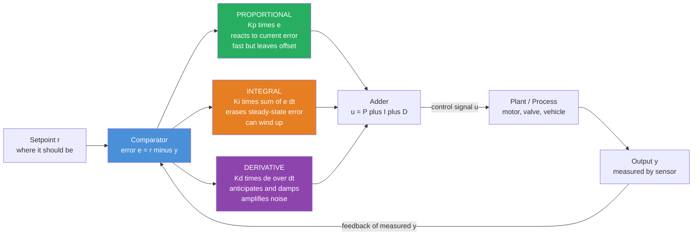

# 🎛️ PID Control

> [!abstract] TL;DR
> The **PID controller** computes a corrective command from three views of the error between where a system *is* and where it *should be*: $u = K_p\,e + K_i\!\int e\,dt + K_d\,\dfrac{de}{dt}$. **Proportional** reacts to the current error (but leaves a steady-state offset), **Integral** erases that offset by accumulating past error (but can overshoot and *wind up*), and **Derivative** anticipates and damps based on how fast the error is changing (but amplifies noise). It is the workhorse of engineering — an estimated **95 percent of industrial control loops** are PID or PI — precisely because it can be *tuned* to work well **without ever writing down the plant's equations**.

---

## Intuition

**Analogy — steering a car back to the center of your lane.** You do three things at once, without thinking about any of them. First, the farther you have drifted toward the shoulder, the harder you turn back — turn *proportional* to how wrong things are. That is the **P** term. Second, if you have been riding slightly left-of-center for a while (maybe there is a steady crosswind, or the road is cambered), you gradually add extra correction to cancel that persistent lean — you respond to the *accumulated history* of the error. That is the **I** term. Third, as you feel the car finally swinging back toward center, you *ease off the wheel early* so you do not overshoot into the oncoming lane — you react to how *fast* the error is closing. That is the **D** term.

The PID controller is exactly this three-part driving instinct written as one formula. Notice what you *did not* do while steering: you never solved the car's differential equations of motion, never computed its mass or tire stiffness. You tuned three reflexes by feel. That is the whole secret to PID's dominance — it is a **model-free** feedback law that, with three tunable knobs, handles the vast majority of the world's control problems, from cruise control and thermostats to chemical reactors, disk-drive heads, and drone attitude loops.

---

## How It Works

### Core mechanics

The controller lives inside a **feedback loop**. Every cycle it does four things:

1. **Measure and compare.** Read the process output $y(t)$ from a sensor and subtract it from the desired **setpoint** $r(t)$ to form the **error** $e(t) = r(t) - y(t)$.
2. **Split the error three ways.** Feed $e$ into three parallel branches:
   - **Proportional** $K_p\,e$ — a stiffness that pushes back in proportion to how wrong things are *right now*. Larger $K_p$ means faster response but more oscillation. Alone, P leaves a **steady-state error**: at equilibrium some error must remain to keep producing the command that holds the system in place.
   - **Integral** $K_i\!\int_0^t e\,d\tau$ — accumulates every bit of past error. As long as *any* error persists, the integral keeps growing and keeps pushing, so it **drives the steady-state error to exactly zero**. The price: it adds lag and can **wind up** (accumulate huge values) when the actuator saturates.
   - **Derivative** $K_d\,\dfrac{de}{dt}$ — looks at the *rate* the error is changing and applies a braking action when the system rushes toward the setpoint, adding **damping** and reducing overshoot. The price: differentiating a noisy sensor signal **amplifies noise**, so D is almost always paired with a low-pass filter.
3. **Sum the branches** into a single command $u(t) = K_p e + K_i\!\int e\,dt + K_d\,\dot e$.
4. **Actuate, then repeat.** Send $u$ to the motor/valve/heater; the plant responds; the new output feeds back into step 1.

The genius is that the three terms answer three different questions — *how wrong now?* (P), *how wrong have we been?* (I), *how fast are we fixing it?* (D) — and their weighted sum is a remarkably capable controller.

### Flow / architecture



Every PID relative sits inside this same skeleton: a **P** controller drops the I and D branches, a **PI** controller drops D (the most common industrial choice — I kills the offset, and D is left off because process sensors are noisy), and a **PD** controller drops I (used when zero steady-state error is not required but damping is). The idea of comparing output to a goal and feeding the difference back is the same **negative-feedback** principle explored in *Feedback_Control_Fundamentals*.

---

## Key Concepts

### 🟢 Secondary — the plain-language picture

- **Setpoint and error.** The setpoint is the target (desired temperature, position, speed); the error is how far off you are. PID acts on the error, not the raw value.
- **Three instincts.** P = *push harder the more wrong you are*; I = *if you've been wrong for a while, push even harder to fix it*; D = *ease off as you close in so you don't overshoot*.
- **Why three and not one.** P alone stops slightly short of the goal and can wobble; I finishes the job but can overshoot; D calms the wobble. Together they balance.
- **Tuning by feel.** You do not need the plant's equations. Turn up P until it responds briskly, add I until the leftover offset disappears, add D if it oscillates.

### 🟡 Undergraduate — the working machinery

- **The control law.** $u(t) = K_p e(t) + K_i\!\int_0^t e\,d\tau + K_d\,\dot e(t)$, often written in the equivalent form $u = K_p\left(e + \frac{1}{T_i}\!\int e\,dt + T_d\,\dot e\right)$ with **integral time** $T_i = K_p/K_i$ and **derivative time** $T_d = K_d/K_p$.
- **Steady-state error.** For a plant with finite DC gain, a P-only controller leaves error $\propto 1/(1+K_p\cdot\text{gain})$; adding integral action makes the loop **type 1** and forces steady-state error to zero for a step reference.
- **Transient specs.** Tuning trades off **rise time** (how quickly you reach the target), **overshoot** (how far you sail past it), and **settling time** (when you stay within a tolerance band, usually 2 percent). P speeds rise but grows overshoot; D shrinks overshoot; I removes offset but can slow settling.
- **Ziegler–Nichols tuning.** The classic 1942 recipe: raise $K_p$ (with I, D off) until the loop oscillates steadily at the **ultimate gain** $K_u$ with **oscillation period** $P_u$, then set $K_p=0.6K_u,\ T_i=P_u/2,\ T_d=P_u/8$. Aggressive (roughly 25 percent overshoot) but a fast starting point when you have no model.
- **Frequency view.** In the Laplace domain the controller is $C(s)=K_p+\frac{K_i}{s}+K_d s$; its effect on loop gain, phase margin, and stability is analyzed with the tools in *Transfer_Functions_and_Frequency_Response*.

### 🔴 Graduate — the practical and theoretical edges

- **Integral windup and anti-windup.** When the actuator **saturates** (a valve is fully open, a motor hits max torque), the error persists but extra command has no effect — yet the integral keeps accumulating. When the setpoint is finally reached, the huge stored integral drives a large overshoot before it "unwinds." Fixes: **conditional integration** (freeze the integral while saturated), **back-calculation** (feed the difference between commanded and saturated output back into the integrator with gain $1/T_t$), or clamping.
- **Derivative filtering and setpoint weighting.** Pure differentiation amplifies sensor noise, so D is implemented as a filtered derivative $\frac{K_d s}{1+ (T_d/N) s}$ with $N \approx 8\text{–}20$. To avoid a **derivative kick** (an impulse when the setpoint steps), D (and often P) act on the *measurement* $-\dot y$ rather than on the error; **setpoint weighting** $e_p = \beta r - y$ tunes the two-degree-of-freedom response.
- **Discrete/digital PID.** On a microcontroller the law is discretized at sample time $T_s$: the integral becomes a running sum $\sum e_k T_s$ and the derivative a backward difference $(e_k - e_{k-1})/T_s$. **Velocity (incremental) form** computes $\Delta u_k$ instead of $u_k$, which gives windup protection and **bumpless transfer** for free. Sampling must be fast relative to the loop bandwidth (see *State_Space_Models_in_Control* and the sampling theorem).
- **Bumpless transfer and mode switching.** Switching between manual and automatic, or re-tuning on the fly, must not jump the output; the integrator state is initialized so $u$ is continuous.
- **Fundamental limits.** PID is **SISO** and has **no explicit lookahead** — it reacts to error rather than predicting it. It struggles with strong **nonlinearity**, significant **transport delay / dead time** (where a Smith predictor or *Model_Predictive_Control* wins), **non-minimum-phase** plants (where derivative action can destabilize), and heavily **coupled MIMO** systems that need state-space or optimal control.

---

## Python Demo

Two experiments on a **second-order mass–spring–damper plant** $m\ddot x + c\dot x + k x = u$ (a stand-in for a DC-motor position loop or a robot joint). **(a)** We isolate the effect of each term — pure **P** (fast but oscillatory, with visible steady-state error), **PI** (offset removed, but overshoot), and **PID** (derivative adds damping, faster clean settling) — and annotate rise time, overshoot, and settling time. **(b)** We add **actuator saturation** to expose **integral windup**, then switch on **anti-windup** (conditional integration) to fix the resulting overshoot.

```python
# PID control of a second-order plant: m*x'' + c*x' + k*x = u
# (a) effect of P vs PI vs PID   (b) integral windup and anti-windup
import numpy as np
import matplotlib.pyplot as plt

# ---- Plant: mass-spring-damper (lightly damped -> will oscillate under pure P) ----
m, c, k = 1.0, 0.4, 1.0          # mass [kg], damping [N.s/m], spring [N/m]
dt, T   = 0.005, 30.0            # sample time [s], horizon [s]
n       = int(T / dt)
t       = np.linspace(0.0, T, n)
r       = 1.0                    # unit step setpoint [m]

def simulate(Kp, Ki, Kd, u_min=-1e9, u_max=1e9, anti_windup=False):
    """Discrete PID on the plant. Semi-implicit Euler keeps the plant stable."""
    x, v, integ = 0.0, 0.0, 0.0
    e_prev = r - x
    xs, us = np.zeros(n), np.zeros(n)
    for i in range(n):
        e  = r - x                          # error
        de = (e - e_prev) / dt              # derivative of error (backward difference)
        integ_try = integ + e * dt          # tentative integral update
        u_unsat = Kp * e + Ki * integ_try + Kd * de
        u = min(max(u_unsat, u_min), u_max) # actuator saturation (clip)
        # anti-windup by conditional integration: don't accumulate while saturated
        if anti_windup and u != u_unsat:
            pass                            # freeze integral (discard integ_try)
        else:
            integ = integ_try               # commit the integral
        # advance the plant one step
        a = (u - c * v - k * x) / m
        v += a * dt
        x += v * dt
        xs[i], us[i] = x, u
        e_prev = e
    return xs, us

def metrics(x):
    """Rise time (10->90%), percent overshoot, 2% settling time."""
    try:
        t10 = t[np.argmax(x >= 0.10 * r)]
        t90 = t[np.argmax(x >= 0.90 * r)]
        rise = t90 - t10
    except ValueError:
        rise = np.nan
    overshoot = max(0.0, (x.max() - r) / r * 100.0)
    outside = np.where(np.abs(x - r) > 0.02 * r)[0]
    settle = t[outside[-1]] if len(outside) else 0.0
    return rise, overshoot, settle

# ---------- (a) Effect of each term ----------
xP,  uP  = simulate(Kp=5.0, Ki=0.0, Kd=0.0)   # pure P   -> steady-state error + wobble
xPI, uPI = simulate(Kp=5.0, Ki=3.0, Kd=0.0)   # PI       -> no offset, but overshoot
xPID,uPID= simulate(Kp=5.0, Ki=3.0, Kd=4.0)   # PID      -> damped, faster clean settling

for name, x in [("P  ", xP), ("PI ", xPI), ("PID", xPID)]:
    rt, os_, st = metrics(x)
    print(f"{name}: final={x[-1]:.3f}  rise={rt:5.2f}s  overshoot={os_:5.1f}%  settle={st:5.2f}s")

# ---------- (b) Integral windup vs anti-windup (tight actuator limits) ----------
LIM = 1.3                                       # actuator saturates at +/- 1.3 N
xW,  uW  = simulate(Kp=3.0, Ki=6.0, Kd=0.0, u_min=-LIM, u_max=LIM, anti_windup=False)
xA,  uA  = simulate(Kp=3.0, Ki=6.0, Kd=0.0, u_min=-LIM, u_max=LIM, anti_windup=True)
print(f"windup   overshoot = {metrics(xW)[1]:.1f}%   |   anti-windup overshoot = {metrics(xA)[1]:.1f}%")

# ---------- Plots ----------
fig, ax = plt.subplots(2, 2, figsize=(12, 8))

ax[0,0].axhline(r, ls='--', color='k', lw=1, label='setpoint')
ax[0,0].plot(t, xP,   color='crimson',   label='P  (offset + oscillation)')
ax[0,0].plot(t, xPI,  color='darkorange',label='PI (offset removed, overshoot)')
ax[0,0].plot(t, xPID, color='seagreen',  label='PID (damped, fast settling)')
ax[0,0].set_title('(a) P vs PI vs PID step response')
ax[0,0].set_ylabel('position x [m]'); ax[0,0].legend(loc='lower right')
ax[0,0].annotate('steady-state error', xy=(25, xP[-1]), xytext=(14, 0.55),
                 arrowprops=dict(arrowstyle='->'))

ax[0,1].plot(t, uP,   color='crimson',    label='u: P')
ax[0,1].plot(t, uPI,  color='darkorange', label='u: PI')
ax[0,1].plot(t, uPID, color='seagreen',   label='u: PID')
ax[0,1].set_title('(a) control signals'); ax[0,1].set_ylabel('force u [N]'); ax[0,1].legend()

ax[1,0].axhline(r, ls='--', color='k', lw=1, label='setpoint')
ax[1,0].plot(t, xW, color='crimson',   label='PI, no anti-windup')
ax[1,0].plot(t, xA, color='seagreen',  label='PI + anti-windup')
ax[1,0].set_title('(b) integral windup under actuator saturation')
ax[1,0].set_xlabel('time [s]'); ax[1,0].set_ylabel('position x [m]'); ax[1,0].legend(loc='lower right')

ax[1,1].axhline( LIM, ls=':', color='gray'); ax[1,1].axhline(-LIM, ls=':', color='gray')
ax[1,1].plot(t, uW, color='crimson',  label='u: no anti-windup (saturated long)')
ax[1,1].plot(t, uA, color='seagreen', label='u: anti-windup')
ax[1,1].set_title('(b) control signals hit the +/- 1.3 N limit')
ax[1,1].set_xlabel('time [s]'); ax[1,1].set_ylabel('force u [N]'); ax[1,1].legend()

plt.tight_layout()
plt.show()
```

Running it prints the trade-offs in numbers: **P** settles short of `1.000` (steady-state error) and rings; **PI** reaches `1.000` but overshoots; **PID** reaches `1.000` with the smallest overshoot and fastest 2 percent settling. In part (b), the no-anti-windup PI sails far past the setpoint because its integrator kept accumulating while the actuator was pinned at ±1.3 N, whereas the anti-windup version freezes the integrator during saturation and overshoots far less — the single most important practical fix in real PID code.

---

## Real-World Applications

- **Automotive cruise control.** A PI (usually) loop compares target vs actual speed and modulates throttle; the integral term holds exact speed up a grade despite the steady gravitational load — a textbook demonstration of why P alone leaves offset.
- **Process industries (chemical, oil, water).** An estimated 95 percent of loops in refineries and plants are PID/PI, regulating flow, level, pressure, and temperature. Distributed control systems (DCS) run thousands of them; almost none use a first-principles plant model — they are tuned in the field.
- **Drone and quadrotor attitude.** Cascaded PID loops (angle outer loop, angular-rate inner loop) run hundreds of hertz on the flight controller to keep an inherently unstable airframe upright; derivative action provides the damping that stops attitude oscillation.
- **3D printers and CNC.** Heated-bed and hotend temperature are held by PID (the printer's "PID autotune" runs a relay/Ziegler–Nichols-style experiment); stepper and servo motion loops use PID position control.
- **Disk drives, hard-disk head positioning, and camera gimbals.** Fast, high-bandwidth PID (with careful derivative filtering and notch compensation) positions the read/write head or stabilizes an image against hand shake.

---

## Common Pitfalls

- **Integral windup.** The number-one real-world failure: while the actuator is saturated, the integrator keeps accumulating and then drives a huge overshoot on release. Always implement **anti-windup** (conditional integration, back-calculation, or clamping) whenever the actuator can saturate — which is *always*.
- **Derivative noise amplification.** Differentiating a noisy measurement produces enormous high-frequency chatter that wears out actuators. Never use a raw derivative; use a **filtered derivative** (band-limited, $N\approx8\text{–}20$) and consider dropping D entirely (use PI) if the sensor is noisy — which is why most industrial loops are PI.
- **Derivative kick.** A step change in setpoint produces an impulse through the D term. Compute the derivative on the **measurement** ($-\dot y$) rather than on the error, and use **setpoint weighting** on P.
- **Over-tuning / chasing perfection.** Cranking $K_p$ or $K_d$ for a snappier response invites oscillation, actuator saturation, and instability once real time delay and noise enter. Aggressive Ziegler–Nichols settings often overshoot 25 percent; detune toward robustness.
- **Non-minimum-phase and dead-time surprises.** In plants whose output initially moves the *wrong way* (non-minimum-phase) or that have significant transport delay, derivative action and high gain can *destabilize* the loop. Recognize these cases and reach for a Smith predictor or *Model_Predictive_Control*.
- **Discretization mistakes.** Sampling too slowly relative to loop bandwidth, forgetting to multiply the integral by $T_s$, or using inconsistent units between the continuous gains and the discrete implementation silently ruins tuning. Match sample rate to bandwidth and validate the discrete form.

---

## Related Concepts

- [[Feedback_Loops_and_Causality]] — the systems-thinking foundation of negative feedback that PID mechanizes with three terms.
- [[Cybernetics_and_Control]] — the historical root of goal-seeking machines that correct their own error, the lineage PID descends from.
- [[Transfer_Functions]] — the frequency-domain object $C(s)=K_p+K_i/s+K_d s$ used to analyze PID loop stability and phase margin.
- [[Laplace_Transform]] — the $s$-domain machinery underneath transfer functions and controller design.
- [[Stability_Frequency_Response]] — poles, gain/phase margins, and the step-response specs (rise time, overshoot, settling) that tuning trades off.
- [[Second_Order_Linear_ODEs]] — the mass–spring–damper plant in the demo; damping ratio and natural frequency govern its response to PID.
- [[First_Order_ODEs]] — the simplest plants (thermal, RC) where PI control is analyzed in closed form.
- [[Systems_of_ODEs]] — how the closed-loop plant-plus-controller is simulated and its stability read from eigenvalues.
- [[Eigenvalues_and_Eigenvectors]] — the closed-loop poles that PID gains relocate to shape stability and response.
- [[Differentiation]] — the calculus behind the derivative term (and why differentiating noise is dangerous).
- [[Difference_Equations]] — the discrete-time recurrence that a digital PID actually runs on a microcontroller.
- [[Sampling_Theorem]] — why the sample rate must exceed the loop bandwidth for a digital PID to behave like its continuous ideal.
- [[State_Feedback_Control]] — the modern alternative $u=-Kx$ that generalizes PID to MIMO systems with full-state measurement.
- [[State_Space_Basics]] — the $\dot x = Ax + Bu$ representation into which a PID loop can be recast for analysis.
- [[Nonlinearity_and_Feedback]] — why strongly nonlinear or coupled plants defeat a single linear PID and need other methods.
- [[Robotics_and_Control_Overview]] — the field map placing PID within the larger control and robotics stack.

---

## Review Questions

### 🟢 Secondary
1. In your own words, what does each of the three PID terms "pay attention to" — and using the lane-keeping analogy, describe a driving situation where the *integral* term is the one doing the important work.

### 🟡 Undergraduate
2. A temperature loop under **proportional-only** control settles two degrees below its setpoint and refuses to close the gap. Which term fixes this, mechanically *why* does it work, and what new problem does adding it risk?
3. Explain the trade-off between rise time, overshoot, and settling time as you increase $K_p$, then $K_i$, then $K_d$. Which term would you *drop* if your sensor is very noisy, and why?

### 🔴 Graduate
4. A PI controller drives a valve that is fully open for the first several seconds of a large setpoint change, then the process finally responds and the output rockets far past target before recovering. Diagnose the phenomenon by name, explain precisely what the integrator did during saturation, and describe two anti-windup schemes that would prevent it.
5. You are handed a plant with a 4-second transport delay and non-minimum-phase behavior. Argue why aggressive PID (especially derivative action) is a poor fit here, and state what class of controller you would reach for instead and the computational cost that choice implies.

---

## Sources

- Åström, K. J., & Hägglund, T. — *PID Controllers: Theory, Design, and Tuning*, 2nd ed. (Instrument Society of America, 1995).
- Åström, K. J., & Murray, R. M. — *Feedback Systems: An Introduction for Scientists and Engineers*, 2nd ed. (Princeton University Press, 2021).
- Ogata, K. — *Modern Control Engineering*, 5th ed. (Prentice Hall, 2010).
- Ziegler, J. G., & Nichols, N. B. — "Optimum Settings for Automatic Controllers," *Transactions of the ASME*, 64, pp. 759–768 (1942).
- Franklin, G. F., Powell, J. D., & Emami-Naeini, A. — *Feedback Control of Dynamic Systems*, 8th ed. (Pearson, 2019).

---

#robotics #pid-control #tuning #feedback #controllers
