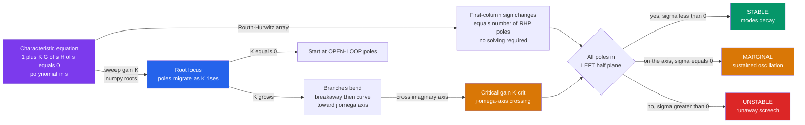

# 🎛️ Stability, Routh-Hurwitz and Root Locus

> [!abstract] TL;DR
> A feedback system is **stable** when every closed-loop pole sits in the **left half of the s-plane** (or inside the **unit circle** for discrete systems). The **Routh-Hurwitz criterion** tells you *whether* the poles are all in the left half plane — and *how many* are not — straight from the characteristic polynomial's coefficients, **without solving for a single root**. The **root locus** goes further: it draws the entire migration path of those poles as you turn a gain knob $K$, revealing the exact **critical gain** at which the system tips from damped correction into runaway oscillation.

---

## Intuition

**Analogy:** Crank the microphone gain on a PA system up slowly. For a while, louder is just louder — the loop is doing its job. Then at some critical setting a faint hum swells and, an instant later, erupts into an ear-splitting screech. Nothing about the room changed; you simply turned one knob past a **tipping point** where the loop's helpful correction became runaway oscillation. Every feedback system has that edge.

**Stability analysis is the art of finding that edge *before* you build the thing.** The **Routh-Hurwitz** criterion is a purely arithmetic check that answers "have I crossed the edge?" without ever computing the screech frequency or solving the equation. The **root locus** is the *map*: it traces how every closed-loop pole slides across the complex plane as the gain rises, so you can see the whole journey — where the poles start, where they meet, where they curve toward the imaginary axis, and the precise gain at which one crosses over and the howl begins.

Concretely: a linear system's behavior is governed by its **poles**, the roots of the **characteristic equation** $1 + K\,G(s)H(s) = 0$. A pole with a negative real part decays (good); a pole with a positive real part grows without bound (screech). The whole subject is bookkeeping on *which side of the imaginary axis the poles live*.

---

## How It Works

### Core Mechanics

1. **Poles decide everything.** For an LTI system the output is a sum of modes $e^{p_i t}$, one per pole $p_i = \sigma_i + j\omega_i$. The real part $\sigma_i$ sets growth or decay; the imaginary part $\omega_i$ sets oscillation frequency. **Asymptotic / BIBO stability requires every $\sigma_i < 0$** — all poles strictly in the open left half plane (LHP).
2. **The characteristic equation.** Close the loop with forward path $G(s)$, feedback $H(s)$, and gain $K$. The closed-loop poles are the roots of $1 + K\,G(s)H(s) = 0$, equivalently the denominator polynomial $a_n s^n + \dots + a_1 s + a_0 = 0$. Stability is a statement about *where these roots lie*.
3. **Routh-Hurwitz — stability without roots.** Arrange the coefficients into the **Routh array**. If (and only if) every entry in the array's **first column** is strictly positive — i.e. it shows **no sign changes** — all roots are in the LHP. The **number of sign changes equals the number of right-half-plane (RHP) roots**. A necessary first screen: all coefficients must be present and of the same sign.
4. **Marginal stability.** When a first-column entry becomes exactly **zero** (a whole row vanishes), a pair of roots sits *on* the imaginary axis: the system oscillates forever at a fixed amplitude — the boundary between stable and unstable, the "just about to screech" setting.
5. **Root locus — the pole migration map.** As the gain $K$ sweeps from $0$ to $\infty$, the closed-loop poles trace continuous curves. They **start at the open-loop poles** ($K=0$) and **end at the open-loop zeros or run off to infinity along asymptotes** ($K\to\infty$). Branches on the real axis lie to the *left of an odd count* of poles-plus-zeros; where two branches collide and split off the axis is a **breakaway point**; the angle a branch makes tells you the mode's **damping**.
6. **Critical gain.** The value of $K$ where a locus branch **crosses the imaginary axis** ($j\omega$-axis crossing) is the critical gain $K_{crit}$ — precisely the microphone setting where the screech begins. Below it: stable. At it: sustained oscillation. Above it: growing instability. Routh-Hurwitz and the root locus find the *same* $K_{crit}$ by different roads (Routh gives it algebraically, the locus geometrically).
7. **Design leverage.** Because the locus is *shaped* by the open-loop poles and zeros, a designer **adds poles/zeros** (a lead or lag compensator) to bend the branches toward a desired region — pulling the dominant poles left for faster, better-damped response. This is the classical bridge to **lead/lag compensation** and pole placement.
8. **Discrete-time twist.** For sampled-data systems the stability boundary is not the imaginary axis but the **unit circle** in the $z$-plane: stable poles satisfy $|z| < 1$. Same idea, different fence.

### Flow / Architecture



---

## Key Concepts

### Secondary (intuitive level)
- **The tipping point is real and findable.** Every feedback loop has a gain setting where correction turns into oscillation; the whole toolkit exists to locate it *on paper*.
- **Left is good, right is bad.** Draw the complex plane. Poles on the left side calm down; poles on the right side blow up; poles exactly on the middle line ring forever.
- **Turning up the gain moves the poles.** The root locus is literally a picture of where the poles slide as you turn the knob — you can *see* them heading for the danger line.

### Undergraduate (working level)
- **Characteristic equation:** closed-loop poles are roots of $1 + KG(s)H(s)=0$; stability $\iff$ all roots have $\mathrm{Re}(s)<0$ (see [[Complex_Numbers_and_Functions]] and [[BIBO_Stability]]).
- **Routh array construction:** first two rows are the coefficients interleaved ($s^n, s^{n-2},\dots$ and $s^{n-1}, s^{n-3},\dots$); each later entry is $\frac{b\cdot(\text{above-right}) - a\cdot(\text{below-right})}{b}$ using the two first-column pivots. First-column sign changes = number of RHP poles.
- **Cubic rule of thumb:** for $s^3 + a_2 s^2 + a_1 s + a_0$, stability requires $a_2, a_1, a_0 > 0$ **and** $a_2 a_1 > a_0$. The equality $a_2 a_1 = a_0$ gives the critical gain and an oscillation frequency $\omega = \sqrt{a_1}$.
- **Root-locus construction rules:** branches start at poles, end at zeros/infinity; real-axis segments lie left of an odd total of poles+zeros; number of asymptotes $= (\#\text{poles} - \#\text{zeros})$ at angles $\frac{(2k+1)180^\circ}{\#\text{poles}-\#\text{zeros}}$; **breakaway points** solve $dK/ds = 0$.
- **Damping from pole angle:** a dominant complex pole at angle $\theta$ from the negative real axis has damping ratio $\zeta = \cos\theta$. Radial lines from the origin are lines of constant damping.
- **Relative stability:** not just *is* it stable, but *how* stable — the gain margin (how far $K$ can rise before the locus hits the axis) and the distance of the dominant poles from the imaginary axis.

### Graduate (theory level)
- **Argument principle foundation:** Routh-Hurwitz is a coefficient-domain shortcut for counting RHP roots that the **Nyquist criterion** counts via encirclements (Cauchy's argument principle); both answer "how many zeros of $1+GH$ are in the RHP." (Contrast with the loop-shaping view in the sibling *Bode, Nyquist and Loop Shaping* note.)
- **Special Routh cases:** a **zero in the first column** with a nonzero row (use the $\epsilon$-perturbation method) versus an **entire row of zeros** (symmetric root pattern — form the auxiliary polynomial from the row above, differentiate, and continue; its roots lie *on* the $j\omega$-axis, exposing marginal stability).
- **Root locus as a conformal map:** the locus is the pre-image of the negative real axis of $G(s)H(s)$ under the **angle condition** $\angle G(s)H(s) = 180^\circ$; the **magnitude condition** $|KGH|=1$ then assigns the gain at each point.
- **Eigenvalue equivalence:** in state space the closed-loop poles are the **eigenvalues** of $A - BK$; Routh/root-locus statements about polynomial roots are statements about matrix spectra (see [[Eigenvalues_and_Eigenvectors]]). Pole placement designs $K$ to set those eigenvalues directly.
- **Right-half-plane zeros and time delay:** RHP zeros cause **inverse response** and bend the locus toward instability; a pure delay $e^{-sT}$ adds unbounded phase lag, guaranteeing a $j\omega$ crossing at *some* gain — invisible to a finite Routh array unless the delay is approximated (Padé).
- **Bifurcation view:** $K_{crit}$ is a **Hopf bifurcation** of the closed-loop dynamics — a pair of eigenvalues crossing the imaginary axis, birthing a limit cycle (see [[Bifurcations_and_Tipping_Points]]).

---

## Python Demo

```python
# Stability, root locus, and Routh-Hurwitz for the textbook feedback system
#   open-loop L(s) = K / [ s (s+1) (s+2) ]  ->  characteristic polynomial:
#   s^3 + 3 s^2 + 2 s + K = 0
# We (a) sweep the gain K, find the CLOSED-LOOP POLES with numpy.roots, and
#     plot the ROOT LOCUS -- poles migrate from the open-loop points {0,-1,-2}
#     and CROSS INTO the right-half-plane at a critical gain (instability);
# (b) simulate STEP RESPONSES below / at / above K_crit: stable -> marginal
#     sustained oscillation -> growing instability;
# (c) print a numeric ROUTH-HURWITZ table confirming the same K_crit.
import numpy as np
import matplotlib.pyplot as plt

# ---- Characteristic polynomial s^3 + 3 s^2 + 2 s + K -----------------------
def char_poly(K):
    return [1.0, 3.0, 2.0, K]      # coefficients, highest power first

# For the cubic the Routh condition is a2*a1 > a0  ->  3*2 > K  ->  K < 6.
K_crit = 6.0                       # critical gain (jw-axis crossing)
w_crit = np.sqrt(2.0)             # oscillation frequency = sqrt(a1) ~ 1.414 rad/s

# ---- (a) Root locus: closed-loop poles as functions of K ------------------
Ks = np.linspace(0.0, 20.0, 400)
locus = np.array([np.roots(char_poly(K)) for K in Ks])   # shape (nK, 3)

# ---- (c) Routh-Hurwitz table (general, for any coefficient list) ----------
def routh_table(coeffs):
    coeffs = np.asarray(coeffs, dtype=float)
    n = len(coeffs)
    cols = (n + 1) // 2
    R = np.zeros((n, cols))
    R[0, :coeffs[0::2].size] = coeffs[0::2]
    R[1, :coeffs[1::2].size] = coeffs[1::2]
    for i in range(2, n):
        a, b = R[i - 2, 0], R[i - 1, 0]
        if b == 0.0:
            b = 1e-12                       # epsilon method for a zero pivot
        for j in range(cols - 1):
            R[i, j] = (b * R[i - 2, j + 1] - a * R[i - 1, j + 1]) / b
    return R

def rhp_count(coeffs):
    col = routh_table(coeffs)[:, 0]
    return int(np.sum(np.diff(np.sign(col)) != 0))   # first-column sign changes

for K in [3.0, 6.0, 10.0]:
    R = routh_table(char_poly(K))
    print(f"K = {K:4.1f}  Routh first column = {R[:,0].round(3).tolist()}"
          f"  -> RHP poles = {rhp_count(char_poly(K))}")

# ---- (b) Step responses via RK4 on the controllable-canonical realization -
# T(s) = K / (s^3 + 3 s^2 + 2 s + K);  A,B,C,D below realize it exactly.
def step_response(K, t):
    A = np.array([[0, 1, 0],
                  [0, 0, 1],
                  [-K, -2.0, -3.0]])
    B = np.array([0.0, 0.0, 1.0])
    C = np.array([K, 0.0, 0.0])            # numerator = K
    dt = t[1] - t[0]
    x = np.zeros(3)
    y = np.zeros_like(t)
    def f(x):
        return A @ x + B * 1.0             # unit step input u = 1
    for i in range(len(t)):
        y[i] = C @ x
        k1 = f(x); k2 = f(x + 0.5*dt*k1)
        k3 = f(x + 0.5*dt*k2); k4 = f(x + dt*k3)
        x = x + (dt/6.0) * (k1 + 2*k2 + 2*k3 + k4)
    return y

t = np.linspace(0, 25, 2000)
cases = [(3.0, "K = 3  (stable)", "#059669"),
         (6.0, "K = 6  (marginal, K_crit)", "#d97706"),
         (10.0, "K = 10 (unstable)", "#dc2626")]

# ---- Plots ----------------------------------------------------------------
fig, (axL, axR) = plt.subplots(1, 2, figsize=(14, 6))

# Left: the root locus in the s-plane
for b in range(locus.shape[1]):
    axL.plot(locus[:, b].real, locus[:, b].imag, '.', ms=2.5, color='#2563eb')
open_poles = np.roots(char_poly(0.0))            # {0, -1, -2}
axL.plot(open_poles.real, open_poles.imag, 'x', ms=12, mew=3,
         color='k', label='open-loop poles (K=0)')
crit_poles = np.roots(char_poly(K_crit))
axL.plot(crit_poles.real, crit_poles.imag, 'o', ms=11, mfc='none',
         mec='#d97706', mew=2.5, label=f'K_crit = {K_crit:.0f} crossing')
axL.axvline(0, color='0.4', lw=1.2, ls='--')     # imaginary axis = stability edge
axL.axhline(w_crit, color='#d97706', lw=0.8, ls=':')
axL.axhline(-w_crit, color='#d97706', lw=0.8, ls=':')
axL.set_title("(a) Root locus: closed-loop poles vs gain K")
axL.set_xlabel("Real  (sigma)"); axL.set_ylabel("Imag  (omega)")
axL.annotate("RHP = UNSTABLE", (0.2, 1.9), color='#dc2626', fontsize=10)
axL.annotate("LHP = STABLE", (-1.9, 1.9), color='#059669', fontsize=10)
axL.legend(loc='lower left'); axL.grid(alpha=0.3)

# Right: step responses below / at / above the critical gain
for K, label, col in cases:
    axR.plot(t, step_response(K, t), color=col, lw=2, label=label)
axR.set_title("(b) Step response: stable -> marginal -> unstable")
axR.set_xlabel("time  (s)"); axR.set_ylabel("output  y(t)")
axR.set_ylim(-2, 4); axR.legend(loc='upper left'); axR.grid(alpha=0.3)

plt.tight_layout()
plt.savefig("stability_root_locus.png", dpi=110)
print(f"\nCritical gain K_crit = {K_crit:.1f}, sustained oscillation "
      f"at omega = sqrt(2) = {w_crit:.3f} rad/s")
```

Running it prints the Routh first column shrinking as `K` rises — `0` sign changes for `K = 3` (stable), the pivot hitting zero at `K = 6` (marginal), and `2` sign changes for `K = 10` (two RHP poles). The left plot shows the three locus branches leaving the open-loop poles `{0, -1, -2}`; two of them curve upward and pierce the imaginary axis at `±j√2` exactly when `K = 6`. The right plot is the payoff: `K = 3` settles, `K = 6` rings forever at a fixed amplitude (the screech held at the edge), and `K = 10` oscillates with a growing envelope — the runaway.

---

## Real-World Applications

> **Example — cruise control and drivetrain loops.** An automotive speed controller closes a loop around engine torque. Engineers run Routh-Hurwitz on the closed-loop characteristic polynomial (which includes actuator lag and sensor filtering) to certify a **gain margin** before the loop can oscillate, then use the root locus to place the dominant poles for a smooth, well-damped throttle response.

> **Example — robot joint servo tuning.** A manipulator's position loop wrapped around a motor plus gearbox is a textbook root-locus problem: too much proportional gain drags the dominant poles across the imaginary axis and the joint buzzes audibly. Classical designers use the locus to pick the gain that keeps the poles at a target damping ($\zeta \approx 0.7$) while staying fast, then add a lead compensator (an extra zero) to bend the branches further left.

> **Example — op-amp and power-supply stability.** Analog designers reason about a switching regulator's feedback compensation almost entirely through pole/zero placement on the root locus: they add a **lead-lag network** so the loop's dominant poles stay in the LHP across load, temperature, and component tolerance — the difference between a clean supply rail and a squealing one.

> **Example — aircraft flight control and PIO.** Pilot-induced oscillation is a stability-margin failure: added lag (from the pilot, actuators, or digital sampling) rotates the poles toward the axis. Flight-control laws are validated with Routh-Hurwitz-style margins and root-locus gain scheduling across the flight envelope so no operating point crosses the edge.

---

## Common Pitfalls

- **Confusing marginal stability with stability.** A pole sitting *exactly* on the imaginary axis ($\zeta = 0$) is a system that oscillates forever — a design that "passes" only at the razor's edge will be pushed unstable by the smallest unmodeled lag, nonlinearity, or component drift. Always keep a finite margin, never design *at* $K_{crit}$.
- **Right-half-plane zeros bite the designer.** An RHP zero causes **inverse response** (the output initially moves the *wrong* way) and fundamentally limits achievable bandwidth — cranking the gain to "fix" the sluggishness pulls the locus toward instability faster than usual. RHP zeros cannot be cancelled away and must be designed *around*.
- **Just turning the gain up.** More proportional gain speeds response only until the dominant poles reach the imaginary axis; past $K_{crit}$ you buy oscillation, not performance. High gain also amplifies sensor noise. The locus shows exactly where diminishing returns become instability.
- **Ignoring time delay.** A pure transport delay $e^{-sT}$ is not a polynomial, so a naive Routh array of the delay-free plant *misses it entirely*. Delay adds unbounded phase lag and *guarantees* a $j\omega$ crossing at some gain — approximate it (Padé) or analyze in the frequency domain, or the real hardware will oscillate where the model said "stable."
- **Applying the LHP rule to discrete-time systems.** For sampled/digital controllers the stability boundary is the **unit circle** in the $z$-plane, not the imaginary axis — poles must satisfy $|z| < 1$. Use the **Jury test** (the discrete analogue of Routh-Hurwitz), or bilinear-transform into the $w$-plane first. Reusing continuous-time intuition on $z$-plane poles silently mislabels stable systems as unstable and vice versa.
- **Missing Routh special cases.** A zero appearing in the first column (use the $\epsilon$ method) or an entire row of zeros (form the auxiliary polynomial) are not edge-case curiosities — the row-of-zeros case is precisely the signature of $j\omega$-axis poles (marginal stability). Skipping the special-case handling gives a wrong RHP count.

---

## Related Concepts

- [[BIBO_Stability]] — the input-output definition of stability that pole locations make operational; all-LHP poles is exactly the condition for a bounded input to yield a bounded output.
- [[Transfer_Functions]] — the characteristic equation is the denominator of the closed-loop transfer function set to zero; the whole analysis lives in this $s$-domain representation.
- [[Complex_Numbers_and_Functions]] — poles are complex numbers; the geometry of the $s$-plane (real part = damping, imaginary part = frequency, angle = damping ratio) is complex-plane geometry.
- [[Eigenvalues_and_Eigenvectors]] — in state space the closed-loop poles are the eigenvalues of $A - BK$; Routh and root-locus statements about polynomial roots are statements about matrix spectra, and pole placement designs those eigenvalues directly.
- [[Bifurcations_and_Tipping_Points]] — the critical gain is a Hopf bifurcation: a pair of eigenvalues crossing the imaginary axis births a sustained oscillation, the same qualitative "tipping point" studied in dynamical systems.
- [[Dynamical_Systems_and_Attractors]] — a stable equilibrium (all poles LHP) is an attracting fixed point; marginal stability is a center; instability is a repelling point — the linear-systems view of attractor stability.

*Sibling notes in this vault (Classical Control):* Feedback Control Fundamentals sets up the closed-loop structure whose characteristic equation this note analyzes; Transfer Functions and Frequency Response supplies the $G(s)$ that the root locus is drawn from; Bode, Nyquist and Loop Shaping gives the *frequency-domain* stability test (encirclements and phase/gain margins) that complements Routh-Hurwitz's *coefficient-domain* test; and PID Control is the controller whose gains this analysis tunes for a stable, well-damped response.

---

## Review Questions

1. **(Secondary)** Using the microphone-and-PA analogy, explain what is physically happening to the system's poles at the exact gain where the screech begins, and why turning the gain *down* stops it.
2. **(Undergraduate)** For the closed loop $L(s) = K/[s(s+1)(s+2)]$, write the characteristic polynomial and use the cubic Routh condition $a_2 a_1 > a_0$ to find the critical gain and the frequency of sustained oscillation at that gain. Confirm which side of the imaginary axis the poles are on for $K$ slightly above that value.
3. **(Graduate)** You are handed two plants that both go unstable as gain rises: one has a right-half-plane zero, the other has a pure time delay $e^{-sT}$. Explain why a finite Routh-Hurwitz array can capture the first but *not* the second, how each limits achievable closed-loop bandwidth, and how you would analyze the delayed plant (name at least two approaches). Then state how the entire question changes if the controller is implemented digitally at sample time $T_s$.

---

## Sources

- Ogata, K. — *Modern Control Engineering* (5th ed., Pearson, 2010), Ch. 5 "Transient and Steady-State Response Analysis" and Ch. 6 "Root-Locus Analysis" (Routh-Hurwitz stability, root-locus construction rules).
- Nise, N. S. — *Control Systems Engineering* (8th ed., Wiley, 2019), Ch. 6 "Stability" (Routh-Hurwitz) and Ch. 8 "Root Locus Techniques."
- Franklin, G. F., Powell, J. D. & Emami-Naeini, A. — *Feedback Control of Dynamic Systems* (8th ed., Pearson, 2019), Ch. 5 "The Root-Locus Design Method."
- Dorf, R. C. & Bishop, R. H. — *Modern Control Systems* (13th ed., Pearson, 2017), Ch. 6 "The Stability of Linear Feedback Systems" and Ch. 7 "The Root Locus Method."
- Åström, K. J. & Murray, R. M. — *Feedback Systems: An Introduction for Scientists and Engineers* (2nd ed., Princeton, 2021), Ch. 10 "Frequency Domain Analysis." [Free PDF](https://fbswiki.org/)

---

#robotics #stability #root-locus #routh-hurwitz #control-theory
