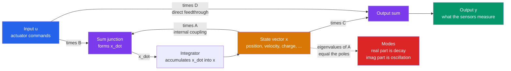

# 🧮 State-Space Models in Control

> [!abstract] TL;DR
> A **state-space model** describes a dynamic system by its *internal* variables — the **state vector** $\mathbf{x}$ — through two matrix equations: $\dot{\mathbf{x}} = A\mathbf{x} + B\mathbf{u}$ (how the state evolves) and $\mathbf{y} = C\mathbf{x} + D\mathbf{u}$ (what you measure). Where the transfer function only relates input to output, state-space **opens the box**: it exposes the machine's memory, naturally handles **multiple inputs and outputs (MIMO)**, absorbs time-varying and linearized nonlinear systems, and is the launchpad for the entire modern-control toolbox — pole placement, LQR, and the Kalman filter. The **eigenvalues of $A$ are the system poles**: their locations decide stability, decay, and oscillation.

---

## Intuition

**Analogy — opening the black box.** The transfer function is like knowing only what a vending machine *outputs* for a given input: press B4, get a soda. It is a black box — you see the button and the product, but nothing of the mechanism turning inside. A **state-space model opens the box.** It names the machine's internal memory — the position of the spiral coil, the charge in the payment capacitor, the temperature of the cooling coil — and writes a simple rule for how each internal quantity *nudges the others forward in time*.

That inside-out view is exactly what the black box cannot give you. Once you can name and track internal variables, you can (1) control a system with **many knobs and many gauges at once** instead of one input and one output, (2) **estimate hidden variables you cannot directly measure** (a robot's wheel-slip, a satellite's angular rate) by watching how the observable ones move, and (3) unlock **optimal and modern control**, which is written entirely in terms of the state.

Concretely, a car's motion is not captured by a single "output" — it *is* its position **and** its velocity together. Stack those into $\mathbf{x} = [\text{position}, \text{velocity}]^\top$, and Newton's law becomes a tidy matrix equation $\dot{\mathbf{x}} = A\mathbf{x} + B\mathbf{u}$: the whole physics collapses into linear algebra, and the toolbox of eigenvalues, matrix exponentials, and similarity transforms comes rushing in.

---

## How It Works

### Core Mechanics

1. **Pick the state.** Choose the *minimal* set of internal variables that, together with future inputs, completely determine the future. Physically these are the **energy-storage** quantities: positions and velocities (kinetic + potential energy), capacitor voltages and inductor currents, temperatures, chemical concentrations. The number of them, $n$, is the **order** of the system.
2. **Write the first-order form.** Any $n$-th order differential equation is rewritten as $n$ coupled **first-order** equations, packed into matrices:
$$\dot{\mathbf{x}}(t) = A\,\mathbf{x}(t) + B\,\mathbf{u}(t), \qquad \mathbf{y}(t) = C\,\mathbf{x}(t) + D\,\mathbf{u}(t).$$
3. **Read the four matrices.**
   - $A$ (**system / dynamics**, $n\times n$) — how each internal state pushes the others; it *is* the physics of the free system.
   - $B$ (**input**, $n\times m$) — how the actuators $\mathbf{u}$ inject into the state.
   - $C$ (**output**, $p\times n$) — which combination of states the sensors report.
   - $D$ (**feedthrough**, $p\times m$) — any *instantaneous* path from input straight to output (usually $0$ in physical systems).
4. **Solve it.** With constant $A$, the state obeys the **matrix exponential** solution
$$\mathbf{x}(t) = \underbrace{e^{At}\mathbf{x}(0)}_{\text{free response}} + \underbrace{\int_0^t e^{A(t-\tau)}B\,\mathbf{u}(\tau)\,d\tau}_{\text{forced response}}.$$
The operator $e^{At}$ is the **state-transition matrix** — it propagates any initial state forward in time.
5. **Find the modes.** Diagonalize $A = V\Lambda V^{-1}$. Its **eigenvalues** $\lambda_i$ are the system's natural **modes**; each contributes a term $e^{\lambda_i t}$. Since the transfer function is $H(s) = C(sI-A)^{-1}B + D$, the **poles of $H(s)$ are exactly the eigenvalues of $A$**. Stability follows immediately: eigenvalues in the **left-half plane** (continuous) or **inside the unit circle** (discrete) mean every mode decays.
6. **Discretize for computers.** Sampling with period $T_s$ yields the discrete model $\mathbf{x}[k+1] = A_d\,\mathbf{x}[k] + B_d\,\mathbf{u}[k]$ with $A_d = e^{A T_s}$ and $B_d = \big(\int_0^{T_s} e^{A\tau}d\tau\big)B$.
7. **Linearize nonlinear systems.** A nonlinear robot $\dot{\mathbf{x}} = f(\mathbf{x},\mathbf{u})$ is approximated near an operating point $(\mathbf{x}^\*,\mathbf{u}^\*)$ by its **Jacobians**: $A = \partial f/\partial \mathbf{x}$, $B = \partial f/\partial \mathbf{u}$. This is why linear state-space governs pendulums, drones, and rockets *locally*, even though the true dynamics are nonlinear.

### Flow / Architecture



---

## Key Concepts

### Secondary (intuitive level)
- **State = memory.** The state vector is the smallest set of numbers you must know *right now* to predict the future — position and speed for a moving body, water level for a tank.
- **Four boxes.** $A$ is the internal physics, $B$ is "how the controls push," $C$ is "what the sensors see," $D$ is a rare direct wire from input to output.
- **Eigenvalues are the personality.** The eigenvalues of $A$ tell you whether the system settles down (stable), oscillates, or blows up — before you ever run it.
- **Why bother?** Unlike a single input/output transfer function, state-space naturally controls machines with **many motors and many sensors at once**.

### Undergraduate (working level)
- **The two equations:** $\dot{\mathbf{x}} = A\mathbf{x} + B\mathbf{u}$, $\mathbf{y} = C\mathbf{x} + D\mathbf{u}$; dimensions $A:n\times n$, $B:n\times m$, $C:p\times n$, $D:p\times m$ (see [[State_Space_Basics]]).
- **From ODE to state-space:** define states as successive derivatives → **companion / phase-variable form**. Conversely, $H(s) = C(sI-A)^{-1}B + D$ recovers the transfer function (see [[Transfer_Functions]]).
- **Solution via the matrix exponential** $e^{At}$ — the **state-transition matrix** ([[State_Transition_Matrix]]); for diagonalizable $A$, $e^{At} = V\,\mathrm{diag}(e^{\lambda_i t})\,V^{-1}$.
- **Poles = eigenvalues of $A$:** stability ⇔ all $\mathrm{Re}(\lambda_i)<0$ (continuous) or $|\lambda_i|<1$ (discrete), linking to [[Eigenvalues_and_Eigenvectors]] and BIBO stability.
- **MIMO for free:** $m$ inputs and $p$ outputs cost nothing extra — you just widen $B$ and $C$, whereas transfer functions become an awkward $p\times m$ matrix of ratios.
- **Discretization:** $A_d = e^{AT_s}$ turns the model into a difference equation for digital controllers.

### Graduate (theory level)
- **Non-uniqueness & similarity transforms:** any invertible $T$ gives an equivalent realization $\bar A = TAT^{-1}$, $\bar B = TB$, $\bar C = CT^{-1}$, $\bar D = D$ — **same eigenvalues, same $H(s)$, different coordinates** (rooted in [[Linear_Transformations]]). Balanced realizations are chosen for numerical conditioning.
- **Minimal realizations:** a realization is **minimal** iff it is both controllable and observable; then $n = \deg(\text{denominator of }H)$. Non-minimal realizations carry hidden modes (pole–zero cancellations) that are eigenvalues of $A$ but *not* poles of $H(s)$.
- **Controllability & observability** ([[Controllability_Observability]]): the Kalman rank conditions on $[B\ AB\ \cdots\ A^{n-1}B]$ and $[C^\top\ A^\top C^\top\ \cdots]^\top$ decide whether every mode can be steered and seen — the gateway to pole placement and estimation.
- **Modal decomposition:** in eigenbasis coordinates $\mathbf{z} = V^{-1}\mathbf{x}$ the system **decouples** into scalar modes $\dot z_i = \lambda_i z_i + (\text{input})$; complex-conjugate pairs $\sigma \pm j\omega$ give damped sinusoids $e^{\sigma t}\cos(\omega t)$.
- **Jacobian linearization:** validity is local; the linearized $A$'s eigenvalues certify local stability of the nonlinear equilibrium (Lyapunov's indirect method), except on the imaginary axis.
- **Bridge to modern control:** state feedback $\mathbf{u} = -K\mathbf{x}$ relocates the eigenvalues of $A - BK$ (pole placement / LQR), and the Kalman filter reconstructs $\mathbf{x}$ from noisy $\mathbf{y}$ — both defined *only* in state-space.

---

## Python Demo

```python
# State-space simulation and MODES of a mass-spring-damper.
#   (a) build the (A,B,C,D) model and integrate x' = A x + B u for a unit STEP,
#       plotting the state trajectories (position, velocity) and the output;
#   (b) compute the EIGENVALUES of A and show they equal the system poles --
#       real part -> decay rate, imaginary part -> oscillation frequency;
#   (c) overlay the analytic transfer-function step response to prove the two
#       views agree; print the characteristic polynomial = TF denominator.
import numpy as np
import matplotlib.pyplot as plt

# Physical system:  m x'' + c x' + k x = u     (u is an applied force)
# States: x1 = position, x2 = velocity
m, k, c = 1.0, 1.0, 0.4                 # underdamped: zeta = c/(2*sqrt(k*m)) = 0.2

A = np.array([[0.0,   1.0],
              [-k/m, -c/m]])
B = np.array([[0.0],
              [1.0/m]])
C = np.array([[1.0, 0.0]])              # sensor measures position only
D = np.array([[0.0]])

# ---- (a) integrate x' = A x + B u for a unit step, via RK4 (numpy only) ---
def xdot(x, u):
    return A @ x + B.flatten() * u

dt, T = 0.01, 40.0
t = np.arange(0.0, T, dt)
x = np.zeros((len(t), 2))               # [position, velocity] over time
u = 1.0                                 # unit step input for all t >= 0
for i in range(len(t) - 1):
    xi = x[i]
    a1 = xdot(xi,              u)
    a2 = xdot(xi + 0.5*dt*a1,  u)
    a3 = xdot(xi + 0.5*dt*a2,  u)
    a4 = xdot(xi + dt*a3,      u)
    x[i+1] = xi + (dt/6.0)*(a1 + 2*a2 + 2*a3 + a4)
y = (C @ x.T).flatten() + D[0, 0]*u     # output y = C x + D u  (= position here)

# ---- (b) eigenvalues of A  ==  poles  ==  roots of the TF denominator ----
eig = np.linalg.eigvals(A)
charpoly = np.poly(A)                    # characteristic polynomial of A
wn   = np.sqrt(k/m)                      # natural frequency
zeta = c/(2*np.sqrt(k*m))               # damping ratio
wd   = wn*np.sqrt(1 - zeta**2)           # damped frequency
print("Eigenvalues of A (system poles):", np.round(eig, 4))
print("char. poly of A                :", np.round(charpoly, 4))
print("TF denominator [1, c/m, k/m]   :", [1.0, c/m, k/m])
print(f"omega_n = {wn:.3f} rad/s,  zeta = {zeta:.3f}")
print(f"Re(pole) = -zeta*wn = {-zeta*wn:+.3f}  -> exponential DECAY rate")
print(f"Im(pole) =      wd  = {wd:.3f}  -> OSCILLATION frequency")

# ---- (c) analytic transfer-function step response (should overlay) -------
phi   = np.arccos(zeta)
K_dc  = 1.0/k                           # DC gain H(0) = -C A^{-1} B = 1/k
y_tf  = K_dc*(1 - np.exp(-zeta*wn*t)/np.sqrt(1-zeta**2)*np.sin(wd*t + phi))

# ---- plots ---------------------------------------------------------------
fig, (ax1, ax2, ax3) = plt.subplots(1, 3, figsize=(16, 5))

ax1.plot(t, x[:, 0], lw=2, label='x1 = position  (= output y)')
ax1.plot(t, x[:, 1], lw=2, label='x2 = velocity')
ax1.plot(t, y_tf, 'k--', lw=1.5, label='TF step response (analytic)')
ax1.axhline(K_dc, color='0.6', ls=':', label='steady state = 1/k')
ax1.set_xlabel('time [s]'); ax1.set_ylabel('state / output')
ax1.set_title('(a) State-space step response')
ax1.legend(loc='lower right'); ax1.grid(alpha=0.3)

ax2.set_xlim(-0.5, 0.3); ax2.set_ylim(-1.3, 1.3)
ax2.axvspan(-0.5, 0.0, alpha=0.08, color='green', label='stable region (LHP)')
ax2.axhline(0, color='0.7', lw=1); ax2.axvline(0, color='0.7', lw=1)
ax2.plot(eig.real, eig.imag, 'rx', ms=13, mew=3, label='eigenvalues of A = poles')
ax2.set_xlabel('Real  (decay rate)'); ax2.set_ylabel('Imag  (oscillation)')
ax2.set_title('(b) Poles in the complex plane')
ax2.legend(loc='upper left'); ax2.grid(alpha=0.3)

ax3.plot(x[:, 0], x[:, 1], lw=1.8)
ax3.plot(x[0, 0],  x[0, 1],  'go', ms=9, label='start')
ax3.plot(x[-1, 0], x[-1, 1], 'bs', ms=9, label='equilibrium')
ax3.set_xlabel('x1 = position'); ax3.set_ylabel('x2 = velocity')
ax3.set_title('(c) Phase portrait: the mode spirals in')
ax3.legend(); ax3.grid(alpha=0.3)

plt.tight_layout()
plt.savefig('state_space_modes.png', dpi=110)
print("saved state_space_modes.png")
```

**What it shows.** The eigenvalues print as $-0.2 \pm 0.98j$, matching the roots of the transfer-function denominator $s^2 + 0.4s + 1$ exactly — **poles are eigenvalues of $A$**. The negative real part ($-0.2$) sets the exponential envelope's decay; the imaginary part ($0.98$) sets the ringing frequency. Panel (a) shows the state-space step response landing perfectly on the analytic transfer-function curve, confirming the two representations are the same system seen two ways. Panel (c) shows the underdamped mode spiraling into the equilibrium in the position–velocity plane — the geometric fingerprint of a complex-conjugate eigenpair.

---

## Real-World Applications

> **Aircraft & spacecraft autopilots.** Flight dynamics are modeled with a state vector of positions, velocities, attitudes, and angular rates (12 states for full 6-DOF). Commercial autopilots and reaction-wheel attitude controllers run **LQR** on this linearized state-space model, and a **Kalman filter** fuses GPS, IMU, and air-data sensors to reconstruct the states that no single sensor measures directly.

> **Robotic manipulators & legged robots.** A robot arm's nonlinear equations of motion are **linearized about the current configuration** into a state-space model of joint angles and velocities; whole-body controllers place poles or solve LQR/MPC on that model every control cycle to track trajectories while staying stable.

> **Power grids & motor drives.** Field-oriented control of electric motors and grid-tied inverters uses discrete-time state-space models ($x[k{+}1]=A_d x[k]+B_d u[k]$) of currents and fluxes; the plant is discretized at the switching frequency and controlled with state feedback plus an observer.

> **Process & chemical plants.** Temperatures, concentrations, and levels across coupled tanks form a MIMO state vector; **Model Predictive Control** optimizes over the state-space model to hold many outputs at setpoint despite interacting inputs — something transfer-function loops handle poorly.

---

## Common Pitfalls

- **State coordinates are not unique.** Infinitely many $(A,B,C,D)$ quadruples describe the *same* physical system — any similarity transform $\bar A = TAT^{-1}$ gives an equivalent realization. Never compare two models by staring at their matrices; compare **eigenvalues** and $H(s)$, which are invariant. Companion form is convenient but numerically ill-conditioned for high order; prefer balanced realizations in software.
- **Minimal vs non-minimal realizations.** If you build a state-space model with more states than the transfer-function order, some **eigenvalues of $A$ are not poles of $H(s)$** — they were cancelled by a zero and correspond to hidden (uncontrollable or unobservable) modes. A hidden *unstable* mode is invisible in the input–output response yet will destroy the real hardware. Always reduce to a **minimal (controllable + observable)** realization, foreshadowing [[Controllability_Observability]].
- **Observability/controllability caveats.** State feedback assumes you *know* the state; the Kalman filter assumes the unstable/relevant modes are **observable**. Design a controller on an uncontrollable mode or an estimator on an unobservable one and it silently fails. Check the rank conditions before, not after.
- **The $D$-term feedthrough.** A non-zero $D$ creates an *instantaneous* input→output path; in a feedback loop this forms an **algebraic loop** with no state delay, which can make the closed loop ill-posed or unsimulatable. Most physical plants have $D=0$; keep it that way unless the physics demands otherwise.
- **Discretization mistakes.** Using Euler's $A_d \approx I + AT_s$ instead of the exact $A_d = e^{AT_s}$ shifts poles and can turn a stable continuous system into an **unstable discrete** one if $T_s$ is too large. Discretize with the matrix exponential and respect the sampling theorem.
- **Trusting a linearization too far.** Jacobian linearization is only valid near the operating point. Drive a drone or inverted pendulum far from its trim and the real nonlinear dynamics diverge from the state-space model — gain-schedule or re-linearize.

---

## Related Concepts

- [[State_Space_Basics]] — the signals-and-systems introduction to $\dot{\mathbf{x}}=A\mathbf{x}+B\mathbf{u}$; this note is the controls-oriented, MIMO/modern-control extension of it.
- [[State_Feedback_Control]] — placing $\mathbf{u}=-K\mathbf{x}$ to move the eigenvalues of $A-BK$; the first modern-control application built directly on this representation.
- [[Controllability_Observability]] — the rank tests that decide whether every state-space mode can be steered and reconstructed; gatekeeper for pole placement and estimation.
- [[Transfer_Functions]] — the input–output "black box" this note opens up; connected by $H(s)=C(sI-A)^{-1}B+D$, whose poles are the eigenvalues of $A$.
- [[State_Transition_Matrix]] — the matrix exponential $e^{At}$ that solves the state equation and propagates the state forward.
- [[Eigenvalues_and_Eigenvectors]] — the linear-algebra core: eigenvalues of $A$ are the poles/modes; eigenvectors give the modal (decoupled) coordinates.
- [[Systems_of_ODEs]] — state-space *is* a coupled first-order ODE system in matrix form; the existence/solution theory lives here.
- [[Matrices_and_Determinants]] — $\det(sI-A)=0$ is the characteristic equation whose roots are the poles; the determinant also underlies invertibility of $sI-A$.
- [[Linear_Transformations]] — similarity transforms $T$ that change state coordinates without changing the physics, explaining realization non-uniqueness.
- [[Second_Order_Linear_ODEs]] — the mass-spring-damper worked example is the canonical second-order ODE recast in state-space.
- [[Kalman_Filter]] — reconstructs the state $\mathbf{x}$ from noisy outputs $\mathbf{y}$; defined entirely on the state-space model.
- [[State_Space_Models]] — the time-series/statistics cousin (observation + transition equations) that shares this exact algebra for forecasting and filtering.

*Sibling notes in this Classical Control section (prose only):* **Feedback Control Fundamentals** motivates closing the loop that state feedback formalizes; **Transfer Functions and Frequency Response** is the input–output view this note complements; and this representation is the launchpad for the modern-control sequence to follow — **Controllability and Observability**, **Pole Placement and Full-State Feedback**, **LQR Optimal Control**, and **Kalman Filtering and State Estimation** — all of which are written in the state-space language established here.

---

## Review Questions

1. **(Secondary)** Using the "opening the black box" analogy, explain what the **state vector** is and give two reasons an engineer would prefer a state-space model over a transfer function when controlling a robot with several motors and sensors.
2. **(Undergraduate)** A mass-spring-damper obeys $\ddot y + 2\dot y + 5y = u$. Write the companion-form matrices $A,B,C,D$ with states $x_1=y,\ x_2=\dot y$. Compute the eigenvalues of $A$ and state, from their real and imaginary parts, whether the response is stable, and whether it oscillates and how fast it decays.
3. **(Graduate)** Two engineers hand you different $(A,B,C,D)$ quadruples and claim they model the same plant. (a) What single transformation relates them if the claim is true, and which quantities are invariant? (b) One realization is 4th-order while the transfer function is only 2nd-order — what does that imply about its eigenvalues, and why could a *hidden unstable mode* be catastrophic even though it never appears in the step response? (c) Which property must you verify before designing state feedback, and which before designing an observer?

---

## Sources

- Ogata, K. — *Modern Control Engineering* (5th ed., Prentice Hall, 2010), Ch. 9–11 "State-Space Analysis and Design."
- Åström, K. J. & Murray, R. M. — *Feedback Systems: An Introduction for Scientists and Engineers* (2nd ed., Princeton, 2021), Ch. 6–7 "State Feedback / Output Feedback." [Free PDF](https://fbswiki.org/)
- Franklin, G. F., Powell, J. D. & Emami-Naeini, A. — *Feedback Control of Dynamic Systems* (8th ed., Pearson, 2019), Ch. 7 "State-Space Design."
- Chen, C.-T. — *Linear System Theory and Design* (4th ed., Oxford, 2013), Ch. 4–6 (state equations, realizations, controllability/observability).
- Brogan, W. L. — *Modern Control Theory* (3rd ed., Prentice Hall) — matrix exponential, similarity transforms, and canonical forms.

---

#robotics #state-space #linear-systems #control-theory #eigenvalues
