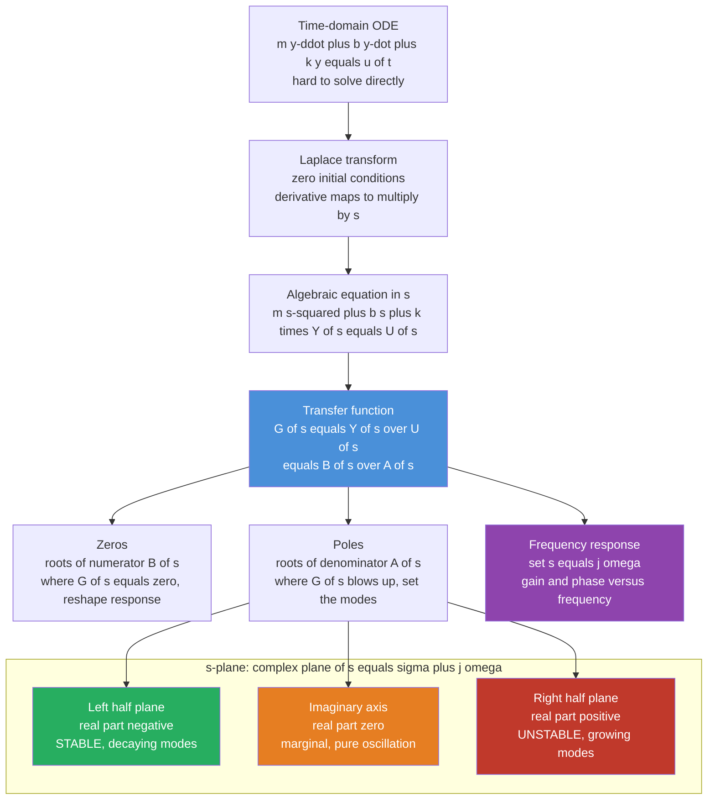

# 🎚️ Transfer Functions and Frequency Response

> [!abstract] TL;DR
> A **transfer function** $G(s) = Y(s)/U(s)$ is the Laplace-domain ratio of a linear system's output to its input — the single algebraic expression that replaces a messy differential equation. Its **poles** (denominator roots) fix stability and the shape of the transient response; its **zeros** (numerator roots) reshape it. Substituting $s = j\omega$ gives the **frequency response** $G(j\omega)$: exactly how much the system amplifies and delays a sinusoid at each frequency. Because responses *multiply* in the $s$-domain, controllers can be designed by shaping a system's response to every frequency at once — the foundation of all classical control.

---

## Intuition

**Analogy — pushing a child on a swing.** Push a swing and the response depends entirely on your rhythm. Push at the swing's **natural frequency** and small pushes accumulate into huge arcs; push too fast or too slow and almost nothing happens. Every dynamic system — a motor, a robot arm, an aircraft wing, an RLC circuit — has this same fingerprint: *how much it amplifies or delays an input at each frequency*.

The transfer function captures that fingerprint in one algebraic expression. Instead of solving a differential equation every time the input changes, you write down $G(s)$ once, and the output for **any** input is just a multiplication in the Laplace domain: $Y(s) = G(s)\,U(s)$. Feed in a sinusoid of frequency $\omega$ and the system multiplies its amplitude by $|G(j\omega)|$ and shifts its phase by $\angle G(j\omega)$ — nothing more. Design becomes the art of **shaping** this frequency fingerprint: bump up the gain where you want fast tracking, roll it off where noise and resonance live.

The payoff is enormous. Differentiation and integration — the operations that make differential equations hard — become simple division and multiplication by $s$. A cascade of subsystems becomes a product of their transfer functions. Feedback becomes one line of algebra. The entire time-domain complexity of a linear system collapses into the geometry of a handful of points in the complex plane.

---

## How It Works

### From differential equation to G(s)

1. **Start with the ODE.** A linear time-invariant (LTI) system obeys a constant-coefficient differential equation, e.g. a mass–spring–damper $m\ddot{y} + b\dot{y} + k y = u(t)$.
2. **Laplace transform both sides**, assuming **zero initial conditions**. The transform turns each time derivative into a power of $s$: $\dot{y}\!\to\! sY(s)$, $\ddot{y}\!\to\! s^2 Y(s)$. The calculus becomes algebra.
3. **Solve for the output-to-input ratio.** $(m s^2 + b s + k)\,Y(s) = U(s)$ gives

$$G(s) = \frac{Y(s)}{U(s)} = \frac{1}{m s^2 + b s + k} = \frac{B(s)}{A(s)}.$$

4. **Factor.** The roots of the numerator $B(s)$ are the **zeros**; the roots of the denominator $A(s)$ are the **poles**. Their positions in the complex $s = \sigma + j\omega$ plane tell you everything about stability and dynamics.
5. **Read the response.** Poles in the **left half-plane** ($\sigma < 0$) decay → stable; on the imaginary axis → marginal oscillation; in the **right half-plane** ($\sigma > 0$) grow → unstable. Substitute $s = j\omega$ to get the steady-state frequency response.

### s-plane and the frequency-domain map



This picture is the backbone of **classical control**. In this vault it connects directly to the sibling notes on Feedback_Control_Fundamentals (where $G(s)$ is wrapped in a loop), PID_Control (a controller that is itself a transfer function), Stability_Routh_Hurwitz_and_Root_Locus (how loop gain moves the poles), Bode_Nyquist_and_Loop_Shaping (design entirely from $G(j\omega)$), and State_Space_Models_in_Control (the equivalent internal view where poles are the eigenvalues of $A$).

---

## Key Concepts

### 🟢 Secondary — the plain-language picture

- **A transfer function is an input-output rule.** $G(s)$ says: give me your input's Laplace transform, I multiply it, and out comes the output's transform. No re-deriving anything.
- **Poles are the system's natural tendencies.** A pole at $s = -2$ means "left alone, I decay with a 0.5 s time constant." A pole further left decays faster.
- **DC gain is the steady value.** Feed a constant input of 1 and wait; the output settles to $G(0)$, the value of the transfer function at $s=0$.
- **Frequency response is the swing analogy made precise.** $|G(j\omega)|$ is how big the output sinusoid is; a tall peak means the system has a resonance it loves to ring at.

### 🟡 Undergraduate — the working machinery

- **Poles and zeros.** $G(s) = K\dfrac{\prod (s - z_m)}{\prod (s - p_n)}$. Poles $p_n$ set the transient **modes** (each contributes a term like $e^{p_n t}$); zeros $z_m$ shape how strongly each mode is excited and can carve notches in the frequency response.
- **First-order canonical form.** $G(s) = \dfrac{K}{\tau s + 1}$ has one real pole at $s = -1/\tau$. Step response $y(t) = K\!\left(1 - e^{-t/\tau}\right)$: no overshoot, 63% of the way in one time constant $\tau$, essentially settled in $4\tau$.
- **Second-order canonical form.** $G(s) = \dfrac{\omega_n^2}{s^2 + 2\zeta\omega_n s + \omega_n^2}$, with **natural frequency** $\omega_n$ and **damping ratio** $\zeta$. Poles sit at $s = -\zeta\omega_n \pm \omega_n\sqrt{\zeta^2 - 1}$:
  - $\zeta > 1$ **overdamped** — two real poles, slow, no overshoot.
  - $\zeta = 1$ **critically damped** — repeated real pole, fastest with no overshoot.
  - $0 < \zeta < 1$ **underdamped** — complex pair $-\zeta\omega_n \pm j\omega_d$, $\omega_d = \omega_n\sqrt{1-\zeta^2}$; oscillatory with **percent overshoot** $\;PO = 100\,e^{-\pi\zeta/\sqrt{1-\zeta^2}}$.
- **Pole position ↔ step-response shape.** Distance from the origin ($\omega_n$) sets **speed**; the angle from the negative real axis sets **overshoot** (further off-axis = more ringing). Real part $-\zeta\omega_n$ sets the decay envelope and settling time $\approx 4/(\zeta\omega_n)$.
- **Frequency response.** $G(j\omega)$ is the steady-state response to $\sin\omega t$: output amplitude $\times |G(j\omega)|$, phase shift $\angle G(j\omega)$. Lightly damped second-order systems show a **resonant peak** near $\omega_n$ of height $\approx \tfrac{1}{2\zeta}$ (for small $\zeta$), located at $\omega_r = \omega_n\sqrt{1 - 2\zeta^2}$.
- **Block-diagram algebra.** Series: $G_1 G_2$. Parallel: $G_1 + G_2$. Negative feedback of forward path $G$ with feedback $H$: $\dfrac{G}{1 + GH}$ — the master equation of closed-loop control.

### 🔴 Graduate — the deeper structure

- **Partial fractions = modal decomposition.** Expanding $G(s)$ over its poles and inverting gives $g(t) = \sum_n r_n e^{p_n t}$; each pole is one natural mode and each residue $r_n$ its weight. Zeros set the residues, so a zero near a pole nearly cancels that mode's contribution.
- **Dominant-pole approximation.** The pole pair closest to the imaginary axis decays slowest and dominates the response; far-left poles and fast modes can often be neglected, reducing a high-order model to an effective second-order one for design.
- **Non-minimum-phase zeros.** A zero in the **right half-plane** produces initial **undershoot** (the output first moves the *wrong* way) and adds phase lag, fundamentally limiting achievable bandwidth. Classic in aircraft pitch, boiler level, and buck-boost converters.
- **Pole-zero cancellation is dangerous.** Cancelling an unstable pole with a zero on paper hides an **internally unstable** mode that is uncontrollable or unobservable — it still blows up, just invisibly at the output. Never cancel poles in the RHP.
- **Equivalence to state space.** For $\dot{x} = Ax + Bu,\ y = Cx + Du$, the transfer function is $G(s) = C(sI - A)^{-1}B + D$. The **poles are the eigenvalues of $A$** — the frequency-domain and internal views are two faces of the same dynamics.
- **Why frequency domain simplifies design.** Stability and robustness margins read straight off $G(j\omega)$ (gain/phase margins), loop shaping trades bandwidth against noise rejection graphically, and the **Bode and Nyquist** methods let you certify closed-loop stability from open-loop data alone — the subject of the sibling note Bode_Nyquist_and_Loop_Shaping.

---

## Python Demo

Pure `numpy` + `matplotlib` — no `scipy.signal`. For the second-order system $G(s) = \omega_n^2 / (s^2 + 2\zeta\omega_n s + \omega_n^2)$ we (a) plot the **poles** in the $s$-plane for a range of damping $\zeta$, (b) integrate the ODE to get the matching **step responses** (showing how pole position governs overshoot and speed), and (c) evaluate $G(j\omega)$ **directly** to plot the frequency-response magnitude, exposing the resonant peak of lightly damped systems.

```python
# Transfer functions & frequency response of a 2nd-order system, from scratch.
# G(s) = wn^2 / (s^2 + 2*zeta*wn*s + wn^2).  numpy + matplotlib only.
import numpy as np
import matplotlib.pyplot as plt

wn = 2.0  # natural frequency [rad/s] -- fixed; we vary the damping ratio zeta
cases = {"overdamped  z=2.0":     (2.0, "steelblue"),
         "critical    z=1.0":     (1.0, "seagreen"),
         "underdamped z=0.3":     (0.3, "darkorange"),
         "lightly damped z=0.1":  (0.1, "crimson")}

def poles(zeta, wn):
    # roots of s^2 + 2*zeta*wn*s + wn^2 = 0  (complex when zeta < 1)
    r = np.sqrt(zeta**2 - 1.0 + 0j)
    return np.array([-zeta*wn + wn*r, -zeta*wn - wn*r])

def step_response(zeta, wn, T=12.0, dt=0.002):
    # integrate  x'' + 2*zeta*wn*x' + wn^2*x = wn^2 * u,  with unit step u = 1
    n = int(T/dt); t = np.linspace(0, T, n); y = np.zeros(n)
    x, v = 0.0, 0.0
    def deriv(x, v):
        a = wn**2 * 1.0 - 2*zeta*wn*v - wn**2*x   # u(t) = 1
        return v, a
    for k in range(n):
        y[k] = x
        k1x, k1v = deriv(x, v)                      # 4th-order Runge-Kutta
        k2x, k2v = deriv(x + 0.5*dt*k1x, v + 0.5*dt*k1v)
        k3x, k3v = deriv(x + 0.5*dt*k2x, v + 0.5*dt*k2v)
        k4x, k4v = deriv(x + dt*k3x,     v + dt*k3v)
        x += dt/6.0*(k1x + 2*k2x + 2*k3x + k4x)
        v += dt/6.0*(k1v + 2*k2v + 2*k3v + k4v)
    return t, y

def freq_response(zeta, wn, w):
    # evaluate G(jw) directly: denominator = (wn^2 - w^2) + j*2*zeta*wn*w
    return wn**2 / ((wn**2 - w**2) + 1j*2*zeta*wn*w)

w = np.logspace(-1, 1.5, 800)   # 0.1 .. ~30 rad/s
fig, ax = plt.subplots(1, 3, figsize=(15, 4.5))

# (a) pole map in the s-plane
for name, (z, c) in cases.items():
    p = poles(z, wn)
    ax[0].plot(p.real, p.imag, 'x', ms=12, mew=2.5, color=c, label=name)
ax[0].axvline(0, color='k', lw=1.0)                       # imaginary axis = stability edge
ax[0].axhline(0, color='gray', lw=0.6)
th = np.linspace(0, 2*np.pi, 200)
ax[0].plot(wn*np.cos(th), wn*np.sin(th), '--', color='gray', lw=0.8)  # |s| = wn circle
ax[0].set_title('(a) Poles in the s-plane')
ax[0].set_xlabel('Re{s}  (sigma)'); ax[0].set_ylabel('Im{s}  (omega)')
ax[0].legend(fontsize=7, loc='upper left'); ax[0].set_aspect('equal', 'box')

# (b) corresponding step responses
for name, (z, c) in cases.items():
    t, y = step_response(z, wn)
    ax[1].plot(t, y, color=c, label=name)
ax[1].axhline(1.0, ls='--', color='k', lw=0.8)            # final value = DC gain = 1
ax[1].set_title('(b) Step responses: pole angle -> overshoot, radius -> speed')
ax[1].set_xlabel('time [s]'); ax[1].set_ylabel('output y(t)')
ax[1].legend(fontsize=7)

# (c) frequency-response magnitude (log-log)
for name, (z, c) in cases.items():
    ax[2].loglog(w, np.abs(freq_response(z, wn, w)), color=c, label=name)
ax[2].axvline(wn, ls=':', color='gray')                   # natural frequency
ax[2].set_title('(c) |G(jw)|: resonant peak grows as damping falls')
ax[2].set_xlabel('frequency omega [rad/s]'); ax[2].set_ylabel('|G(jw)|')
ax[2].legend(fontsize=7)

plt.tight_layout(); plt.show()

# Quantify DC gain (should be 1) and the resonant peak height
for name, (z, c) in cases.items():
    dc   = abs(freq_response(z, wn, np.array([1e-6]))[0])
    peak = np.abs(freq_response(z, wn, w)).max()
    print(f"{name:22s}  DC gain={dc:.3f}   peak|G|={peak:.3f}")
```

**What you see.** Panel (a): as $\zeta$ drops, the two real poles (overdamped) collide at $-\omega_n$ (critical), then split into a complex pair that swings up toward the imaginary axis along the circle of radius $\omega_n$. Panel (b): those same pole positions produce the step response — real poles give sluggish, monotone rises; the complex pair produces overshoot and ringing that worsen as the poles approach the imaginary axis. Panel (c): all four share a DC gain of exactly 1, but the lightly damped systems grow a sharp **resonant peak** near $\omega_n$ (height $\approx 1/2\zeta \approx 5$ for $\zeta = 0.1$) — the swing that loves one rhythm. The printout confirms every DC gain is 1.000 while the peak magnitude climbs as damping falls.

---

## Real-World Applications

- **Robot joint & motor control.** A DC servo motor is well-modeled as $G(s) = K/[s(\tau s + 1)]$; the integrator (pole at the origin) is why position servos hold a setpoint with zero steady-state error, and the pole at $-1/\tau$ sets how fast the joint responds. PID gains are tuned by watching where they drag the closed-loop poles.
- **Quadrotor & aircraft dynamics.** Attitude loops are designed by shaping $G(j\omega)$ to place the crossover frequency high enough for agile response but below structural resonances and sensor-noise bands — exactly the loop-shaping trade the swing analogy predicts.
- **Automotive suspension.** The quarter-car model is a second-order transfer function; engineers pick a damping ratio near $\zeta \approx 0.7$ to trade ride comfort (low overshoot) against road-holding (fast response) — the classic "flat, fast, no ringing" sweet spot.
- **RLC circuits and analog filters.** A second-order low-pass filter *is* $\omega_n^2/(s^2 + 2\zeta\omega_n s + \omega_n^2)$; the resonant peak in panel (c) is literally what an under-damped filter does to signals near its cutoff. Audio EQ bands place poles/zeros to boost or cut chosen frequencies.
- **Process control.** Chemical reactors and heat exchangers are modeled as first-order-plus-dead-time transfer functions; the dead time adds phase lag that limits how aggressively the loop can be tuned before it oscillates.

---

## Common Pitfalls

- **Assuming it's always valid.** The transfer function exists only for **LTI** systems. Nonlinearities (saturation, backlash, Coulomb friction) and time-varying parameters break superposition — $G(s)$ is at best a local linearization about an operating point.
- **Forgetting initial conditions.** $G(s) = Y(s)/U(s)$ holds only under **zero initial conditions**. With nonzero ICs the Laplace transform carries extra terms; the transfer function captures the *forced* response, not the *natural* response from a preloaded state.
- **Pole-zero cancellation hiding instability.** Cancelling a right-half-plane pole with a matching zero makes the input-output map look stable while an **internal** mode diverges — uncontrollable or unobservable but very much still there. Never cancel unstable poles; check internal stability, not just $G(s)$.
- **Non-minimum-phase zeros.** A zero in the right half-plane causes the output to **initially move the wrong way** (undershoot) and imposes a hard bandwidth ceiling. Cranking up the gain to "fix" the slow response makes it worse, not better.
- **Ignoring unstable poles.** Any pole with positive real part means the response grows without bound; a stable-looking Bode magnitude does not rescue a right-half-plane pole. Always check the sign of every pole's real part before trusting frequency-response intuition.
- **Improper transfer functions.** More zeros than poles ($\deg B > \deg A$) implies pure differentiation — infinite gain at high frequency and extreme noise amplification. Physical systems are strictly proper.

---

## Related Concepts

- [[Transfer_Functions]] — the signals-and-systems treatment of $H(s)$, Bode construction, and pole-zero plots that this control-focused note builds on.
- [[Laplace_Transform]] — the integral transform that turns the governing ODE into the algebraic $G(s)$.
- [[Stability_Frequency_Response]] — how pole locations decide BIBO stability and how $H(j\omega)$ follows from $H(s)$.
- [[BIBO_Stability]] — the bounded-input bounded-output criterion satisfied exactly when all poles lie in the left half-plane.
- [[Impulse_Response]] — the time-domain twin of $G(s)$; the transfer function is its Laplace transform.
- [[State_Space_Basics]] — the internal $\dot{x}=Ax+Bu$ view where poles reappear as eigenvalues of $A$.
- [[Second_Order_Linear_ODEs]] — the differential equation whose canonical form gives $\omega_n$ and $\zeta$.
- [[Systems_of_ODEs]] — the machinery for simulating and analyzing higher-order dynamics.
- [[Complex_Numbers_and_Functions]] — the $s = \sigma + j\omega$ plane in which poles and zeros live.
- [[Fourier_Transform]] — the $s = j\omega$ slice of the Laplace domain, i.e. the frequency response itself.
- [[Oscillations_and_SHM]] — the damped-driven oscillator whose resonance is the physical face of a second-order transfer function.
- [[Eigenvalues_and_Eigenvectors]] — the spectral tool that equates state-space eigenvalues with transfer-function poles.
- [[Forward_Kinematics]] — a sibling robotics topic; kinematics gives geometry, transfer functions give the dynamics that control it.
- [[Robotics_and_Control_Overview]] — the field map that places classical control within the sense-plan-act loop.

---

## Review Questions

### 🟢 Secondary
1. In the swing analogy, what does the height of the resonant peak in $|G(j\omega)|$ correspond to, and what real feature of the system makes that peak grow taller?

### 🟡 Undergraduate
2. A second-order system has $\omega_n = 4$ rad/s and $\zeta = 0.5$. Where are its poles, roughly what percent overshoot does its step response show, and about how long until it settles? Would moving the poles straight left (increasing $\zeta\omega_n$ at fixed angle) speed it up or slow it down?
3. Given $G(s) = \dfrac{10}{(s+1)(s+10)}$, find the DC gain and identify the dominant pole. Why can the fast pole at $s = -10$ often be ignored when sketching the step response?

### 🔴 Graduate
4. You linearize a plant and find a zero at $s = +3$ (right-half-plane). Describe two concrete consequences for closed-loop design and explain why simply raising the loop gain will not overcome them.
5. A colleague "stabilizes" a plant with a pole at $s = +2$ by placing a controller zero at $s = +2$ to cancel it. The input-output transfer function now looks stable. Explain precisely why this is unsafe, and what internal property you must check that $G(s)$ alone cannot reveal.

---

## Sources

- Ogata, K. — *Modern Control Engineering*, 5th ed. (Prentice Hall, 2010), Ch. 4–5 & 7–8.
- Franklin, G. F., Powell, J. D., & Emami-Naeini, A. — *Feedback Control of Dynamic Systems*, 8th ed. (Pearson, 2019), Ch. 3 & 6.
- Nise, N. S. — *Control Systems Engineering*, 8th ed. (Wiley, 2019), Ch. 2 & 4.
- Oppenheim, A. V., & Willsky, A. S. — *Signals and Systems*, 2nd ed. (Prentice Hall, 1997), Ch. 9 (Laplace) & Ch. 6 (frequency response).
- Dorf, R. C., & Bishop, R. H. — *Modern Control Systems*, 13th ed. (Pearson, 2017), Ch. 2 & 8.

---

#robotics #transfer-functions #frequency-response #poles-zeros #laplace
