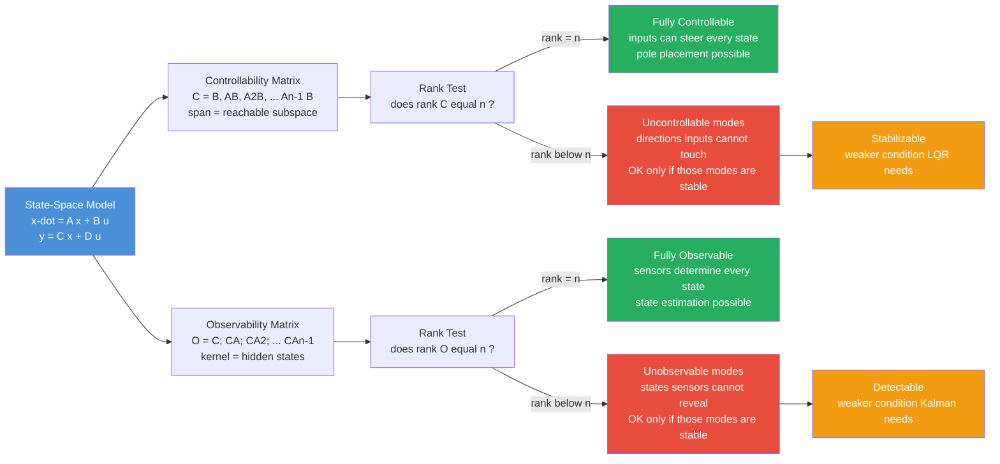

# 🎯 Controllability and Observability

> [!abstract] TL;DR
> **Controllability** and **observability** are Rudolf Kalman's two foundational *structural* properties of a state-space system — the yes/no questions you must answer **before** designing any modern controller or estimator. Controllability asks: *can the inputs steer the state to any target?* — answered by the rank of the controllability matrix $\mathcal{C} = [\,B\;\;AB\;\;A^2B\;\cdots\;A^{n-1}B\,]$. Observability asks: *can the measurements reconstruct the full internal state?* — answered by the rank of the observability matrix $\mathcal{O} = [\,C;\;CA;\;CA^2;\;\cdots;\;CA^{n-1}\,]$. They are perfect **duals** ($(A,B)$ controllable $\iff (A^\top, B^\top)$ observable). Their weaker cousins — **stabilizability** and **detectability** — only require the *unruly* modes to be stable. Pole placement needs controllability; state estimation needs observability; the **separation principle** lets you design both independently. This note opens the Modern & Optimal Control section that pole placement, LQR, Kalman filtering, and MPC all rest on.

---

## Intuition

**Analogy — driving a car across a city.** Before you promise to drive anywhere in a city, two very different questions matter. First: **can the steering wheel and pedals actually *reach* every street?** If the controls can only turn the car in circles in one parking lot, whole neighborhoods are forever off-limits no matter how cleverly you drive. That is **controllability** — whether your inputs can push the system's state into *any* corner of its state space. Second: **from the dashboard gauges alone, can you always figure out exactly where you *are*?** If your only instrument is a compass, you know your heading but never your position — the map has a hidden dimension your sensors cannot resolve. That is **observability** — whether your measurements are rich enough to pin down the full internal state.

Some systems have **hidden corners the controls can never touch** (uncontrollable modes) and **hidden states the sensors can never reveal** (unobservable modes). These are not tuning problems you can fix with a better gain or a faster loop — they are *structural* facts baked into the geometry of $(A, B, C)$. A pole-placement controller that assumes it can move every mode will silently fail on the modes it cannot reach; a Kalman filter that assumes it can see every state will produce confidently wrong estimates of the states it cannot see. Controllability and observability are therefore the two go/no-go checks that gate the entire modern-control toolkit — you run them *first*, and only then design.

---

## How It Works

### Core Mechanics

Start from the linear time-invariant state-space model (the same $\dot{x} = Ax + Bu$, $y = Cx + Du$ that underlies every note in this section). Here $x \in \mathbb{R}^n$ is the internal state, $u \in \mathbb{R}^m$ the inputs, $y \in \mathbb{R}^p$ the measurements, and $A, B, C, D$ constant matrices.

1. **Build the controllability matrix.** Stack $B$ and its repeated left-multiplications by $A$:
   $$\mathcal{C} = \begin{bmatrix} B & AB & A^2B & \cdots & A^{n-1}B \end{bmatrix} \in \mathbb{R}^{n \times nm}.$$
   Each block $A^kB$ is a *new direction* the input can push the state after $k$ instants of the dynamics folding it forward. The span of these columns is exactly the **reachable subspace**.

2. **Rank test for controllability.** The system is **controllable** $\iff \operatorname{rank}(\mathcal{C}) = n$ (full state dimension). If the rank is $r < n$, there is an $(n-r)$-dimensional subspace of directions the inputs can **never** reach.

3. **Why stop at $A^{n-1}B$?** By the **Cayley–Hamilton theorem**, $A^n$ is a linear combination of $I, A, \dots, A^{n-1}$, so $A^nB$ adds nothing new. The reachable subspace is fully generated by the first $n$ blocks.

4. **Build the observability matrix.** Stack $C$ and its repeated right-multiplications by $A$:
   $$\mathcal{O} = \begin{bmatrix} C \\ CA \\ CA^2 \\ \vdots \\ CA^{n-1} \end{bmatrix} \in \mathbb{R}^{np \times n}.$$
   Each block $CA^k$ is the measurement's sensitivity to the state after $k$ derivatives — reading $y, \dot{y}, \ddot{y}, \dots$ effectively samples these rows.

5. **Rank test for observability.** The system is **observable** $\iff \operatorname{rank}(\mathcal{O}) = n$. Any nonzero vector in $\ker(\mathcal{O})$ is an **indistinguishable** initial state — it produces *identical* output to the zero state, so no measurement history can ever tell them apart.

6. **Duality.** Observability of $(A, C)$ is *exactly* controllability of $(A^\top, C^\top)$: transpose the whole problem and the two matrices swap. This is why every observer-design theorem is a control-design theorem in disguise — you prove one and get the other for free.

7. **PBH (Popov–Belevitch–Hautus) test — the diagnostic version.** Instead of one global yes/no, PBH tells you *which eigenvalue* is the culprit:
   $$\text{controllable} \iff \operatorname{rank}[\lambda I - A \;\;\; B] = n \;\; \forall \lambda \in \operatorname{eig}(A), \qquad \text{observable} \iff \operatorname{rank}\begin{bmatrix} \lambda I - A \\ C \end{bmatrix} = n \;\; \forall \lambda.$$
   A mode $\lambda_i$ fails only where the rank drops, so PBH pinpoints the exact uncontrollable/unobservable eigenvalue.

8. **The weaker guarantees you can live with.** A system may be uncontrollable yet still fine — if every uncontrollable mode is already **stable** (decays on its own), the system is **stabilizable**. Dually, if every unobservable mode is stable, the system is **detectable**. Pole placement needs full controllability; but the workhorses LQR and the Kalman filter only require **stabilizability + detectability** (you cannot steer a stable hidden mode, but you do not need to — it dies on its own).

### Flow / Architecture



---

## Key Concepts

### 🟢 Secondary — the plain-language picture

- **Two go/no-go questions.** Before controlling or estimating a machine, ask: can I *steer* it everywhere (controllability), and can I *tell where it is* from my sensors (observability)?
- **Hidden corners.** An uncontrollable state is a room the controls cannot heat; an unobservable state is a room with no sensor. Both exist inside the system whether or not you notice them.
- **Not a tuning issue.** These are structural — cranking up a gain or adding a faster loop cannot create controllability that the wiring of $(A, B)$ does not provide.
- **Why you care.** A controller that assumes it can move a mode it cannot will misbehave; an estimator that assumes it can see a state it cannot will lie confidently.

### 🟡 Undergraduate — the working machinery

- **Controllability matrix and rank test.** $\mathcal{C} = [B\;\;AB\;\cdots\;A^{n-1}B]$; controllable iff $\operatorname{rank}(\mathcal{C}) = n$. The column span is the reachable subspace.
- **Observability matrix and rank test.** $\mathcal{O} = [C;\;CA;\;\cdots;\;CA^{n-1}]$; observable iff $\operatorname{rank}(\mathcal{O}) = n$. The kernel is the set of states you can never distinguish from zero.
- **Cayley–Hamilton cutoff.** Powers beyond $A^{n-1}$ are redundant, so both matrices are finite.
- **Duality.** $(A,C)$ observable $\iff (A^\top, C^\top)$ controllable — one theorem, two uses.
- **Canonical forms.** A controllable single-input system can be transformed to **controllable canonical form** (companion matrix), where pole placement becomes a one-line coefficient match; dually the **observable canonical form** makes observer gains trivial.
- **Separation principle.** Because controllability (for the controller) and observability (for the observer) are independent structural facts, you can design the state-feedback gain $K$ and the observer gain $L$ *separately*, then combine them — the closed-loop poles are just the union of the two designs.

### 🔴 Graduate — the frontier machinery

- **PBH test.** $\operatorname{rank}[\lambda I - A\;\;B] = n$ at every eigenvalue for controllability; the transposed stack for observability. Eigenvalue-by-eigenvalue, it names the failing mode — invaluable for MIMO systems where the block matrix $\mathcal{C}$ hides *which* channel is deficient.
- **Stabilizability vs detectability.** Split the spectrum: controllable-or-stable-uncontrollable $\Rightarrow$ **stabilizable**; observable-or-stable-unobservable $\Rightarrow$ **detectable**. The LQR and the steady-state Kalman filter exist and are stabilizing under exactly these weaker conditions, via the algebraic Riccati equation's stabilizing solution.
- **Kalman canonical decomposition.** A similarity transform $\bar{x} = Tx$ splits the state into four subsystems — controllable-observable ($co$), controllable-unobservable ($c\bar{o}$), uncontrollable-observable ($\bar{c}o$), uncontrollable-unobservable ($\bar{c}\bar{o}$). **Only the $co$ block appears in the transfer function** $H(s) = C(sI-A)^{-1}B + D$; the other three are invisible from input-output alone.
- **Minimal realization.** A realization is *minimal* (smallest possible state dimension for its transfer function) $\iff$ it is **both** controllable and observable. Every pole-zero cancellation in a transfer function corresponds to a lost (uncontrollable or unobservable) mode.
- **Gramians.** For stable systems, the controllability Gramian $W_c = \int_0^\infty e^{A\tau}BB^\top e^{A^\top\tau}\,d\tau$ (solving $AW_c + W_c A^\top + BB^\top = 0$) and its observability dual quantify *how strongly* each direction is reached/seen — the basis of **balanced truncation** model reduction, where near-uncontrollable-and-unobservable modes are discarded.

---

## Python Demo

We build the controllability matrix $[B\;AB\;A^2B]$ and observability matrix $[C;CA;CA^2]$ **by hand** with numpy, take their ranks to classify two small systems, then *simulate* an uncontrollable system to watch a hidden state ignore the input entirely — the "corner the controls can never touch." The final figure contrasts a reachable state (responds to input) against an unreachable one (identical no matter what you push).

```python
# Controllability & Observability from first principles: rank tests + a simulation
# showing an uncontrollable mode is provably unaffected by the input.
import numpy as np
import matplotlib.pyplot as plt

def controllability_matrix(A, B):
    n = A.shape[0]
    blocks, Ak = [B], np.eye(n)
    for _ in range(1, n):
        Ak = Ak @ A
        blocks.append(Ak @ B)        # append A^k B
    return np.hstack(blocks)

def observability_matrix(A, C):
    n = A.shape[0]
    blocks, Ak = [C], np.eye(n)
    for _ in range(1, n):
        Ak = Ak @ A
        blocks.append(C @ Ak)        # append C A^k
    return np.vstack(blocks)

def classify(name, A, B, C):
    n = A.shape[0]
    rc = np.linalg.matrix_rank(controllability_matrix(A, B), tol=1e-9)
    ro = np.linalg.matrix_rank(observability_matrix(A, C), tol=1e-9)
    print(f"{name}: n={n}")
    print(f"   ctrb rank = {rc}  ->  {'CONTROLLABLE' if rc == n else 'uncontrollable'}")
    print(f"   obsv rank = {ro}  ->  {'OBSERVABLE'   if ro == n else 'unobservable'}\n")
    return rc, ro

# --- System 1: controllable AND observable (companion form) ---
A1 = np.array([[0.0, 1.0], [-2.0, -3.0]])
B1 = np.array([[0.0], [1.0]])
C1 = np.array([[1.0, 0.0]])

# --- System 2: a DECOUPLED plant where the input only touches state x1.
#     State x2 evolves on its own -> uncontrollable mode (but still observable). ---
A2 = np.array([[-1.0, 0.0], [0.0, -2.0]])
B2 = np.array([[1.0], [0.0]])          # column [1,0]: input enters x1 only
C2 = np.array([[1.0, 1.0]])            # sensor sees x1+x2 -> observable

classify("System 1 (companion)", A1, B1, C1)
classify("System 2 (decoupled)", A2, B2, C2)

# ---- RK4 simulation of x' = A x + B u(t) ----
def simulate(A, B, x0, u_func, dt=0.01, T=6.0):
    steps = int(T / dt)
    t = np.linspace(0.0, T, steps)
    X = np.zeros((steps, A.shape[0]))
    x = x0.astype(float).copy()
    f = lambda s, u: (A @ s.reshape(-1, 1) + B * u).flatten()
    for k in range(steps):
        X[k] = x
        u = u_func(t[k])
        k1 = f(x, u); k2 = f(x + 0.5*dt*k1, u)
        k3 = f(x + 0.5*dt*k2, u); k4 = f(x + dt*k3, u)
        x = x + (dt/6.0) * (k1 + 2*k2 + 2*k3 + k4)
    return t, X

zero_input  = lambda t: 0.0
drive_input = lambda t: 3.0 * np.sin(2.0 * t)   # a strong wiggling push

# System 2 started with BOTH states excited; compare u=0 vs a big drive.
x0 = np.array([1.0, 1.0])
t, X_off  = simulate(A2, B2, x0, zero_input)
_, X_on   = simulate(A2, B2, x0, drive_input)

# System 2 started at the ORIGIN with a big drive: where can the input take it?
_, X_orig = simulate(A2, B2, np.array([0.0, 0.0]), drive_input)
# System 1 (controllable) from the origin with the same drive, for contrast.
_, X_c    = simulate(A1, B1, np.array([0.0, 0.0]), drive_input)

fig, ax = plt.subplots(1, 3, figsize=(15, 4.5))

# (1) reachable state x1 responds to the input
ax[0].plot(t, X_off[:, 0], 'k--', label='x1, no input')
ax[0].plot(t, X_on[:, 0], color='seagreen', label='x1, with drive')
ax[0].set_title('x1 is CONTROLLABLE\ninput changes its trajectory')
ax[0].set_xlabel('time [s]'); ax[0].set_ylabel('x1'); ax[0].legend()

# (2) uncontrollable state x2 ignores the input entirely
ax[1].plot(t, X_off[:, 1], 'k--', lw=3, label='x2, no input')
ax[1].plot(t, X_on[:, 1], color='crimson', lw=1.2, label='x2, with drive')
ax[1].set_title('x2 is UNCONTROLLABLE\ncurves overlap: input cannot steer it')
ax[1].set_xlabel('time [s]'); ax[1].set_ylabel('x2'); ax[1].legend()

# (3) phase plane: reachable subspace from the origin
ax[2].plot(X_c[:, 0], X_c[:, 1], color='seagreen', label='Sys1: fills 2D (controllable)')
ax[2].plot(X_orig[:, 0], X_orig[:, 1], color='crimson', lw=3,
           label='Sys2: stuck on x1-axis (rank 1)')
ax[2].axhline(0, color='gray', lw=0.5)
ax[2].annotate('unreachable\ndirection (x2)', xy=(0, 0.0), xytext=(0.1, 0.6),
               arrowprops=dict(arrowstyle='->'))
ax[2].set_title('Reachable subspace from origin')
ax[2].set_xlabel('x1'); ax[2].set_ylabel('x2'); ax[2].legend(fontsize=8)

plt.tight_layout()
plt.show()
```

Running it prints System 1 as controllable + observable (both ranks 2) and System 2 as *uncontrollable* (ctrb rank 1) but observable. The plots make the abstraction concrete: panel 2 shows the two $x_2$ curves lying exactly on top of each other — a "strong drive" input changes nothing about the uncontrollable state — and panel 3 shows that from the origin, System 2's trajectory is pinned to the $x_1$-axis (the 1-D reachable subspace), while the controllable System 1 sweeps freely through the 2-D plane.

---

## Real-World Applications

- **Pole placement and state feedback (robot joints, inverted pendulums).** Full-state feedback $u = -Kx$ can place the closed-loop poles anywhere **only if the pair $(A, B)$ is controllable**. Uncontrollable modes stay exactly where they are — so before any pole-placement design (the next topic in this section), the controllability rank test is mandatory.
- **State estimation and the Kalman filter (drones, spacecraft, SLAM).** An observer or Kalman filter can reconstruct the internal state from noisy measurements **only for the observable subspace**. A poorly placed IMU can leave a quadrotor's yaw or a satellite's rotational mode unobservable — the filter then drifts on that state forever. Detectability is the minimum bar the steady-state Kalman filter needs.
- **Sensor and actuator placement (flexible structures, power grids).** Observability analysis decides *where to put sensors*: in power systems, **PMU (phasor measurement unit) placement** is chosen so the grid's state is observable. Controllability analysis decides *where to put actuators*: badly placed dampers leave some vibration modes of a bridge or aircraft wing uncontrollable.
- **Process control and model reduction (chemical plants).** Balanced-truncation reduction (built on the controllability/observability **Gramians**) discards states that are both weakly reachable and weakly observed, shrinking a high-order plant to a controller-friendly model.
- **The separation principle in autonomous systems.** Because controllability (controller) and observability (estimator) are independent, self-driving stacks design an MPC/LQR controller and a Kalman estimator separately and bolt them together — the theoretical license for this comes straight from these two structural properties.

---

## Common Pitfalls

- **Numerical rank near singularity.** The controllability matrix $\mathcal{C}$ is notoriously **ill-conditioned** for high-order systems — repeated multiplication by $A$ makes columns nearly collinear, so a system that is *technically* full-rank can look rank-deficient in floating point (and vice versa). Never test `det == 0`; use `np.linalg.matrix_rank(C, tol=...)` with a sensible tolerance, or better, use the **Gramian / balanced** approach or an SVD of the pair. Near-uncontrollability is often the real engineering concern, not exact rank.
- **Confusing controllable with stabilizable.** These are *not* the same. An uncontrollable system can be perfectly acceptable if its uncontrollable modes are **stable** (they decay on their own) — that is stabilizability. Conversely, a fully controllable system is not automatically stable. Do not reject a design just because the controllability rank is deficient; check *which* modes are uncontrollable and whether they are stable.
- **Ignoring minimal realizations / hidden pole-zero cancellations.** Simplifying a transfer function by cancelling a pole-zero pair silently deletes an uncontrollable or unobservable mode from the model. If that hidden mode is **unstable**, the real hardware will diverge even though the reduced transfer function looks fine. Always ask whether your realization is minimal (controllable *and* observable) before trusting an input-output model.
- **Duality confusion.** It is easy to mis-stack the matrices: controllability multiplies $A$ on the *left* of $B$ ($A^kB$, columns), observability multiplies $A$ on the *right* of $C$ ($CA^k$, rows). Remember the duality $(A,C)$ observable $\iff (A^\top, C^\top)$ controllable — if you can code one test correctly, get the other by transposition rather than re-deriving and risking a sign or transpose slip.
- **Assuming observability implies parameter identifiability.** Observability is a *structural, zero-input* property about reconstructing the state given a known model. It does **not** guarantee you can identify unknown *parameters* of $A, B, C$ from data — identifiability is a stronger, separate condition.

---

## Related Concepts

- [[State_Space_Basics]] — the $\dot{x} = Ax + Bu,\; y = Cx + Du$ representation whose $(A, B, C)$ matrices these rank tests operate on; the prerequisite for this entire section.
- [[Controllability_Observability]] — the Signals & Systems companion note: same rank tests, PBH, and Kalman decomposition from the transfer-function viewpoint.
- [[State_Feedback_Control]] — pole placement and observer design, the immediate payoff: controllability licenses the former, observability the latter.
- [[State_Transition_Matrix]] — $e^{At}$ appears in the controllability/observability **Gramian** integrals that quantify *how strongly* each direction is reached or seen.
- [[Eigenvalues_and_Eigenvectors]] — the modes $\lambda_i$ that the PBH test checks one by one; uncontrollable/unobservable modes are specific eigenvalues.
- [[Matrices_and_Determinants]] — rank, column space, and kernel are the linear-algebra machinery behind both tests.
- [[Linear_Transformations]] — the reachable subspace and unobservable subspace are invariant subspaces of the map $A$.
- [[Vectors_and_Vector_Spaces]] — controllability is a statement about the *span* of $\{A^kB\}$; observability about the *kernel* of $\mathcal{O}$.
- [[Systems_of_ODEs]] — the linear ODE system $\dot{x} = Ax + Bu$ whose solvability-to-a-target these properties characterize.
- [[Kalman_Filter]] — the estimator that requires (at least) detectability; its optimal gain exists precisely when the observable subspace covers the unstable modes.
- [[State_Space_Models]] — the same state-space structure applied to time-series forecasting, where observability governs which latent components are recoverable from data.

---

## Review Questions

### 🟢 Secondary
1. In plain words, what is the difference between a system being *uncontrollable* and a system being *unobservable*? Give a one-sentence real-world example of each (think sensors and actuators on a robot).

### 🟡 Undergraduate
2. For $A = \begin{bmatrix} -1 & 0 \\ 0 & -2 \end{bmatrix}$, $B = \begin{bmatrix} 1 \\ 0 \end{bmatrix}$, $C = \begin{bmatrix} 1 & 1 \end{bmatrix}$: construct the controllability matrix $\mathcal{C}$ and observability matrix $\mathcal{O}$, compute their ranks, and classify the system. Which single state is uncontrollable, and why does the choice of $C$ still make the system observable?
3. State the duality between controllability and observability precisely, and explain how it lets you design a state observer using a pole-placement algorithm originally written for state feedback.

### 🔴 Graduate
4. A drone's linearized model has one uncontrollable mode. Under what condition is the system still safely flyable, and which term distinguishes that acceptable case from a hopeless one? Then explain why LQR only requires *stabilizability* and *detectability* rather than full controllability and observability.
5. You reduce a plant's transfer function by cancelling a pole-zero pair at $s = +2$. Using the Kalman decomposition, explain exactly what has happened to that mode structurally, why the reduced transfer function looks stable while the real hardware diverges, and how the PBH test would have flagged the danger before you cancelled.

---

## Sources

- Kalman, R. E. — "On the General Theory of Control Systems," *Proceedings of the First IFAC Congress* (1960) — the original introduction of controllability and observability.
- Kalman, R. E. — "Mathematical Description of Linear Dynamical Systems," *SIAM Journal on Control* 1(2), 1963 — the canonical (Kalman) decomposition.
- Chen, C.-T. — *Linear System Theory and Design*, 4th ed. (Oxford University Press, 2013), Ch. 6.
- Ogata, K. — *Modern Control Engineering*, 5th ed. (Prentice Hall, 2010), Ch. 9.
- Åström, K. J., & Murray, R. M. — *Feedback Systems: An Introduction for Scientists and Engineers*, 2nd ed. (Princeton University Press, 2021), Ch. 8.

---

#robotics #controllability #observability #state-space #modern-control
