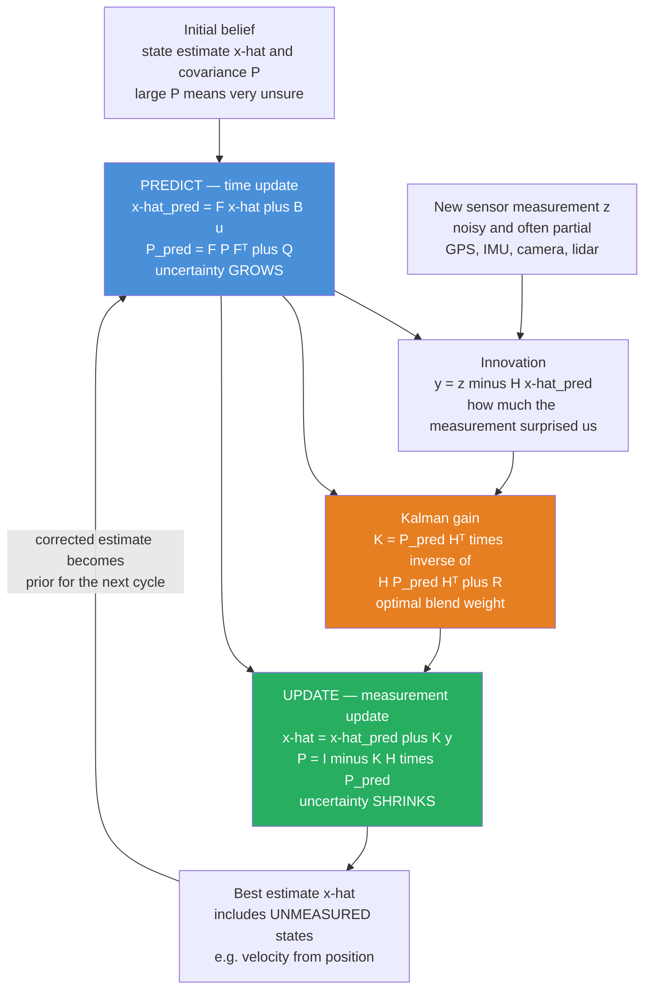

# 🛰️ Kalman Filtering and State Estimation

> [!abstract] TL;DR
> A robot never measures its true **state** — sensors are noisy, partial, and drift. **State estimation** is the problem of recovering the hidden state (position, velocity, orientation) from a stream of imperfect measurements. The **Kalman filter** is the *optimal* recursive solution for **linear systems with Gaussian noise**: it carries a running best guess of the state *and a covariance measuring its own uncertainty*, then loops two steps forever — **predict** (push the estimate forward through a motion model, growing uncertainty) and **update** (correct with each new measurement, shrinking uncertainty). The **Kalman gain** is the optimal weight that blends prediction against measurement in exact proportion to how much each is trusted. When the system is nonlinear you linearize it (**EKF**) or propagate carefully chosen sample points (**UKF**); when the noise is not Gaussian you fall back to **particle filters**. It is how spacecraft, self-driving cars, drones, and the phone in your pocket know where they are.

---

## Intuition

**Analogy — a ship's navigator with two liars for informants.** You are steering a ship at night with two imperfect sources of truth. The first is **dead reckoning**: from your speed and compass heading you calculate where you *must* be — cheap, always available, but it **drifts**, accumulating error every minute because currents and steering wobble go unmeasured. The second is an **occasional star sighting** with a sextant: it pins your absolute position, but it is **noisy** and jumps around from sighting to sighting, and you only get one now and then. Blindly trusting either informant is folly — dead reckoning slowly wanders off; the star sightings twitch all over the chart.

The Kalman filter is the mathematically **optimal way to blend these two liars**. It keeps a running best guess of your position *and a circle of uncertainty around it*. Between sightings it **predicts forward** using speed and heading — the guess moves and its uncertainty circle grows. When a star sighting arrives it **corrects** the guess, pulling it toward the sighting by an amount that depends on how big the uncertainty circle is compared to how noisy the sighting is: when you are very unsure, you lean hard on the new measurement; when you are already confident, you barely nudge. Crucially, correcting your position also sharpens your estimate of a quantity you never directly measured — your true velocity over the ground. That single idea — *predict with your model, correct with your measurements, and always track how much you trust yourself* — is how robots, rockets, and phones fuse IMU, GPS, wheel odometry, and cameras into one coherent sense of where they are.

---

## How It Works

### Core mechanics

The world is modeled as a hidden **state** $x_k$ that evolves and a **measurement** $z_k$ we actually observe:

$$x_k = F x_{k-1} + B u_k + w_k, \qquad w_k \sim \mathcal{N}(0, Q)$$
$$z_k = H x_k + v_k, \qquad v_k \sim \mathcal{N}(0, R)$$

- $x_k$ — the **state vector** (e.g. position and velocity) we want to know but cannot see directly.
- $F$ — the **state-transition / motion model**: how the state moves forward one time step (constant velocity, dynamics of *Robot_Dynamics_and_Equations_of_Motion*, etc.).
- $B, u_k$ — an optional **control input** (commanded thrust, wheel torque) that we *do* know.
- $H$ — the **measurement model**: which combination of the state the sensor reports (often *partial*, e.g. GPS gives position but not velocity).
- $Q$ — **process-noise covariance**: how much unmodeled disturbance corrupts the motion each step (how untrustworthy the model is).
- $R$ — **measurement-noise covariance**: how noisy the sensor is.

The filter maintains two things: the estimate $\hat{x}$ and the **estimate covariance** $P$ — the tracked uncertainty, an ellipsoid of "how wrong I could be." It then repeats two steps forever.

**1. Predict (time update)** — propagate belief forward through the motion model:

$$\hat{x}^- = F\hat{x} + B u_k \qquad\qquad P^- = F P F^{\mathsf T} + Q$$

The mean rides the model forward; the covariance is stretched by $F$ **and inflated by $Q$** — uncertainty *always grows* when you coast on prediction alone. This is the navigator's dead reckoning.

**2. Update (measurement update)** — correct the prediction with the new measurement $z_k$:

$$\underbrace{y = z_k - H\hat{x}^-}_{\text{innovation (surprise)}} \qquad S = H P^- H^{\mathsf T} + R$$
$$\underbrace{K = P^- H^{\mathsf T} S^{-1}}_{\text{Kalman gain}} \qquad \hat{x} = \hat{x}^- + K y \qquad P = (I - K H)P^-$$

The **innovation** $y$ is how much the measurement *surprised* us versus the prediction. The **Kalman gain** $K$ is the optimal blending weight: it compares the prediction's uncertainty $P^-$ against the measurement's noise $R$. If the sensor is precise ($R$ small), $K \to$ trust the measurement; if our prediction is confident ($P^-$ small), $K \to$ keep the prediction. Applying the correction **shrinks** $P$ — the measurement bought us information. This is the navigator's star sighting.

**Why it is optimal.** For a **linear-Gaussian** system the Kalman filter is the exact recursive **Bayesian** posterior: the belief stays Gaussian forever, and $(\hat{x}, P)$ are its exact mean and covariance. Among *all* estimators (linear or not) it achieves the **minimum mean-square error**; equivalently $\hat{x}$ is the **MAP** and MMSE estimate. Drop the Gaussian assumption and it is still the best *linear* unbiased estimator. It is also the **optimal observer**: it is a Luenberger observer whose gain is chosen optimally given the noise — the estimation-side dual of the **LQR** controller (together forming **LQG** control).

### Flow / architecture



---

## Key Concepts

### 🟢 Secondary — the plain-language picture

- **State.** The set of numbers that fully describe what a system is doing right now — for a car, roughly its position and velocity. The state is *hidden*; you only get noisy hints of it.
- **Two sources, one truth.** A **model** predicts where things should go; a **measurement** reports where a sensor thinks they are. Both lie a little. The filter blends them.
- **Uncertainty is a number you carry.** The filter never just says "you are here"; it says "you are *probably* here, give or take *this much*." That "give or take" is the covariance $P$, and tracking it is what makes the blending optimal.
- **Predict then correct, forever.** Coast forward on the model (getting less sure), then snap toward each new measurement (getting more sure). Repeat every time step.
- **Trust follows confidence.** A precise sensor pulls the estimate hard; a jittery one barely nudges it. The filter works out that trust automatically.

### 🟡 Undergraduate — the working machinery

- **The linear-Gaussian model.** $x_k = Fx_{k-1} + Bu_k + w_k$ and $z_k = Hx_k + v_k$ with $w \sim \mathcal N(0,Q)$, $v \sim \mathcal N(0,R)$. Everything the filter does follows from these two equations plus Gaussian algebra.
- **The five update equations.** Innovation $y = z - H\hat x^-$, innovation covariance $S = HP^-H^{\mathsf T}+R$, gain $K = P^-H^{\mathsf T}S^{-1}$, state update $\hat x = \hat x^- + Ky$, covariance update $P = (I-KH)P^-$. Memorize these; they are the heart of the method.
- **Predict grows $P$, update shrinks it.** $P^- = FPF^{\mathsf T}+Q$ inflates uncertainty; $(I-KH)P^-$ deflates it. In steady state they balance and $P$ (and $K$) converge to constants — the filter becomes a fixed-gain **steady-state / Wiener** filter.
- **Estimating the unmeasured.** Even when $H$ observes only position, the off-diagonal terms of $P$ correlate position and velocity, so correcting position also corrects velocity. This is why a Kalman filter recovers velocity from position measurements — provided the pair $(F,H)$ is **observable** (see *Controllability_and_Observability*).
- **Tuning $Q$ and $R$.** $R$ comes from sensor datasheets/calibration; $Q$ is a design knob for how much you distrust the model. The **ratio $Q/R$** sets responsiveness: large $Q/R$ tracks measurements aggressively (fast but jittery); small $Q/R$ trusts the model (smooth but laggy and slow to react to real maneuvers).
- **Sensor fusion.** Stack multiple sensors into $H$ and $R$ (or run sequential updates). GPS + IMU + wheel odometry fuse naturally: each update folds one sensor's information in, weighted by its noise, into one consistent state — the everyday meaning of *Robot_Perception_and_Sensor_Fusion*.

### 🔴 Graduate — the practical and theoretical edges

- **Nonlinear systems — EKF.** Real motion and measurement models $f(x)$, $h(x)$ are nonlinear (range/bearing sensors, rotations). The **Extended Kalman Filter** linearizes them each step via **Jacobians** $F = \partial f/\partial x$, $H = \partial h/\partial x$ (evaluated at the current estimate), then runs the linear equations. It is the workhorse of robotics and GPS/INS, but linearization introduces bias, can **diverge** if the initial guess is poor, and requires (often painful) analytic Jacobians.
- **Nonlinear systems — UKF.** The **Unscented Kalman Filter** avoids Jacobians with the **unscented transform**: deterministically choose a small set of **sigma points** around the mean, push each through the *true* nonlinear function, and recover the transformed mean and covariance from the propagated points. It captures the posterior to higher order (2nd–3rd), is usually more accurate and robust than EKF, needs no derivatives, and costs a comparable amount.
- **Non-Gaussian / multimodal — particle filters.** When the posterior is multimodal or heavily non-Gaussian (global localization, the "kidnapped robot"), Kalman variants break. **Particle filters (sequential Monte Carlo)** represent the belief with a swarm of weighted samples, propagate them through the model, weight by measurement likelihood, and resample — trading exactness for arbitrary distributions at higher compute cost.
- **Observability and the information form.** State recovery requires the **observability Gramian** of $(F,H)$ to be full rank; unobservable directions have unbounded covariance and the filter never learns them. The **information filter** propagates $P^{-1}$ (the information matrix) instead of $P$, which makes multi-sensor fusion an additive operation and starting from "know nothing" ($P^{-1}=0$) trivial.
- **Numerical robustness.** Naive $P = (I-KH)P^-$ can lose symmetry/positive-definiteness under finite precision, causing divergence. Use the **Joseph form** $P = (I-KH)P^-(I-KH)^{\mathsf T} + KRK^{\mathsf T}$, or **square-root / UD factorization** filters that propagate a factor of $P$ to guarantee it stays positive semidefinite.
- **Consistency and adaptivity.** A well-tuned filter is **consistent**: its innovations are zero-mean, white, and the **normalized innovation squared (NIS)** falls inside its chi-square bounds. Persistent NIS violations flag wrong $Q/R$ or model mismatch; **adaptive / IMM (interacting multiple model)** filters adjust noise or switch among motion models (constant-velocity vs turning) online.
- **LQG duality.** The Kalman filter and the **LQR** controller are mathematical duals — the optimal estimator gain and the optimal control gain solve dual Riccati equations. Combining them (estimate the state, then feed it to the LQR law) yields **LQG** optimal control, valid by the **separation principle**: for linear-Gaussian systems, optimal estimation and optimal control can be designed independently.

---

## Python Demo

We track an object moving with (nearly) **constant velocity in 2D**. The hidden state is $x = [p_x,\,p_y,\,v_x,\,v_y]^{\mathsf T}$; the truth is nudged by random **process noise** (unmodeled accelerations), and we only receive **noisy position measurements** — velocity is never measured. We implement the textbook linear Kalman filter exactly as derived (predict: $x=Fx,\ P=FPF^{\mathsf T}+Q$; update: $K=PH^{\mathsf T}(HPH^{\mathsf T}+R)^{-1},\ x=x+K(z-Hx),\ P=(I-KH)P$) and show four things: the filtered path is far smoother than the raw measurements and hugs the truth; the filter **recovers the unmeasured velocity**; the position **uncertainty shrinks** from a large initial guess to a steady state; and the **$Q/R$ ratio** trades smoothness against responsiveness.

```python
# Linear Kalman filter: 2D constant-velocity tracking from noisy position-only measurements
import numpy as np
import matplotlib.pyplot as plt

rng = np.random.default_rng(7)

# ---- Model: state x = [px, py, vx, vy], measure position only ----
dt = 1.0
F = np.array([[1, 0, dt, 0],      # px += vx*dt
              [0, 1, 0, dt],      # py += vy*dt
              [0, 0, 1,  0],      # vx constant
              [0, 0, 0,  1]], float)
H = np.array([[1, 0, 0, 0],       # measure px
              [0, 1, 0, 0]], float)  # measure py

q = 0.02                          # process-noise strength (unmodeled accel)
G = np.array([[0.5*dt**2, 0], [0, 0.5*dt**2], [dt, 0], [0, dt]])
Q = G @ G.T * q                   # process-noise covariance (correlates pos & vel)
r = 6.0                           # measurement-noise std [m]
R = np.eye(2) * r**2              # measurement-noise covariance

# ---- Simulate ground truth + noisy measurements ----
N = 60
true = np.zeros((N, 4))
true[0] = [0, 0, 1.2, 0.8]        # start moving up-right
meas = np.zeros((N, 2))
for k in range(1, N):
    w = np.linalg.cholesky(Q) @ rng.standard_normal(4)
    true[k] = F @ true[k-1] + w   # truth wanders via process noise
for k in range(N):
    meas[k] = H @ true[k] + rng.standard_normal(2) * r  # noisy position

def run_kalman(Q_use, R_use):
    """Textbook linear KF. Returns state estimates and position 1-sigma over time."""
    x = np.array([meas[0,0], meas[0,1], 0, 0], float)  # init from 1st measurement, vel unknown
    P = np.diag([r**2, r**2, 10.0, 10.0])               # large initial velocity uncertainty
    I = np.eye(4)
    xs, sig = np.zeros((N, 4)), np.zeros(N)
    for k in range(N):
        # --- PREDICT ---
        x = F @ x
        P = F @ P @ F.T + Q_use
        # --- UPDATE ---
        z = meas[k]
        y = z - H @ x                              # innovation
        S = H @ P @ H.T + R_use
        K = P @ H.T @ np.linalg.inv(S)             # Kalman gain
        x = x + K @ y
        P = (I - K @ H) @ P
        xs[k] = x
        sig[k] = np.sqrt(P[0, 0])                  # px 1-sigma uncertainty
    return xs, sig

est, sigma = run_kalman(Q, R)                      # well-tuned filter

# Tuning experiment: trust-model (small Q) vs trust-measurement (large Q)
est_slow, _ = run_kalman(Q * 0.02, R)             # small Q/R -> smooth, laggy
est_fast, _ = run_kalman(Q * 50.0, R)             # large Q/R -> jittery, follows noise
rmse = lambda e: np.sqrt(np.mean((e[:, :2] - true[:, :2])**2))
print(f"RMSE  measurements={rmse(np.c_[meas, meas]):.2f}  "
      f"tuned={rmse(est):.2f}  trust-model={rmse(est_slow):.2f}  trust-meas={rmse(est_fast):.2f}")

# ---------- Plots ----------
fig, ax = plt.subplots(2, 2, figsize=(13, 9))

# (a) 2D trajectory
ax[0,0].plot(true[:,0], true[:,1], 'k-', lw=2, label='true path')
ax[0,0].scatter(meas[:,0], meas[:,1], s=22, c='crimson', alpha=0.55, label='noisy measurements')
ax[0,0].plot(est[:,0], est[:,1], 'seagreen', lw=2, label='Kalman estimate')
ax[0,0].set_title('(a) 2D constant-velocity tracking')
ax[0,0].set_xlabel('x [m]'); ax[0,0].set_ylabel('y [m]'); ax[0,0].legend(); ax[0,0].axis('equal')

# (b) px over time with uncertainty band
t = np.arange(N)
ax[0,1].plot(t, true[:,0], 'k-', lw=2, label='true px')
ax[0,1].scatter(t, meas[:,0], s=18, c='crimson', alpha=0.5, label='measured px')
ax[0,1].plot(t, est[:,0], 'seagreen', lw=2, label='filtered px')
ax[0,1].fill_between(t, est[:,0]-sigma, est[:,0]+sigma, color='seagreen', alpha=0.22,
                     label='+/- 1 sigma band')
ax[0,1].set_title('(b) position estimate + uncertainty band')
ax[0,1].set_xlabel('time step'); ax[0,1].set_ylabel('px [m]'); ax[0,1].legend()

# (c) UNMEASURED velocity, recovered by the filter
ax[1,0].plot(t, true[:,2], 'k-', lw=2, label='true vx (never measured)')
ax[1,0].plot(t, est[:,2], 'darkorange', lw=2, label='filtered vx')
ax[1,0].set_title('(c) filter recovers unmeasured velocity')
ax[1,0].set_xlabel('time step'); ax[1,0].set_ylabel('vx [m/s]'); ax[1,0].legend()

# (d) shrinking uncertainty + tuning effect on px
ax[1,1].plot(t, sigma, 'purple', lw=2)
ax[1,1].set_title('(d) position uncertainty (1 sigma) shrinks then settles')
ax[1,1].set_xlabel('time step'); ax[1,1].set_ylabel('px 1-sigma [m]')
ax[1,1].annotate('large initial\nuncertainty', xy=(1, sigma[1]), xytext=(8, sigma[1]*0.9),
                 arrowprops=dict(arrowstyle='->'))
ax[1,1].annotate('steady state', xy=(N-2, sigma[-1]), xytext=(N-25, sigma[-1]+0.6),
                 arrowprops=dict(arrowstyle='->'))

plt.tight_layout()
plt.show()
```

Running it prints RMSE numbers that make the point quantitatively: the filtered estimate has far lower error than the raw measurements. Panel **(a)** shows the green estimate threading smoothly through the red measurement cloud along the true path; **(b)** shows the shaded $\pm 1\sigma$ band that the filter reports around its own guess; **(c)** shows velocity — a state the sensor *never observed* — reconstructed purely from the position stream via the position–velocity correlation in $P$; and **(d)** shows uncertainty collapsing from the deliberately huge initial value to a steady state where predict-growth and update-shrinkage balance. The tuning line shows that a too-small $Q/R$ lags real maneuvers while a too-large $Q/R$ chases measurement noise — tuning $Q$ versus $R$ *is* the practical art of Kalman filtering.

---

## Real-World Applications

- **Aerospace navigation (the origin story).** Apollo's guidance computer ran a Kalman filter to fuse inertial measurements with occasional star/radar fixes for trans-lunar navigation — the method's first flagship use, and still the backbone of every spacecraft, missile, and aircraft **INS/GPS** integration.
- **Self-driving cars and drones.** An EKF or UKF fuses IMU (high-rate but drifting), GPS (absolute but slow and noisy), wheel odometry, and lidar/visual odometry into one 6-DOF pose estimate at hundreds of hertz — the localization layer beneath *Simultaneous_Localization_and_Mapping*.
- **Smartphones and wearables.** The "sensor fusion" that gives your phone a stable heading and step count is a Kalman/complementary filter blending accelerometer, gyroscope, and magnetometer; the same math stabilizes VR/AR headset tracking.
- **SLAM.** The classic **EKF-SLAM** jointly estimates the robot pose *and* a map of landmarks in one growing state vector and covariance — the historical foundation of robotic mapping, later scaled up by particle-filter (FastSLAM) and graph-based methods.
- **Finance and beyond.** State-space models of latent economic variables, target tracking in radar/sonar (Bar-Shalom's domain), battery state-of-charge estimation, and weather data assimilation (the ensemble Kalman filter) all run the same predict–update recursion. The time-series treatment lives in *[[Kalman_Filter]]* and *[[State_Space_Models]]*.

---

## Common Pitfalls

- **Mis-tuned $Q$ and $R$.** The dominant real-world failure. Too small a $Q$ makes the filter *overconfident* in its model — it ignores real maneuvers and lags reality (and can diverge); too small an $R$ makes it chase every noise spike. Tune $R$ from sensor calibration, then adjust $Q$ until innovations look white and the **NIS** consistency test passes. There is no single "right" value — it encodes how much you trust your model.
- **Filter divergence.** If the reported covariance $P$ shrinks to near-zero, the gain $K \to 0$ and the filter stops listening to measurements even as it drifts away from truth. Causes: too-small $Q$, unobservable states, or numerical collapse of $P$. Cures: inflate $Q$, add a lower bound on $P$, or use a square-root filter.
- **Assuming linear-Gaussian when it is not.** Range/bearing sensors, rotations, and multimodal beliefs are nonlinear or non-Gaussian; a plain KF is simply wrong. Reach for the **EKF** (linearize) or **UKF** (sigma points) for mild nonlinearity, and a **particle filter** for multimodal/global-localization problems.
- **EKF linearization error and bad initialization.** The EKF trusts a first-order Taylor expansion; with strong curvature or a poor initial estimate the linearization point is wrong, the covariance becomes inconsistent, and the filter **diverges** irrecoverably. Validate with a UKF, initialize carefully, and watch the innovations.
- **Model mismatch.** If the true motion is not what $F$ says (a "constant-velocity" filter tracking a turning target), the estimate lags systematically and innovations become biased. Use a better model, inflate $Q$, or switch to an **IMM** filter that runs several motion models at once.
- **Numerical covariance issues.** Finite-precision arithmetic can make $P$ non-symmetric or non-positive-definite, corrupting the gain. Use the **Joseph-form** covariance update or a **square-root / UD** implementation, and symmetrize $P$ each step as a cheap safeguard.

---

## Related Concepts

- [[Kalman_Filter]] — the time-series/forecasting-oriented treatment of the same recursion; this note is the robotics/controls estimation view with EKF, UKF, and sensor fusion.
- [[State_Space_Models]] — the $x_k = Fx_{k-1}+w$, $z_k = Hx_k+v$ formalism the Kalman filter operates on.
- [[State_Space_Basics]] — the underlying $\dot x = Ax + Bu$ representation of the plant whose state we estimate.
- [[Controllability_Observability]] — **observability** of $(F,H)$ decides whether the hidden state is even recoverable from the measurements.
- [[State_Feedback_Control]] — the LQR/state-feedback side; the Kalman filter is its estimation **dual**, and the two combine into LQG control.
- [[Robot_Dynamics_and_Equations_of_Motion]] — supplies the physically grounded motion model $F$ (or nonlinear $f$) that the predict step propagates.
- [[Bayesian_Statistics]] — the Kalman filter *is* exact recursive Bayesian inference for the linear-Gaussian case (prior → predict → posterior).
- [[Statistical_Inference]] — the MMSE / MAP estimation principles the filter is optimal under.
- [[Probability_Theory]] — the joint/conditional Gaussian machinery that makes the closed-form update possible.
- [[Common_Probability_Distributions]] — the multivariate **Gaussian** whose mean and covariance the filter propagates.
- [[Random_Variables]] — process noise $w$ and measurement noise $v$ as the random quantities being modeled.
- [[Matrices_and_Determinants]] — covariance matrices $P, Q, R$ and the matrix inverse inside the Kalman gain.
- [[Eigenvalues_and_Eigenvectors]] — the eigen-structure of $P$ (the uncertainty ellipsoid) and the closed-loop estimator dynamics.
- [[Naive_Bayes]] — a sibling application of Bayes' rule in ML; useful contrast to the *sequential* Bayesian updating the Kalman filter performs.
- [[PID_Control]] — the classical, model-free reactive controller; Kalman filtering supplies the clean state estimates that modern model-based controllers feed on.
- [[Robotics_and_Control_Overview]] — the field map placing state estimation within the broader robotics and control stack.

---

## Review Questions

### 🟢 Secondary
1. Using the ship-navigator analogy, explain in plain words what the **predict** step and the **update** step each do, and why the filter's circle of uncertainty *grows* during predict but *shrinks* during update.

### 🟡 Undergraduate
2. A Kalman filter tracking a car measures **only position**, yet it reports a confident **velocity** estimate. Mechanically, how does correcting a position measurement improve the velocity estimate, and what property of the pair $(F,H)$ must hold for this to work at all?
3. Write down the five measurement-update equations. Explain how the Kalman gain $K$ changes as (a) the sensor becomes very precise ($R \to 0$) and (b) the prediction becomes very confident ($P^- \to 0$), and describe the filter's behavior in each limit.

### 🔴 Graduate
4. You must estimate the pose of a robot from a **range-and-bearing** sensor, whose measurement model is nonlinear. Compare the **EKF** and **UKF** approaches: what does each do to handle the nonlinearity, what are the failure modes of each, and on what grounds would you choose one over the other (or reach for a particle filter instead)?
5. A deployed filter is diverging: over time its reported covariance $P$ collapses toward zero while the estimate visibly drifts away from ground truth. Enumerate the likely causes (tuning, observability, numerics, model mismatch), the diagnostic you would run to distinguish them, and a specific fix for each — including the covariance-update form you would switch to for numerical robustness.

---

## Sources

- Kalman, R. E. — "A New Approach to Linear Filtering and Prediction Problems," *Transactions of the ASME — Journal of Basic Engineering*, 82(1), pp. 35–45 (1960). *(the original paper.)*
- Thrun, S., Burgard, W., & Fox, D. — *Probabilistic Robotics* (MIT Press, 2005). *(Bayes/Kalman/EKF/UKF/particle filters for robotics.)*
- Simon, D. — *Optimal State Estimation: Kalman, H-infinity, and Nonlinear Approaches* (Wiley, 2006).
- Bar-Shalom, Y., Li, X.-R., & Kirubarajan, T. — *Estimation with Applications to Tracking and Navigation* (Wiley, 2001).
- Julier, S. J., & Uhlmann, J. K. — "Unscented Filtering and Nonlinear Estimation," *Proceedings of the IEEE*, 92(3), pp. 401–422 (2004).

---

#robotics #kalman-filter #state-estimation #sensor-fusion #bayesian
