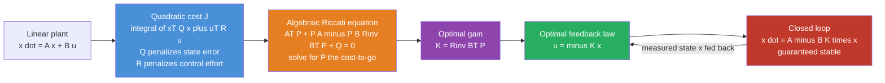

# 🎯 LQR Optimal Control

> [!abstract] TL;DR
> The **Linear-Quadratic Regulator (LQR)** finds the *optimal* linear state-feedback law $u = -Kx$ for a linear plant $\dot x = Ax + Bu$ by minimizing a **quadratic cost** $J = \int_0^\infty (x^\top Q\,x + u^\top R\,u)\,dt$, where **$Q$ penalizes state error** and **$R$ penalizes control effort**. The single optimal gain is $K = R^{-1}B^\top P$, with $P$ the positive-semidefinite solution of the **algebraic Riccati equation**. LQR turns the vague question *"where should I put the closed-loop poles?"* into a systematic, MIMO-capable design with just two weighting knobs — and, for the deterministic case, it comes with guaranteed stability and famously good gain and phase margins.

---

## Intuition

**Analogy — the thermostat that also watches your electric bill.** Suppose you want to drag a room's temperature back to 21 °C. A crude controller just blasts the heater at full power until you arrive — fast, but it burns a fortune in electricity and hammers the furnace. An overly timid controller sips a trickle of power — cheap, but the room stays cold for an hour. Neither is "right" until you say *how much you care* about being cold versus how much you care about the energy bill. LQR is exactly that: you hand it two dials — **$Q$**, how much a temperature error hurts, and **$R$**, how much using the heater hurts — and it computes, once and for all, the single cheapest-in-total feedback rule that trades comfort against cost optimally over all future time.

Recall that [[State_Feedback_Control|pole placement]] lets you slam the closed-loop poles *anywhere* you like — but *where should they go?* Push the poles far into the left half-plane and the system snaps to target in milliseconds while your actuators scream and saturate; leave them near the imaginary axis and the system crawls. Guessing pole locations for a 2-state system is doable; for a 12-state quadrotor or a 50-state chemical column it is hopeless. LQR replaces that guesswork with an optimization: state your priorities as $Q$ and $R$, and the Riccati equation returns the one gain matrix $K$ that balances tracking error against control effort — automatically, for any number of states and inputs.

---

## How It Works

### Core Mechanics

1. **Model the plant as linear.** Write (or linearize about an operating point) the dynamics in state-space form $\dot x = Ax + Bu$, where $x \in \mathbb{R}^n$ is the state and $u \in \mathbb{R}^m$ is the control. LQR requires $(A,B)$ to be **controllable** (or at least stabilizable).
2. **Define what "good" means with a quadratic cost.** Choose symmetric weight matrices $Q \succeq 0$ (penalizes deviation of the state from zero) and $R \succ 0$ (penalizes control effort), and write the infinite-horizon cost
   $$J = \int_0^\infty \left(x^\top Q\,x + u^\top R\,u\right)\,dt.$$
   A large $Q$ says *"errors are expensive — correct them fast."* A large $R$ says *"actuation is expensive — go easy."*
3. **Solve the Algebraic Riccati Equation (ARE).** The minimizing control is a linear feedback, and the whole problem collapses to finding the unique $P \succeq 0$ satisfying the **continuous-time ARE**
   $$A^\top P + P A - P B R^{-1} B^\top P + Q = 0.$$
   $P$ is not just an algebraic intermediary — it *is* the **cost-to-go**: $J^\star(x) = x^\top P x$ is the minimum remaining cost starting from state $x$ (the value function of dynamic programming).
4. **Read off the optimal gain.** Once $P$ is known,
   $$K = R^{-1} B^\top P, \qquad u^\star = -K x.$$
5. **Close the loop.** The controlled dynamics become $\dot x = (A - BK)x$. Provided $(A,B)$ is controllable and $(A, \sqrt{Q})$ is observable, the closed loop is **guaranteed asymptotically stable** — every eigenvalue of $A-BK$ sits strictly in the left half-plane, *for free*, no pole-checking required.

**Finite vs infinite horizon.** Over a finite horizon $[0,T]$ the solution is time-varying: $K(t) = R^{-1}B^\top P(t)$ where $P(t)$ solves the **Riccati *differential* equation** $-\dot P = A^\top P + PA - PBR^{-1}B^\top P + Q$ integrated *backward* from a terminal weight $P(T)=Q_f$. As $T\to\infty$ this $P(t)$ settles to the constant $P$ of the *algebraic* equation, giving the familiar constant-gain infinite-horizon LQR.

**Connection to dynamic programming.** LQR is the continuous, quadratic special case of the [[RL_Fundamentals|Bellman]] principle of optimality. The Hamilton-Jacobi-Bellman equation, with the quadratic ansatz $J^\star = x^\top P x$, reduces exactly to the ARE — which is why $P$ is the cost-to-go and why value-iteration on the discrete Riccati recursion converges to it (exactly what the demo below does).

### Flow / Architecture



---

## Key Concepts

### 🟢 Secondary — the plain-language picture

- **Two knobs, one best answer.** $Q$ = *"how much do I hate being off-target?"*; $R$ = *"how much do I hate using the actuator?"*. Given those, LQR computes the single best control law — no trial and error.
- **Cheap vs expensive control.** Small $R$ (cheap control) → aggressive, fast, high effort. Large $R$ (expensive control) → gentle, slow, low effort. This is the fundamental tradeoff LQR lets you dial in.
- **Feedback from the whole state.** Unlike a [[PID_Control|PID]] loop that watches one error signal, LQR feeds back *every* state variable at once, each with its own optimally chosen weight in $K$.
- **Optimal pole placement.** LQR still ends up placing the closed-loop poles somewhere — it just picks *where* optimally, so you never have to.

### 🟡 Undergraduate — the working machinery

- **The cost functional.** $J = \int_0^\infty (x^\top Q x + u^\top R u)\,dt$ with $Q = Q^\top \succeq 0$, $R = R^\top \succ 0$. $R$ must be strictly positive-definite so that $R^{-1}$ exists and every control channel carries some penalty.
- **The Riccati equation and gain.** Solve $A^\top P + PA - PBR^{-1}B^\top P + Q = 0$ for the stabilizing $P \succeq 0$, then $K = R^{-1}B^\top P$, $u = -Kx$. The nonlinear (quadratic-in-$P$) term $PBR^{-1}B^\top P$ is what makes the ARE more than a Lyapunov equation.
- **Bryson's rule (a starting point for $Q$, $R$).** A standard first cut: make $Q$ and $R$ diagonal with $Q_{ii} = 1/(x_{i,\max})^2$ and $R_{jj} = 1/(u_{j,\max})^2$, i.e. normalize each state and input by the largest value you can tolerate. It equalizes the contributions and gives sensible units; then hand-tune from there.
- **Guaranteed stability.** If $(A,B)$ is stabilizable and $(A, Q^{1/2})$ is detectable, the closed loop $A-BK$ is Hurwitz. This is LQR's headline advantage over naive [[State_Feedback_Control|Ackermann pole placement]], which can produce an ill-conditioned or fragile gain.
- **Discrete-time twin (DLQR).** For $x_{k+1} = A x_k + B u_k$, the **discrete algebraic Riccati equation (DARE)** is $P = Q + A^\top P A - A^\top P B (R + B^\top P B)^{-1} B^\top P A$, with $K = (R + B^\top P B)^{-1} B^\top P A$. Iterating this recursion from $P_0 = Q$ **is** value iteration on the cost-to-go — and needs nothing but matrix algebra to solve (see the demo).

### 🔴 Graduate — the practical and theoretical edges

- **$P$ is the value function.** LQR is the Bellman equation made concrete: $J^\star(x_0) = x_0^\top P x_0$, and the Hamilton-Jacobi-Bellman PDE with quadratic value collapses to the ARE. This is the exact hinge connecting classical optimal control to [[RL_Fundamentals|reinforcement learning]] and approximate dynamic programming — DLQR is the linear-quadratic sanity check every RL algorithm should reproduce.
- **Guaranteed margins (deterministic LQR).** State-feedback LQR has a remarkable robustness property: an **infinite upward gain margin**, a gain margin down to **1/2**, and at least **60° of phase margin** at the plant input, in *every* channel. These fall out of the return-difference / Kalman inequality $(I + L)^*R(I + L) \ge R$.
- **The LQG extension — and its caveat.** When you cannot measure the full state and the plant is driven by Gaussian noise, you combine LQR with an optimal state estimator ([[State_Feedback_Control|Kalman filter]]) — this is **LQG** (Linear-Quadratic-Gaussian), and by the **separation principle** the regulator and estimator are designed independently. The catch: Doyle's celebrated 1978 note *"Guaranteed Margins for LQG Regulators: None"* showed that inserting the estimator **destroys the LQR margins entirely** — an LQG loop can have arbitrarily small robustness margins. Loop Transfer Recovery (LTR) partially restores them.
- **Cross term and general cost.** The full LQR cost can include a cross-weight $2x^\top N u$; the ARE and gain absorb it as $K = R^{-1}(B^\top P + N^\top)$ with a correspondingly modified quadratic term. Often folded into $Q$ and $R$ by completing the square.
- **No hard constraints.** LQR minimizes a *soft* penalty on $u$; it cannot enforce a hard limit like $|u| \le u_{\max}$ or a state box. When those bind, you need [[PID_Control|anti-windup]] band-aids or, properly, **Model Predictive Control**, which re-solves a constrained quadratic program every step (LQR is exactly unconstrained MPC over an infinite horizon).

---

## Python Demo

We run LQR on a **double integrator** $\ddot p = u$ (position $p$, velocity $v$, force $u$) — the canonical model for a frictionless cart, a satellite thruster, or a 1-DOF robot joint. Three parts:

1. **Solve the Riccati equation with no library.** We iterate the **discrete Riccati recursion** (value iteration on the cost-to-go) from $P_0 = Q$ until it converges, then read off $K$. Pure NumPy — no `scipy`, no `control`.
2. **Simulate the closed loop** stabilizing from an initial displacement $x_0 = [1, 0]^\top$.
3. **Show the core tradeoff.** We sweep the control-effort weight $R$: **cheap control** (small $R$) gives a fast, aggressive response burning lots of effort; **expensive control** (large $R$) gives a slow, gentle response. We plot the state trajectories, the control signals, the effort-vs-error **tradeoff curve**, and the **pole migration** as $R$ grows.

```python
# LQR on a double integrator, solved by iterating the discrete Riccati
# recursion (value iteration on the cost-to-go) -- numpy only, no scipy.
import numpy as np
import matplotlib.pyplot as plt

# ---- Plant: double integrator (p'' = u). Exact discretization at step dt ----
dt = 0.05
A = np.array([[1.0, dt],
              [0.0, 1.0]])          # [position; velocity]
B = np.array([[0.5 * dt**2],
              [dt]])                # force -> position/velocity

def dare_value_iteration(A, B, Q, R, iters=20000, tol=1e-13):
    """Solve the discrete-time algebraic Riccati equation by iterating the
    Riccati difference equation backward to steady state. This is literally
    value iteration on the quadratic cost-to-go V(x) = x^T P x."""
    P = Q.copy()                                    # terminal cost-to-go = Q
    for _ in range(iters):
        S = R + B.T @ P @ B                         # (m x m) to invert
        K = np.linalg.solve(S, B.T @ P @ A)         # (R + B'PB)^-1 B'PA
        P_next = Q + A.T @ P @ A - A.T @ P @ B @ K  # Riccati update
        if np.max(np.abs(P_next - P)) < tol:
            P = P_next
            break
        P = P_next
    S = R + B.T @ P @ B
    K = np.linalg.solve(S, B.T @ P @ A)             # optimal feedback gain
    return P, K

def simulate(K, x0, steps=240):
    """Roll out the closed loop x_{k+1} = A x_k + B u_k with u = -K x."""
    x = np.array(x0, dtype=float)
    xs = np.zeros((steps, 2)); us = np.zeros(steps)
    for k in range(steps):
        u = -(K @ x)[0]
        xs[k] = x; us[k] = u
        x = A @ x + B[:, 0] * u
    return xs, us

# ---- Sweep the control-effort weight R (cheap -> expensive control) --------
Q = np.diag([1.0, 0.0])                # penalize position error only
x0 = [1.0, 0.0]                        # start 1 unit off target, at rest
steps = 240
t = np.arange(steps) * dt
R_values = np.array([1e-3, 1e-2, 1e-1, 1.0, 10.0, 100.0])
colors = plt.cm.viridis(np.linspace(0, 0.9, len(R_values)))

runs = []
for Rval in R_values:
    P, K = dare_value_iteration(A, B, Q, np.array([[Rval]]))
    xs, us = simulate(K, x0, steps)
    effort = np.sum(us**2) * dt                     # total control energy
    err    = np.sum(xs[:, 0]**2) * dt               # accumulated position error
    poles  = np.linalg.eigvals(A - B @ K)           # discrete closed-loop poles
    idx    = np.where(np.abs(xs[:, 0]) > 0.02)[0]
    settle = t[idx[-1]] if len(idx) else 0.0
    runs.append(dict(R=Rval, K=K.ravel(), xs=xs, us=us,
                     effort=effort, err=err, poles=poles, settle=settle))
    print(f"R={Rval:7.3f}  K=[{K[0,0]:6.3f} {K[0,1]:6.3f}]  "
          f"effort={effort:8.3f}  settle={settle:5.2f}s")

# ---- Plots ----------------------------------------------------------------
fig, ax = plt.subplots(2, 2, figsize=(13, 9))

# (1) position trajectories: cheap R = fast/aggressive, big R = slow/gentle
ax[0, 0].axhline(0, ls='--', color='k', lw=1)
for r, c in zip(runs, colors):
    ax[0, 0].plot(t, r['xs'][:, 0], color=c, label=f"R={r['R']:g}")
ax[0, 0].set_title('(1) Position response: small R = fast, large R = slow')
ax[0, 0].set_xlabel('time [s]'); ax[0, 0].set_ylabel('position p'); ax[0, 0].legend()

# (2) control signals: cheap control spends aggressively, expensive control sips
for r, c in zip(runs, colors):
    ax[0, 1].plot(t, r['us'], color=c, label=f"R={r['R']:g}")
ax[0, 1].set_title('(2) Control effort: small R spends hard, large R is gentle')
ax[0, 1].set_xlabel('time [s]'); ax[0, 1].set_ylabel('control u'); ax[0, 1].legend()

# (3) the tradeoff curve: accumulated error vs total control effort
eff = [r['effort'] for r in runs]; er = [r['err'] for r in runs]
ax[1, 0].plot(eff, er, '-o', color='crimson')
for r in runs:
    ax[1, 0].annotate(f"R={r['R']:g}", (r['effort'], r['err']),
                      textcoords='offset points', xytext=(6, 4), fontsize=8)
ax[1, 0].set_xscale('log'); ax[1, 0].set_yscale('log')
ax[1, 0].set_title('(3) Tradeoff: cheap control = low error/high effort')
ax[1, 0].set_xlabel('total control effort  (sum u^2 dt)')
ax[1, 0].set_ylabel('accumulated position error')

# (4) pole migration in the z-plane as R grows (poles crawl toward unit circle)
th = np.linspace(0, 2*np.pi, 300)
ax[1, 1].plot(np.cos(th), np.sin(th), 'k--', lw=1, label='unit circle')
for r, c in zip(runs, colors):
    ax[1, 1].scatter(r['poles'].real, r['poles'].imag, color=c,
                     s=70, label=f"R={r['R']:g}")
ax[1, 1].set_title('(4) Closed-loop pole migration vs R')
ax[1, 1].set_xlabel('Re'); ax[1, 1].set_ylabel('Im')
ax[1, 1].set_aspect('equal'); ax[1, 1].legend(fontsize=8)

plt.tight_layout(); plt.show()
```

**What you see.** The printout shows the gain $K$ shrinking as $R$ grows — expensive control means a timid gain. Panel (1): with $R=10^{-3}$ (cheap control) the cart snaps to zero in a fraction of a second; with $R=100$ (expensive control) it drifts back lazily over several seconds. Panel (2): the cheap-control run fires a large initial force spike, the expensive-control run barely nudges the actuator. Panel (3) is the money plot — a clean Pareto tradeoff: driving accumulated error down costs exponentially more control effort, and LQR lets you pick any point on that curve by turning one knob. Panel (4) shows the closed-loop poles migrating **from deep inside the unit circle (fast, well-damped) toward the boundary (slow)** as $R$ increases — LQR is placing the poles optimally for you, and you are watching *where* it puts them.

---

## Real-World Applications

- **Aerospace and spacecraft attitude control.** LQR (and LQG) is the textbook first-pass design for satellite reaction-wheel attitude loops, launch-vehicle stabilization, and aircraft autopilot inner loops; $Q$ weights pointing error, $R$ weights actuator torque / fuel. It was developed at NASA/MIT in the Apollo era precisely for this.
- **Quadrotors and legged robots.** Many drone flight stacks linearize about hover and run LQR on the attitude/position states; the MIT Cheetah and boston-dynamics-style balancing controllers use LQR (often as the terminal cost inside an MPC) to stabilize the linearized dynamics about a gait.
- **Inverted-pendulum / cart-pole and Segway-type balancers.** The canonical demo: linearize about the upright equilibrium, pick $Q$ and $R$, and LQR yields the balancing gain in one shot — no manual pole tuning.
- **Automotive.** Active suspension, electronic stability control, and lane-keeping/steering assist use LQR to trade ride comfort (state error) against actuator energy and passenger jerk.
- **Power systems and process control.** Automatic generation control and multivariable chemical-column regulation exploit LQR's native MIMO handling where hand-tuning dozens of coupled PID loops is impractical.

---

## Common Pitfalls

- **Choosing $Q$ and $R$ is an art, not a formula.** The Riccati math is mechanical; picking the weights that yield the behavior you actually want is iterative. Start from **Bryson's rule** (normalize by max tolerable values), keep $Q$ and $R$ diagonal, and only the *ratio* $Q/R$ matters for the shape of the response — scaling both by the same factor changes nothing.
- **Model dependence.** LQR is only as good as the linear $(A,B)$ model. Away from the linearization point (large pendulum angles, aggressive maneuvers) the true dynamics diverge and the "optimal" gain can perform poorly or destabilize. Gain-scheduling or nonlinear MPC is the fix.
- **No hard constraints.** LQR *softly* penalizes $u$ but cannot enforce $|u| \le u_{\max}$ or state bounds. If your actuator saturates, the closed loop is no longer the LQR you designed and can wind up or go unstable. For hard limits use **Model Predictive Control** (constrained QP each step).
- **Robustness is a deterministic-only guarantee — LQG loses it.** The beautiful gain/phase margins hold for *state-feedback* LQR. The moment you add a Kalman filter for output feedback (LQG), Doyle's "Guaranteed Margins for LQG Regulators: None" applies — margins can collapse. Use Loop Transfer Recovery or an explicit robust ($H_\infty$) design when robustness matters.
- **It needs the full state.** $u = -Kx$ assumes every state is measured. Real sensors give partial, noisy output, so in practice you pair LQR with an observer / Kalman filter — reintroducing the LQG robustness caveat above.
- **Forgetting the observability condition on $Q$.** Stability is guaranteed only if $(A, Q^{1/2})$ is detectable. Setting a state's weight in $Q$ to exactly zero can leave an uncontrolled-cost mode; confirm the closed-loop eigenvalues, don't assume.

---

## Related Concepts

- [[State_Feedback_Control]] — LQR is the *optimal* choice of the feedback gain $K$ in the $u=-Kx$ framework; this note covers pole placement, Luenberger observers, and the separation principle that LQR/LQG build on.
- [[Controllability_Observability]] — controllability of $(A,B)$ and detectability of $(A,Q^{1/2})$ are the exact conditions under which LQR exists and guarantees stability.
- [[PID_Control]] — the classical, model-free, single-loop alternative; LQR generalizes it to optimal, MIMO, full-state feedback (and augmenting the state with an integrator recovers PID-style zero steady-state tracking).
- [[Feedback_Control_Fundamentals]] — the negative-feedback foundation and closed-loop stability ideas LQR optimizes over.
- [[Stability_Routh_Hurwitz_and_Root_Locus]] — classical tools for *checking* where poles are; LQR instead *chooses* pole locations optimally.
- [[Robot_Dynamics_and_Equations_of_Motion]] — the nonlinear robot dynamics you linearize into $(A,B)$ before applying LQR.
- [[Eigenvalues_and_Eigenvectors]] — the closed-loop poles are eigenvalues of $A-BK$; LQR relocates them optimally.
- [[Matrices_and_Determinants]] — the matrix algebra ($Q$, $R$, $P$, $K$) and the inverse $R^{-1}$ at the heart of the gain.
- [[Systems_of_ODEs]] — the state-space ODE $\dot x = (A-BK)x$ whose solution is the closed-loop response.
- [[Lagrange_Multipliers]] — LQR is a constrained optimization (minimize $J$ subject to the dynamics); $P$ arises from the costate/adjoint of the Pontryagin/Lagrangian formulation.
- [[KKT_Conditions]] — the optimality conditions underlying the constrained optimal-control problem LQR solves in closed form.
- [[Convex_Functions]] — the quadratic cost with $Q\succeq0, R\succ0$ is convex, which is why LQR has a unique global optimum.
- [[RL_Fundamentals]] — LQR is the linear-quadratic special case of the Bellman value function; $P$ is the cost-to-go and DLQR is value iteration in closed form.
- [[Q_Learning_and_SARSA]] — model-free RL learns the same optimal-control map that LQR computes analytically when the model is known and quadratic.
- [[Robotics_and_Control_Overview]] — the field map placing LQR within the modern/optimal-control branch of the stack.

> Adjacent modern-control notes to build next (prose, not yet in the vault): *Pole_Placement_and_Full_State_Feedback*, *Kalman_Filtering_and_State_Estimation* (the observer half of LQG), *Model_Predictive_Control* (LQR with hard constraints), and *Reinforcement_Learning_for_Control* (learning the LQR map without a model).

---

## Review Questions

### 🟢 Secondary
1. Using the thermostat-with-an-electric-bill analogy, explain what the matrices $Q$ and $R$ represent. If you *doubled* $R$, would the controller respond more aggressively or more gently, and why?

### 🟡 Undergraduate
2. Write down the continuous-time algebraic Riccati equation and the resulting gain formula $K = R^{-1}B^\top P$. Explain why LQR guarantees a stable closed loop while an arbitrary pole-placement gain does not — what condition on $Q$ is required?
3. You are told only the *ratio* $Q/R$ matters for the shape of the LQR response, not the absolute scale. Argue why this is true from the cost functional, and describe how Bryson's rule gives you a sensible first choice of the weights.

### 🔴 Graduate
4. Explain in what precise sense $P$ (the Riccati solution) is a value function, and how iterating the discrete Riccati recursion is a form of value iteration / dynamic programming. What does this tell you about the relationship between LQR and reinforcement learning?
5. State-feedback LQR enjoys excellent gain and phase margins, yet Doyle proved LQG can have "no guaranteed margins." Explain what changes between LQR and LQG to destroy the margins, why the separation principle does *not* protect robustness, and name one remedy.
6. Your quadrotor's actuators saturate at $\pm u_{\max}$, and the LQR-designed gain commands well beyond that during aggressive maneuvers, causing instability. Explain why LQR cannot represent this hard constraint, and describe how Model Predictive Control resolves it — including the sense in which LQR is a special case of MPC.

---

## Sources

- Anderson, B. D. O., & Moore, J. B. — *Optimal Control: Linear Quadratic Methods* (Prentice Hall, 1990; Dover reprint 2007).
- Bertsekas, D. P. — *Dynamic Programming and Optimal Control*, Vol. 1, 4th ed. (Athena Scientific, 2017) — LQR as the linear-quadratic case of DP.
- Kirk, D. E. — *Optimal Control Theory: An Introduction* (Dover, 2004).
- Åström, K. J., & Murray, R. M. — *Feedback Systems: An Introduction for Scientists and Engineers*, 2nd ed. (Princeton University Press, 2021), Ch. 7.
- Doyle, J. C. — "Guaranteed Margins for LQG Regulators," *IEEE Transactions on Automatic Control*, 23(4), pp. 756–757 (1978).

---

#robotics #lqr #optimal-control #riccati #state-feedback
