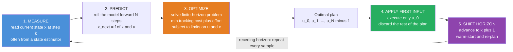

# 🔮 Model Predictive Control

> [!abstract] TL;DR
> **Model Predictive Control (MPC)** turns control into *repeated planning*: at every instant it uses a **model** of the plant to simulate the future over a finite **horizon**, solves a **constrained optimization** for the input sequence that minimizes a tracking-plus-effort cost while obeying hard limits like $\lvert u\rvert \le u_{\max}$ or "stay off the wall," then **applies only the first input** and throws the rest away — re-solving from the freshly measured state one step later. This *receding-horizon* loop is what lets MPC do the one thing PID and LQR cannot: **respect state and actuator constraints explicitly, in a multi-input multi-output (MIMO) system, with built-in preview** — which is why it runs everything from oil refineries to self-driving cars and agile drones. In the unconstrained, infinite-horizon limit MPC collapses exactly to **LQR**; MPC is what you get when you make LQR *constraint-aware and re-planned online*.

---

## Intuition

**Analogy — a chess player, not a reflex.** A strong chess player does not move on instinct alone. She looks several moves ahead, imagines how the whole line would unfold, picks the plan that leads to the best position — and then **plays only the first move**. After her opponent responds, she does *not* blindly execute move two of her old plan; she looks ahead *again* from the new board and re-optimizes. Planning far, committing little, and constantly re-planning is what separates a master from someone who reacts one move at a time.

Model predictive control is exactly this "look ahead, act once, re-plan" loop, mechanized for machines. At each control instant it (1) simulates the future over a horizon using a model of the system — *"if I apply this sequence of thrusts, here is the trajectory that results"* — (2) searches for the input sequence that best drives the system toward its goal **while never violating a hard limit** (max thrust, a wall, a temperature ceiling, a no-fly zone), (3) executes just the **first** control action, and (4) discards the rest, because one step later it will have a fresh measurement and can plan a better line from the real new state. A PID controller is the reflexive player reacting to *current* error; MPC is the grandmaster reasoning about *consequences*. That foresight — and the ability to bake constraints straight into the decision — is why MPC is widely regarded as the most powerful and practical advanced controller in industry.

---

## How It Works

### Core mechanics

At each sampling instant $k$, with the current state $x_k$ measured, MPC solves a **finite-horizon optimal control problem** over the next $N$ steps:

$$
\min_{u_0,\dots,u_{N-1}} \;\; \underbrace{\sum_{i=0}^{N-1}\Big[(x_i-x_{\text{ref}})^{\!\top} Q\,(x_i-x_{\text{ref}}) + u_i^{\!\top} R\,u_i\Big]}_{\text{stage cost: tracking + effort}} \;+\; \underbrace{(x_N-x_{\text{ref}})^{\!\top} P\,(x_N-x_{\text{ref}})}_{\text{terminal cost}}
$$

subject to, for every step $i$ in the horizon:

$$
x_{i+1} = f(x_i,u_i)\ \ \text{(prediction model)},\qquad x_0 = x_k\ \ \text{(measured state)},
$$
$$
u_{\min}\le u_i \le u_{\max}\ \ \text{(actuator limits)},\qquad x_i \in \mathcal{X}\ \ \text{(state / safety constraints)}.
$$

Then it does the receding-horizon trick:

1. **Measure.** Read the current state $x_k$ (or estimate it — MPC almost always sits on top of a state estimator such as a Kalman filter).
2. **Predict.** Roll the model forward $N$ steps as a function of the decision variables $u_0,\dots,u_{N-1}$. For a **linear** state-space model $x_{i+1}=Ax_i+Bu_i$ (the representation developed in *State_Space_Models_in_Control*) the whole predicted trajectory is an *affine* function of the input sequence — the key fact that makes the optimization a clean quadratic program.
3. **Optimize.** Solve for the input sequence minimizing the cost subject to all constraints. The **cost function** trades three things: how well the predicted trajectory tracks the reference ($Q$), how much control effort it burns ($R$), and where it ends up ($P$, the terminal cost that stands in for "everything after the horizon"). Solving for a whole *sequence* of future inputs is what makes MPC an **online trajectory optimizer** — the same problem posed in *Trajectory_Optimization_and_Generation*, but re-solved from scratch every control cycle.
4. **Apply the first input.** Send only $u_0$ to the actuators; discard $u_1,\dots,u_{N-1}$.
5. **Shift the horizon and repeat.** Advance to $k{+}1$, re-measure, and re-solve from the new state. The horizon slides forward one step each cycle — hence *receding* (or *moving*) horizon.

Re-planning every step is what closes the loop and provides **feedback**: even though each solve is an *open-loop* plan, discarding all but the first move and re-optimizing from the true measured state rejects disturbances and model error the same way the chess master adapts to the opponent's actual reply. It is also the source of MPC's **preview / feedforward** ability — if a future reference change or disturbance is known (an upcoming curve, a scheduled setpoint ramp), the optimizer *sees it inside the horizon* and starts acting early, something a purely reactive PID cannot do.

### Flow / architecture



---

## Key Concepts

### 🟢 Secondary — the plain-language picture

- **Plan far, commit little, re-plan often.** MPC imagines the next few seconds, picks the best plan, does only the first step, then re-imagines from where it actually ended up. That is the whole idea.
- **A model of the future.** MPC needs a model — a rule that predicts "if I do *this*, *that* happens." Its plans are only as good as that model.
- **The killer feature: constraints.** Unlike a thermostat-style controller, MPC can be *told* the hard limits — "never push the motor past its max," "never let the car cross the lane line" — and it plans a path that stays inside them by construction.
- **Looking ahead pays off.** Because it sees a curve or a wall coming, MPC starts slowing down *early*, the way a good driver eases off before the bend instead of slamming the brakes at it.
- **Cost of thinking.** The price of all this planning is computation: MPC has to solve an optimization problem *every single control cycle*, which used to limit it to slow processes and now, with fast solvers, reaches milliseconds.

### 🟡 Undergraduate — the working machinery

- **The prediction model.** MPC predicts with a discrete-time model $x_{k+1}=Ax_k+Bu_k$ (linear) or $x_{k+1}=f(x_k,u_k)$ (nonlinear). For a linear model, stacking the horizon gives $X = S_x\,x_0 + S_u\,U$: the entire predicted trajectory $X$ is an **affine function** of the stacked input sequence $U$.
- **The cost function.** Quadratic stage cost $x^\top Q x + u^\top R u$ (weight $Q$ = how much you care about tracking error, weight $R$ = how much you care about effort) plus a **terminal cost** $x_N^\top P x_N$. Tuning is intuitive: raise $Q$ for tighter tracking, raise $R$ for gentler, more energy-frugal action.
- **Linear MPC = a Quadratic Program (QP).** Substitute the affine prediction into the quadratic cost and the problem becomes $\min_U\; U^\top H U + 2g^\top U$ subject to *linear inequality* constraints $u_{\min}\le u_i\le u_{\max}$ and $x_i\in\mathcal{X}$. Because $H$ is positive definite, this is a **convex QP** — solvable reliably and fast to a global optimum every cycle.
- **Why MPC over PID.** It natively handles (1) **hard constraints**, (2) **MIMO** coupling (one optimizer coordinates many inputs and outputs at once, where you would otherwise fight interacting PID loops), (3) **preview / feedforward** of known future references and disturbances, and (4) **intuitive tuning** via physically meaningful cost weights instead of trial-and-error gains.
- **Relationship to LQR.** Drop all constraints and let $N\to\infty$: the finite-horizon QP becomes the infinite-horizon LQR problem of *LQR_Optimal_Control*, and MPC's first-move law becomes exactly the constant LQR gain $u=-K(x-x_{\text{ref}})$ from the algebraic Riccati equation. **Unconstrained infinite-horizon MPC *is* LQR.** MPC is LQR made constraint-aware and re-solved online — which is precisely why LQR's Riccati cost-to-go is the natural choice of terminal cost $P$.

### 🔴 Graduate — the theoretical and practical edges

- **Linear vs nonlinear MPC.** **LMPC** predicts with a linear model and solves a convex **QP** — cheap, globally optimal, well understood. **NMPC** predicts with the true nonlinear dynamics $f(x,u)$ and solves a generally **non-convex nonlinear program (NLP)** each cycle (via sequential quadratic programming or interior-point methods with the *real-time iteration* scheme). NMPC captures nonlinearity honestly but risks local minima and is far more expensive; its stability analysis leans on the Lyapunov machinery of *Nonlinear_Control_and_Lyapunov_Stability*.
- **Stability and recursive feasibility.** A finite horizon does **not** guarantee closed-loop stability on its own. The standard remedy is a **terminal ingredient** pair: a **terminal cost** $P$ (typically the LQR cost-to-go, solving the Lyapunov/Riccati equation) *and* a **terminal constraint set** $x_N\in\mathcal{X}_f$ that is control-invariant. Together they make the optimal cost a **Lyapunov function**, yielding a stability proof, and guarantee **recursive feasibility** — if the problem is solvable now, the shifted problem is solvable next step, so MPC never paints itself into a corner. Alternatively, a sufficiently long horizon achieves the same in practice.
- **Computational demands and real-time feasibility.** MPC must return a solution *before the next sample*. Enablers: **warm-starting** (seed the solver with last cycle's shifted solution, so few iterations are needed), **condensed vs sparse** QP formulations, tailored **embedded QP solvers** (OSQP, qpOASES, HPIPM, FORCES), and **explicit MPC** — for small problems the QP solution is a *piecewise-affine function of the state* that can be precomputed offline and evaluated by table lookup in microseconds (via multi-parametric programming).
- **Robustness and tube MPC.** Nominal MPC assumes the model is exact. **Robust MPC** hedges against bounded disturbances/model error: **tube MPC** keeps the real state inside a "tube" around a nominal trajectory by tightening the constraints by the tube's cross-section, guaranteeing constraint satisfaction for *all* admissible disturbances; **min-max MPC** optimizes against the worst case; **stochastic MPC** enforces chance constraints. These trade conservatism for guarantees.
- **The estimator underneath.** MPC needs the full state $x_k$; when only outputs are measured it is paired with an observer (Kalman filter / moving-horizon estimation). *Moving-horizon estimation (MHE)* is the dual of MPC — a receding-horizon *estimation* problem — and the two are often deployed together as an output-feedback stack.

---

## Python Demo

We control a **constrained double integrator** — a point mass on a frictionless rail, $\ddot p = u$ (state $=[\text{position},\text{velocity}]$, control $u$ = force/acceleration) — that must **move to a target and stop** while never exceeding the actuator limit $\lvert u\rvert\le u_{\max}$. Each step we build the exact QP $\min_U\, U^\top H U + 2g^\top U$ from the horizon prediction and solve it with a **projected-gradient** routine (plain NumPy — clip onto the box $[-u_{\max},u_{\max}]$ after each gradient step; no `cvxpy`), apply only the first input, advance the real plant one step, warm-start, and repeat. We show **(a)** MPC reaching the target while honoring the saturation limit, contrasted with an **unconstrained LQR** whose commanded input blows straight through $\pm u_{\max}$ because it has no notion of the constraint, and **(b)** the **predicted horizon plans** captured at several instants overlaid on the **actually-executed** trajectory — the receding-horizon "look ahead, act once, re-plan" loop made visible.

```python
# Model Predictive Control of a constrained double integrator (point mass).
#   plant:   p'' = u,  state x = [position, velocity],  hard limit |u| <= u_max
#   each step: solve a finite-horizon QP, apply ONLY u_0, advance, re-plan (receding horizon)
import numpy as np
import matplotlib.pyplot as plt

# ---------------- Plant: double integrator, discretized (dt) ----------------
dt = 0.1
A = np.array([[1.0, dt],
              [0.0, 1.0]])
B = np.array([[0.5 * dt**2],
              [dt]])
n, m = A.shape[0], B.shape[1]

p_ref = 2.0                         # target position [m]
x_ref = np.array([p_ref, 0.0])      # reach the target AND stop (zero velocity)
u_max = 1.0                         # actuator saturation: |u| <= u_max  (the hard constraint)

# ---------------- Cost weights and horizon ----------------
Q = np.diag([1.0, 0.1])            # penalize position error strongly, velocity gently
R = np.array([[0.1]])              # penalize control effort
N = 30                             # prediction horizon (30 steps = 3.0 s of lookahead)

# ---------------- Infinite-horizon LQR via Riccati iteration ----------------
# Serves two roles: (1) the stabilizing TERMINAL cost P for MPC, and
# (2) the UNCONSTRAINED controller we contrast against (it ignores u_max entirely).
P = Q.copy()
for _ in range(2000):
    K = np.linalg.solve(R + B.T @ P @ B, B.T @ P @ A)
    P_next = Q + A.T @ P @ A - A.T @ P @ B @ K
    if np.max(np.abs(P_next - P)) < 1e-12:
        P = P_next
        break
    P = P_next
K_lqr = np.linalg.solve(R + B.T @ P @ B, B.T @ P @ A)   # LQR gain: u = -K (x - x_ref)

# ---------------- Prediction matrices:  X = Sx x0 + Su U ----------------
# X stacks predicted states x_1..x_N; U stacks inputs u_0..u_{N-1}.
Sx = np.zeros((N * n, n))
Su = np.zeros((N * n, N * m))
for k in range(N):
    Sx[k*n:(k+1)*n, :] = np.linalg.matrix_power(A, k + 1)
    for j in range(k + 1):
        Su[k*n:(k+1)*n, j*m:(j+1)*m] = np.linalg.matrix_power(A, k - j) @ B

# Stacked weights: Q on x_1..x_{N-1}, terminal P on x_N; R on every input.
Qbar = np.kron(np.eye(N), Q)
Qbar[(N-1)*n:, (N-1)*n:] = P           # terminal cost = LQR cost-to-go (stabilizing)
Rbar = np.kron(np.eye(N), R)
Xref = np.tile(x_ref, N)

H = Su.T @ Qbar @ Su + Rbar            # QP Hessian, symmetric positive definite
H = 0.5 * (H + H.T)
Lip = 2.0 * np.max(np.linalg.eigvalsh(H))   # Lipschitz const of gradient -> safe step
pg_step = 1.0 / Lip

def solve_mpc(x0, U_warm, iters=500):
    """Box-constrained QP  min U^T H U + 2 g^T U  s.t. |u|<=u_max  via projected gradient."""
    g = Su.T @ Qbar @ (Sx @ x0 - Xref)
    U = U_warm.copy()
    for _ in range(iters):
        grad = 2.0 * (H @ U + g)
        U = np.clip(U - pg_step * grad, -u_max, u_max)   # gradient step + projection onto box
    return U

# ---------------- Closed-loop MPC (receding horizon) ----------------
sim_steps = 70
x = np.array([0.0, 0.0])               # start at origin, at rest
U_warm = np.zeros(N * m)
p_mpc, v_mpc, u_mpc = [], [], []
snapshots = {}                          # store a few predicted plans for panel (c)
snap_times = [0, 12, 24]

for t in range(sim_steps):
    U = solve_mpc(x, U_warm)
    u0 = U[0]
    if t in snap_times:                 # record the WHOLE predicted horizon at this instant
        Xpred = (Sx @ x + Su @ U).reshape(N, n)
        snapshots[t] = np.concatenate(([x[0]], Xpred[:, 0]))    # positions along the plan
    p_mpc.append(x[0]); v_mpc.append(x[1]); u_mpc.append(u0)
    x = A @ x + (B * u0).ravel()        # advance the TRUE plant by ONE step
    U_warm = np.concatenate([U[m:], U[-m:]])   # shift-and-hold warm start for next cycle

p_mpc = np.array(p_mpc); v_mpc = np.array(v_mpc); u_mpc = np.array(u_mpc)

# ---------------- Unconstrained LQR closed loop (knows NOTHING about u_max) ----------------
x = np.array([0.0, 0.0])
p_lqr, u_lqr = [], []
for t in range(sim_steps):
    u = float(-K_lqr @ (x - x_ref))     # LQR command -- ignores the actuator limit
    p_lqr.append(x[0]); u_lqr.append(u)
    x = A @ x + (B * u).ravel()
p_lqr = np.array(p_lqr); u_lqr = np.array(u_lqr)

time = np.arange(sim_steps) * dt
print(f"MPC  peak |u| = {np.max(np.abs(u_mpc)):.3f}  (limit {u_max})   final p = {p_mpc[-1]:.3f} m")
print(f"LQR  peak |u| = {np.max(np.abs(u_lqr)):.3f}  (limit {u_max})   final p = {p_lqr[-1]:.3f} m")

# ---------------- Plots ----------------
fig, ax = plt.subplots(2, 2, figsize=(13, 8))

# (a) position: both eventually reach the target
ax[0,0].axhline(p_ref, ls='--', color='k', lw=1, label='target')
ax[0,0].plot(time, p_mpc, color='seagreen', lw=2, label='MPC (constrained)')
ax[0,0].plot(time, p_lqr, color='crimson', lw=2, ls='-.', label='LQR (unconstrained)')
ax[0,0].set_title('(a) position reaches the target')
ax[0,0].set_xlabel('time [s]'); ax[0,0].set_ylabel('position p [m]'); ax[0,0].legend(loc='lower right')

# (b) THE KILLER FEATURE: MPC honors |u|<=u_max; LQR blows straight through it
ax[0,1].axhline( u_max, ls=':', color='gray'); ax[0,1].axhline(-u_max, ls=':', color='gray')
ax[0,1].fill_between(time, -u_max, u_max, color='seagreen', alpha=0.06)
ax[0,1].plot(time, u_mpc, color='seagreen', lw=2, label='MPC u (inside bounds)')
ax[0,1].plot(time, u_lqr, color='crimson', lw=2, ls='-.', label='LQR u (VIOLATES limit)')
ax[0,1].set_title('(b) control vs the +/- u_max actuator limit')
ax[0,1].set_xlabel('time [s]'); ax[0,1].set_ylabel('control u'); ax[0,1].legend(loc='upper right')

# (c) receding horizon: predicted PLANS vs the trajectory actually EXECUTED
ax[1,0].axhline(p_ref, ls='--', color='k', lw=1, label='target')
ax[1,0].plot(time, p_mpc, color='seagreen', lw=2.5, label='executed (closed loop)')
for c, t0 in zip(['#4A90D9', '#E67E22', '#8E44AD'], snap_times):
    tp = t0 * dt + np.arange(N + 1) * dt
    ax[1,0].plot(tp, snapshots[t0], color=c, lw=1.2, ls='--', marker='.', ms=3,
                 label=f'plan at t={t0*dt:.1f}s')
ax[1,0].set_title('(c) look ahead, act once, re-plan')
ax[1,0].set_xlabel('time [s]'); ax[1,0].set_ylabel('position p [m]'); ax[1,0].legend(loc='lower right')

# (d) phase portrait: the constrained approach to the target-and-stop state
ax[1,1].plot(p_mpc, v_mpc, color='seagreen', lw=2, label='MPC trajectory')
ax[1,1].plot(0.0, 0.0, 'bo', ms=8, label='start (0, 0)')
ax[1,1].plot(p_ref, 0.0, 'k*', ms=15, label='target state (p*, 0)')
ax[1,1].set_title('(d) phase portrait: reach target AND stop')
ax[1,1].set_xlabel('position p [m]'); ax[1,1].set_ylabel('velocity v [m/s]'); ax[1,1].legend()

plt.tight_layout(); plt.show()
```

Running it prints something like `MPC peak |u| = 1.000 (limit 1.0)` versus `LQR peak |u| = 5.x (limit 1.0)`: the LQR *commands* roughly five times the actuator's maximum at the start because it optimizes an *unconstrained* cost and has no idea the limit exists — on real hardware that command is silently clipped, wrecking the design intent. MPC, by contrast, saturates *by choice* at exactly $\pm 1.0$ during the acceleration and braking phases (a nearly bang-bang plan, which is the constrained-optimal thing to do), and still parks the mass on the target with zero velocity. Panel **(c)** is the punchline: each dashed curve is a *complete horizon plan* the optimizer produced at that instant, and the solid green line is what was *actually executed* — you can see MPC lay out a full 3-second plan, commit only its first step, and re-plan a fresh one from the new state each cycle, exactly the chess-player loop.

---

## Real-World Applications

- **Process industries — MPC's birthplace and stronghold.** Refineries and chemical plants have run MPC (Shell's DMC, AspenTech's DMCplus, Honeywell's RMPCT) since the late 1970s on large, slow, heavily-coupled MIMO units — distillation columns, catalytic crackers, boilers — where it pushes operation right up against quality and safety *constraints* (the most profitable place to run) that interacting PID loops cannot coordinate. Slow dynamics gave early solvers minutes per solve; this is where MPC was proven.
- **Autonomous vehicles and ADAS.** Path-following and trajectory-tracking controllers on self-driving cars use MPC to steer and brake while honoring tire-friction limits, actuator rate limits, and stay-in-lane / collision constraints, with **preview** of the upcoming road curvature baked into the horizon — the vehicle slows *before* the bend.
- **Aerial robotics and agile drones.** Quadrotors and eVTOL aircraft (the systems studied in *Aerial_and_Autonomous_Vehicles*) use (often nonlinear) MPC to fly aggressive trajectories while respecting thrust and body-rate limits and obstacle keep-out zones; the horizon lets them anticipate and pre-brake rather than react.
- **Energy and buildings.** HVAC and building climate control use MPC to pre-cool or pre-heat using weather and occupancy *forecasts* inside the horizon, minimizing energy cost against comfort constraints; battery and microgrid management schedule charge/discharge against capacity and grid-price constraints.
- **Robotic manipulation and legged locomotion.** Whole-body and contact-aware MPC (e.g., on quadrupeds and humanoids) plans ground-reaction forces and footsteps over a short horizon subject to friction-cone and joint-torque constraints, re-solving at hundreds of hertz — modern embedded QP solvers made this real-time-feasible.

---

## Common Pitfalls

- **Computational cost / real-time infeasibility.** The solve *must* finish before the next sample; a QP that occasionally overruns the control period is a control failure, not a slow computation. Mitigate with **warm-starting**, a well-conditioned (condensed or sparse) formulation, a fast embedded solver (OSQP, qpOASES, HPIPM), a shorter horizon or coarser move-blocking, or **explicit MPC** (offline lookup table) for small problems. Budget for the *worst-case* iteration count, not the average.
- **Model mismatch.** MPC is only as good as its prediction model — a biased or low-fidelity model yields confidently wrong plans and steady-state offset. Add **integral action / disturbance models** (an augmented offset-free formulation) so persistent mismatch is estimated and cancelled, exactly as the integral term does for PID, and validate the model across the real operating envelope.
- **Infeasibility and the loss of recursive feasibility.** A large disturbance can push the state where *no* input sequence satisfies all constraints, and the QP has no solution — the controller stalls. **Never impose hard constraints you cannot guarantee are always satisfiable**: soften state constraints with slack variables and heavy penalties (keep only actuator limits hard), and design **terminal ingredients** or a long enough horizon so that feasibility now provably implies feasibility next step (*recursive feasibility*).
- **Horizon and terminal-cost mis-tuning.** Too **short** a horizon makes MPC myopic — it optimizes a stub of the future and can be unstable or shortsighted; too **long** wastes computation and amplifies model error at the far end. The principled fix is a proper **terminal cost** (the LQR cost-to-go $P$) and terminal set, which let a short horizon behave like a long one. Do not just crank $N$ blindly.
- **Assuming a finite horizon guarantees stability.** It does not. Closed-loop stability requires the terminal cost/constraint machinery (making the optimal cost a Lyapunov function) or a demonstrably adequate horizon — a plausibly-tuned MPC that tracks well in simulation can still be nominally unstable. Prove it, or test it hard across the envelope.
- **Forgetting the estimator and its lag.** MPC needs the full state; feeding it a noisy or delayed estimate (or ignoring that outputs, not states, are measured) degrades or destabilizes the loop. Pair MPC with a properly tuned observer and account for estimation delay in the model.

---

## Related Concepts

- [[State_Feedback_Control]] — MPC is *constrained, re-planned* state feedback; unconstrained infinite-horizon MPC collapses exactly to the LQR gain $u=-K(x-x_{\text{ref}})$ designed here.
- [[State_Space_Basics]] — the $\dot x = Ax + Bu$ / $x_{k+1}=Ax_k+Bu_k$ model MPC rolls forward to predict the future.
- [[Controllability_Observability]] — whether the state can be steered by the actuators (needed for a feasible plan) and reconstructed from sensors (needed for the estimator MPC rides on).
- [[KKT_Conditions]] — the first-order optimality conditions that characterize the constrained solution of MPC's QP at every cycle.
- [[Lagrange_Multipliers]] — the dual variables on the input/state constraints; their activity tells you exactly which limits are binding in the optimal plan.
- [[Convex_Functions]] — why linear MPC's quadratic cost over linear constraints is a **convex QP** with a unique global optimum solvable reliably in real time.
- [[Convex_Sets]] — the feasible region carved out by the input/state constraints, and the invariant terminal sets used for recursive feasibility.
- [[Duality_Theory]] — the dual QP underpinning fast active-set and interior-point MPC solvers and their warm-starting.
- [[Interior_Point_Methods]] — one of the two workhorse algorithm families (with active-set) for solving the online QP/NLP each step.
- [[Gradient_Descent]] — the projected-gradient idea the demo uses to solve the box-constrained QP without an external solver.
- [[Dynamic_Programming]] — the Bellman principle behind optimal control; MPC is an online, receding-horizon, constraint-handling approximation to the DP/LQR cost-to-go.
- [[PID_Control]] — the reactive classical controller MPC supersedes when constraints, MIMO coupling, or preview matter (and to which MPC reduces in spirit for simple unconstrained SISO loops).
- [[Reinforcement_Learning]] — the learning-based route to control; model-based RL and MPC are close cousins (both plan over a model), and MPC is often used as a safe policy or expert inside RL pipelines.
- [[Systems_of_ODEs]] — the continuous-time dynamics discretized into the prediction model MPC iterates.
- [[Eigenvalues_and_Eigenvectors]] — the closed-loop poles / spectrum governing stability, and the conditioning of the QP Hessian $H$ that sets solver speed.
- [[Matrices_and_Determinants]] — the stacked prediction matrices $S_x, S_u$ and the Hessian assembly at the heart of the linear-MPC QP.
- [[Robotics_and_Control_Overview]] — the field map placing MPC within the modern/optimal-control tier of the robotics stack.

---

## Review Questions

### 🟢 Secondary
1. Using the chess-player analogy, explain why MPC solves for a whole sequence of future moves but then executes only the *first* one — and what it does with the rest. Why is re-planning from the newly measured state every step better than blindly following the original plan?

### 🟡 Undergraduate
2. A drone's motors can each deliver at most a maximum thrust, and it must not fly through a doorway's edges. Explain concretely how MPC represents each of these two limits inside its optimization, and why a bank of PID loops cannot enforce them *by construction* the way MPC can.
3. Show (in words and the key equations) why linear MPC reduces to a **convex quadratic program**: what makes the predicted trajectory affine in the inputs, and what makes the cost quadratic? Why does convexity matter for running MPC in real time?

### 🔴 Graduate
4. You tune an MPC with a short horizon and it tracks beautifully in simulation but goes unstable on hardware after a disturbance. Diagnose the two most likely culprits (horizon/terminal-cost and recursive feasibility), and describe precisely how a **terminal cost equal to the LQR cost-to-go plus a control-invariant terminal set** restores a Lyapunov stability guarantee and recursive feasibility.
5. Contrast **linear MPC**, **nonlinear MPC (NMPC)**, and **tube MPC** along three axes: the class of optimization solved each cycle, the computational cost and real-time strategy, and the guarantee each provides. For a fast, unstable, disturbance-buffeted quadrotor with tight thrust limits, argue which you would deploy and what you would give up.

---

## Sources

- Rawlings, J. B., Mayne, D. Q., & Diehl, M. M. — *Model Predictive Control: Theory, Computation, and Design*, 2nd ed. (Nob Hill Publishing, 2017).
- Borrelli, F., Bemporad, A., & Morari, M. — *Predictive Control for Linear and Hybrid Systems* (Cambridge University Press, 2017).
- Maciejowski, J. M. — *Predictive Control with Constraints* (Prentice Hall, 2002).
- Mayne, D. Q., Rawlings, J. B., Rao, C. V., & Scokaert, P. O. M. — "Constrained model predictive control: Stability and optimality," *Automatica*, 36(6), pp. 789–814 (2000).
- Grüne, L., & Pannek, J. — *Nonlinear Model Predictive Control: Theory and Algorithms*, 2nd ed. (Springer, 2017).

---

#robotics #model-predictive-control #receding-horizon #constrained-optimization #optimal-control
