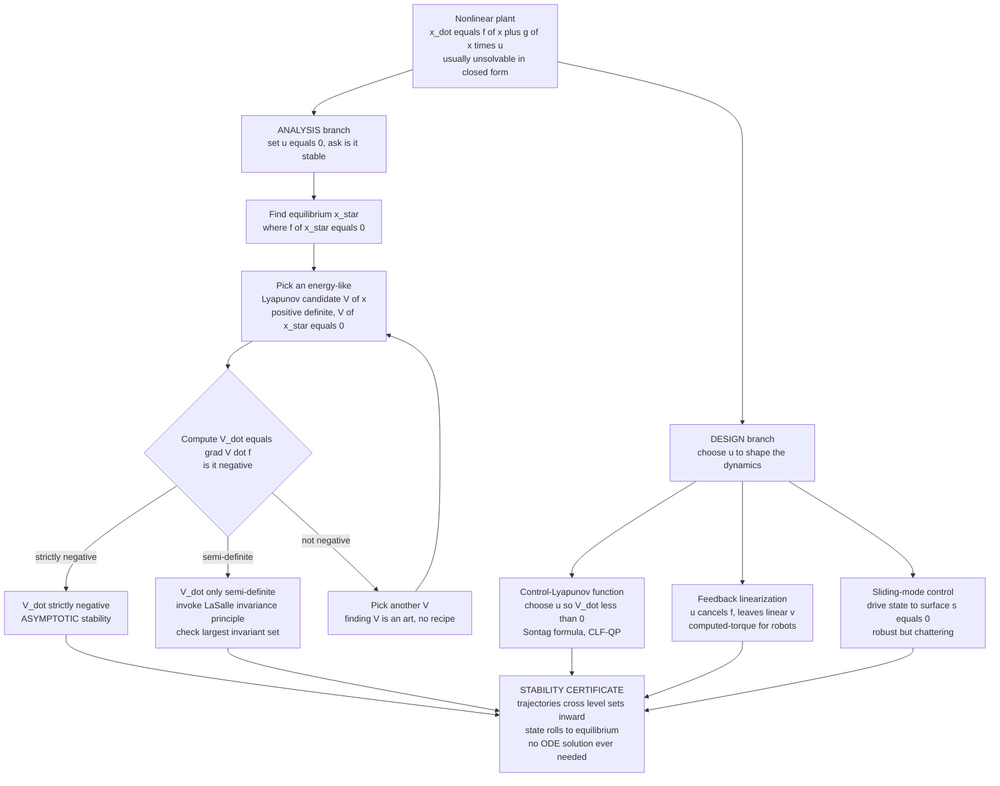

# 🎯 Nonlinear Control and Lyapunov Stability

> [!abstract] TL;DR
> Real robots, rockets, and power grids are **nonlinear** — a swinging arm's inertia and gravity load change with its pose, a pendulum's restoring torque is $\sin\theta$ not $\theta$ — and linear control only works in a small neighborhood of one operating point. The trouble is that the nonlinear differential equations $\dot{\mathbf{x}} = \mathbf{f}(\mathbf{x})$ usually **cannot be solved in closed form**, so we cannot inspect the trajectories to see whether the system settles or blows up. **Lyapunov's direct method** is the escape hatch: if you can find a scalar, **energy-like function** $V(\mathbf{x})$ that is **positive** everywhere except zero at the equilibrium, and whose **rate of change $\dot V$ is always negative** along the motion, then the "energy" can only drain away — the state is *forced* to roll downhill to equilibrium — and you have **proven stability without ever solving the ODE**. The same idea flips into a *design* tool: a **control-Lyapunov function** picks the control input $u$ that makes $\dot V < 0$; **feedback linearization** (computed torque) cancels the nonlinearity outright to expose clean linear dynamics; **sliding-mode** and **backstepping** and **passivity-based** control build robust stabilizers around the same certificate. This is how we *certify* that a machine will not fly apart.

---

## Intuition

**Analogy — the marble in the bowl.** Drop a marble anywhere inside a round bowl. You do not need to solve any equation of motion — you do not need to know its exact bouncing, rolling path — to be *certain* it will end up at rest at the bottom. Why are you certain? Because the marble's **height** (its potential energy) can only ever *decrease* as it rolls, friction bleeds off its speed, and there is a single lowest point where it can finally come to rest. Height is a quantity that (i) is smallest exactly at the resting point, (ii) is positive everywhere else, and (iii) only ever goes *down*. Those three facts alone *guarantee* the marble settles, no trajectory-solving required.

**Lyapunov's genius** was realizing that stability of *any* system can be proven the same way. Invent an abstract "height" — an **energy-like function $V(\mathbf{x})$** of the system's state — that is bowl-shaped around the equilibrium ($V>0$ away from it, $V=0$ at it), and then show that along the system's actual motion this quantity **always decreases** ($\dot V < 0$). If you can, you have shown the state is trapped in an ever-shrinking bowl and *must* drain to the bottom — the equilibrium is stable — **even though the underlying nonlinear equations are unsolvable**. And once you can *test* stability with a $V$, you can *design* for it: choose the control input $u$ precisely so that $\dot V$ is forced negative. That single leap — from *solving* dynamics to *certifying* them with an energy argument — is why we can promise that a legged robot, a launch vehicle, or a continent-spanning power grid will converge to its operating point instead of tearing itself apart.

---

## How It Works

### Core Mechanics

1. **Why nonlinear at all.** A real plant is $\dot{\mathbf{x}} = \mathbf{f}(\mathbf{x}) + \mathbf{g}(\mathbf{x})\,u$ with $\mathbf{f}$ genuinely nonlinear: pendulum torque $\propto \sin\theta$, robot inertia $M(\mathbf{q})$ changing with configuration, aerodynamic drag $\propto v^2$. **Linearizing** about one operating point $\mathbf{x}^\star$ gives $\dot{\mathbf{x}} \approx A\,\delta\mathbf{x}$ and lets you use all of linear control — but *only in a small neighborhood*. Move far from $\mathbf{x}^\star$ (a fast swing, a large disturbance) and the linear model lies. Nonlinear phenomena that linear analysis simply cannot represent — **multiple equilibria**, **limit cycles**, **finite-escape-time blow-up**, **chaos** — demand nonlinear tools.

2. **Equilibria and phase portraits.** An **equilibrium** $\mathbf{x}^\star$ satisfies $\mathbf{f}(\mathbf{x}^\star)=\mathbf{0}$: leave the system there and it stays. Nonlinear systems can have *many* (a pendulum: hanging-down *stable*, standing-up *unstable*). The **phase portrait** — trajectories drawn in state space $(\mathbf{x})$ — is the qualitative picture: stable equilibria are sinks that pull trajectories in, unstable ones are saddles/sources that repel them.

3. **Lyapunov's indirect (linearization) method.** The *easy but local* test: linearize at $\mathbf{x}^\star$, compute the eigenvalues of the Jacobian $A = \partial \mathbf{f}/\partial \mathbf{x}$. If **all eigenvalues have negative real part**, $\mathbf{x}^\star$ is locally asymptotically stable; if **any** has positive real part, it is unstable. Silent on the boundary (eigenvalues on the imaginary axis) and it says nothing about *how far* the guarantee reaches.

4. **Lyapunov's direct method — the certificate.** The *powerful, global-capable* test that needs **no solution of the ODE**. Find a scalar $V(\mathbf{x})$ that is:
   - **Positive definite:** $V(\mathbf{x}^\star)=0$ and $V(\mathbf{x})>0$ for all $\mathbf{x}\neq\mathbf{x}^\star$ (the bowl shape).
   - **Decreasing along trajectories:** its time derivative *along the flow*, $\dot V = \nabla V(\mathbf{x})\cdot \mathbf{f}(\mathbf{x})$, satisfies $\dot V \le 0$.

   Then $\mathbf{x}^\star$ is **stable** (the state cannot leave a sublevel set $\{V \le c\}$). If moreover $\dot V < 0$ (**negative definite**) for $\mathbf{x}\neq\mathbf{x}^\star$, it is **asymptotically stable** — the state actually *converges* to $\mathbf{x}^\star$. The masterstroke: $\dot V = \nabla V \cdot \mathbf{f}$ is computed *directly from the vector field*, never from a solved trajectory.

5. **Grades of stability.** **Stable (i.s.L.)** — stays near if it starts near. **Asymptotically stable** — additionally converges. **Exponentially stable** — converges at least as fast as $\|\mathbf{x}(t)\| \le k\,e^{-\lambda t}\|\mathbf{x}(0)\|$ (the gold standard; provable when $c_1\|\mathbf{x}\|^2 \le V \le c_2\|\mathbf{x}\|^2$ and $\dot V \le -c_3\|\mathbf{x}\|^2$). **Global** — the guarantee holds from *any* start (needs $V$ **radially unbounded**, $V\to\infty$ as $\|\mathbf{x}\|\to\infty$).

6. **LaSalle's invariance principle — rescuing the non-strict case.** Often the natural energy gives only $\dot V \le 0$, with $\dot V = 0$ on a whole *set* (e.g. a damped pendulum where $\dot V \propto -\dot\theta^2$ vanishes on the entire zero-velocity line). **LaSalle** says: the system converges to the **largest invariant set** contained in $\{\dot V = 0\}$. Check what the dynamics *do* on that set; if the only trajectory that can *stay* there is the equilibrium itself, you still get asymptotic stability — even though $\dot V$ was only negative *semi*-definite.

7. **Regions of attraction.** For a *locally* stable equilibrium, the **region of attraction** is the set of initial states that actually converge to it. A sublevel set $\{V \le c\}$ that lies inside the region where $\dot V < 0$ is a **certified (conservative) estimate** of it — a guaranteed safe basin.

8. **From analysis to design.** Turn the test into a synthesizer:
   - **Control-Lyapunov Function (CLF).** Propose $V$; the system is stabilizable if for every $\mathbf{x}$ there exists a $u$ making $\dot V = \nabla V\cdot(\mathbf{f}+\mathbf{g}u) < 0$. **Sontag's formula** hands you an explicit such $u$; today a **CLF-QP** solves for the minimum-effort $u$ that keeps $\dot V \le -\gamma(V)$ at every timestep.
   - **Feedback linearization / computed torque.** If you can *cancel* the nonlinearity, do it: choose $u = \mathbf{g}(\mathbf{x})^{-1}\big(-\mathbf{f}(\mathbf{x}) + \mathbf{v}\big)$ so the plant becomes the trivially-linear $\dot{\mathbf{x}} = \mathbf{v}$; then design $\mathbf{v}$ with any linear method. For robots this is exactly **computed-torque control**: $\boldsymbol\tau = M(\mathbf{q})\mathbf{a} + C\dot{\mathbf{q}} + \mathbf{g}(\mathbf{q})$ collapses the coupled nonlinear arm to decoupled linear error dynamics.
   - **Backstepping.** Recursively build a $V$ (and the control) for systems in cascade/strict-feedback form, treating each state's "virtual control" as a setpoint for the next — a constructive CLF factory.
   - **Sliding-mode control.** Define a **sliding surface** $s(\mathbf{x})=0$ on which the error dies, then use $V=\tfrac12 s^2$ with a *discontinuous* $u = -k\,\text{sgn}(s)$ that forces $\dot V = s\dot s < 0$ from *any* start — a very **robust** stabilizer whose price is **chattering**.
   - **Passivity-based control.** Exploit the plant's own energy structure (e.g. the robot's skew-symmetry $\dot M - 2C$): shape the closed-loop energy so the natural stored energy *is* the Lyapunov function, yielding controllers robust by construction.
   - **Gain scheduling.** A pragmatic bridge: design linear controllers at many operating points and interpolate — nonlinear coverage stitched from local linear designs.

### Flow / Architecture



---

## Key Concepts

### 🟢 Secondary — the plain-language picture

- **Nonlinear means "the rules change as you move."** A pendulum near the bottom acts like a simple spring, but flip it near the top and it behaves completely differently. One fixed linear controller cannot understand both regimes.
- **You cannot always solve the equations.** For most real systems there is no formula for the trajectory. So we need a way to know the outcome *without* the formula.
- **The energy trick.** Find a quantity — think "height" or "energy" — that is lowest at the target and always drips away over time. If it only ever decreases, the system *must* slide to the target. That is a stability proof with no trajectory required.
- **Two equilibria, one stable.** A ball at the bottom of a valley returns if nudged (stable); balanced on a hilltop it rolls away (unstable). Same math, opposite behavior.
- **Control = tilting the bowl.** If the natural energy does not drain, a controller can *push* to make it drain — that is nonlinear control design.

### 🟡 Undergraduate — the working machinery

- **The direct method, precisely.** $\mathbf{x}^\star=\mathbf 0$ is stable if there is $V$ with $V(\mathbf 0)=0$, $V(\mathbf x)>0$ for $\mathbf x\neq\mathbf 0$, and $\dot V(\mathbf x)=\nabla V\cdot \mathbf f(\mathbf x)\le 0$; asymptotically stable if $\dot V<0$. No integration of $\dot{\mathbf x}=\mathbf f$ anywhere in the argument.
- **Quadratic candidates.** The default guess is $V=\mathbf x^\top P\mathbf x$ with $P=P^\top\succ 0$ (positive-definite). For a *linear* system $\dot{\mathbf x}=A\mathbf x$ this reduces to the **Lyapunov equation** $A^\top P + PA = -Q$ ($Q\succ 0$): solvable for $P\succ 0$ **iff** $A$ is stable — the direct method *contains* the eigenvalue test as a special case.
- **Energy as the natural $V$.** For mechanical systems, total mechanical energy is the obvious candidate; damping makes $\dot V\le 0$ automatically. Passivity generalizes this.
- **Indirect vs direct.** Indirect (linearize, check eigenvalues) is quick but purely local and mute on the imaginary-axis boundary. Direct is harder (you must *find* $V$) but can prove *global* and *exponential* stability and *quantify* the region of attraction.
- **LaSalle in one line.** When $\dot V\le 0$ but not strictly, the system converges to the largest invariant set inside $\{\dot V=0\}$; if that set is just $\{\mathbf 0\}$, you still get asymptotic stability.
- **Feedback linearization, concretely.** With $\dot x = f(x)+g(x)u$ and $g\neq 0$, pick $u=\frac{1}{g(x)}\big(-f(x)+v\big)$ to get $\dot x = v$; then $v=-kx$ (or a PD law) makes the closed loop linear and stable. Requires $g(x)$ invertible and an accurate model.
- **Sliding surface intuition.** Choose $s=\dot e + \lambda e$; on $s=0$ the error obeys $\dot e=-\lambda e$ and decays. The controller's job is only to reach and stay on $s=0$, which a high-authority switching term guarantees despite disturbances.

### 🔴 Graduate — the frontier machinery

- **Converse theorems and construction.** For an (exponentially) stable equilibrium a Lyapunov function *provably exists* — but the theorems are non-constructive. In practice $V$ is found by (i) physical energy, (ii) solving Lyapunov/Riccati equations for the linearization, (iii) **sum-of-squares (SOS)** programming that searches over polynomial $V$ via semidefinite optimization, or (iv) backstepping's recursive construction. **There is no general algorithm** for arbitrary nonlinear $\mathbf f$.
- **Exact feedback linearization theory.** A single-input system is exactly linearizable iff it has **relative degree $n$** (full state), equivalently the involutivity/Frobenius conditions on the distributions spanned by the Lie-bracket fields hold. **Input-output linearization** handles relative degree $r<n$ but leaves $n-r$ **internal (zero) dynamics** that must themselves be stable — the nonlinear analogue of **non-minimum-phase** trouble (RHP zeros).
- **Robustness and the model-dependence of cancellation.** Feedback linearization *cancels* the nonlinearity, so it needs an **exact model**; parameter error leaves residual nonlinear terms that a naive linear outer loop may not tolerate. This motivates **robust** (sliding-mode, min-max, $H_\infty$) and **adaptive** control that estimate uncertainty online rather than assume it away.
- **Sliding mode: order, reaching, chattering.** The reaching condition $s\dot s \le -\eta|s|$ guarantees finite-time hit; on the surface the motion is governed by the (reduced-order) **equivalent control**. Ideal sliding demands infinite switching frequency; real actuators produce **chattering** that excites unmodeled high-frequency dynamics. Cures: boundary-layer/saturation smoothing, **higher-order sliding modes** (super-twisting) that keep robustness while continuity tames chatter.
- **CLF-QP and safety.** Modern control fuses a **control-Lyapunov function** (stability) with a **control-barrier function** (safety/constraints) inside a per-timestep quadratic program: minimize control effort subject to $\dot V \le -\gamma(V)$ and $\dot h \ge -\alpha(h)$. This is the backbone of certified controllers for legged and autonomous systems.
- **Passivity and interconnection.** A passive system stores no more energy than supplied ($\dot V \le u^\top y$). **Passivity-based / energy-shaping** control (IDA-PBC, the robot skew-symmetry property $\dot M - 2C$) yields Lyapunov certificates that survive interconnection — passive-plus-passive stays passive — a compositional route to stability for complex mechanical networks.
- **Contraction analysis.** A differential/incremental cousin: prove that *any two* trajectories converge to each other (a metric contracts) rather than analyzing one equilibrium — powerful for tracking, observers, and time-varying references.

---

## Python Demo

Two experiments on the workhorse nonlinear plant — the **damped pendulum** $\ddot\theta = -\frac{g}{\ell}\sin\theta - \frac{b}{m}\dot\theta + \frac{u}{m\ell^2}$ — make the whole story concrete.

**(a) A visual stability certificate.** With no control, the *hanging-down* equilibrium is stable. We pick the physical **energy** $V(\theta,\dot\theta)=\tfrac12\dot\theta^2 + \frac{g}{\ell}(1-\cos\theta)$ as a Lyapunov function, draw the **phase portrait**, overlay the **level sets** of $V$, and release several trajectories: they spiral *inward*, crossing each contour toward lower energy. Plotting $V(t)$ along one trajectory shows it **decreasing monotonically** — the certificate, seen with your eyes, with no ODE ever solved by hand.

**(b) Nonlinear control beats the linear one.** We ask the pendulum to hold a **horizontal setpoint** $\theta_d=\pi/2$, where gravity torque is *maximal and nonzero*. A **feedback-linearizing (computed-torque)** controller cancels gravity and damping exactly and drives the error to zero; a **pure linear PD** with the *same gains* — ignorant of the nonlinear gravity load — **droops** and settles well short of the target. The controlled Lyapunov function $V=\tfrac12\dot e^2+\tfrac12 K_p e^2$ falls **monotonically to zero** for feedback linearization but stalls at a nonzero floor for PD.

```python
# Nonlinear control & Lyapunov stability on a damped pendulum.
#   theta'' = -(g/l) sin(theta) - (b/m) theta' + u/(m l^2)
# (a) certify stability of the hanging equilibrium with an energy Lyapunov function
# (b) stabilize a horizontal setpoint: feedback linearization vs. a linear PD
import numpy as np
import matplotlib.pyplot as plt

# --- Pendulum parameters (SI) ---
g, l, m, b = 9.81, 1.0, 1.0, 0.30       # gravity, length, mass, viscous damping
J = m * l**2                            # rotational inertia about the pivot

def rk4(f, s, dt):
    """One classical Runge-Kutta 4 step of state s under ds/dt = f(s)."""
    k1 = f(s); k2 = f(s + 0.5*dt*k1); k3 = f(s + 0.5*dt*k2); k4 = f(s + dt*k3)
    return s + (dt/6.0)*(k1 + 2*k2 + 2*k3 + k4)

def simulate(deriv, s0, T=6.0, dt=0.002):
    n = int(T/dt); traj = np.zeros((n+1, 2)); traj[0] = s0
    for i in range(n):
        traj[i+1] = rk4(deriv, traj[i], dt)
    return np.arange(n+1)*dt, traj

# =====================================================================
# (a) STABILITY CERTIFICATE: energy Lyapunov function for the pendulum
# =====================================================================
def V_energy(theta, thd):
    """Energy-like Lyapunov candidate: V > 0 around (0,0), V(0,0) = 0."""
    return 0.5*thd**2 + (g/l)*(1.0 - np.cos(theta))

def f_free(s):
    """Uncontrolled dynamics (u = 0). V_dot = -(b/m) theta_dot^2 <= 0."""
    th, thd = s
    return np.array([thd, -(g/l)*np.sin(th) - (b/m)*thd])

# Trajectories released from several starts -> all spiral inward to (0,0)
starts = [(-2.6, 0.0), (2.6, 0.0), (0.0, 3.0), (0.0, -3.0), (1.8, 2.2), (-1.8, -2.2)]
trajs = [simulate(f_free, np.array(s0), T=12.0)[1] for s0 in starts]

# One trajectory's energy over time: the certificate as a falling curve
t_cert, tr_cert = simulate(f_free, np.array([2.8, 0.5]), T=12.0)
V_cert = V_energy(tr_cert[:, 0], tr_cert[:, 1])

# =====================================================================
# (b) CONTROL DESIGN: hold horizontal setpoint theta_d = pi/2
# =====================================================================
theta_d = np.pi/2
Kp, Kd = 16.0, 8.0                      # Kd^2 = 4 Kp -> critically damped error

def deriv_feedback_lin(s):
    """Feedback linearization / computed torque: cancel f, impose theta'' = v."""
    th, thd = s
    v  = -Kp*(th - theta_d) - Kd*thd
    u  = J*((g/l)*np.sin(th) + (b/m)*thd + v)   # cancels gravity AND damping
    thdd = -(g/l)*np.sin(th) - (b/m)*thd + u/J
    return np.array([thd, thdd])

def deriv_linear_pd(s):
    """Naive linear PD on torque: same gains, but blind to the nonlinear gravity load."""
    th, thd = s
    u = -Kp*(th - theta_d) - Kd*thd
    thdd = -(g/l)*np.sin(th) - (b/m)*thd + u/J
    return np.array([thd, thdd])

s0 = np.array([0.05, 0.0])                       # start hanging near the bottom
t_fl, tr_fl = simulate(deriv_feedback_lin, s0, T=6.0)
t_pd, tr_pd = simulate(deriv_linear_pd,   s0, T=6.0)

def V_ctrl(traj):
    """Controlled Lyapunov function V = 1/2 e_dot^2 + 1/2 Kp e^2, e = theta - theta_d."""
    e, ed = traj[:, 0] - theta_d, traj[:, 1]
    return 0.5*ed**2 + 0.5*Kp*e**2

V_fl, V_pd = V_ctrl(tr_fl), V_ctrl(tr_pd)
print(f"(b) feedback-linearization final theta = {tr_fl[-1,0]:.4f} rad "
      f"(target {theta_d:.4f})  -> on target")
print(f"(b) linear-PD           final theta = {tr_pd[-1,0]:.4f} rad "
      f"(target {theta_d:.4f})  -> droops below by "
      f"{np.degrees(theta_d - tr_pd[-1,0]):.1f} deg")

# ---------------------------- Plots ----------------------------
fig, ax = plt.subplots(2, 2, figsize=(13, 10))

# (a) Phase portrait + level sets of V + inward-spiralling trajectories
TH, THD = np.meshgrid(np.linspace(-3.2, 3.2, 26), np.linspace(-3.6, 3.6, 26))
U = THD
W = -(g/l)*np.sin(TH) - (b/m)*THD
ax[0,0].streamplot(TH, THD, U, W, density=1.1, color='0.75', linewidth=0.6, arrowsize=0.8)
levels = V_energy(np.linspace(0, 3.0, 9), 0*np.linspace(0, 3.0, 9))
cs = ax[0,0].contour(TH, THD, V_energy(TH, THD), levels=levels,
                     cmap='viridis', linewidths=1.2)
ax[0,0].clabel(cs, inline=True, fontsize=7, fmt="%.1f")
for tr in trajs:
    ax[0,0].plot(tr[:,0], tr[:,1], lw=1.3)
ax[0,0].plot(0, 0, 'k*', ms=14, label='stable equilibrium')
ax[0,0].set(title="(a) Phase portrait + Lyapunov level sets:\ntrajectories cross contours INWARD (V decreasing)",
            xlabel="angle theta (rad)", ylabel="angular velocity (rad/s)")
ax[0,0].legend(loc='upper right'); ax[0,0].set_xlim(-3.2,3.2); ax[0,0].set_ylim(-3.6,3.6)

# (a) The certificate as a curve: V(t) monotonically decreasing
ax[0,1].plot(t_cert, V_cert, color='seagreen', lw=2)
ax[0,1].set(title="(a) Certificate: V(t) drains monotonically to 0\n(no ODE solution needed to know this)",
            xlabel="time (s)", ylabel="Lyapunov energy V")
ax[0,1].grid(alpha=.3)

# (b) theta(t): feedback linearization hits target, linear PD droops
ax[1,0].axhline(theta_d, ls='--', color='k', label='setpoint theta_d = pi/2')
ax[1,0].plot(t_fl, tr_fl[:,0], color='#1f77b4', lw=2, label='feedback linearization (computed torque)')
ax[1,0].plot(t_pd, tr_pd[:,0], color='#d62728', lw=2, label='linear PD (blind to gravity)')
ax[1,0].set(title="(b) Holding a horizontal setpoint\nnonlinear control reaches it, linear PD droops",
            xlabel="time (s)", ylabel="angle theta (rad)")
ax[1,0].legend(loc='lower right'); ax[1,0].grid(alpha=.3)

# (b) Controlled Lyapunov function: monotone to 0 vs. stuck at a floor
ax[1,1].plot(t_fl, V_fl, color='#1f77b4', lw=2, label='feedback linearization: V -> 0')
ax[1,1].plot(t_pd, V_pd, color='#d62728', lw=2, label='linear PD: V stalls above 0 (droop)')
ax[1,1].set(title="(b) Control-Lyapunov function along trajectories",
            xlabel="time (s)", ylabel="Lyapunov function V = 1/2 e_dot^2 + 1/2 Kp e^2")
ax[1,1].legend(loc='upper right'); ax[1,1].grid(alpha=.3)

plt.tight_layout(); plt.show()
```

**What the four panels show.** (a) The **phase portrait** of the free pendulum shows every trajectory spiraling into the hanging equilibrium; overlaid **level sets of $V$** (nested closed curves) are crossed strictly *inward* — the state always moves to lower energy — and $V(t)$ is a clean **monotone decay**. That falling curve *is* the stability proof: because $V\ge 0$ and only ever decreases, the state has nowhere to go but the bottom, and we never solved the nonlinear ODE analytically to know it. (b) Asked to hold a horizontal setpoint, the **feedback-linearizing** controller cancels the gravity load exactly and lands on $\pi/2$, its Lyapunov function sliding monotonically to zero; the **linear PD** with identical gains, ignorant of the nonlinear gravity torque, settles well *below* target (a large steady-state droop) and its $V$ stalls at a nonzero floor — a compact demonstration of why nonlinear systems need nonlinear control, and the very mechanism behind computed-torque control of robot arms.

---

## Real-World Applications

- **Robot manipulators — computed-torque control.** Industrial and collaborative arms (KUKA, ABB, Fanuc, Universal Robots) run **feedback linearization** of the manipulator equation $M(\mathbf q)\ddot{\mathbf q}+C\dot{\mathbf q}+\mathbf g=\boldsymbol\tau$: commanding $\boldsymbol\tau = M\mathbf a + C\dot{\mathbf q}+\mathbf g$ cancels the coupled nonlinear dynamics and leaves decoupled, exponentially stable linear error dynamics — the demo's part (b) at industrial scale.
- **Legged and dynamic robots.** Boston Dynamics Atlas/Spot, MIT Cheetah, and ANYmal are stabilized with **control-Lyapunov / control-barrier QPs** and passivity-based whole-body controllers that certify balance and gait convergence under contact constraints in real time.
- **Aerospace and launch vehicles.** Rocket ascent, missile guidance, and spacecraft attitude control lean on Lyapunov redesign and **sliding-mode** laws for robustness to aerodynamic and mass-property uncertainty — a Lyapunov certificate is, quite literally, the promise that the vehicle will not tumble.
- **Power grids.** **Transient stability** of interconnected generators is proven with **energy (Lyapunov) functions**: after a fault, if the grid's kinetic-plus-potential energy stays within a critical sublevel set, the generators re-synchronize instead of losing lock — a continent-scale marble-in-a-bowl argument.
- **Automotive and process control.** Electronic stability control, traction control, engine air-fuel, and chemical-reactor temperature loops use **feedback linearization**, **gain scheduling**, and sliding-mode observers to stay stable across wildly varying operating regimes a single linear controller could never cover.
- **Adaptive flight and marine control.** Aircraft with changing mass/aerodynamics and ships/AUVs facing currents combine Lyapunov-based **adaptive** and **backstepping** designs so the stability certificate holds *while* parameters are being learned online.

---

## Common Pitfalls

- **Finding $V$ is an art, not an algorithm.** For a general nonlinear $\mathbf f$ there is **no systematic method** to construct a Lyapunov function. Physical energy, quadratic forms $\mathbf x^\top P\mathbf x$ from the linearization, backstepping, and SOS programming are the practical toolbox — but a *failed* search proves nothing (a bad guess giving $\dot V \not< 0$ does **not** mean the system is unstable). Do not read a negative result as a stability verdict.
- **Confusing local with global.** A quadratic $V$ that works near the equilibrium may fail far away; unless $V$ is **radially unbounded** *and* $\dot V<0$ everywhere, the guarantee is only local. Always state (and, via a sublevel set, *estimate*) the **region of attraction** rather than implying the whole state space.
- **Forgetting LaSalle when $\dot V$ is only semi-definite.** Energy-based candidates frequently give $\dot V \le 0$ with equality on a set (a damped system where $\dot V \propto -\dot\theta^2$). Claiming *asymptotic* stability then requires the **LaSalle invariance principle** — you must check that the only invariant motion inside $\{\dot V=0\}$ is the equilibrium. Skipping this over-claims convergence.
- **Feedback linearization cancels *useful* nonlinearity and demands an exact model.** Canceling $\mathbf f$ throws away nonlinear damping or stabilizing structure that could have helped, and the cancellation is only as good as the model — parameter error leaves residual nonlinear terms. Worse, **input-output linearization** can hide unstable **internal (zero) dynamics** (the non-minimum-phase trap): the visible output behaves while an unobserved mode diverges. Always verify the internal dynamics are stable, and prefer robust/adaptive augmentation over blind cancellation.
- **Chattering in sliding-mode control.** The idealized discontinuous switching $u=-k\,\text{sgn}(s)$ that makes sliding mode so robust cannot switch infinitely fast on real hardware; the result is **chattering** that heats actuators and excites unmodeled high-frequency dynamics. Mitigate with a boundary layer (saturation) or **higher-order / super-twisting** sliding modes — but know you are trading a little robustness for smoothness.
- **Assuming the linearization tells the whole story.** Lyapunov's *indirect* method is silent when the Jacobian has eigenvalues on the imaginary axis, and it never quantifies *how far* the guarantee reaches. Center-manifold or direct-method analysis is required exactly where linear intuition is least trustworthy.

---

## Related Concepts

This note opens the **Modern and Optimal Control** section. It stands directly on the plant model of *Robot Dynamics and Equations of Motion* — the manipulator equation whose skew-symmetry $\dot M - 2C$ is the passivity property that makes Lyapunov proofs work, and whose inversion *is* computed-torque feedback linearization; it generalizes the linear machinery of *State-Space Models in Control*; it is the stability foundation beneath *LQR Optimal Control* (whose cost-to-go is itself a Lyapunov function); it hands the uncertainty problem to *Adaptive and Robust Control* (which certifies stability *while* estimating unknown parameters); and it is the workhorse for stabilizing *Legged and Mobile Robot Locomotion* through contact.

- [[Feedback_Control_Fundamentals]] — the closing-the-loop logic this note extends from linear plants to genuinely nonlinear ones; the "too much gain destabilizes" worry becomes the Lyapunov certificate.
- [[PID_Control]] — the pure linear PD of the demo is PID without integral action; gravity compensation (feedback linearization) is what a raw PD lacks.
- [[Stability_Routh_Hurwitz_and_Root_Locus]] — the *linear* stability tests (pole locations) that Lyapunov's direct method both contains (via $A^\top P+PA=-Q$) and surpasses for nonlinear systems.
- [[Lagrangian_Mechanics]] — supplies the energy functions ($T-V$) that become the most natural Lyapunov candidates; robot dynamics is Lagrangian mechanics, so its energy *is* the certificate.
- [[Dynamical_Systems_and_Attractors]] — equilibria, stable/unstable manifolds, and phase portraits are the geometric language of everything here; a stable equilibrium is an attractor.
- [[Nonlinearity_and_Feedback]] — why real plants resist linear analysis in the first place, motivating the whole nonlinear-control enterprise.
- [[Chaos_Theory_and_Sensitive_Dependence]] — the uncontrolled inverted pendulum / double pendulum is chaotic; nonlinear control is precisely the discipline of taming such sensitivity into convergence.
- [[Bifurcations_and_Tipping_Points]] — as a parameter varies, equilibria appear, vanish, or change stability; Lyapunov analysis tracks *when* a certified basin is lost.
- [[Systems_of_ODEs]] — $\dot{\mathbf x}=\mathbf f(\mathbf x)$ is a coupled nonlinear ODE system; the direct method's power is proving its behavior without integrating it.
- [[Eigenvalues_and_Eigenvectors]] — the Jacobian eigenvalues drive Lyapunov's *indirect* method and the linearized region-of-attraction estimate.
- [[Chaos_and_Nonlinear_Dynamics_Numerically]] — the numerical phase-portrait and integration techniques used in the demo to *visualize* the certificate.

---

## Review Questions

### 🟢 Secondary
1. Using the marble-in-a-bowl picture, explain how you can be sure a system reaches its resting point *without* tracing its exact path. Which three properties must the "height" quantity have?

### 🟡 Undergraduate
2. State the two conditions a function $V(\mathbf x)$ must satisfy for the direct method to prove asymptotic stability, and explain why the derivative $\dot V=\nabla V\cdot\mathbf f$ can be computed **without** ever solving the differential equation.
3. In the demo, a linear PD controller with the *same gains* as the feedback-linearizing controller fails to reach the horizontal setpoint and droops below it. Explain physically what the feedback-linearizing controller adds that the PD lacks, and connect this to computed-torque control of a robot arm.
4. A damped pendulum's energy gives $\dot V \le 0$ but with $\dot V = 0$ all along the zero-velocity line. Why does this *not* immediately prove asymptotic stability, and which principle lets you recover it?

### 🔴 Graduate
5. Feedback linearization cancels the plant nonlinearity to expose linear dynamics. Give two distinct reasons this can be dangerous in practice — one about model accuracy, one about internal/zero dynamics — and describe how sliding-mode or adaptive control addresses the first.
6. You are handed a nonlinear system and cannot find a Lyapunov function after several quadratic and energy-based attempts. What can and cannot you conclude, and what constructive routes (backstepping, SOS programming, converse theorems) would you pursue next?
7. Explain how the LQR cost-to-go $\mathbf x^\top P\mathbf x$ doubles as a Lyapunov function for the closed loop, and what the Lyapunov equation $A^\top P+PA=-Q$ reveals about the relationship between optimality and stability.

---

## Sources

- Khalil, H. K. — *Nonlinear Systems*, 3rd ed. (Prentice Hall, 2002) — the standard graduate reference on Lyapunov theory, LaSalle, feedback linearization, and sliding modes.
- Slotine, J.-J. E. & Li, W. — *Applied Nonlinear Control* (Prentice Hall, 1991) — the classic engineer's treatment of Lyapunov design, sliding-mode, and adaptive control.
- Sastry, S. — *Nonlinear Systems: Analysis, Stability, and Control* (Springer, 1999) — geometric nonlinear control, exact linearization, and zero dynamics.
- Isidori, A. — *Nonlinear Control Systems*, 3rd ed. (Springer, 1995) — the definitive geometric theory of feedback linearization and relative degree.
- Spong, M. W., Hutchinson, S. & Vidyasagar, M. — *Robot Modeling and Control*, 2nd ed. (Wiley, 2020), Ch. 8–9 — computed-torque, passivity-based, and Lyapunov-based robot control.

---

#robotics #nonlinear-control #lyapunov-stability #feedback-linearization #sliding-mode
