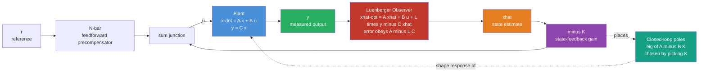

# 🎯 Pole Placement and Full-State Feedback

> [!abstract] TL;DR
> A linear system's behavior is decided by its **poles** — the eigenvalues of its dynamics matrix $A$, which set whether it settles gently, rings, or diverges. **Full-state feedback** $u = -Kx$ feeds every internal state back through a gain matrix, turning the open-loop dynamics $A$ into closed-loop dynamics $A - BK$. If the pair $(A,B)$ is **controllable**, you can place those closed-loop poles **anywhere** in the complex plane by choosing $K$ — that is *pole placement*. When you cannot measure the full state, a **Luenberger observer** reconstructs an estimate $\hat{x}$ from the output, and the **separation principle** lets you design the controller and observer independently.

---

## Intuition

**Analogy — retuning a suspension by hand.** Think of a wobbly system as a car on a set of springs and shocks. Its "personality" — does it float and sway for ages, bounce sharply, or shudder uncontrollably — is dictated entirely by its **poles**, the natural *modes* baked into its physics. Poles far to the left of the complex plane die out fast (a stiff, well-damped ride); poles near the imaginary axis linger and oscillate (a boat-like float); a pole in the right half-plane means the car shakes itself apart. Normally these modes are fixed by the hardware. But now imagine you have a **knob for every internal variable** — position, velocity, tilt, tilt-rate — and you can add any weighted combination of them back into the actuator. That is full-state feedback: by feeding the whole state back through carefully chosen gains $K$, you can literally **drag the poles** to wherever you want them, redesigning the system's character from sluggish to snappy without touching the hardware.

**Pole placement is choosing where to nail those poles.** You pick target locations in the complex plane — how fast, how damped — and solve for the single gain matrix $K$ that puts the closed-loop eigenvalues exactly there. The catch, and the whole reason controllability matters, is that the actuator has to be able to *reach* every mode; if some internal motion is invisible to your input, no amount of feedback can move its pole.

---

## How It Works

### Core mechanics

1. **Start with the plant.** In state-space form the system is $\dot{x} = Ax + Bu$, where $x \in \mathbb{R}^n$ is the state, $u$ the control input, and the open-loop poles are $\operatorname{eig}(A)$.
2. **Close the loop.** Apply full-state feedback $u = -Kx$. Substituting gives $\dot{x} = Ax + B(-Kx) = (A - BK)\,x$. The closed-loop dynamics matrix is now $A_{cl} = A - BK$, and the new poles are $\operatorname{eig}(A - BK)$.
3. **Choose the poles.** Pick a desired characteristic polynomial $\phi_{des}(\lambda) = \prod_i (\lambda - p_i)$ from your target pole set $\{p_i\}$. Solve for $K$ so that $\det(\lambda I - (A - BK)) = \phi_{des}(\lambda)$.
4. **Ackermann's formula (SISO).** $K = e_n^{\top}\,\mathcal{W}_c^{-1}\,\phi_{des}(A)$, where $e_n^{\top} = [\,0\ \cdots\ 0\ 1\,]$, $\mathcal{W}_c = [\,B\ \ AB\ \ \cdots\ \ A^{n-1}B\,]$ is the controllability matrix, and $\phi_{des}(A)$ is the desired polynomial evaluated at the matrix $A$ (via Cayley–Hamilton). The formula only works if $\mathcal{W}_c$ is invertible — i.e. the system is controllable.
5. **When the state is hidden.** If you only measure $y = Cx$, build a **Luenberger observer** $\dot{\hat{x}} = A\hat{x} + Bu + L(y - C\hat{x})$. The estimation error $e = x - \hat{x}$ obeys $\dot{e} = (A - LC)e$, so placing the eigenvalues of $A - LC$ (via the same algorithm on the dual pair $(A^{\top}, C^{\top})$, which requires **observability**) makes $\hat{x} \to x$. Then feed back the estimate: $u = -K\hat{x}$.
6. **Separation principle.** The combined output-feedback system has poles $\operatorname{eig}(A - BK)\,\cup\,\operatorname{eig}(A - LC)$, so controller gain $K$ and observer gain $L$ can be designed **completely independently**.

### Flow / Architecture



---

## Key Concepts

### 🟢 Secondary — the plain-language picture

- **Poles are a system's natural modes.** Every spring, motor, or pendulum has built-in ways it likes to move. Poles far left = fast, calm settling; poles near the axis = long ringing; a pole on the right = it blows up.
- **A knob for every state.** Full-state feedback means you read *all* the internal variables and blend them back into the actuator through gains $K$. More information than just watching the output.
- **Dragging the poles.** Choosing $K$ moves the poles around the complex plane. That is how you turn a sluggish or unstable machine into a snappy, stable one — in software, not hardware.
- **Pole placement = picking the targets.** You decide where the poles *should* be, then solve for the gains that put them there.

### 🟡 Undergraduate — the working machinery

- **Closed-loop matrix $A - BK$.** Feedback $u = -Kx$ rewrites the dynamics from $\dot{x} = Ax + Bu$ to $\dot{x} = (A - BK)x$. The design problem is: choose $K$ so $\operatorname{eig}(A - BK)$ equals your target set.
- **Controllability is the gate.** You can assign the closed-loop poles to *any* self-conjugate set **if and only if** $(A,B)$ is controllable — equivalently, the controllability matrix $\mathcal{W}_c = [\,B\ AB\ \cdots\ A^{n-1}B\,]$ has full rank. Uncontrollable modes stay stuck wherever they were.
- **Ackermann / characteristic-polynomial matching.** For single-input systems, Ackermann's formula gives $K$ in closed form. Equivalently, expand $\det(\lambda I - A + BK)$ symbolically and match coefficients to your desired $\phi_{des}(\lambda)$.
- **Pole-location trade-offs.** Pushing poles further left buys faster settling but demands **larger gains**, which means bigger control effort, actuator saturation, and amplified sensor noise. Placing them too close together or all on the real axis can also hurt transient shape. Damping (real-to-imaginary ratio) controls overshoot.
- **Reference tracking.** Feedback alone regulates to zero. To follow a setpoint $r$ you add a feedforward **precompensator** $\bar{N}$ so that $u = -Kx + \bar{N}r$ gives unity DC gain, driving the output to $r$ in steady state.

### 🔴 Graduate — the frontier machinery

- **The Luenberger observer.** When only $y = Cx$ is measured, the estimator $\dot{\hat{x}} = A\hat{x} + Bu + L(y - C\hat{x})$ reconstructs the full state. Its error dynamics $\dot{e} = (A - LC)e$ converge iff $(A,C)$ is **observable**, and you place $\operatorname{eig}(A - LC)$ by the same pole-placement algorithm applied to the dual $(A^{\top}, C^{\top})$. Rule of thumb: observer poles 3–5× faster than controller poles, but not *so* fast that they amplify measurement noise.
- **Output feedback = observer + state feedback.** Since the true state is unavailable, feed back the estimate: $u = -K\hat{x}$. This dynamic compensator is what you actually implement in hardware.
- **Separation principle.** The closed-loop eigenvalues of the combined observer-plus-controller factor cleanly into $\operatorname{eig}(A - BK)$ and $\operatorname{eig}(A - LC)$. You design $K$ and $L$ separately and the guarantees still hold — a huge simplification. (The optimal-estimation counterpart, where $L$ minimizes error covariance under noise, is **Kalman filtering and state estimation**, a sibling note.)
- **Integral action for zero steady-state error.** Augment the state with $\dot{x}_I = r - y$ and place poles on the augmented pair $(A_{aug}, B_{aug})$. The extra integrator state guarantees zero offset for step references and rejects constant disturbances — the state-space cousin of the "I" term in PID.
- **Robustness caveat.** Pure pole placement gives **no guaranteed gain or phase margin**; aggressive placements can be dangerously fragile to model error. This is exactly the gap that **LQR optimal control** closes — it computes $K$ by minimizing a quadratic cost and comes with provable margins — which is why practitioners often prefer LQR over hand-placed poles for critical systems.

---

## Python Demo

Pole placement on the **inverted-pendulum-on-a-cart**, linearized about the upright (unstable) equilibrium — a canonical controllable, unstable robotics plant. We implement **Ackermann's formula in pure NumPy**, design two feedback gains for two different desired pole sets (**slow/gently-damped** vs **fast/aggressive**), verify that $\operatorname{eig}(A - BK)$ matches the targets, then simulate the closed loop from a tipped initial condition to watch it stabilize.

```python
# Pole placement + full-state feedback on a cart-pole linearized upright.
# State x = [cart position p, cart velocity p_dot, pole angle theta, pole rate theta_dot].
# Plant is OPEN-LOOP UNSTABLE (a right-half-plane pole from the falling pendulum).
# We compute K by Ackermann's formula so that eig(A - B K) = chosen desired poles,
# then simulate x' = (A - B K) x from a disturbance for two pole choices.
import numpy as np
import matplotlib.pyplot as plt

# --- Cart-pole linearization about the upright equilibrium ---
M, m, l, g = 1.0, 0.1, 0.5, 9.81       # cart mass, pole mass, pole half-length, gravity
A = np.array([[0.0, 1.0, 0.0,              0.0],
              [0.0, 0.0, -m * g / M,       0.0],
              [0.0, 0.0, 0.0,              1.0],
              [0.0, 0.0, (M + m) * g / (M * l), 0.0]])
B = np.array([[0.0],
              [1.0 / M],
              [0.0],
              [-1.0 / (M * l)]])
n = A.shape[0]

def ackermann(A, B, desired_poles):
    """SISO pole placement: return K (1 x n) so that eig(A - B K) = desired_poles."""
    Wc = np.hstack([np.linalg.matrix_power(A, i) @ B for i in range(n)])  # controllability matrix
    assert abs(np.linalg.det(Wc)) > 1e-9, "System is NOT controllable -- cannot place poles!"
    coeffs = np.poly(desired_poles)                    # desired char. poly, highest degree first
    phi = sum(c * np.linalg.matrix_power(A, n - i) for i, c in enumerate(coeffs))  # phi_des(A)
    e_n = np.zeros((1, n)); e_n[0, -1] = 1.0           # last standard basis row
    return np.real(e_n @ np.linalg.inv(Wc) @ phi)

def rk4_sim(Acl, x0, dt, steps):
    """Integrate the autonomous linear closed loop x' = Acl x with RK4."""
    xs = np.zeros((steps, x0.size)); x = x0.astype(float).copy()
    for k in range(steps):
        xs[k] = x
        k1 = Acl @ x; k2 = Acl @ (x + 0.5 * dt * k1)
        k3 = Acl @ (x + 0.5 * dt * k2); k4 = Acl @ (x + dt * k3)
        x = x + (dt / 6.0) * (k1 + 2 * k2 + 2 * k3 + k4)
    return xs

# --- Two pole choices: gentle/damped vs fast/aggressive ---
slow_poles = np.array([-1 + 1j, -1 - 1j, -2 + 1j, -2 - 1j])     # relaxed settling
fast_poles = np.array([-4 + 4j, -4 - 4j, -6 + 2j, -6 - 2j])     # snappy, far-left

designs = {"SLOW / damped": slow_poles, "FAST / aggressive": fast_poles}
gains = {name: ackermann(A, B, poles) for name, poles in designs.items()}

print("Open-loop eigenvalues:", np.round(np.linalg.eigvals(A), 3), "<- one is unstable\n")
for name, poles in designs.items():
    K = gains[name]; Acl = A - B @ K
    print(f"{name}")
    print("  desired poles :", np.round(np.sort_complex(poles), 3))
    print("  achieved eig  :", np.round(np.sort_complex(np.linalg.eigvals(Acl)), 3))
    print("  gain K        :", np.round(K.flatten(), 2))
    print("  |K| (effort)  :", round(float(np.linalg.norm(K)), 2), "\n")

# --- Simulate both closed loops from the same tipped initial condition ---
dt, T = 0.005, 6.0
steps = int(T / dt); t = np.linspace(0.0, T, steps)
x0 = np.array([0.0, 0.0, 0.2, 0.0])   # pole tipped 0.2 rad (~11.5 deg), cart at rest at origin

traj = {name: rk4_sim(A - B @ gains[name], x0, dt, steps) for name in designs}
ctrl = {name: -(gains[name] @ traj[name].T).flatten() for name in designs}   # u(t) = -K x(t)

# --- Plot: angle, cart position, control effort, and pole locations ---
colors = {"SLOW / damped": "seagreen", "FAST / aggressive": "crimson"}
fig, ax = plt.subplots(2, 2, figsize=(12, 8))

for name in designs:
    ax[0, 0].plot(t, np.degrees(traj[name][:, 2]), color=colors[name], label=name)
    ax[0, 1].plot(t, traj[name][:, 0], color=colors[name], label=name)
    ax[1, 0].plot(t, ctrl[name], color=colors[name], label=name)

ax[0, 0].axhline(0, ls="--", color="k", lw=0.8)
ax[0, 0].set_title("Pole angle theta(t) -- both designs stabilize the upright")
ax[0, 0].set_xlabel("time [s]"); ax[0, 0].set_ylabel("theta [deg]"); ax[0, 0].legend()

ax[0, 1].axhline(0, ls="--", color="k", lw=0.8)
ax[0, 1].set_title("Cart position p(t)")
ax[0, 1].set_xlabel("time [s]"); ax[0, 1].set_ylabel("p [m]"); ax[0, 1].legend()

ax[1, 0].set_title("Control force u(t) -- fast poles demand far more effort")
ax[1, 0].set_xlabel("time [s]"); ax[1, 0].set_ylabel("u [N]"); ax[1, 0].legend()

ax[1, 1].axvline(0, ls="--", color="gray", lw=0.8)
ax[1, 1].scatter(np.real(np.linalg.eigvals(A)), np.imag(np.linalg.eigvals(A)),
                 marker="x", s=90, color="black", label="open-loop (unstable)")
for name in designs:
    ev = np.linalg.eigvals(A - B @ gains[name])
    ax[1, 1].scatter(np.real(ev), np.imag(ev), marker="o", s=70,
                     color=colors[name], label=name)
ax[1, 1].set_title("Poles in the s-plane: feedback drags them left")
ax[1, 1].set_xlabel("Re"); ax[1, 1].set_ylabel("Im"); ax[1, 1].legend()

plt.tight_layout(); plt.show()
```

Running it prints that the open loop has an eigenvalue near $+4.65$ (the falling pendulum), while both designs land their closed-loop eigenvalues exactly on the requested targets. The plots show both controllers catching the tipping pole, but the **fast** design settles in roughly a second at the cost of a much larger $\lVert K\rVert$ and a control-force spike several times bigger — the concrete face of the speed-vs-effort trade-off.

---

## Real-World Applications

- **Inverted-pendulum and Segway-style balancers.** The textbook example is also a real product class: two-wheeled self-balancing vehicles run full-state feedback (tilt, tilt-rate, wheel position, wheel speed) with placed poles to hold the upright.
- **Quadrotor and drone attitude loops.** Inherently unstable rotational dynamics are stabilized by state feedback on angle and angular rate; pole placement (or its LQR cousin) sets how crisply the aircraft rejects gusts.
- **Hard-disk-drive head positioning.** Voice-coil actuators use observer-based output feedback to servo the read/write head to a track in milliseconds, estimating velocity the encoders cannot measure directly.
- **Magnetic bearings and levitation.** Actively unstable by nature; the rotor is held in place only by high-bandwidth state feedback with placed poles, using observers to reconstruct unmeasured gap velocity.
- **Aircraft and missile autopilots.** Stability-augmentation systems place the short-period and dutch-roll modes to give handling qualities pilots can fly, often with integral action for trim-free tracking.

---

## Common Pitfalls

- **Forgetting the controllability prerequisite.** Pole placement only works if $(A,B)$ is controllable. If the controllability matrix is rank-deficient, some modes are simply unreachable and Ackermann's formula blows up (singular $\mathcal{W}_c$). Always check rank first (a sibling note, *Controllability_and_Observability*, covers this).
- **Poles too aggressive → huge gains and actuator saturation.** Chasing very-far-left poles produces enormous entries in $K$, saturates real actuators, and the linear design silently breaks. The demo makes this visible: the fast design's control force dwarfs the slow one.
- **Loss of robustness.** Hand-placed poles carry *no* guaranteed gain or phase margin. A design that is perfect on the nominal model can be fragile to unmodeled dynamics and delay. When robustness matters, prefer *LQR_Optimal_Control*, which trades effort against error and provides provable margins.
- **Assuming you have the full state.** Real robots rarely measure every state (velocities especially). Feeding back a naive numerical derivative injects noise; the correct fix is a Luenberger observer (or, under noise, a Kalman filter — see the sibling *Kalman_Filtering_and_State_Estimation*).
- **Misusing the separation principle.** It guarantees the *nominal* poles split into controller and observer sets, but it says nothing about robustness margins of the combined loop — an observer-based controller can be far less robust than the state-feedback design suggests. Verify the full loop, not just the two spectra.
- **No integral action, then surprised by offset.** Plain state feedback regulates to zero but leaves steady-state error under constant disturbances or nonzero setpoints. Add an integrator state (or precompensation) when tracking matters.

---

## Related Concepts

- [[State_Feedback_Control]] — the Signals & Systems companion; this note goes deeper on pole selection and observer-based *output* feedback while that one summarizes the whole state-feedback toolkit.
- [[Controllability_Observability]] — the rank conditions that make pole placement (controllability) and observer design (observability) possible in the first place.
- [[Eigenvalues_and_Eigenvectors]] — closed-loop poles *are* the eigenvalues of $A - BK$; placing poles is eigenvalue assignment.
- [[Matrices_and_Determinants]] — the characteristic polynomial $\det(\lambda I - A + BK)$ whose roots we are placing.
- [[Systems_of_ODEs]] — $\dot{x} = (A - BK)x$ is a linear ODE system; its solution modes are set by the placed poles.
- [[Linear_Transformations]] — $A$, $B$, $K$, and the controllability/observability maps are all linear operators on the state space.
- [[State_Space_Basics]] — the $(A,B,C,D)$ representation this entire design method operates on.
- [[State_Transition_Matrix]] — $e^{(A-BK)t}$ propagates the closed-loop state and encodes the transient shaped by pole placement.
- [[Transfer_Functions]] — the frequency-domain twin; placed closed-loop poles are the transfer-function denominator roots.
- [[Stability_Frequency_Response]] — how pole locations translate into stability, damping, and bandwidth.
- [[Dynamical_Systems_and_Attractors]] — the state-space geometry of stability; a stable placed equilibrium is an attractor with all poles in the left half-plane.
- [[Cybernetics_and_Control]] — the historical root of negative-feedback, goal-seeking machines that state feedback formalizes.

---

## Review Questions

### 🟢 Secondary
1. In your own words, what does a "pole" tell you about how a system behaves, and what is full-state feedback doing when it "drags the poles" to the left of the complex plane?

### 🟡 Undergraduate
2. For $A = \begin{bmatrix}0 & 1\\ 2 & 0\end{bmatrix}$ (unstable) and $B = \begin{bmatrix}0\\ 1\end{bmatrix}$, find a gain $K = [k_1\ k_2]$ that places the closed-loop poles at $-2 \pm 2j$. Verify by writing out $A - BK$ and its characteristic polynomial. Why does this only work because $(A,B)$ is controllable?
3. You place a design's poles twice as far to the left to make it faster. Predict what happens to the entries of $K$, the control effort, and the sensitivity to sensor noise — and explain each in one sentence.

### 🔴 Graduate
4. You can measure only position $y = Cx$, not velocity. Sketch the full observer-based output-feedback controller ($u = -K\hat{x}$ with a Luenberger observer) and state precisely why the separation principle lets you choose $K$ and $L$ independently. What does the principle *not* guarantee?
5. A colleague hand-places poles for a flight controller and it works in simulation but is dangerously fragile on hardware. Explain the robustness gap of pure pole placement, why LQR would likely help, and how integral action would separately fix a persistent steady-state trim error.

---

## Sources

- Ogata, K. — *Modern Control Engineering*, 5th ed. (Prentice Hall, 2010), Chapters 10–11 (pole placement, observers, separation principle).
- Franklin, G. F., Powell, J. D., & Emami-Naeini, A. — *Feedback Control of Dynamic Systems*, 8th ed. (Pearson, 2019), Chapter 7 (state-space design).
- Chen, C.-T. — *Linear System Theory and Design*, 4th ed. (Oxford University Press, 2013), Chapters 8–9 (state feedback and state estimators).
- Åström, K. J., & Murray, R. M. — *Feedback Systems: An Introduction for Scientists and Engineers*, 2nd ed. (Princeton University Press, 2021), Chapters 7–8 (state feedback and output feedback).

---

#robotics #pole-placement #state-feedback #observers #modern-control
