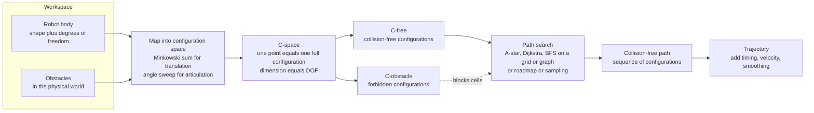

# 🗺️ Configuration Space and Motion Planning

> [!abstract] TL;DR
> **Motion planning** is the problem of finding a *collision-free* path that takes a robot from a start to a goal while respecting its geometry and constraints. The key idea that makes it tractable is the **configuration space** (**C-space**): instead of reasoning about the robot's complicated shape sweeping through the world, you represent the *entire robot as a single point* whose coordinates are its degrees of freedom. Workspace obstacles map into forbidden regions (**C-obstacle**); everything else is the free space (**C-free**); and planning collapses to the classic problem of routing a **dot through a maze**. This note sets up the whole Motion Planning & Perception section — the sampling planners (RRT/PRM), trajectory optimization, and SLAM that follow are all built on top of this one abstraction.

---

## Intuition

**Analogy — moving a couch through a doorway.** When you wrestle a couch into an apartment, you do not model every atom of the couch against every splinter of the door frame. You think about a much smaller thing: the couch's *position* (how far in, how far over) **and** its *angle*, and whether **that particular combination** fits. Tilt it and slide it — the same couch that jams at 0° glides through at 30°. What you are really doing, without knowing it, is searching a three-dimensional space whose axes are *x, y, and rotation*, looking for a continuous sequence of "positions-plus-angles" that stays out of the walls.

Motion planning's central trick is exactly this: **stop thinking about the robot's shape moving in the world, and instead treat the whole robot as a single point moving through an abstract configuration space.** Every axis of that space is one joint or one freedom of the robot. A robot arm with two joints lives in a 2-D space of angle-pairs; the couch lives in a 3-D space; a humanoid lives in a 30-plus-dimensional space. In that space the robot is just a **dot**, obstacles in the world become **forbidden blobs**, and "find a safe motion" becomes "find a path for the dot from the start blob-free region to the goal, without ever entering a forbidden blob." A hard geometry problem has become a graph-search-through-a-maze problem — one we already know how to solve.

---

## How It Works

### Core mechanics

1. **Define a configuration.** A *configuration* `q` is the minimal set of numbers that pins down every part of the robot: the joint angles of an arm `(θ₁, …, θₙ)`, or the pose `(x, y, θ)` of a mobile robot. The number of these numbers is the robot's **degrees of freedom (DOF)**.
2. **Build the configuration space.** The **C-space** is the set of *all* configurations. Each point in it is one complete robot pose, and its dimension equals the DOF. The robot's messy shape has been traded for a single point in a higher-dimensional space.
3. **Map obstacles into C-space.** A workspace obstacle forbids every configuration in which the robot *touches* it. That set of forbidden configurations is the **C-obstacle**. For a robot that only translates, the C-obstacle is the workspace obstacle **grown (dilated) by the robot's shape** — the **Minkowski sum** — which shrinks the robot to a *point*. For an articulated arm there is no closed form, so you **sweep** joint angles and test each configuration for collision.
4. **Split C-space into free and blocked.** Everything not in a C-obstacle is **C-free**. Motion planning is now: find a continuous curve inside C-free connecting `q_start` to `q_goal`.
5. **Search for a path.** Discretize C-free into a **grid or graph** and run graph search — **A\***, **Dijkstra**, or **BFS** — or build a roadmap (visibility graph, cell decomposition) or sample it (PRM/RRT). The output is a sequence of collision-free configurations.
6. **Turn the path into a trajectory.** A path is pure geometry; a *trajectory* adds timing, velocity, and smoothing so the robot can actually execute it.

### Flow / Architecture



---

## Key Concepts

### 🟢 Secondary — the plain-language picture

- **Configuration.** One complete snapshot of the robot's pose — all its joint angles, or its position and heading. One configuration, one number for each way it can move.
- **Configuration space (C-space).** The space of *all possible* configurations. Each point is one whole robot pose; the space has one axis per degree of freedom.
- **The robot becomes a point.** In C-space the entire robot — however complicated its body — is a single dot. This is the whole payoff.
- **Free space vs obstacle space.** **C-free** = configurations where the robot hits nothing; **C-obstacle** = the forbidden configurations where it would collide.
- **Motion planning = maze for a dot.** Find a continuous path for that dot from start to goal without ever crossing into a forbidden region.

### 🟡 Undergraduate — the working machinery

- **Mapping obstacles to C-space.** For a *translating* robot, the C-obstacle is the workspace obstacle **dilated by the robot's shape** — the Minkowski sum `O ⊕ (−R)` — which lets you treat the robot as a point. For an *articulated* robot there is no tidy formula: you sweep the joint variables and collision-check each configuration.
- **Planning as graph search.** Overlay a grid on C-free (or build a roadmap graph) and run **A\*** / **Dijkstra** / **BFS**. The heuristic in A\* is a distance in C-space; edge costs are step lengths.
- **Families of planners.**
  - **Combinatorial / exact** — visibility graphs, exact cell decomposition, exact roadmaps. Capture the true connectivity of C-free; *complete* but scale terribly.
  - **Grid / search-based** — discretize and run A\*/Dijkstra; simple and *resolution-complete*.
  - **Potential fields** — flow downhill on an artificial "goal-attracts, obstacles-repel" potential; fast but prone to local minima.
  - **Sampling-based** — PRM and RRT (next in this section) never build C-space explicitly.
- **Holonomic vs nonholonomic.** A *holonomic* robot can instantaneously move in any C-space direction (an omni-wheel platform); a *nonholonomic* one cannot (a car can't slide sideways). Nonholonomic constraints restrict *which* paths in C-free are actually executable.

### 🔴 Graduate — the deep structure

- **Curse of dimensionality.** The volume of C-space — and the number of grid cells — grows **exponentially** with DOF: a resolution of `k` per axis gives `kⁿ` cells for `n` DOF. At 6+ DOF, *explicitly building* C-space or gridding it is hopeless. This single fact is the reason sampling-based planners exist: they probe C-free with collision checks and never represent it in full.
- **C-space topology.** C-space is generally a **manifold, not flat ℝⁿ**. A single revolute joint's C-space is a circle `S¹`; an `n`-joint arm lives on an `n`-torus `(S¹)ⁿ`; a planar mobile robot lives in `SE(2)`, a free-flying rigid body in `SE(3)`. Planners must respect wraparound (359° is adjacent to 1°) and use the correct **metric** on the manifold — Euclidean distance on angles is wrong across the seam.
- **Completeness hierarchy.** A planner is **complete** if it always finds a path when one exists (and reports failure otherwise); **resolution-complete** if it does so *once the grid is fine enough*; **probabilistically complete** if the probability of finding a path → 1 as samples → ∞ (PRM/RRT). Stronger guarantees cost more computation.
- **Intrinsic hardness.** The **generalized mover's problem** (planning for a many-linked robot) is **PSPACE-hard** (Reif, 1979); exact algorithms (Schwartz–Sharir) are doubly exponential in DOF. This intractability is *why* the field pivoted from exact methods to sampling and optimization.
- **Narrow passages.** Where C-free pinches to a thin corridor, grids miss it unless extremely fine and random sampling rarely lands inside it — the dominant failure mode of practical planners.

---

## Python Demo

Two constructions of a configuration space, each followed by an **A\*** search of C-free. **Part A** — a *translating disk robot* among circular obstacles: the C-obstacle is each obstacle **dilated by the robot radius** (a Minkowski sum), which collapses the robot to a *point*, and we plan on the 2-D position C-space. **Part B** — a *2-link planar arm*: we **sweep** the joint angles `(θ₁, θ₂)`, mark every colliding pair to draw the C-obstacle region on the angle-torus, then A\* a path across it and map the found path back to the arm sweeping in the workspace.

```python
# Configuration space and motion planning:
#   Part A - translating disk robot  -> C-obstacle = obstacle dilated by robot radius (Minkowski sum),
#            robot becomes a POINT, plan on 2-D (x,y) C-space.
#   Part B - 2-link planar arm       -> sweep (theta1,theta2), mark colliding configs,
#            plan A* across the free angle-torus, map path back to the workspace.
import numpy as np
import matplotlib.pyplot as plt
import heapq

# ------------------------- A* on a grid (shared by both parts) -------------------------
def astar(passable, start, goal, wrap=False):
    """8-connected A* over a boolean 'passable' grid. wrap=True treats axes as circular (torus)."""
    n0, n1 = passable.shape
    def neighbors(node):
        i, j = node
        for di in (-1, 0, 1):
            for dj in (-1, 0, 1):
                if di == 0 and dj == 0:
                    continue
                ni, nj = i + di, j + dj
                if wrap:
                    ni %= n0; nj %= n1
                elif not (0 <= ni < n0 and 0 <= nj < n1):
                    continue
                if passable[ni, nj]:
                    yield (ni, nj), np.hypot(di, dj)
    def h(node):                                   # admissible (toroidal) Euclidean heuristic
        di, dj = abs(node[0] - goal[0]), abs(node[1] - goal[1])
        if wrap:
            di, dj = min(di, n0 - di), min(dj, n1 - dj)
        return np.hypot(di, dj)
    openpq = [(h(start), 0.0, start)]
    came, g = {start: None}, {start: 0.0}
    while openpq:
        _, gc, node = heapq.heappop(openpq)
        if node == goal:
            path = []
            while node is not None:
                path.append(node); node = came[node]
            return path[::-1]
        if gc > g.get(node, np.inf):
            continue
        for nxt, cost in neighbors(node):
            ng = gc + cost
            if ng < g.get(nxt, np.inf):
                g[nxt], came[nxt] = ng, node
                heapq.heappush(openpq, (ng + h(nxt), ng, nxt))
    return None

# =========================== PART A: translating disk robot ===========================
N = 120
xs = np.linspace(0, 10, N)
ys = np.linspace(0, 10, N)
robot_r = 0.6                                          # disk robot radius
obstaclesA = [(3.0, 3.0, 1.0), (6.5, 6.0, 1.2), (5.0, 2.0, 0.8), (7.6, 3.6, 0.7)]  # (cx, cy, R)

XX, YY = np.meshgrid(xs, ys, indexing='ij')           # XX[i,j]=xs[i], YY[i,j]=ys[j]
free_A = np.ones((N, N), dtype=bool)
for cx, cy, R in obstaclesA:                           # MINKOWSKI SUM: grow obstacle by robot radius,
    free_A &= (np.hypot(XX - cx, YY - cy) >= R + robot_r)   #   robot is now a point
free_A &= (XX >= robot_r) & (XX <= 10 - robot_r) & (YY >= robot_r) & (YY <= 10 - robot_r)  # wall clearance

to_idx = lambda x, y: (int(round(x / 10 * (N - 1))), int(round(y / 10 * (N - 1))))
startA, goalA = to_idx(1.0, 1.0), to_idx(9.0, 9.0)
pathA = astar(free_A, startA, goalA, wrap=False)
print("Part A  start free:", free_A[startA], " goal free:", free_A[goalA],
      " path cells:", len(pathA) if pathA else None)

# =========================== PART B: 2-link planar arm ===========================
L1, L2 = 1.0, 1.0
M = 180
th = np.linspace(0, 2 * np.pi, M, endpoint=False)      # angle samples, circular
T1, T2 = np.meshgrid(th, th, indexing='ij')            # config grid (theta1, theta2)
ex,   ey   = L1 * np.cos(T1),        L1 * np.sin(T1)               # elbow position
endx, endy = ex + L2 * np.cos(T1 + T2), ey + L2 * np.sin(T1 + T2)  # end-effector position
obstaclesB = [(0.75, 1.10, 0.35), (-1.10, 0.55, 0.30)]            # (cx, cy, R)

def seg_dist(cx, cy, x0, y0, x1, y1):                  # elementwise distance from point to segment
    dx, dy = x1 - x0, y1 - y0
    L = dx * dx + dy * dy
    t = np.clip(((cx - x0) * dx + (cy - y0) * dy) / np.where(L > 0, L, 1.0), 0.0, 1.0)
    return np.hypot(cx - (x0 + t * dx), cy - (y0 + t * dy))

free_B = np.ones((M, M), dtype=bool)
for cx, cy, R in obstaclesB:                           # SWEEP: a config collides if either link hits an obstacle
    d1 = seg_dist(cx, cy, 0.0, 0.0, ex, ey)            # base  -> elbow
    d2 = seg_dist(cx, cy, ex, ey, endx, endy)          # elbow -> end-effector
    free_B &= (d1 >= R) & (d2 >= R)

cfg_idx = lambda t1, t2: (int(round(t1 / (2 * np.pi) * M)) % M, int(round(t2 / (2 * np.pi) * M)) % M)
startB, goalB = cfg_idx(0.0, 0.0), cfg_idx(1.4, 0.2)
pathB = astar(free_B, startB, goalB, wrap=True)        # torus search (angles wrap around)
print("Part B  start free:", free_B[startB], " goal free:", free_B[goalB],
      " path cells:", len(pathB) if pathB else None)

# =============================== PLOTS ===============================
fig, ax = plt.subplots(2, 2, figsize=(12, 10))

# --- A: workspace (disk robot + dilated-into-point) ---
for cx, cy, R in obstaclesA:
    ax[0, 0].add_patch(plt.Circle((cx, cy), R, color='0.35'))
if pathA:
    px = [xs[p[0]] for p in pathA]; py = [ys[p[1]] for p in pathA]
    ax[0, 0].plot(px, py, '-', color='tab:green', lw=2, label='robot-center path')
    for k in range(0, len(pathA), max(1, len(pathA) // 8)):     # draw the disk body along the path
        ax[0, 0].add_patch(plt.Circle((xs[pathA[k][0]], ys[pathA[k][1]]), robot_r,
                                      color='tab:blue', alpha=0.20))
ax[0, 0].plot(xs[startA[0]], ys[startA[1]], 'ks', ms=9, label='start')
ax[0, 0].plot(xs[goalA[0]],  ys[goalA[1]],  'k*', ms=14, label='goal')
ax[0, 0].set_title('A: Workspace - disk robot (radius %.1f)' % robot_r)
ax[0, 0].set_xlim(0, 10); ax[0, 0].set_ylim(0, 10); ax[0, 0].set_aspect('equal'); ax[0, 0].legend(fontsize=8)

# --- A: C-space (robot is a POINT, obstacles dilated by robot_r) ---
ax[0, 1].imshow(free_A.T, origin='lower', extent=[0, 10, 0, 10], cmap='Greys_r', alpha=0.35)
for cx, cy, R in obstaclesA:
    ax[0, 1].add_patch(plt.Circle((cx, cy), R + robot_r, fill=False, ec='tab:red', lw=1.5, ls='--'))
if pathA:
    ax[0, 1].plot([xs[p[0]] for p in pathA], [ys[p[1]] for p in pathA], '-', color='tab:green', lw=2)
ax[0, 1].plot(xs[startA[0]], ys[startA[1]], 'ks', ms=9)
ax[0, 1].plot(xs[goalA[0]],  ys[goalA[1]],  'k*', ms=14)
ax[0, 1].set_title('A: C-space - robot is a POINT, C-obstacle = dilated obstacle')
ax[0, 1].set_xlim(0, 10); ax[0, 1].set_ylim(0, 10); ax[0, 1].set_aspect('equal')

# --- B: workspace (arm poses swept along the path) ---
for cx, cy, R in obstaclesB:
    ax[1, 0].add_patch(plt.Circle((cx, cy), R, color='0.35'))
if pathB:
    step = max(1, len(pathB) // 12)
    for k in range(0, len(pathB), step):
        t1, t2 = th[pathB[k][0]], th[pathB[k][1]]
        elx, ely = L1 * np.cos(t1), L1 * np.sin(t1)
        enx, eny = elx + L2 * np.cos(t1 + t2), ely + L2 * np.sin(t1 + t2)
        ax[1, 0].plot([0, elx, enx], [0, ely, eny], '-o', color='tab:blue',
                      alpha=0.2 + 0.8 * k / len(pathB), lw=1.5, ms=3)
ax[1, 0].set_title('B: Workspace - 2-link arm sweeping start -> goal')
ax[1, 0].set_xlim(-2.2, 2.2); ax[1, 0].set_ylim(-2.2, 2.2); ax[1, 0].set_aspect('equal')

# --- B: C-space torus (colliding configs = C-obstacle) ---
ax[1, 1].imshow(free_B.T, origin='lower', extent=[0, 360, 0, 360], cmap='Greys_r', alpha=0.7)
if pathB:                                              # points (not lines) so torus-wrap does not draw seams
    ax[1, 1].plot([np.degrees(th[p[0]]) for p in pathB], [np.degrees(th[p[1]]) for p in pathB],
                  '.', color='tab:green', ms=2.5, label='path')
ax[1, 1].plot(np.degrees(th[startB[0]]), np.degrees(th[startB[1]]), 'cs', ms=9, label='start')
ax[1, 1].plot(np.degrees(th[goalB[0]]),  np.degrees(th[goalB[1]]),  'y*', ms=14, label='goal')
ax[1, 1].set_title('B: C-space (theta1, theta2) - dark = C-obstacle')
ax[1, 1].set_xlabel('theta1 [deg]'); ax[1, 1].set_ylabel('theta2 [deg]'); ax[1, 1].legend(fontsize=8)

plt.tight_layout(); plt.show()
```

**Part A** shows the disk robot in the workspace (left) and the same problem in C-space (right), where every obstacle has been grown by the robot radius (dashed red) so the robot is a single point sliding between the inflated blobs — the Minkowski-sum construction that reduces the robot to a point. **Part B** shows the arm sweeping from the rightward start pose to the goal (left) and the corresponding path threading the free region of the `(θ₁, θ₂)` torus (right), where the dark bands are the C-obstacle — the configurations in which a link would strike a circle. In both cases A\* searched only C-free.

---

## Real-World Applications

- **Industrial-arm planning (MoveIt / OMPL).** Robot arms plan around clutter in a 6-or-7-DOF C-space using sampling planners layered directly on the C-free / C-obstacle abstraction defined here; collision checking against a scene model is the inner loop.
- **Autonomous vehicles & mobile robots.** A car plans in an `SE(2)` configuration space `(x, y, θ)` subject to *nonholonomic* steering limits; warehouse AGVs and vacuum robots plan on discretized grids with A\*/Dijkstra — the search-based branch of this note.
- **Video-game and simulation NPCs.** Pathfinding on a navigation mesh or grid is exactly A\* over a 2-D C-free — the same algorithm, a translating point-agent, no manipulator in sight.
- **CNC machining & 3-D printing.** Tool-path generation is motion planning for the tool's configuration around the workpiece, avoiding gouges (C-obstacles).
- **Computational biology.** Protein folding and ligand docking are planning problems in a C-space of dihedral (torsion) angles — a high-dimensional torus, with the curse of dimensionality in full force.

---

## Common Pitfalls

- **Curse of dimensionality.** Trying to grid a high-DOF C-space: cells scale as `kⁿ`, so a 6-DOF arm at 100 samples/axis is `10¹²` cells — unstorable. Beyond ~3–4 DOF, abandon explicit grids for sampling-based planners.
- **Computing C-space explicitly.** Except for translating robots (Minkowski sum) and low-DOF arms, the C-obstacle has **no closed form**. Do *not* try to build it; check collisions *on demand* at sampled configurations instead.
- **Narrow passages.** A thin corridor of C-free (tight clearance) is missed by coarse grids and rarely hit by uniform random samples, so the planner reports "no path" when one exists. Needs finer resolution, bridge/Gaussian sampling, or biased strategies.
- **Completeness vs resolution.** A grid planner is only *resolution-complete*: too coarse a grid can step *over* a thin C-obstacle (false "free") or miss a thin C-free passage (false "blocked"). Refining the resolution changes the answer — always know which guarantee you have.
- **Discretization artifacts.** Grid paths are jagged and 45°-staircased; two consecutive collision-free grid cells may hide a collision *between* them if only the cell centers are tested. Post-smooth the path and use continuous (swept-volume) collision checks along edges, not just at nodes.
- **Forgetting C-space topology.** Treating a revolute joint's angle as flat `[0, 2π)` instead of a circle makes the planner think 359° and 1° are far apart, wasting the shortest route across the seam. Use the toroidal metric.
- **Path is not a trajectory.** A geometric C-free path ignores velocity, acceleration, and nonholonomic limits. Executing it verbatim can demand infeasible motions — it must be time-parameterized and smoothed first.

---

## Related Concepts

- [[Inverse_Kinematics]] — converts a task-space goal ("put the hand here") into the C-space goal configuration a planner searches toward; planning and IK are complementary halves of getting an arm somewhere.
- [[A_Star_Search]] — the workhorse graph search run over a discretized C-free; the heuristic is a C-space distance.
- [[Dijkstra]] — the uniform-cost / zero-heuristic version used when no good C-space heuristic exists.
- [[BFS]] — unweighted grid search; the simplest *resolution-complete* planner on a uniform C-space grid.
- [[Graph_Representation]] — C-free discretized into a grid or roadmap *is* a graph; representation choice drives search cost.
- [[Topological_Spaces]] — C-space is a topological manifold (a torus for revolute joints, `SE(2)`/`SE(3)` for mobile/free-flying robots); connectivity of C-free is what determines path existence.
- [[Metric_Spaces]] — planning needs a distance function on C-space for heuristics and nearest-neighbor queries; the right metric respects angle wraparound.
- [[Vectors_and_Vector_Spaces]] — configurations are vectors of DOF, the coordinates in which the whole problem is posed.
- [[Groups_and_Subgroups]] — rigid-body configurations form the Lie groups `SE(2)` and `SE(3)`; composing motions is group multiplication.
- [[Convex_Hull]] — Minkowski sums and polygon collision tests (the geometry of C-obstacles) build on convex-hull machinery.
- [[Line_and_Polygon_Algorithms]] — segment-vs-obstacle intersection, the primitive inside every collision check.
- [[Gradient_Descent]] — potential-field planning and downstream trajectory optimization descend a cost surface over C-space.

---

## Review Questions

### 🟢 Secondary
1. Using the couch-through-a-doorway picture, explain what "reducing the robot to a point" means, and why finding a safe motion becomes "guiding a dot through a maze." What are the axes of that maze for a two-jointed arm?

### 🟡 Undergraduate
2. A circular robot of radius `r` must navigate among polygonal obstacles. Describe precisely how to build the C-space so the robot can be treated as a point, and explain why this construction (the Minkowski sum) fails to have a simple closed form once the robot is a two-link arm instead.
3. You discretize C-free into a grid and run A\* versus Dijkstra versus BFS. What does each guarantee about the returned path, what does "resolution-complete" mean here, and give one concrete way a too-coarse grid can return a *wrong* answer.

### 🔴 Graduate
4. A 7-DOF arm cannot be planned by gridding its C-space. Quantify why (state how cell count scales with DOF and resolution) and explain how this "curse of dimensionality" motivates sampling-based planners that never construct C-space explicitly. What weaker completeness guarantee do they offer in exchange?
5. The generalized mover's problem is PSPACE-hard, and revolute-joint C-space is an `n`-torus rather than flat `ℝⁿ`. Explain how *both* facts — intrinsic hardness and non-Euclidean topology — shape the design of a practical planner (choice of algorithm, distance metric, and completeness target), and where narrow passages threaten it.

---

## Sources

- [LaValle, S. M. — *Planning Algorithms* (Cambridge, 2006; full text free online)](http://lavalle.pl/planning/)
- Choset, H. et al. — *Principles of Robot Motion: Theory, Algorithms, and Implementations* (MIT Press, 2005).
- Latombe, J.-C. — *Robot Motion Planning* (Kluwer, 1991).
- [Lynch, K. M. & Park, F. C. — *Modern Robotics: Mechanics, Planning, and Control* (Cambridge, 2017; free book + course)](https://modernrobotics.northwestern.edu/nu-gm-book-resource/)
- Reif, J. H. — "Complexity of the Mover's Problem and Generalizations" (FOCS, 1979) — the PSPACE-hardness result.

---

#robotics #motion-planning #configuration-space #path-planning #collision-avoidance
